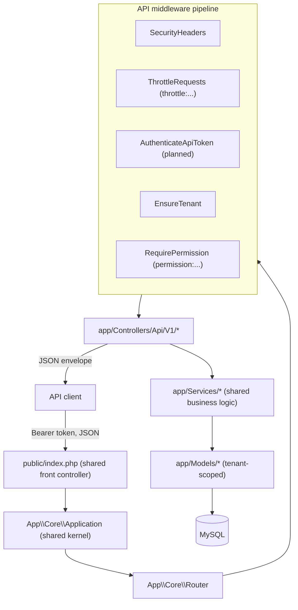

# 29 — API Architecture (معمارية الـ API)

The design of the HalaOps REST API: a versioned `/api/v1` surface, token authentication via `api_tokens`, the same RBAC and tenant scoping as the web app, a consistent JSON envelope and error format, rate limiting, pagination, idempotency, and webhooks.

> **Status: Planned module.** The web kernel, router, middleware pipeline, tenancy, and RBAC that the API builds on are **already implemented**; the `api_tokens` table is defined in the canonical schema (§11, table 34). This document specifies the design so the module can be built consistently with the existing core. Where a behaviour relies on a class not yet written, it is described as planned and reuses the established patterns.

## Related Documents

- [30 — Frontend Architecture](30-Frontend-Architecture.md)
- [31 — Backend Architecture](31-Backend-Architecture.md)
- [34 — Security](34-Security.md)
- [10 — Authorization](10-Authorization.md)
- [07 — RBAC](07-RBAC.md)
- [08 — Multi-Tenant](08-Multi-Tenant.md)
- [03 — System Architecture](03-System-Architecture.md)

---

## Purpose (الهدف)

This document specifies how external clients (mobile apps, customer integrations, partner systems, automation) interact with HalaOps programmatically. It defines the URL scheme, authentication, authorization, tenant scoping, request/response envelope, error contract, rate limiting, pagination, idempotency, and webhooks — so the API is **predictable, secure, and identical in its rules to the web application**.

## Why It Exists (سبب وجوده)

HalaOps is an HR/recruitment platform sold to thousands of companies. Those companies need to:

- pull candidates/applications into their existing ATS or BI tools,
- push job postings from their own career sites,
- automate workflows (e.g. trigger an AI interview when an application reaches a stage),
- build mobile or partner experiences on top of the platform.

A first-class REST API exists so all of that happens through a **stable, versioned, token-authenticated contract** rather than scraping HTML. Crucially, the API must reuse the **same security and isolation guarantees** as the UI — the same RBAC permissions, the same fail-closed tenant scoping, the same audit trail — so there is no "back door" with weaker rules. Building it on the existing kernel (`App\Core\Application`, `Router`, the middleware pipeline) guarantees that.

## Architecture

### Shared kernel, separate route file

The API is **not a separate application**. It runs through the same front controller (`public/index.php`) and kernel (`Application::handle()`), reusing the router, container, `Database`/`QueryBuilder`, `Model` tenant scoping, and `AccessControl`. The only API-specific pieces are:

- a new **`routes/api.php`** loaded under an `/api/v1` group,
- an **`AuthenticateApiToken`** middleware (token instead of session),
- API **controllers** under `app/Controllers/Api/V1/`,
- a thin **response/resource** convention for the JSON envelope.



### Route group shape (planned `routes/api.php`)

```php
$router->group(['prefix' => 'api/v1', 'middleware' => ['security', 'throttle:60,60', 'api']], function ($router): void {
    // 'api' alias → AuthenticateApiToken (resolves token, sets auth + tenant)
    $router->get('jobs', [JobApiController::class, 'index'])->middleware('permission:jobs.view');
    $router->post('jobs', [JobApiController::class, 'store'])->middleware('permission:jobs.create');
    $router->get('jobs/{id}', [JobApiController::class, 'show'])->middleware('permission:jobs.view');
    // ...applications, interviews, evaluations, etc.
});
```

This mirrors the existing `routes/web.php` style exactly (groups with `prefix`/`middleware`, per-route `permission:` and `throttle:` aliases). Note the API group **omits `csrf`** — CSRF protection is a cookie-session concern; token-authenticated, non-cookie requests are not subject to CSRF and instead rely on the bearer token.

### Versioning

- The version lives in the **path**: `/api/v1/...`. A breaking change ships as `/api/v2` with `v1` kept until deprecation.
- Within a version, changes are **additive only** (new fields, new endpoints). Removals/renames require a new version.
- A response header `X-HalaOps-Api-Version: 1` echoes the served version.

### Authentication — `api_tokens`

Tokens are stored in the **`api_tokens`** table (canonical §11.34): `id, user_id→users(CASCADE), company_id(NULL), name, token_hash(UQ), abilities JSON, last_used_at, expires_at, created_at`.

- A token is a random secret (`str_random(64)`-style) shown **once** at creation; only its **hash** is stored (`token_hash`), so a DB leak does not expose usable tokens.
- The client sends it as `Authorization: Bearer <token>` (`Request::bearerToken()` already extracts this).
- `AuthenticateApiToken` (planned) hashes the presented token, looks it up by `token_hash`, rejects if missing/expired, loads the owning `User` into `AuthManager`, updates `last_used_at`, and — when the token carries a `company_id` — sets the active tenant via `TenantManager::setById()`.
- A token may be **company-scoped** (`company_id` set ⇒ acts within exactly one tenant) or **user-scoped** (`company_id` NULL ⇒ the caller selects a tenant per request via an `X-Company-Id` header, validated against the user's active memberships, exactly as the web `companies/switch` flow validates).

### Authorization — same RBAC

The API does **not** invent a permission model. After `AuthenticateApiToken` establishes the user + tenant, the same `RequirePermission` middleware (`permission:jobs.view`) and the same `AccessControl` engine apply. Effective permissions are the union of the user's global and tenant roles (expanded up the `parent_id` chain), super admins bypass. Additionally, a token's `abilities` JSON can **narrow** (never widen) what an otherwise-permitted token may do — the effective grant is `RBAC ∩ token.abilities`.

### Tenant scoping — same fail-closed model

Every API data query runs through `App\Core\Model`, so the `WHERE company_id = ?` filter is automatic and **fail-closed**: a tenant-scoped query with no active tenant throws. A company-scoped token has its tenant set at auth time; a user-scoped token must supply a valid `X-Company-Id`, or tenant-scoped endpoints return `409 no_active_company` (the same signal `EnsureTenant` gives the web app). Cross-tenant access is impossible through the API — there is no exposed `withoutTenantScope()` path. See [08 — Multi-Tenant](08-Multi-Tenant.md).

## Workflow

### Authenticated request lifecycle

```mermaid
sequenceDiagram
    actor Client
    participant K as Kernel/Router
    participant TH as ThrottleRequests
    participant TOK as AuthenticateApiToken
    participant TEN as EnsureTenant
    participant PERM as RequirePermission
    participant Ctrl as Api\\V1 Controller
    participant Svc as Service
    participant M as Model (tenant-scoped)
    participant DB as MySQL

    Client->>K: GET /api/v1/jobs (Bearer token, Accept: application/json)
    K->>TH: rate-limit by token/IP
    TH->>TOK: ok
    TOK->>DB: lookup api_tokens by token_hash
    DB-->>TOK: row (user_id, company_id, abilities, expires_at)
    TOK->>TOK: load User → AuthManager; setById(company_id); touch last_used_at
    TOK->>TEN: next
    TEN->>PERM: tenant active → next
    PERM->>PERM: access()->allows('jobs.view') ∧ token ability
    PERM->>Ctrl: index(request)
    Ctrl->>Svc: list jobs (filters, pagination)
    Svc->>M: Job::query()->paginate(...)  (company_id auto-applied)
    M->>DB: prepared SELECT ... WHERE company_id = ?
    DB-->>M: rows
    M-->>Svc: data
    Svc-->>Ctrl: paginator
    Ctrl-->>Client: 200 { data: [...], meta: {...} }
```

### Token issuance

1. A user with the right permission creates a token from the UI (planned API-tokens screen) — naming it, optionally scoping it to a company and to a subset of `abilities`, optionally with an expiry.
2. The server generates the secret, stores `token_hash` (never the plaintext), and returns the plaintext **once**.
3. The client stores it securely and sends it as a bearer token thereafter.
4. Revocation deletes the row; expiry is enforced on every request.

## Business Rules

1. **Versioned path.** All endpoints live under `/api/v1`; breaking changes go to a new version, never mutate an existing one.
2. **Bearer-token only.** No cookies/sessions for the API; authentication is `Authorization: Bearer <token>` validated against `api_tokens.token_hash`.
3. **Same RBAC + tenancy.** API authorization and isolation are identical to the web app; tokens can only **narrow** access via `abilities`, never escalate.
4. **JSON in, JSON out.** Requests use `Content-Type: application/json` (auto-parsed by `Request`); responses are always JSON with the standard envelope.
5. **Consistent envelope.** Success and error responses follow fixed shapes (below); status codes are meaningful (200/201/204/400/401/403/404/409/422/429/500).
6. **Idempotent creates.** `POST` endpoints honour an `Idempotency-Key` header to make retries safe.
7. **Rate-limited.** Every endpoint is throttled; limits are surfaced via `X-RateLimit-*` headers and `429` + `Retry-After` on exhaustion.
8. **Paginated lists.** Collections are always paginated; clients must follow `meta`/`links`, never assume the full set.
9. **Audited.** State-changing API calls write to `activity_log` with the acting user, subject, and IP, exactly like UI actions.

### Response envelopes

**Success (single):**
```json
{ "data": { "id": 12, "title": "Senior PHP Engineer", "status": "open" } }
```

**Success (collection, paginated):**
```json
{
  "data": [ { "id": 12, "title": "Senior PHP Engineer" } ],
  "meta": { "total": 87, "per_page": 15, "current_page": 1, "last_page": 6, "from": 1, "to": 15 },
  "links": { "first": "/api/v1/jobs?page=1", "next": "/api/v1/jobs?page=2", "prev": null, "last": "/api/v1/jobs?page=6" }
}
```
The `meta` block maps 1:1 onto `QueryBuilder::paginate()`'s return (`total`, `per_page`, `current_page`, `last_page`, `from`, `to`, `has_more`), so no new pagination logic is required.

**Error:**
```json
{ "error": { "code": "validation_failed", "message": "The given data was invalid.", "details": { "title": ["The title field is required."] } } }
```
- `code` — a stable machine string (`unauthenticated`, `forbidden`, `not_found`, `validation_failed`, `no_active_company`, `rate_limited`, `server_error`).
- `message` — human-readable summary.
- `details` — optional per-field map (for `422`) or extra context.

This reuses the kernel's existing JSON error behaviour: `ValidationException → 422 {message, errors}` and `HttpException → {message}` (the API layer wraps these into the `error` object).

## Database Relations

- **`api_tokens`** (canonical §11.34) — the auth store: `user_id` (FK → `users`, CASCADE), `company_id` (NULL = user-scoped), `name`, `token_hash` (UNIQUE), `abilities` JSON, `last_used_at`, `expires_at`, `created_at`. Indexed on `token_hash` for O(1) lookup.
- **`users`** — the principal a token acts as.
- **`memberships`** — validates that a user-scoped token's `X-Company-Id` is a company the user actively belongs to (same check as `TenantManager::userBelongsTo()`).
- **`roles`/`permissions`/`permission_role`/`membership_role`/`user_role`** — read by `AccessControl` for API authorization (unchanged from the web path).
- **All tenant-bound domain tables** (`jobs`, `applications`, `interviews`, `evaluations`, …) are accessed through tenant-scoped models, so every API read/write carries the `company_id` filter automatically.
- **`gateway_events`** (canonical §11.33) — log for inbound payment webhooks (below).
- **`activity_log`** — API mutations are audited here.

See [05 — Database Architecture](05-Database-Architecture.md) and [06 — ERD](06-ERD.md).

## Permissions

API endpoints are gated by the **same permission keys** as the UI, via `RequirePermission`:

- Jobs: `jobs.view`, `jobs.create`, `jobs.update`, `jobs.delete`, `jobs.publish`.
- Applications: `applications.view`, `applications.update`, `applications.move`, `applications.reject`, `applications.export`.
- Interviews: `interviews.view`, `interviews.schedule`, `interviews.conduct`, `interviews.cancel`.
- Evaluations: `evaluations.view`, `evaluations.create`, `evaluations.manage`.
- Platform/super-admin endpoints: `platform.*`.

A token additionally constrained by `abilities` (e.g. `["jobs.view","applications.view"]`) can do **at most** the intersection of the user's RBAC grant and those abilities. Super admins bypass RBAC but are still bound by their token's abilities. See [10 — Authorization](10-Authorization.md) and [11 — Permissions Matrix](11-Permissions-Matrix.md).

## Validation

- **Body parsing:** `Request::isJson()`/`body()` already decode `application/json` payloads; controllers read via `input()`/`only()`/`all()`.
- **Rules:** the same `App\Core\Validator` rule strings used by web controllers (`required`, `email`, `min`, `max`, `in`, `exists`, `integer`, …); a `ValidationException` is rendered as `422` with `error.code = validation_failed` and per-field `details`.
- **Headers validated:** `Authorization` (required bearer), optional `Idempotency-Key`, optional `X-Company-Id` (must be a numeric id the user belongs to), `Accept: application/json`.
- **Query params** for lists: `page` (≥1), `per_page` (bounded, default 15, hard cap e.g. 100), plus endpoint-specific filters/sorts — all validated and bound (never interpolated into SQL).

## Edge Cases

| Case | Response |
|---|---|
| Missing/garbage bearer token | `401 { error.code: "unauthenticated" }`. |
| Expired token (`expires_at` past) | `401 unauthenticated` (treated as invalid). |
| Valid token, lacks the permission | `403 { error.code: "forbidden" }`. |
| Token ability excludes the endpoint | `403 forbidden` (even if RBAC would allow). |
| User-scoped token with no/invalid `X-Company-Id` on a tenant endpoint | `409 { error.code: "no_active_company" }`. |
| Requesting a resource in another tenant | `404 not_found` (tenant scope makes it invisible — no leakage). |
| Rate limit exceeded | `429 { error.code: "rate_limited" }` + `Retry-After` + `X-RateLimit-*`. |
| Validation failure | `422 validation_failed` with `details`. |
| Retried `POST` with a seen `Idempotency-Key` | The original result is returned; no duplicate side effects. |
| Unknown route / wrong method under `/api/v1` | `404 not_found` / `405` (router behaviour), wrapped as JSON. |
| Unhandled server error | `500 { error.code: "server_error" }`; details only when `APP_DEBUG`. |

## Security

- **Hashed tokens at rest** (`token_hash`); plaintext shown once. A DB compromise yields no usable credentials.
- **Bearer over TLS only** — combined with HSTS (`SecurityHeaders` over HTTPS) tokens never travel in clear; tokens never go in the URL/query string.
- **No CSRF needed / no ambient cookies** — token auth is immune to CSRF; the API group deliberately excludes the `csrf` middleware and does not rely on the session cookie.
- **Same fail-closed tenancy + RBAC** as the UI; `abilities` enforce least privilege per token; expiry + revocation limit blast radius.
- **Rate limiting** (`ThrottleRequests`, keyed by token/IP) blunts credential-stuffing and abuse.
- **Prepared statements** throughout (`QueryBuilder`) — no injection from query params or bodies.
- **Audit trail** for every mutation (`activity_log`) with actor, subject, IP, user-agent.
- **Webhook verification** (below) prevents forged inbound events. See [34 — Security](34-Security.md).

## Performance

- **Indexed token lookup** on `api_tokens.token_hash` (UNIQUE) — single-row auth.
- **Reuses `paginate()`** so list endpoints never return unbounded sets; `per_page` is capped.
- **Lazy DB + per-request RBAC cache** carry over from the core (`AccessControl` caches effective permissions per `userId:companyId`).
- **Thin controllers → shared services → tenant-scoped models** keep query counts low; clients are encouraged to request only needed pages.
- **Conditional requests** (`ETag`/`If-None-Match`) and short-TTL caching can be layered on read endpoints later without contract changes.
- See [35 — Performance](35-Performance.md).

## Testing

- **Auth tests:** missing/invalid/expired token → `401`; valid token loads the right user and sets the tenant; `last_used_at` updated.
- **Authorization tests:** RBAC denial → `403`; token `abilities` narrower than RBAC → `403`; super-admin bypass still bounded by abilities.
- **Tenancy tests:** company-scoped token sees only its tenant's rows; user-scoped token requires valid `X-Company-Id`; cross-tenant id → `404`.
- **Envelope tests:** success single/collection shapes; `meta`/`links` correctness against `paginate()`; error shape and stable `code`s for 401/403/404/409/422/429/500.
- **Idempotency tests:** repeated `POST` with the same key produces one side effect and identical response.
- **Rate-limit tests:** `429` after the limit with `Retry-After`/`X-RateLimit-*`.
- **Webhook tests:** valid signature accepted and recorded in `gateway_events`; invalid signature rejected; replayed event id ignored.
- See [39 — Testing Strategy](39-Testing-Strategy.md).

## Future Expansion

- **Webhooks (outbound):** HalaOps emits signed events (e.g. `application.created`, `interview.completed`, `decision.made`) to tenant-registered URLs, delivered via the `queued_jobs` worker with retries and an HMAC `X-HalaOps-Signature` header; failures land in `failed_jobs`.
- **Webhooks (inbound):** payment-gateway callbacks are received, signature-verified, de-duplicated, and logged in **`gateway_events`** (canonical §11.33) before processing — see [15 — Payment Gateways](15-Payment-Gateways.md).
- **OpenAPI spec + docs:** publish a machine-readable schema and interactive docs generated from the route definitions.
- **Cursor pagination** for very large collections (alongside the current page-based `meta`).
- **Scoped/short-lived tokens & OAuth2 client-credentials** for partner integrations, layered on the `api_tokens.abilities` model.
- **`X-Request-Id` propagation** into logs/`activity_log` for end-to-end tracing.
- **GraphQL gateway** (optional, far future) sitting in front of the same services if integrators demand it.

## Open Questions

- **Token issuance UI/permission:** which permission key gates creating API tokens (a new `api.tokens.manage`?) and whether company-scoped vs user-scoped issuance differ in required privilege — to be finalized when the module is built (consistent with [11 — Permissions Matrix](11-Permissions-Matrix.md)).
- **Default and maximum `per_page`** values per resource — to be tuned against real payload sizes during implementation.
