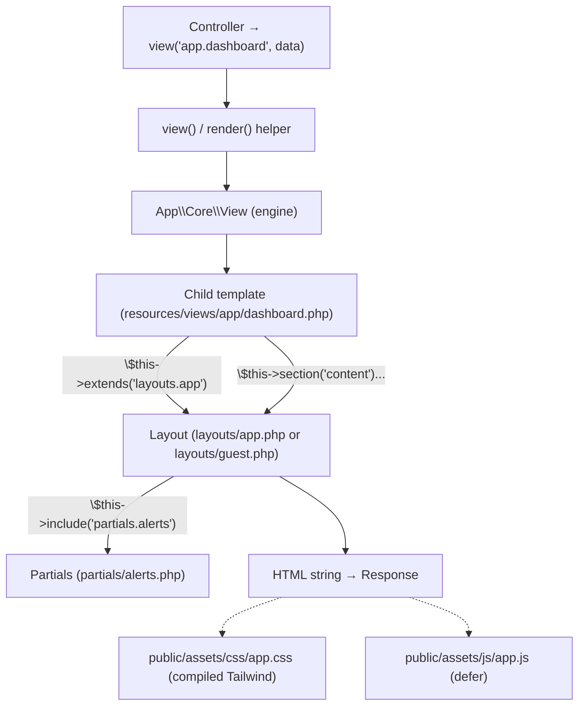
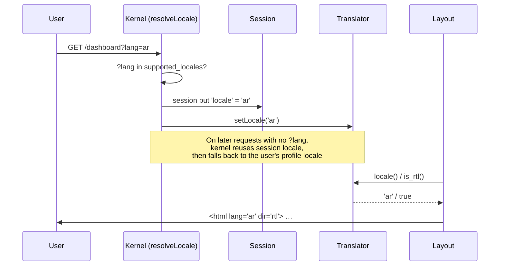

# 30 — Frontend Architecture (معمارية الواجهة الأمامية)

How HalaOps renders its UI: server-rendered plain-PHP templates through the View engine, a pre-compiled Tailwind stylesheet (no build on the buyer's server), vanilla-JS progressive enhancement, and native bilingual RTL/LTR rendering.

## Related Documents

- [29 — API Architecture](29-API-Architecture.md)
- [31 — Backend Architecture](31-Backend-Architecture.md)
- [03 — System Architecture](03-System-Architecture.md)
- [04 — Folder Structure](04-Folder-Structure.md)
- [34 — Security](34-Security.md)

---

## Purpose (الهدف)

This document specifies the **frontend architecture** of HalaOps: the templating model (server-rendered PHP via `App\Core\View`), layout inheritance with sections, the partials/components approach, the compiled Tailwind CSS pipeline, the vanilla-JS progressive-enhancement layer, asset versioning, accessibility, and — central to the product — **bilingual Arabic/English RTL/LTR rendering**. It is the contract for anyone building or editing a screen.

## Why It Exists (سبب وجوده)

HalaOps targets buyers on **shared hosting with no Node/npm/terminal**. That makes a JavaScript SPA build pipeline (Webpack/Vite, `npm run build`) a non-starter on the buyer's machine. The product is also **bilingual and RTL-native**, which most JS UI stacks treat as an afterthought. So the frontend is deliberately:

- **Server-rendered** — HTML is produced by PHP templates, so there is nothing to build at install time and the app works with JavaScript disabled.
- **Tailwind compiled offline** — the design system's power without a server build step; the compiled `public/assets/css/app.css` ships in the repo.
- **Progressively enhanced** — a tiny vanilla `app.js` adds nicety (dropdowns, confirmations) on top of fully-functional HTML, never as a dependency for core flows.
- **RTL/LTR from the root element** — direction and language are decided once in the layout, so every screen is correct in Arabic and English without per-component effort.

This mirrors the canonical principle: *Tailwind CSS compiled to `public/assets/css/app.css`; no build step on the buyer's server, vanilla JS, server-rendered PHP templates.*

## Architecture

### Rendering stack



### The View engine (`App\Core\View`)

A compile-free, plain-PHP template engine. Templates are PHP files under `resources/views/` addressed in dot notation (`auth.login` → `resources/views/auth/login.php`). The engine exposes a small directive set, available as `$this->...` inside any template because each file is `include`d in the engine's object scope:

| Directive | Effect |
|---|---|
| `$this->extends('layouts.app')` | Declare the parent layout; the child's output becomes the layout's `content`. |
| `$this->section('name')` … `$this->endSection()` | Capture a named block (output-buffered). |
| `$this->yield('name', $default)` | Emit a captured section in the layout. |
| `$this->has('name')` | Whether a section was declared. |
| `$this->include('partial', $data)` | Render a partial inline (shares globals + passed data). |

Key behaviours from the implementation:
- **Isolation per render.** `render()` snapshots and resets section/layout state, so nested renders (a partial that itself renders) don't clobber the parent.
- **Implicit content.** A child may either wrap its body in `section('content')`/`endSection()` **or** just echo directly; if no explicit `content` section is declared, the child's raw output is used as `content`. An explicit section is never overwritten.
- **Shared globals.** `View::share()` injects values available to every template; the kernel shares `view` (the engine itself, for `$this->...`) and `appName`.
- **Escaped extraction.** Data is `extract(..., EXTR_SKIP)`ed into the template scope; output is escaped by the template author via the `e()` helper.

### Layouts

Two layouts cover the whole product:

- **`layouts/guest.php`** — auth screens, the installer, and public/landing pages. Minimal: sets `<html lang dir>`, loads the stylesheet/favicon, yields `content` and `scripts`.
- **`layouts/app.php`** — the authenticated application shell: a permission-aware sidebar, a topbar with the company switcher, the language toggle, the user menu, the flash-message partial, and the `content`/`scripts` yields.

The authenticated shell drives the **navigation registry** — an array of `[path, label, permission, built?]` entries. A link renders **only** when the feature is `built` **and** `can($permission)` is true, so the UI never shows dead links or unauthorized sections:

```php
$nav = [
    ['dashboard', 'Dashboard',            'dashboard.view', true],
    ['members',   'Members',              'members.view',   false],
    ['roles',     'Roles & Permissions',  'roles.view',     false],
    ['ai',        'AI Settings',          'ai.view',        false],
    ['billing',   'Billing',              'billing.view',   false],
    ['settings',  'Company Settings',     'settings.view',  false],
];
```

### Components & partials

Reusable UI fragments live in `resources/views/partials/`. Today `partials/alerts.php` renders flashed `status`/`error`/validation messages and is `include`d by the app layout's `<main>`. As the UI grows, shared elements (form fields, buttons, modals, empty/loading states, pagination controls) are added as partials and pulled in with `$this->include('partials.xxx', [...])` — the component model is "PHP partial + Tailwind classes", not a JS component framework.

### Styling — compiled Tailwind

- **Source:** `resources/css/app.css` (Tailwind directives + custom component classes like `.nav-link`, `.btn-ghost`, the `brand` palette).
- **Compiled output:** `public/assets/css/app.css`, committed to the repo and shipped as-is. **No build runs on the buyer's server.**
- **Linked once** in each layout: `<link rel="stylesheet" href="<?= e(asset('css/app.css')) ?>">`.
- Custom utility classes referenced in templates (`nav-link`, `nav-link-active`, `btn-ghost`, `bg-brand-600`, `text-brand-700`) are defined in the source and present in the compiled bundle.

### JavaScript — vanilla progressive enhancement

`public/assets/js/app.js` is a single IIFE, loaded with `defer`. It is **enhancement, not infrastructure** — every page works without it. It currently:
- closes any open `<details>` dropdown on outside-click and on `Escape` (the company switcher and user menu are pure-HTML `<details>` disclosures);
- intercepts form submits carrying `data-confirm` to show a native confirm dialog before destructive actions.

There is no bundler, no framework, no inline event handlers. New behaviour is added as small, delegated listeners in the same file.

### Asset versioning

The `asset()` helper appends a cache-busting query string from `config('app.asset_version')` (env `ASSET_VERSION`, default `1.0.0`): `…/assets/css/app.css?v=1.0.0`. Bumping `ASSET_VERSION` after shipping a new compiled bundle forces browsers to refetch CSS/JS without renaming files.

### Bilingual RTL/LTR rendering

Direction and language are set **once, on the root element**, in both layouts:

```php
<html lang="<?= e(locale()) ?>" dir="<?= is_rtl() ? 'rtl' : 'ltr' ?>">
```

- `locale()` and `is_rtl()` come from `App\Core\Translator`; Arabic ⇒ `dir="rtl"`, English ⇒ `dir="ltr"`.
- Templates use **logical/flow-relative** Tailwind utilities (`border-e`, `border-s`, `text-start`, `end-0`, `ms-*`, `me-*`) so the same markup mirrors correctly in RTL — there are no hard-coded `left`/`right` assumptions.
- Translatable strings are emitted via `__()` from `resources/lang/{en,ar}/`.
- The **language toggle** in the topbar links to the current path with `?lang=ar`/`?lang=en`; the kernel's `resolveLocale()` stores the choice in the session and `setLocale()`s the translator for the rest of the request (and subsequent ones).

## Workflow

### Rendering a page (sequence)

```mermaid
sequenceDiagram
    participant C as Controller
    participant H as view() helper
    participant E as View engine
    participant Child as Child template
    participant Lay as Layout
    participant Part as partials/alerts
    participant Resp as Response

    C->>H: view('app.companies.select', {companies, title})
    H->>E: render('app.companies.select', data)
    E->>E: snapshot+reset sections; merge shared globals
    E->>Child: include child (ob_start)
    Child->>E: $this->extends('layouts.app')
    Child->>E: section('content') ... endSection()
    E->>Lay: include layout (ob_start)
    Lay->>E: read $user, $company; build $nav; filter by can()
    Lay->>Part: $this->include('partials.alerts')
    Part-->>Lay: flash HTML
    Lay->>E: $this->yield('content')
    E-->>H: composed HTML string
    H-->>C: Response (200, HTML)
    C->>Resp: return Response
```

### Locale resolution + direction



## Business Rules

1. **Server renders everything.** Every page is a complete HTML document from a PHP template; JS is never required to render core content.
2. **No server-side build.** The compiled `public/assets/css/app.css` and `public/assets/js/app.js` ship in the repo; nothing is compiled during install or at runtime.
3. **Two layouts, one shell.** Public/auth/installer use `layouts/guest.php`; the authenticated app uses `layouts/app.php`. New pages extend the appropriate layout.
4. **No dead links.** The nav registry renders a link only when the module is `built` and the user `can()` see it.
5. **All output is escaped.** Dynamic values pass through `e()` in templates; raw echoing of user data is forbidden.
6. **Direction comes from the root element.** Never hard-code `left`/`right`; use flow-relative utilities so RTL/LTR are automatic.
7. **Translatable copy uses `__()`** and lives in `resources/lang/{en,ar}/` — no hard-coded user-facing strings that need translation.
8. **CSRF on every form.** Each `<form>` that mutates state includes `csrf_field()`; non-GET methods use `method_field()` for spoofing (`PUT`/`PATCH`/`DELETE`).
9. **Assets are versioned**, always referenced through `asset()` so cache-busting is consistent.

## Database Relations

The frontend has no direct DB access — it renders data handed to it by controllers/services (the model layer enforces tenancy upstream). The few things templates read are already-resolved objects:

- The **authenticated layout** reads `auth()->user()` (from `users`) and `tenant()->company()` (the active `companies` row) for the topbar, and `$user->companies()` (via `memberships`) to render the company switcher.
- The **nav registry** is gated by `can($permission)`, which resolves against `roles`/`permissions`/`permission_role`/`membership_role`/`user_role` in `AccessControl` — but the template only ever sees the boolean. See [05 — Database Architecture](05-Database-Architecture.md) and [07 — RBAC](07-RBAC.md).

## Permissions

- **Navigation visibility** is permission-driven: `dashboard.view`, `members.view`, `roles.view`, `ai.view`, `billing.view`, `settings.view` gate their sidebar entries via `can()`.
- **In-page controls** should likewise be wrapped in `can()` so users never see buttons they cannot use (e.g. a "Create job" button only for `jobs.create`).
- The frontend reflects authorization but does **not** enforce it — every action is independently checked server-side by middleware/services (defense in depth). See [11 — Permissions Matrix](11-Permissions-Matrix.md).

## Validation

- **Display side:** validation errors flashed by the backend are surfaced by `partials/alerts.php` and re-populated into form fields via `old('field')`, so users keep their input after a failed submit.
- **Inputs** use native HTML constraints (`required`, `type="email"`, `minlength`) as a first, non-authoritative pass; the authoritative validation is server-side (`Controller::validate()`), so JS-disabled or crafted requests are still rejected.
- **No client-only validation** is trusted; the UI's role is feedback, not enforcement. See [31 — Backend Architecture](31-Backend-Architecture.md).

## Edge Cases

| Case | Handling |
|---|---|
| JavaScript disabled | All flows work; dropdowns are pure-HTML `<details>` and still open/close; only the click-outside-to-close nicety is lost. |
| Missing template | `View::resolve()` throws a clear `RuntimeException("View [x] not found …")`. |
| Arabic content in a mostly-LTR layout | Root `dir="rtl"` plus flow-relative utilities mirror the whole shell; no per-element overrides needed. |
| Long company/user names | Topbar uses `truncate`/`min-w-0` so layout doesn't break. |
| Flash with no messages | `partials/alerts.php` renders nothing. |
| Stale CSS after a release | Bump `ASSET_VERSION`; the `?v=` string forces a refetch. |
| No active company (chooser/landing) | Layout falls back to showing the app name instead of the switcher. |
| `?lang=` with an unsupported value | Ignored (`resolveLocale()` checks `supported_locales`); current locale stands. |
| Error pages | Rendered from `resources/views/errors/*` (403/404/419/500/generic) using the same escaping, independent of the app shell. |

## Security

- **Output escaping** via `e()` (`htmlspecialchars` with `ENT_QUOTES | ENT_SUBSTITUTE`, UTF-8) on all dynamic values is the primary XSS defense.
- **CSRF tokens** in every state-changing form (`csrf_field()`), plus a `<meta name="csrf-token">` for any future fetch/AJAX writes; verified by `VerifyCsrfToken`.
- **Security headers** applied to every response (`SecurityHeaders`): `X-Content-Type-Options: nosniff`, `X-Frame-Options: SAMEORIGIN`, `Referrer-Policy`, `Permissions-Policy` (camera/mic/geolocation denied), HSTS over HTTPS — these constrain what the frontend can do and how it can be embedded.
- **No inline JS / no third-party CDNs for scripts** — all JS is the local, reviewed `app.js`, keeping the script surface first-party.
- **Assets are local** (`public/assets`), so there is no external dependency that could be tampered with at runtime. See [34 — Security](34-Security.md).

## Performance

- **Single compiled CSS** and a tiny `defer`-loaded JS — two static assets, served by the web server, cached via `?v=`.
- **No client framework / no hydration cost** — the browser parses ready HTML.
- **Compile-free templates** mean no template-cache warmup; OPcache keeps the included PHP hot.
- **Server-side pagination** (`QueryBuilder::paginate()`) keeps list pages small; templates render a page at a time, not full datasets.
- **`preconnect`** hints (e.g. fonts) where used reduce connection latency. See [35 — Performance](35-Performance.md).

## Testing

- **Rendering unit tests:** `View` layout inheritance (child `content` flows into layout), explicit vs implicit `content` section, nested `include` isolation, `yield` defaults, missing-view error.
- **Bilingual tests:** rendering with locale `ar` yields `<html lang="ar" dir="rtl">` and `en` yields `dir="ltr"`; `?lang=ar` persists across requests; flow-relative classes present (no raw `left:`/`right:`).
- **Permission-visibility tests:** sidebar shows only links the user `can()` see and that are `built`; unauthorized/unbuilt links absent.
- **Form tests:** every mutating form contains `_token`; `PUT`/`DELETE` forms contain `_method`; `old()` repopulates after a validation failure.
- **Accessibility checks (QA):** labels/`for` associations, focus order, keyboard operability of `<details>` menus, color-contrast on `brand`/`slate` palette, `Escape` closes menus.
- **No-JS smoke test:** core flows (login, create company, switch company, logout) succeed with scripting disabled.
- See [39 — Testing Strategy](39-Testing-Strategy.md) and [40 — QA Checklist](40-QA-Checklist.md).

## Future Expansion

- **Component partials library**: extract recurring UI (form field, button, modal, table, empty/loading state, pagination) into `resources/views/partials/components/` with a consistent prop convention via `$this->include(..., $data)`.
- **Optional richer interactivity**: drop in a tiny, no-build library (e.g. Alpine.js via a local file) for client state on heavy screens (kanban application pipeline, live AI interview) — still no bundler, still progressive.
- **API-backed widgets**: dashboards can fetch JSON from the planned `/api/v1` ([29](29-API-Architecture.md)) using `fetch` + the `<meta name="csrf-token">`, keeping the page server-rendered with islands of dynamism.
- **Theming per tenant**: company-level branding (logo, brand color) driven by `companies.settings`, applied as CSS variables in the layout.
- **Asset fingerprinting**: move from `?v=` query strings to content-hashed filenames if/when an offline build step is introduced for the design team (still shipped pre-built).
- **More locales**: the `Translator` + `resources/lang/<code>/` + root-element direction model extends to any additional language/RTL script with no template changes.

## Open Questions

None at this time. Whether to introduce a minimal no-build JS helper library for highly-interactive screens (kanban, live interview) is tracked in [45 — Future Roadmap](45-Future-Roadmap.md).
