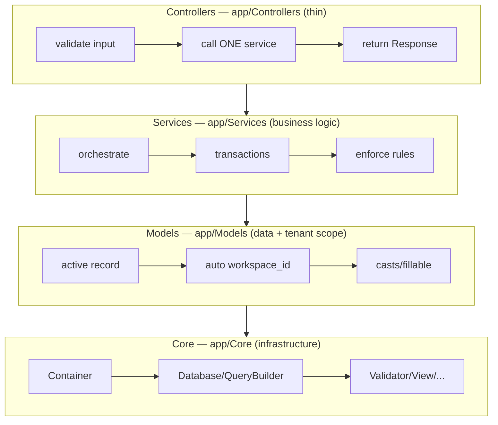
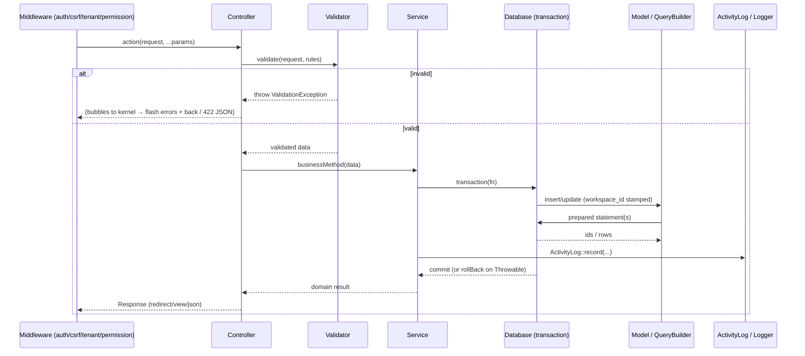

# 31 — Backend Architecture (معمارية الواجهة الخلفية)

How the HalaOps backend is layered — thin controllers over services over models over the core — and the cross-cutting machinery (middleware, dependency injection, transactions, validation, error handling) that holds it together.

## Related Documents

- [03 — System Architecture](03-System-Architecture.md)
- [04 — Folder Structure](04-Folder-Structure.md)
- [29 — API Architecture](29-API-Architecture.md)
- [41 — Coding Standards](41-Coding-Standards.md)
- [08 — Multi-Tenant](08-Multi-Tenant.md)
- [07 — RBAC](07-RBAC.md)
- [34 — Security](34-Security.md)

---

## Purpose (الهدف)

This document specifies the **backend layering and patterns** of HalaOps: the responsibilities of controllers, services, models, and the core; how dependencies are injected via the container; how requests are validated; how database work is wrapped in transactions; how errors propagate and are rendered; and the coding patterns every backend contributor follows. Where [03](03-System-Architecture.md) describes the system at a macro level and [04](04-Folder-Structure.md) describes where files live, **this document describes how backend code should be written**, referencing the real classes that embody each pattern.

## Why It Exists (سبب وجوده)

A no-framework codebase has no opinionated structure to fall back on, so the discipline has to be written down and followed. The layered approach exists to:

- **Keep business rules in one place.** If logic lived in controllers, the same rule (e.g. "creating a workspace provisions roles + a trial subscription") would be duplicated across self-service registration, the in-app flow, and super-admin provisioning. Putting it in `WorkspaceService::create()` means one implementation, one place to test, one place to change.
- **Make tenancy and security structural.** Tenant scoping in the model layer and RBAC in middleware mean a developer cannot *forget* to scope a query or check a permission — the architecture does it.
- **Stay testable without a framework.** Thin controllers + injected singletons + pure-ish services are easy to exercise in isolation.
- **Preserve the upload-only deployment** by depending only on first-party core classes.

## Architecture

### The four backend layers



**Dependency direction is strictly downward.** Controllers may use services and models; services may use models and core; models use core; core uses only itself and PHP/MySQL. Nothing reaches up.

### Layer responsibilities

| Layer | Base / example | Must do | Must NOT do |
|---|---|---|---|
| **Controller** | `App\Core\Controller`; `App\Controllers\App\WorkspaceController` | Read/validate request, call **one** service, pick a `Response` (view/json/redirect), flash messages. | Contain SQL, multi-model orchestration, transactions, or business rules. |
| **Service** | `App\Services\Tenancy\WorkspaceService`, `App\Services\Rbac\AccessControl` | Encode business rules, orchestrate multiple models, run transactions, call external systems (AI providers, mail). | Touch superglobals or render views; depend on HTTP. |
| **Model** | `App\Core\Model`; `App\Models\User` | Map a table to objects, scope tenant queries, cast/fillable/hidden, table-specific query helpers. | Hold cross-aggregate business logic. |
| **Core** | `App\Core\*` | Provide framework plumbing (container, router, DB, validation, view, session, encryption). | Know anything about the domain. |

### The base controller

`App\Core\Controller` gives every action a small, consistent toolkit:

- `view($template, $data, $status)` / `json($data, $status)` — produce responses.
- `redirect($url)` / `redirectRoute($name, $params)` / `back()` — redirects.
- `validate($request, $rules, $messages, $attributes)` — delegates to `Validator::make(...)->validate()`, returning only validated keys.
- `withSuccess($msg)` / `withError($msg)` — flash for the next request.
- `fail($field, $message, $input)` — throw a field-bound `ValidationException` (used e.g. for failed login).

A canonical thin controller (`WorkspaceController::store()`):

```php
public function store(Request $request): Response
{
    $data = $this->validate($request, ['name' => 'required|min:2|max:150']);
    $workspace = (new WorkspaceService())->create(auth()->user(), $data['name']);
    tenant()->setTenant($workspace);
    $this->withSuccess('Workspace "' . $workspace->name . '" created. You are the owner.');
    return $this->redirect(url('dashboard'));
}
```

Validate → one service call → set tenant → flash → redirect. No SQL, no transaction, no rule logic.

### The service layer

Services are plain `final` classes constructed directly (`new WorkspaceService()`) or resolved from the container for the shared ones (`auth`, `tenant`, `access`). They own the **transaction boundary** and the **business invariants**. `WorkspaceService::create()` is the exemplar:

- Opens a transaction via `Database::transaction()`.
- Inserts the workspace, owner membership, default roles (via `RbacManager`), assigns the Owner role, starts a trial subscription, and writes an `ActivityLog` entry — **atomically**.
- Uses **explicit `workspace_id`** with the raw connection (not the tenant scope) because the workspace being created is, by definition, not yet the active tenant.

### The model layer

`App\Core\Model` is a compact active-record base. Its defining feature is **tenant isolation**:

- `static::$tenantScoped` + `static::$tenantColumn = 'workspace_id'` mark tenant-bound models.
- `Model::query()` returns a `QueryBuilder` pre-scoped with `WHERE workspace_id = ?` whenever the model is tenant-scoped and a tenant is active; if it is scoped but **no tenant is set, it throws** — fail closed.
- `withoutTenantScope()` is the only escape hatch, reserved for super-admin/system/installer paths.
- `create()` auto-stamps `workspace_id` and timestamps; `filterFillable()` enforces mass-assignment allow-lists; `castAttribute()` applies `int`/`bool`/`float`/`array` casts; `$hidden` strips secrets from `toArray()`.

### The core / infrastructure layer

`App\Core` provides the building blocks every layer above relies on: `Container` (DI), `Database` + `QueryBuilder` (the single SQL choke point), `Validator`, `View`, `Session`, `Encrypter`, `Hash`, `Logger`, `Translator`, `Request`/`Response`/`Router`. None of it knows the domain. See [04 — Folder Structure](04-Folder-Structure.md) for the full inventory.

## Workflow

### A write request, layer by layer



### Dependency injection flow

The container is built once during `Application::boot()` in `registerCoreServices()`. Shared services are registered as **singletons** and resolved lazily on first `make()`:

```php
$c->singleton('db',     fn () => new Database(config("database.connections.{$default}", [])));
$c->singleton('tenant', fn () => new TenantManager());
$c->singleton('auth',   fn () => new AuthManager(app('session')));
$c->singleton('access', fn () => new AccessControl(app('auth'), app('tenant')));
```

Backend code reaches these either through the helper façades (`auth()`, `tenant()`, `access()`, `app('db')`) or by constructor-injecting them. Note the **explicit wiring** of `AccessControl` with its `AuthManager` and `TenantManager` collaborators — constructor injection, no service-locator magic inside the class.

### Transactions and nesting

`Database::transaction(callable)` wraps a closure: `beginTransaction()` → run → `commit()`, with `rollBack()` on any `Throwable` (rethrown). Nesting is supported via **savepoints**: the outer call issues a real `BEGIN`/`COMMIT`; inner calls issue `SAVEPOINT transN` / `ROLLBACK TO SAVEPOINT transN`. The `transactionLevel` counter tracks depth. **Caveat:** MySQL auto-commits on DDL, so migrations deliberately do not run inside transactions.

### Error handling pipeline

All exceptions bubble to `Application::handle()`'s `try/catch`:

- `ValidationException` → HTML: flash `errors` + old input, redirect `back()`; JSON: `422 {message, errors}`.
- `HttpException` (e.g. `abort(403)`, `findOrFail` → 404, router 404/405) → renders `errors.<status>` (falling back to `errors.generic`); JSON: `{message}` at the status.
- Any other `Throwable` → logged via `Logger::error(...)`; production renders `errors.500`; `APP_DEBUG=true` renders the inline debug page; JSON gets `{message}` (+ exception/file when debug).

A top-level `set_exception_handler` is also registered so even a failure *before* the try/catch renders something sane.

## Business Rules

1. **Controllers are thin.** One service call per action; no SQL, no transactions, no rule logic in a controller.
2. **All business logic lives in services.** If a rule would otherwise be duplicated, it must be extracted to a service.
3. **Every multi-write operation is transactional.** Use `Database::transaction()`; never leave a half-provisioned tenant.
4. **Tenant scope is automatic and fail-closed.** Tenant-bound models go through `Model::query()`; bypassing it requires the explicit `withoutTenantScope()` and is restricted to system/super-admin code.
5. **Mass assignment is allow-listed.** Models without a `$fillable` accept all keys (intentional for fully-controlled internal writes); domain models should declare `$fillable`.
6. **Secrets never enter output.** Add sensitive columns (e.g. `password`, encrypted `credentials`) to `$hidden`; AI credentials are encrypted at rest via `Encrypter`.
7. **Validation happens at the controller boundary**, before any service is called.
8. **Permissions are checked in middleware** (`permission:...`) for route-level gates and via `access()->allows()`/`can()` inside services for finer, context-aware checks.
9. **Services do not touch HTTP.** No `$_POST`, no `request()` reads, no view rendering inside a service — they receive plain data and return plain results/models.

## Database Relations

The backend touches the schema only through `Model` → `QueryBuilder` → `Database` (full schema in canonical §11). Backend-relevant invariants:

- **Tenant tables** carry `workspace_id BIGINT UNSIGNED` (FK → `workspaces`, indexed): `memberships`, `subscriptions`, `tenant_ai_keys`, `settings`, `activity_logs` (nullable), and all planned domain tables (`jobs`, `applications`, `interviews`, …). The model layer injects `WHERE workspace_id = ?` for these.
- **Global tables** (`users`, `workspaces`, `roles` with NULL `workspace_id`, `permissions`, `plans`) are **not** tenant-scoped and use `withoutTenantScope()`/plain queries.
- **Join tables** (`role_permissions`, `membership_roles`, `user_roles`) are read directly by `AccessControl` to compute effective permissions.
- **`activity_logs`** is written by services for audit (e.g. `workspace.created`), with actor, subject, ip, and JSON `properties`.

All access is via prepared statements with backtick-quoted identifiers (`QueryBuilder`); raw SQL is never interpolated.

## Permissions

- Route-level: `RequirePermission` (`permission:dashboard.view`) — **any-of** semantics across a comma list.
- Service-level: `access()->allows($key, $context)` / `can($key)` for context-aware checks the route gate cannot express (e.g. "edit *own* profile", "manage application *in my company*"), defined via `AccessControl::define()`.
- **Super Admin bypass:** `AccessControl::allows()` returns `true` for `isSuperAdmin()` users before any permission lookup.
- Effective permissions = global roles (`user_roles`) ∪ tenant roles on the active membership (`membership_roles`), each expanded up its `parent_id` chain, cached per `userId:workspaceId` for the request. See [07 — RBAC](07-RBAC.md) and [11 — Permissions Matrix](11-Permissions-Matrix.md).

## Validation

- **Mechanism:** `Controller::validate()` → `App\Core\Validator::make($input, $rules, $messages, $attributes)->validate()`.
- **Rule strings** (canonical §4): `required`, `email`, `min`, `max`, `confirmed`, `unique`, `exists`, `in`, `regex`, `integer`, etc.
- **Failure:** throws `ValidationException` carrying field errors **and** the original input; handled centrally so HTML flows get flashed errors + old input and JSON flows get a `422` envelope.
- **Request helpers** that validation and controllers build on: `Request::all()`, `only()`, `input()`, `filled()`, `boolean()`, `file()`, `bearerToken()`, with automatic JSON-body parsing when `Content-Type: application/json`.
- **Single-field failures** (e.g. bad credentials) use `Controller::fail()` to produce a consistent validation error rather than a bespoke flash.

## Edge Cases

| Case | Handling |
|---|---|
| Service throws mid-transaction | `Database::transaction()` calls `rollBack()` and rethrows; no partial writes persist. |
| Nested transaction inner failure | `ROLLBACK TO SAVEPOINT`; outer transaction may still commit or roll back as a whole. |
| Tenant-scoped model used with no active tenant | `Model::query()` throws a descriptive `RuntimeException` (fail closed). |
| `findOrFail($id)` for a missing/foreign row | Throws `HttpException(404)` → rendered as `errors.404`. Because of tenant scoping, a row in *another* workspace is simply "not found" (no leakage). |
| Update affecting zero rows | `Model::update()` returns `true` when `affectingStatement() >= 0` (idempotent updates don't error). |
| Mass-assignment of a non-fillable field | Silently dropped by `filterFillable()`. |
| Empty `whereIn([])` | Compiled to `1 = 0` (matches nothing) / `1 = 1` for `NOT IN` — never invalid `IN ()` SQL. |
| Unknown operator passed to `where()` | `InvalidArgumentException` from `QueryBuilder` (developer error). |
| DB connection failure | `Database::connect()` wraps PDO errors in a `RuntimeException` → logged → 500 (or debug page). |
| Concurrent workspace creation by two requests | Each runs its own transaction; uniqueness (`workspaces.slug`, `memberships (workspace_id,user_id)`) enforced at the DB. |

## Security

- **Prepared statements only.** Every read/write goes through `QueryBuilder`/`Database` with bound parameters and backtick-quoted identifiers; `whereRaw()` requires separate bindings and is the audited exception.
- **Fail-closed tenancy** at the model layer prevents cross-tenant reads/writes by construction.
- **RBAC** in middleware and services; super-admin bypass is explicit and centralised.
- **Output escaping** is the template layer's job (`e()`); the backend never builds HTML.
- **Secrets**: passwords hashed with Argon2id (`Hash`, transparent rehash on login); AI credentials encrypted with AES-256-GCM (`Encrypter`) and `$hidden` from serialization.
- **CSRF** enforced before any write reaches a controller (`VerifyCsrfToken`).
- **Audit**: security/business events recorded in `activity_logs` via services.
- **Least privilege** in code organisation: only system code can reach `withoutTenantScope()`. See [34 — Security](34-Security.md).

## Performance

- **Lazy singletons + lazy PDO**: nothing connects to MySQL until a query runs; the container builds services on first use.
- **Per-request RBAC cache** (`AccessControl::$cache` keyed `userId:workspaceId`) avoids recomputing the permission set within a request.
- **N+1 avoidance**: services should batch with `whereIn()`/joins rather than per-row queries; `QueryBuilder` supports `join`/`leftJoin`/`pluck`/aggregates and `paginate()`.
- **Indexes**: every FK and every status/filter column is indexed (canonical §11), keeping the injected tenant filter and list queries cheap.
- **Transactions kept short** — open, write, commit; no external/network calls inside a transaction.
- See [35 — Performance](35-Performance.md).

## Testing

- **Unit (core):** `QueryBuilder` SQL compilation (where/in/null/join/order/limit/paginate, identifier quoting); `Model` tenant scoping (throws with no tenant, stamps `workspace_id`, `filterFillable`, casts); `Container` resolution; `Validator` rules.
- **Unit (services):** `AccessControl` effective-permission union + inheritance + super-admin bypass + cache; `TenantManager::bootFor()` preference order and membership validation.
- **Integration:** `WorkspaceService::create()` provisions workspace + membership + roles + Owner assignment + trial subscription atomically; assert full rollback when any step throws; nested-transaction savepoint behaviour.
- **Feature (HTTP):** thin-controller flows (create workspace → redirect to dashboard; profile update; failed login → field error via `fail()`).
- **Security:** cross-tenant `findOrFail` returns 404 not foreign data; CSRF rejection; permission middleware denial → 403; mass-assignment guard.
- See [39 — Testing Strategy](39-Testing-Strategy.md) and [42 — Code Review Checklist](42-Code-Review-Checklist.md).

## Future Expansion

- **API controllers** ([29](29-API-Architecture.md)) reuse the same services and models; only the auth (token vs session) and the response shape (JSON envelope) differ — the service layer is transport-agnostic by design.
- **Domain services** for Jobs, Applications, Interviews, Evaluations, Billing slot into `app/Services/<Domain>/`, each owning its transactions and rules, exactly like `WorkspaceService`.
- **Provider interfaces** (`AiProviderInterface`, future `PaymentGatewayInterface`) keep external integrations behind a contract + registry so new vendors are drop-in.
- **Queue offload**: long operations (AI scoring, bulk email) move behind `queued_jobs`, with services enqueuing instead of executing inline; a worker (invoked via a protected cron URL) drains the queue.
- **Read replicas / sharding**: because all SQL funnels through `Database`, routing reads to a replica or sharding by tenant can be added in one place. See [36 — Scalability](36-Scalability.md).

## Open Questions

None at this time. The transition of long-running work to the queue and the introduction of a formal `PaymentGatewayInterface` are tracked in [14 — Billing System](14-Billing-System.md) and [45 — Future Roadmap](45-Future-Roadmap.md).
