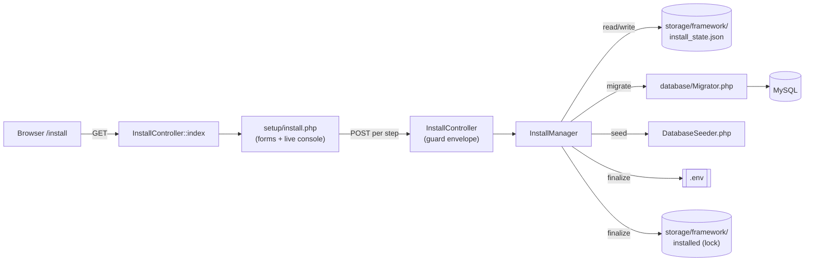

# 32 — Setup Installer (مثبّت الإعداد)

The browser-based, no-CLI web installer that stands HalaOps up from an uploaded package — requirements → database → migrate → seed → admin → finalize — with a live AJAX console and resume-from-last-step recovery.

## Related Documents

- [33-System-Diagnostics](33-System-Diagnostics.md)
- [43-Deployment](43-Deployment.md)
- [05-Database-Architecture](05-Database-Architecture.md)
- [07-RBAC](07-RBAC.md)
- [09-Authentication](09-Authentication.md)
- [34-Security](34-Security.md)
- [44-Production-Checklist](44-Production-Checklist.md)

## Purpose (الهدف)

The installer (`/install`) is the single, browser-driven path that turns a freshly uploaded HalaOps package into a running platform. A non-technical buyer uploads the files (via cPanel File Manager, FTP, or an unzip), opens the site in a browser, and clicks through a six-step wizard. There is **no SSH, no Composer, no Artisan, no npm, no Node, and no terminal** at any point — every action a CLI would normally perform is exposed as an idempotent JSON endpoint and orchestrated by `app/Services/Install/InstallManager.php`, surfaced through `app/Controllers/Setup/InstallController.php`, and rendered by `resources/views/setup/install.php`.

The six canonical steps (the public `InstallManager::STEPS` constant) are:

1. `requirements` — verify the host can run HalaOps.
2. `database` — validate DB credentials and create the schema database.
3. `migrate` — create all tables from `database/migrations/`.
4. `seed` — seed permissions, roles, and the default plan.
5. `admin` — create the first super-admin user.
6. `finalize` — write `.env`, place the install lock, and lock the installer down.

## Why It Exists (سبب وجوده)

HalaOps is sold as an upload-and-install product to thousands of companies, many on cheap shared hosting where the only access the buyer has is a control panel and a browser. A traditional `php artisan migrate` / `composer install` flow is impossible there and intimidating everywhere else. The installer exists to:

- **Remove the CLI entirely.** Per the platform principle "No CLI for the person installing", every install action runs as ordinary HTTP requests inside the app the buyer just uploaded.
- **Make installation safe to retry.** Shared hosts time out, drop connections, and impose memory limits. Each step records completion to a state file so a failure resumes from the last good step instead of corrupting a half-migrated database.
- **Fail closed and lock down.** Until the lock file exists the app serves only the installer; once finalized the installer refuses to mutate anything and visitors are sent to login. This prevents a re-install attack and leaving an open setup wizard on a production URL.
- **Give the buyer confidence.** A live console streams each check and each migration so the buyer sees exactly what happened and what to fix when something fails.

## Architecture

Three real components collaborate, plus two storage-only artifacts.

| Component | File | Responsibility |
|-----------|------|----------------|
| Install service | `app/Services/Install/InstallManager.php` | The brain. Owns `STEPS`, the state file, the lock file, and one method per step (`checkRequirements`, `configureDatabase`, `runMigrations`, `runSeeders`, `createAdmin`, `finalize`). Idempotent and resumable. |
| Install controller | `app/Controllers/Setup/InstallController.php` | The HTTP surface. `index()` renders the wizard; one POST action per step returns the JSON envelope `{ok, message, ...}`. `guard()` normalizes success/failure and blocks all writes once installed. |
| Install view | `resources/views/setup/install.php` | The wizard UI: DB/admin/app forms, the step checklist, and the live console. The vanilla-JS controller runs requirements then POSTs each step in order, rendering results into `#console`. |
| Migration runner | `database/Migrator.php` | Discovers `database/migrations/NNNN_*.php`, tracks applied ones in the `migrations` table, runs pending ones in order with a per-migration progress callback. |
| Seeder | `database/seeders/DatabaseSeeder.php` | Idempotent baseline data: permission catalogue, global super-admin role, default "Standard" plan. |

Two files live under `storage/framework/` and are **never web-served** (the root `.htaccess` blocks the entire `storage/` tree):

- `storage/framework/install_state.json` — the resume ledger. JSON of `{"completed": ["requirements", ...], "config": {...}}`. The `config` key transiently holds the DB credentials and admin metadata between steps.
- `storage/framework/installed` — the **lock file**. Its presence (together with a present `.env`) means "installed". Written in `finalize()` with a timestamp.

The front controller / `Application` consults `InstallManager::isInstalled()` (lock file **and** `.env` both present) during boot to decide whether to gate the whole app behind the installer or to serve the application normally. Routes (`routes/web.php`) expose the installer under the `/install` prefix: a `GET /install` plus six POST endpoints (`install/requirements`, `install/database`, `install/migrate`, `install/seed`, `install/admin`, `install/finalize`).



## Workflow

### Wizard sequence

```mermaid
sequenceDiagram
    participant U as Buyer (Browser)
    participant V as install.php (JS)
    participant C as InstallController
    participant M as InstallManager
    participant DB as MySQL

    U->>V: Open /setup
    V->>C: GET /setup (index)
    C->>M: isInstalled()? state() / nextStep() / progress()
    M-->>C: not installed, next=requirements
    C-->>V: render 12-step wizard (forms + console + progress bar)
    V->>C: POST setup/requirements (auto on load)
    C->>M: checkRequirements()
    M-->>C: {groups{}, passed} (+ solution per failure)
    C-->>V: JSON; console prints each check + fixes
    U->>V: Fill DB + mail + admin + app, click "Run installation"
    V->>C: POST setup/requirements (re-check)
    C-->>V: passed=true
    loop database → environment → storage → permissions(+fix) → migrate → seed → mail → admin → health → finalize
        V->>C: POST setup/<step> (FormData + CSRF)
        C->>M: guard(): isInstalled? then step method
        M->>DB: connect / DDL / inserts
        M->>M: markComplete(step, config)
        M-->>C: result (+ per-migration log for migrate)
        C-->>V: {ok:true, message, log?}
        V->>V: console prints lines; mark step ✓
    end
    M->>M: write .env + lock; unlink install_state.json
    C-->>V: {ok:true, redirect:/login}
    V->>U: redirect to login after 1.2s
```

### The twelve wizard steps (Setup Bible)

The browser wizard presents twelve steps — **Welcome, System Check, Server Check,
PHP Extensions, Database, Environment, Storage, Permissions, Mail, AI Providers,
Create Super Admin, Final Health Check** — backed by the persisted operations in
`InstallManager::STEPS` = `requirements, database, environment, storage,
permissions, migrate, seed, mail, admin, finalize`. A **real progress bar** tracks
completion (`InstallManager::progress()` = completed ÷ total). Every requirement
failure carries a plain-language **solution** (never a stack trace).

1. **requirements** (System / Server / PHP Extensions) — `checkRequirements()` returns checks **grouped** as `Server`, `PHP Extensions`, `Storage`, each `{name, ok, value, required, solution}`. Server: PHP ≥ 8.2, `memory_limit` ≥ 128M, `max_execution_time` ≥ 30s (0/-1 = unlimited = ok), `upload_max_filesize`/`post_max_size` ≥ 8M, free disk space. PHP Extensions required: `pdo, pdo_mysql, mbstring, openssl, json, fileinfo, curl, xml`; recommended (warn-only): `gd, intl, zip, imagick, redis`. Storage: `storage`, `storage/logs`, `storage/cache`, `storage/framework` writable (auto-created) + project root writable for `.env`. `passed` requires every **required** check ok. Marked complete when passed.

2. **database** — `configureDatabase()` validates the inputs (database name `^[A-Za-z0-9_]+$`), opens a server-level PDO connection (`ATTR_TIMEOUT=5`) to verify credentials, then `CREATE DATABASE IF NOT EXISTS … utf8mb4`. Persists creds to state for later steps + finalize. Friendly error on connection failure.

3. **environment** — `generateEnvironment()` generates the `APP_KEY` (`Encrypter::generateKey()`) now and stores it in state; `finalize` writes it to `.env`.

4. **storage** — `createStorage()` creates the full storage tree the platform expects: `logs, cache, sessions, framework, backups, app, app/uploads, app/exports, app/imports, app/temp, app/pdf, app/reports` (each with a protective `.gitignore`).

5. **permissions** — `checkPermissions()` verifies every storage folder is writable. If not, the wizard calls **`fixPermissions()` (Auto-Fix)** which `mkdir`/`chmod 0775`s them — no terminal. Only when all are writable is the step complete.

6. **migrate** — `runMigrations($report)` runs the full migration chain via `database/Migrator.php` (outside a transaction — MySQL auto-commits DDL — each recorded on success so re-runs skip applied ones). Per-migration log streams to the console.

7. **seed** — `runSeeders()` runs `DatabaseSeeder` (idempotent): reference data + the lookup category registry (`ReferenceDataSeeder`, `LookupSeeder`), `system_modules`, the permission catalogue, the global `super-admin` role, and the default plan.

8. **mail** *(optional)* — `configureMail()` stores `MAIL_ENABLED`/from-address/from-name; **Send Test Email** (`sendTestEmail()`) attempts delivery via the host `mail()` transport and always writes a copy to `storage/logs` so the pipeline is verifiable. `skipMail()` lets the buyer move on. (SMTP transport is pluggable without touching callers.)

9. **AI Providers** — informational only: **no AI keys are entered here.** Each workspace adds its own encrypted provider keys after sign-in.

10. **admin** — `createAdmin()` validates name/email/password (≥ 8 chars) and **upserts** an active, email-verified super-admin, assigning the global `super-admin` role.

11. **Final Health Check** — `healthCheck()` (also a live JSON endpoint) verifies DB connectivity + schema (> 100 tables) + seeded permissions + an admin user, storage writability, disk space, the environment key, and mail config → PASS/FAIL per item.

12. **finalize** — re-asserts `database, environment, storage, permissions, migrate, seed, admin` are complete, then runs the **real final validation** (`finalValidation()`): DB read, RBAC catalogue, configuration data, a **DB write that creates a workspace + user inside a rolled-back transaction**, a storage write probe, and a mail-pipeline probe. Only if validation passes does it write `.env` (incl. `APP_KEY`, DB and mail blocks, `APP_DEBUG=false`, `SESSION_SECURE` for https), place the `storage/framework/installed` lock, and delete `install_state.json`. Response carries `redirect: /login`.

## Business Rules

- **BR-INSTALL-0 — Canonical URL `/setup`.** First run redirects every path to `/setup` (legacy `/install` redirects to it). No other page is reachable until installed (`Application::handleNotInstalled`).
- **BR-INSTALL-1 — One canonical step order.** Steps always run in the order of `InstallManager::STEPS`: `requirements, database, environment, storage, permissions, migrate, seed, mail, admin, finalize`. `nextStep()` returns the first not-yet-completed step; `progress()` is the completion percentage.
- **BR-INSTALL-2 — Installed means lock + env.** `isInstalled()` is true only when both `storage/framework/installed` and `.env` exist. Either one alone is not "installed".
- **BR-INSTALL-3 — Installed app refuses setup.** Once installed, `index()` redirects to `/login` and every step endpoint returns HTTP 409 via `guard()`. The installer can never re-run destructively over a live install.
- **BR-INSTALL-4 — Resume, never restart.** Completed steps are recorded in `install_state.json`; re-running installation skips completed steps (migrations are also individually skipped if already applied).
- **BR-INSTALL-5 — No half-finalized state.** `finalize()` throws if any of `database, environment, storage, permissions, migrate, seed, admin` is incomplete, AND runs a real `finalValidation()` (DB read/write rolled back, RBAC, config data, storage + mail probes) — the lock is placed only after validation passes, so the wizard never reports success over an unusable install.
- **BR-INSTALL-7 — Auto-repair before reporting.** Missing storage folders are created and non-writable ones are `chmod`-repaired automatically (`createStorage()` / `fixPermissions()`) before any failure is shown to the buyer.
- **BR-INSTALL-8 — Friendly diagnostics.** Requirement failures always carry a `solution` string (how to fix it from the hosting panel), never a raw stack trace.
- **BR-INSTALL-6 — Production defaults.** `finalize()` always writes `APP_ENV=production` and `APP_DEBUG=false`; debug is never on after a fresh install.
- **BR-INSTALL-7 — Secrets are transient.** DB credentials live in `install_state.json` only between steps and are erased when `finalize()` unlinks the state file; the durable copy lives only in `.env`, which is web-inaccessible.
- **BR-INSTALL-8 — First user is super-admin.** The `admin` step creates exactly the platform super-admin (global role, `company_id` NULL); it does not create a tenant. Companies are created later by users per [12-Workspace-Management].

## Database Relations

The installer is the **producer** of the baseline schema and seed rows; it touches these tables directly (all defined in [05-Database-Architecture] §11):

- `migrations` (id, migration UQ, batch, executed_at) — created and populated by `Migrator`; one row per applied migration file.
- `users` (GLOBAL) — the `admin` step inserts/updates the super-admin row (`status=active`, `email_verified_at` set).
- `roles` (GLOBAL row, `company_id` NULL) — `ensureSuperAdminRole()` ensures the `super-admin` role (`is_system`).
- `permissions` (GLOBAL) + `permission_role` — `syncPermissions()` upserts the catalogue and links it to the super-admin role.
- `user_role` — `assignGlobalRole()` links the admin user to the super-admin role.
- `plans` (GLOBAL) — `seedDefaultPlan()` inserts the "Standard" plan when absent.

Migrations `0001`–`0015` create the full built schema (users, companies, memberships, roles, permissions, permission_role, membership_role, user_role, plans, subscriptions, ai_credentials, password_resets, settings, onboarding_progress, activity_log) before any other step runs.

## Permissions

The installer is **unauthenticated by design** — it runs before any user exists, so it cannot be gated by RBAC. Its access control is therefore environmental, not permission-based:

- **Pre-install:** the app is gated so only `/install` and its assets are reachable; there are no users, so no permission checks apply.
- **Post-install:** access is denied by `isInstalled()` (controller redirects to `/login`; endpoints return 409), not by a permission.
- The first account the installer creates is the platform **super-admin** (global `super-admin` role → all permissions, per [07-RBAC]). Everything the buyer does afterward, including health checks via `platform.diagnostics` (see [33-System-Diagnostics]), is gated by RBAC from that point on.

## Validation

- **Database name** — required; must match `^[A-Za-z0-9_]+$` (letters, digits, underscore). Rejected names raise a `RuntimeException` surfaced as a 422 with a human message.
- **Database credentials** — verified by an actual PDO connect with a 5-second timeout; connection failures return the underlying server message prefixed with "Could not connect to the database server:".
- **Admin** — name, email, and password all required; email must pass `FILTER_VALIDATE_EMAIL`; password must be ≥ 8 characters. Email is lower-cased and trimmed.
- **App** — `app_name` defaults to "HalaOps"; `app_url` defaults to the request scheme+host (`guessAppUrl()`); the URL's `https` prefix drives `SESSION_SECURE`.
- **Client-side** — the form uses HTML5 `required`/`minlength`/`type=email` and `form.reportValidity()` before submitting, but the server re-validates everything (never trust the client).

## Edge Cases

- **Mid-install timeout / connection drop.** State is written after each completed step, so reloading `/install` and clicking "Run installation" again resumes. Migrations already recorded are skipped; the seeder and admin steps are idempotent.
- **A single migration fails.** `Migrator::run()` stops at the failing file, returns `{ran, failed}`, and the console prints a cross next to that table with the exact error. The `migrate` step is **not** marked complete, so a retry re-attempts only the remaining migrations (already-applied ones are skipped).
- **Root not writable for `.env`.** The requirements check flags it; `writeEnv()` throws "Unable to write the .env file…" if it still fails at finalize. The fix is a control-panel permission change, after which finalize is retried.
- **`storage/` not writable.** Requirements flags each subdirectory; `ensureWritable()` attempts to create them at `0775` first. If the host forbids it, the buyer fixes permissions and re-checks.
- **Admin email already exists** (e.g. partial earlier run). `createAdmin()` updates the existing user instead of failing on the unique email constraint.
- **Re-opening `/install` after success.** `index()` sees `isInstalled()` and redirects to `/login`; no setup UI is shown.
- **Direct POST to a step after install.** `guard()` returns HTTP 409 `{ok:false, message:"The application is already installed."}` before running anything.
- **Unexpected non-JSON response** (e.g. host 500/HTML error page). The client's `call()` throws "Unexpected server response (HTTP n)" so the buyer is not left staring at a frozen spinner.
- **Finalize attempted early.** Throws "Cannot finalize: the '<step>' step has not completed yet." — surfaced as 422 in the console.

## Security

- **CSRF on every write.** All six POST endpoints sit inside the standard middleware stack; the view sends `X-CSRF-TOKEN` (from the `<meta name="csrf-token">`) and `X-Requested-With: XMLHttpRequest` on every `fetch`. `VerifyCsrfToken` rejects forged writes.
- **DDL injection defense.** Database and table names cannot be bound as PDO parameters; the database name is therefore whitelisted by regex, and migrations ship as code (not user input).
- **Secrets never web-served.** `install_state.json` and the lock live under `storage/framework/`; both the root `.htaccess` (`RewriteRule ^(app|bootstrap|config|database|resources|routes|storage)(/|$) - [F,L]`) and the dotfile guard block the path, and the file is deleted at finalize anyway.
- **`.env` protection.** The root `.htaccess` blocks `^(\.env|…)` and any dotfile (`<FilesMatch "^\.">`); the `public/.htaccess` also denies dotfiles in case a stray `.env` is copied into the docroot. Per [43-Deployment], the docroot should be `/public`, which keeps `.env` outside the served tree entirely.
- **Strong app key.** `finalize()` generates a fresh `APP_KEY` via `Encrypter::generateKey()` (base64-encoded 32 bytes) for AES-256-GCM; it is never shipped in the package.
- **Lock-down after install.** `BR-INSTALL-3` ensures the wizard cannot be replayed; a second installation cannot overwrite the live database or reset the admin password through the installer.
- **Password storage.** The admin password is hashed with Argon2id via `Hash::make()`; the plaintext is never written to state or `.env`.
- **No debug leakage.** `APP_DEBUG=false` is forced, so a post-install error never renders a stack trace to visitors.

## Performance

- The whole install is a handful of synchronous HTTP requests; there is no build step on the buyer's server (Tailwind is pre-compiled to `public/assets/css/app.css`).
- Migrations run sequentially and are the longest step; the per-migration callback streams progress so long runs feel responsive rather than hung.
- The DB connection test uses `ATTR_TIMEOUT => 5` to fail fast on bad hosts/credentials instead of hanging the request.
- The state file is small JSON written with `LOCK_EX`; reads/writes are negligible.
- Requirements checks are pure filesystem/`extension_loaded` calls — cheap enough to run on every page load and again before install.

## Testing

- **Unit (`InstallManager`):** `nextStep()` returns the first incomplete step; `markComplete()` is additive and de-duplicates; `isInstalled()` requires both lock and `.env`; `configureDatabase()` rejects empty and non-`[A-Za-z0-9_]` names; `finalize()` throws when a prerequisite step is incomplete; `finalize()` deletes `install_state.json` and writes `APP_DEBUG=false` + a non-empty `APP_KEY`.
- **Unit (`Migrator`):** `pending()` excludes applied migrations; `run()` records each applied migration and stops at the first failure returning `failed`; a second `run()` applies nothing when up to date.
- **Feature (HTTP):** `GET /install` renders the wizard when not installed and redirects to `/login` when installed; each POST step returns the `{ok, message}` envelope; posting a step after install returns 409; missing CSRF returns 419/403.
- **Feature (recovery):** simulate a failure after `migrate`, then re-run and assert `seed`/`admin`/`finalize` complete and the schema is intact.
- **Security:** a non-whitelisted database name is rejected; `.env`, `storage/framework/install_state.json`, and the lock file are not retrievable over HTTP; the created admin has the global `super-admin` role and an Argon2id hash.

## Future Expansion

- **Maintenance-mode migration screen.** `Migrator` is deliberately reusable; a super-admin "Update" screen (see [43-Deployment] zero-downtime updates) can run pending migrations on an already-installed instance, gated by `platform.diagnostics`/an update permission and a maintenance flag, without re-touching the installer.
- **Optional steps.** The `STEPS` array is the single source of order; mail configuration, sample-data seeding, or first-company creation could be added as additional resumable steps without changing the orchestration model.
- **Pre-flight bundle verification.** A checksum/signature check of the uploaded package could be added as a `requirements` sub-check.
- **CLI parity (optional).** A thin CLI entry point could call the same `InstallManager` methods for power users, while the browser remains the only supported path for buyers.
- **Multi-DB / per-tenant DB.** If tenancy evolves toward database-per-tenant ([08-Multi-Tenant], [36-Scalability]), `makeDatabase()` and the database step can branch on a provisioning strategy without altering the wizard UX.

## Open Questions

None at this time. The installer, its endpoints, the state/lock files, and the finalize contract are fully implemented and match this document.
