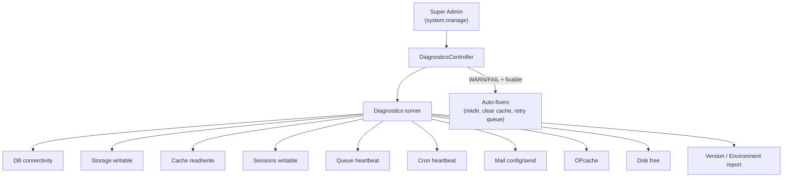
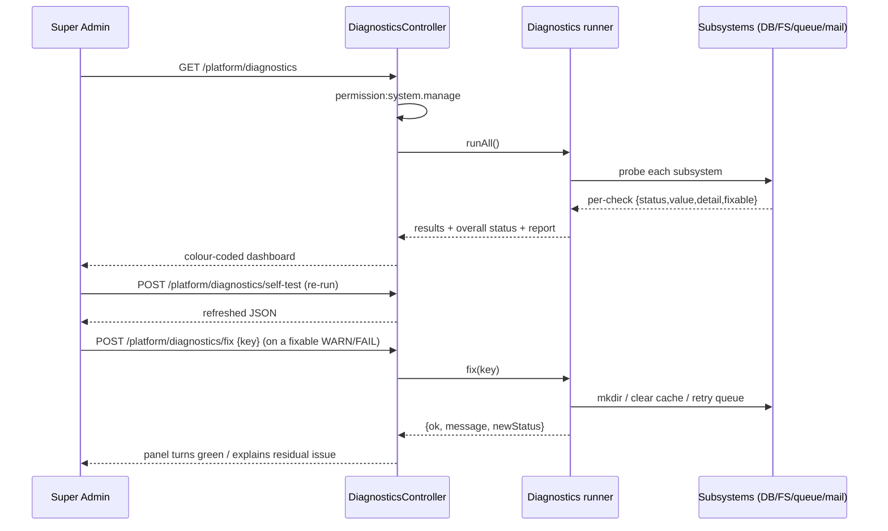

# 33 — System Diagnostics (تشخيص النظام)

The super-admin health and self-test surface: connectivity, storage, cache, sessions, queue/cron heartbeats, mail, OPcache, and disk checks — with a version/environment report and safe auto-fixes — gated by `system.manage`.

## Related Documents

- [32-Setup-Installer](32-Setup-Installer.md)
- [37-Logging](37-Logging.md)
- [44-Production-Checklist](44-Production-Checklist.md)
- [22-SuperAdmin-Journey](22-SuperAdmin-Journey.md)
- [43-Deployment](43-Deployment.md)
- [07-RBAC](07-RBAC.md)
- [34-Security](34-Security.md)

## Purpose (الهدف)

System Diagnostics is the platform operator's single screen for answering "is HalaOps healthy, and if not, what is wrong and can I fix it from here?". Because the buyer has **no CLI** (see [32-Setup-Installer]), every operational signal a sysadmin would normally gather with shell commands — database connectivity, writable storage, cache and session health, the queue worker and cron heartbeats, mail deliverability, OPcache status, and disk headroom — is collected by the app itself and rendered as a colour-coded health report. It also produces a **version/environment report** for support, and offers **one-click self-test** and **auto-fix** for the issues that are safe to remediate from the browser.

## Why It Exists (سبب وجوده)

A multi-tenant SaaS sold to thousands of non-technical operators needs to be diagnosable without a terminal. Diagnostics exists to:

- **Replace the missing shell.** Operators cannot run `mysql`, `redis-cli`, `df -h`, or `tail` on the log; the app surfaces the equivalents in one place.
- **Catch the classic post-deploy breakages.** The most common production failures on shared hosting are non-writable `storage/`, a stale cron not draining the queue, mail not configured, and disk filling up. Diagnostics turns these from silent outages into visible, actionable warnings.
- **Shorten support loops.** The version/environment report gives support exact PHP/extension/schema/build facts instead of "it doesn't work".
- **Reduce ticket volume.** Where a fix is safe and unambiguous (create a missing storage directory, clear a stale cache, retry the queue), the operator can auto-fix it without escalating.

## Architecture

Diagnostics is a super-admin module composed of a set of independent **checks**, a **runner** that executes them, a **report** layer, and a small set of **auto-fixers**. It deliberately reuses the same primitives the installer uses, so "healthy" means the same thing during install and during operation.

| Concern | Where it lives | Responsibility |
|---------|----------------|----------------|
| Health checks | `app/Services/Diagnostics/` (checks) | One small class/closure per check returning `{key, label, status, value, detail, fixable}`. |
| Runner | Diagnostics service | Executes all checks, aggregates an overall status, captures timings. |
| Environment report | Diagnostics service | Collects version/runtime facts (PHP, extensions, schema/migration state, build). |
| Controller | `app/Controllers/System/DiagnosticsController.php` | Renders the dashboard, exposes JSON self-test and auto-fix endpoints; gated by `permission:system.manage`. |
| View | `resources/views/platform/diagnostics.php` | Colour-coded panels (OK / WARN / FAIL), the report table, "Run self-test" and "Fix" buttons. |
| Data sources | `App\Core\Database`, `App\Core\Logger`, `storage/*`, `queued_jobs`/`failed_jobs`, `settings` | The real subsystems each check probes. |

Each check returns a normalized status: **OK** (green), **WARN** (amber, degraded but serving), or **FAIL** (red, broken). The runner's overall status is the worst of its children. Heartbeats (queue, cron) are read from a small persisted timestamp the worker/scheduler updates each run (stored under `storage/framework/` and/or a `settings`-style key), so "no CLI" still yields a real liveness signal.

### The checks

| Check (key) | Probes | OK when | WARN/FAIL when | Auto-fixable |
|-------------|--------|---------|----------------|--------------|
| `db` (connectivity) | `Database` runs `SELECT 1` and reads `migrations` | query succeeds, no pending migrations | unreachable → FAIL; pending migrations → WARN | No (migrations via maintenance flow) |
| `storage` (writable) | `storage`, `storage/logs`, `storage/cache`, `storage/sessions`, `storage/framework` | all writable | any not writable → FAIL | Yes (mkdir `0775`) |
| `cache` | write+read+delete a probe key | round-trips | write/read fails → FAIL | Yes (clear cache dir) |
| `sessions` | `storage/sessions` writable + session started | writable | not writable → FAIL | Yes (mkdir) |
| `queue` (heartbeat) | last worker tick + `failed_jobs` count | tick recent, few/no failures | stale tick → WARN/FAIL; failed jobs present → WARN | Partial (retry/flush failed) |
| `cron` (heartbeat) | last scheduler tick timestamp | tick within threshold | stale/never → FAIL | No (operator must set cron URL) |
| `mail` | `MAIL_ENABLED` + transport reachability/test send | enabled and send works | disabled → WARN; send fails → FAIL | No (config) |
| `opcache` | `opcache_get_status()` | enabled with healthy hit ratio | disabled → WARN | No (php.ini) |
| `disk` | `disk_free_space()` on the install root | free above threshold | low → WARN; critical → FAIL | Partial (purge old logs/cache) |

### Version / environment report

A non-actionable facts table for support and the [44-Production-Checklist]: HalaOps app version and build, `APP_ENV`/`APP_DEBUG`, PHP version + SAPI, loaded vs required extensions (`pdo_mysql, mbstring, openssl, json, fileinfo, curl` and recommended `gd, intl, zip`), MySQL server version + charset/collation, applied vs total migrations, configured timezone/locale/currency, session driver, mail enabled flag, and whether the install lock (`storage/framework/installed`) is present.

## Workflow

Steps:

1. The operator opens the diagnostics dashboard; the controller enforces `system.manage` and runs all checks server-side.
2. Each check renders as OK/WARN/FAIL with its measured value and a one-line detail; the overall banner shows the worst status.
3. **Self-test** re-runs all checks on demand (e.g. after changing a setting or fixing permissions) and returns fresh JSON.
4. For any check flagged `fixable`, a **Fix** button posts the check key; the auto-fixer performs the safe remediation and reports the new status. Every fix is recorded to `activity_logs`.

## Business Rules

- **BR-DIAG-1 — Super-admin only.** The entire surface requires the global `system.manage` permission; there is no tenant-scoped diagnostics.
- **BR-DIAG-2 — Read by default.** Running checks and the report never mutate application data; only explicit auto-fix actions change state.
- **BR-DIAG-3 — Worst-wins overall status.** Overall health = the worst individual status (any FAIL → FAIL; else any WARN → WARN; else OK).
- **BR-DIAG-4 — Only safe fixes are automated.** Auto-fix is offered solely for unambiguous, reversible actions (create missing storage dir, clear cache, retry/flush failed jobs, purge old logs). Schema changes, mail/cron configuration, and php.ini changes are never auto-applied.
- **BR-DIAG-5 — Heartbeats define liveness.** Queue and cron health are derived from the last tick timestamp the worker/scheduler writes; a missing or stale tick is a real failure, not "unknown".
- **BR-DIAG-6 — Every fix is audited.** Each auto-fix writes an `activity_logs` entry with actor, action, and result.
- **BR-DIAG-7 — No secret leakage.** The report shows presence/shape of secrets (e.g. "APP_KEY set", "mail enabled"), never their values.

## Database Relations

Diagnostics mostly probes infrastructure, but it reads/writes a few tables from [05-Database-Architecture] §11:

- `migrations` — read for applied-vs-pending count (the `db` check and the environment report).
- `queued_jobs` (planned) — read for backlog depth and the queue heartbeat freshness.
- `failed_jobs` (planned) — read for the failed-job count; auto-fix may retry/flush rows.
- `activity_logs` — written on every auto-fix (`workspace_id` NULL for platform actions, `action='diagnostics.fix'`, the check key in `properties`).
- `settings` / a `storage/framework` heartbeat file — read for the cron/queue last-tick timestamps and any diagnostics thresholds.

No new table is required; heartbeats can be stored as a small JSON file under `storage/framework/` or as platform-level `settings` keys.

## Permissions

- **`system.manage`** (from the platform super-admin group in [07-RBAC] §6) gates the dashboard, the self-test endpoint, and all auto-fix endpoints. It is part of the super-admin role granted at install (see [32-Setup-Installer]).
- No tenant role grants diagnostics; it is platform-wide and uses `withoutTenantScope()` semantics where it touches tenant tables (e.g. counting queued jobs across workspaces).
- Routes live under a `system`-prefixed group protected by `middleware('auth')` + `permission:system.manage` (consistent with the `permission:perm` middleware in [10-Authorization]).

## Validation

- **Auto-fix input** — the posted `key` must be one of the known check keys; any other value is rejected (400). Only keys whose check reported `fixable=true` in the current run may be fixed.
- **Thresholds** — disk and heartbeat thresholds (e.g. cron stale after N minutes, disk WARN below X%) come from config, not user input, and are validated to be positive numbers.
- **Mail test** — an optional "send test email" takes a recipient that must pass email validation before sending.
- **CSRF** — self-test and fix are POST endpoints carrying the CSRF token like every other write.

## Edge Cases

- **Database down.** The `db` check catches the PDO exception and reports FAIL with the driver message; the rest of the dashboard still renders (checks are independent and individually guarded).
- **Cron never configured.** The cron heartbeat is "never seen" → FAIL with guidance pointing to the protected cron URL setup in [43-Deployment]; the queue check is then expected to back up and is correlated in the detail text.
- **Queue worker crashed.** Stale heartbeat → WARN/FAIL; `failed_jobs` count surfaces the cause; the operator can retry/flush from the panel.
- **Storage made read-only after deploy.** `storage` check FAILs; auto-fix attempts `mkdir 0775` and re-tests, reporting clearly if the host still forbids writes (operator must fix permissions in the panel).
- **OPcache disabled on shared hosting.** WARN only (the app runs without it); the report explains the performance impact per [35-Performance].
- **Disk nearly full.** WARN/FAIL; the purge auto-fix removes old log/cache files and re-measures; if still critical it tells the operator to free space.
- **Pending migrations after an update.** `db` check WARNs and links to the maintenance/update flow ([43-Deployment]); diagnostics never runs migrations itself.
- **Mail disabled.** WARN (intentional for some installs) rather than FAIL, so a mail-less deployment is not perpetually red.

## Security

- **Strict gating.** Only `system.manage` holders reach any endpoint; everything else 403s. This prevents an attacker from probing infrastructure through the dashboard.
- **No secret disclosure.** The report exposes presence and shape (set/unset, enabled/disabled, version numbers) but never `APP_KEY`, DB passwords, or AI credentials (which are encrypted per [34-Security]).
- **Auto-fix is least-privilege and reversible.** Fixers only create directories, clear regenerable caches, or retry jobs — never delete tenant data or rewrite `.env`.
- **CSRF + audit.** All mutating actions require the CSRF token and are written to `activity_logs`, giving a tamper-evident trail of operator actions.
- **Rate-limited test sends.** The optional mail test is throttled to avoid being used as a spam relay.
- **Heartbeat endpoints are protected.** The cron URL that updates the heartbeat is itself a protected, secret-token URL (see [43-Deployment]); diagnostics only *reads* the resulting timestamp.

## Performance

- Checks are cheap and short-circuited: `SELECT 1`, a single probe file write/delete, `disk_free_space()`, `opcache_get_status()`, and small `COUNT(*)` queries on `queued_jobs`/`failed_jobs` (which carry `IDX(queue, available_at)` and `uuid` indexes per §11).
- The full run is bounded by the DB connect timeout; each check is individually try/caught so one slow subsystem cannot block the others.
- Results may be cached briefly (a few seconds) to avoid hammering subsystems on rapid refreshes, with self-test forcing a fresh run.
- The environment report is computed once per page load; extension/version lookups are in-process and negligible.

## Testing

- **Unit:** each check maps subsystem state → correct status (e.g. unwritable dir → FAIL; disabled mail → WARN; recent heartbeat → OK; stale heartbeat → FAIL); overall status is the worst child; only `fixable=true` checks expose a fixer.
- **Feature (HTTP):** dashboard returns 200 for a `system.manage` user and 403 otherwise; self-test returns refreshed JSON; fix endpoint rejects unknown keys; a successful storage fix flips the panel to OK on re-test.
- **Security:** a tenant admin without `system.manage` cannot reach any endpoint; the report never contains secret values; auto-fix writes an `activity_logs` row; mail test is throttled.
- **Resilience:** with the database forced down, the page still renders and the `db` panel is FAIL; with the queue heartbeat absent, the queue panel is WARN/FAIL and self-test recovers once a tick is written.

## Post-Install Operations Suite (no terminal)

The Setup & Installer Bible mandates that everything an administrator needs runs
from the browser. Beyond Diagnostics, the platform ships a super-admin operations
suite under `/system/*`, every page gated by the `system.manage` permission
(held only by the super-admin role) — **no SSH, CLI, Composer or file editing**.

- **Diagnostics** (`/system/diagnostics`, `System\DiagnosticsController` + `System\SystemDiagnostics`) — the read-only health report described above, runnable any time (mirrors the installer's Final Health Check).
- **Maintenance mode** (`/system/maintenance`, `System\MaintenanceController` + `System\MaintenanceMode`) — toggles a flag at `storage/framework/maintenance.json` with a custom message and optional allow-IP. Enforced by `Http\Middleware\CheckMaintenanceMode` (alias `maintenance`, in the global stack): when enabled it returns a 503 maintenance page to everyone **except** the super-admin, the allow-IP, and the always-reachable `/system`, `/login`, `/logout`, `/assets` paths — so the site can always be brought back up from the browser.
- **Backup & Restore** (`/system/backups`, `System\BackupController` + `System\BackupManager`) — pure-PHP database dumps (information_schema + `SHOW CREATE TABLE` + batched `INSERT`s, `FOREIGN_KEY_CHECKS=0/1`; **no mysqldump/CLI**) and `ZipArchive` file backups under `storage/backups`; list, download, delete, and restore (statement-by-statement) from the dashboard.
- **Environment Editor** (`/system/environment`, `System\EnvironmentController` + `System\EnvFile`) — edit a whitelist of safe `.env` keys (app/mail/security) with atomic writes that preserve order/comments; secrets (`APP_KEY`, `DB_*`) are shown masked and read-only. Replaces hand-editing `.env`.
- **Log Viewer** (`/system/logs`, `System\LogViewerController` + `System\LogReader`) — lists `storage/logs/*.log`, tails them with level-coloured lines, and annotates errors/warnings with **suggested fixes** for common patterns (missing table → re-run migrations; connection refused → check DB settings; not writable → run Permissions Auto-Fix; memory → raise `memory_limit`; missing extension → enable it).

All five are reachable from the sidebar (rendered only when `can('system.manage')`),
keeping the no-dead-links rule. Maintenance/backup/restore/log-clear are verified to
block non-super-admins (HTTP 403) and to never lock the super-admin out.

## Future Expansion

- **Scheduled health snapshots + alerting.** Persist periodic snapshots and email/notify super-admins (via [26-Notification-System]) when status degrades, instead of relying on someone opening the page.
- **Per-tenant diagnostics.** A scoped subset (storage usage, AI credential validity, queue backlog for that workspace) could be exposed to tenant owners under a tenant permission.
- **Deeper external checks.** Validate each tenant's AI provider keys ([17-AI-Providers]) and the configured payment gateway webhooks ([15-Payment-Gateways]) as additional checks.
- **Metrics export.** A protected `/healthz` JSON endpoint for external uptime monitors and a Prometheus-style metrics feed, reusing the same runner.
- **History & trends.** Store check timings/values to chart disk growth, queue depth, and OPcache hit ratio over time, feeding [35-Performance] tuning.

## Open Questions

None at this time. The check set, the `system.manage` gate, the heartbeat-based liveness model, and the safe-auto-fix policy are settled and consistent with the canonical context.
