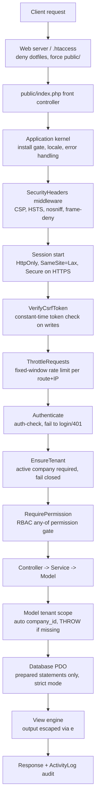
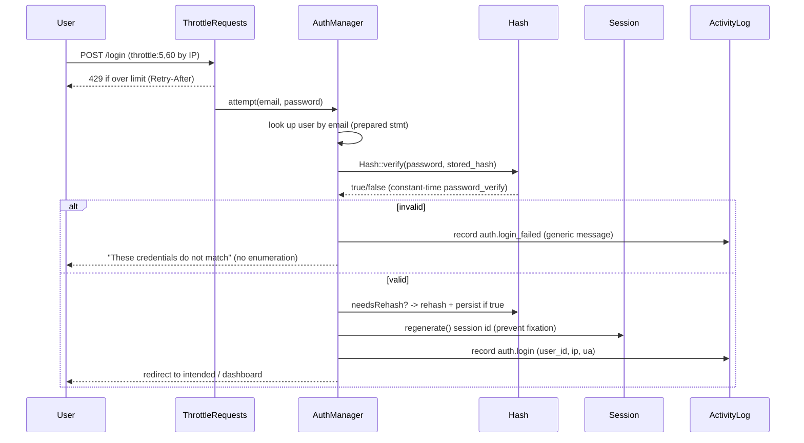
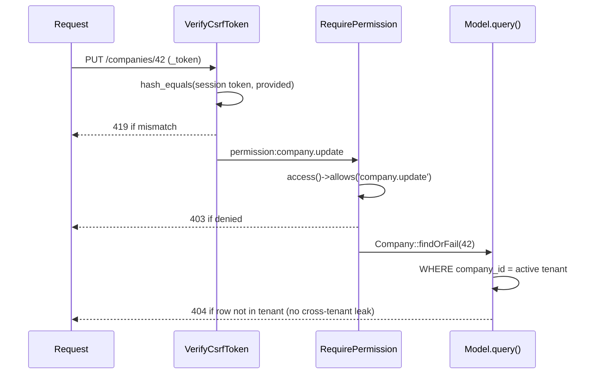

# 34 — Security (الأمن)

The comprehensive, defence-in-depth security model of HalaOps, mapped explicitly to the OWASP Top 10 and grounded in the real code under `app/Core` and `app/Http/Middleware`: Argon2id authentication, fail-closed multi-tenancy, RBAC authorization, CSRF, output escaping, prepared-statements-only data access, AES-256-GCM secrets at rest, hardened sessions, security headers, rate limiting, file-upload controls, PCI-aware payments, a zero-runtime-dependency supply chain, and incident response.

## Related Documents

- [07 — RBAC](07-RBAC.md)
- [08 — Multi-Tenant](08-Multi-Tenant.md)
- [09 — Authentication](09-Authentication.md)
- [10 — Authorization](10-Authorization.md)
- [15 — Payment Gateways](15-Payment-Gateways.md)
- [17 — AI Providers](17-AI-Providers.md)
- [27 — Storage System](27-Storage-System.md)
- [37 — Logging](37-Logging.md)
- [38 — Audit System](38-Audit-System.md)
- [44 — Production Checklist](44-Production-Checklist.md)

---

## Purpose (الهدف)

This document is the **single authoritative description of how HalaOps defends itself**. It states the threat model, enumerates every control the platform ships with, points each control at the concrete class or mechanism that implements it, and maps the whole posture to the OWASP Top 10 (2021). It is written so that a security reviewer can read one file and verify that each top-tier web risk is consciously addressed, and so that an engineer adding a feature knows which guardrails already exist and must not be bypassed.

Security in HalaOps is **not a module** — it is a property of the request lifecycle. The front controller (`public/index.php` → `App\Core\Application`) applies the same security headers, CSRF verification, session hardening, authentication, tenancy, and authorization to every request. There is no "back door" route that escapes the kernel.

## Why It Exists (سبب وجوده)

HalaOps is a **multi-tenant SaaS holding the most sensitive data a company owns**: candidate PII, interview recordings and transcripts, hiring decisions, employee records, billing data, and — critically — **each tenant's own AI provider API keys**. It is sold to **thousands of companies** and frequently deployed on **shared hosting with no SSH, no Composer, and no terminal**. That deployment reality removes several conventional defences (no WAF we control, no OS hardening we own, no secrets manager), so the application layer must be self-sufficient and hostile-environment-ready.

Three principles follow directly and shape every decision in this document:

1. **Fail closed.** When the system is unsure (no active tenant, missing permission, invalid token, undecryptable secret), it denies and raises — never silently proceeds. The tenant scope in `App\Core\Model::query()` literally throws rather than run an unscoped query.
2. **Least privilege, everywhere.** Capabilities come only from roles + permissions + memberships (see §6 of the canonical context). There is never a hard-coded `if ($type === 'admin')`.
3. **Defence in depth.** No single control is trusted alone: CSRF *and* SameSite cookies; prepared statements *and* strict mode; RBAC *and* tenant scoping; encryption at rest *and* masked display.

## Architecture

Security controls are layered onto the request pipeline. Reading top to bottom is the order in which a request meets each control.

Component responsibilities:

| Concern | Implementation (real file) | Role |
| --- | --- | --- |
| Encryption at rest | `App\Core\Encrypter` (AES-256-GCM) | Encrypts tenant AI keys and other secrets; authenticated cipher detects tampering. |
| Password hashing | `App\Core\Hash` (Argon2id → bcrypt) | One-way credential storage with transparent rehash. |
| Sessions | `App\Core\Session` | Hardened cookies, regeneration, CSRF token store, flash/old-input. |
| Security headers | `App\Core\Middleware\SecurityHeaders` | CSP-class headers on every response. |
| CSRF | `App\Core\Middleware\VerifyCsrfToken` | Constant-time token check on all state-changing methods. |
| Rate limiting | `App\Http\Middleware\ThrottleRequests` + `App\Support\RateLimiter` | Fixed-window abuse control, file-backed (Redis-ready). |
| Authentication gate | `App\Http\Middleware\Authenticate` | Rejects guests. |
| Tenant gate | `App\Http\Middleware\EnsureTenant` + `App\Core\Model` | Enforces an active company; fails closed. |
| Authorization gate | `App\Http\Middleware\RequirePermission` + `App\Services\Rbac\AccessControl` | Permission/policy checks. |
| Safe data access | `App\Core\Database`, `App\Core\QueryBuilder` | Prepared statements + backtick-quoted identifiers only. |
| Output escaping | `e()` helper, `App\Core\View` | Contextual HTML escaping in templates. |
| Audit | `App\Models\ActivityLog` | Tamper-evident record of security/business events. |
| Diagnostic logging | `App\Core\Logger` | Leveled file logs, no secrets/PII. |

## Workflow

### Authentication (login) — secure path

### Tenant + authorization enforcement on a write

## Business Rules

1. **Every state-changing request (POST/PUT/PATCH/DELETE) requires a valid CSRF token.** `VerifyCsrfToken` skips only GET/HEAD/OPTIONS.
2. **Passwords are never stored or logged in plaintext** and are hashed with Argon2id (memory 64 MB, time 4, threads 2) where available, bcrypt cost 12 otherwise.
3. **AI provider keys and other secrets at rest are AES-256-GCM encrypted** via `Encrypter`; they are decrypted only at point of use and **only ever displayed masked** (`AiCredential::maskedKey()`).
4. **All database access uses prepared statements.** `PDO::ATTR_EMULATE_PREPARES = false` is set in `Database::connect()`; string concatenation of user input into SQL is forbidden.
5. **All template output is escaped** through `e()` (`htmlspecialchars` with `ENT_QUOTES | ENT_SUBSTITUTE`). Raw output is allowed only for values the system itself produced and never for user/tenant input.
6. **Tenant data is fail-closed.** A tenant-scoped model with no active tenant throws; cross-tenant access requires the explicit, audited `withoutTenantScope()` reserved for platform/super-admin code.
7. **Authorization is allow-listed.** A user can do nothing unless an enforced permission grants it; there are no unused or implicit permissions.
8. **Login and other sensitive endpoints are rate-limited** (auth default 5 attempts / 900s lockout per the canonical auth config; route-level `throttle:n,seconds`).
9. **Password reset is anti-enumeration**: identical responses for existing and non-existing emails, reset tokens stored hashed with a 60-minute TTL.
10. **Sessions regenerate on privilege change** (login) and are invalidated on logout, clearing the active tenant.
11. **Security headers are applied to every response** and may not be removed by downstream code.
12. **The platform holds no AI keys of its own** — a stolen platform credential cannot exfiltrate tenant AI usage (see [17 — AI Providers](17-AI-Providers.md)).
13. **Security-relevant events are audited** to `activity_log` with actor, subject, IP, and user agent (see [38 — Audit System](38-Audit-System.md)).

## Database Relations

Security touches these tables (consistent with §11 of the canonical context):

- **users** — `password` (Argon2id/bcrypt hash), `remember_token`, `status` (active/suspended/pending gates login), `last_login_at`, `last_login_ip`, `email_verified_at`. IDX(status).
- **password_resets** — `email` (PK), `token` (hashed), `created_at`; IDX(token). Hashed single-use, time-limited reset tokens.
- **ai_credentials** — `credentials TEXT` holds the AES-256-GCM ciphertext (never plaintext); UQ(company_id, provider) enforces one credential set per provider per tenant.
- **api_tokens** — `token_hash` (UQ) stores only a hash of the API token, `abilities JSON` scopes it, `expires_at` bounds its life (see [29 — API Architecture](29-API-Architecture.md)).
- **activity_log** — security audit: `action`, `user_id`, `company_id`, `ip`, `user_agent`, `properties JSON`; IDX(company_id, user_id, action).
- **gateway_events** — webhook payloads for signature verification and idempotency (see [15 — Payment Gateways](15-Payment-Gateways.md)).
- **memberships / roles / permissions / permission_role / membership_role / user_role** — the authorization graph; tenant roles carry `company_id`, global roles are NULL.

Every tenant-bound table carries `company_id` with an FK + index, and uniqueness is per-company (e.g. `(company_id, slug)`), which is itself a security control: it makes cross-tenant collisions structurally impossible.

## Permissions

Security enforcement *is* the permission system. Relevant gates (from the §6 catalogue):

- `roles.view` / `roles.manage` — only privileged users may read or alter the authorization graph; `is_system` roles are protected from deletion.
- `members.invite` / `members.update` / `members.remove` — controlling who has tenant access.
- `ai.view` / `ai.manage` — viewing (masked) and managing encrypted AI credentials.
- `billing.view` / `billing.manage` — payment data access.
- `settings.manage` — tenant configuration that can affect security posture.
- `platform.diagnostics`, `platform.users.manage`, `platform.companies.manage` — super-admin-only, used with `withoutTenantScope()`.

Rules: authentication runs before authorization (`Authenticate` precedes `RequirePermission`); `RequirePermission` is **any-of** (`permission:a,b`); super admin resolves to all permissions but cross-tenant data access still requires the explicit scope bypass; policy gates (`AccessControl::define`) add context-aware checks such as "edit own profile" / "manage application in my company".

## Validation

- **All input is validated** through `App\Core\Validator` before it reaches business logic (`required, email, min, max, confirmed, unique, exists, in, regex`); failures throw `ValidationException` → flashed errors + old input, never raw error echoes.
- **Type coercion at the boundary**: `Request::boolean()`, integer casts, `filter_var` for booleans, and model `$casts` keep types predictable and prevent type-juggling bugs.
- **Mass-assignment is allow-listed** via `$fillable` in each model (`Model::filterFillable()`), so unexpected columns (e.g. `is_admin`, `company_id` override) cannot be injected through a form post.
- **CSRF token** is itself validated on every write (`VerifyCsrfToken`).
- **File uploads** validate MIME, extension, and size, compute a checksum, and store under tenant-scoped paths (see [27 — Storage System](27-Storage-System.md)).
- **Redirect targets** from `url.intended` are app-relative; open-redirect is avoided by only redirecting to internal paths.

## Edge Cases

- **No active tenant on a tenant-scoped query** → `Model::query()` throws a `RuntimeException` (fail loud, fail closed) instead of leaking all tenants' rows.
- **Tampered ciphertext** → GCM auth tag fails; `Encrypter::decrypt()` throws "tampered or wrong key"; callers (e.g. `AiCredential::secrets()`) catch and degrade to empty rather than crash a page.
- **Expired/replayed CSRF token** → 419, prompting refresh; tokens are per-session and rotate on session regeneration.
- **Suspended user / suspended company** → login and tenant resolution must reject; `users.status` and `companies.status` are checked.
- **Concurrent login attempts brute force** → rate limiter + lockout window; failures are audited.
- **Reset token guessing** → tokens are random 32-byte values stored hashed with TTL; expired tokens are rejected and identical responses prevent enumeration.
- **Proxy-spoofed client IP** → `Request::ip()` reads `CF-Connecting-IP`/`X-Forwarded-For` then `REMOTE_ADDR`; deployments behind an untrusted edge must strip client-set forwarding headers at the trusted proxy (documented in [43 — Deployment](43-Deployment.md)).
- **Method spoofing abuse** → only POST may spoof to PUT/PATCH/DELETE (`Request::method()`); spoofed writes still pass through CSRF verification.
- **Mixed-content / downgrade** → HSTS is emitted on HTTPS; cookies set `Secure` when the request is secure.

## Security

This section maps the **OWASP Top 10 (2021)** to HalaOps controls, then gives the consolidated **threat → mitigation** table.

### OWASP Top 10 coverage

- **A01 Broken Access Control** — RBAC via `RequirePermission` + `AccessControl`; **fail-closed tenant isolation** in `Model` (auto `company_id`, throws when absent); per-company uniqueness; policy gates for ownership; `findOrFail` returns 404 for out-of-tenant rows so existence is not disclosed.
- **A02 Cryptographic Failures** — AES-256-GCM (`Encrypter`) for secrets at rest; Argon2id (`Hash`) for passwords; HTTPS/HSTS in transit; hashed reset tokens and hashed API tokens; `APP_KEY` (base64, 32 bytes) generated at install.
- **A03 Injection** — prepared statements only (`Database`, `EMULATE_PREPARES=false`), parameterized `QueryBuilder` with backtick-quoted identifiers, MySQL `STRICT_TRANS_TABLES`; output escaping via `e()` defeats XSS; no shell-outs with user input.
- **A04 Insecure Design** — least-privilege RBAC, fail-closed defaults, single auditable front controller, human-in-the-loop AI decisions, threat-modelled flows (this doc), no hard-coded user types.
- **A05 Security Misconfiguration** — `SecurityHeaders` on every response; `APP_DEBUG=false` in production (debug pages only when explicitly enabled); `.htaccess` denies dotfiles and forces the `public/` document root; `storage/` is non-web-served; the installer writes a lock file to prevent re-running.
- **A06 Vulnerable & Outdated Components** — **zero runtime Composer dependencies** (pure PHP 8.2+), so the third-party runtime attack surface is essentially nil; only PHP itself and dev-only tooling need patching (see Dependency posture).
- **A07 Identification & Authentication Failures** — Argon2id + rehash, login throttling + lockout, session regeneration on login, invalidation on logout, anti-enumeration reset, generic auth errors.
- **A08 Software & Data Integrity Failures** — GCM authenticated encryption detects tampered secrets; payment **webhooks are signature-verified and idempotent** via `gateway_events`; CSRF protects state changes; installer integrity via lock file.
- **A09 Security Logging & Monitoring Failures** — leveled logs (`Logger`) plus a structured audit trail (`activity_log`) capturing auth, role, billing, AI, and decision events with IP/UA; diagnostics surface health (see [33 — System Diagnostics](33-System-Diagnostics.md), [37 — Logging](37-Logging.md), [38 — Audit System](38-Audit-System.md)).
- **A10 Server-Side Request Forgery (SSRF)** — outbound calls are limited to **configured AI provider endpoints and payment gateways**; provider base URLs are validated/allow-listed in the provider layer (see [17 — AI Providers](17-AI-Providers.md)); user-supplied URLs are never fetched server-side without validation.

### Threat → mitigation table

| # | Threat | Vector | Mitigation (HalaOps) | OWASP |
| --- | --- | --- | --- | --- |
| 1 | Cross-tenant data access | Tampering with `company_id`/IDs | Auto tenant scope in `Model::query()`, throws if no tenant; FK + per-company uniqueness; `findOrFail` → 404 | A01 |
| 2 | Privilege escalation | Calling a privileged route | `RequirePermission` + `AccessControl`; allow-listed permissions; `is_system` role protection | A01 |
| 3 | SQL injection | Malicious form/query input | Prepared statements only; `EMULATE_PREPARES=false`; parameterized `QueryBuilder` | A03 |
| 4 | Stored/reflected XSS | Candidate names, job text, notes | `e()` escaping in all templates (`ENT_QUOTES`); conservative CSP | A03 |
| 5 | CSRF | Forged write from another site | `VerifyCsrfToken` constant-time check; SameSite=Lax cookies | A01 |
| 6 | Credential theft at rest | DB dump / backup leak | Argon2id password hashes; AES-256-GCM secrets; hashed reset & API tokens | A02 |
| 7 | AI key exfiltration | Reading `ai_credentials` | Encrypted blob, decrypt at use only, masked display, tenant-scoped, per-tenant keys | A02 |
| 8 | Brute force / credential stuffing | Repeated login | `ThrottleRequests` + lockout window; audited failures | A07 |
| 9 | Username enumeration | Login/reset probing | Generic messages; identical reset responses; hashed TTL tokens | A07 |
| 10 | Session fixation/hijack | Reusing a session id | `regenerate()` on login; HttpOnly+SameSite+Secure cookies; `invalidate()` on logout | A07 |
| 11 | Clickjacking | Framing the UI | `X-Frame-Options: SAMEORIGIN` + `frame-ancestors` CSP | A05 |
| 12 | MIME sniffing | Content-type confusion | `X-Content-Type-Options: nosniff` | A05 |
| 13 | Protocol downgrade | Forcing HTTP | HSTS on HTTPS; `Secure` cookies | A02 |
| 14 | Malicious upload | Web shell / oversized file | MIME+ext+size validation, checksum, non-executable tenant-scoped storage outside web root | A04 |
| 15 | Webhook spoofing/replay | Fake payment callback | Signature verification + idempotency via `gateway_events` | A08 |
| 16 | Secret tampering | Editing ciphertext | GCM auth tag verification; decrypt throws | A08 |
| 17 | Mass assignment | Extra POST fields | `$fillable` allow-list in models | A01 |
| 18 | Vulnerable dependency | Supply chain | Zero runtime deps; only PHP runtime to patch | A06 |
| 19 | SSRF via AI/gateway URL | User-controlled endpoint | Allow-listed provider/gateway base URLs; no arbitrary fetch | A10 |
| 20 | Info disclosure via errors | Stack traces in prod | `APP_DEBUG=false`; generic error views; secrets never logged | A05 |

## Performance

Security controls are designed to be cheap on the hot path:

- **Argon2id is intentionally expensive** (a security feature) but runs only on login/registration/reset — not on every request. Parameters (64 MB / t=4 / p=2) balance resistance and shared-host RAM limits.
- **CSRF and header middleware are O(1)** string operations; `hash_equals` is constant-time but trivial in cost.
- **Tenant scoping adds a single indexed `WHERE company_id = ?`** to queries — backed by the FK index, it is effectively free and often *improves* plans by partitioning the row set.
- **Rate limiting** uses a small per-key JSON file (`RateLimiter`); under load this moves to Redis with the same interface (see [35 — Performance](35-Performance.md), [36 — Scalability](36-Scalability.md)).
- **Encryption** is invoked only when reading/writing secrets (AI keys), not on ordinary rows, so AES-GCM cost is negligible platform-wide.
- Audit writes are single indexed inserts; high-volume security events can be batched/queued later (see [38 — Audit System](38-Audit-System.md)).

## Testing

Security tests are first-class (see [39 — Testing Strategy](39-Testing-Strategy.md)). Write at least:

- **Tenant isolation (security):** querying a tenant-scoped model with no active tenant throws; user A cannot read/update/delete user B's company rows; `findOrFail` of an out-of-tenant id returns 404; `withoutTenantScope()` is reachable only from platform code paths.
- **CSRF:** POST/PUT/PATCH/DELETE without/with-wrong `_token` → 419; correct token passes; GET is exempt; header `X-CSRF-TOKEN` works.
- **AuthN:** Argon2id hash verifies; wrong password fails; `needsRehash` triggers rehash on login; session id changes after login; logout invalidates session and clears tenant.
- **Anti-enumeration:** login and password-reset return identical responses/timing-class for known vs unknown emails; expired reset token rejected; reset token is single-use.
- **Throttling:** N+1th request within the window → 429 with `Retry-After`; window reset restores access.
- **RBAC:** user lacking a permission → 403; any-of semantics; super admin allowed; `is_system` role cannot be deleted.
- **Crypto:** `Encrypter` round-trips; tampered ciphertext throws; `maskedKey()` never reveals more than 4+4 chars.
- **Output escaping:** templates render `<script>` payloads inert; reflected query params are escaped.
- **Headers:** every response carries the hardening headers; HSTS present only on HTTPS.
- **Upload security:** disallowed MIME/extension rejected; oversized rejected; stored path is outside the web root.

## Future Expansion

- **Multi-factor authentication (TOTP / WebAuthn)** layered on the existing auth flow without schema upheaval (new `user_mfa` table; gate at login after password verify).
- **Per-route CSP with nonces** to tighten the conservative default once inline scripts are eliminated.
- **Key rotation / envelope encryption**: introduce a key-id prefix in `Encrypter` payloads to rotate `APP_KEY` and re-wrap secrets without downtime.
- **Secrets backend abstraction**: move AI keys to an external KMS/secrets manager behind the same `encrypt_value()`/`decrypt_value()` seam on managed hosting.
- **SIEM export** of `activity_log` and `Logger` output; anomaly detection on auth failures and cross-tenant 403s.
- **Bot defence**: pluggable CAPTCHA/challenge on auth endpoints when abuse is detected by the rate limiter.
- **API token rotation & scoping UI**, plus mTLS or signed requests for the REST API.
- **Automated dependency & PHP-version monitoring** in CI as part of the production checklist.

## Open Questions

None at this time. The security model is fully specified by the canonical context (§13) and implemented by the classes referenced above; open enhancement items are tracked under Future Expansion rather than as unresolved questions.
