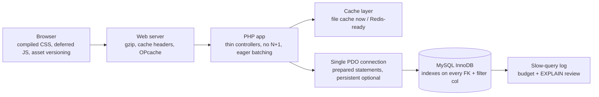
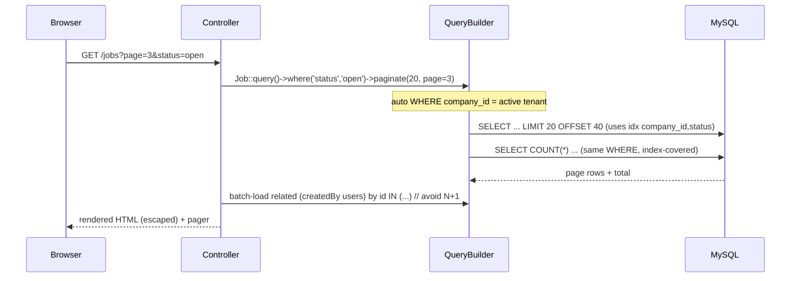

# 35 — Performance (الأداء)

The performance strategy for HalaOps: index every foreign key and filter column, paginate all lists, eliminate N+1 queries, run OPcache and compiled Tailwind assets, keep a single pooled PDO connection, cache safely behind a Redis-ready file cache, and hold every page and query to explicit, measurable budgets — all while running well on cheap shared hosting.

## Related Documents

- [05 — Database Architecture](05-Database-Architecture.md)
- [06 — ERD](06-ERD.md)
- [28 — Search System](28-Search-System.md)
- [30 — Frontend Architecture](30-Frontend-Architecture.md)
- [33 — System Diagnostics](33-System-Diagnostics.md)
- [34 — Security](34-Security.md)
- [36 — Scalability](36-Scalability.md)
- [44 — Production Checklist](44-Production-Checklist.md)

---

## Purpose (الهدف)

This document defines **how HalaOps stays fast** as tenants and data grow. It sets concrete latency and query budgets, prescribes the indexing and pagination rules that the schema and `QueryBuilder` must obey, names the N+1 patterns to avoid, and describes the caching, OPcache, asset-compilation, and connection-handling strategy. It is the operational counterpart to [05 — Database Architecture](05-Database-Architecture.md) (which defines the schema) and the precursor to [36 — Scalability](36-Scalability.md) (which adds horizontal capacity once vertical efficiency is exhausted).

The guiding rule: **be fast on a single small box first.** Most buyers run on shared hosting; the platform must feel instant there before we reach for replicas or queues.

## Why It Exists (سبب وجوده)

Performance is a product feature for a recruiting platform: recruiters live in candidate lists and pipelines, candidates abandon slow application forms, and AI interview flows already pay a latency tax to external providers — so the application around them must add as little as possible. Three constraints make a deliberate strategy necessary:

1. **Shared-hosting reality.** Limited CPU/RAM, often MySQL on the same host, no Redis by default, and no build step on the buyer's server. Optimisations must work *without* extra infrastructure, while leaving a clean upgrade path.
2. **Multi-tenancy.** Every tenant query carries a `WHERE company_id = ?`. Done right (FK + composite indexes leading with `company_id`) this *partitions* the working set and keeps each tenant fast regardless of total platform size; done wrong it is a full-table-scan trap.
3. **Growth to thousands of tenants.** Tables like `applications`, `interview_responses`, `notifications`, and `activity_log` grow without bound. Indexing, pagination, and retention must be designed in, not retrofitted.

## Architecture

Performance in HalaOps is the sum of several layers, each with an explicit responsibility:

| Layer | Mechanism | Real file / config |
| --- | --- | --- |
| Front-end | Compiled `public/assets/css/app.css`, asset versioning, deferred vanilla JS | `asset()` helper (`?v=` cache-bust), `resources/css` → Tailwind build |
| HTTP | OPcache, gzip, far-future cache headers on assets | server / `.htaccess`, `php.ini` |
| Application | Thin controllers, services, container singletons (no re-instantiation) | `App\Core\Container`, `app/Services` |
| Data access | Parameterized fluent builder, `paginate()`, aggregates, joins | `App\Core\QueryBuilder` |
| Connection | One lazily-opened PDO, reused for the whole request | `App\Core\Database::pdo()` |
| Caching | File cache under `storage/cache` now; swappable to Redis | cache layer, `App\Support\RateLimiter` (same pattern) |
| Database | InnoDB, utf8mb4, indexes per §11 | migrations under `database/migrations` |
| Observability | Slow-query budget, EXPLAIN review, diagnostics page | [33 — System Diagnostics](33-System-Diagnostics.md) |

## Workflow

### Serving a list page (the hottest path)

### Adding/optimising an index (developer loop)

1. Identify a query in the slow-query log or via diagnostics that exceeds the budget.
2. Run `EXPLAIN` — confirm it is hitting a full scan or filesort.
3. Add a **composite index leading with `company_id`** then the filter/sort columns, in a new migration (DDL runs outside a transaction — see `Database` note).
4. Re-`EXPLAIN`; verify `type` is `ref`/`range` and `Extra` no longer shows `Using filesort`/`Using temporary` where avoidable.
5. Record the before/after in the PR (see [42 — Code Review Checklist](42-Code-Review-Checklist.md)).

## Business Rules

1. **Every foreign key column is indexed.** No exceptions; FK constraints in InnoDB require/benefit from it and all tenant joins depend on it.
2. **Every column used in `WHERE`, `ORDER BY`, or `GROUP BY` on a hot path is indexed**, preferably as a composite index that leads with `company_id` (e.g. `(company_id, status)`, `(company_id, job_id, status, current_stage_id)` per §11).
3. **All multi-row list endpoints paginate** via `QueryBuilder::paginate()`. There is no unbounded "select all" rendered to a page.
4. **No N+1 queries.** Related records for a collection are batch-loaded with a single `whereIn(...)` keyed by id, not fetched per row in a loop.
5. **OPcache is enabled in production** so PHP is not recompiled per request; `validate_timestamps` is off in production and reset on deploy.
6. **CSS is compiled ahead of time** to `public/assets/css/app.css`; there is no build step on the buyer's server, and assets are served with versioned URLs (`asset()` appends `?v=`).
7. **One database connection per request.** `Database` opens PDO lazily and reuses it; code must never instantiate ad-hoc PDOs.
8. **Caching is used only where staleness is safe** (config, compiled permission maps, plan catalogue, translation strings) and is explicitly invalidated on write.
9. **Counts are bounded.** Expensive `COUNT(*)` on huge tables is index-backed or approximated/cached; dashboards prefer cached aggregates over live full scans.
10. **Slow queries are a defect.** Any query exceeding the budget below is logged and fixed, not ignored.

### Concrete targets (budgets)

| Metric | Target |
| --- | --- |
| Server-rendered page (p50), warm OPcache | < 150 ms |
| Server-rendered page (p95) | < 400 ms |
| JSON API response (p95) | < 250 ms |
| Single indexed query | < 10 ms |
| Slow-query threshold (logged + reviewed) | > 100 ms |
| DB queries per typical page | ≤ 10 |
| Default page size | 20 rows (configurable per list) |
| Compiled CSS size (gzipped) | < 50 KB |
| JS shipped per page (gzipped) | < 75 KB |
| Time to first byte (warm) | < 200 ms |

## Database Relations

Performance is largely a property of the schema (§11). Key indexed access paths the design relies on:

- **applications** — IDX(company_id, job_id, status, current_stage_id): powers the recruiter pipeline board and per-job candidate lists without scans; UQ(company_id, job_id, user_id) also prevents duplicate apply.
- **jobs** — IDX(company_id, status): job board filtering by open/closed within a tenant.
- **interviews** — IDX(company_id, application_id, status): interview lists per application.
- **notifications** — IDX(user_id, read_at): the unread-badge query is index-covered.
- **activity_log** — IDX(company_id, user_id, action): audit views filter quickly; large table, so paginate + retention apply (see [38 — Audit System](38-Audit-System.md)).
- **memberships** — IDX(user_id, status) + UQ(company_id, user_id): fast "my companies" and membership lookups during tenant resolution.
- **payments** — IDX(company_id, gateway_reference): webhook reconciliation lookups.
- All FK columns (`company_id`, `job_id`, `user_id`, `application_id`, `interview_id`, …) carry indexes by rule #1.

For search, MySQL **FULLTEXT** indexes back jobs/applications now behind a search abstraction so Meilisearch/Elasticsearch can replace them later without touching call sites (see [28 — Search System](28-Search-System.md)).

## Permissions

Performance work is platform-internal and gated for operators, not tenants:

- `platform.diagnostics` — super admins view health, cache state, queue depth, cron heartbeat, and (where surfaced) slow-query indicators via [33 — System Diagnostics](33-System-Diagnostics.md).
- No tenant-facing permission grants the ability to bypass pagination or run unbounded queries; list endpoints are paginated regardless of role, so a privileged user cannot accidentally trigger a full-table render.

## Validation

Performance-relevant input validation:

- **Pagination params** (`page`, `per_page`) are coerced to integers and clamped (`page >= 1`, `per_page` capped at a maximum, default 20) so a client cannot request a million-row page.
- **Sort/filter params** are validated against an allow-list of indexed columns; arbitrary user-supplied `ORDER BY` is never interpolated (also a security control — see [34 — Security](34-Security.md)).
- **Search terms** are length-bounded and sanitised before FULLTEXT matching.
- **Date ranges** for reports are bounded to avoid scanning unbounded history.

## Edge Cases

- **Deep pagination** (`OFFSET 100000`) is slow on large tables — for very large lists, use keyset/seek pagination (`WHERE id < ? ORDER BY id DESC LIMIT n`) instead of large `OFFSET`.
- **Cache stampede** on a hot, expired key — guarded by short TTL jitter and (when on Redis) a lock; file cache writes use `LOCK_EX` (as in `RateLimiter`).
- **N+1 hidden in views** — templates iterating a collection and calling a relation per row; caught in review and replaced with pre-batched data passed from the controller.
- **Missing index after a new feature** — the new query lands in the slow-query log; the index migration is a required part of shipping the module (production checklist).
- **OPcache serving stale code after deploy** — deploys must reset OPcache (touch/restart) so `validate_timestamps=0` does not pin old bytecode.
- **Shared-host MySQL contention** — keep transactions short, avoid long-held locks, and prefer the read replica once available (see [36 — Scalability](36-Scalability.md)).
- **Huge JSON columns** (`analysis`, `transcript LONGTEXT`) — never `SELECT *` these on list pages; fetch heavy columns only on detail views.
- **COUNT(*) on millions of audit rows** — paginate with a cached/approximate total rather than an exact live count.

## Performance

(The whole document is about performance; this section summarises the hot-path checklist that reviewers apply per feature.)

- Indexes: FK + every filter/sort column, composite leading with `company_id`. Verified with `EXPLAIN`.
- Pagination: every list uses `paginate()`; page size bounded; deep lists use keyset.
- N+1: collections batch-load relations via `whereIn`; no per-row queries in loops or templates.
- Selectivity: select only needed columns; never `SELECT *` for heavy/JSON columns on lists.
- Caching: config/permissions/plans/translations cached and invalidated on write; file cache now, Redis-ready.
- OPcache + compiled assets enabled; assets versioned and gzipped.
- Connection: single PDO per request; prepared statements (also security).
- Budgets respected: page < 150 ms p50 / < 400 ms p95; query < 10 ms; ≤ 10 queries/page.

## Testing

(See [39 — Testing Strategy](39-Testing-Strategy.md).)

- **N+1 regression tests:** assert a list endpoint executes a bounded number of queries (e.g. instrument the `Database` query count and assert it does not scale with row count).
- **Index presence tests:** assert critical indexes exist in the migrated schema (information_schema check) so a dropped index is caught.
- **Pagination tests:** `per_page` is clamped; `page` defaults to 1; out-of-range page returns an empty page, not an error; total is correct.
- **EXPLAIN gates (manual/CI):** key queries show `type` in (`ref`,`range`,`eq_ref`,`const`) and not `ALL`; no unexpected `Using filesort`/`Using temporary`.
- **Budget smoke tests:** representative pages render under the latency budget in a warm environment; flag regressions.
- **Cache correctness:** cached config/permissions reflect writes after invalidation; stale data is never served past TTL.
- **Asset tests:** compiled CSS exists and is versioned; pages reference `asset()` URLs.

## Future Expansion

- **Redis cache + sessions** behind the existing cache/session interfaces for shared, sub-millisecond caching across nodes (see [36 — Scalability](36-Scalability.md)).
- **Read replicas**: route read-only queries to a replica via a connection switch in `Database`, keeping writes on the primary.
- **Queue offloading** of AI calls, email, transcription, and heavy report generation so request latency stays flat (DB-backed `queued_jobs` now; Redis/SQS later).
- **Dedicated search engine** (Meilisearch/Elasticsearch) replacing FULLTEXT behind the search abstraction for large catalogues.
- **HTTP edge caching / CDN** for static assets and public job pages.
- **Materialised dashboard aggregates** (precomputed counts per tenant) refreshed by the worker to remove live `COUNT(*)`.
- **Per-query profiling hooks** and an APM integration surfaced in diagnostics for production tracing.
- **Table partitioning / archival** of `activity_log`, `notifications`, and `interview_responses` once retention windows are large.

## Open Questions

None at this time. Targets, indexes, and caching layers are fully specified and consistent with the schema in [05 — Database Architecture](05-Database-Architecture.md); items requiring more infrastructure are deferred to [36 — Scalability](36-Scalability.md) under Future Expansion.
