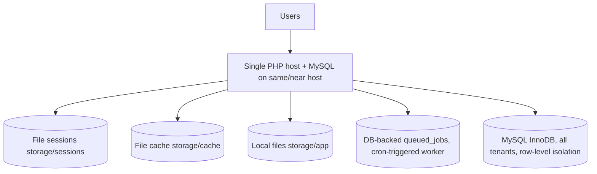
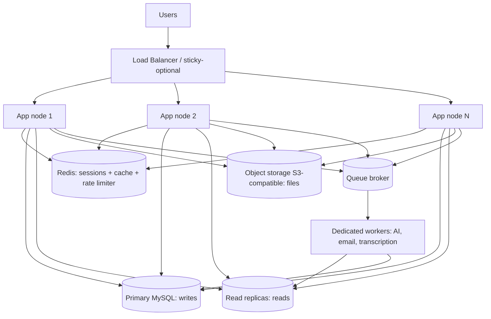

# 36 — Scalability (قابلية التوسع)

How HalaOps scales from a single shared-hosting box to thousands of tenants: make the app tier stateless (move sessions to DB/Redis), scale horizontally behind a load balancer, add read replicas, document the tenant-sharding evolution path, offload AI and email to queues, push files to object storage, and plan a five-year capacity outlook — all without rewriting the modular monolith.

## Related Documents

- [03 — System Architecture](03-System-Architecture.md)
- [05 — Database Architecture](05-Database-Architecture.md)
- [08 — Multi-Tenant](08-Multi-Tenant.md)
- [26 — Notification System](26-Notification-System.md)
- [27 — Storage System](27-Storage-System.md)
- [33 — System Diagnostics](33-System-Diagnostics.md)
- [35 — Performance](35-Performance.md)
- [45 — Future Roadmap](45-Future-Roadmap.md)

---

## Purpose (الهدف)

This document defines **how HalaOps grows under load** without abandoning its core design. It describes the architectural moves — statelessness, horizontal app scaling, read replicas, queueing, object storage, and ultimately tenant sharding — and the **order** in which they should be applied. It complements [35 — Performance](35-Performance.md) (vertical efficiency on one box) by adding horizontal capacity once a single node is fully optimised, and it elaborates the trade-offs of the shared-database tenancy model chosen in [08 — Multi-Tenant](08-Multi-Tenant.md).

The thesis: HalaOps is a **modular monolith that is already shaped for scale**. Strict row-level tenancy, a single front controller, container singletons, and swappable infrastructure seams (session store, cache, queue, storage, AI providers) mean we scale by *configuration and infrastructure*, not by rewriting application code.

## Why It Exists (سبب وجوده)

HalaOps targets **thousands of companies**, each with growing recruitment data and bursty AI workloads (interview generation, transcription, scoring). Two opposing pressures must be reconciled:

1. **Cheap entry.** The default deployment is a single shared host with one PHP runtime, one MySQL database, file-based sessions/cache, and no Redis or object store. The product must run here.
2. **Large-scale operation.** As a SaaS operator (or a large self-hosting customer) grows, the same codebase must serve heavy concurrent traffic, large datasets, and AI bursts without a forklift rewrite.

A documented, staged scaling path lets a deployment start tiny and grow predictably: each stage removes one bottleneck (state, app CPU, DB reads, blocking work, file storage, single-DB limits) using a seam the code already provides. This avoids both premature complexity and painful re-platforming.

## Architecture

### Today (single node, shared hosting)



### Scaled (horizontal, stateless tier)



### Scaling stages and the seams they use

| Stage | Bottleneck removed | Mechanism / seam |
| --- | --- | --- |
| 0. Optimise one node | CPU/IO per request | OPcache, indexes, pagination, N+1 removal ([35 — Performance](35-Performance.md)) |
| 1. Make app stateless | Local session/cache files | Move `Session` store and cache to DB then Redis; same `App\Core\Session` API |
| 2. Horizontal app tier | App CPU | N identical nodes behind a load balancer; deploy the same artifact |
| 3. Read replicas | DB read load | Route reads via `App\Core\Database` connection switch; writes to primary |
| 4. Queue offloading | Blocking AI/email | DB-backed `queued_jobs` → Redis/broker; dedicated workers |
| 5. Object storage | Local disk capacity | `files` disk abstraction → S3-compatible backend ([27 — Storage System](27-Storage-System.md)) |
| 6. Tenant sharding | Single-DB write/size ceiling | Route a tenant to a DB shard by `company_id`; row-level isolation already makes tenants independent |

## Workflow

### Going stateless (Stage 1) and adding nodes (Stage 2)

```mermaid
sequenceDiagram
    participant Op as Operator
    participant App as App node
    participant R as Redis
    participant LB as Load Balancer
    Op->>App: configure session driver = redis (config/session)
    App->>R: sessions + cache + rate-limit keys now centralised
    Op->>LB: add node 2..N (identical artifact)
    LB->>App: distribute requests (no sticky needed once state is shared)
    Note over App,R: any node can serve any request; logout/CSRF/throttle consistent
```

### Tenant sharding evolution (Stage 6)

```mermaid
sequenceDiagram
    participant Req as Request
    participant TM as TenantManager
    participant SR as Shard resolver
    participant DB as Shard DB
    Req->>TM: resolve active company_id (after auth)
    TM->>SR: shardFor(company_id) (lookup table / hash)
    SR-->>TM: shard connection name
    TM->>DB: bind Database to that shard for the request
    Note over DB: model tenant scope unchanged; queries still WHERE company_id = ?
```

## Business Rules

1. **The application tier must be stateless.** No request may depend on local disk state that another node lacks. Sessions, cache, and rate-limit counters move to a shared store (DB/Redis) before horizontal scaling.
2. **All writes go to the primary; reads may go to a replica.** Code must not assume read-after-write on a replica without routing that read to the primary when freshness is required.
3. **Tenant isolation is preserved at every stage.** Whether one DB or many shards, every tenant query is scoped by `company_id` via `App\Core\Model` and fails closed (see [08 — Multi-Tenant](08-Multi-Tenant.md)).
4. **Long or external work is queued, not done in the request.** AI provider calls, transcription, scoring, and email are pushed to `queued_jobs` and processed by workers.
5. **Files live behind the disk abstraction**, so moving from local disk to object storage is a configuration change, not a code change.
6. **Sharding routes by `company_id`.** A single tenant lives entirely on one shard; cross-tenant platform reporting uses an aggregation path, not cross-shard joins in the request path.
7. **No global mutable singletons that assume one process.** Container singletons are per-request; anything shared across requests goes to the shared store.
8. **Capacity is monitored.** Queue depth, replica lag, cache hit rate, and DB size are surfaced via diagnostics so scaling decisions are data-driven (see [33 — System Diagnostics](33-System-Diagnostics.md)).

## Database Relations

Scaling leans on schema features defined in §11:

- **company_id everywhere** (FK + index on every tenant table) — the single column that makes both read-replica routing and tenant sharding tractable, because each tenant's rows are already self-contained.
- **queued_jobs** (queue, payload LONGTEXT, attempts, available_at, reserved_at) IDX(queue, available_at) — the offloading backbone; a worker claims due jobs.
- **failed_jobs** (uuid UQ, payload, exception) — retry/inspection of failed background work.
- **files** (disk, path, checksum, visibility) — `disk` column lets rows point at local or object storage transparently ([27 — Storage System](27-Storage-System.md)).
- **sessions** (when moved to DB) — a sessions table replaces file storage for the stateless tier; the Redis driver supersedes it at higher scale.
- **subscriptions / plans (limits JSON)** — per-plan limits cap a single tenant's footprint, protecting shared capacity.

Sharding adds an operational **shard map** (tenant `company_id` → shard) maintained outside the per-tenant data; it is consulted by tenant resolution, not joined into queries.

## Permissions

- `platform.diagnostics` — super admins observe the signals that drive scaling (queue depth, cache, cron heartbeat, DB health).
- `platform.companies.manage` / `platform.users.manage` — platform-wide operations that legitimately span tenants use `withoutTenantScope()`; at shard scale these run via an aggregation/reporting path rather than live cross-shard queries.
- No tenant-level permission can affect cluster topology; scaling controls are operator-only and live outside the tenant RBAC surface.

## Validation

- **Plan limits** (`plans.limits JSON`) validate tenant resource usage (seats, jobs, AI calls) so one tenant cannot exhaust shared capacity (see [13 — Subscription System](13-Subscription-System.md)).
- **Queue payloads** are validated and size-bounded before enqueue; oversized or malformed jobs are rejected rather than poisoning a worker.
- **Upload size/MIME** validation (storage layer) bounds object-storage growth.
- **Shard-resolution input** (`company_id`) is the already-validated active tenant id; an unknown shard mapping fails closed.

## Edge Cases

- **Replica lag** causing stale reads — freshness-critical reads (e.g. immediately after a write) are pinned to the primary; UI tolerates eventual consistency elsewhere.
- **Sticky-session assumption** — once state is shared, sticky sessions are unnecessary; until then, a node restart would drop file sessions, so Stage 1 must precede Stage 2.
- **Rate limiter per node** — file-based `RateLimiter` counts per node; before horizontal scaling it must move to the shared store or limits become N× looser.
- **Worker thundering herd / duplicate processing** — jobs are claimed atomically (`reserved_at`) and made idempotent; `failed_jobs` captures exhausted retries.
- **Cron not firing** on a node — the cron heartbeat in diagnostics detects a stalled worker; the queue is processed by a dedicated worker, not tied to web traffic.
- **Hot tenant** dominating a shard — the shard map allows moving a heavy tenant to a dedicated shard; per-plan limits reduce the chance.
- **Cross-tenant report at shard scale** — handled by fan-out aggregation, never a synchronous cross-shard JOIN in a request.
- **Object-storage outage** — file reads degrade gracefully; uploads queue/retry; the disk abstraction can fail over to a secondary disk.

## Performance

Scalability and performance are complementary: scale only *after* a node is efficient.

- **Statelessness removes disk-IO contention** on sessions/cache and unlocks linear app scaling.
- **Read replicas** offload the read-heavy recruiter/candidate browsing traffic from the write primary; with `company_id`-leading composite indexes ([35 — Performance](35-Performance.md)), replica reads stay cheap.
- **Queues flatten latency**: the request returns immediately while AI/email run asynchronously, keeping p95 within budget even during provider slowness.
- **Object storage** offloads large transcript/recording/file IO from app nodes and the DB.
- **Sharding bounds per-DB table sizes**, keeping index depth and `COUNT`/scan costs low even at thousands of tenants.

## Testing

(See [39 — Testing Strategy](39-Testing-Strategy.md).)

- **Statelessness test:** with the shared session/cache driver configured, a session created via one app instance is readable by another; no behaviour depends on local files.
- **Read/write routing test:** writes hit the primary; reads use the replica connection; a freshness-critical read after write is pinned to primary and returns the new value.
- **Queue tests:** enqueue → worker claims exactly once (`reserved_at`); failure path lands in `failed_jobs`; retried job is idempotent.
- **Tenant isolation under sharding (security):** a request resolves to the correct shard; queries still carry `WHERE company_id`; no cross-tenant/cross-shard leakage.
- **Storage abstraction test:** the same upload/download code path works against local disk and an S3-compatible backend (mock) by switching `disk`.
- **Capacity signal tests:** diagnostics report queue depth, cache availability, and cron heartbeat accurately (see [33 — System Diagnostics](33-System-Diagnostics.md)).
- **Load/soak (manual):** representative concurrency holds the [35 — Performance](35-Performance.md) budgets across N nodes.

## Future Expansion (5-Year Capacity Outlook)

A staged outlook from launch to thousands of tenants:

- **Year 1 — Single optimised node (hundreds of tenants).** Shared hosting or one VPS; file sessions/cache; DB-backed queue with cron worker; local files. Focus: indexes, pagination, N+1 removal.
- **Year 2 — Statelessness + first horizontal step (low thousands).** Sessions/cache/rate-limiter on Redis; 2–3 app nodes behind a load balancer; dedicated queue worker; files moved to object storage.
- **Year 3 — Read scaling (thousands).** One or more MySQL read replicas; reads routed off the primary; search moved to Meilisearch/Elasticsearch behind the search abstraction ([28 — Search System](28-Search-System.md)); CDN for assets and public job pages.
- **Year 4 — Workload isolation.** Separate worker fleets per workload (AI, email, transcription); autoscaling app and worker tiers on queue depth and CPU; per-plan rate budgets for AI.
- **Year 5 — Tenant sharding (many thousands).** Tenants routed to DB shards by `company_id`; a control plane manages the shard map and tenant migration; platform reporting via an aggregation/warehouse pipeline. The application code is unchanged because tenancy was row-level and fail-closed from day one.

Throughout, the **modular monolith is preserved**; module boundaries (auth, tenancy, RBAC, billing, AI, recruitment) remain the seams along which any future service extraction could occur if ever warranted (see [45 — Future Roadmap](45-Future-Roadmap.md)).

## Open Questions

None at this time. The scaling path, its ordering, and the seams it uses are fully determined by the architecture and the canonical context (§5, §13); each stage is independently adoptable and tracked under Future Expansion.
