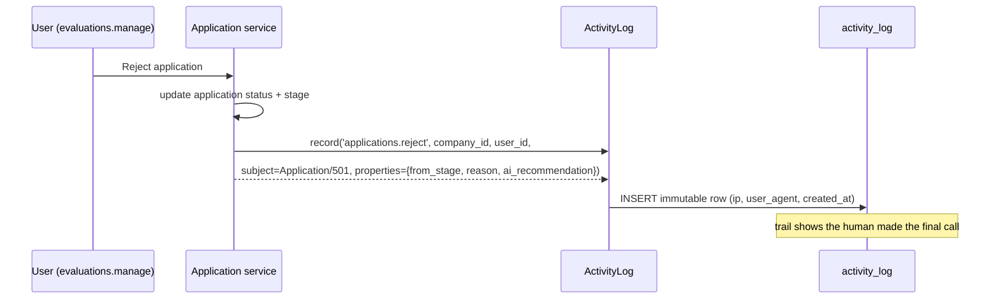

# 38 — Audit System (نظام التدقيق)

The audit trail of HalaOps, backed by the `activity_log` table and written through `App\Models\ActivityLog::record()`: a tamper-evident, tenant-scoped record of who did what and when — authentication events, role and permission changes, company/AI/billing changes, and hiring decisions — capturing actor, subject, properties, IP, and user agent, with defined retention, viewing/exporting, and a clear relationship to operational logging.

## Related Documents

- [07 — RBAC](07-RBAC.md)
- [08 — Multi-Tenant](08-Multi-Tenant.md)
- [12 — Company Management](12-Workspace-Management.md)
- [14 — Billing System](14-Billing-System.md)
- [25 — Application Lifecycle](25-Application-Lifecycle.md)
- [34 — Security](34-Security.md)
- [37 — Logging](37-Logging.md)

---

## Purpose (الهدف)

This document defines the **business and security audit trail** of HalaOps: a durable, queryable record of significant actions taken in the system. Where [37 — Logging](37-Logging.md) captures *operational* events for engineers in transient files, the audit system answers the *accountability* questions — **who** performed **what** action on **which** subject, **when**, and **from where** — and stores them in the database (`activity_log`) so they survive, can be filtered, scoped per tenant, exported, and used for compliance, dispute resolution, and incident investigation.

Every entry is created through the single, deliberate API `App\Models\ActivityLog::record()`, so auditing is consistent and centralised rather than scattered.

## Why It Exists (سبب وجوده)

A multi-tenant HR/recruitment platform makes **consequential, contestable decisions**: a candidate is rejected, a member is removed, a role granting billing access is assigned, an AI credential is changed, an invoice is voided. Customers (and regulators) need to know these were legitimate and traceable. Operational file logs are unsuitable for this because they are transient, unstructured for querying, mixed across tenants, and not safe to expose to a tenant.

The audit system exists to provide:

- **Accountability** — a per-tenant history attributable to a specific actor.
- **Security forensics** — auth events and authorization changes with IP/user-agent for incident response (supports OWASP A09 — see [34 — Security](34-Security.md)).
- **Compliance & trust** — an exportable trail customers can review.
- **Human-in-the-loop traceability** — recording that AI output was advisory and that a *user* made the final hiring decision (see [25 — Application Lifecycle](25-Application-Lifecycle.md)).

## Architecture

```mermaid
flowchart TD
    A[Service / Controller action<br/>auth, role, company, AI, billing, decision] --> B[ActivityLog::record(...)]
    B --> C[withoutTenantScope()->insert]
    C --> D[(activity_log table)]
    D --> E[Tenant audit viewer<br/>scoped to active company_id]
    D --> F[Super-admin platform audit<br/>cross-tenant + company_id NULL events]
    D --> G[Export CSV/JSON]
    H[App\Core\Logger files] -. separate operational path .-> I[storage/logs]
```

`App\Models\ActivityLog` is a global (non-tenant-scoped) model whose `record()` method writes one row with:

- **actor** — `user_id` (nullable; SET NULL on user deletion so history survives),
- **action** — a dotted event key (e.g. `auth.login`, `roles.assign`, `applications.reject`),
- **subject** — `subject_type` + `subject_id` (the entity acted upon),
- **description** — optional human-readable summary,
- **properties** — `JSON` of contextual details (e.g. old/new role, from/to stage),
- **company_id** — the tenant the event belongs to (NULL for platform-level events),
- **ip** + **user_agent** — captured from the current request (user-agent truncated to 255 chars),
- **created_at** — event time.

It deliberately uses `withoutTenantScope()->insert()` so the writer can stamp the correct `company_id` explicitly (including platform events with NULL) rather than relying on the auto tenant scope. `timestamps` is off because the table has only `created_at` (entries are immutable — there is no `updated_at`).

## Workflow

### Recording a hiring decision (advisory AI → human decision)



### Viewing the audit trail (tenant-scoped)

```mermaid
sequenceDiagram
    participant U as User (with view permission)
    participant C as Audit controller
    participant DB as activity_log
    U->>C: GET /audit?action=roles.assign&page=1
    C->>DB: SELECT ... WHERE company_id = active tenant AND action = ? ORDER BY created_at DESC LIMIT 20
    Note over DB: IDX(company_id, user_id, action)
    DB-->>C: page of entries
    C-->>U: rendered, escaped, paginated; export option
```

## Business Rules

1. **Audited event categories** (minimum set):
   - **Authentication**: `auth.login`, `auth.login_failed`, `auth.logout`, `auth.password_reset_requested`, `auth.password_reset`.
   - **Authorization / roles**: `roles.create`, `roles.update`, `roles.delete`, `roles.assign`, `roles.revoke`, permission changes.
   - **Membership**: `members.invite`, `members.update`, `members.remove`.
   - **Company**: `company.create`, `company.update`, `company.suspend`, settings changes.
   - **AI credentials**: `ai.credential.create`, `ai.credential.update`, `ai.credential.delete` (never the key value).
   - **Billing/subscription**: `subscription.create`, `subscription.cancel`, `invoice.paid`, `invoice.void`, `payment.succeeded`, `payment.failed`.
   - **Recruitment decisions**: `applications.move`, `applications.reject`, `applications.hire`, `interviews.schedule`, `evaluations.create`.
2. **One canonical writer.** All audit entries go through `ActivityLog::record()`; no ad-hoc inserts into the table.
3. **Audit entries are immutable.** There is no update or delete path in normal application flow; the table has `created_at` only and is append-only.
4. **Actor and subject are always recorded** where known: `user_id` (NULL only for system/anonymous events such as a failed login on an unknown email), and `subject_type`/`subject_id` for the affected entity.
5. **Never store secrets in `properties`.** AI keys, passwords, tokens, and full PII are excluded; record references (ids) and non-sensitive deltas (e.g. role slug, old→new status) instead — same rule as [37 — Logging](37-Logging.md).
6. **Tenant scoping of audit data.** Tenant events carry `company_id`; viewers within a tenant see only their company's entries; platform events use NULL and are visible only to super admins.
7. **IP and user agent are captured** from the request for forensic value; user agent is truncated to 255 chars.
8. **Retention is bounded but long** (default 12 months for general events; security/financial events retained longer per policy), then archived/pruned.
9. **Auditing must not block the action's success path** unduly; a failed audit insert is itself logged via `Logger` rather than failing the user's operation.

## Database Relations

The audit trail is the **activity_log** table (§11, migration 0015):

| Column | Type | Notes |
| --- | --- | --- |
| id | BIGINT UNSIGNED PK | |
| company_id | BIGINT UNSIGNED, FK→companies (CASCADE), NULL | tenant scope; NULL = platform event |
| user_id | BIGINT UNSIGNED, FK→users (SET NULL) | actor; survives user deletion |
| action | VARCHAR | dotted event key |
| subject_type | VARCHAR, NULL | entity class acted upon |
| subject_id | BIGINT UNSIGNED, NULL | entity id |
| description | TEXT/VARCHAR, NULL | human-readable summary |
| properties | JSON, NULL | contextual, non-sensitive details |
| ip | VARCHAR, NULL | request IP (`Request::ip()`) |
| user_agent | VARCHAR(255), NULL | truncated UA |
| created_at | TIMESTAMP | event time; immutable |

Index: **IDX(company_id, user_id, action)** supports the common filters (by tenant, by actor, by action type). FK behaviour is chosen so audit history is preserved: `company_id` cascades with the company (when a tenant is fully deleted its audit goes too), while `user_id` is SET NULL so deleting a user does not erase the record of their actions. Subjects are referenced loosely by `subject_type`/`subject_id` (polymorphic) rather than hard FKs, so an entry survives the subject's deletion.

## Permissions

- **Viewing tenant audit**: gated by a tenant permission (e.g. `settings.view`/an audit-view permission within the §6 catalogue); always **scoped to the active `company_id`** so one tenant cannot read another's history.
- **Platform audit (cross-tenant + NULL events)**: `platform.diagnostics` / super-admin only, using `withoutTenantScope()`.
- **No one can edit or delete audit entries through the UI**; retention/archival is an operator process, not a user permission. This separation is itself a control: even an administrator cannot quietly rewrite history.
- **Writing audit entries** is performed by the application on the user's behalf during permitted actions; it is not a directly user-invokable operation.

## Validation

- **action** is constrained to known dotted keys (validated against the catalogue) so the trail stays queryable and consistent.
- **properties** is validated to be JSON-serialisable and **scrubbed of sensitive keys** (`password`, `token`, `api_key`, `credentials`, `secret`) before encoding (`json_encode(..., JSON_UNESCAPED_UNICODE)`), mirroring the logging redaction rule.
- **company_id / user_id / subject_id** are integers or NULL; an invalid actor/tenant is recorded as NULL rather than fabricated.
- **user_agent** is truncated to 255 characters before insert (as in `ActivityLog::record`).
- **Filter/sort inputs** on the audit viewer are validated against indexed, allow-listed columns (`action`, `user_id`, date range) — never interpolated (see [34 — Security](34-Security.md)).

## Edge Cases

- **Deleted actor** → `user_id` becomes NULL (SET NULL); the entry remains, optionally with a cached display name in `properties` so the trail is still readable.
- **Deleted subject** → polymorphic `subject_type`/`subject_id` may dangle; the viewer shows the recorded type/id even if the entity is gone.
- **Platform (no tenant) events** → `company_id` NULL; excluded from tenant views, included in super-admin platform audit.
- **Failed login on an unknown email** → recorded as `auth.login_failed` with `user_id` NULL and the attempted email kept out of plaintext-sensitive fields (or stored as a non-identifying property per policy), preserving anti-enumeration ([34 — Security](34-Security.md)).
- **Audit insert fails** (e.g. DB hiccup) → the action still succeeds and the failure is sent to `Logger` (`error`), so an audit outage degrades gracefully rather than blocking business.
- **High-volume actions** (e.g. bulk application moves) → may be summarised into a single entry with counts in `properties` to avoid flooding; or queued for batch insert at scale (see Future Expansion).
- **Tampering attempt** → no application path updates/deletes rows; tamper-evidence is addressed below and in Future Expansion.

## Security

- **Tamper-evidence considerations.** Entries are append-only with no application update/delete path and no `updated_at`. To detect out-of-band tampering (e.g. direct SQL on the DB), the design allows a **hash-chain** enhancement: each row can store a hash of its canonical content plus the previous row's hash, so any retroactive edit breaks the chain. This is documented here and listed under Future Expansion; the immutable-by-design schema is the baseline control.
- **Least exposure.** Audit data is tenant-scoped on read and never contains secrets/keys; even a leaked tenant audit reveals actions, not credentials.
- **Forensic value.** IP + user agent + actor + timestamp give incident responders a usable trail for the security events enumerated in [34 — Security](34-Security.md) (OWASP A09: logging & monitoring).
- **Separation of duties.** Because no user can alter the trail, it can be trusted in disputes even against privileged insiders.

## Performance

- **Single indexed insert per event** — cheap; `IDX(company_id, user_id, action)` also serves the read filters (see [35 — Performance](35-Performance.md)).
- **Reads are always paginated** and tenant-scoped, so the viewer stays fast even as the table grows.
- **Large table management** — `activity_log` grows unbounded over time; retention pruning/archival and (at scale) partitioning by date keep it healthy; heavy `COUNT(*)` is avoided/approximated.
- **No hot-path coupling** — auditing adds one insert to consequential actions only (not to every read), and can be moved to the queue if write volume warrants (see [36 — Scalability](36-Scalability.md)).

## Testing

(See [39 — Testing Strategy](39-Testing-Strategy.md).)

- **Recording tests:** each consequential action (login, role assign, member remove, AI credential change, subscription cancel, application reject/hire) writes exactly one `activity_log` row with correct `action`, actor, subject, and `company_id`.
- **Tenant scoping (security):** a tenant's audit query returns only its own `company_id` rows; user A cannot read user B's company audit; platform NULL events are hidden from tenants.
- **No-secrets test:** recording an AI credential change stores no key material in `properties`; redaction strips sensitive keys.
- **Immutability test:** there is no code path to update/delete an entry; the table has no `updated_at`.
- **Actor-deletion test:** deleting a user nulls `user_id` on their entries (SET NULL) and the rows remain.
- **Graceful-failure test:** when the audit insert fails, the underlying action still succeeds and an error is logged.
- **Export test:** CSV/JSON export contains the same fields, is tenant-scoped, and escapes content safely.
- **Anti-enumeration test:** `auth.login_failed` on an unknown email records without revealing account existence.

## Future Expansion

- **Hash-chained tamper-evidence** (per-row content + previous-hash) with a periodic verification job and a diagnostics indicator, hardening the trail against direct-DB tampering.
- **Append-only / WORM export** to external immutable storage (object lock) for regulated customers.
- **Richer subject typing** and clickable links from an audit entry to the affected entity in the UI.
- **Configurable per-category retention** (e.g. keep security and financial events longer than routine ones) surfaced in admin settings.
- **Queue-buffered, batched audit writes** at high scale to keep consequential actions snappy (see [36 — Scalability](36-Scalability.md)).
- **SIEM streaming** of audit events alongside operational logs ([37 — Logging](37-Logging.md)) for centralised monitoring and alerting.
- **Saved filters & scheduled exports** for compliance reviewers, and digest notifications for sensitive actions (role grants, billing changes).

## Open Questions

None at this time. The audit model, schema, scoping, and write API are fully defined by `App\Models\ActivityLog` and the canonical context (§11, §13); tamper-evidence hardening and streaming are deferred to Future Expansion without changing the baseline append-only design.
