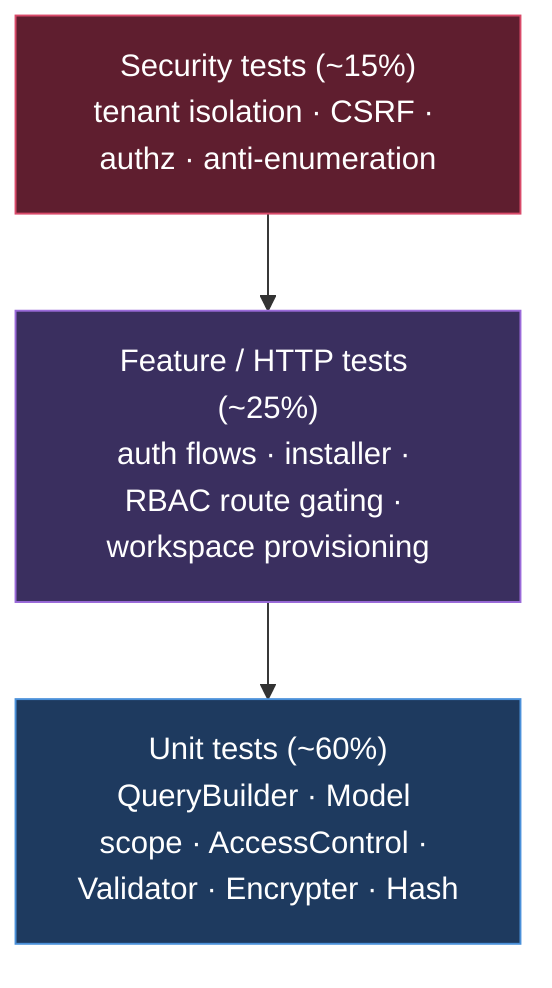
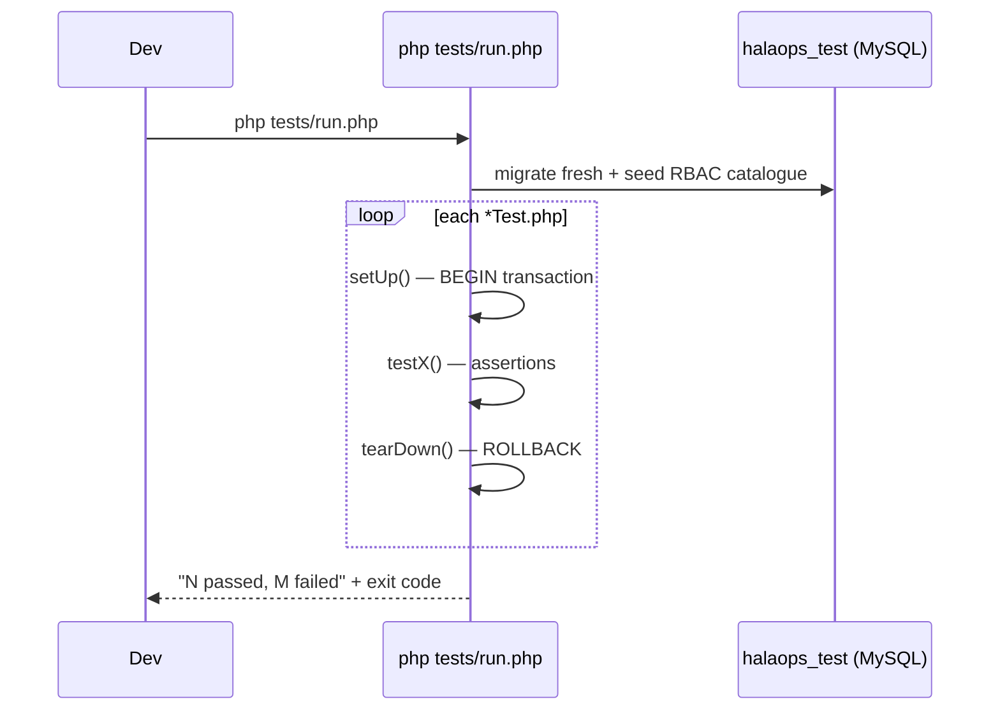

# 39 — Testing Strategy (استراتيجية الاختبار)

The test pyramid for a zero-dependency, framework-free PHP 8.2 multi-tenant SaaS: a lightweight in-house test runner, fast unit tests over the core (QueryBuilder, Model tenant scoping, AccessControl, Validator, Encrypter), feature/HTTP tests for auth/installer/RBAC gating, and security tests that prove tenant isolation fails closed.

## Related Documents

- [40 — QA Checklist](40-QA-Checklist.md)
- [42 — Code Review Checklist](42-Code-Review-Checklist.md)
- [41 — Coding Standards](41-Coding-Standards.md)
- [07 — RBAC](07-RBAC.md)
- [08 — Multi-Tenant](08-Multi-Tenant.md)
- [09 — Authentication](09-Authentication.md)
- [34 — Security](34-Security.md)
- [32 — Setup / Installer](32-Setup-Installer.md)
- [44 — Production Checklist](44-Production-Checklist.md)

---

## Purpose (الهدف)

This document defines **how HalaOps is tested** so that every release is provably correct on the three axes the product cannot get wrong: **tenant isolation**, **authorization**, and **authentication/installer integrity**. It specifies:

- the **test pyramid** (how many of which kind of test, and why),
- a **lightweight in-house test runner** that needs zero Composer dependencies (consistent with §2 of the canonical context), with a documented PHPUnit *dev-only* alternative,
- concrete **unit tests** for the core (`App\Core\QueryBuilder`, `App\Core\Model` tenant scoping, `App\Services\Rbac\AccessControl`, `App\Core\Validator`, `App\Core\Encrypter`, `App\Core\Hash`),
- **feature/HTTP tests** for the auth flows, the browser installer, and RBAC route gating,
- **security tests** that assert fail-closed behaviour (cross-tenant reads throw, CSRF rejects, authz denies),
- **test data / factories**, a **test database lifecycle**, and a **CI** pipeline.

Every example below uses the *actual* API on disk (e.g. `Model::query()` throwing `RuntimeException` when tenant-scoped with no active tenant, `VerifyCsrfToken` returning HTTP 419, `ThrottleRequests` returning 429).

## Why It Exists (سبب وجوده)

HalaOps is sold to **thousands of isolated tenants** and stores each tenant's **encrypted AI provider keys** (§9). A single regression that leaks one company's data into another, or that lets a Recruiter perform an Owner-only action, is a catastrophic, possibly contract-ending, failure. Three forces make a formal strategy mandatory:

1. **No framework safety net.** Laravel/Symfony ship batteries-included test tooling and a battle-tested ORM scope. We deliberately built our own tiny core (§2–§4), so the guarantees those frameworks give for free — parameter binding, tenant scoping, CSRF — are *our* responsibility to prove with tests.
2. **Zero runtime dependencies, no CLI for the buyer.** We cannot assume the buyer's host has Composer/PHPUnit. Tests therefore run from a **self-contained runner** (`tests/run.php`) that uses only the PHP CLI we have in development; the buyer never runs them.
3. **The riskiest logic is centralised.** Tenant scoping lives in one method (`Model::query()`), authorization in one service (`AccessControl::allows()`), encryption in one class (`Encrypter`). Centralisation means a *small, high-value* set of tests can lock down the whole platform's security posture — the perfect target for a test pyramid weighted toward fast unit tests.

The existing **verification harnesses already proven by hand** — install (requirements → migrate → seed → admin → finalize), auth (login/throttle/logout), and tenant isolation (scoped query fails closed) — are formalised here as repeatable automated suites rather than one-off manual checks.

## Architecture

### The test pyramid



- **Unit (~60%)** — pure, in-memory or single-table assertions over Core/Services. Fast (sub-second total), no HTTP. These are the bulk because the security-critical logic is centralised and cheaply unit-testable.
- **Feature/HTTP (~25%)** — drive a real request through the kernel (`App\Core\Application`) or a controller with a faked `Request`, asserting status codes, redirects, flashed errors, and DB side-effects.
- **Security (~15%)** — adversarial tests that assert the system *refuses* the wrong thing (cross-tenant access throws, missing CSRF → 419, lacking permission → 403). These overlap unit+feature but are grouped so a reviewer can see the threat coverage at a glance.

### Directory layout (new)

```
tests/
  run.php                      # zero-dependency runner entry point (php tests/run.php)
  bootstrap.php                # loads autoloader, boots a test container, test .env
  TestCase.php                 # base assertions + helpers (assertTrue, assertThrows, ...)
  Support/
    Factory.php                # builds users/workspaces/roles/memberships for tests
    DatabaseTransactions.php   # wrap each test in a rolled-back transaction
    FakeTenant.php             # set/clear the active tenant in tests
  Unit/
    QueryBuilderTest.php
    ModelTenantScopeTest.php
    AccessControlTest.php
    ValidatorTest.php
    EncrypterTest.php
    HashTest.php
  Feature/
    LoginTest.php
    RegisterTest.php
    PasswordResetTest.php
    InstallerTest.php
    RbacGatingTest.php
    WorkspaceProvisioningTest.php
  Security/
    TenantIsolationTest.php
    CsrfTest.php
    AuthorizationTest.php
    AntiEnumerationTest.php
phpunit.xml.dist               # OPTIONAL dev-only PHPUnit config (see below)
```

`tests/` is **never web-served** (it lives outside `public/` and is excluded by deployment packaging per [44 — Production Checklist](44-Production-Checklist.md)).

### The in-house test runner (zero dependencies)

To honour "zero runtime Composer dependencies" we ship a ~120-line runner. It autoloads via the existing `bootstrap/autoload.php`, discovers `*Test.php` files, instantiates each, runs every `test*` method, and prints a TAP-like summary with a non-zero exit code on failure (so CI fails the build).

```php
<?php
// tests/run.php — run with: php tests/run.php  (optionally php tests/run.php Unit)
declare(strict_types=1);

require __DIR__ . '/bootstrap.php';

$filter = $argv[1] ?? '';                       // e.g. "Unit", "Security", "Login"
$root   = __DIR__;
$files  = new RecursiveIteratorIterator(new RecursiveDirectoryIterator($root));

$passed = 0; $failed = 0; $failures = [];

foreach ($files as $file) {
    if (! str_ends_with($file->getFilename(), 'Test.php')) {
        continue;
    }
    if ($filter !== '' && ! str_contains($file->getPathname(), $filter)) {
        continue;
    }

    require_once $file->getPathname();
    $class = 'Tests\\' . pathinfo($file->getFilename(), PATHINFO_FILENAME);
    if (! class_exists($class)) {
        continue;
    }

    $instance = new $class();
    foreach (get_class_methods($instance) as $method) {
        if (! str_starts_with($method, 'test')) {
            continue;
        }
        try {
            $instance->setUp();
            $instance->{$method}();
            $instance->tearDown();
            $passed++;
            echo "  ok   {$class}::{$method}\n";
        } catch (Throwable $e) {
            $failed++;
            $failures[] = "{$class}::{$method} — {$e->getMessage()}";
            echo "  FAIL {$class}::{$method}\n";
            $instance->tearDown();
        }
    }
}

echo "\n{$passed} passed, {$failed} failed\n";
foreach ($failures as $f) {
    echo "  - {$f}\n";
}
exit($failed === 0 ? 0 : 1);
```

The base `TestCase` provides minimal assertions so tests stay framework-free:

```php
<?php
// tests/TestCase.php
declare(strict_types=1);

namespace Tests;

abstract class TestCase
{
    public function setUp(): void {}
    public function tearDown(): void {}

    protected function assertTrue(bool $cond, string $msg = 'Expected true'): void
    {
        if (! $cond) {
            throw new \AssertionError($msg);
        }
    }

    protected function assertSame(mixed $expected, mixed $actual, string $msg = ''): void
    {
        if ($expected !== $actual) {
            throw new \AssertionError($msg ?: 'Expected ' . var_export($expected, true)
                . ' got ' . var_export($actual, true));
        }
    }

    /** Assert the callback throws (optionally a specific class). */
    protected function assertThrows(string $class, callable $fn, string $msg = ''): void
    {
        try {
            $fn();
        } catch (\Throwable $e) {
            if (! $e instanceof $class) {
                throw new \AssertionError("Expected {$class}, got " . $e::class . ': ' . $e->getMessage());
            }
            return;
        }
        throw new \AssertionError($msg ?: "Expected {$class} to be thrown, nothing was.");
    }
}
```

### Dev-only PHPUnit alternative (documented, optional)

A team that prefers a standard tool MAY add PHPUnit **as a `require-dev` dependency only**. This does **not** violate §2 because `require-dev` packages are excluded from the deployable artifact (`composer install --no-dev`), so the buyer's server still has zero runtime dependencies. In that mode:

- Test classes extend `PHPUnit\Framework\TestCase` instead of `Tests\TestCase`.
- A `phpunit.xml.dist` declares the `Unit`, `Feature`, `Security` test suites and bootstraps `tests/bootstrap.php`.
- CI runs `vendor/bin/phpunit` instead of `php tests/run.php`.

The repository defaults to the **in-house runner** so the test suite always runs even on a machine with no Composer. The two are kept interchangeable by keeping assertion calls (`assertSame`, `assertTrue`) compatible in name.

### Test bootstrap & container

`tests/bootstrap.php` loads the autoloader, reads `.env.testing`, builds a `Container` with the same singletons as production (`config`, `db`, `encrypter`, `session`, `tenant`, `auth`, `access`), but points `db` at a disposable test schema and uses an array-backed session so no cookies/files are touched.

```php
<?php
// tests/bootstrap.php
declare(strict_types=1);

require dirname(__DIR__) . '/bootstrap/autoload.php';

use App\Core\Container;
use App\Core\Config;
use App\Core\Database;
use App\Core\Encrypter;

$container = Container::getInstance();
$container->instance('path.base', dirname(__DIR__));

$config = new Config(require dirname(__DIR__) . '/config/app.php' /* + others */);
$container->instance('config', $config);

$container->singleton('db', fn () => new Database([
    'host'      => getenv('TEST_DB_HOST') ?: '127.0.0.1',
    'port'      => getenv('TEST_DB_PORT') ?: '3306',
    'database'  => getenv('TEST_DB_DATABASE') ?: 'halaops_test',
    'username'  => getenv('TEST_DB_USERNAME') ?: 'root',
    'password'  => getenv('TEST_DB_PASSWORD') ?: '',
    'charset'   => 'utf8mb4',
    'collation' => 'utf8mb4_unicode_ci',
]));

$container->singleton('encrypter', fn () => new Encrypter(Encrypter::generateKey()));
// tenant + auth + access registered the same way as bootstrap/app.php
```

## Workflow

### Local developer loop



1. Developer runs `php tests/run.php` (or `php tests/run.php Security` to scope).
2. The runner (via bootstrap) ensures the **test schema** is migrated fresh and the RBAC catalogue is seeded once.
3. Each test wraps its work in a DB transaction that is **rolled back** in `tearDown()` (`DatabaseTransactions` trait), so tests are isolated and order-independent.
4. A non-zero exit code blocks the commit/PR.

### Test database lifecycle

- Tests use a **dedicated database** (`halaops_test`), never the dev/prod DB.
- Schema is created by reusing `Database\Migrator` against the test connection (the exact code path the installer uses — see `runMigrations()` in `App\Services\Install\InstallManager`).
- The RBAC permission/role catalogue is seeded with `App\Services\Rbac\RbacManager::syncPermissions()` so authorization tests run against the real catalogue, not hand-written fixtures.
- Per-test isolation is via transactions + rollback; the slow "migrate fresh" happens once per run.

## Business Rules

1. **A change to `Model`, `QueryBuilder`, `AccessControl`, `TenantManager`, `Encrypter`, `Hash`, or any middleware MUST ship with tests** — enforced by [42 — Code Review Checklist](42-Code-Review-Checklist.md).
2. **Every new tenant-scoped table/model gets a tenant-isolation test** proving (a) reads are filtered by `workspace_id` and (b) `query()` throws with no active tenant.
3. **Every new permission-gated route gets an RBAC gating test** proving an unauthorised role receives 403 and an authorised role receives 200.
4. **The CI build fails on any failing test** (exit code propagated); no merging red.
5. **No test depends on real network, real email, or a real AI provider** — `Mailer` and `AiProviderInterface` are faked.
6. **Tests never run against production or staging databases**; the connection name is asserted at bootstrap.
7. **Security tests are mandatory and may not be skipped/`@group skip`** without a documented Open Question and reviewer sign-off.

## Database Relations

Tests exercise the full schema from §11 but concentrate on the isolation-critical tables:

- **users** (global) — login/auth tests; `email` uniqueness; `status` gating in `AuthManager::user()`.
- **workspaces** (tenant root) — provisioning tests; `(owner_id, workspace_status_id)` index; `slug` uniqueness.
- **memberships** — `UQ(workspace_id, user_id)`, an `active` membership status is the gate `TenantManager::userBelongsTo()` checks.
- **roles / permissions / role_permissions / membership_roles / user_roles** — the join chain `AccessControl::effectivePermissions()` resolves; tests assert the union + parent-chain expansion.
- **subscriptions** — `WorkspaceService` provisioning test asserts a `trialing` row is created on the default plan.
- **tenant_ai_keys** — `UQ(workspace_id, provider)`; encryption round-trip and per-tenant isolation tests.
- **password_resets** — hashed token + TTL behaviour for anti-enumeration tests.

Factories insert into these with **explicit `workspace_id`** (via `withoutTenantScope()` / raw builder) because the entity under construction is not yet the active tenant — mirroring `WorkspaceService::create()`.

## Permissions

Authorization tests assert the catalogue and resolution rules from §6 and [07 — RBAC](07-RBAC.md):

- A **super-admin** (global `super-admin` role, `workspace_id NULL`) passes *every* `access()->allows()` check — assert `AccessControl::allows('anything.at.all')` is `true`.
- A tenant **owner** has all tenant permissions; **admin** has all except `billing.manage` and ownership actions; **recruiter** has `jobs.*`/`applications.*` subsets but **not** `roles.manage` or `billing.manage`.
- **Inheritance**: a child role with `parent_id` inherits the parent's permissions — assert a role with parent `member` also resolves the member's keys.
- **Any-of semantics** of `permission:a,b` middleware — assert a user with only `b` is allowed.
- **Fail closed**: with no active tenant and no global role, `permissionKeys()` returns `[]` and every check denies.

## Validation

Validator unit tests cover each rule in `App\Core\Validator` and the throwing contract:

- `required`, `email`, `min`, `max`, `between`, `numeric`, `integer`, `boolean`, `confirmed`, `same`, `different`, `in`, `not_in`, `alpha`, `alpha_num`, `alpha_dash`, `url`, `string`, `array`, `regex`, `date`, `nullable`, `unique:table,col[,ignoreId]`, `exists:table,col`.
- `nullable` short-circuits: a `null`/`''` value with `nullable` skips later rules.
- One error per field (rules stop at first failure) — assert only the first failing rule's message appears.
- `validate()` throws `App\Core\Exceptions\ValidationException` carrying the error bag + original input; `passes()`/`fails()` do not throw.
- `unique`/`exists` hit the DB through `app('db')` — tested against seeded rows, including the `ignoreId` form used on profile updates (`unique:users,email,{id}`).

```php
<?php
// tests/Unit/ValidatorTest.php
declare(strict_types=1);

namespace Tests;

use App\Core\Validator;
use App\Core\Exceptions\ValidationException;

final class ValidatorTest extends TestCase
{
    public function testRequiredFails(): void
    {
        $v = Validator::make(['name' => ''], ['name' => 'required']);
        $this->assertTrue($v->fails());
    }

    public function testEmailAndConfirmedPass(): void
    {
        $v = Validator::make(
            ['email' => 'a@b.co', 'password' => 'secret12', 'password_confirmation' => 'secret12'],
            ['email' => 'required|email', 'password' => 'required|min:8|confirmed']
        );
        $this->assertTrue($v->passes());
    }

    public function testNullableSkipsFurtherRules(): void
    {
        $v = Validator::make(['phone' => ''], ['phone' => 'nullable|min:7']);
        $this->assertTrue($v->passes());
    }

    public function testValidateThrowsValidationException(): void
    {
        $this->assertThrows(ValidationException::class, function (): void {
            Validator::make(['email' => 'nope'], ['email' => 'required|email'])->validate();
        });
    }
}
```

## Edge Cases

Tests must cover, at minimum:

- **Tenant-scoped query with no active tenant** → `RuntimeException` (fail closed), NOT an empty result set or a full-table read. This is the single most important test in the suite.
- **`whereIn` with an empty array** → compiles to `1 = 0` (matches nothing), and `whereNotIn([])` → `1 = 1`; assert no `IN ()` SQL syntax error.
- **Encrypter tamper** → flipping a byte of the ciphertext makes `decrypt()` throw (GCM auth tag rejects it).
- **Login of a suspended user** → `AuthManager::attempt()` returns `null` even with the correct password (`isActive()` gate); a live session for a now-suspended user is force-logged-out by `AuthManager::user()`.
- **CSRF on a write with a missing/old token** → HTTP 419; GET/HEAD/OPTIONS are exempt.
- **Throttle exceeded** → HTTP 429 with `Retry-After`; JSON requests get a JSON envelope.
- **Installer finalize before prerequisite steps** → `RuntimeException` ("Cannot finalize: the 'migrate' step has not completed yet"); idempotent re-run of `createAdmin()` reuses the existing user rather than duplicating.
- **Membership not active** → `TenantManager::userBelongsTo()` returns `false`, so a user with an `invited`/`suspended` membership cannot make that workspace the active tenant.
- **Slug collision** on workspace creation → `Workspace::uniqueSlug()` produces a distinct slug; assert `UQ(workspace_id, slug)` is never violated.

## Security

Security tests are the apex of the pyramid; each maps to a §13/§34 control.

### 1. Tenant isolation (fail closed) — the flagship test

```php
<?php
// tests/Security/TenantIsolationTest.php
declare(strict_types=1);

namespace Tests;

use App\Models\Subscription;            // a tenant-scoped model
use App\Services\Tenancy\TenantManager;

final class TenantIsolationTest extends TestCase
{
    public function testScopedQueryThrowsWhenNoActiveTenant(): void
    {
        app('tenant')->clear();

        // Tenant-scoped model with no active tenant must FAIL CLOSED, never
        // silently run an unscoped query.
        $this->assertThrows(\RuntimeException::class, function (): void {
            Subscription::query()->get();
        });
    }

    public function testReadsAreFilteredToActiveWorkspace(): void
    {
        [$workspaceA, $ownerA] = Factory::workspace('Alpha');
        [$workspaceB, $ownerB] = Factory::workspace('Beta');

        Factory::subscriptionFor($workspaceA->getKey());
        Factory::subscriptionFor($workspaceB->getKey());

        app('tenant')->setById((int) $workspaceA->getKey());
        $rows = Subscription::all();

        foreach ($rows as $row) {
            $this->assertSame((int) $workspaceA->getKey(), (int) $row->workspace_id,
                'Tenant A query returned a row belonging to another workspace.');
        }
    }

    public function testWithoutScopeIsTheOnlyCrossTenantPath(): void
    {
        Factory::workspace('Alpha');
        Factory::workspace('Beta');

        // Explicit opt-out (system/super-admin only) can see all workspaces.
        $all = \App\Models\Subscription::withoutTenantScope()->count();
        $this->assertTrue($all >= 2);
    }
}
```

### 2. CSRF

- POST/PUT/DELETE without `_token` (or with a stale token) → `HttpException(419)` from `VerifyCsrfToken`.
- Token supplied via the `X-CSRF-TOKEN` header is accepted (API/AJAX path).
- GET/HEAD/OPTIONS never require a token.
- Comparison uses `hash_equals` (constant time) — verified by code review and a test that a length-mismatched token still fails cleanly.

### 3. Authorization

- A user lacking the required permission hitting a `permission:*` route → 403 (`RequirePermission`).
- A guest hitting a protected route → redirect to `login`.
- `AccessControl::allows()` returns `false` for a `null` user and `true` for a super-admin regardless of permission key.
- Policy gates (`define()`) override permission flags — test an "edit own profile" gate that allows the owner of a record and denies a stranger.

### 4. Authentication & anti-enumeration

- `AuthManager::validate()` performs a dummy `Hash::verify` when the email does not exist so response timing does not reveal account existence.
- Password reset (`PasswordController`) returns the same response for known and unknown emails; tokens are stored **hashed** with a 60-minute TTL (config `auth.password_reset_ttl`).
- Login throttling: after `auth.max_login_attempts` (5) failures the next attempt is rejected with a lockout message; a successful login clears the counter.
- Session is regenerated on login (`Session::regenerate()`); logout invalidates the session and clears `active_workspace_id`.

### 5. Injection & output

- QueryBuilder tests assert values are **bound, never interpolated**: a value like `1 OR 1=1` is treated as a literal and matches nothing.
- Identifiers are backtick-quoted and unknown operators are rejected (`InvalidArgumentException`).
- Template output: a unit test on `e()` asserts `<script>` becomes `&lt;script&gt;` and quotes are escaped (`ENT_QUOTES`).

## Performance

- The whole **unit** suite must run in **< 1 second** of CPU (no network, transactions rolled back, single shared connection) so developers run it constantly.
- The full suite (unit + feature + security) target is **< 15 seconds** in CI.
- **One migrate-fresh per run**, not per test; per-test isolation uses transactions/savepoints (`Database::beginTransaction()` supports nesting via SAVEPOINTs).
- Feature tests build only the rows they need via factories — no full-database seeding beyond the RBAC catalogue.
- A dedicated **N+1 guard test** wraps a known hot path (e.g. listing applications with their candidate + current stage) and asserts the query count stays at or below an expected ceiling, catching accidental per-row queries before they reach [35 — Performance](35-Performance.md) review.

## Testing

This document *is* the testing plan; the concrete suites to implement are:

| Suite | File | Key assertions |
| --- | --- | --- |
| QueryBuilder | `tests/Unit/QueryBuilderTest.php` | bindings parameterised; `whereIn([])`→`1=0`; bad operator throws; `paginate()` shape |
| Model scope | `tests/Unit/ModelTenantScopeTest.php` | scoped `query()` adds `workspace_id`; throws with no tenant; `withoutTenantScope()` bypasses; `create()` stamps `workspace_id` |
| AccessControl | `tests/Unit/AccessControlTest.php` | super-admin allows all; union of global+tenant roles; parent-chain inheritance; null user denies; per-request cache |
| Validator | `tests/Unit/ValidatorTest.php` | each rule; `nullable`; first-failure-only; `validate()` throws |
| Encrypter | `tests/Unit/EncrypterTest.php` | round-trip; tamper throws; `base64:` key normalisation; per-key isolation |
| Hash | `tests/Unit/HashTest.php` | `make`/`verify`; `needsRehash` after cost change; empty hash → false |
| Login | `tests/Feature/LoginTest.php` | valid login redirects to dashboard; invalid → flashed error; throttle → lockout; suspended user denied |
| Register | `tests/Feature/RegisterTest.php` | creates user; optional workspace → Owner; duplicate email rejected |
| Password reset | `tests/Feature/PasswordResetTest.php` | hashed token issued; expired token rejected; same response for unknown email |
| Installer | `tests/Feature/InstallerTest.php` | step ordering; finalize-before-prereqs throws; idempotent admin; lock file written |
| RBAC gating | `tests/Feature/RbacGatingTest.php` | `permission:dashboard.view` denies role without it (403), allows with it |
| Workspace provisioning | `tests/Feature/WorkspaceProvisioningTest.php` | atomic: workspace+membership+roles+trial; rollback on failure |
| Tenant isolation | `tests/Security/TenantIsolationTest.php` | fail-closed; cross-tenant read filtered; opt-out is the only escape |
| CSRF | `tests/Security/CsrfTest.php` | 419 on missing/stale token; header path; read methods exempt |
| Authorization | `tests/Security/AuthorizationTest.php` | 403 vs 200; guest redirect; gate override |
| Anti-enumeration | `tests/Security/AntiEnumerationTest.php` | timing-equalised login; identical reset response |

Example feature test driving a controller with a faked request:

```php
<?php
// tests/Feature/RbacGatingTest.php
declare(strict_types=1);

namespace Tests;

use App\Controllers\App\DashboardController;
use App\Core\Exceptions\HttpException;
use App\Http\Middleware\RequirePermission;

final class RbacGatingTest extends TestCase
{
    public function testRoleWithoutPermissionGets403(): void
    {
        [$workspace, $owner] = Factory::workspace('Alpha');
        $user = Factory::user();                              // no roles
        Factory::membership($workspace->getKey(), $user->getKey(), roles: []);

        app('auth')->login($user);
        app('tenant')->setById((int) $workspace->getKey());

        $middleware = new RequirePermission('dashboard.view');
        $this->assertThrows(HttpException::class, function () use ($middleware): void {
            $middleware->handle(Factory::request('GET', '/dashboard'), fn ($r) => \App\Core\Response::make('ok'));
        });
    }

    public function testOwnerCanReachDashboard(): void
    {
        [$workspace, $owner] = Factory::workspace('Alpha');     // owner role granted by Factory
        app('auth')->login($owner);
        app('tenant')->setById((int) $workspace->getKey());

        $this->assertTrue(access()->allows('dashboard.view'));
    }
}
```

Example factory (test data builder):

```php
<?php
// tests/Support/Factory.php
declare(strict_types=1);

namespace Tests;

use App\Core\Hash;
use App\Models\User;
use App\Models\Workspace;
use App\Services\Tenancy\WorkspaceService;

final class Factory
{
    public static function user(array $overrides = []): User
    {
        $id = app('db')->table('users')->insertGetId(array_merge([
            'name'              => 'Test User',
            'email'             => 'user' . bin2hex(random_bytes(4)) . '@example.test',
            'password'          => Hash::make('secret12'),
            'locale'            => 'en',
            'status'            => 'active',
            'email_verified_at' => now(),
            'created_at'        => now(),
            'updated_at'        => now(),
        ], $overrides));

        return User::findOrFail($id);
    }

    /** Build a fully-provisioned workspace (workspace + owner membership + roles + trial). */
    public static function workspace(string $name = 'Acme'): array
    {
        $owner = self::user();
        $workspace = (new WorkspaceService())->create($owner, $name);

        return [$workspace, $owner];
    }

    public static function subscriptionFor(int $workspaceId): void
    {
        app('db')->table('subscriptions')->insert([
            'workspace_id' => $workspaceId, 'plan_id' => 1, 'status' => 'trialing',
            'amount' => 50.00, 'currency' => 'SAR',
            'starts_at' => now(), 'created_at' => now(), 'updated_at' => now(),
        ]);
    }
}
```

## Future Expansion

- **Browser/E2E layer.** When the recruitment UI matures, add a thin Playwright suite (dev-only, not part of the runtime) for critical journeys (candidate apply, recruiter move-stage, owner billing) — kept above the security tests in the pyramid and run nightly rather than per-commit.
- **Mutation testing (dev-only).** Introduce Infection on the Core/RBAC/Tenancy packages to measure how good the unit tests really are at killing mutants; gate only those high-value namespaces.
- **Contract tests for AI providers.** As each `AiProviderInterface` implementation ships, add a recorded-fixture contract test so provider responses are parsed correctly without live calls (consistent with §9 "platform holds no keys").
- **Property-based tests** for the QueryBuilder compiler to fuzz operator/identifier handling.
- **Parallel runner.** The in-house runner can fork per top-level suite (Unit/Feature/Security) when the suite count grows, keeping CI under the time budget.
- **Coverage reporting** via Xdebug/PCOV in CI only (never on the buyer's host), with a soft gate on the Core/Services namespaces.

### CI pipeline

```yaml
# .github/workflows/ci.yml  (dev/CI only — never shipped to buyers)
name: CI
on: [push, pull_request]
jobs:
  test:
    runs-on: ubuntu-latest
    services:
      mysql:
        image: mariadb:11
        env:
          MARIADB_DATABASE: halaops_test
          MARIADB_ROOT_PASSWORD: root
        ports: ['3306:3306']
        options: >-
          --health-cmd="healthcheck.sh --connect" --health-interval=5s
          --health-timeout=3s --health-retries=10
    steps:
      - uses: actions/checkout@v4
      - uses: shivammathur/setup-php@v2
        with:
          php-version: '8.2'
          extensions: pdo_mysql, mbstring, openssl, json, fileinfo, curl
      - name: Lint (php -l on every PHP file)
        run: |
          find app bootstrap config database routes tests -name '*.php' -print0 \
            | xargs -0 -n1 -P4 php -l
      - name: Run test suite (zero-dependency runner)
        env:
          TEST_DB_HOST: 127.0.0.1
          TEST_DB_USERNAME: root
          TEST_DB_PASSWORD: root
          TEST_DB_DATABASE: halaops_test
        run: php tests/run.php
```

CI runs three gates in order: **`php -l` lint** of every PHP file, the **zero-dependency test runner**, and (optionally) **PHPUnit** if a team enabled the dev dependency. The build is red on any non-zero exit. This pipeline lives only in the development repository and is stripped from the deployable artifact per [44 — Production Checklist](44-Production-Checklist.md).

## Open Questions

- **Coverage thresholds.** A hard coverage gate (e.g. 90% on `App\Core` + `App\Services\Rbac` + `App\Services\Tenancy`) is desirable but requires PCOV/Xdebug in CI; until adopted, coverage is advisory. To be ratified with the engineering lead.
- **PHPUnit vs in-house as the default.** The repo defaults to the in-house runner for zero-dependency guarantees; whether to make PHPUnit the canonical dev runner (with the in-house runner as the buyer-side fallback) is a team decision recorded here for visibility.
