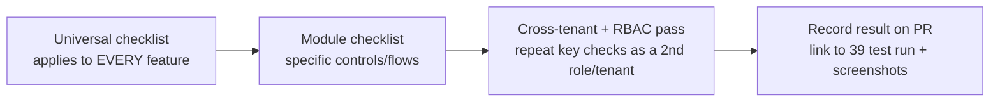

# 40 — QA Checklist (قائمة فحص الجودة)

The per-feature checklist every HalaOps module must pass before it is called "done": every page, button, tab, form, filter, search, permission, API, validation, responsive behaviour, export/import, and empty/error/loading state — made specific to HalaOps modules.

## Related Documents

- [39 — Testing Strategy](39-Testing-Strategy.md)
- [44 — Production Checklist](44-Production-Checklist.md)
- [42 — Code Review Checklist](42-Code-Review-Checklist.md)
- [41 — Coding Standards](41-Coding-Standards.md)
- [07 — RBAC](07-RBAC.md)
- [08 — Multi-Tenant](08-Multi-Tenant.md)
- [11 — Permissions Matrix](11-Permissions-Matrix.md)
- [34 — Security](34-Security.md)

---

## Purpose (الهدف)

This document is the **acceptance gate** for any HalaOps feature. Automated tests (see [39 — Testing Strategy](39-Testing-Strategy.md)) prove the logic; this checklist proves the **experience** — that every page renders, every control works, every state (empty/loading/error) is handled, every permission is enforced in the UI, and the feature behaves under RTL/LTR and on mobile. A feature is not "done" until a tester (or the implementing engineer) has ticked the relevant boxes and recorded the result on the PR.

It provides a **universal checklist** that applies to every feature, followed by **module-specific checklists** for the concrete HalaOps surfaces (auth, installer, dashboard, company, members, roles, billing, AI credentials, jobs, applications, interviews, evaluations, candidate portal, notifications, super-admin).

## Why It Exists (سبب وجوده)

§2 of the canonical context forbids placeholders, dead buttons, dead routes, empty controllers, and "coming soon". §14 mandates a "QA checklist per feature (all pages, buttons, forms, filters, search, permissions, validation, responsive, empty/error/loading states, export/import)". This document operationalises both. The platform is **bilingual (Arabic/English), RTL/LTR native** and **multi-tenant**, so two failure modes are easy to miss without a checklist: (1) a control that works in LTR/English but breaks in RTL/Arabic, and (2) a screen that is correct for the data owner but leaks or mis-gates for another role/tenant. The checklist forces both to be verified every time.

## Architecture

The checklist is layered so testing is systematic rather than ad hoc:

- **Universal** — run for every feature, no exceptions.
- **Module-specific** — the concrete pages/buttons/forms for that surface.
- **Cross-cutting pass** — repeat the security-sensitive checks as a *second* role and a *second* tenant.
- **Record** — paste the ticked list (or a link) on the PR alongside the test run from [39 — Testing Strategy](39-Testing-Strategy.md).

## Workflow

1. Implement the feature to the standards in [41 — Coding Standards](41-Coding-Standards.md).
2. Run the automated suite (`php tests/run.php`) — must be green.
3. Walk the **Universal checklist** below against the feature.
4. Walk the matching **module checklist**.
5. Re-test the permission/tenant-sensitive items as a **second role** (e.g. Recruiter) and from a **second company** (tenant isolation).
6. Attach evidence (ticked list + screenshots of empty/error/loading states, EN and AR) to the PR.
7. Reviewer confirms via [42 — Code Review Checklist](42-Code-Review-Checklist.md).

## Business Rules

1. **No box is "N/A" without a one-line reason** written next to it.
2. **Every interactive control must do something real** — no dead buttons/links (§2).
3. **Permission-sensitive and tenant-sensitive items are tested twice** — as an authorised and an unauthorised actor; as the owning tenant and a foreign tenant.
4. **Both languages, both directions** — every visual check is done once in English (LTR) and once in Arabic (RTL).
5. **Empty, loading, and error states are first-class** — each must be intentionally designed and verified, not just the happy path.
6. **A failed checklist blocks merge**, same as a failing test.

---

## Universal checklist (run for EVERY feature)

### Pages & navigation
- [ ] Every page in the feature loads without PHP notices/warnings (with `APP_DEBUG=false`).
- [ ] The page appears in navigation/breadcrumbs only when the user has the required permission.
- [ ] Page `<title>`, headings, and breadcrumbs are correct and translated (EN + AR).
- [ ] Deep-linking directly to the URL works (and respects auth/tenant/permission gating).
- [ ] Back/forward browser navigation does not produce stale or broken state.
- [ ] 404 is returned for a missing record; 403 for a forbidden one; 419 for an expired CSRF token.

### Buttons, links & tabs
- [ ] Every button/link performs a real action (no dead controls).
- [ ] Primary vs secondary vs destructive actions are visually distinct; destructive actions confirm first.
- [ ] Disabled controls are disabled for a real reason (e.g. no permission) and explained on hover/aria.
- [ ] Every tab loads its content; the active tab is highlighted; tab state survives validation errors.
- [ ] Icons/labels are correct in RTL (mirrored where appropriate; chevrons/arrows flip).

### Forms
- [ ] Every form has `csrf_field()`; submitting without a token yields 419, not a crash.
- [ ] Required fields are marked; labels are associated (`for`/`id`) and translated.
- [ ] Client-side hints match server-side `App\Core\Validator` rules (no rule mismatch).
- [ ] On validation error, the form re-renders with `old()` values and field-level messages (escaped with `e()`).
- [ ] Success shows a flashed confirmation and redirects (PRG — no double-submit on refresh).
- [ ] Numeric/enum fields reject out-of-range/invalid values server-side, not just in the UI.
- [ ] File inputs (where present) enforce mime/size and show a clear error on rejection.

### Filters & search
- [ ] Each filter narrows results correctly and is reflected in the URL (shareable/bookmarkable).
- [ ] Combining filters works (AND semantics) and "clear filters" resets to default.
- [ ] Search returns relevant results, is **tenant-scoped**, and handles no-match gracefully.
- [ ] Search/filter inputs are debounced or submit-driven (no runaway requests).
- [ ] Special characters in search input are handled (no SQL error, no XSS in the echoed term).

### Permissions (RBAC)
- [ ] The exact catalogue permission gates the page/action (e.g. `members.invite`, `jobs.publish`).
- [ ] A user **without** the permission cannot see the control AND cannot reach the route (403).
- [ ] A user **with** the permission can complete the action end to end.
- [ ] Super-admin can access platform-level surfaces; a tenant role cannot.
- [ ] Policy-gated ("own record") actions allow the owner and deny others.

### Tenant isolation
- [ ] All data shown belongs to the active company only.
- [ ] Switching the active company swaps the data set entirely (no bleed-through).
- [ ] Directly requesting another tenant's record id returns 404/403, never that record.
- [ ] Creating a record stamps the active `company_id`; it is invisible to other tenants.

### API (where the feature exposes one)
- [ ] Endpoint requires a valid API token and enforces the same RBAC + tenant scope.
- [ ] Success returns the documented JSON shape and status code.
- [ ] Errors return the JSON envelope (`{ "message": ... }`) with the right status (401/403/404/409/422/429).
- [ ] Rate limiting returns 429 with `Retry-After`.
- [ ] No internal fields leak (e.g. `password`, raw `ai_credentials`).

### Validation
- [ ] Empty submit → required-field errors, no fatal.
- [ ] Boundary values (min/max length, min/max numeric) behave per the rules.
- [ ] Uniqueness errors are friendly (e.g. duplicate email) and use the ignore-id form on edit.
- [ ] Server rejects values the client would block (defence in depth).

### Responsive & accessibility
- [ ] Layout is correct at mobile (~375px), tablet (~768px), and desktop (~1280px).
- [ ] No horizontal scroll; tables become scrollable/stacked on small screens.
- [ ] Fully usable in **RTL (Arabic)** and **LTR (English)** — alignment, padding, icons mirror correctly.
- [ ] Keyboard navigation reaches every control; focus states are visible.
- [ ] Color contrast is sufficient; controls have accessible names/aria where needed.

### Empty / loading / error states
- [ ] **Empty**: a friendly empty state with a clear next action (e.g. "No jobs yet — create one").
- [ ] **Loading**: spinners/skeletons for async actions; the UI is not frozen.
- [ ] **Error**: failed actions show a recoverable message (not a stack trace); the user can retry.
- [ ] Network/timeout failure on an AJAX action is handled and surfaced.

### Export / import (where applicable)
- [ ] Export produces a correct, **tenant-scoped** file (CSV/PDF) reflecting current filters.
- [ ] Export excludes sensitive/hidden fields and respects the user's permissions.
- [ ] Import validates each row, reports per-row errors, and never partially corrupts data.
- [ ] Large export/import does not time out (queued where needed per [26 — Notification System]/queue).

---

## Module checklists (HalaOps-specific)

### Authentication ([09 — Authentication](09-Authentication.md))
- [ ] Login: valid credentials → redirect to `dashboard` (or intended URL); invalid → "These credentials do not match our records."
- [ ] Login throttling: 5 failed attempts → lockout message with a countdown; success clears the counter.
- [ ] Suspended/pending user cannot log in even with the correct password.
- [ ] Register: creates the user; optional "create company" makes the registrant the Owner; duplicate email rejected.
- [ ] Forgot password: same response for known and unknown emails (anti-enumeration); email is sent for known.
- [ ] Reset password: valid token within TTL works; expired/invalid token rejected; token is single-use.
- [ ] Logout: session invalidated, active company cleared, redirect to `login`; back button does not restore the session.
- [ ] Session regenerates on login (no fixation); cookies are `HttpOnly`/`SameSite=Lax` (secure on HTTPS).

### Installer ([32 — Setup / Installer](32-Setup-Installer.md))
- [ ] `/install` is reachable only while not yet installed; after install it is gated.
- [ ] Requirements step lists PHP 8.2+, required extensions, and writable paths with pass/fail.
- [ ] Database step validates credentials, creates the DB if missing, and surfaces connection errors clearly.
- [ ] Migrate step runs all migrations with a live console; a failure is reported and resumable.
- [ ] Seed step loads the RBAC catalogue and the default plan.
- [ ] Admin step creates (or reuses) the first super-admin; weak/invalid input rejected.
- [ ] Finalize writes `.env`, generates `APP_KEY`, places the lock file, and removes install state.
- [ ] Resuming after a mid-step failure continues from the last completed step (no restart, no double-create).

### Dashboard
- [ ] Requires `dashboard.view` and an active tenant; guest → login, no-tenant → company select.
- [ ] Widgets/metrics are tenant-scoped and load (empty state when the tenant has no data yet).
- [ ] No widget shows another company's figures after switching companies.

### Company management ([12 — Company Management](12-Company-Management.md))
- [ ] Create company: provisions company + owner membership + default roles + trial subscription atomically.
- [ ] Company select/switch: lists only the user's **active** memberships; switching updates the active tenant.
- [ ] A user with an `invited`/`suspended` membership cannot switch into that company.
- [ ] Update company (name/logo/locale/timezone) gated by `company.update`; slug stays unique.
- [ ] Owner-only actions are hidden/blocked for non-owners.

### Members & invitations ([11 — Permissions Matrix](11-Permissions-Matrix.md))
- [ ] List members gated by `members.view`; shows status (active/invited/suspended).
- [ ] Invite gated by `members.invite`; duplicate invite for an existing member is prevented.
- [ ] Update member/role gated by `members.update`; remove gated by `members.remove`.
- [ ] A member cannot remove/demote the last Owner; cannot escalate their own privileges.
- [ ] Invited member appears with the correct role after accepting.

### Roles & permissions ([07 — RBAC](07-RBAC.md))
- [ ] Roles list gated by `roles.view`; create/edit/delete gated by `roles.manage`.
- [ ] `is_system` roles (owner, super-admin) cannot be deleted or have their slug changed.
- [ ] Editing a role's permissions immediately changes effective access (per-request cache respected).
- [ ] Parent role inheritance is reflected (child shows inherited permissions).
- [ ] Only catalogue permissions are selectable (no free-text/unused permissions).

### Billing & subscriptions ([13 — Subscription System](13-Subscription-System.md), [14 — Billing System](14-Billing-System.md))
- [ ] Billing pages gated by `billing.view`; changes gated by `billing.manage`.
- [ ] Current plan, status (trialing/active/past_due/canceled/expired), and renewal date display correctly.
- [ ] Plan list is data-driven (reads `plans`), shows price/currency (SAR), and trial length.
- [ ] Invoices list is tenant-scoped; invoice numbers are unique; totals match line items.
- [ ] Payment method add/remove works through the gateway abstraction (no gateway hard-coded).
- [ ] Webhook-driven status changes (gateway_events) reflect in the UI; replayed webhooks are idempotent.

### AI credentials ([17 — AI Providers](17-AI-Providers.md))
- [ ] AI settings gated by `ai.view`/`ai.manage`; each provider is one row per `(company_id, provider)`.
- [ ] Keys are stored **encrypted** (AES-256-GCM) and never echoed back in plaintext (masked).
- [ ] "Test connection" uses the **current tenant's** credentials only — never platform keys.
- [ ] Switching the default provider takes effect for subsequent AI calls.
- [ ] Another tenant cannot see or use this tenant's credentials.

### Jobs ([24 — Job Lifecycle](24-Job-Lifecycle.md))
- [ ] List/view gated by `jobs.view`; create/update/delete/publish gated by the matching `jobs.*` keys.
- [ ] Status transitions (draft→open→paused→closed→archived) are valid; `published_at`/`closed_at` set correctly.
- [ ] Publishing an open job makes it visible in the candidate portal; closing hides it.
- [ ] Slug is unique per company; filters by status/department/location work; search is tenant-scoped.
- [ ] Empty state ("No jobs yet") and a clear "Create job" path.

### Applications & pipeline ([25 — Application Lifecycle](25-Application-Lifecycle.md))
- [ ] List/view gated by `applications.view`; move/reject/export gated by the matching keys.
- [ ] Moving an application between stages records an `application_events` row and updates `current_stage_id`.
- [ ] One application per `(company_id, job_id, user_id)` — duplicate apply is prevented.
- [ ] Rejecting sets status and (optionally) notifies the candidate.
- [ ] Export of applications respects current filters, is tenant-scoped, and excludes hidden fields.
- [ ] Pipeline board is usable on mobile and in RTL; drag/move has a non-drag fallback.

### Interviews ([23 — Interview Workflow](23-Interview-Workflow.md), [18 — AI Interview Engine](18-AI-Interview-Engine.md))
- [ ] List/view gated by `interviews.view`; schedule/conduct/cancel gated by matching keys.
- [ ] Scheduling sets `scheduled_at`, participants, and mode (video/phone/onsite/ai_async); conflicts surfaced.
- [ ] AI interview: questions generate via the **tenant's** provider; running/failed states are shown.
- [ ] Transcript/score/analysis display; AI output is clearly marked **advisory**, final decision needs `evaluations.manage`.
- [ ] Cancel/no-show transitions work and notify participants.

### Evaluations / scorecards ([25 — Application Lifecycle](25-Application-Lifecycle.md))
- [ ] View gated by `evaluations.view`; create/manage gated by the matching keys.
- [ ] Scorecard captures criteria, rating, recommendation (strong_yes…strong_no), notes.
- [ ] Multiple evaluators per application are supported and summarised.
- [ ] Final decision (hired/rejected) is restricted to `evaluations.manage` and recorded.

### Candidate portal ([19 — Candidate Journey](19-Candidate-Journey.md))
- [ ] Candidate (a normal user with `candidate.*`) sees only their own applications and interviews.
- [ ] Apply flow validates required fields, handles resume upload, prevents duplicate application.
- [ ] Candidate cannot access recruiter/admin surfaces or other candidates' data.
- [ ] Status updates are visible to the candidate; notifications arrive per preferences.

### Notifications ([26 — Notification System](26-Notification-System.md))
- [ ] In-app notifications list is tenant/user-scoped; unread count is accurate; mark-as-read works.
- [ ] Email channel respects per-user preferences; disabling a type stops those emails.
- [ ] Events (application moved, interview scheduled, decision, billing) generate the right notifications.
- [ ] Empty state ("You're all caught up") renders.

### Super-admin / platform ([22 — SuperAdmin Journey](22-SuperAdmin-Journey.md), [33 — System Diagnostics](33-System-Diagnostics.md))
- [ ] Platform surfaces require the global super-admin role; tenant roles are blocked.
- [ ] Companies/users management uses `withoutTenantScope()` correctly (intended cross-tenant view).
- [ ] Plans management is data-driven; creating a plan needs no code change.
- [ ] Diagnostics shows DB/storage/cache/queue/mail/cron health and the app version.
- [ ] Acting platform-wide with **no active tenant** works (super-admin path).

## Database Relations

QA verifies the schema (§11) is honoured at the UI level:

- **Tenant tables** (`companies`, `memberships`, `roles`, `subscriptions`, `ai_credentials`, `jobs`, `applications`, `interviews`, `evaluations`, `files`, `notifications`, `invoices`, `payments`, …) — every list/detail screen shows only the active `company_id`'s rows.
- **Uniqueness** — UI prevents/handles duplicates that the DB enforces: `users.email`, `companies.slug`, `(company_id, slug)` for roles/jobs, `(company_id, user_id)` memberships, `(company_id, provider)` AI credentials, `(company_id, job_id, user_id)` applications, `invoices.number`.
- **Status enums** — filters/badges use the exact enum values from the schema (e.g. application `applied|in_review|interviewing|offer|hired|rejected|withdrawn`).
- **Audit** — security/business actions appear in `activity_log` with actor + subject (spot-check after key actions).
- **Cascade/SET NULL** — deleting a parent (e.g. a job) behaves as specified (children cascade; optional refs nulled) without orphaning visible data.

## Permissions

QA must confirm the **exact** catalogue keys from §6 / [11 — Permissions Matrix](11-Permissions-Matrix.md) gate each surface, including: `dashboard.view`; `company.view/update`; `members.view/invite/update/remove`; `roles.view/manage`; `billing.view/manage`; `ai.view/manage`; `settings.view/manage`; `jobs.*`; `applications.*`; `interviews.*`; `evaluations.*`; `candidate.*`; `notifications.view`; `files.*`; and platform `platform.*` keys for super-admin. For each: the control is hidden without the permission, the route returns 403 without it, and the action succeeds with it.

## Validation

Each form is checked against its server-side `App\Core\Validator` rules: required fields, formats (email/url/date), lengths (min/max/between), numeric ranges, enum membership (`in:`), uniqueness (with ignore-id on edit), and `nullable` optional fields. The tester submits empty, boundary, and invalid payloads and confirms friendly, field-level, escaped error messages with preserved old input.

## Edge Cases

- [ ] Double-clicking submit does not create duplicate records (PRG + idempotency).
- [ ] Concurrent edits to the same record do not silently overwrite without warning.
- [ ] Switching company mid-flow does not apply an action to the wrong tenant.
- [ ] Very long names/inputs and multi-byte Arabic text render and store correctly (utf8mb4).
- [ ] Pagination boundaries: first/last page, single page, zero results.
- [ ] Expired session mid-action → clean re-login, not a stack trace.
- [ ] Permission revoked while a page is open → next action is correctly denied (403).
- [ ] Deleting a referenced record behaves per FK rules (blocked/cascaded/nulled) with a clear message.

## Security

QA performs targeted security checks (full set in [34 — Security](34-Security.md)):

- [ ] Try to access another tenant's record by id → blocked (404/403).
- [ ] Try a write without CSRF / with a stale token → 419.
- [ ] Try a privileged action as an under-privileged role → 403.
- [ ] Inspect responses for leaked secrets (`password`, raw AI keys) → none present.
- [ ] Inject `<script>`/SQL metacharacters into inputs and search → escaped/parameterised, no execution.
- [ ] Brute-force the login → throttled/locked.
- [ ] Password reset reveals nothing about account existence.

## Performance

- [ ] List pages paginate and load quickly even with many rows (no full-table fetch).
- [ ] No obvious N+1 on list/detail pages (check the query log/debug bar in dev).
- [ ] Search/filter responses are fast and indexed (status/FK columns).
- [ ] Heavy operations (AI calls, large exports, bulk email) are async/queued, with progress shown.
- [ ] Images/assets are appropriately sized; no layout shift on load.

## Testing

This checklist complements automated tests:

- Automated suites in [39 — Testing Strategy](39-Testing-Strategy.md) cover logic (unit/feature/security); this checklist covers the human-visible experience and states.
- Each module checklist maps to a feature/security test: e.g. "another tenant's record returns 404" pairs with `tests/Security/TenantIsolationTest.php`; "403 without permission" pairs with `tests/Feature/RbacGatingTest.php`.
- Evidence (ticked list + EN/AR screenshots of empty/loading/error states) is attached to the PR; the reviewer cross-checks with [42 — Code Review Checklist](42-Code-Review-Checklist.md).

## Future Expansion

- **Automated UI smoke tests.** As the UI matures, encode the most-repeated checklist items (login, create company, create job, apply, move stage) as a dev-only Playwright suite so the manual pass shrinks to genuinely visual/exploratory checks.
- **Per-module checklist generation.** When new modules ship, copy the module-checklist template and tailor it; keep this file as the index.
- **Accessibility audit pass.** Add an automated axe-core scan in CI (dev-only) to back the manual a11y checks.
- **Visual regression** snapshots for RTL/LTR to catch direction-specific layout breakage automatically.
- **Localized QA.** A native Arabic reviewer pass for copy quality, not just layout, as the product expands across the Saudi/GCC market.

## Open Questions

None at this time. The universal and module checklists derive directly from §2/§14 of the canonical context and the built/planned modules in §10–§12; module checklists for not-yet-built surfaces (jobs, applications, interviews, evaluations, billing, candidate portal) are provided in advance so they are ready the moment each module ships.
