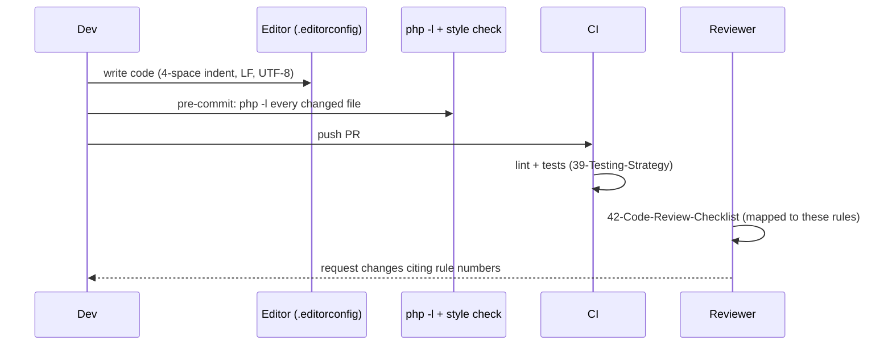

# 41 — Coding Standards (معايير كتابة الكود)

The mandatory coding standards for HalaOps: PSR-12, `declare(strict_types=1)`, fully typed signatures, `final` classes by default, no duplicated logic, constructor injection, prepared statements only, and escaped output — with good/bad examples drawn from the real codebase.

## Related Documents

- [42 — Code Review Checklist](42-Code-Review-Checklist.md)
- [31 — Backend Architecture](31-Backend-Architecture.md)
- [04 — Folder Structure](04-Folder-Structure.md)
- [39 — Testing Strategy](39-Testing-Strategy.md)
- [34 — Security](34-Security.md)
- [08 — Multi-Tenant](08-Multi-Tenant.md)
- [07 — RBAC](07-RBAC.md)

---

## Purpose (الهدف)

This document is the **single, enforceable style and engineering guide** for all HalaOps PHP code. It turns §14 of the canonical context into concrete, copy-pasteable rules with **good vs bad** examples taken from classes that already exist on disk (`App\Core\QueryBuilder`, `App\Core\Model`, `App\Services\Rbac\AccessControl`, controllers, middleware). A reviewer should be able to point at any rule here when requesting a change, and a new engineer should be able to read this once and write code that matches the existing core.

It covers: PSR-12 formatting, strict typing, type declarations, immutability/`final`, DRY via services, dependency injection, database safety (prepared statements only), output escaping, naming, file/class organisation, comments, error handling, and security defaults.

## Why It Exists (سبب وجوده)

HalaOps is a **framework-free, security-critical, multi-tenant** platform maintained by a team and sold to thousands of tenants. Without a framework's conventions to lean on, consistency must come from an explicit standard. Three concrete risks make this non-negotiable:

1. **Security is in the details.** A single missing `e()` is stored XSS; a single string-interpolated query is SQL injection; a single tenant-unscoped query is a data-leak. A standard that *mandates* the safe pattern and *forbids* the unsafe one removes the chance to get it wrong.
2. **No framework guard-rails.** Laravel forces you toward Eloquent + Blade escaping. We chose not to use a framework (§2), so the equivalent guard-rails are *cultural* and *codified here*: always go through `QueryBuilder`/`Model`, always escape with `e()`, always inject via the container.
3. **Maintainability at scale.** Uniform formatting, typed signatures, small methods, and DRY services keep a growing codebase readable and safe to refactor. The existing core is already written this way; this document ensures new code matches it.

## Architecture

The standards apply across the layered architecture defined in [03 — System Architecture](03-System-Architecture.md):

```
Controllers (thin, HTTP only) ── validate input, call a service, return a Response
        │
Services (business logic)    ── orchestration, transactions, one source of truth per rule
        │
Models (active record)       ── tenant-scoped data access, casts, fillable
        │
Core (infrastructure)        ── Database, QueryBuilder, Validator, Encrypter, Hash, View
```

Each layer has standard-level responsibilities:

- **Controllers** are *thin*: validate, delegate, respond. No SQL, no business rules, no formatting of domain logic.
- **Services** hold business logic and are the place duplicated logic is extracted to (DRY). They are injected, `final`, and use transactions for multi-step writes.
- **Models** are the *only* place tenant scoping is expressed; they never contain HTTP concerns.
- **Core** is the shared infrastructure; application code must go *through* it (e.g. never `new PDO`, never raw `mysqli`).

## Workflow

How the standards are applied and enforced, day to day:



1. **Write** following the rules below; an `.editorconfig` enforces indentation, line endings (LF), and final newline.
2. **Lint locally** — `php -l` on every changed file; the same runs in CI (see [39 — Testing Strategy](39-Testing-Strategy.md)).
3. **Review** against [42 — Code Review Checklist](42-Code-Review-Checklist.md), whose items map one-to-one to the rules here.
4. **Merge** only when green and approved.

## Business Rules

The following rules are **mandatory**. Each is actionable and review-checkable.

### 1. File header & strict types

Every PHP file begins with `<?php`, then `declare(strict_types=1);`, then the namespace. No closing `?>` in pure-PHP files.

```php
// GOOD — every class file on disk starts like this
<?php

declare(strict_types=1);

namespace App\Services\Billing;
```

```php
// BAD — missing strict_types means scalar coercion silently corrupts data/security checks
<?php
namespace App\Services\Billing;
```

### 2. PSR-12 formatting

- **4 spaces** indentation, never tabs. LF line endings, UTF-8, trailing newline.
- Opening brace on a **new line** for classes and methods; **same line** for control structures.
- One blank line after the namespace, after the `use` block, and between methods.
- Visibility on every property and method. Soft line-length target ~120 chars.
- One class per file; filename matches the class name (PSR-4 via `bootstrap/autoload.php`).

```php
// GOOD
final class InvoiceService
{
    public function markPaid(int $invoiceId): bool
    {
        if ($invoiceId <= 0) {
            return false;
        }

        return $this->repository->update($invoiceId, ['status' => 'paid']);
    }
}
```

```php
// BAD — tabs/braces wrong, no visibility, K&R class brace
class InvoiceService {
	function markPaid($invoiceId){
	return $this->repository->update($invoiceId,['status'=>'paid']); }
}
```

### 3. Typed signatures everywhere

Every parameter, return type, and (where possible) property is typed. Use union/nullable types and `mixed` only where genuinely needed. Use constructor property promotion.

```php
// GOOD — promoted, typed, readonly (mirrors App\Core\QueryBuilder)
final class QueryBuilder
{
    public function __construct(
        private readonly Database $db,
        private readonly string $table,
    ) {
    }

    public function find(int|string $id, string $column = 'id'): ?array
    {
        return $this->where($column, '=', $id)->first();
    }
}
```

```php
// BAD — untyped params and return, mutable state
function find($id, $column = 'id')
{
    return $this->where($column, '=', $id)->first();
}
```

### 4. `final` classes by default, `readonly` where possible

Classes are `final` unless a subclass is a deliberate extension point (e.g. the abstract `App\Core\Model`, the `MiddlewareInterface` implementations). Mark constructor-injected dependencies `readonly`.

```php
// GOOD — concrete service is final; only Model is abstract by design
final class AccessControl { /* ... */ }
abstract class Model { /* base for User, Workspace, ... */ }
```

```php
// BAD — non-final concrete class invites accidental inheritance and breaks invariants
class AccessControl { /* ... */ }
```

### 5. No duplicated logic — extract to a service

If the same rule appears twice, it is extracted into a service so there is exactly one source of truth. Workspace provisioning lives **only** in `App\Services\Tenancy\WorkspaceService`; RBAC provisioning **only** in `App\Services\Rbac\RbacManager`.

```php
// GOOD — registration, in-app "new workspace", and super-admin provisioning all call ONE place
$workspace = (new WorkspaceService())->create($owner, $name);
```

```php
// BAD — re-implementing workspace creation in a controller; rules drift out of sync
$workspaceId = $db->table('workspaces')->insertGetId([...]);
$db->table('memberships')->insertGetId([...]);   // forgot the trial subscription + owner role
```

### 6. Constructor injection via the container — no global state

Dependencies are injected (promoted constructor params) or resolved through the container helpers (`app()`, `auth()`, `tenant()`, `access()`). Never reach for PHP superglobals or static mutable state in business code.

```php
// GOOD
final class AccessControl
{
    public function __construct(
        private readonly AuthManager $auth,
        private readonly TenantManager $tenant,
    ) {
    }
}
```

```php
// BAD — superglobals + hidden coupling
function userCan($perm)
{
    $uid = $_SESSION['auth_user_id'];        // never touch $_SESSION directly
    // ...
}
```

### 7. Prepared statements only — never interpolate SQL

All data access goes through `QueryBuilder`/`Model`/`Database`, which bind every value and backtick-quote identifiers. **Never** build SQL with string concatenation of user input. If raw SQL is unavoidable, use `whereRaw($sql, $bindings)` with bindings passed separately.

```php
// GOOD — value is bound, identifier is quoted
$user = User::query()->where('email', '=', $email)->first();

// GOOD — raw fragment with separate bindings
$builder->whereRaw('MATCH(title, description) AGAINST (? IN BOOLEAN MODE)', [$term]);
```

```php
// BAD — SQL injection
$rows = $db->select("SELECT * FROM users WHERE email = '" . $email . "'");

// BAD — interpolating into whereRaw defeats the point
$builder->whereRaw("status = '{$status}'");
```

### 8. Tenant scoping is mandatory on tenant data

Tenant-scoped models must declare `protected static bool $tenantScoped = true;`. Normal reads use `Model::query()` (auto-scoped, fails closed). The **only** way to cross tenants is the explicit `withoutTenantScope()`, reserved for super-admin/system/installer code and always commented with why.

```php
// GOOD — scoped read; throws if no active tenant (fail closed)
$openJobs = Job::query()->where('status', '=', 'open')->get();

// GOOD — explicit, justified cross-tenant access (platform reporting)
$total = Subscription::withoutTenantScope()->count(); // platform metrics, no active tenant
```

```php
// BAD — bypassing the scope with no reason; potential cross-tenant leak
$jobs = Job::withoutTenantScope()->get();
```

### 9. Never branch on a user "type"

Capabilities come only from permissions/roles (§2, §6). Never `if ($user->type === 'admin')`. Use `can()` / `access()->allows()` / `RequirePermission` middleware.

```php
// GOOD
if (can('billing.manage')) {
    // show billing controls
}
```

```php
// BAD — there is no "type" column; this is forbidden by the canonical context
if ($user->type === 'admin') { /* ... */ }
```

### 10. Escape all output with `e()`

Every dynamic value rendered into HTML is escaped with `e()` (`htmlspecialchars` + `ENT_QUOTES`). Use `csrf_field()` for forms. Build HTML in templates, not in PHP strings.

```php
// GOOD — in resources/views
<h1><?= e($workspace->name) ?></h1>
<form method="post" action="<?= e(url('workspaces')) ?>">
    <?= csrf_field() ?>
</form>
```

```php
// BAD — stored XSS
<h1><?= $workspace->name ?></h1>
echo "<div>{$user->name}</div>";   // unescaped
```

### 11. CSRF on every write

Every state-changing form/route includes `csrf_field()` and passes through the `csrf` middleware (`App\Core\Middleware\VerifyCsrfToken`, which returns 419 on failure). Never disable CSRF for a write.

### 12. Naming conventions

- **Classes**: `StudlyCase`, noun phrases (`WorkspaceService`, `RequirePermission`).
- **Methods/functions/variables**: `camelCase`, verb phrases for methods (`provisionWorkspaceRoles`, `effectivePermissions`).
- **Constants**: `UPPER_SNAKE_CASE` (`self::STEPS`, `self::OPERATORS`).
- **DB columns / config keys / permission keys**: `snake_case` / dotted (`workspace_id`, `auth.max_login_attempts`, `jobs.publish`).
- **Interfaces**: `*Interface` (`MiddlewareInterface`, `AiProviderInterface`, `PaymentGatewayInterface`).
- **Booleans**: read as a question (`isActive()`, `hasTenant()`, `shouldScope()`).
- Names say what something is/does; no abbreviations like `$usr`, `$mgr`, `$tmp1`.

### 13. Small, focused methods; early returns

Methods do one thing. Guard clauses over deep nesting. A method longer than ~40 lines or with >2 nesting levels is a refactor candidate.

```php
// GOOD — early return, single responsibility (mirrors RequirePermission)
public function handle(Request $request, Closure $next): Response
{
    if (! auth()->check()) {
        return Response::redirect(url('login'));
    }

    foreach ($this->permissions as $permission) {
        if (access()->allows($permission)) {
            return $next($request);
        }
    }

    throw new HttpException(403, 'You do not have permission to perform this action.');
}
```

```php
// BAD — arrow-shaped nesting
public function handle($request, $next)
{
    if (auth()->check()) {
        if ($this->permissions) {
            foreach ($this->permissions as $p) {
                if (access()->allows($p)) {
                    return $next($request);
                }
            }
        }
    }
    // ... unclear fallthrough
}
```

### 14. Comments explain *why*, not *what*

Code says what; comments say why. Document non-obvious decisions, security invariants, and trade-offs. Use docblocks for array shapes and parameter contracts. No commented-out code, no `// TODO` in shipped code (§2 forbids placeholders).

```php
// GOOD — explains the security rationale (from App\Core\Model)
// Fail closed AND loud: never silently run an unscoped query on a tenant
// table. Cross-tenant access must be explicit.
throw new \RuntimeException(/* ... */);
```

```php
// BAD — restates the obvious; adds noise
$i++; // increment i
// TODO: handle errors later
```

### 15. Error handling

- Throw typed exceptions: `HttpException` for HTTP outcomes (`abort(403)`), `ValidationException` for input failures, `RuntimeException`/`InvalidArgumentException` for programmer/state errors.
- Controllers do not catch broadly; the kernel (`App\Core\Application`) renders exceptions to error views / JSON centrally.
- Never swallow exceptions silently. Never leak internal details in production (`APP_DEBUG=false`).
- Wrap multi-step writes in `Database::transaction()` so a failure rolls back atomically.

```php
// GOOD — atomic provisioning, exceptions bubble to the kernel
return $this->db->transaction(function (Database $db) use ($owner, $name): Workspace {
    // workspace + membership + roles + trial — all or nothing
});
```

```php
// BAD — swallows the failure, leaves a half-created tenant
try {
    $db->table('workspaces')->insert([...]);
    $db->table('memberships')->insert([...]);
} catch (Throwable $e) {
    // ignore
}
```

### 16. Security defaults

- Hash passwords with `App\Core\Hash` (Argon2id, bcrypt fallback, `needsRehash` on login). Never `md5`/`sha1`/plaintext.
- Encrypt secrets (AI keys) with `App\Core\Encrypter` (AES-256-GCM). Never store provider keys in plaintext.
- No secrets in code or VCS — config comes from `.env`/`config/*` (`env()`, `config()`).
- Validate every external input with `App\Core\Validator` before use.
- Rate-limit sensitive endpoints (`throttle:` middleware).
- Least privilege: gate every action with the narrowest permission that fits.

## Database Relations

Coding standards interact with the schema (§11) through these rules:

- Every tenant-bound table has `workspace_id` (FK→`workspaces`, indexed); models for them set `$tenantScoped = true` and `$tenantColumn = 'workspace_id'` (the default).
- `$fillable` on each model lists mass-assignable columns; `workspace_id`, `created_at`, `updated_at` are always allowed by the base `Model::filterFillable()`, so never add user-controlled `workspace_id` to `$fillable`.
- `$hidden` excludes secrets from array/JSON output (e.g. `User::$hidden = ['password', 'remember_token']`).
- `$casts` declares types (`int`, `bool`, `array`/`json`, `float`) so JSON columns (`features`, `limits`, `settings`, `properties`) are decoded consistently.
- Uniqueness that is per-tenant uses composite keys in migrations (`UQ(workspace_id, slug)`); code relies on this rather than re-checking in PHP where possible (with `unique:` validation for friendly messages).
- Timestamps are written via the model (`now()` helper, `Y-m-d H:i:s`); do not hand-format dates inconsistently.

## Permissions

Authorization code must follow §6 and [07 — RBAC](07-RBAC.md):

- Gate routes with `permission:key1,key2` middleware (any-of) and in-view/controller logic with `can('key')` / `access()->allows('key', $context)`.
- Use the **exact permission keys** from the catalogue (`dashboard.view`, `workspace.update`, `members.invite`, `roles.manage`, `billing.manage`, `ai.manage`, `settings.manage`, and the domain keys `jobs.*`, `applications.*`, `interviews.*`, `evaluations.*`, etc.). Never invent an unused permission (dead permissions are forbidden).
- Context-aware ("own record") checks go through a policy gate registered with `AccessControl::define()`, not ad-hoc `if` logic.
- Super-admin bypass is handled centrally in `AccessControl::allows()`; never special-case super-admin in feature code.

## Validation

Input handling standards:

- All controller input is validated via `Controller::validate()` → `App\Core\Validator` with rule strings; never trust `$request->input()` directly for writes.
- Prefer specific rules: `required|email|unique:users,email`, `required|min:8|confirmed`, `nullable|in:draft,open,paused`.
- On update, exclude self from uniqueness with the ignore-id form: `unique:users,email,{$user->id}`.
- Validation failures throw `ValidationException`; the kernel flashes errors + old input back to the form. Re-render with `old('field')` and `e()`.
- Validate enum-like fields with `in:` against the *same* allowed set used in the DB enum/migration to avoid drift.

```php
// GOOD — controller validate, then delegate
$data = $this->validate($request, [
    'name'  => 'required|max:120',
    'email' => 'required|email|unique:users,email',
]);
```

## Edge Cases

- **Empty `whereIn`/`whereNotIn`** — handled by `QueryBuilder` (`1=0` / `1=1`); do not pre-guard with ad-hoc `if ($ids)` that changes semantics.
- **Nullable inputs** — use the `nullable` rule rather than coercing `''` to `null` manually before validation.
- **Booleans to MySQL** — pass real PHP booleans; `Database::normalizeBindings()` converts to `0/1`. Do not pass the strings `'true'`/`'false'`.
- **Mass assignment** — only `$fillable` columns are persisted; a request trying to set a non-fillable column is silently dropped by `filterFillable()`, which is the intended safe behaviour.
- **Timezones/dates** — store UTC-ish server time via `now()`; format for display in the view layer per the user's locale/timezone, not in the model.
- **Large text/JSON columns** — cast with `$casts` and never `json_decode` ad hoc in controllers.

## Security

The standards directly implement [34 — Security](34-Security.md):

| Threat | Standard that mitigates it |
| --- | --- |
| SQL injection | Rule 7 — prepared statements only, via QueryBuilder/`whereRaw` bindings |
| Stored/reflected XSS | Rule 10 — escape all output with `e()` |
| CSRF | Rule 11 — `csrf_field()` + `csrf` middleware (419 on failure) |
| Cross-tenant data leak | Rule 8 — `$tenantScoped` + fail-closed `query()`; explicit `withoutTenantScope()` |
| Broken access control | Rule 9 — permissions/roles only, never user-type branches |
| Secret exposure | Rule 16 — Argon2id hashing, AES-256-GCM for AI keys, secrets from `.env` |
| Mass-assignment | DB Relations — `$fillable` allow-list; no user-controlled `workspace_id` |
| Account enumeration | Rule 16 — timing-equalised auth, hashed reset tokens (see auth code) |
| Brute force | Rule 16 — `throttle:` + login lockout |

Security is reviewed explicitly in [42 — Code Review Checklist](42-Code-Review-Checklist.md); every item there maps back to a rule in this document.

## Performance

Performance-relevant standards (full treatment in [35 — Performance](35-Performance.md)):

- **No N+1.** Use joins/`whereIn`/eager batching instead of per-row queries inside loops. A list view loads its related rows in one or two queries.
- **Index awareness.** Filter/sort on indexed columns (every FK + status/filter columns are indexed per §11). Don't add `ORDER BY` on an unindexed column on a hot path.
- **Pagination.** List endpoints use `QueryBuilder::paginate()`; never `->get()` an unbounded table.
- **Select only what you need** on hot paths (`select('id', 'name')`) rather than `*` when the row is wide.
- **Cache expensive, stable lookups** (e.g. effective permissions are cached per-request in `AccessControl`). Don't cache tenant-bound data without the tenant in the key.
- **Avoid work in templates** — compute in the controller/service, render in the view.

## Testing

Per §14 and [39 — Testing Strategy](39-Testing-Strategy.md), code is not "done" without tests, and the standards make code testable:

- `final` + constructor injection means dependencies can be swapped for fakes in tests.
- Pure, typed methods are unit-testable without HTTP.
- Every change to Core/RBAC/Tenancy/Encrypter/Hash/middleware ships with tests.
- New tenant-scoped model → tenant-isolation test (reads filtered + `query()` throws with no tenant).
- New permission-gated route → RBAC gating test (403 without, 200 with).
- Tests follow the same standards (strict types, typed signatures, descriptive names like `testScopedQueryThrowsWhenNoActiveTenant`).

## Future Expansion

- **Automated style enforcement.** Add `php-cs-fixer` and `phpstan`/`psalm` as **dev-only** (`require-dev`, stripped from the shipped artifact like the test runner) to mechanically enforce PSR-12 and detect type errors, so reviews focus on logic not formatting.
- **Architectural fitness functions.** A dev-only test that greps for forbidden patterns (`$_SESSION`, `$_GET[` in business code, `->type ===`, string-concatenated SQL, unescaped `echo $`) and fails CI — codifying the "never" rules mechanically.
- **`declare(strict_types=1)` guard.** A CI check asserting every PHP file declares strict types.
- **Editor config & templates.** Ship `.editorconfig` and file templates so new files start compliant.
- **Domain layering.** As modules grow (jobs, applications, interviews, billing), the same layering and DRY rules apply; shared logic moves into dedicated services rather than fattening controllers.

## Open Questions

None at this time. The standards above are derived directly from §14 of the canonical context and the existing codebase; the only optional element (PHPUnit/phpstan/php-cs-fixer) is explicitly scoped as dev-only in [39 — Testing Strategy](39-Testing-Strategy.md) and the Future Expansion section, and does not affect the zero-runtime-dependency guarantee.
