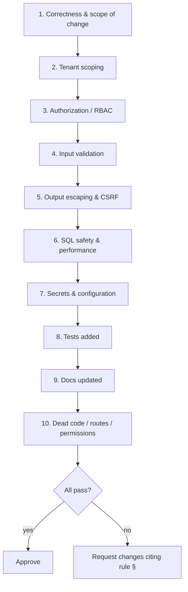

# 42 — Code Review Checklist (قائمة فحص مراجعة الكود)

The reviewer's gate for every HalaOps pull request: correctness, tenant scoping, authorization, input validation, output escaping, query performance, secret hygiene, tests, documentation, and dead-code removal — grouped into actionable checkboxes mapped to the coding standards.

## Related Documents

- [41 — Coding Standards](41-Coding-Standards.md)
- [39 — Testing Strategy](39-Testing-Strategy.md)
- [40 — QA Checklist](40-QA-Checklist.md)
- [31 — Backend Architecture](31-Backend-Architecture.md)
- [34 — Security](34-Security.md)
- [08 — Multi-Tenant](08-Multi-Tenant.md)
- [07 — RBAC](07-RBAC.md)
- [35 — Performance](35-Performance.md)

---

## Purpose (الهدف)

This document is the **mandatory checklist a reviewer works through before approving any pull request** in HalaOps. Where [41 — Coding Standards](41-Coding-Standards.md) defines the rules and [39 — Testing Strategy](39-Testing-Strategy.md) defines the tests, this document is the **enforcement instrument**: every item is a concrete, actionable check mapped back to a numbered rule in the standards, so an approval is a verifiable claim that the change is correct, secure, tenant-safe, tested, and documented.

It exists to make reviews **consistent and complete** regardless of which engineer reviews, and to ensure the four things HalaOps cannot get wrong — **tenant isolation, authorization, SQL safety, output escaping** — are checked on *every* PR, not just security-flagged ones.

## Why It Exists (سبب وجوده)

A framework-free, multi-tenant SaaS selling to thousands of tenants has no safety net but its own discipline. Code review is the last human gate before a change reaches a tenant's data. Three reasons make this checklist non-negotiable:

1. **The expensive bugs are invisible at a glance.** A missing `workspace_id` scope, a `withoutTenantScope()` used carelessly, or an unescaped echo looks fine in a diff. A structured checklist forces the reviewer to *look for* them rather than hope to notice them.
2. **Consistency across reviewers.** Without a checklist, review quality depends on who reviewed. With it, every PR clears the same bar.
3. **Traceability.** Each item maps to a rule (§ in [41 — Coding Standards](41-Coding-Standards.md)) and, where relevant, a required test (in [39 — Testing Strategy](39-Testing-Strategy.md)), so a reviewer can request a precise, justified change instead of a vague "please fix".

## Architecture

The review is organised so the highest-risk checks come first and nothing security-critical is skipped:

Each numbered group below is independent and actionable. A reviewer may approve only when **every applicable** box is ticked or explicitly waived with a written reason.

## Workflow

1. Read the PR description and confirm it states **what** changed and **why**, and links the QA evidence ([40 — QA Checklist](40-QA-Checklist.md)) and test run ([39 — Testing Strategy](39-Testing-Strategy.md)).
2. Confirm **CI is green** (lint + tests). A red PR is not reviewed for approval.
3. Work top-to-bottom through the checklist groups below.
4. For each failing item, leave an inline comment citing the rule number from [41 — Coding Standards](41-Coding-Standards.md).
5. Approve only when all applicable items pass; otherwise **request changes**.

## Business Rules

1. **No approval with a red build.** Lint and tests must pass first.
2. **Security groups (2–6) are never skipped**, even for "trivial" PRs.
3. **A waived item needs a written justification** in the review thread.
4. **Behaviour change ⇒ tests required** (group 8); docs change required if behaviour/contract changed (group 9).
5. **The author does not approve their own PR**; at least one other engineer reviews.
6. **Reviewer cites rule numbers** so feedback is objective and educational.

---

## Reviewer checklist

### 1. Correctness & scope (§13, §15)
- [ ] The change does what the PR description claims; the approach is sound.
- [ ] The diff is focused — no unrelated changes, drive-by reformatting, or scope creep.
- [ ] Logic is correct at the boundaries (off-by-one, null, empty collection, first/last page).
- [ ] Errors are handled with typed exceptions (`HttpException`, `ValidationException`, `RuntimeException`); nothing is silently swallowed.
- [ ] Multi-step writes are wrapped in `Database::transaction()` so they are atomic.
- [ ] Methods are small and single-purpose; deep nesting is refactored to guard clauses.
- [ ] Control flow is readable; no clever one-liners that obscure intent.

### 2. Tenant scoping (§8) — CRITICAL
- [ ] New tenant-bound models set `protected static bool $tenantScoped = true;`.
- [ ] Reads/writes of tenant data go through `Model::query()` (auto-scoped, fails closed) — **not** raw SQL or `withoutTenantScope()`.
- [ ] Every `withoutTenantScope()` use is **justified in a comment** and confined to super-admin/system/installer code (never reachable from a normal tenant request).
- [ ] No user-controlled `workspace_id` is ever trusted from the request; it comes from the active tenant.
- [ ] New tenant tables (migrations) carry `workspace_id` (FK→`companies`, indexed) and per-tenant uniqueness where relevant.
- [ ] Cross-tenant joins do not bypass the scope (joined tables are also tenant-filtered or intentionally global).
- [ ] A tenant-isolation test exists for the new model/table (reads filtered + `query()` throws with no tenant) — see [39 — Testing Strategy](39-Testing-Strategy.md).

### 3. Authorization / RBAC (§9, §10) — CRITICAL
- [ ] Every new route/action is gated by the correct catalogue permission via `permission:` middleware and/or `can()`/`access()->allows()`.
- [ ] Permission keys used **exist in the catalogue** (§6) — no invented or misspelled keys.
- [ ] No branching on a user "type" (`$user->type === 'admin'` is forbidden); capabilities come only from roles/permissions.
- [ ] Context-aware ("own record") checks use a registered policy gate (`AccessControl::define()`), not ad-hoc `if`.
- [ ] Super-admin handling relies on the central bypass in `AccessControl::allows()`; no per-feature super-admin special-casing.
- [ ] UI hides controls the user cannot use, **and** the server enforces it (defence in depth, not UI-only).
- [ ] An RBAC gating test exists (403 without the permission, 200 with it).

### 4. Input validation (§ Validation, §16)
- [ ] All external input for writes is validated via `Controller::validate()` / `App\Core\Validator` before use.
- [ ] Rules are specific and correct (required, types, lengths, `in:` for enums, `unique`/`exists`).
- [ ] On edit, uniqueness uses the ignore-id form (`unique:users,email,{id}`).
- [ ] `nullable` is used for genuinely optional fields rather than manual `''`→`null` coercion.
- [ ] Enum/`in:` allowed sets match the DB enum/migration (no drift).
- [ ] File uploads validate mime/size; uploaded content is not trusted.

### 5. Output escaping & CSRF (§10, §11) — CRITICAL
- [ ] Every dynamic value rendered to HTML is escaped with `e()`; no raw `echo $var` of untrusted data in templates.
- [ ] No HTML is assembled from user input in PHP strings; markup lives in templates.
- [ ] Every state-changing form includes `csrf_field()` and the route runs through the `csrf` middleware.
- [ ] JSON responses set the correct content type and do not embed unescaped HTML.
- [ ] User-supplied URLs/redirect targets are validated (no open redirect).

### 6. SQL safety & performance (§7, § Performance) — CRITICAL
- [ ] No string-concatenated SQL anywhere; all values are bound via QueryBuilder/Model or `whereRaw($sql, $bindings)` with separate bindings.
- [ ] Identifiers are not built from user input; operators stay within the allowed set.
- [ ] No N+1: related data is loaded via joins/`whereIn`/batching, not per-row queries inside loops.
- [ ] Queries filter/sort on **indexed** columns (every FK + status/filter columns per §11); new hot-path filters have a supporting index in the migration.
- [ ] List endpoints paginate (`paginate()`); no unbounded `->get()` on a growable table.
- [ ] `select()` limits columns on wide/hot reads where appropriate; no `SELECT *` where it matters.
- [ ] Expensive/stable lookups are cached appropriately (and tenant-keyed if tenant-bound).
- [ ] An N+1 guard or query-count assertion is considered for new hot paths.

### 7. Secrets & configuration (§16) — CRITICAL
- [ ] No secrets, API keys, passwords, or tokens are hard-coded or committed.
- [ ] Configuration is read from `.env`/`config/*` via `env()`/`config()`, not inline literals.
- [ ] Passwords are hashed with `App\Core\Hash` (Argon2id); secrets (AI keys) encrypted with `App\Core\Encrypter` (AES-256-GCM).
- [ ] Sensitive fields are in the model's `$hidden` and never serialized to the client.
- [ ] Debug/verbose error output is off for production (`APP_DEBUG=false`); no `var_dump`/`dd`/`error_log` of secrets left in.
- [ ] Magic numbers/strings are named constants or config keys, not scattered literals.

### 8. Tests added (§ Testing, [39 — Testing Strategy](39-Testing-Strategy.md))
- [ ] New/changed behaviour has tests at the right level (unit/feature/security).
- [ ] Changes to `Model`, `QueryBuilder`, `AccessControl`, `TenantManager`, `Encrypter`, `Hash`, or any middleware ship with tests.
- [ ] New tenant-scoped model → tenant-isolation test; new permission-gated route → RBAC gating test.
- [ ] Edge cases are tested (empty/boundary/invalid inputs, fail-closed paths).
- [ ] Tests are deterministic (no real network/email/AI, transactions rolled back) and follow the coding standards.
- [ ] The full suite passes locally and in CI.

### 9. Documentation updated (§15, §16)
- [ ] If behaviour, schema, permissions, or a public contract changed, the relevant `/docs` file is updated (e.g. schema → [05 — Database Architecture]/[06 — ERD]; permission → [11 — Permissions Matrix]).
- [ ] New permissions are reflected in the permission catalogue/matrix.
- [ ] New env/config keys are documented and added to `.env.example`.
- [ ] Public API changes are reflected in [29 — API Architecture](29-API-Architecture.md).
- [ ] The CHANGELOG is updated for user-visible changes.
- [ ] Non-obvious decisions are explained in a "why" comment in the code.

### 10. Dead code / routes / permissions (§2, §14)
- [ ] No commented-out code, no `// TODO`/placeholder/"coming soon" (forbidden by §2).
- [ ] No dead routes (every route resolves to a real controller action) and no empty controllers.
- [ ] No unused permissions added; removed features remove their permissions/routes/views/migrations cleanly.
- [ ] No unused imports, variables, methods, or files left behind.
- [ ] No dead buttons/links introduced in templates (cross-checked with [40 — QA Checklist](40-QA-Checklist.md)).
- [ ] Removed code does not leave orphaned tables/columns without a migration plan.

## Database Relations

Review confirms schema changes (migrations) match §11 conventions:

- New tables are InnoDB/utf8mb4; PK `id BIGINT UNSIGNED AUTO_INCREMENT`; timestamps present.
- Tenant tables have `workspace_id` with a real FK to `companies` and an index; child rows `ON DELETE CASCADE`, optional refs `SET NULL`, deletion-blocking refs `RESTRICT`.
- Indexes back every FK and every status/filter column the feature queries.
- Per-tenant uniqueness uses composite unique keys (e.g. `(workspace_id, slug)`, `(workspace_id, job_id, user_id)`).
- Migrations are reversible/idempotent where the migrator expects it and do not assume transactional DDL (MySQL auto-commits DDL — see §4).
- Model `$fillable`/`$hidden`/`$casts` are consistent with the columns (no secret in `$fillable`, JSON columns cast to `array`).

## Permissions

The reviewer verifies authorization against §6 / [11 — Permissions Matrix](11-Permissions-Matrix.md):

- The PR uses **exact** catalogue keys (`dashboard.view`, `members.invite`, `roles.manage`, `billing.manage`, `ai.manage`, `jobs.publish`, `applications.move`, `interviews.schedule`, `evaluations.manage`, `platform.*`, …).
- Each new action is gated at the route (middleware) **and** respected in the UI and any API surface.
- No permission is introduced that nothing enforces (no dead permissions), and removing a feature removes its permission entries.
- Effective-permission resolution (global + tenant roles, parent inheritance, super-admin bypass) is not bypassed by feature-specific logic.

## Validation

The reviewer checks that input validation is present, correct, and defence-in-depth: server-side rules exist for every write; they match the documented constraints; client hints do not replace server validation; failures return field-level, escaped messages with preserved old input; and enum/uniqueness/existence rules reference the right tables/columns. See group 4 above for the actionable items.

## Edge Cases

The reviewer probes the change for failure modes:

- [ ] Empty collections / no-result queries (no `IN ()` errors; friendly empty states).
- [ ] Null/optional fields handled (`nullable`, null-safe operators).
- [ ] Concurrency: double-submit, simultaneous edits, replayed webhooks (idempotency).
- [ ] Tenant switch mid-flow does not misattribute an action.
- [ ] Permission revoked mid-session → next action denied.
- [ ] FK deletes behave per cascade/restrict/set-null rules with clear messaging.
- [ ] Multi-byte/RTL Arabic input stored and rendered correctly (utf8mb4).

## Security

Security review is woven through groups 2–7 and aligns with [34 — Security](34-Security.md). The reviewer specifically attempts, in thought or in test, to break:

- **Tenant isolation** — can this code read/write another company's rows? (group 2)
- **Authorization** — can an under-privileged role reach this action? (group 3)
- **Injection** — is any value interpolated into SQL or HTML? (groups 5–6)
- **CSRF** — is every write protected? (group 5)
- **Secret exposure** — are keys hashed/encrypted, hidden, never logged? (group 7)
- **Enumeration/brute force** — are auth/reset endpoints throttled and timing-safe? (group 3/7)

If any of these is answerable "yes, it could be broken", the PR is blocked until fixed.

## Performance

Performance review (group 6, detailed in [35 — Performance](35-Performance.md)) confirms: no N+1, indexed filters/sorts, pagination on list endpoints, bounded selects on hot paths, appropriate caching with correct keys, and offloading of heavy work (AI calls, large exports, bulk email) to the queue. The reviewer checks the dev query log/debug output where available and asks for a query-count test on new hot paths.

## Testing

This checklist is itself verified against [39 — Testing Strategy](39-Testing-Strategy.md): group 8 requires the matching tests to exist and pass, and the reviewer confirms the suite is green before approving. The checklist and the test strategy are kept in lockstep — when a new mandatory test category is added there (e.g. contract tests for AI providers), a corresponding item is added to group 8 here.

## Future Expansion

- **Automate the mechanical items.** Items in groups 6, 7, and 10 (no string-concatenated SQL, no committed secrets, no `// TODO`, no unused imports) can be enforced by dev-only static analysis (`phpstan`/`psalm`/`php-cs-fixer`) and secret-scanning in CI, shrinking the manual checklist to judgement-based items.
- **PR template.** Ship a pull-request template embedding the group headings so authors self-check before requesting review.
- **Danger-style bot.** A CI bot can post a reminder of unchecked critical groups (2, 3, 5, 6, 7) on every PR.
- **Architectural fitness functions.** As in [41 — Coding Standards](41-Coding-Standards.md), a grep-based test that fails CI on forbidden patterns turns several review items into automated gates.
- **Severity tiers.** Introduce explicit "blocker vs nit" labelling so reviewers separate must-fix security items from optional style suggestions.

## Open Questions

None at this time. The checklist groups map directly to §14 of the canonical context and the rules in [41 — Coding Standards](41-Coding-Standards.md); the only forward-looking element (static-analysis automation) is scoped as dev-only and does not affect the zero-runtime-dependency guarantee.
