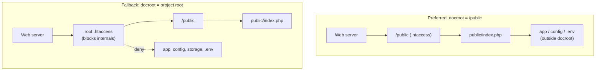
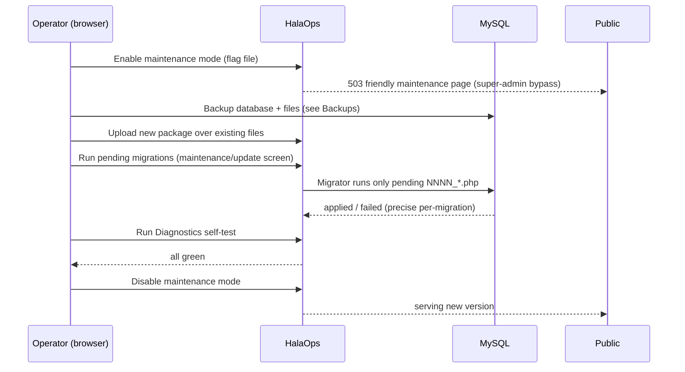

# 43 — Deployment (النشر)

How to deploy HalaOps without a CLI: docroot models, requirements, permissions, HTTPS, the protected cron URL for the queue/scheduler, zero-downtime updates and migrations via the maintenance flow, backups, and rollback.

## Related Documents

- [32-Setup-Installer](32-Setup-Installer.md)
- [44-Production-Checklist](44-Production-Checklist.md)
- [33-System-Diagnostics](33-System-Diagnostics.md)
- [34-Security](34-Security.md)
- [35-Performance](35-Performance.md)
- [36-Scalability](36-Scalability.md)
- [37-Logging](37-Logging.md)

## Purpose (الهدف)

This document defines how a HalaOps package goes from "uploaded files" to "serving production traffic" on real hosting — from a managed shared host with only cPanel up to a dedicated VPS behind a load balancer — **without the buyer ever touching a terminal**. It covers the two supported document-root models, host requirements, file permissions, HTTPS, the protected cron URL that drives the database-backed queue and scheduler (since there is no CLI worker), the maintenance-mode flow for zero-downtime updates and migrations, and the backup/rollback procedures that make updates safe.

## Why It Exists (سبب وجوده)

HalaOps is sold as an upload-and-install product, so deployment guidance must assume the lowest common denominator (shared hosting, no SSH) while still scaling up cleanly. This document exists to:

- **Make the docroot decision explicit.** The single biggest security mistake on shared hosting is serving the project root; HalaOps ships two safe options and a clear preference.
- **Replace CLI operations.** Queue processing, the scheduler, and migrations after an update all normally need a shell. HalaOps exposes them as protected URLs and a browser maintenance flow instead.
- **Prevent the common outages.** Wrong permissions on `storage/`, missing cron, no HTTPS, and unsafe updates are the usual failure modes; this doc gives concrete, ordered steps to avoid them.
- **De-risk updates.** A defined maintenance → backup → upload → migrate → verify → resume sequence (with rollback) turns "update and pray" into a repeatable operation.

## Architecture

### Deployment models

HalaOps ships two `.htaccess` files so it is safe under either model:

1. **Preferred — document root = `/public`.** Point the web server's docroot (vhost `DocumentRoot`, or cPanel domain root) at `<install>/public`. Only `public/` is web-reachable; `app/`, `bootstrap/`, `config/`, `database/`, `resources/`, `routes/`, `storage/`, and `.env` sit **outside** the served tree and cannot be requested at all. `public/.htaccess` rewrites everything that is not a real file/dir to `public/index.php` (the front controller) and denies dotfiles.

2. **Fallback — root `.htaccess` (shared hosting).** When the host will not let you change the docroot (typical cPanel "addon domain" pointed at the account root), the **root** `.htaccess` forwards all traffic into `/public` and hard-blocks internals. It denies `\.env`, `\.git`, `composer.(json|lock)`, `README.md`, and the entire `^(app|bootstrap|config|database|resources|routes|storage)(/|$)` tree with `[F,L]`, plus a global dotfile guard. This keeps secrets unreachable even when the project root is the docroot.



For Nginx (no `.htaccess`), the equivalent is `root <install>/public;` with `try_files $uri /index.php$is_args$args;` and explicit `location` denies for dotfiles; document this in the host-specific notes.

### Runtime components relevant to deployment

- **Front controller** `public/index.php` boots `App\Core\Application`, which reads `.env`, gates on the installer if not yet installed, and dispatches via the router.
- **Storage tree** `storage/{logs,cache,sessions,framework}` must be writable; it holds logs ([37-Logging]), the file session store, cache, and install/heartbeat artifacts.
- **Queue/scheduler** are DB-backed (`queued_jobs`, `failed_jobs`) and driven by a **protected cron URL** rather than a daemon.
- **Diagnostics** ([33-System-Diagnostics]) verifies all of the above post-deploy.

## Workflow

### Initial deployment (no CLI)

1. **Provision** a PHP 8.2+ host with MySQL/MariaDB and create an empty database + DB user (most panels do this in a few clicks). Note host, port, db name, username, password.
2. **Upload** the HalaOps package and unzip it into the account (File Manager, FTP, or the host's deploy tool). No `composer install` — there is no `vendor/`; the autoloader is custom (`bootstrap/autoload.php`).
3. **Set the document root** to `/public` if possible (preferred model). If not, leave it at the project root; the root `.htaccess` will protect internals (fallback model).
4. **Fix permissions** (see below) so `storage/` and the project root (for `.env`) are writable.
5. **Open the site in a browser** → you land on `/install`. Run the wizard (requirements → database → migrate → seed → admin → finalize) per [32-Setup-Installer]. Finalize writes `.env`, places the lock, and forces `APP_ENV=production` + `APP_DEBUG=false`.
6. **Enable HTTPS** and confirm `SESSION_SECURE=true` (the installer sets this automatically when the App URL is `https`).
7. **Configure the cron URL** for the queue/scheduler (below).
8. **Run Diagnostics** ([33-System-Diagnostics]) and the [44-Production-Checklist] before announcing go-live.

### File permissions

| Path | Recommended | Why |
|------|-------------|-----|
| Directories (general) | `755` (`750` if group is the web user) | Traversable, not world-writable. |
| Files (general) | `644` | Readable by the server, not writable by the world. |
| `storage/` and all subdirs (`logs, cache, sessions, framework`) | `775` (writable by the web user) | App writes logs, cache, sessions, install/heartbeat files. The installer creates these `0775` when missing. |
| Project root (write only during install) | writable enough to create `.env` | `finalize()` writes `.env`; can be tightened to `644`/read-only afterward. |
| `.env` | `600`/`640` | Contains `APP_KEY`, DB password — secrets. Never world-readable; never inside the docroot under the preferred model. |

Avoid `777` anywhere. If the host runs PHP as a separate user (suPHP/FPM pool), set group ownership to that user and use `775`/`640`.

### HTTPS

- Install a TLS certificate (host AutoSSL / Let's Encrypt). HalaOps is HTTPS-first.
- Set `APP_URL` to the `https://` origin and ensure `SESSION_SECURE=true` in `.env` so the session cookie is `Secure` (the `Session` core already sets `HttpOnly` and `SameSite=Lax`).
- Force HTTP→HTTPS at the web server (or via an `.htaccess` redirect) and enable HSTS. Security headers are emitted by the `SecurityHeaders` middleware ([34-Security]).

### Cron for the queue & scheduler (no CLI)

Because the buyer has no shell to run a worker, HalaOps drains its DB-backed queue and runs scheduled work via a **protected cron URL** hit on a schedule by the host's cron/UptimeRobot/control-panel scheduler:

```
*/1 * * * *  curl -fsS "https://your-domain.com/cron/run?token=THE_SECRET_TOKEN" >/dev/null 2>&1
```

- The endpoint processes due `queued_jobs`, retries/parks `failed_jobs`, runs scheduled maintenance, and **updates the queue/cron heartbeat** that Diagnostics reads ([33-System-Diagnostics]).
- It is protected by a **secret token** (compared in constant time) and is rate-limited / locked so overlapping ticks cannot run the same job twice. The token is stored in config/`.env`, never in client code.
- If the host offers a real cron-job-to-shell option, the same logic can be invoked, but the URL is the supported, no-CLI path.

### Zero-downtime updates & migrations (maintenance flow)



- **Maintenance mode** is a flag (a file under `storage/framework/`); when present the app returns a friendly 503 to everyone except super-admins (who can verify the new version), so users never see a half-migrated app.
- **Migrations** reuse `database/Migrator.php` — the exact runner the installer uses — so an update applies only *pending* `database/migrations/NNNN_*.php` and skips already-applied ones, with per-migration success/failure reported (gated by `platform.diagnostics`/an update permission). MySQL auto-commits DDL, so each migration is recorded immediately; a failure stops at the offending file and is shown precisely.
- **Asset/version cache busting**: assets are referenced via `asset()` and the compiled `public/assets/css/app.css`; bumping the build/version invalidates caches so clients pick up new CSS/JS.
- **Stateless app tier** ([36-Scalability]): with sessions/cache movable to DB/Redis, multiple nodes can be updated behind a load balancer one at a time for true zero-downtime; on a single host, the maintenance window is the brief migrate step.

### Backups

- **Before every update**, take a full DB dump (panel "Backup"/phpMyAdmin export, or a host backup) and a copy of `.env`, `storage/`, and any uploaded files under `storage/app`.
- **Schedule** automatic DB + file backups (daily for production), retained per policy, stored off the server.
- **Verify** at least one restore so backups are known-good (an untested backup is not a backup).

### Rollback

- **Migration-only failure:** `Migrator::rollback()` reverses the most recent batch (`down()` per migration). This is the path when a migration fails or an update misbehaves but data is intact.
- **Bad release:** re-upload the previous package version over the files and, if schema changed, restore the pre-update DB dump. Keep the prior package archived for exactly this.
- **Data corruption:** restore the most recent verified DB backup, then re-apply any safe forward fix. Maintenance mode stays on until Diagnostics is green.

## Business Rules

- **BR-DEPLOY-1 — Never serve internals.** Either docroot = `/public` (preferred) or the root `.htaccess` blocks `app/bootstrap/config/database/resources/routes/storage` and all dotfiles. There is no third option.
- **BR-DEPLOY-2 — Secrets stay out of the web tree.** `.env` is never web-readable; under the preferred model it is outside the docroot entirely.
- **BR-DEPLOY-3 — Production defaults are mandatory.** `APP_ENV=production`, `APP_DEBUG=false` in production (set by the installer; verified in [44-Production-Checklist]).
- **BR-DEPLOY-4 — Queue/scheduler need the cron URL.** Without the protected cron hitting `/cron/run`, the queue does not drain and the cron heartbeat goes stale/red in Diagnostics.
- **BR-DEPLOY-5 — Updates run behind maintenance mode.** Schema-changing updates enable maintenance mode and back up first; migrations run via the shared `Migrator`, never by editing the DB by hand.
- **BR-DEPLOY-6 — Back up before migrating.** No migration runs on production without a fresh, verified backup available for rollback.
- **BR-DEPLOY-7 — HTTPS in production.** TLS enabled and `SESSION_SECURE=true` whenever the app is served over `https`.

## Database Relations

Deployment is largely infrastructural, but these tables (from [05-Database-Architecture] §11) are directly involved:

- `migrations` — the runner records applied files here; updates compare pending vs applied. The full initial schema is migrations `0001`–`0015`.
- `queued_jobs` / `failed_jobs` (planned) — drained by the cron URL; their backlog and the heartbeat freshness feed Diagnostics.
- `settings` / `storage/framework` heartbeat — store the queue/cron last-tick timestamps and the maintenance flag.
- `activity_log` — update/migration/maintenance actions are audited here (`workspace_id` NULL for platform actions).

## Permissions

- **Initial deploy** runs the unauthenticated installer ([32-Setup-Installer]); the first account created is the global `super-admin`.
- **Update/migration screen** and **maintenance toggle** are gated by `platform.diagnostics` (or a dedicated platform update permission) from the super-admin group in [07-RBAC] §6.
- **Cron URL** is gated by a **secret token**, not RBAC, because cron schedulers cannot authenticate as a user; the token is validated in constant time and the endpoint is rate-limited.
- **Diagnostics** post-deploy verification requires `platform.diagnostics` ([33-System-Diagnostics]).

## Validation

- **`.env` values** are written/validated by the installer (`APP_KEY` non-empty base64, DB name `^[A-Za-z0-9_]+$`, URL drives `SESSION_SECURE`).
- **Cron token** must be present and match exactly; missing/mismatched → 403/404, no processing.
- **Update migrations** validate that the DB is reachable and report each migration's outcome; finalize/maintenance refuses to leave the app in a half-migrated served state.
- **Permissions/HTTPS** are validated operationally by Diagnostics checks (storage writable, sessions, disk, cron heartbeat) rather than by user input.

## Edge Cases

- **Host won't change docroot.** Use the fallback root `.htaccess`; verify `.env` and `storage/` are not retrievable over HTTP (Diagnostics + a manual request test).
- **`storage/` not writable after upload.** Sessions/logs/cache fail; fix to `775` (correct group owner under FPM) and re-run Diagnostics; the installer/auto-fix can `mkdir 0775` but cannot override a host that forbids writes.
- **No cron capability on the host.** Use an external scheduler (UptimeRobot/cron-job.org) to hit `/cron/run?token=…` every minute; otherwise the queue stalls.
- **Cron overlap / long job.** The endpoint locks so a second tick is a no-op while one is running, preventing double execution.
- **Migration fails mid-update.** Stops at the failing file (DDL already committed up to that point); fix the cause and re-run (applied migrations are skipped) or `rollback()` the batch and restore the backup.
- **Mixed-version nodes during a rolling update.** Keep changes backward-compatible for one release (additive migrations first), or take the brief maintenance window on single-host setups.
- **Stray `.env` copied into `public/`.** Both `.htaccess` dotfile guards deny it; still, remove it.
- **Clock skew vs heartbeats.** Thresholds are generous; a one-tick gap is tolerated before WARN.

## Security

- **Two-layer docroot protection.** Preferred model removes internals from the web tree; fallback `.htaccess` denies them explicitly — defense in depth either way ([34-Security]).
- **Secret hygiene.** `.env` permissions `600/640`, outside docroot, holding `APP_KEY` for AES-256-GCM and the DB password; never logged or shown by Diagnostics.
- **Protected cron.** Secret-token, constant-time compare, rate-limited, idempotent/locked — so the worker URL cannot be abused to flood or double-run jobs.
- **HTTPS + secure cookies + HSTS**, plus the `SecurityHeaders` middleware on every response.
- **Maintenance bypass is RBAC-gated.** Only super-admins see the app during maintenance; everyone else gets the 503 page, so no one hits a partially-migrated state.
- **Audited operations.** Updates, migrations, and maintenance toggles are written to `activity_log`.
- **Least-privilege DB user.** The MySQL user needs DDL for migrations; if you split duties, grant DDL only during updates.

## Performance

- **OPcache** should be enabled in production (Diagnostics warns if off) — biggest single PHP win ([35-Performance]).
- **Pre-compiled CSS** (`public/assets/css/app.css`) means zero build step and cacheable static assets with long max-age + version busting.
- **HTTP/2 + gzip/brotli + asset caching** at the web server for static files.
- **Queue offload**: AI calls and email run via the queue drained by cron, keeping request latency low ([35-Performance], [36-Scalability]).
- **DB tuning**: ensure InnoDB buffer pool sized for the dataset; every FK/status column is indexed per §11.
- **Stateless tier** lets you scale horizontally behind a load balancer; move sessions/cache to DB/Redis first ([36-Scalability]).

## Testing

- **Deployment smoke:** after upload, `/install` is reachable, internals (`/.env`, `/storage/...`, `/config/...`) return 403/404, and the front controller serves the home/login route once installed.
- **Permissions:** with `storage/` read-only, the app surfaces the failure cleanly (and Diagnostics FAILs `storage`); after fixing, self-test passes.
- **Cron:** hitting `/cron/run` with a valid token drains a seeded queued job and updates the heartbeat; an invalid/missing token is rejected; overlapping calls do not double-process.
- **Update flow:** with maintenance mode on, the public gets 503 while a super-admin sees the app; pending migrations apply and already-applied ones are skipped; `rollback()` reverses the last batch.
- **HTTPS:** over `https`, the session cookie carries `Secure`; over `http` (dev) it does not; HSTS/security headers are present.
- **Rollback:** restoring a DB dump returns the app to the prior schema/state and Diagnostics is green.

## Future Expansion

- **One-click in-app updater** that downloads the new package, enables maintenance, runs migrations, and verifies via Diagnostics — fully no-CLI.
- **Containerized/PaaS images** (Docker, managed PHP) with the docroot preset to `/public` for buyers who do have infrastructure.
- **Blue-green / canary** deploys behind a load balancer once the session/cache stores are externalized ([36-Scalability]).
- **Read replicas & tenant sharding** for large fleets, with the connection layer selecting replica for reads ([36-Scalability]).
- **External secrets/manage** (vault, host secret store) instead of a flat `.env` for advanced deployments.

## Open Questions

None at this time. The two docroot models, the protected cron URL, and the maintenance/update/rollback flow are defined and consistent with the shipped `.htaccess` files, the `Migrator`, and the installer.
