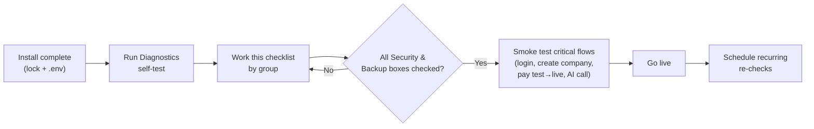

# 44 — Production Checklist (قائمة التحقق للإنتاج)

The actionable, grouped pre-go-live checklist for HalaOps: security, secrets, HTTPS, permissions, performance, backups, monitoring, mail, per-tenant AI keys, gateway live mode, error pages, logging, and rate limits — each item specific and verifiable.

## Related Documents

- [43-Deployment](43-Deployment.md)
- [40-QA-Checklist](40-QA-Checklist.md)
- [34-Security](34-Security.md)
- [35-Performance](35-Performance.md)
- [32-Setup-Installer](32-Setup-Installer.md)
- [33-System-Diagnostics](33-System-Diagnostics.md)
- [37-Logging](37-Logging.md)
- [15-Payment-Gateways](15-Payment-Gateways.md)

## Purpose (الهدف)

This is the final gate before a HalaOps instance serves real customers. It is a grouped, checkbox-driven list where **every item is concrete and verifiable** — you either did it or you didn't, and most items can be confirmed straight from [33-System-Diagnostics] or a single browser request. It complements the feature-level [40-QA-Checklist] (which proves each screen works) by proving the *deployment* is hardened, observable, and recoverable.

## Why It Exists (سبب وجوده)

HalaOps is installed by non-technical operators with no CLI, so the safety net that an experienced sysadmin would carry in their head must be written down and turned into clicks. This checklist exists to:

- **Prevent the predictable production incidents** — debug left on, an open `/install`, a missing lock file, world-readable `.env`, no backups, no cron draining the queue, test-mode payment gateways taking real money.
- **Make go-live a decision, not a guess** — when every box is checked and Diagnostics is green, the instance is ready.
- **Give support a baseline** — a ticket can be triaged against "which of these were not checked?".

## Architecture

The checklist maps one-to-one onto things HalaOps can verify:

- **Self-verifiable via Diagnostics** ([33-System-Diagnostics]): DB connectivity, storage writable, cache, sessions, queue/cron heartbeats, mail, OPcache, disk, version/environment, lock-file presence.
- **Verifiable by a request**: `/install` redirects to login (lock in place), `.env`/`storage/` not web-reachable, HTTPS + security headers, custom error pages.
- **Verifiable by configuration review**: `.env` hardening, rate limits, per-tenant AI keys, payment gateway live mode, backups schedule, monitoring hooks.

Use it top-to-bottom; do not go live with any **Security** or **Backups & Recovery** box unchecked.

## Workflow

1. Finish the installer ([32-Setup-Installer]) so the lock and `.env` exist.
2. Run Diagnostics and clear every red/amber it can auto-fix.
3. Walk each group below, checking boxes.
4. Smoke-test the critical paths end to end.
5. Go live only when Security and Backups are fully green; then schedule recurring re-checks.

## Business Rules

- **BR-PROD-1 — No go-live with debug on.** `APP_DEBUG=false` is mandatory in production.
- **BR-PROD-2 — Installer must be locked.** `storage/framework/installed` present and `/install` redirects to login.
- **BR-PROD-3 — Secrets are private and off-web.** `.env` is `600/640` and not retrievable over HTTP.
- **BR-PROD-4 — No money in test mode.** A live gateway is configured and verified before accepting real payments ([15-Payment-Gateways]).
- **BR-PROD-5 — Backups exist and restore.** At least one verified restore before go-live.
- **BR-PROD-6 — The queue drains.** The protected cron URL is scheduled and the heartbeat is green.
- **BR-PROD-7 — Platform holds no AI keys.** AI works only where a tenant has configured its own encrypted credentials ([16-AI-Architecture]).

---

## The Checklist

### 1. Security

- [ ] `APP_DEBUG=false` in `.env` (no stack traces to users) — confirm via Diagnostics environment report.
- [ ] `APP_ENV=production`.
- [ ] `APP_KEY` is set to a base64 32-byte key (generated by the installer) and is unique to this install — never the example value.
- [ ] Document root is `/public` (preferred) **or** the root `.htaccess` is active and blocking internals (fallback) — see [43-Deployment].
- [ ] `https://your-domain/.env` returns 403/404 (not the file).
- [ ] `https://your-domain/storage/logs/...`, `/config/...`, `/database/...` all return 403/404.
- [ ] CSRF protection active on all write forms (login, register, company, billing, AI, settings) — `VerifyCsrfToken` in the middleware stack.
- [ ] Security headers present on responses (CSP/`X-Frame-Options`/`X-Content-Type-Options`/Referrer-Policy) via `SecurityHeaders` middleware.
- [ ] Login throttling active (`auth.max_login_attempts=5`, 900s lockout) and password reset is anti-enumeration with hashed, 60-minute tokens ([09-Authentication]).
- [ ] Passwords hashed with Argon2id (transparent rehash on login) — no plaintext anywhere.
- [ ] AI credentials and other secrets are AES-256-GCM encrypted at rest (`ai_credentials.credentials`), never logged ([34-Security]).
- [ ] Tenant isolation verified: a user of company A cannot read/modify company B data (fail-closed scoping) ([08-Multi-Tenant]).
- [ ] Super-admin account uses a strong, unique password and (where available) is restricted to trusted operators only.

### 2. Secrets & `.env` Hardening

- [ ] `.env` file permissions are `600` or `640` (not world-readable).
- [ ] Under the preferred model, `.env` lives outside the document root entirely.
- [ ] No secrets committed to version control; `.env` is git-ignored and `.env.example` contains only blanks/defaults.
- [ ] `DB_PASSWORD` is strong and the DB user has least privilege (DDL only needed during install/updates).
- [ ] `SESSION_SECURE=true` (set automatically when the App URL is `https`).
- [ ] `APP_URL` is the exact production `https://` origin (drives links, cookies, redirects).
- [ ] No leftover dev credentials, test API keys, or debug flags in `.env`.

### 3. Installer Lock-down

- [ ] `storage/framework/installed` lock file is present.
- [ ] Visiting `/install` redirects to `/login` (installer refuses to re-run).
- [ ] POSTs to `/install/*` return HTTP 409 (installed) — the wizard cannot mutate a live instance.
- [ ] `storage/framework/install_state.json` no longer exists (deleted at finalize — credentials not left on disk).

### 4. HTTPS & Networking

- [ ] Valid TLS certificate installed and auto-renewing.
- [ ] HTTP→HTTPS redirect enforced at the web server / `.htaccess`.
- [ ] HSTS enabled.
- [ ] Mixed-content free (all assets load over HTTPS; `asset()`/compiled CSS).
- [ ] Correct host/domain configured; `www`/apex behavior decided and redirecting consistently.

### 5. File Permissions

- [ ] Directories `755` (or `750` with correct group), files `644`.
- [ ] `storage/` and `storage/{logs,cache,sessions,framework}` are writable (`775`, correct web-user group).
- [ ] No `777` permissions anywhere.
- [ ] Project root no longer needs broad write access post-install (only `.env` write was required).
- [ ] Diagnostics "storage writable" and "sessions" checks are green.

### 6. Performance

- [ ] OPcache enabled (Diagnostics "opcache" green; warns if off) ([35-Performance]).
- [ ] Compiled Tailwind CSS present at `public/assets/css/app.css` (no build step on the server).
- [ ] Static assets served with gzip/brotli + long cache headers and version busting.
- [ ] HTTP/2 enabled where available.
- [ ] InnoDB buffer pool sized appropriately for the dataset; MySQL slow-query log reviewed for N+1 / missing indexes.
- [ ] Pagination in place on all list screens (no unbounded queries) ([35-Performance]).
- [ ] Disk has comfortable free space (Diagnostics "disk" green).

### 7. Backups & Recovery

- [ ] Automated database backups scheduled (daily for production) and stored off-server.
- [ ] File/uploads (`storage/app`) and `.env` included in the backup set.
- [ ] **At least one restore has been tested** and verified to produce a working instance.
- [ ] Backup retention policy defined.
- [ ] Rollback procedure understood: `Migrator::rollback()` for migration-only issues; re-upload prior package + restore DB for a bad release ([43-Deployment]).
- [ ] Pre-update routine documented: enable maintenance mode → back up → upload → migrate → verify → resume.

### 8. Monitoring & Health

- [ ] Diagnostics overall status is green ([33-System-Diagnostics]).
- [ ] External uptime monitor pings the site (and ideally a `/healthz`/cron endpoint).
- [ ] Queue heartbeat green (cron is draining `queued_jobs`).
- [ ] Cron heartbeat green (scheduler tick is recent).
- [ ] `failed_jobs` reviewed/empty; alerting plan for new failures.
- [ ] Someone owns responding to alerts (on-call/contact defined).

### 9. Queue & Cron

- [ ] Protected cron URL scheduled every minute: `curl -fsS "https://your-domain/cron/run?token=SECRET"` ([43-Deployment]).
- [ ] Cron token is a strong secret, stored in config/`.env`, validated in constant time, and rate-limited/locked against overlap.
- [ ] A seeded test job drains within a minute (verifies the worker path end to end).

### 10. Mail

- [ ] `MAIL_ENABLED=true` with a real transport (SMTP/provider) configured for production.
- [ ] `MAIL_FROM_ADDRESS` / `MAIL_FROM_NAME` set to a deliverable, branded sender (not `no-reply@halaops.local`).
- [ ] SPF/DKIM/DMARC configured for the sending domain (deliverability).
- [ ] A test email sends successfully (Diagnostics "mail" green / test-send works).
- [ ] Transactional flows verified: password reset, invitations, notifications ([26-Notification-System]).

### 11. AI Keys (per tenant)

- [ ] Confirmed the **platform stores no AI keys** — AI is driven only by each tenant's `ai_credentials` ([16-AI-Architecture], [17-AI-Providers]).
- [ ] Onboarding/docs guide tenant owners to add their own provider keys (OpenAI/Anthropic/Gemini/DeepSeek/Azure/HeyGen).
- [ ] Stored credentials are encrypted (AES-256-GCM) and a test call succeeds for at least one tenant.
- [ ] Graceful behavior when a tenant has no/invalid AI key (clear message, no crash) — AI output remains advisory per human-in-the-loop ([18-AI-Interview-Engine]).

### 12. Billing & Payment Gateway

- [ ] A payment gateway is configured in **live mode** (Moyasar/Tap/HyperPay or other) — not test/sandbox ([15-Payment-Gateways]).
- [ ] Webhook endpoint registered with the gateway and reachable over HTTPS; events land in `gateway_events`.
- [ ] A real low-value transaction completes end to end and produces an `invoices` + `payments` record.
- [ ] Default "Standard" plan (50.00 SAR/month, 14-day trial) is correct, `is_active`/`is_public` as intended ([13-Subscription-System]).
- [ ] Currency is `SAR` (or intended) consistently across plan, subscription, invoice.
- [ ] Subscription lifecycle transitions (trialing→active→past_due→…) behave correctly on success/failure.

### 13. Error Pages & UX

- [ ] Custom 403, 404, 419 (CSRF), 429 (rate limit), 500, and 503 (maintenance) pages render (no raw exceptions, no framework defaults) — `resources/views/errors/`.
- [ ] Maintenance-mode page is friendly and only bypassed by super-admins ([43-Deployment]).
- [ ] No dead buttons/routes or "coming soon" in shipped UI (per platform principles).
- [ ] RTL/LTR both render correctly (Arabic/English) on key pages ([30-Frontend-Architecture]).
- [ ] Empty/error/loading states present on list and form screens ([40-QA-Checklist]).

### 14. Logging & Audit

- [ ] Leveled file logging active under `storage/logs` and the directory is writable ([37-Logging]).
- [ ] Log level set appropriately for production (not debug-verbose); rotation/retention in place so logs don't fill the disk.
- [ ] No secrets/PII written to logs.
- [ ] `activity_log` recording security/business events with actor, subject, IP ([38-Audit-System]).
- [ ] A log retention/rotation strategy exists (or the disk check is monitored).

### 15. Rate Limits & Abuse Protection

- [ ] Auth endpoints throttled (login `throttle:10,60`, password reset `throttle:5,60`) per `routes/web.php`.
- [ ] API endpoints rate-limited with a JSON error envelope ([29-API-Architecture]).
- [ ] Cron endpoint rate-limited/locked and token-gated.
- [ ] Mail test / outbound-triggering endpoints throttled to prevent abuse.

### 16. Final Smoke Test

- [ ] Super-admin can log in.
- [ ] A new user can register and create a company (becomes Owner, trial subscription provisioned) ([12-Workspace-Management]).
- [ ] RBAC enforced: a member without a permission is blocked; an owner is allowed ([07-RBAC]).
- [ ] Core domain happy path works (create job → application → interview → evaluation, as modules ship) ([24-Job-Lifecycle], [25-Application-Lifecycle]).
- [ ] A payment completes and a notification/email is delivered.
- [ ] Diagnostics re-run: still fully green after the smoke test.

## Database Relations

The checklist references these tables from [05-Database-Architecture] §11 as go-live evidence:

- `migrations` — all expected migrations applied (Diagnostics "db" / environment report).
- `users`, `roles`, `permissions`, `user_roles` — super-admin exists with the global role (from install).
- `plans` — the "Standard" plan seeded and correct.
- `ai_credentials` — per-tenant encrypted keys; platform holds none.
- `invoices`, `payments`, `gateway_events` — live-mode payment produces real records.
- `queued_jobs`, `failed_jobs` — queue draining, no stuck failures.
- `activity_log` — security/business events recorded.

## Permissions

- The checklist is executed by a platform operator holding `platform.diagnostics` (and the broader super-admin role) per [07-RBAC] §6; Diagnostics-backed items require it.
- Tenant-level items (AI keys, billing live mode) are configured by tenant Owners/Admins with `ai.manage` and `billing.manage` respectively, but the operator verifies they are in place before go-live.
- The cron URL item is token-gated, not RBAC-gated (schedulers cannot authenticate).

## Validation

- Every checkbox is binary and evidence-backed: a Diagnostics colour, an HTTP response code, a config value, or a completed test transaction/email.
- "Verified" items (backup restore, payment, mail, AI call, queue drain) require an actual successful run, not just configuration.
- Security and Backups groups are **blocking** — go-live is invalid if any of their boxes is unchecked.

## Edge Cases

- **Diagnostics green but a request leaks `.env`.** Trust the request test over assumptions; fix the docroot/`.htaccess` before go-live ([43-Deployment]).
- **Mail "works" in test but bounces in production.** Verify SPF/DKIM/DMARC and a real send to an external mailbox, not just a local catch.
- **Gateway in live mode but webhook unreachable.** Subscriptions can desync; confirm `gateway_events` receives a real event before relying on it.
- **Cron scheduled but host blocks self-HTTP.** Use an external scheduler to hit `/cron/run`; re-check the queue heartbeat.
- **Tenant with no AI key.** Expected; ensure graceful messaging, not an error — and don't treat platform-level "no keys" as a defect.
- **Disk fine at launch, fills from logs.** Ensure log rotation/retention so the disk check stays green over time.

## Security

This checklist *is* the security gate; key mitigations it enforces (all detailed in [34-Security]): debug off, secrets off-web and encrypted, CSRF on writes, Argon2id + AES-256-GCM, security headers, login/reset throttling and anti-enumeration, fail-closed tenant isolation, a locked installer, a token-gated cron, least-privilege DB user, and audited operations. Treat any unchecked Security item as a launch blocker.

## Performance

The Performance and Queue groups encode the [35-Performance] essentials: OPcache on, compiled/cached assets, HTTP/2 + compression, indexed/paginated queries, a sized InnoDB buffer pool, and heavy work (AI/email) offloaded to the cron-drained queue so request latency stays low. Confirm via Diagnostics ("opcache", "disk") and the MySQL slow-query log.

## Testing

- **Pre-go-live test pass:** execute every item; capture evidence (screenshots/log lines) for blocking items (debug off, lock present, `.env` not served, backup restored, live payment, queue drained).
- **Re-check cadence:** re-run Diagnostics and the Monitoring/Backups groups on a schedule (e.g. weekly) and after every update ([43-Deployment]).
- **Tie to QA:** pair this with [40-QA-Checklist] so both "the deployment is hardened" and "every feature works" are proven before launch.
- **Update regression:** after any update, re-verify migrations applied, lock present, debug off, and a smoke test passes.

## Future Expansion

- **Automated checklist runner** that turns each verifiable item into a Diagnostics sub-check and produces a single pass/fail go-live report.
- **Signed go-live record** stored in `activity_log` capturing who certified the instance and when.
- **Per-tenant readiness** view (AI keys present, billing live, members invited) surfaced to Owners.
- **Compliance overlays** (data residency, retention) appended as additional grouped sections for regulated buyers.
- **Continuous compliance**: scheduled re-runs that alert (via [26-Notification-System]) when a previously-green item regresses (debug flipped on, backup failed, gateway dropped to test).

## Open Questions

None at this time. Every item maps to a real HalaOps capability — Diagnostics checks, the installer lock, the `.htaccess` protections, the cron URL, per-tenant AI credentials, pluggable gateways, and the audit/log stack.
