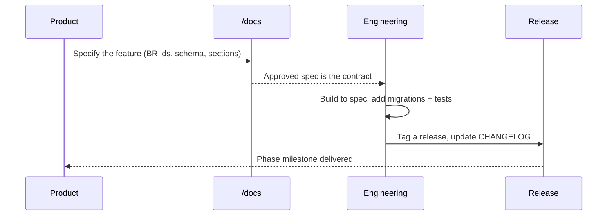
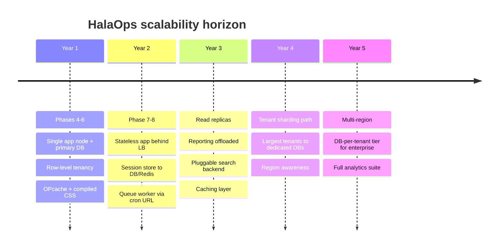

# 45 — Future Roadmap (خارطة الطريق المستقبلية)

The phased delivery plan for HalaOps — what is built, what is next, and the five-year scalability outlook — designed so every step extends the platform without rewrites.

## Related Documents

- [01-Project-Vision](01-Project-Vision.md)
- [36-Scalability](36-Scalability.md)
- [02-Business-Rules](02-Business-Rules.md)
- [16-AI-Architecture](16-AI-Architecture.md)
- [15-Payment-Gateways](15-Payment-Gateways.md)
- [29-API-Architecture](29-API-Architecture.md)
- [CHANGELOG](CHANGELOG.md)

## Purpose (الهدف)

This document lays out the roadmap for HalaOps in clearly bounded phases and a long-range scalability outlook. It states what has shipped (Phases 1–3), what is queued next (Phases 4–6), and the longer-horizon initiatives (public API, mobile, analytics, more AI providers, payment-gateway expansion). It exists so the team and stakeholders share one prioritized view of where the product is going.

## Why It Exists (سبب وجوده)

A platform meant to serve thousands of companies must grow deliberately. Without a roadmap, effort scatters and architectural debt accumulates. HalaOps was architected up front (one users table, fail-closed tenancy, data-driven plans, pluggable AI/gateways) precisely so that later phases are *additive*. This document makes that intent explicit: each phase builds on the last, and nothing on the roadmap requires undoing a foundational decision.

## Architecture

The roadmap is sequenced so each phase depends only on prior phases and the dependency-free core:

```mermaid
flowchart LR
    P1[Phase 1 Core framework] --> P2[Phase 2 No-CLI installer]
    P2 --> P3[Phase 3 Tenancy RBAC Auth]
    P3 --> P4[Phase 4 Workspace and Subscription UI]
    P4 --> P5[Phase 5 Tenant AI provider UI]
    P5 --> P6[Phase 6 Recruitment domain]
    P6 --> P7[Phase 7 Billing and Gateways]
    P7 --> P8[Phase 8 API and Integrations]
    P8 --> P9[Phase 9 Mobile and Analytics]
```

Each phase plugs into existing extension points: new permissions in `config/rbac.php`, new tables as migrations, new AI providers behind `AiProviderInterface`, new gateways behind `PaymentGatewayInterface`, new channels behind the notification abstraction.

## Workflow

How a roadmap item moves from idea to shipped, under documentation-first:

## Business Rules

The roadmap is constrained by the platform's invariants (full list in [02-Business-Rules](02-Business-Rules.md)):

- Every new capability is expressed as roles/permissions, never a user-type column (BR-001, BR-060).
- Every tenant feature scopes by `workspace_id` and fails closed (BR-040).
- New AI providers are additive behind the provider interface (BR-163).
- New payment gateways are additive behind the gateway interface (BR-182) and never hard-coded.
- Plans/limits stay data-driven so monetization changes need no migrations (BR-070, BR-074).

### Delivered phases (مُنجزة)

#### Phase 1 — Core foundation ✅
The pure-PHP micro-framework with zero runtime dependencies: custom PSR-4 autoloader (`bootstrap/autoload.php`), `Application`, `Container`, `Router`, `Request`/`Response`, `Database`/`QueryBuilder`, `Model`, `View`, `Session`, `Validator`, `Hash`, `Encrypter`, `Mailer`, `Logger`, `Translator`, middleware pipeline. See [31-Backend-Architecture](31-Backend-Architecture.md).

#### Phase 2 — No-CLI web installer ✅
The browser installer at `/setup` (`app/Controllers/Setup/InstallController.php`, routes in `routes/web.php`): requirements → database → migrate → seed → admin → finalize, with a live AJAX console and resume-from-last-step recovery. Writes `.env` and a lock file. See [32-Setup-Installer](32-Setup-Installer.md).

#### Phase 3 — Multi-tenancy, single users table, RBAC, authentication ✅
Row-level tenant isolation (fail-closed in `app/Core/Model.php`), the single `users` table, the full RBAC stack (`config/rbac.php`, `app/Services/Rbac/*`), and platform-wide authentication (login/register/forgot/reset, throttling, Argon2id). Migrations `0001`–`0015` and the baseline seeder (`database/seeders/DatabaseSeeder.php`) ship the schema, permission catalogue, super-admin role, and the "Standard" plan. See [07-RBAC](07-RBAC.md), [08-Multi-Tenant](08-Multi-Tenant.md), [09-Authentication](09-Authentication.md).

### Next phases (التالية)

#### Phase 4 — Workspace & subscription management UI
- Workspace creation/provisioning UI (atomic per BR-050), member invitations and role assignment screens (`members.*`, `roles.manage`).
- Subscription management surface over `plans`/`subscriptions`: view current plan, trial countdown, upgrade/downgrade (`billing.view/manage`).
- Backed entirely by existing tables; no schema changes for the core flows.

#### Phase 5 — Tenant AI provider layer (settings UI)
- Settings screens to add/rotate per-tenant credentials in `tenant_ai_keys` (encrypted AES-256-GCM), choose a default per provider (`(workspace_id, provider)` unique), and test connectivity (`ai.view/manage`).
- Implements provider classes behind `AiProviderInterface` for OpenAI, Anthropic, Gemini, DeepSeek, Azure OpenAI, and HeyGen. See [17-AI-Providers](17-AI-Providers.md).

#### Phase 6 — Recruitment domain & AI interview engine
- Ship the planned tables: `jobs`, `pipeline_stages`, `applications`, `application_events`, `interviews`, `interview_participants`, `interview_questions`, `interview_responses`, `ai_interview_sessions`, `evaluations`, plus `files` and `notifications`.
- Add the corresponding permission groups (jobs, applications, interviews, evaluations, candidate, notifications, files) and roles (HR Manager, Recruiter, Hiring Manager, Interviewer, Candidate).
- Implement the AI interview engine (question generation, async/live conducting, transcription, scoring, advisory analysis — human decision per BR-144). See [18-AI-Interview-Engine](18-AI-Interview-Engine.md), [24-Job-Lifecycle](24-Job-Lifecycle.md), [25-Application-Lifecycle](25-Application-Lifecycle.md).

### Future initiatives (مبادرات مستقبلية)

#### Phase 7 — Billing & payment gateways
- Ship `invoices`, `payments`, `payment_methods`, `gateway_events`.
- Implement the gateway registry behind `PaymentGatewayInterface` with Moyasar, Tap, and HyperPay for the Saudi market; Stripe/PayPal later. Idempotent webhook handling (BR-183). See [14-Billing-System](14-Billing-System.md), [15-Payment-Gateways](15-Payment-Gateways.md).

#### Phase 8 — Public REST API & integrations
- Token-authenticated, versioned `/api/v1` over `api_tokens`, reusing the same middleware, RBAC, and tenant scoping (entry-point-agnostic rules). JSON error envelope, rate limiting. See [29-API-Architecture](29-API-Architecture.md).
- Webhooks/outbound events and a queue worker via a protected cron URL using `queued_jobs`/`failed_jobs`.

#### Phase 9 — Mobile apps, analytics & deeper AI
- Mobile clients (candidate and recruiter) consuming the public API.
- Analytics and reporting on recruitment + audit data (funnels, time-to-hire, source effectiveness).
- More AI providers and richer AI (e.g. video interview analysis via HeyGen), still bring-your-own-keys (BR-160).
- Pluggable search backends (Meilisearch/Elasticsearch) behind the search abstraction. See [28-Search-System](28-Search-System.md).

### Roadmap at a glance

| Phase | Theme | Status | Key tables / extension points |
|-------|-------|--------|-------------------------------|
| 1 | Core framework | Delivered | `app/Core/*` |
| 2 | No-CLI installer | Delivered | `/setup`, `migrations` |
| 3 | Tenancy, RBAC, Auth | Delivered | `users`, `workspaces`, `memberships`, `roles`, `permissions`, … |
| 4 | Workspace & subscription UI | Next | `workspaces`, `memberships`, `plans`, `subscriptions` |
| 5 | Tenant AI provider UI | Next | `tenant_ai_keys`, `AiProviderInterface` |
| 6 | Recruitment + AI interviews | Next | `jobs`…`evaluations`, `files`, `notifications` |
| 7 | Billing & gateways | Future | `invoices`, `payments`, `gateway_events`, `PaymentGatewayInterface` |
| 8 | Public API & integrations | Future | `api_tokens`, `queued_jobs`, `failed_jobs` |
| 9 | Mobile, analytics, more AI | Future | API clients, search backends |

## Database Relations

The roadmap adds tables in dependency order; all are already specified as **planned** in [05-Database-Architecture](05-Database-Architecture.md) and [06-ERD](06-ERD.md):

- Phase 6 introduces the recruitment cluster, all tenant-scoped (`workspace_id` FK + index): `jobs` → `applications` (`UNIQUE(workspace_id, job_id, user_id)`) → `interviews` → `evaluations`, with `application_events` for audit and `ai_interview_sessions` for AI runs.
- Phase 7 introduces the billing cluster: `invoices` (`UNIQUE(number)`), `payments` (`IDX(workspace_id, gateway_reference)`), `payment_methods`, and the webhook log `gateway_events` (`IDX(gateway, reference)`).
- Phase 8 introduces `api_tokens` (`token_hash` unique) and the queue tables `queued_jobs`/`failed_jobs`.
- No phase modifies a built table's identity; additions are new columns/tables only, preserving migration history.

## Permissions

Each phase adds only data-driven permissions to `config/rbac.php`, consistent with [07-RBAC](07-RBAC.md) and [11-Permissions-Matrix](11-Permissions-Matrix.md):

- Phase 4/5: reuse existing `members.*`, `roles.manage`, `billing.*`, `ai.*`.
- Phase 6: `jobs.*`, `applications.*`, `interviews.*`, `evaluations.*`, `candidate.*`, `notifications.view`, `files.*`.
- Phase 7: `billing.manage` plus gateway-admin gates as needed.
- Phase 8: `platform.diagnostics` and API token abilities (scoped subset of permissions).

## Validation

Roadmap-level guardrails before any phase is accepted:

- New tables follow schema conventions (InnoDB, utf8mb4, FK + index on `workspace_id`, per-workspace uniqueness where relevant).
- New permissions are actually enforced somewhere (no unused permissions, BR-066).
- New providers/gateways register without touching unrelated code (additive, BR-163/BR-182).
- New features render in both LTR and RTL and pass the [40-QA-Checklist](40-QA-Checklist.md).

## Edge Cases

- **A later phase needs a foundational change** — if a phase ever requires breaking BR-001/BR-040, it is rejected and redesigned; the foundation is non-negotiable.
- **A gateway/provider is deprecated by its vendor** — the registry lets us disable one entry without affecting the others (BR-182, BR-163).
- **Demand for heavier tenant isolation before Phase 9** — the scalability path (below) can be pulled forward; row-level tenancy and DB-per-tenant share the same model API.
- **Scope creep into HRIS/payroll** — explicitly a non-goal ([01-Project-Vision](01-Project-Vision.md)); such requests are parked, not silently built.

## Security

- Each phase inherits the platform security model ([34-Security](34-Security.md)) unchanged: CSRF, RBAC, fail-closed tenancy, AES-256-GCM secrets, audit logging.
- The public API phase reuses the same authorization and tenant scoping, so it adds surface area but not new authorization logic.
- Payment phases minimize PCI scope by storing only gateway tokens (BR-185) and verifying webhook signatures.
- New AI providers keep the no-platform-keys guarantee (BR-160).

## Performance

- Phases add indexes alongside every new table (every FK + status/filter columns), keeping queries index-backed as data grows.
- Phase 8's queue (`queued_jobs`) offloads AI and email work from the request path, protecting interactive latency.
- Analytics (Phase 9) reads from replicas where possible to avoid loading the primary.

## Testing

- Each phase ships with unit, feature, and security tests per [39-Testing-Strategy](39-Testing-Strategy.md).
- Cross-tenant isolation tests are re-run for every new tenant table.
- Webhook idempotency and gateway failure paths are tested in Phase 7.
- API contract and rate-limit tests are added in Phase 8.

## Future Expansion

### Five-year scalability outlook

- **Stateless app tier**: the app holds no in-process tenant state beyond the request, so it scales horizontally behind a load balancer once the session store moves to DB/Redis (see [36-Scalability](36-Scalability.md)).
- **Read replicas**: reporting and search read paths move to replicas; writes stay on the primary.
- **Tenant sharding / DB-per-tenant**: because all tenant access goes through the model's tenant scope, large customers can be migrated to dedicated databases with the same code path — the row-level design is a starting point, not a ceiling ([08-Multi-Tenant](08-Multi-Tenant.md)).
- **Queue offload**: AI calls, transcription, and email are queued, smoothing spikes and enabling background scaling.
- **Provider/gateway/search registries**: the three pluggable registries mean ecosystem growth (more AI vendors, more payment options, stronger search) is configuration plus a class, never a rewrite.

## Open Questions

- Final ordering of Phase 8 vs Phase 9 sub-items (API-first vs analytics-first) depends on early customer demand.
- The threshold at which a tenant is promoted to the DB-per-tenant tier is a capacity-planning decision to be set once production load data exists.
- Which additional AI providers and payment gateways to prioritize beyond the documented set is a commercial decision tracked with [15-Payment-Gateways](15-Payment-Gateways.md) and [17-AI-Providers](17-AI-Providers.md).
