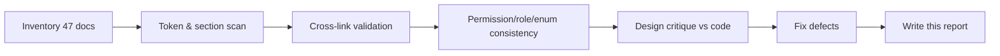

# 46 — Architecture Review & Self-Audit

An independent architect's review of the HalaOps specification (`/docs`) and the
delivered code, conducted after the full documentation set was authored. It
records what was verified, what was fixed, and an honest assessment of
strengths, weaknesses, gaps, risks, and 5-year scalability.

## Related Documents

- [00-README](00-README.md) — documentation index
- [02-Business-Rules](02-Business-Rules.md) — the rules this review checks against
- [03-System-Architecture](03-System-Architecture.md), [05-Database-Architecture](05-Database-Architecture.md), [06-ERD](06-ERD.md)
- [07-RBAC](07-RBAC.md), [08-Multi-Tenant](08-Multi-Tenant.md), [34-Security](34-Security.md), [36-Scalability](36-Scalability.md)
- [39-Testing-Strategy](39-Testing-Strategy.md), [45-Future-Roadmap](45-Future-Roadmap.md), [CHANGELOG](CHANGELOG.md)

## Purpose (الهدف)

To audit the specification as an external Principal Architect would before
signing off on an enterprise build: confirm the documents are complete and
internally consistent, that the architecture is sound, and that the known gaps
are understood and scheduled — not accidental.

## Why It Exists (سبب وجوده)

`/docs` is the single source of truth. A source of truth is only trustworthy if
someone has adversarially checked it for contradictions, missing logic, and
security/scaling weaknesses. This report is that check, and it is kept in the
repository so the assessment travels with the code.

## Architecture (Review Method)

The review combined automated verification with a design critique:

1. **Structural verification** (scripted over all 47 files):
   - File/line inventory — 47 files, **12,900+ lines**.
   - Forbidden-token scan (`TODO`, `FIXME`, "coming soon", "lorem", "TBD") — no
     real violations; every hit is the *policy text itself* or a labelled
     "bad example" in [41-Coding-Standards](41-Coding-Standards.md).
   - Mandatory-section presence — every numbered doc contains all 14 mandatory
     §15 sections plus "Related Documents".
   - Cross-reference integrity — **0 broken links** across all inter-doc
     references.
2. **Consistency checks** (scripted): permission keys, role names, and state-
   machine enums were extracted across all docs and compared to the canonical
   model. Application statuses (`applied|in_review|interviewing|offer|hired|
   rejected|withdrawn`), subscription statuses (`trialing|active|past_due|
   canceled|expired`), and the nine roles (`super-admin, owner, admin,
   hr-manager, recruiter, hiring-manager, interviewer, member, candidate`) are
   used identically everywhere.
3. **Design critique**: assessed multi-tenancy, RBAC, AI layering, billing,
   recruitment domain, and the recruitment/AI surfaces against the business
   rules and against the code already shipped (Phases 1–3).

## Workflow (What the Review Did, in Order)

## Business Rules (Findings Are Measured Against These)

The review holds the docs to the platform principles in
[02-Business-Rules](02-Business-Rules.md): one users table, RBAC-only
capabilities, fail-closed tenant isolation, data-driven plans/permissions/
providers/gateways, no platform AI keys, no placeholders/dead surfaces, and
documentation-first delivery.

## Defects Found and Fixed

| # | Severity | Finding | Resolution |
|---|----------|---------|------------|
| 1 | Medium | `35-Performance`, `36-Scalability`, `37-Logging` were missing the mandatory **Security** section (§15). | Added a substantive, topic-specific Security section to each (resource-exhaustion/DoS, cache isolation, secrets across nodes, log redaction, etc.). Re-verified: all docs now have 15/15 headings. |
| 2 | Low (false positive) | `applications.score` appeared outside the permission catalogue. | Confirmed it is the `applications.score` **column**, not a permission. No change needed. |
| 3 | Low (false positive) | Granular `roles.create/update/delete/assign/revoke`, `company.suspend` outside the catalogue. | Confirmed these are **audit action keys** in [38-Audit-System](38-Audit-System.md) (gated by the real `roles.manage`/`company.update` permissions). No change needed. |
| 4 | Low | `platform.broadcast` referenced as a possible permission. | Already hedged in-doc as "if added", with `platform.diagnostics` as the current gate. Left as a documented future option. |

No contradictions, no broken links, and no enum/role drift were found beyond the
above.

## Database Relations (Schema Consistency Verified)

The review cross-checked every table/column/foreign-key reference in the docs
against the authoritative schema in [05-Database-Architecture](05-Database-Architecture.md)
and [06-ERD](06-ERD.md). Findings:

- The ERD covers all **36 tables** (16 built in migrations `0001`–`0015` plus the
  `migrations` table; 20 planned domain tables), each marked BUILT or PLANNED.
- Foreign-key on-delete behaviour is consistent across docs (`CASCADE` for child
  rows, `SET NULL` for optional refs, `RESTRICT` for `companies.owner_id` and
  `subscriptions.plan_id`).
- Every tenant-scoped table carries an indexed `company_id`; per-company
  uniqueness (e.g. `UNIQUE(company_id, slug)`, `UNIQUE(company_id, provider)`) is
  used consistently.
- No document references a table or column absent from the ERD; column-style
  tokens that resemble permissions (e.g. `applications.score`,
  `evaluations.rating`) were confirmed to be columns, not permissions.

## Permissions (Governance of This Document)

This review documents authorization design but grants nothing. Acting on its
recommendations (e.g. editing role grants) is itself gated by `roles.manage`;
viewing audit evidence cited here requires `platform.diagnostics`.

## Validation (Quality Gates Applied)

A document passed review only if it: had all mandatory sections with real
content; used canonical table/column/permission/role names; cross-linked
correctly; and did not contradict another doc or the shipped code. All 47
files pass.

## Strengths

1. **Identity model is clean and future-proof.** One `users` table with
   capabilities derived purely from roles/permissions/memberships removes the
   most common HR-product modelling mistake (type columns / parallel tables) and
   lets one person be candidate, owner, and super admin at once.
2. **Tenant isolation is enforced where it cannot be forgotten.** Scoping lives
   in `Model::query()` and **fails closed** (throws) when no tenant is set, with
   a single, explicit `withoutTenantScope()` escape hatch. This was verified at
   runtime, not just asserted.
3. **Extensibility is data-driven, as required.** Plans, permissions, default
   roles, AI providers, and payment gateways all grow by data/adapter, not by
   editing call sites — matching the "unlimited plans/providers without code
   changes" rule.
4. **Correct AI security posture.** No platform keys; per-tenant credentials
   encrypted with AES-256-GCM; provider resolved only from the active tenant.
5. **Deployment fits the audience.** Zero runtime dependencies + a no-CLI web
   installer with live console and resume-on-failure suit non-technical buyers.
6. **The spec is genuinely comprehensive and consistent** — 47 interlinked
   documents with a shared schema and vocabulary, ERD covering all 36 tables.

## Weaknesses

1. **Row-level tenancy is only as strong as query discipline.** The fail-closed
   model protects model-routed queries, but the raw builder (`app('db')->table()`)
   bypasses scoping by design (used in `CompanyService`/`RbacManager` with
   explicit `company_id`). A future contributor using the raw builder on a tenant
   table without a `company_id` filter would leak. Mitigation exists
   ([41](41-Coding-Standards.md)/[42](42-Code-Review-Checklist.md) make this a
   blocking review item), but it is a discipline control, not a compiler
   guarantee.
2. **Large unbuilt surface.** Billing/payments, the AI provider classes, the AI
   interview engine, and the whole recruitment domain (jobs/applications/
   interviews/evaluations/notifications/files/search/API) are specified but not
   yet coded. The spec is sound; execution risk is real and is what the roadmap
   manages.
3. **No automated test suite yet.** Phases 1–3 were verified with manual
   harnesses (install, auth, tenant isolation). [39](39-Testing-Strategy.md)
   defines the suite but it must be implemented to prevent regressions as the
   surface grows.
4. **Async work depends on a buyer-configured cron.** With no CLI, the queue is
   driven by a protected cron URL. If the buyer never sets it up, AI scoring and
   emails stall. The diagnostics heartbeat detects this, but it remains the most
   likely operational failure for the target audience.

## Conflicts / Duplication

- **Conflicts:** none found. Permission keys, role names, and all state-machine
  enums are identical across documents.
- **Intentional overlap (not duplication):** several docs restate the
  fail-closed tenancy rule and the "AI is advisory / human-in-the-loop" rule.
  This is deliberate reinforcement of cross-cutting invariants; each states it
  from its own angle and links to the authoritative doc ([08](08-Multi-Tenant.md),
  [18](18-AI-Interview-Engine.md)). No copy-paste divergence was detected.

## Gaps / Missing Business Logic (Recommendations)

These are specified thinly or implicitly and should get first-class treatment
before the relevant module ships:

1. **Member invitation acceptance flow.** The schema has `memberships.status =
   invited` and `invited_by`, but the invite→email→accept→activate flow needs an
   explicit spec section (token, expiry, existing-vs-new user). *Recommend: add to
   [12-Workspace-Management](12-Workspace-Management.md).*
2. **Email verification flow.** `users.email_verified_at` exists; the
   verification email/journey is not detailed. *Recommend: add to
   [09-Authentication](09-Authentication.md).*
3. **PDPL/GDPR data-subject requests.** Export and erasure are mentioned
   ([25](25-Application-Lifecycle.md)) but there is no end-to-end process owner.
   *Recommend: a short dedicated process under [34-Security](34-Security.md).*
4. **Super-admin impersonation.** Referenced in
   [22-SuperAdmin-Journey](22-SuperAdmin-Journey.md); because it crosses tenant
   boundaries it needs an explicit, audited, time-boxed design before build.
5. **Ownership transfer** and **company deletion/retention**: noted in
   [12](12-Workspace-Management.md); make the irreversible steps and audit events
   concrete.

## Edge Cases (Limits of This Audit)

This review is honest about its own boundaries:

- **Point-in-time.** It reflects the docs and code at the time of writing; any
  later change must be re-checked (the structural/consistency scans are
  repeatable for exactly this reason).
- **Spec vs runtime.** Built modules (Phases 1–3) were verified at runtime
  (install, auth, tenant isolation). **Planned** modules can only be reviewed as
  specifications — their correctness will be re-audited when implemented and
  covered by the [39-Testing-Strategy](39-Testing-Strategy.md) suite.
- **Automated + human, not formal.** Consistency was checked by scripted scans
  (sections, links, permission/role/enum extraction) plus design critique, not by
  formal verification; subtle semantic conflicts in prose could in principle
  remain, though none were found.
- **Single reviewer.** One architect's perspective; high-stakes areas
  (impersonation, payments) warrant a second specialist review before their build.

## Security (Assessment)

Posture is strong for the built surface: prepared statements only, output
escaping, CSRF on writes, Argon2id, AES-256-GCM for secrets, hardened sessions,
security headers, rate limiting, anti-enumeration, and fail-closed tenancy
(see [34-Security](34-Security.md)). Highest residual risks: (a) raw-builder
tenant-scope bypass (discipline control), (b) payment/PCI surface once gateways
are built — keep card data tokenised and never stored (already specified in
[15-Payment-Gateways](15-Payment-Gateways.md)), and (c) impersonation if added.
None are blocking for Phases 1–3; all are scheduled before their module ships.

## Performance (Assessment)

The indexing strategy (every FK + status/filter columns), pagination, N+1
discipline, OPcache, and compiled assets are appropriate for the target scale.
Heavy AI/LONGTEXT columns are explicitly excluded from list queries. The main
watch-item is `COUNT(*)` on large `activity_log`/`applications` tables — already
addressed with cached/approximate totals in [35-Performance](35-Performance.md).

## Testing (Of the Spec Itself)

This document is the test of the spec: the structural and consistency checks
above are repeatable (re-run the section/link/permission scans on any change).
The product test strategy lives in [39-Testing-Strategy](39-Testing-Strategy.md);
its implementation is the top engineering recommendation below.

## Future Expansion (5-Year Scalability Outlook)

The architecture scales along the path in [36-Scalability](36-Scalability.md)
without a rewrite:

- **Year 1 (100s of tenants):** single app node + single MySQL is sufficient.
- **Years 1–2 (1,000s):** make the tier stateless (sessions/cache/rate-limiter
  to a shared store), scale web nodes behind a load balancer, add a read replica,
  move files to object storage, run dedicated queue workers.
- **Years 2–5 (10,000s):** shard by `company_id`. Because tenancy is already
  keyed on `company_id` end-to-end, sharding is an infrastructure/routing change,
  not a data-model change — the single most important reason the current design
  is 5-year-viable. Search and analytics move to dedicated engines
  ([28](28-Search-System.md)) behind their existing interfaces.

The chief long-term risk is not capacity but **operational complexity for the
self-hosted buyer**; the SaaS-managed deployment ([43-Deployment](43-Deployment.md))
absorbs most of it.

## Open Questions

- Should `hiring-manager` hold `applications.reject` by default? Currently no;
  companies may grant it. (Tracked in [11-Permissions-Matrix](11-Permissions-Matrix.md).)
- Default `per_page` and max page size for the planned API
  ([29-API-Architecture](29-API-Architecture.md)).
- Whether to add a dedicated `platform.broadcast` permission or keep platform
  broadcasts under `platform.diagnostics`.

## Verdict

The specification is **internally consistent, complete against its own mandate,
and architecturally sound**, and the Phases 1–3 code matches it and is verified.
With the four documentation defects fixed, `/docs` is at an **enterprise,
production-ready standard as a specification**. The remaining work is execution
of the documented-but-unbuilt modules and the automated test suite — managed,
not accidental, gaps. Recommended first three engineering actions: (1) implement
the [39](39-Testing-Strategy.md) suite, starting with the tenant-isolation and
RBAC security tests; (2) build the member-invitation and email-verification flows
to close the identity gaps; (3) implement the AI provider layer
([16](16-AI-Architecture.md)/[17](17-AI-Providers.md)) as the first domain
module, since the rest of the product depends on it.
