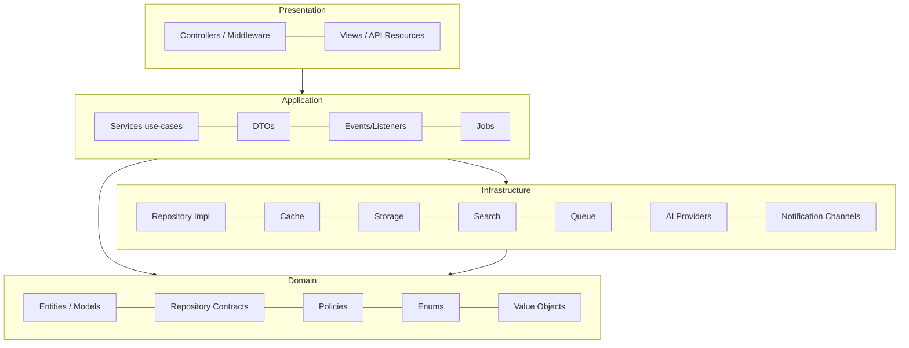
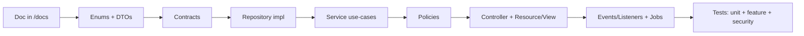

# 47 — Enterprise Architecture Standards

The binding engineering standard for HalaOps: the layered architecture, the
patterns every module must use, and the rules that make the platform modular,
scalable, testable, and sellable to thousands of companies.

## Related Documents

- [03-System-Architecture](03-System-Architecture.md) — high-level request lifecycle
- [04-Folder-Structure](04-Folder-Structure.md) — directory map (kept in sync with this doc)
- [05-Database-Architecture](05-Database-Architecture.md), [08-Multi-Tenant](08-Multi-Tenant.md), [07-RBAC](07-RBAC.md)
- [31-Backend-Architecture](31-Backend-Architecture.md), [41-Coding-Standards](41-Coding-Standards.md), [42-Code-Review-Checklist](42-Code-Review-Checklist.md)
- [26-Notification-System](26-Notification-System.md), [27-Storage-System](27-Storage-System.md), [28-Search-System](28-Search-System.md), [16-AI-Architecture](16-AI-Architecture.md)
- [38-Audit-System](38-Audit-System.md), [39-Testing-Strategy](39-Testing-Strategy.md)
- [49-Development-Workflow](49-Development-Workflow.md) — the binding per-feature lifecycle every change follows
- [50-Continuous-Project-Audit](50-Continuous-Project-Audit.md) — the whole-project audit gate run between phases

## Purpose (الهدف)

To define **how** HalaOps is built — the layers, boundaries, and design
patterns — so the platform stays a maintainable, extensible Enterprise SaaS and
never degrades into business logic scattered across controllers, views, models,
and routes.

## Why It Exists (سبب وجوده)

A platform sold to thousands of tenants lives for years and is touched by many
engineers. Without an enforced architecture it accrues coupling and duplication
until change becomes risky. This standard fixes the seams (interfaces) and the
responsibilities (layers) so features are added by composition, swappable
infrastructure (cache/search/storage/AI/notifications) is replaced without
touching callers, and every change is testable in isolation.

## Architecture

### The four layers



**Dependency rule:** dependencies point inward. Presentation depends on
Application; Application depends on Domain (contracts) and orchestrates
Infrastructure through those contracts; Infrastructure implements Domain
contracts. Domain depends on nothing outside itself. Concrete classes are wired
to interfaces in the container — callers never `new` an implementation.

| Layer | Responsibility | Lives in | Must NOT |
|-------|----------------|----------|----------|
| Presentation | HTTP in/out: parse request → DTO, call a service, render view/JSON | `app/Controllers`, `app/Http/Middleware`, `app/Http/Resources`, `resources/views` | contain business logic or SQL |
| Application | Use-cases: orchestrate domain + infrastructure, transactions, fire events | `app/Services`, `app/DTOs`, `app/Events`, `app/Listeners`, `app/Jobs` | talk to the DB directly (uses repositories) |
| Domain | Business entities, rules, contracts, policies, enums | `app/Models`, `app/Domain` (Contracts, Policies, Enums, ValueObjects) | depend on HTTP, cache, or a concrete DB driver |
| Infrastructure | Technical implementations behind contracts | `app/Infrastructure` (Cache, Storage, Search, Queue, Events), `app/Repositories`, `app/Services/AI`, `app/Notifications` | leak vendor types into Application/Domain |

### Folder structure (target)

```
app/
  Contracts/            Interfaces for every swappable seam (Repository, Cache,
                        Store, Search, Queue, NotificationChannel, AiProvider,
                        EventDispatcher, AuditLogger, Settings, FeatureFlags)
  Domain/
    Enums/              PHP 8.1 enums (statuses, types)
    Policies/           Authorization policies per entity
    ValueObjects/       Small immutable types (Money, Email, ...)
  DTOs/                 Immutable data carriers between layers
  Events/               Event objects (UserRegistered, CompanyCreated, ...)
  Listeners/            Event listeners (LogActivity, SendWelcome, ...)
  Jobs/                 Queueable units of work
  Repositories/         Repository implementations (BaseRepository + concretes)
  Infrastructure/
    Cache/              CacheManager + FileStore/ArrayStore
    Storage/            StorageManager + LocalDriver (S3 later)
    Search/             SearchManager + MySqlDriver (engine later)
    Queue/              QueueManager + DatabaseQueue + Worker
    Events/             EventDispatcher
  Notifications/        NotificationManager + channels (InApp, Mail, ...)
  Services/             Application use-case services (+ AI/, Settings/, Audit/)
  Http/
    Middleware/         Pipeline middleware
    Resources/          API transformers/resources
  Controllers/          Thin controllers (web + Api/V1)
  Models/               Eloquent-style domain entities
  Support/              helpers, Enums runtime, small utilities
```

## Workflow (How a feature is built — per-module cycle)

Every module follows: **Design → Architecture Review → Database Review →
Implementation → Testing → Bug Fixing → Optimization → Security Audit →
Performance Audit → Refactoring → Final QA → Production**. No new module starts
until the previous one's tests pass.

Implementation order inside a module:



## Business Rules

- **EAS-1** No business logic in controllers, views, routes, or models. Logic
  lives in Application services; data access lives in repositories.
- **EAS-2** Depend on abstractions: services receive collaborators via
  constructor injection of **interfaces**, resolved from the container. Never
  `new SomeService()` or `new ConcreteRepository()` in a caller.
- **EAS-3** All persistence goes through a Repository. No ad-hoc queries outside
  `app/Repositories` / `app/Infrastructure`.
- **EAS-4** Data crossing a layer boundary is a **DTO** (immutable), not a raw
  request array.
- **EAS-5** Every write that touches >1 row/table runs inside a DB transaction.
- **EAS-6** Important actions emit a **domain event**; side effects
  (notifications, audit, search indexing) are **listeners/jobs**, not inline code.
- **EAS-7** Important actions are **audited** with old + new values, actor,
  tenant, IP, and device.
- **EAS-8** Core entities are **soft-deleted** (`deleted_at`) and carry a public
  **UUID** alongside the numeric id.
- **EAS-9** Nothing is hard-coded that a tenant might change — it is a **Setting**
  or a **Feature Flag**.
- **EAS-10** Swappable infrastructure (cache, storage, search, queue, AI,
  notifications) is used only through its contract; switching a driver is a
  config/binding change, never a code change in callers.
- **EAS-11** Every endpoint enforces **authentication → tenant scope →
  permission/policy** before doing work (see [10-Authorization](10-Authorization.md)).
- **EAS-12** Heavy work (email, PDF, AI, import/export, reports) is queued; all
  periodic work runs via the scheduler.

## Database Relations

This standard adds cross-cutting columns/tables (see
[05-Database-Architecture](05-Database-Architecture.md), [06-ERD](06-ERD.md)):

- **Soft delete:** core tenant entities gain `deleted_at TIMESTAMP NULL`;
  repositories exclude soft-deleted rows by default.
- **UUID:** core entities gain `uuid CHAR(36)` with a unique index; public URLs
  and API resources expose the UUID, never the numeric id.
- **Audit:** `activity_log` carries `old_values JSON`, `new_values JSON`,
  `device`, alongside `action`, `subject_type/id`, `user_id`, `company_id`, `ip`,
  `user_agent`, `created_at`.
- **Settings/Feature flags:** the tenant `settings` table holds per-company
  settings and feature toggles; global defaults live in `config/` and are
  overridable per tenant.
- **Queue:** `queued_jobs` + `failed_jobs` (see [26](26-Notification-System.md),
  Queue section below).

## Permissions

The architecture *enforces* RBAC; it does not define permissions (those live in
[07-RBAC](07-RBAC.md)/[11-Permissions-Matrix](11-Permissions-Matrix.md)).
Authorization is applied via: route middleware (`permission:*`), Policy classes
resolved by `AccessControl`, and repository-level tenant scoping. A request that
mutates data checks a Policy in the service/controller before the repository
write.

## Validation

- Every inbound request is validated **server-side** via `Validator` (rules) and
  mapped into a typed **DTO**; the DTO is the only thing the service trusts.
- Mass-assignment is prevented by `$fillable` allow-lists and by DTOs (services
  never spread a raw request into a model/repository).
- Enums constrain status/type fields at the boundary (invalid value → rejected).

## Edge Cases

- **Driver missing/misconfigured** (e.g. S3 creds absent) → the manager falls
  back to the default driver or fails with a clear, logged error; callers are
  unaffected because they depend on the contract.
- **Event listener throws** → queued listeners retry via `failed_jobs`;
  synchronous critical-path listeners are wrapped so a non-critical side effect
  cannot fail the main transaction.
- **Soft-deleted record referenced** → repositories provide explicit
  `withTrashed()`/`restore()`; default reads never return trashed rows.
- **Cache stampede / staleness** → settings/feature-flag caches use short TTLs
  and are busted on write.
- **Cross-layer leakage** → enforced in code review ([42](42-Code-Review-Checklist.md)):
  a controller importing a repository impl, or a service running raw SQL, is a
  blocking finding.

## Security

- Contracts keep secrets in Infrastructure (e.g. AI keys decrypted only inside
  the provider adapter). Application/Domain never see raw credentials.
- DTOs + `$fillable` close mass-assignment; repositories apply tenant scope so a
  tampered id/URL cannot reach another tenant's row (see [08](08-Multi-Tenant.md)).
- Policies centralize "can this actor do this to this object" decisions,
  including ownership checks the permission flag alone cannot express.
- Audit (old/new) gives tamper-evident forensics; soft delete prevents
  destructive data loss and supports recovery.
- See [34-Security](34-Security.md) for the full control set.

## Performance

- Repositories centralize query construction so indexes, pagination, and
  eager/lazy loading are applied consistently and N+1 is caught in one place.
- The Cache layer memoizes hot reads (settings, feature flags, permission sets,
  plan limits) with explicit invalidation.
- Queue offloads heavy work off the request path; the scheduler batches periodic
  work. See [35-Performance](35-Performance.md).

## Testing

- Because everything depends on interfaces, tests inject fakes (in-memory cache,
  array repository, fake dispatcher) — no network or real DB needed for unit
  tests. Repository and tenant-isolation tests run against a real MySQL schema.
- The in-house runner (`tests/run.php`, `tests/TestCase.php`) executes unit,
  feature, and security suites with zero runtime dependencies (dev-only PHPUnit
  is an alternative). See [39-Testing-Strategy](39-Testing-Strategy.md). Each
  module ships with passing tests before the next begins.

## Future Expansion

- New cache/search/storage/queue/notification/AI backends = a new class
  implementing the contract + a binding line. Zero caller changes.
- New domain modules = new Enums/DTOs/Contracts/Repository/Service/Policies/
  Controller/Events, composed on this foundation.
- The clean, versioned API (`app/Controllers/Api/V1`, `app/Http/Resources`)
  makes a mobile app a client of the same Application services — see
  [29-API-Architecture](29-API-Architecture.md).

## Open Questions

- Whether to adopt a dev-only autoloaded `vendor/` for test tooling (PHPUnit) or
  keep the in-house runner only — currently both are supported, in-house is the
  shipped default (no runtime deps).
- Final placement of Models: kept in `app/Models` for now (pragmatic), with
  Domain contracts/policies/enums in `app/Domain`; a future move into
  `app/Domain/Models` is possible without behavior change.
