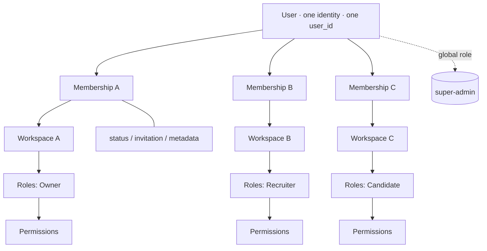

# 48 — Multi-Tenant + RBAC Bible (System Constitution)

The constitution of HalaOps. 100% binding. Every module, query, API, and UI
obeys it. If any code needs `if (user_type)` / `if (admin)` / `if (candidate)`,
the architecture is wrong and must be redesigned.

## Related Documents

- [07-RBAC](07-RBAC.md) · [08-Multi-Tenant](08-Multi-Tenant.md) · [09-Authentication](09-Authentication.md) · [10-Authorization](10-Authorization.md) · [11-Permissions-Matrix](11-Permissions-Matrix.md)
- [12-Workspace-Management](12-Workspace-Management.md) · [13-Subscription-System](13-Subscription-System.md) · [16-AI-Architecture](16-AI-Architecture.md) · [27-Storage-System](27-Storage-System.md)
- [34-Security](34-Security.md) · [38-Audit-System](38-Audit-System.md) · [47-Enterprise-Architecture-Standards](47-Enterprise-Architecture-Standards.md)
- DB blueprint: [database/02-RBAC-Membership](database/02-RBAC-Membership.md) · [database/03-Workspaces-Settings](database/03-Workspaces-Settings.md)

## Purpose (الهدف)

To fix, once and for all, how identity, tenancy and authorization work across the
entire platform: one user identity, many workspaces, many roles, permission-gated
actions, and absolute tenant isolation — with no user-type concept anywhere.

## Why It Exists (سبب وجوده)

Every multi-tenant HR product dies on two mistakes: modelling "types" of users,
and leaking one tenant's data into another. This constitution forbids both
structurally. Capability is derived (roles + permissions + membership + current
tenant), and isolation is enforced by the framework, not by developer discipline.

## Architecture

### Identity, membership, tenant — the shape

The relationship is never `User → Workspace`. It is
`User → Membership → Workspace → Role(s) → Permissions → Status → Invitation →
Metadata`. A user belongs to many workspaces; in each, their roles (and therefore
permissions) differ. Global roles (super-admin) attach to the user directly.

### Current tenant
After login, if the user belongs to more than one workspace, the system shows a
**Select Workspace** screen. The chosen workspace becomes the **Current Tenant** —
the single reference for the rest of the session. The user can switch workspace
at any time without logging out.

### Automatic tenant scope (the most important rule)
A **global tenant scope** is applied automatically at the model layer. The
developer cannot opt in or forget it: a tenant-scoped model constrains every
read/write to the Current Tenant and **fails closed** (throws) if no tenant is
set. Cross-tenant access requires the explicit `withoutTenantScope()` escape
hatch, confined to super-admin/system code. (Implemented in
`App\Core\Model::query()`; see [08-Multi-Tenant](08-Multi-Tenant.md).)

### Authorization
Every action passes a **permission** check — never a role check alone — combined
with a **policy** (context-aware: ownership/tenant membership) and the tenant
scope. Super admin is a **role** (global) that may bypass tenant scope only when
explicitly needed.

## Workflow

- **Register/Login** → one account; `auth_user_id` in session.
- **Resolve workspace** → multi-workspace users hit Select Workspace; the choice is
  stored and becomes Current Tenant.
- **Every request** → authenticate → resolve current tenant → check
  permission/policy → model layer auto-scopes the data.
- **Invitations** → `Email → Invitation → Accept → Membership → Role` (the only
  way to add a member; never a new account).
- **Mode changes are role changes** → a candidate who creates a workspace gets the
  Owner role added (no new user); an owner who applies for a job becomes a
  candidate in that other tenant (same user).
- **Workspace switch** → change Current Tenant in place, no logout.

## Business Rules (constitution — MTR-xxx, 100% binding)

**Identity**
- **MTR-001** Exactly one `users` table. No candidate/hr/recruiter/owner/admin/
  super-admin/employee tables.
- **MTR-002** A person has one identity (`user_id`) no matter how many workspaces,
  roles, permissions, or subscriptions they hold.
- **MTR-003** There are no user types. "Admin/HR/Candidate/Owner/Recruiter/Super
  Admin" are **roles**, never columns or tables.

**Roles & workspaces**
- **MTR-010** A user may hold many roles at once (Candidate, Owner, Recruiter,
  HR, Interviewer, Manager, Executive, Viewer, Super Admin) — simultaneously.
- **MTR-011** A user may be a member of many workspaces, with different roles in
  each, and be Super Admin platform-wide at the same time.
- **MTR-012** Roles are dynamic: created, edited, deleted as data — never in code.

**Membership & tenant**
- **MTR-020** Access is modelled as `User → Membership → Workspace → Roles →
  Permissions → Status → Invitation → Metadata`.
- **MTR-021** After login, multi-workspace users select a workspace; the Current
  Tenant is the single reference thereafter.
- **MTR-022** Users switch the Current Tenant at any time without logging out.

**Isolation (highest priority)**
- **MTR-030** Every query, API, search, export, report, dashboard, analytics,
  notification, AI request, upload, download, file, job, candidate, interview,
  offer, invoice, and subscription is scoped to the Current Tenant.
- **MTR-031** No tenant can read another tenant's data, ever — including by
  tampering with a URL/ID.
- **MTR-032** Tenant scope is automatic (global scope) and fails closed; it does
  not depend on the developer remembering it.
- **MTR-033** A cross-tenant access attempt is **rejected** and recorded as a
  **security event**.

**Authorization**
- **MTR-040** Every action passes a permission check; role alone is never
  sufficient.
- **MTR-041** Each module has its own policy; authorization is not expressed as
  ad-hoc `if` statements.
- **MTR-042** Super Admin is a role with elevated permissions that may bypass
  tenant scope only when explicitly required (and the bypass is auditable).

**Ownership (workspace-owned, not user-owned)**
- **MTR-050** Subscriptions belong to the workspace, not the user.
- **MTR-051** AI keys (OpenAI/HeyGen/Anthropic/Gemini/…) belong to the workspace.
- **MTR-052** Billing belongs to the workspace.
- **MTR-053** Files/storage belong to the workspace.

**Accountability**
- **MTR-060** Every activity log records user, workspace, role, permission, IP,
  browser, device, action, timestamp.
- **MTR-061** Super Admin may impersonate any user without their password; the
  entire session is logged start-to-finish.
- **MTR-062** Every change to roles, permissions, membership, subscriptions, AI
  settings, or billing is audited (old → new).

**The Golden Rule**
- **MTR-070** If anywhere in the codebase you need `if (user_type)`,
  `if (admin)`, `if (candidate)`, or `if (hr)`, the architecture is wrong —
  redesign it. The system is built on Users + Roles + Permissions + Memberships +
  Current Tenant, never user types.

## Database Relations

- `users` (global identity) — [database/02-RBAC-Membership](database/02-RBAC-Membership.md).
- `memberships` (user↔workspace; status_id, invited_by, invited_at, joined_at,
  metadata) + `membership_roles` (tenant roles) + `user_roles` (global roles).
- `roles` (workspace_id NULL = global; parent_id inheritance), `permissions`,
  `permission_groups`, `role_permissions`, `policies`, `policy_permissions`,
  `permission_caches`, `role_histories`, `permission_histories`.
- `workspace_invitations` (token, email, role_id, expires) → feeds memberships.
- Ownership: `subscriptions`, `tenant_ai_keys`, `invoices`/`payments`, `files` all
  carry `workspace_id`.
- Accountability: `activity_logs` (+ old/new/device), `security_logs`,
  `status_histories`, and impersonation records.

## Permissions

### Modules (permission groups)
Dashboard, Users, Workspaces, Jobs, Candidates, Applications, Interviews, Offers,
Reports, Analytics, AI, Billing, Subscriptions, Settings, Roles, Permissions,
Notifications, Files, Integrations.

### Permission types (per module, as applicable)
`view`, `create`, `edit`, `delete`, `restore`, `export`, `import`, `approve`,
`reject`, `assign`, `manage`.

The concrete key per module/type is `<module>.<type>` (e.g. `jobs.create`,
`applications.approve`, `files.export`). The authoritative grid is
[11-Permissions-Matrix](11-Permissions-Matrix.md); only permissions actually
enforced exist (no unused permissions). Roles map to permission subsets and are
fully editable.

## Validation

- Permission keys validated against the catalogue; roles/permissions assigned
  only within the acting tenant (or globally for super-admin-granted roles).
- Invitations validate email + role + expiry; acceptance binds to the existing
  user (or creates the single user if brand new) — never a duplicate identity.
- Workspace switch validates active membership before changing Current Tenant.

## Edge Cases

- **User in 1 workspace** → no Select Workspace; that workspace is Current Tenant.
- **User in 0 workspaces** (e.g. a fresh super admin, or a pure candidate) →
  platform/candidate context with no tenant; tenant-scoped models stay
  unreachable (fail closed) until a workspace exists.
- **Owner applies as candidate** in another tenant → same user, candidate role in
  that tenant; their owner data stays isolated.
- **Revoked membership mid-session** → next request fails the membership check;
  Current Tenant is cleared.
- **Super admin bypass** → only via explicit system path; always audited.

## Security

- Tenant isolation is the primary control (fail-closed, automatic). Cross-tenant
  attempts are denied and logged as security events (`security_logs`).
- Impersonation: super-admin-only, no password, time-boxed, fully audited (who
  impersonated whom, when, what was done), with a visible banner during the
  session. See [34-Security](34-Security.md), [38-Audit-System](38-Audit-System.md).
- All authorization is permission + policy + tenant; least privilege by default.

## Performance

- `permission_caches` materializes effective permissions per membership/user to
  avoid recomputing the role/permission graph each request (invalidated on any
  role/permission/membership change). Current-tenant + permission set are cached
  per request.

## Testing

Per the QA rules, no module is "done" until tested as **Owner, Recruiter, HR,
Candidate, Viewer, and Super Admin**, each across **multiple workspaces, multiple
roles, and multiple workspaces**. Cross-tenant protection is explicitly tested on
URLs, APIs, exports, search, files, reports, analytics, notifications, uploads,
and downloads (a request for another tenant's id must 404/403 and log a security
event). See [39-Testing-Strategy](39-Testing-Strategy.md); the shipped suite
already proves fail-closed tenant isolation.

## Compliance Matrix (constitution → implementation status)

Legend: ✅ Built & verified · 📐 Designed (blueprint/spec) · 🔭 To build.

| Rule | Status | Where |
|------|--------|-------|
| MTR-001/002/003 single users, one identity, no types | ✅ | `users`, RBAC engine; verified |
| MTR-010/011 many roles, many workspaces simultaneously | ✅ | `user_roles` + `membership_roles`, `memberships` |
| MTR-012 dynamic roles | ✅/📐 | roles table built; role-editor UI 🔭 |
| MTR-020 membership shape | ✅ | `memberships` (+status/invite/joined); metadata 📐 |
| MTR-021 Select Workspace / Current Tenant | ✅ | `workspaces/select`, `TenantManager` |
| MTR-022 switch without logout | ✅ | `workspaces/switch` |
| MTR-030/031/032 automatic fail-closed tenant scope | ✅ | `Model::query()`; verified incl. fail-closed |
| MTR-033 cross-tenant attempt → security event | 📐 | `security_logs` designed; logging hook 🔭 |
| MTR-040/041 permission + policy, no ad-hoc ifs | ✅/📐 | `AccessControl` + `WorkspacePolicy`; per-module policies 🔭 |
| MTR-042 super admin role + auditable bypass | ✅ | `isSuperAdmin()` + `withoutTenantScope()` |
| MTR-050..053 workspace-owned subscription/AI/billing/files | ✅/📐 | schema built (`workspace_id`); billing/files modules 🔭 |
| MTR-060 rich activity logs | ✅/📐 | `activity_logs` + device (0016); role/permission context 📐 |
| MTR-061 impersonation, fully logged | 🔭 | designed here; to build (super-admin only, audited) |
| MTR-062 audit role/permission/membership/sub/AI/billing changes | ✅/📐 | `AuditLogger` (old/new) built; per-module wiring 🔭 |
| MTR-070 golden rule (no user types) | ✅ | enforced in code review ([42](42-Code-Review-Checklist.md)) |

## Future Expansion

- Field-level permissions and attribute-based policies on top of the permission
  layer; per-role data-scoping (e.g. "own department only").
- Delegated administration; SCIM/SSO provisioning of memberships.
- Tenant sharding (the membership/workspace_id design is already shard-ready).

## Open Questions

- Impersonation guardrails: max duration, which actions are blocked while
  impersonating, and tenant-owner consent/visibility — to finalize before build.
- Whether "Viewer" and "Executive" ship as default seeded roles or are left to
  tenants to create (currently: owner/admin/member seeded; others created on
  demand) — see [11-Permissions-Matrix](11-Permissions-Matrix.md).
