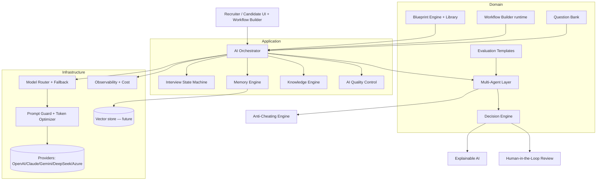

# 51 — AI Interview Engine (Enterprise AI Interview Platform)

**Binding architecture spec.** The goal is NOT "ChatGPT in a page" and NOT "an ATS
with an AI button" — it is an **Enterprise AI Interview Platform** that *thinks,
remembers, analyzes, evaluates, explains its decisions, resists cheating, and keeps
running even when a provider fails.* This document is the authoritative capture of
the AI Interview Engine Bible. Per [49-Development-Workflow](49-Development-Workflow.md)
DW-13 (Architecture Protection) it is written **before** any code; implementation
follows the phased roadmap below, each phase passing the 16-stage lifecycle and the
[50-Continuous-Project-Audit](50-Continuous-Project-Audit.md) gate.

## Related Documents

- [16-AI-Architecture](16-AI-Architecture.md) · [17-AI-Providers](17-AI-Providers.md) · [18-AI-Interview-Engine](18-AI-Interview-Engine.md) · [23-Interview-Workflow](23-Interview-Workflow.md) — extended (not replaced) by this spec
- [47-Enterprise-Architecture-Standards](47-Enterprise-Architecture-Standards.md) (layers, DI, contracts, swappable seams) · [48-Multi-Tenant-RBAC-Bible](48-Multi-Tenant-RBAC-Bible.md) (isolation + RBAC) · [49-Development-Workflow](49-Development-Workflow.md) · [50-Continuous-Project-Audit](50-Continuous-Project-Audit.md)
- DB blueprint: [database/08-Applications-Interviews](database/08-Applications-Interviews.md) (D7) + [database/09-AI-Notifications](database/09-AI-Notifications.md) (D8) — the plumbing this engine builds on; the new tables here are the **D11 blueprint extension** (§Data model).
- [34-Security](34-Security.md) · [35-Performance](35-Performance.md) · [38-Audit-System](38-Audit-System.md)

## Purpose (الهدف)

Give every tenant an interviewer that is consistent, explainable, multilingual,
cheating-resistant and resilient — configurable per company without code, and sold
as an enterprise product that evolves for years without a rewrite.

## Golden Rule

The platform must **think, remember, analyze, evaluate, explain, resist cheating,
and survive provider failure.** No subsystem may be a thin wrapper over a single
model call. Per-tenant AI keys only (the platform stores none) — every model call
uses the workspace's own encrypted credentials (`tenant_ai_keys`).

## Architecture (component catalogue)

Layered per [47](47-Enterprise-Architecture-Standards.md): Presentation (recruiter
& candidate UIs, Workflow Builder) → Application (Orchestrator, State Machine,
services) → Domain (agents, decision, evaluation, blueprints) → Infrastructure
(providers, memory store, vector store, observability). Every box is an interface
with a swappable implementation and a per-tenant **feature flag**.

### 1. AI Orchestrator (the brain)
Central coordinator. Owns: agent selection, provider/model selection (via Model
Router), workflow execution, memory load/save, cost budgeting, retries, timeouts.
Every interview turn flows through the Orchestrator; nothing calls a provider
directly. Contract: `Orchestrator::handleTurn(InterviewContext): TurnResult`.

### 2. Multi-Agent Layer (single-responsibility agents)
Nine specialist agents, each owning ONE concern and emitting a structured partial
assessment (never a final hire/reject): **HR, Technical, Behavior, Psychometric,
Communication, Language, Culture-Fit, Risk Analysis**, and the **Decision Agent**
which aggregates. Each agent: `AgentInterface::assess(AgentInput): AgentResult`
(score 0–100 + evidence + confidence). Agents run in parallel where independent;
the Orchestrator fans out and the **Decision Engine** combines.

### 3. Decision Engine
Independent of any single agent/model. Merges the agents' results using the
interview's **Evaluation Template** weights → a final recommendation
(hire/reject/hold) with per-dimension breakdown, confidence, and the evidence trail.
Output is a `decision_records` row, always reviewable/overridable by a human.

### 4. Memory Engine (AI Memory Layer)
A standalone memory layer — NOT the raw chat history. After every Q&A it persists:
question summary, answer summary, skills covered, weak/strong skills, detected
contradictions, confidence trend, risk flags, topics discussed, topics not covered,
and the interview timeline. The next question is built from this memory, not by
resending the whole conversation. **Memory optimization:** each request sends
`current context + memory summary + recent messages only` (bounded window) to cut
latency, tokens and cost.

### 5. Interview State Machine (top priority)
The interview is a **state machine**, not a message chain. States:
`Draft → Scheduled → Waiting → Identity Verification → Camera & Mic Check →
Environment Check → Introduction → Ice Breaking → CV Review → Experience Discussion
→ Technical Assessment → Behavioral Assessment → Scenario Questions → Problem
Solving → Culture Fit → Candidate Questions → Final Evaluation → AI Review →
Human Review → Completed → Archived`. Each state declares **entry rules, exit
rules, validation rules, allowed actions, timeout rules, recovery rules**; illegal
transitions are rejected. This makes pause/resume/recover trivial and is the
backbone of the whole flow. (Implemented via `interviews.state` +
`interview_state_transitions`, validated by a `StateMachine` service; transitions
also recorded in the polymorphic `status_histories`.)

### 6. Blueprint Engine + Blueprint Library (top priority area)
Interviews are driven by a **Blueprint** (ordered Sections with Objectives,
Evaluation Criteria, Question Strategy, Difficulty Levels, Scoring Rules, Follow-up
Rules, Expected Skills/Behaviors) — never a static question list. A seeded
**Library** ships role blueprints (Junior/Senior Backend, Frontend, DevOps, AI
Engineer, HR, Sales, BizDev, Marketing, PM, Customer Support, Finance, Legal,
Healthcare, Education, Hospitality, Engineering, Executive, Internship, Graduate,
Call Center). Each tenant can clone & edit a blueprint.

### 7. Dynamic Interview Flow + Follow-up Intelligence
Section order is NOT fixed — the Orchestrator may reorder by candidate level,
answers, time remaining, company rules, and progress. After each answer it makes a
deliberate decision (never random): ask a follow-up · move on · skip · re-explain ·
ask for an example/project/details. This decision is itself a model call governed by
the blueprint's Follow-up Rules and recorded for explainability.

### 8. Workflow Builder (visual, competitive differentiator — top priority)
A drag-and-drop builder so a company designs interview logic with **no prompts and
no code**. Nodes: `Start · Ask Question · Generate Question · Wait Answer · Evaluate
Answer · AI Analysis · If/Else (conditions, e.g. score < 60) · Generate Follow-up ·
Score Candidate · Generate Report · Human Approval · Finish`. Any node connects to
any node; unlimited workflows. Stored as `interview_workflows` + `workflow_nodes` +
`workflow_edges` (a directed graph); executed by a `WorkflowRuntime` the Orchestrator
drives. Versioned (see §Versioning).

### 9. Evaluation Templates (top priority)
Reusable scoring templates (rules, weights, skills, soft skills, behavior,
communication, experience, technical depth, leadership, problem-solving) — seeded
per role family (Junior/Senior Backend, Sales, Customer Support, Marketing, …) and
tenant-editable. The Decision Engine consumes the active template's weights.

### 10. Question Bank Engine
Professional bank with categories, tags, difficulty, languages, job families,
departments, follow-up questions, reference answers, expected skills. The system
**mixes** static questions + AI-generated questions + company questions — it does
not rely on AI alone.

### 11. Knowledge Engine (per-interview knowledge layer)
Before each interview, auto-loads the Job Description, Company Info, Evaluation
Criteria, Required Skills, Blueprint, Scoring Rules, Policies, and Hiring Workflow
into a knowledge context the agents read — the AI is grounded in tenant data, not
only the prompt. Future-ready for RAG over a vector store.

### 12. Model Routing + Provider Abstraction + Fallback
`AiProvider` is an interface; OpenAI/Claude/Gemini/DeepSeek/Azure are
implementations selected per call by the **Model Router** on cost, latency, quality,
language, and company preference. If a provider fails, the **Fallback Engine**
transparently switches to the next available provider — the interview never stops.
All calls use the tenant's `tenant_ai_keys`.

### 13. Prompt-Injection Protection + Token Optimizer + Prompt Versioning
Every outbound prompt passes a **Prompt Guard**: detect/neutralize prompt
injection, instruction-override, sensitive-data leakage, hidden prompts, role
escaping; then sanitize. A **Token Optimizer** strips duplicate context, repeated
instructions, repeated history and unused data before sending. Prompts are
**versioned** (`prompt_templates` + `prompt_versions`) with compare/rollback.

### 14. AI Quality Control (post-response gate)
After every model response, validate before returning to the user: hallucination,
empty answer, repeated question, repeated feedback, wrong language, wrong context,
missing evaluation — and self-correct (retry/repair) before the user ever sees it.

### 15. Explainable AI
Every AI decision carries an explanation, not just a score: overall score + the
reason, the evidence from the candidate's answers, examples, strengths, weaknesses,
why-hire / why-reject, and a confidence level. Stored alongside `decision_records`.

### 16. Anti-Cheating Engine
Analyzes signals: copy/paste, very long pauses, repeated generic answers,
AI-generated patterns, prompt-injection attempts, browser/tab switching, window
blur, multiple faces, voice changes, suspicious similarity. **Nothing is treated as
proof** — it produces a **Cheating Confidence Score + reasons** for human review
(`cheating_signals` + `cheating_scores`).

### 17. Observability + Dashboard + Cost Optimizer
Records per call: model, provider, latency, tokens, prompt/completion size, retries,
fallbacks, errors, estimated vs actual cost, memory usage, response quality (extends
D8 `ai_requests`/`ai_usage`/`ai_costs`/`ai_logs` with `ai_traces`). A dedicated AI
**Observability Dashboard** surfaces requests/providers/latency/cost/success/failure/
fallbacks/retries/sizes/averages. The **Cost Optimizer** pre-computes expected cost
per interview and picks the cheapest provider/model/prompt strategy that meets the
quality bar.

### 18. Human-in-the-Loop / Human Review Mode
A recruiter can review every question, answer, decision, analysis, score and
recommendation, and **edit the final decision** — with the reason for the change
recorded. No decision is AI-only.

### 19. Versioning, Sandbox, Simulation, Benchmark
- **Versioning:** every Blueprint, Prompt and Evaluation Template keeps all prior
  versions with compare / rollback / restore / audit history.
- **Sandbox:** a tenant test environment to try prompts/workflows/evaluation/scoring
  without touching real data.
- **Simulation Mode:** run mock interviews with dummy candidates / fake CVs /
  generated answers to validate the whole pipeline before going live.
- **Benchmark Engine:** compare GPT/Claude/Gemini/DeepSeek/Azure on accuracy,
  latency, cost, reasoning, language and interview quality; recommend the best model
  per interview type.

### 20. AI Feature Flags
Every AI capability toggles per workspace without code: Memory Engine, Cheating
Detection, Voice/Video Analysis, Multi-Agent, Explainable AI, Knowledge Engine,
Prompt Optimizer, Workflow Builder (via the existing settings/feature-flag layer,
[47](47-Enterprise-Architecture-Standards.md) EAS-9).

### 21. Learning Engine + Future-Ready (no rewrite)
The architecture leaves seams for: Feedback Loop, Model Evaluation, A/B Testing,
Prompt Optimization, Auto Prompt Versioning, Fine-tuned models; and integrations:
RAG, Vector DB, Knowledge Base, live-coding/pair-programming/whiteboard interviews,
screen sharing, AI-avatar interviews, voice cloning, real-time translation, emotion
detection, skill benchmarking, ATS/HRIS/Calendar/Video-conference integrations —
all addable without redesigning the architecture.

## Workflow (one interview turn)

1. State Machine confirms the current state allows a turn (entry/validation rules).
2. Knowledge Engine + Memory Engine assemble the bounded context.
3. Orchestrator resolves the active Blueprint/Workflow node and selects agent(s).
4. Model Router picks provider/model (Cost Optimizer + company preference); Prompt
   Guard + Token Optimizer prepare the prompt with tenant keys.
5. Provider call (with retries/timeouts; Fallback on failure).
6. AI Quality Control validates/repairs the response.
7. Follow-up Intelligence decides the next move; Memory Engine updates.
8. Agents assess → Decision Engine (on evaluation) → Explainable record.
9. Anti-Cheating updates the confidence score from collected signals.
10. Observability logs the full trace + cost; State Machine transitions.

## Data model (D11 blueprint extension — P1 & P2 realized; remainder pending ERD approval)

Builds on D7 (`interviews`, `interview_sessions`, `interview_messages`,
`interview_questions`, `interview_answers`, `interview_scores`,
`interview_ai_analyses`, `interview_participants`, …) and D8 (`ai_providers`,
`ai_models`, `tenant_ai_keys`, `ai_requests`/`ai_responses`/`ai_usage`/`ai_costs`/
`ai_logs`/`ai_errors`/`ai_cache`). New tables (all tenant-scoped via `workspace_id`,
uuid + timestamps, config-driven statuses, **no ENUMs**; per the
[Database Bible](database/00-Database-Bible.md), migrated only after ERD sign-off):

- **State machine — ✅ REALIZED (migration 0033, P1):** `interview_states` (catalog:
  key/label/order/initial/terminal/timeout/color; system rows + per-tenant
  overrides), `interview_state_transitions` (append-only per-interview audit).
  `interviews` gained `state_id`. Engine: `App\Services\Interview\StateMachine`.
- **Blueprints:** `interview_blueprints`, `blueprint_sections`,
  `blueprint_section_rules`; `blueprint_versions`.
- **Workflows (builder) — ✅ REALIZED (migration 0035, P3):** `interview_workflows`,
  `workflow_nodes` (typed via the `workflow_node_type` lookup), `workflow_edges`
  (with branch `condition` JSON), `workflow_versions` (immutable snapshot),
  `workflow_runs` + `workflow_run_steps` (the per-interview execution trace; steps
  reference nodes by `node_key` against the frozen snapshot). Engines:
  `App\Services\Workflow\WorkflowBuilder` (validate/create/publish) +
  `WorkflowRuntime` (start/resume step machine). Run/step statuses are seeded
  `workflow_run_status`/`workflow_step_status` lookups.
- **Evaluation — ✅ REALIZED (migration 0034, P2):** the evaluation template IS the
  existing D9 configurable scorecard, REUSED to avoid a parallel system (anti-
  duplication, docs/50): `evaluation_forms` = the weighted, thresholded rubric;
  `evaluation_form_fields` = its weighted criteria. New: `evaluation_form_versions`
  (immutable published snapshot scored against), `decision_records` (the Decision
  Engine's aggregated, explainable output — distinct from `application_decisions`,
  which audits pipeline moves) and `decision_factors` (per-criterion breakdown).
  Engines: `App\Services\Evaluation\EvaluationTemplate` + `DecisionEngine`; starter
  rubrics in `config/evaluation_templates.php`. (Supersedes the originally-planned
  `evaluation_templates`/`evaluation_template_criteria` tables.)
- **Question bank:** `question_bank`, `question_tags`, `question_taggables`,
  `question_reference_answers`, `question_follow_ups`.
- **Agents:** `ai_agents` (registry/config per type), `agent_runs` (per-turn results).
- **Memory:** `interview_memory` (summaries/skills/contradictions/timeline as JSON,
  bounded), `interview_memory_items`.
- **Anti-cheating:** `cheating_signals`, `cheating_scores`.
- **Prompts/observability:** `prompt_templates`, `prompt_versions`, `ai_traces`
  (extends `ai_requests`), `ai_benchmarks`, `ai_benchmark_results`.
- **Knowledge:** `interview_knowledge_sources` (links JD/company/criteria/policies).
- **Sandbox/Simulation:** a `sandbox` boolean/scope on blueprints/workflows/runs so
  test data never mixes with production.

(High-volume append tables — `agent_runs`, `ai_traces`, `interview_memory_items`,
`cheating_signals` — are FK-light + partition-ready per the Bible §7.)

## Multi-tenancy, RBAC & API impact (DW-13 review)

- **Tenant isolation:** every new table carries `workspace_id` and is fail-closed
  scoped ([48](48-Multi-Tenant-RBAC-Bible.md)); AI keys are per-tenant only.
- **RBAC:** new permissions under existing/added modules — e.g. `ai.manage` (keys),
  `interviews.conduct`, `interviews.review`, `blueprints.manage`,
  `workflows.manage`, `evaluations.manage`, `questionbank.manage`,
  `ai.observability`. Added to `config/rbac.php` + `system_modules` as features ship.
- **API:** interview turn, workflow execution, review, and observability endpoints
  follow [29-API-Architecture](29-API-Architecture.md) (auth, authz, validation,
  errors, pagination/filter/sort).

## Security

Prompt-Injection Protection (§13) is mandatory on every outbound prompt; candidate
input is untrusted. Anti-cheating signals are advisory, never proof. AI keys stay
encrypted (AES-256-GCM) and per-tenant. All model I/O is audited. No candidate PII
leaves the tenant boundary; provider calls use only the tenant's own keys.

## Performance & Cost

Memory + Token Optimizer keep each request to `context + summary + recent` (bounded)
to cap latency/tokens/cost; Cost Optimizer chooses the cheapest viable provider;
high-volume traces are partition-ready; the Observability Dashboard tracks
average interview cost and response time. Fallback keeps availability up.

## Phased implementation roadmap

Each phase = one 16-stage feature cycle ([49](49-Development-Workflow.md)) + an audit
gate ([50](50-Continuous-Project-Audit.md)). **Top-3 first** (the highest-value,
explicitly prioritized): State Machine, Evaluation Templates, Workflow Builder.

1. **P1 — Interview State Machine** + `interviews.state_id`, transitions,
   pause/resume/recover. (Backbone.) — ✅ **DONE** (migration 0033, `StateMachine`,
   11 tests).
2. **P2 — Evaluation Templates** (role-family starter rubrics + tenant editing +
   immutable versioning) and the Decision Engine that consumes weights into an
   explainable decision. — ✅ **DONE** (migration 0034, `EvaluationTemplate` +
   `DecisionEngine`, 16 tests).
3. **P3 — Workflow Builder** (graph model + runtime + a minimal visual editor). — ✅
   **DONE** (migration 0035, `WorkflowBuilder` + `WorkflowRuntime` step machine, 12
   tests; deterministic execution with zero model calls). Visual editor UI pending a
   later UI phase.
4. **P4 — Provider abstraction + Model Router + Fallback + Prompt Guard + Token
   Optimizer** (the safe model-call core; needs tenant keys). — ✅ **CORE DONE**
   (`AiProvider` contract, `PromptGuard`, `TokenOptimizer`, `ModelRouter`,
   `AiGateway` guard→optimize→route→fallback→audit, `FakeProvider` sandbox; 16
   tests, all offline). Live HTTP provider adapters (OpenAI/Claude/…) plug into the
   registry and are wired when a workspace has added its own keys — they require
   live keys + network to verify and so are an integration step, not part of the
   tested core.
5. **P5 — Orchestrator + Memory Engine + Knowledge Engine + Quality Control.** — ✅
   **DONE** (migration 0040, `Orchestrator`/`MemoryEngine`/`KnowledgeEngine`/
   `QualityControl`, 14 tests; bounded context; all model calls via the AiGateway).
6. **P6 — Multi-Agent layer + Explainable AI** wired to the Decision Engine. — ✅
   **DONE** (migration 0041, 9 agents + `AgentRunner` reusing `DecisionEngine` for
   explainable per-agent factors, 9 tests).
7. **P7 — Question Bank + Blueprint Library** seeding. — ✅ **DONE** (migrations 0036
   Blueprint Library + 21 role blueprints, 0037 Question Bank, 15 tests).
8. **P8 — Anti-Cheating Engine.** — ✅ **DONE** (migration 0042, `CheatingDetector`,
   confidence score + band only — never proof, 7 tests).
9. **P9 — Observability Dashboard + Cost Optimizer + Benchmark + Sandbox/Simulation.**
   — ✅ **DONE** (migration 0043, `AiObservability`/`CostOptimizer`/`BenchmarkEngine`/
   `SimulationMode`, 8 tests). The dashboard UI is a later UI phase; the metrics layer
   is built.
10. **P10 — Learning Engine + future integrations (RAG/vector/avatars/…).** — ✅
    **DONE (engine + Human-in-the-Loop + AI Feature Flags)** (migration 0044,
    `HumanReview`/`LearningEngine`/`AiFeatures`, 8 tests). RAG/vector/avatar/live-coding
    integrations are future seams (the Plugin SDK + provider/contract abstractions make
    them additive — no Architecture rewrite).

**Also realized (extensibility foundation):** the **Workflow Automation Engine**
(Zapier/n8n-style triggers→conditions→actions, versioning/rollback, execution logs)
and the **Plugin SDK** (registry + lifecycle + capability-gateway sandbox,
marketplace-ready) — so future features (assessments, integrations, background checks)
are added as plugins/automations without touching core.

Phases 1–3 deliver tenant-configurable interview logic **without any model call**
(pure platform value, testable end-to-end). Live model execution begins at P4 and
requires a workspace to have added its own AI provider keys.

## Configuration-driven & Feature flags

No hard-coded blueprints, templates, questions, agent sets, model choices or
statuses — all are data, per-tenant editable, behind feature flags (§20). Adding a
role blueprint, an evaluation template or a workflow is a data change, never a code
change.

## Open Questions

- Real-time media (camera/mic/face/voice) needs a streaming/WebRTC layer — likely a
  separate service; this spec covers the orchestration/scoring side and leaves the
  media-capture transport as a future integration seam.
- Vector store choice (for RAG/Knowledge) is deferred to P10; the Knowledge Engine
  interface is defined now so it can slot in without redesign.
