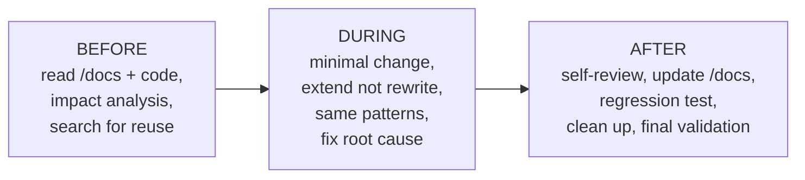

# 54 — Continuous Development Protocol (بروتوكول التطوير المستمر)

**Binding & standing.** These rules apply to **every** change from now on — before,
during and after — not to a single phase. The goal is to grow the system *better*,
never just *bigger*: every edit must raise quality, stability and maintainability
without adding complexity. This is the one-page contract; the detailed mechanics live
in the two governance bibles it sits on top of.

## Related Documents
- [49 — Development Workflow](49-Development-Workflow.md) — the 16-stage per-feature lifecycle, Definition of Done, stop conditions (the *how* of a change).
- [50 — Continuous Project Audit](50-Continuous-Project-Audit.md) — the after-every-phase whole-project audit + fix gate.
- [47 — Enterprise Architecture Standards](47-Enterprise-Architecture-Standards.md), [00 — README](00-README.md) (documentation-first rule).

## Purpose (الهدف)
Define the non-negotiable habits that gate **any** modification to HalaOps so the
codebase stays coherent, regression-free and maintainable as it evolves. It exists to
prevent the two failure modes that kill long-lived systems: silent breakage of working
features, and unnecessary rewrites that inflate complexity.

## Why It Exists (سبب وجوده)
HalaOps is large, multi-tenant and already in a Release-Candidate state. At this size,
the risk is no longer "can we build it?" but "can we change it without breaking it?".
A standing protocol — read first, change minimally, extend don't rewrite, document and
test every time — keeps velocity high *and* the system stable, and stops drift between
code and the `/docs` single source of truth.

## Architecture — the three gates around every change

1. **Before** — understand the blast radius and whether the capability already exists.
2. **During** — make the smallest correct change in the existing style.
3. **After** — prove nothing broke, the docs match reality, and no residue is left.

## Workflow
1. **Read before modify.** Review the relevant `/docs`, the related code, relationships, routes, permissions, services and DB schema. Determine the impact *before* writing code.
2. **Impact analysis.** Name the files, tables, views, services and APIs that will change; choose the smallest edit that satisfies the requirement.
3. **Reuse check.** Search for an existing service/component/function that already does the job; reuse it instead of writing a parallel one.
4. **Change.** Implement the minimal change in the existing architecture, naming, folders, patterns, Design System and coding style.
5. **Document.** If behaviour changed, update `/docs` in the *same* change — never defer.
6. **Self-review** code, UI, API, DB, permissions, docs.
7. **Regression test** the new part *and* everything related; confirm no prior feature broke.
8. **Clean up & final-validate** (see Business Rules) before declaring the task done.

## Business Rules
1. **BR-CDP-1 — Read before modify.** No code is written before the docs/code/impact review is done.
2. **BR-CDP-2 — Minimal change.** If a small edit suffices, do not rewrite a module, rename files/tables, or change APIs/architecture.
3. **BR-CDP-3 — Extend, don't rewrite.** Working code is built upon, not replaced — unless it has a real defect that blocks progress.
4. **BR-CDP-4 — No duplication.** Reuse existing services/components/functions; never add a second thing that does the same job.
5. **BR-CDP-5 — Document first.** Behaviour changes update `/docs` immediately (the [00-README](00-README.md) doc-first rule).
6. **BR-CDP-6 — Regression always.** Every change runs the new + related tests; a green suite is part of "done", not optional.
7. **BR-CDP-7 — No dead code.** No TODO/FIXME, unused files/imports/variables, commented-out or experimental code is left behind.
8. **BR-CDP-8 — Consistency.** Reuse the established architecture, naming, folders, patterns, Design System and style; do not introduce a new idiom.
9. **BR-CDP-9 — Root-cause fixes.** Diagnose the real cause of a problem and fix it; never work around it.
10. **BR-CDP-10 — Keep the project clean.** After each phase, remove unused code/files/dependencies and stale docs.
11. **BR-CDP-11 — Final validation.** A task ends only when code works, tests pass, pages work, docs are current, and there are no known bugs.
12. **BR-CDP-12 — Golden rule.** Every change must increase quality, stability and maintainability without increasing complexity. Make it better, not bigger.

## Database Relations
None. This is a process protocol and owns no tables. Changes it governs may touch the
schema — in which case [49 §DB rules](49-Development-Workflow.md) and the Database Bible
apply (additive, idempotent, guarded migrations; no destructive renames).

## Permissions
None of its own. It mandates that every change *preserve* the permission model: each
new action is permission-gated, and route↔config↔catalogue parity is kept
(`tests/Feature/RbacRoutePermissionTest`).

## Validation
The "final validation" checklist (BR-CDP-11) is the gate: `php tests/run.php` green,
all touched pages render, `/docs` updated, lint clean, no known bugs. For UI changes a
real-browser pass (no console/network errors, responsive, dark mode) is part of it.

## Edge Cases
| Case | Handling |
|---|---|
| A real defect blocks extension | Refactor is allowed (BR-CDP-3), but minimally and behind green tests. |
| Change spans many modules | Do the impact analysis first; split into the smallest safe steps. |
| Existing helper *almost* fits | Extend the helper, don't fork a near-duplicate (BR-CDP-4). |
| Docs and code disagree | Treat as a bug: fix code or docs so they match before finishing (BR-CDP-5). |

## Security
Every change keeps the security posture from [34-Security](34-Security.md): tenant
isolation fail-closed, permission gates, escaping/CSRF, nonce-CSP, no secrets in code,
no sensitive data in logs. A change that could expose data or widen access is treated
as unsafe until proven otherwise.

## Performance
Every change respects [35-Performance](35-Performance.md): no N+1, indexed hot paths,
bounded/paginated lists, no unnecessary work. A change that slows the system is a
regression to fix before moving on.

## Testing
This protocol is enforced by the existing suite (`php tests/run.php`) plus the
regression habit: the standing tests (route/permission parity, tenant isolation,
hardening, performance, component, acceptance journey, production readiness) must stay
green after every change. New behaviour ships with new tests.

## Future Expansion
- A pre-commit/CI hook that runs lint + the suite automatically on every change.
- A lightweight "impact analysis" note appended to non-trivial PRs/commits.

## Open Questions
None. This protocol is in force for all subsequent work.
