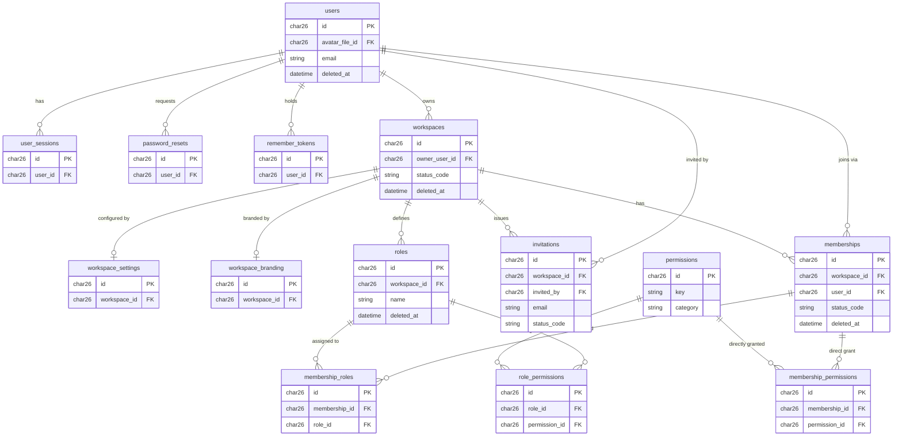
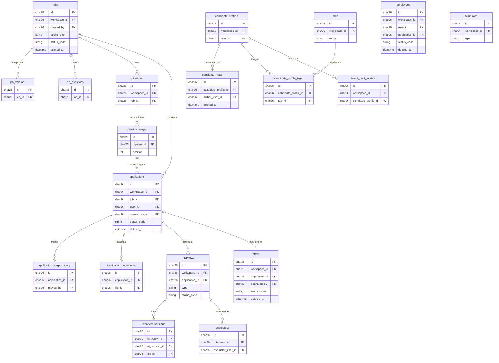
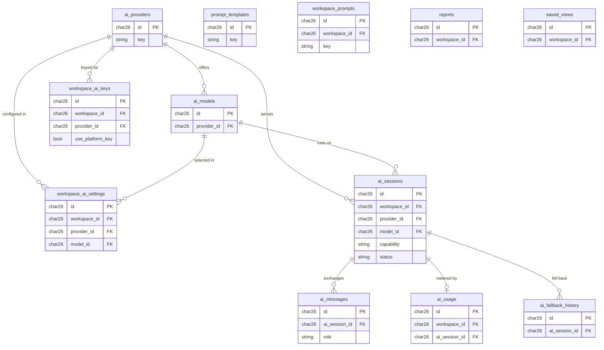
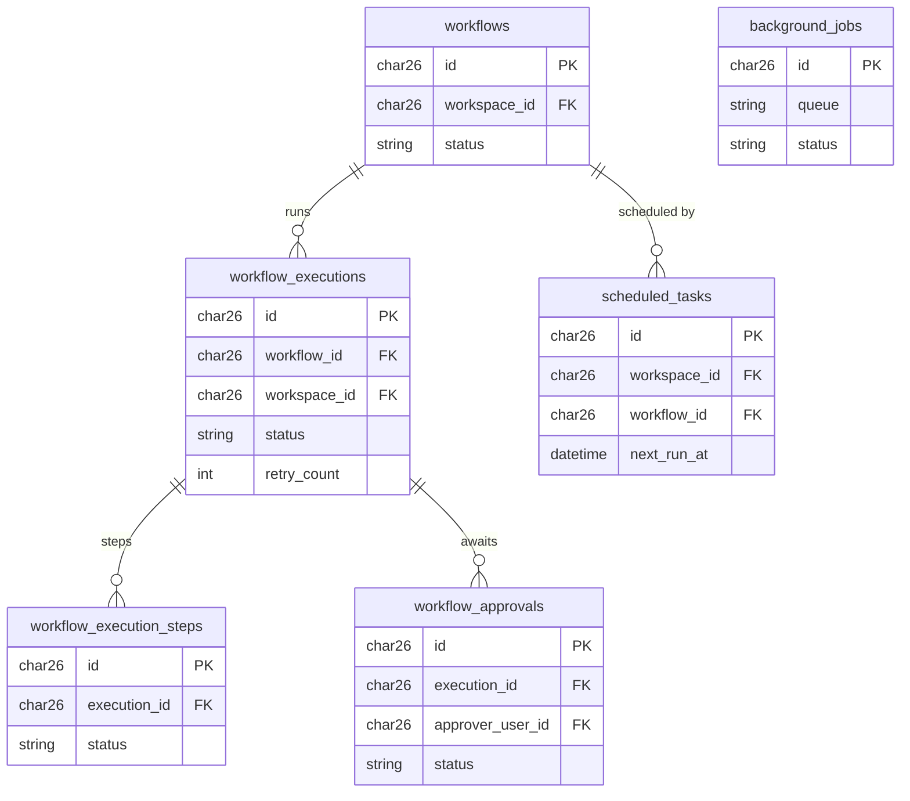
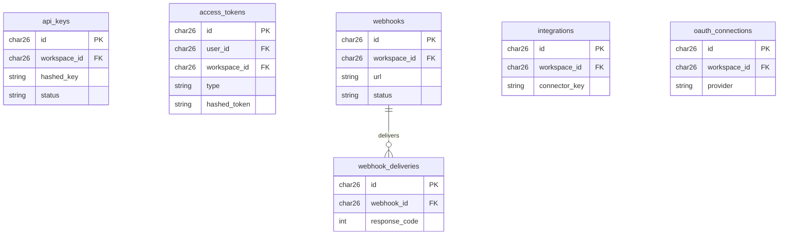
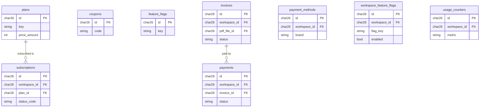
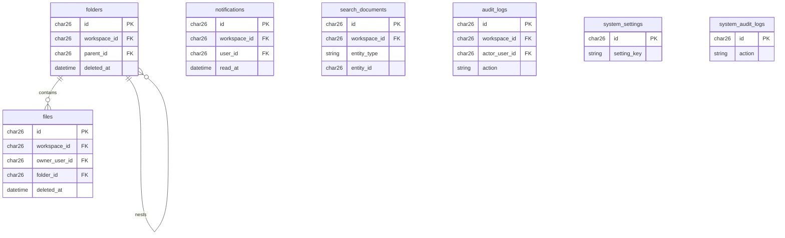
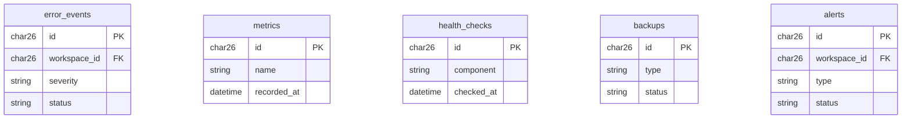

# ER DIAGRAM — HaHireAI

> **Status:** Adopted (Phase 3) · **Version:** 1.0.0 · **Last updated:** 2026-06-27
> **Defers to:** `ENTITY_CATALOG.md`. **Cardinalities:** `RELATIONSHIP_MATRIX.md`.

---

## 1. How to read this document

This is the **visual entity-relationship reference** for the HaHireAI schema. It
renders the entities defined in `ENTITY_CATALOG.md` as Mermaid `erDiagram` blocks,
grouped by domain so each sub-diagram stays legible. It is a *map*, not a source
of truth: where this file and `ENTITY_CATALOG.md` ever disagree, the **catalog
wins**, and precise cardinalities/optionality live in `RELATIONSHIP_MATRIX.md`.

**Reading the diagrams:**

- **Primary keys** — every table has a ULID `id CHAR(26)` (`DATABASE_GUIDE.md` §3).
  Marked `PK` in the diagrams. IDs are app-generated; no `AUTO_INCREMENT`.
- **Foreign keys** — `<entity>_id CHAR(26)`, marked `FK`. Only the key/identifying
  columns are shown per entity; full column lists live in `DATABASE_ARCHITECTURE.md`.
- **Tenancy** — a `workspace_id FK` column means the table is **Workspace-scoped**
  (tenant data, `NOT NULL`, tenant-guarded). Tables **without** `workspace_id` are
  **Global** (platform-wide). See `ENTITY_CATALOG.md` §2 and §4 below.
- **Crow's-foot cardinality** — `||--o{` = one-to-many (zero-or-more children);
  `||--o|` = one-to-(zero-or-)one; `||--||` = one-to-one mandatory. The `||` end is
  the "one"/parent side; the `o{` / `o|` end is the "many"/optional-child side.
- **Pivots** — join tables (e.g. `role_permissions`) appear as entities between
  their two parents, each parent `||--o{` the pivot.

The two anchors of the whole model are **`workspaces`** (the tenant hub — almost
everything hangs off it) and **`users`** (the identity hub — the single human
account). See §3 (the spine) for how they tie the domains together.

---

## 2. Domain sub-diagrams

Each block below covers one domain from `ENTITY_CATALOG.md`. Cross-domain links to
`workspaces` and `users` are summarized in §3 to avoid repeating them everywhere.

### 2.1 Identity & Access

Global: `users`, `user_sessions`, `password_resets`, `remember_tokens`,
`workspaces`, `permissions`. Workspace-scoped: everything else here.

A `membership` is unique per `(workspace_id, user_id)`. Authorization is composed
from `membership_roles` → `role_permissions` plus optional direct
`membership_permissions`. Roles are **data, not code** (`DOMAIN_MODEL.md` §6).

### 2.2 Recruitment

All workspace-scoped. `applications` is the candidacy root binding `user` + `job`
+ `workspace`; `candidate_profiles` is the per-`(user, workspace)` projection.

Cross-domain (drawn in §3): `users ||--o{ applications` (the candidate),
`candidate_profiles` per `(user, workspace)`, `application_documents.file_id` →
`files`, `interview_sessions.ai_session_id` → `ai_sessions`. `applications` is
unique per `(workspace_id, job_id, user_id)` — one candidacy per user+job
(`DOMAIN_MODEL.md` Invariant 4).

### 2.3 AI / Intelligence

Global catalog: `ai_providers`, `ai_models`, `prompt_templates`. Everything else
is workspace-scoped configuration and runtime.

Cross-domain (drawn in §3): every workspace-scoped table above hangs off
`workspaces`; `interview_sessions.ai_session_id` → `ai_sessions` ties AI runtime
to recruitment. `ai_usage` and `ai_fallback_history` are immutable (append-only).

### 2.4 Process / Workflow

Workspace-scoped except `background_jobs` (global infra queue).

Cross-domain (drawn in §3): `workflows`, `workflow_executions`, `scheduled_tasks`
→ `workspaces`; `workflow_approvals.approver_user_id` → `users`. `background_jobs`
is a **global** runtime queue with no `workspace_id`.

### 2.5 Integration

Mostly workspace-scoped; `access_tokens` may be workspace **or** global
(PAT/workspace/system tokens — `ENTITY_CATALOG.md` §8).

Cross-domain (drawn in §3): `api_keys`, `webhooks`, `integrations`,
`oauth_connections` → `workspaces`; `access_tokens` optionally → `users` and/or
`workspaces` (nullable both, by token type). `webhook_deliveries` is immutable.

### 2.6 Commerce

Global catalog: `plans`, `coupons`, `feature_flags`. Workspace-scoped: the rest.

Cross-domain (drawn in §3): `subscriptions`, `invoices`, `payments`,
`payment_methods`, `workspace_feature_flags`, `usage_counters` → `workspaces`.
One **active** `subscription` per workspace (`STATE_DIAGRAMS.md` §9). `payments`
is immutable. `invoices.pdf_file_id` → `files`.

### 2.7 Platform Services

Shared cross-cutting tables. Workspace-scoped except `system_settings` and
`system_audit_logs` (global).

Cross-domain (drawn in §3): `folders`, `files`, `notifications`,
`search_documents`, `audit_logs` → `workspaces`; `files.owner_user_id`,
`notifications.user_id`, `audit_logs.actor_user_id` → `users`. `files` is the
shared blob store referenced by `application_documents`, `interview_sessions`,
`invoices`, and `users.avatar_file_id`. `audit_logs` and `system_audit_logs` are
immutable.

### 2.8 Operations (Observability)

Mostly global; `error_events` and `alerts` carry a **nullable** `workspace_id`
(global + workspace).

`metrics`, `health_checks` are immutable. `error_events` and `alerts` are dual-scope:
`workspace_id` is nullable, so a row is either platform-level (NULL) or scoped to a
tenant. `metrics`, `health_checks`, `backups` are purely global infra.

---

## 3. The spine — `workspaces` (tenant hub) and `users` (identity hub)

Two entities tie the whole schema together. **`workspaces`** is the tenant hub:
every workspace-scoped table carries `workspace_id` → `workspaces.id`. **`users`**
is the identity hub: the single human account that participates in workspaces
through memberships, applications, employment, and ownership of artifacts.

The diagram below shows only the *representative* links from each hub (one per
domain) so the spine stays readable; the full set is each domain's `workspace_id`
FK from §2 plus every `user_id` FK noted there.

```mermaid
erDiagram
    users {
        char26 id PK
        string email
    }
    workspaces {
        char26 id PK
        char26 owner_user_id FK
    }
    memberships {
        char26 id PK
        char26 workspace_id FK
        char26 user_id FK
    }
    applications {
        char26 id PK
        char26 workspace_id FK
        char26 job_id FK
        char26 user_id FK
    }
    candidate_profiles {
        char26 id PK
        char26 workspace_id FK
        char26 user_id FK
    }
    jobs {
        char26 id PK
        char26 workspace_id FK
        char26 created_by FK
    }
    employees {
        char26 id PK
        char26 workspace_id FK
        char26 user_id FK
    }
    files {
        char26 id PK
        char26 workspace_id FK
        char26 owner_user_id FK
    }
    ai_sessions {
        char26 id PK
        char26 workspace_id FK
    }
    subscriptions {
        char26 id PK
        char26 workspace_id FK
        char26 plan_id FK
    }
    workflows {
        char26 id PK
        char26 workspace_id FK
    }
    audit_logs {
        char26 id PK
        char26 workspace_id FK
        char26 actor_user_id FK
    }

    users ||--o{ workspaces : "owns"
    users ||--o{ memberships : "member via"
    users ||--o{ applications : "applies as candidate"
    users ||--o{ candidate_profiles : "projected as"
    users ||--o{ jobs : "creates"
    users ||--o{ employees : "employed as"
    users ||--o{ files : "owns"
    users ||--o{ audit_logs : "acts in"

    workspaces ||--o{ memberships : "scopes"
    workspaces ||--o{ applications : "scopes"
    workspaces ||--o{ candidate_profiles : "scopes"
    workspaces ||--o{ jobs : "scopes"
    workspaces ||--o{ employees : "scopes"
    workspaces ||--o{ files : "scopes"
    workspaces ||--o{ ai_sessions : "scopes"
    workspaces ||--o{ subscriptions : "scopes"
    workspaces ||--o{ workflows : "scopes"
    workspaces ||--o{ audit_logs : "scopes"
```

**One human, many contexts.** The same `user` can be a workspace owner, a member
elsewhere, a candidate via an `application`, and an `employee` post-hire — all
projections of one identity, never duplicate accounts (`DOMAIN_MODEL.md` §7,
Invariant 1). `candidate_profiles` is the per-`(user, workspace)` view, unique on
`(workspace_id, user_id)`; there is **no global candidate table**.

---

## 4. Isolation & global anchors

**Tenant isolation (`workspace_id`).** Every entity in §2.1–§2.7 that shows a
`workspace_id FK` is **Workspace-scoped**: the column is `CHAR(26) NOT NULL`, has a
real FK to `workspaces.id`, is indexed, and leads composite indexes. Every tenant
query is filtered by the active workspace through the repository tenant guard —
non-negotiable (`DATABASE_GUIDE.md` §6). Tenant-scoped uniqueness always includes
`workspace_id` (e.g. `applications` unique on `(workspace_id, job_id, user_id)`;
`memberships` and `candidate_profiles` unique on `(workspace_id, user_id)`).

**The one tenant-root.** `workspaces` is the single row-per-tenant table — keyed by
`id`, **not** `workspace_id`. It is itself **Global** but is the parent every
workspace-scoped FK points to.

**Global anchors (no `workspace_id`).** Per `ENTITY_CATALOG.md` §2, the global
tables are:

- **Identity:** `users`, `user_sessions`, `password_resets`, `remember_tokens`,
  `workspaces` (tenant root).
- **Authorization & commerce catalogs:** `permissions`, `plans`, `coupons`,
  `feature_flags`.
- **AI catalog:** `ai_providers`, `ai_models`, `prompt_templates` (global library).
- **Platform/operations:** `system_settings`, `system_audit_logs`, `metrics`,
  `health_checks`, `backups`, `background_jobs`, plus `error_events` and `alerts`
  (which are **dual-scope** — `workspace_id` nullable).

The four primary catalogs other tenant data references are **`workspaces`**,
**`users`**, **`plans`**, **`permissions`**, plus the **`ai_providers`** registry —
the stable global anchors the rest of the model hangs off. When in doubt, a table
is workspace-scoped (`DATABASE_GUIDE.md` §6.3).

**Immutable / append-only** (neither `updated_at` nor `deleted_at`): `job_versions`,
`application_stage_history`, `ai_usage`, `ai_fallback_history`,
`workflow_execution_steps`, `payments`, `webhook_deliveries`, `audit_logs`,
`system_audit_logs`, `metrics`, `health_checks`. **Soft-delete** tables carry
`deleted_at` (e.g. `users`, `workspaces`, `memberships`, `roles`, `jobs`,
`applications`, `candidate_notes`, `offers`, `employees`, `folders`, `files`).
See `ARCHIVING_POLICY.md` and `VERSIONING_POLICY.md`.

---

### Related Documents

`ENTITY_CATALOG.md` · `DOMAIN_MODEL.md` · `DATABASE_GUIDE.md` ·
`DATABASE_ARCHITECTURE.md` · `RELATIONSHIP_MATRIX.md` · `INDEXING_GUIDE.md` ·
`STATE_DIAGRAMS.md` · `ARCHIVING_POLICY.md` · `VERSIONING_POLICY.md`
