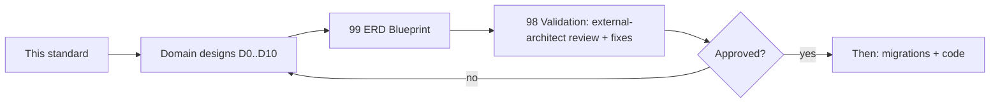

# 00 — Database Bible (Final Blueprint Standard)

The authoritative standard and index for the HalaOps database design. The
database is the foundation of the platform; **no migration or code is written
until this blueprint and its ERD are approved.**

## Related Documents

- [99-ERD-Blueprint](99-ERD-Blueprint.md) — the complete ERD (all tables, relationships, cardinality, FKs, indexes)
- [98-Validation-Report](98-Validation-Report.md) — external-architect review and fixes
- Domain designs: [D0 Lookups](01-Lookups-Reference.md) · [D1 RBAC](02-RBAC-Membership.md) · [D2 Workspaces](03-Workspaces-Settings.md) · [D3 Auth](04-Authentication.md) · [D4 Billing](05-Subscriptions-Billing.md) · [D5 Jobs](06-Jobs.md) · [D6 Candidates](07-Candidates.md) · [D7 Applications & Interviews](08-Applications-Interviews.md) · [D8 AI & Notifications](09-AI-Notifications.md) · [D9 HR & Talent](10-HR-Talent.md) · [D10 Files/Queue/Analytics/Logs](11-Files-Queue-Analytics-Logs.md)
- Up-stream specs: [../05-Database-Architecture](../05-Database-Architecture.md), [../06-ERD](../06-ERD.md), [../08-Multi-Tenant](../08-Multi-Tenant.md), [../47-Enterprise-Architecture-Standards](../47-Enterprise-Architecture-Standards.md)

## Purpose (الهدف)

To design the entire database — every table, column, relationship, cardinality,
foreign key and index — as a normalized, scale-ready, configuration-driven
schema BEFORE any table is created, and to serve as the permanent reference the
implementation migrates toward.

## Why It Exists (سبب وجوده)

A platform sold to thousands of tenants and storing billions of rows cannot
retrofit its data model. Getting the schema right first — normalization, clear
foreign keys, the right indexes, soft deletes, audit, and a configuration-driven
approach with no hard-coded values — is the cheapest possible insurance. This
document fixes those decisions so every domain design is consistent and the ERD
is a true blueprint.

## Scale Targets (design for these from day one)

| Entity | Target | Implication |
|--------|--------|-------------|
| Workspaces (tenants) | 100,000 | shard-ready by `workspace_id`; tenant scope on every row |
| Users | 10,000,000 | global `users`; lean rows; UUID public ids |
| Interviews | 100,000,000 | partition interview_messages/logs by time; narrow rows |
| AI records | billions | append-only ai_requests/responses/logs; partitioned; FK-light |

## Architecture (Design Rules)

### Base columns (every table)
`id` BIGINT UNSIGNED PK AI · `uuid` CHAR(36) UNIQUE (public id) · `created_at` ·
`updated_at` · `deleted_at` (soft-deletable only) · tenant tables carry an indexed
`workspace_id` FK → workspaces. Very-high-volume append tables may omit `uuid` for
write throughput (noted per table).

### Naming
Plural snake_case tables; snake_case columns; FK = `<singular>_id`; pivots
descriptive (`role_permissions`, `membership_roles`); status FK `<entity>_status_id`.

### Normalization
1NF/2NF/3NF, no duplicated data. Catalogs are tables referenced by FK; M:N via
pivots. No repeating groups; no transitive dependencies.

### Configuration-Driven (no hard-coded values)
Nothing — no status, type, category, or workflow — is a hard-coded ENUM.

- **Per-entity status tables** (`job_statuses`, `application_statuses`,
  `interview_statuses`, `offer_statuses`, `subscription_statuses`,
  `invoice_statuses`, `payment_statuses`): `workspace_id` NULL = system default,
  non-null = tenant custom; with `key,label,color,sort_order,is_default,
  is_initial,is_terminal,is_system`. Entities reference `<x>_status_id` FK.
- **Generic lookups** (`lookup_categories` + `lookup_values`) for simple
  configurable lists (types/categories) without workflow.
- **Workflows/pipelines** are data (`pipelines` + `pipeline_stages`).
- **Reference data** (global, seeded): `countries`, `currencies`, `languages`,
  `timezones`.

### Foreign keys
Every relationship has an FK. ON DELETE: CASCADE (owned children), SET NULL
(optional actor/parent), RESTRICT (catalogs/statuses). Extreme-volume append
tables may be FK-light for throughput (documented per table).

### Indexes (defined for every table)
PRIMARY(id); UNIQUE(uuid) + business-unique composites; an index on every FK;
hot-path composites (`workspace_id,status_id`, `workspace_id,created_at`); FULLTEXT
for free-text search; (`type`,`id`) on polymorphic tables.

### Soft delete & audit
`deleted_at` on important entities; pivots/logs/analytics/sessions are
hard/expired. Audit via polymorphic `activity_logs` (with `old_values`/
`new_values`/`device`); status changes via `status_histories`.

### Cross-cutting polymorphic tables (DRY — no per-entity copies)
One table per concern, polymorphic via (`<x>_type`,`<x>_id`): `attachments`
(file ↔ any entity), `notes`, `tags`+`taggables`, `status_histories`,
`activity_logs`, `translations`. Domain docs reference these rather than defining
job_attachments / interview_attachments / … separately. **This is a deliberate
normalization decision**: dozens of near-identical attachment/note/history
tables would duplicate structure; one indexed polymorphic table per concern is
normalized and scales, with integrity enforced at the application layer. Genuine
relational links (workspace_id, user_id, job_id, …) remain hard FKs.

## Workflow (Design → Approval → Implementation)

## Business Rules (schema-level invariants)

- **DB-1** One `users` table. No candidate/hr/admin/owner/employee tables — a
  person is a user; capability comes from RBAC + memberships.
- **DB-2** Every tenant row carries `workspace_id` (FK, indexed); no cross-tenant
  rows.
- **DB-3** Every table has `id` + `uuid`; the public surface uses `uuid`.
- **DB-4** No hard-coded status/type/category/workflow (config-driven, §above).
- **DB-5** Every relationship is a foreign key (except documented FK-light
  billions-scale append tables).
- **DB-6** Important entities are soft-deleted and audited.
- **DB-7** 1NF/2NF/3NF; catalogs + pivots, never duplicated columns.

## Database Relations (domain map)

The schema is organized into domains, each owning a disjoint set of tables (no
table is defined twice). See the inventory below and the per-domain docs.

## Permissions

Schema access is governed by the application's RBAC + tenant scoping (see
[../07-RBAC](../07-RBAC.md), [../08-Multi-Tenant](../08-Multi-Tenant.md)); the DB
itself uses one app account with least-privilege grants in production.

## Validation

This blueprint is validated by [98-Validation-Report](98-Validation-Report.md):
an external-architect pass for duplicate tables/columns, missing/wrong FKs,
missing indexes, unused tables, and performance/scale issues — fixed before any
migration.

## Edge Cases

- Tenant-custom statuses coexist with system defaults (`workspace_id` NULL vs set).
- Polymorphic associations cannot use DB FKs → integrity enforced in the app and
  by indexed (type,id) lookups.
- Billions-scale tables trade hard FKs for write throughput (documented).

## Performance

Covered per table via indexes; high-volume tables are partitioned by time and/or
sharded by `workspace_id`; heavy payloads (transcripts, AI JSON) are isolated in
LONGTEXT/JSON columns excluded from list queries.

## Testing

Schema correctness is verified by: migration dry-runs against the ERD, FK/index
presence checks, and the tenant-isolation/soft-delete tests in
[../39-Testing-Strategy](../39-Testing-Strategy.md). No migration is authored
until the ERD is approved.

## Future Expansion

Multi-language (`translations`), multi-currency (`currencies`,`plan_prices`),
multi-timezone, multi-gateway (`payment_gateways`), multi-AI
(`ai_providers`/`ai_models`), white-label/career-sites (`workspace_domains`,
`workspace_branding`), marketplace (`workspace_integrations`). New domains add their
own tables on this standard without altering existing ones.

## Table Inventory (authoritative — each table owned by exactly one domain)

> BUILT = already in migrations 0001–0016. The blueprint extends/renames some
> built tables (e.g. `activity_log`→`activity_logs`, status ENUMs → status FK
> tables, `ai_credentials`→`tenant_ai_keys`); those are migration tasks AFTER
> approval, not new duplicates.

- **D0 — Lookups/Reference/Polymorphic** ([01](01-Lookups-Reference.md)):
  lookup_categories, lookup_values, countries, currencies, languages, timezones,
  translations, attachments, notes, tags, taggables, status_histories.
- **D1 — RBAC & Membership** ([02](02-RBAC-Membership.md)): roles*, permissions*,
  permission_groups, role_permissions*, user_roles*, memberships*,
  membership_roles*, policies, policy_permissions, permission_caches,
  role_histories, permission_histories. (*BUILT, some renamed.)
- **D2 — Workspaces & Settings** ([03](03-Workspaces-Settings.md)): workspaces*,
  workspace_settings, workspace_branding, workspace_billing, workspace_ai_settings,
  workspace_storage, workspace_integrations, workspace_domains, workspace_invitations,
  global_settings, user_settings, mail_settings. (settings* BUILT.)
- **D3 — Authentication** ([04](04-Authentication.md)): sessions, remember_tokens,
  password_resets*, login_histories, devices, failed_login_attempts, mfa_methods,
  mfa_recovery_codes, personal_access_tokens.
- **D4 — Subscriptions & Billing** ([05](05-Subscriptions-Billing.md)): plans*,
  plan_features, plan_prices, subscriptions*, subscription_items,
  subscription_statuses, subscription_renewals, trials, invoices, invoice_items,
  invoice_statuses, payments, payment_statuses, transactions, payment_methods,
  payment_gateways, gateway_events, coupons, coupon_redemptions, usage_records,
  usage_limits.
- **D5 — Jobs** ([06](06-Jobs.md)): jobs, job_statuses, locations, job_locations,
  job_skills, job_languages, benefits, job_benefits, job_questions, job_criteria,
  pipelines, pipeline_stages.
- **D6 — Candidates** ([07](07-Candidates.md)): candidate_profiles, skills,
  candidate_skills, candidate_languages, experiences, educations, certificates,
  social_links, candidate_documents.
- **D7 — Applications & Interviews** ([08](08-Applications-Interviews.md)):
  applications, application_statuses, application_decisions, application_ai_results,
  interviews, interview_statuses, interview_sessions, interview_messages,
  interview_media, interview_questions, interview_answers, interview_scores,
  interview_ai_analyses, interview_tokens, interview_logs, interview_participants.
- **D8 — AI & Notifications** ([09](09-AI-Notifications.md)): ai_providers,
  ai_models, tenant_ai_keys (BUILT as ai_credentials), ai_requests, ai_responses,
  ai_usage, ai_costs, ai_logs, ai_errors, ai_cache, notifications,
  notification_templates, notification_channels, notification_preferences,
  notification_queue, notification_logs.
- **D9 — HR & Talent Pool** ([10](10-HR-Talent.md)): departments, teams,
  team_members, interview_panels, panel_members, schedules, meetings,
  evaluation_forms, evaluation_form_fields, evaluations, evaluation_scores,
  offers, offer_statuses, offer_approvals, approvals, approval_steps, pools,
  pool_groups, pool_candidates.
- **D10 — Files/Queue/Analytics/Logs** ([11](11-Files-Queue-Analytics-Logs.md)):
  files, folders, storage_providers, file_versions, queued_jobs, failed_jobs,
  scheduled_tasks, daily_analytics, monthly_analytics, usage_analytics,
  hiring_analytics, ai_analytics, interview_analytics, performance_analytics,
  activity_logs (BUILT as activity_log), system_logs, security_logs, api_logs,
  billing_logs.

**166 tables** total (the consolidated count in [99-ERD-Blueprint](99-ERD-Blueprint.md)
is 163, plus the 3 added by Revision R1 below). The complete picture — with every
relationship, cardinality, FK and index — is in [99-ERD-Blueprint](99-ERD-Blueprint.md).

## Revision R1 — Workspace, Modules & Registries

See [12-Workspace-Types-Modules-Registries](12-Workspace-Types-Modules-Registries.md)
(authoritative). It applies two enterprise refinements and the validation's
critical fixes to this blueprint:

- **Workspace (not Company):** the tenant entity is `workspaces` (was
  `companies`), the tenant FK is `workspace_id` (was `company_id`), and tenant
  tables `company_*` become `workspace_*`. A workspace has a **type** via the new
  global `workspace_types` catalog (company / organization / university /
  government / hospital / school / agency / nonprofit) — the same architecture
  serves any org type. This is a built→blueprint rename executed at cutover.
- **System modules:** the new global `system_modules` registry; `permissions`
  reference `module_id` (not a free-text group), superseding `permission_groups`.
- **Registries:** a canonical Lookup-Category Registry (F3) and Polymorphic-Type
  Registry (F4); the built `onboarding_progress` table is adopted into the
  inventory (F2). New tables: `workspace_types`, `system_modules`,
  `onboarding_progress` (D3).

## Migration Status — Blueprint Realized

The blueprint is fully migrated and verified against MySQL/MariaDB. The schema is
implemented by `database/migrations/0018`–`0032` (created tables + companion FK
migrations + built→blueprint cutover) on top of the original `0001`–`0017`:

- `0018` — D0 reference data (`currencies`, `countries`, `languages`, `timezones`),
  configuration-driven lookups (`lookup_categories`, `lookup_values`), the
  `system_modules` registry, and the `permissions.module_id`/`action` link (R1-03,
  dropping the free-text `permissions.group`).
- `0019`–`0029` — every domain D1–D10 + the D0 polymorphic shared tables, each as a
  create migration (columns + indexes) plus a companion `01NN_fk_*` migration that
  adds all foreign keys after every table exists (so create-order and the
  jobs↔pipelines cycle never block the build).
- `0030` — D2 support tables (`workspace_statuses`, `integrations`,
  `integration_status`, `domain_status`, `invitation_status`).
- `0031` — built→blueprint renames (`activity_log`→`activity_logs`,
  `permission_role`→`role_permissions`, `membership_role`→`membership_roles`,
  `user_role`→`user_roles`, `ai_credentials`→`tenant_ai_keys`).
- `0032` — the no-ENUM cutover: `workspaces.status`, `subscriptions.status`,
  `memberships.status`, `users.status`, `plans.interval` → configuration-driven
  status-table / `lookup_values` FKs.

**Verified (fresh install, from scratch):** 43 migrations, 0 failures; **167 tables**
(166 business + the `migrations` ledger); **0 ENUM columns**; **451 foreign keys**;
seeded by `ReferenceDataSeeder` + `LookupSeeder` + `DatabaseSeeder`
(30 currencies, 46 countries, 16 languages, 33 timezones, 49 lookup categories,
215 lookup values, 21 system modules, all per-entity status tables). Application
test suite green; registration and dashboard flows verified end-to-end.

## Open Questions

- Per-entity status tables vs a single generic `statuses` table: the blueprint
  uses per-entity status tables for strict FKs + workflow flags; revisit if the
  count becomes unwieldy.
- Polymorphic cross-cutting tables vs per-entity: blueprint chooses polymorphic
  (documented above) — flagged for sign-off.
