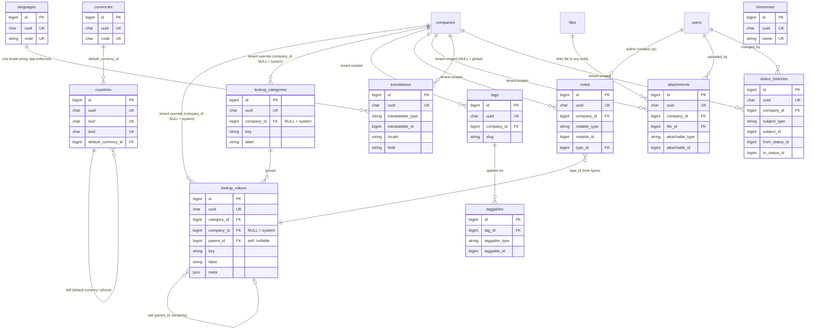

# 01 — D0: Lookups, Reference & Polymorphic (Shared Foundation)

This domain owns the **shared foundation tables** that every other domain (D1–D10)
depends on. It defines three pillars:

1. **Configuration-driven lookups** — `lookup_categories` + `lookup_values`: the
   generic, no-hard-coded-ENUM mechanism for simple configurable lists (types,
   categories, channels, levels) without a workflow. Per-entity *status* tables
   (with transitions/terminal flags) live in their owning domains; this doc owns
   only the generic lookup pair and the polymorphic `status_histories` ledger.
2. **Global reference data** — `countries`, `currencies`, `languages`,
   `timezones`: seeded, NOT tenant-scoped, referenced by FK across the platform
   (multi-currency money, multi-language locales, multi-timezone, addresses).
3. **Cross-cutting polymorphic tables (DRY)** — `translations`, `attachments`,
   `notes`, `tags` + `taggables`, `status_histories`: ONE table per concern,
   associated to any entity via a `(<x>_type, <x>_id)` pair. Other domains
   *reference* these (e.g. "Job attachments → polymorphic `attachments` with
   `attachable_type='job'`") instead of defining per-entity copies. This is a
   deliberate normalization decision (00-Database-Bible §"Cross-cutting
   polymorphic tables"); polymorphic integrity is enforced at the application
   layer plus the indexed `(type,id)` lookups.

All 12 tables in this domain are **BLUEPRINT** — none are present in migrations
0001–0016 yet. The audit trail `activity_logs` (BUILT as `activity_log`,
migration 0015) is owned by **D10** and is only *referenced* here; this domain
owns the sibling `status_histories` ledger.

Every table follows the global standard: `id` BIGINT UNSIGNED PK AI, public
`uuid` CHAR(36) UNIQUE, `created_at`/`updated_at`, `deleted_at` on
soft-deletable entities, InnoDB / `utf8mb4` / `utf8mb4_unicode_ci`.

## Related Documents

- [00-Database-Bible](00-Database-Bible.md) — the authoritative standard + table inventory
- [99-ERD-Blueprint](99-ERD-Blueprint.md) — the complete ERD (all tables, relationships, FKs, indexes)
- [98-Validation-Report](98-Validation-Report.md) — external-architect review and fixes
- Consuming domains (every domain depends on D0): [D1 RBAC](02-RBAC-Membership.md) · [D2 Companies](03-Companies-Settings.md) · [D3 Auth](04-Authentication.md) · [D4 Billing](05-Subscriptions-Billing.md) · [D5 Jobs](06-Jobs.md) · [D6 Candidates](07-Candidates.md) · [D7 Applications & Interviews](08-Applications-Interviews.md) · [D8 AI & Notifications](09-AI-Notifications.md) · [D9 HR & Talent](10-HR-Talent.md) · [D10 Files/Queue/Analytics/Logs](11-Files-Queue-Analytics-Logs.md)
- `activity_logs` (the audit trail / timelines, polymorphic sibling of `status_histories`) is defined in [D10](11-Files-Queue-Analytics-Logs.md); BUILT as `activity_log` in `database/migrations/0015_create_activity_log_table.php`.

## Domain ERD

---

## The polymorphic pattern (normative)

Every cross-cutting table in this domain (`translations`, `attachments`, `notes`,
`taggables`, `status_histories`) associates to an arbitrary owner entity through a
**morph pair**:

- `<x>_type` VARCHAR(120) NOT NULL — a stable logical entity key, **not** a PHP
  class FQN. Use the singular table/entity name: `job`, `application`,
  `interview`, `candidate_profile`, `offer`, `company`, `user`, `file`, etc. A
  fixed map of allowed values is maintained in application config and validated
  on write.
- `<x>_id` BIGINT UNSIGNED NOT NULL — the owner row's numeric `id` (the internal
  id, never the uuid), matching the BIGINT UNSIGNED PK width used everywhere.

Rules that apply to **every** morph table:

- A **composite index** `(<x>_type, <x>_id)` is MANDATORY (type first so the most
  selective equality predicate leads, and lookups always filter on both). This is
  the polymorphic equivalent of an FK index.
- **No database FK** is declared on the morph pair (a column cannot reference many
  tables) — referential integrity is enforced in the application layer and by the
  `(type,id)` index. This is the documented exception to "every relationship is an
  FK" (00-Database-Bible §Foreign keys / DB-5).
- All **genuine** relationships on the same table (`company_id`, `file_id`,
  `tag_id`, `created_by`/`changed_by` → users) remain **hard FKs**.
- Tenant-scoped morph tables additionally carry an indexed `company_id` and the
  hot path is the composite `(company_id, <x>_type, <x>_id)`.
- On owner deletion the application is responsible for cleaning up / soft-deleting
  the morph rows (no DB cascade across the polymorphic edge).

`activity_logs` (D10) and `status_histories` (here) follow the same pattern with
`subject_type`/`subject_id`.

---

## lookup_categories

- **Type**: BLUEPRINT
- **Purpose**: Registry of generic, configurable lookup lists (e.g. `note_types`,
  `employment_types`, `experience_levels`, `document_types`, `contact_channels`,
  `social_link_types`). Each category groups a set of `lookup_values`.
- **Tenant-scoped?**: Optional — `company_id` NULL = system-global category;
  non-null = a tenant-defined category. (System categories are the norm; tenant
  categories support white-label extensibility.)
- **Soft-delete?**: Yes (`deleted_at`) — categories are configuration entities;
  retiring one must not orphan historical references.

### Columns

| column | type | null | default | notes |
|---|---|---|---|---|
| `id` | BIGINT UNSIGNED | no | AI | PK |
| `uuid` | CHAR(36) | no | — | public id, UNIQUE |
| `company_id` | BIGINT UNSIGNED | yes | NULL | NULL = system default; non-null = tenant-defined category → companies |
| `key` | VARCHAR(60) | no | — | machine name, e.g. `note_types` |
| `label` | VARCHAR(120) | no | — | human label |
| `description` | VARCHAR(255) | yes | NULL | admin-facing description |
| `is_system` | TINYINT(1) | no | 0 | seeded/protected category; cannot be deleted by tenants |
| `is_active` | TINYINT(1) | no | 1 | soft on/off without delete |
| `sort_order` | INT | no | 0 | display ordering |
| `created_at` | TIMESTAMP | yes | NULL | |
| `updated_at` | TIMESTAMP | yes | NULL | |
| `deleted_at` | TIMESTAMP | yes | NULL | soft delete |

### Keys

- **PK**: `id`
- **UUID**: UNIQUE `uuid`
- **Unique**: `(company_id, key)` — a category `key` is unique per tenant scope
  (and once for the system scope where `company_id` IS NULL).

### Indexes

| name | columns | type |
|---|---|---|
| `lookup_categories_uuid_unique` | `uuid` | unique |
| `lookup_categories_company_key_unique` | `company_id, key` | unique/composite |
| `lookup_categories_company_id_index` | `company_id` | index (FK) |
| `lookup_categories_key_index` | `key` | index |
| `lookup_categories_deleted_at_index` | `deleted_at` | index |

### Foreign keys

| column | → ref | on delete | on update |
|---|---|---|---|
| `company_id` | `companies(id)` | CASCADE | CASCADE |

### Relationships + cardinality

- `lookup_categories` 1—* `lookup_values` (a category has many values).
- `companies` 1—* `lookup_categories` (a tenant may own custom categories; system
  categories have NULL `company_id`).

### Notes

- Configuration-driven (DB-4): this is the generic catalog used instead of ENUMs
  for non-workflow lists. Workflow statuses use per-entity `*_statuses` tables in
  their owning domains.
- MySQL treats multiple NULLs as distinct in a UNIQUE index, so several tenants
  can each define their own row while the single system row (NULL) is also unique;
  the app enforces "one system category per key".

---

## lookup_values

- **Type**: BLUEPRINT
- **Purpose**: The configurable values within a category — the actual options
  entities reference (e.g. the `note_types` values `general`, `interview`,
  `internal`). Replaces hard-coded ENUMs across the schema.
- **Tenant-scoped?**: Optional — `company_id` NULL = system default value;
  non-null = tenant override/custom value within the (possibly system) category.
- **Soft-delete?**: Yes (`deleted_at`) — retiring a value must not break rows that
  still reference it; prefer `is_active=0` then soft delete.

### Columns

| column | type | null | default | notes |
|---|---|---|---|---|
| `id` | BIGINT UNSIGNED | no | AI | PK |
| `uuid` | CHAR(36) | no | — | public id, UNIQUE |
| `category_id` | BIGINT UNSIGNED | no | — | → lookup_categories |
| `company_id` | BIGINT UNSIGNED | yes | NULL | NULL = system default; non-null = tenant value → companies |
| `parent_id` | BIGINT UNSIGNED | yes | NULL | self-ref for hierarchical lookups (e.g. industry > sub-industry) |
| `key` | VARCHAR(60) | no | — | machine value, e.g. `full_time` |
| `label` | VARCHAR(120) | no | — | display label |
| `meta` | JSON | yes | NULL | extra attributes (icon, color, flags, i18n hints) |
| `sort_order` | INT | no | 0 | ordering within the category |
| `is_default` | TINYINT(1) | no | 0 | default selection for the category/scope |
| `is_system` | TINYINT(1) | no | 0 | seeded/protected value |
| `is_active` | TINYINT(1) | no | 1 | selectable toggle |
| `created_at` | TIMESTAMP | yes | NULL | |
| `updated_at` | TIMESTAMP | yes | NULL | |
| `deleted_at` | TIMESTAMP | yes | NULL | soft delete |

### Keys

- **PK**: `id`
- **UUID**: UNIQUE `uuid`
- **Unique**: `(category_id, company_id, key)` — a value `key` is unique within
  its category per tenant scope (matches the context's
  `UNIQUE(category_id, company_id, key)`).

### Indexes

| name | columns | type |
|---|---|---|
| `lookup_values_uuid_unique` | `uuid` | unique |
| `lookup_values_category_company_key_unique` | `category_id, company_id, key` | unique/composite |
| `lookup_values_category_id_index` | `category_id` | index (FK) |
| `lookup_values_company_id_index` | `company_id` | index (FK) |
| `lookup_values_parent_id_index` | `parent_id` | index (FK) |
| `lookup_values_category_active_sort_index` | `category_id, is_active, sort_order` | composite (option-list fetch) |
| `lookup_values_deleted_at_index` | `deleted_at` | index |

### Foreign keys

| column | → ref | on delete | on update |
|---|---|---|---|
| `category_id` | `lookup_categories(id)` | CASCADE | CASCADE |
| `company_id` | `companies(id)` | CASCADE | CASCADE |
| `parent_id` | `lookup_values(id)` | SET NULL | CASCADE |

### Relationships + cardinality

- `lookup_categories` 1—* `lookup_values`.
- `lookup_values` 1—* `lookup_values` (self, via `parent_id`) for hierarchies.
- `lookup_values` 1—* consuming entities — any domain table that needs a
  configurable value references a `lookup_values.id` via a `<x>_id` FK
  (RESTRICT), e.g. `notes.type_id`, `jobs.employment_type_id`,
  `experiences.employment_type_id`, `social_links.type_id`. Those FKs are
  declared in the consuming domain docs.

### Notes

- Configuration-driven (DB-4). Consumers should FK to `lookup_values(id)` with
  **ON DELETE RESTRICT** so an in-use value cannot vanish (catalog-ref rule, §4).
- `meta` JSON keeps the table narrow while allowing per-value attributes without
  schema churn.
- Tenant override pattern: a tenant copies/extends a system category's values by
  inserting rows with its `company_id`; resolution prefers tenant rows then falls
  back to system (`company_id IS NULL`).

---

## countries

- **Type**: BLUEPRINT
- **Purpose**: ISO country reference list for addresses, phone codes, locale and
  default-currency resolution. Global, seeded.
- **Tenant-scoped?**: No (global reference data).
- **Soft-delete?**: No — reference data is toggled via `is_active`, not deleted
  (countries are append/maintain-only).

### Columns

| column | type | null | default | notes |
|---|---|---|---|---|
| `id` | BIGINT UNSIGNED | no | AI | PK |
| `uuid` | CHAR(36) | no | — | public id, UNIQUE |
| `iso2` | CHAR(2) | no | — | ISO 3166-1 alpha-2 (e.g. `SA`), UNIQUE |
| `iso3` | CHAR(3) | no | — | ISO 3166-1 alpha-3 (e.g. `SAU`), UNIQUE |
| `numeric_code` | CHAR(3) | yes | NULL | ISO 3166-1 numeric (e.g. `682`) |
| `name` | VARCHAR(120) | no | — | English name |
| `native_name` | VARCHAR(120) | yes | NULL | endonym |
| `phone_code` | VARCHAR(8) | yes | NULL | E.164 dialing prefix (e.g. `+966`) |
| `default_currency_id` | BIGINT UNSIGNED | yes | NULL | → currencies (suggested currency) |
| `region` | VARCHAR(60) | yes | NULL | continent/region grouping |
| `flag_emoji` | VARCHAR(16) | yes | NULL | display flag |
| `is_active` | TINYINT(1) | no | 1 | selectable toggle |
| `sort_order` | INT | no | 0 | display ordering |
| `created_at` | TIMESTAMP | yes | NULL | |
| `updated_at` | TIMESTAMP | yes | NULL | |

### Keys

- **PK**: `id`
- **UUID**: UNIQUE `uuid`
- **Unique**: `iso2`, `iso3`.

### Indexes

| name | columns | type |
|---|---|---|
| `countries_uuid_unique` | `uuid` | unique |
| `countries_iso2_unique` | `iso2` | unique |
| `countries_iso3_unique` | `iso3` | unique |
| `countries_default_currency_id_index` | `default_currency_id` | index (FK) |
| `countries_name_index` | `name` | index |

### Foreign keys

| column | → ref | on delete | on update |
|---|---|---|---|
| `default_currency_id` | `currencies(id)` | SET NULL | CASCADE |

### Relationships + cardinality

- `currencies` 1—* `countries` (a currency is the default for many countries).
- `countries` 1—* consuming entities — addresses/locations (`locations`,
  `candidate_profiles`, `companies`) reference `country_id` (FK declared in those
  domains).

### Notes

- Multi-* future-ready (§8): underpins addresses, phone validation, and
  currency/locale defaults. RESTRICT-style protection is achieved via `is_active`
  rather than hard delete since this table is never deleted from.

---

## currencies

- **Type**: BLUEPRINT
- **Purpose**: ISO currency reference for multi-currency money. Money everywhere is
  stored as (`amount` DECIMAL(12,2), `currency_id`); `plan_prices` are per
  currency. Global, seeded.
- **Tenant-scoped?**: No (global reference data).
- **Soft-delete?**: No — toggled via `is_active`.

### Columns

| column | type | null | default | notes |
|---|---|---|---|---|
| `id` | BIGINT UNSIGNED | no | AI | PK |
| `uuid` | CHAR(36) | no | — | public id, UNIQUE |
| `code` | CHAR(3) | no | — | ISO 4217 (e.g. `SAR`, `USD`), UNIQUE |
| `numeric_code` | CHAR(3) | yes | NULL | ISO 4217 numeric |
| `name` | VARCHAR(80) | no | — | e.g. `Saudi Riyal` |
| `symbol` | VARCHAR(8) | yes | NULL | e.g. `﷼`, `$` |
| `decimal_places` | TINYINT UNSIGNED | no | 2 | minor-unit precision (e.g. JPY=0) |
| `is_active` | TINYINT(1) | no | 1 | selectable toggle |
| `sort_order` | INT | no | 0 | display ordering |
| `created_at` | TIMESTAMP | yes | NULL | |
| `updated_at` | TIMESTAMP | yes | NULL | |

### Keys

- **PK**: `id`
- **UUID**: UNIQUE `uuid`
- **Unique**: `code`.

### Indexes

| name | columns | type |
|---|---|---|
| `currencies_uuid_unique` | `uuid` | unique |
| `currencies_code_unique` | `code` | unique |
| `currencies_is_active_index` | `is_active` | index |

### Foreign keys

- None outgoing.

### Relationships + cardinality

- `currencies` 1—* `countries` (`countries.default_currency_id`).
- `currencies` 1—* money-bearing rows — `plan_prices`, `invoices`, `payments`,
  `transactions`, `coupons`, etc. reference `currency_id` (FK **RESTRICT**,
  declared in D4 Billing): a currency in use must never disappear.

### Notes

- Multi-currency (§8). `decimal_places` lets the app format/round correctly per
  currency; the canonical stored amount uses DECIMAL to avoid float error.

---

## languages

- **Type**: BLUEPRINT
- **Purpose**: Supported languages/locales for multi-language UI and content
  (`translations`). Drives locale columns on users/companies. Global, seeded.
- **Tenant-scoped?**: No (global reference data; tenants *select* from it).
- **Soft-delete?**: No — toggled via `is_active`.

### Columns

| column | type | null | default | notes |
|---|---|---|---|---|
| `id` | BIGINT UNSIGNED | no | AI | PK |
| `uuid` | CHAR(36) | no | — | public id, UNIQUE |
| `code` | VARCHAR(10) | no | — | BCP-47/locale (e.g. `en`, `ar`, `ar-SA`), UNIQUE |
| `name` | VARCHAR(80) | no | — | English name (e.g. `Arabic`) |
| `native_name` | VARCHAR(80) | yes | NULL | endonym (e.g. `العربية`) |
| `direction` | CHAR(3) | no | 'ltr' | text direction: `ltr` / `rtl` (config string, not ENUM) |
| `is_active` | TINYINT(1) | no | 1 | available for selection |
| `is_default` | TINYINT(1) | no | 0 | platform fallback locale |
| `sort_order` | INT | no | 0 | display ordering |
| `created_at` | TIMESTAMP | yes | NULL | |
| `updated_at` | TIMESTAMP | yes | NULL | |

### Keys

- **PK**: `id`
- **UUID**: UNIQUE `uuid`
- **Unique**: `code`.

### Indexes

| name | columns | type |
|---|---|---|
| `languages_uuid_unique` | `uuid` | unique |
| `languages_code_unique` | `code` | unique |
| `languages_is_active_index` | `is_active` | index |

### Foreign keys

- None outgoing.

### Relationships + cardinality

- `languages` 1—* locale references — users/companies locale columns and
  `candidate_languages`/`job_languages` (declared in their domains) reference
  `language_id`.
- `languages` relates to `translations` by the `locale` *string* (not a hard FK —
  see notes).

### Notes

- Multi-language (§8). `translations.locale` is stored as a string matching
  `languages.code` for write throughput and to allow locales not yet in the table;
  the app validates it against active `languages`. `direction` is a short config
  string per the no-ENUM rule.

---

## timezones

- **Type**: BLUEPRINT
- **Purpose**: IANA timezone reference for multi-timezone scheduling, display, and
  per-user/company `timezone` columns. Global, seeded.
- **Tenant-scoped?**: No (global reference data).
- **Soft-delete?**: No — toggled via `is_active`.

### Columns

| column | type | null | default | notes |
|---|---|---|---|---|
| `id` | BIGINT UNSIGNED | no | AI | PK |
| `uuid` | CHAR(36) | no | — | public id, UNIQUE |
| `name` | VARCHAR(64) | no | — | IANA name (e.g. `Asia/Riyadh`), UNIQUE |
| `abbreviation` | VARCHAR(12) | yes | NULL | e.g. `AST` |
| `utc_offset` | VARCHAR(9) | yes | NULL | display offset (e.g. `+03:00`) |
| `offset_minutes` | SMALLINT | yes | NULL | offset in minutes (e.g. `180`) for sorting |
| `country_id` | BIGINT UNSIGNED | yes | NULL | → countries (grouping/filtering) |
| `is_active` | TINYINT(1) | no | 1 | selectable toggle |
| `sort_order` | INT | no | 0 | display ordering |
| `created_at` | TIMESTAMP | yes | NULL | |
| `updated_at` | TIMESTAMP | yes | NULL | |

### Keys

- **PK**: `id`
- **UUID**: UNIQUE `uuid`
- **Unique**: `name`.

### Indexes

| name | columns | type |
|---|---|---|
| `timezones_uuid_unique` | `uuid` | unique |
| `timezones_name_unique` | `name` | unique |
| `timezones_country_id_index` | `country_id` | index (FK) |
| `timezones_is_active_index` | `is_active` | index |

### Foreign keys

| column | → ref | on delete | on update |
|---|---|---|---|
| `country_id` | `countries(id)` | SET NULL | CASCADE |

### Relationships + cardinality

- `countries` 1—* `timezones`.
- `timezones` 1—* timezone references — users/companies/schedules/meetings carry a
  `timezone_id` (declared in their domains).

### Notes

- Multi-timezone (§8). `offset_minutes` is denormalized purely for ordering;
  authoritative offsets (incl. DST) come from the IANA name at runtime. The BUILT
  `companies.timezone` string column will migrate toward a `timezone_id` FK.

---

## translations

- **Type**: BLUEPRINT
- **Purpose**: Polymorphic per-field translation store for multi-language content
  (e.g. a job title/description, a category label) — one row per
  (entity, locale, field).
- **Tenant-scoped?**: Optional — `company_id` indexed; NULL = global/system
  content (e.g. system lookup labels), non-null = tenant content.
- **Soft-delete?**: No — translations are hard-deleted/overwritten with their
  parent (lightweight content rows).

### Columns

| column | type | null | default | notes |
|---|---|---|---|---|
| `id` | BIGINT UNSIGNED | no | AI | PK |
| `uuid` | CHAR(36) | no | — | public id, UNIQUE |
| `company_id` | BIGINT UNSIGNED | yes | NULL | tenant scope; NULL = global content → companies |
| `translatable_type` | VARCHAR(120) | no | — | morph type (e.g. `job`, `lookup_value`) |
| `translatable_id` | BIGINT UNSIGNED | no | — | morph id (owner row id) |
| `locale` | VARCHAR(10) | no | — | matches `languages.code` (app-validated) |
| `field` | VARCHAR(60) | no | — | translated attribute (e.g. `title`, `label`) |
| `value` | TEXT | no | — | translated text |
| `created_at` | TIMESTAMP | yes | NULL | |
| `updated_at` | TIMESTAMP | yes | NULL | |

### Keys

- **PK**: `id`
- **UUID**: UNIQUE `uuid`
- **Unique**: `(translatable_type, translatable_id, locale, field)` — one value per
  field per locale per entity.

### Indexes

| name | columns | type |
|---|---|---|
| `translations_uuid_unique` | `uuid` | unique |
| `translations_morph_locale_field_unique` | `translatable_type, translatable_id, locale, field` | unique/composite |
| `translations_translatable_index` | `translatable_type, translatable_id` | poly (composite) |
| `translations_company_id_index` | `company_id` | index (FK) |
| `translations_locale_index` | `locale` | index |

### Foreign keys

| column | → ref | on delete | on update |
|---|---|---|---|
| `company_id` | `companies(id)` | CASCADE | CASCADE |

Morph pair (`translatable_type`,`translatable_id`) has **no FK** (polymorphic —
app-enforced, see "The polymorphic pattern").

### Relationships + cardinality

- any translatable entity 1—* `translations` (one row per locale × field).
- `companies` 1—* `translations` (tenant content; global content has NULL
  `company_id`).
- `languages` —< `translations` via the `locale` string (app-validated, not a hard
  FK; see `languages` notes).

### Notes

- Polymorphic (§6); the `(type,id)` composite is mandatory. The unique key
  guarantees idempotent upserts of a translation. `locale` mirrors
  `languages.code` rather than an FK so high-volume content writes stay fast and
  unseeded locales are tolerated.

---

## attachments

- **Type**: BLUEPRINT
- **Purpose**: Polymorphic link between a stored `file` (D10 `files`) and any
  entity — replaces per-entity tables (`job_attachments`, `interview_attachments`,
  …). E.g. "Job attachments → polymorphic `attachments` with `attachable_type='job'`".
- **Tenant-scoped?**: Yes — indexed `company_id` (FK).
- **Soft-delete?**: Yes (`deleted_at`) — detaching a file from an entity should be
  reversible/auditable; the underlying `file` lifecycle is managed in D10.

### Columns

| column | type | null | default | notes |
|---|---|---|---|---|
| `id` | BIGINT UNSIGNED | no | AI | PK |
| `uuid` | CHAR(36) | no | — | public id, UNIQUE |
| `company_id` | BIGINT UNSIGNED | no | — | tenant scope → companies |
| `file_id` | BIGINT UNSIGNED | no | — | → files (D10) — the actual stored object |
| `attachable_type` | VARCHAR(120) | no | — | morph type (e.g. `job`, `application`, `candidate_profile`) |
| `attachable_id` | BIGINT UNSIGNED | no | — | morph id (owner row id) |
| `collection` | VARCHAR(60) | yes | NULL | logical bucket (e.g. `resume`, `cover_letter`, `logo`) |
| `title` | VARCHAR(160) | yes | NULL | display name override |
| `sort_order` | INT | no | 0 | ordering within a collection |
| `uploaded_by` | BIGINT UNSIGNED | yes | NULL | → users (actor) |
| `created_at` | TIMESTAMP | yes | NULL | |
| `updated_at` | TIMESTAMP | yes | NULL | |
| `deleted_at` | TIMESTAMP | yes | NULL | soft delete (detach) |

### Keys

- **PK**: `id`
- **UUID**: UNIQUE `uuid`
- **Unique**: none beyond `uuid` (the same file may legitimately attach to several
  entities; uniqueness, if needed per use case, is enforced in the app).

### Indexes

| name | columns | type |
|---|---|---|
| `attachments_uuid_unique` | `uuid` | unique |
| `attachments_attachable_index` | `attachable_type, attachable_id` | poly (composite) |
| `attachments_company_morph_index` | `company_id, attachable_type, attachable_id` | composite (hot path) |
| `attachments_company_id_index` | `company_id` | index (FK) |
| `attachments_file_id_index` | `file_id` | index (FK) |
| `attachments_uploaded_by_index` | `uploaded_by` | index (FK) |
| `attachments_collection_index` | `collection` | index |
| `attachments_deleted_at_index` | `deleted_at` | index |

### Foreign keys

| column | → ref | on delete | on update |
|---|---|---|---|
| `company_id` | `companies(id)` | CASCADE | CASCADE |
| `file_id` | `files(id)` | CASCADE | CASCADE |
| `uploaded_by` | `users(id)` | SET NULL | CASCADE |

Morph pair (`attachable_type`,`attachable_id`) has **no FK** (polymorphic —
app-enforced).

### Relationships + cardinality

- `files` 1—* `attachments` (one file may be attached to many entities).
- any attachable entity 1—* `attachments`.
- `companies` 1—* `attachments`; `users` 1—* `attachments` (uploader).

### Notes

- Polymorphic (§6) and a key DRY decision — one indexed table replaces dozens of
  per-entity attachment tables. The binary/object metadata lives in `files` (D10);
  this table is the join + placement (`collection`, `sort_order`). FK to `files`
  is a genuine relational link and stays a hard FK.

---

## notes

- **Type**: BLUEPRINT
- **Purpose**: Polymorphic free-text notes/comments attached to any entity
  (candidate, application, interview, job, company…), authored by a user, typed via
  a lookup.
- **Tenant-scoped?**: Yes — indexed `company_id` (FK).
- **Soft-delete?**: Yes (`deleted_at`) — notes are business content; removal is
  reversible/auditable.

### Columns

| column | type | null | default | notes |
|---|---|---|---|---|
| `id` | BIGINT UNSIGNED | no | AI | PK |
| `uuid` | CHAR(36) | no | — | public id, UNIQUE |
| `company_id` | BIGINT UNSIGNED | no | — | tenant scope → companies |
| `notable_type` | VARCHAR(120) | no | — | morph type (e.g. `candidate_profile`, `application`) |
| `notable_id` | BIGINT UNSIGNED | no | — | morph id (owner row id) |
| `type_id` | BIGINT UNSIGNED | yes | NULL | → lookup_values (category `note_types`) |
| `user_id` | BIGINT UNSIGNED | yes | NULL | author → users |
| `body` | TEXT | no | — | note content |
| `is_pinned` | TINYINT(1) | no | 0 | surface at top of timeline |
| `is_private` | TINYINT(1) | no | 0 | author/role-restricted visibility (app-enforced) |
| `created_at` | TIMESTAMP | yes | NULL | |
| `updated_at` | TIMESTAMP | yes | NULL | |
| `deleted_at` | TIMESTAMP | yes | NULL | soft delete |

### Keys

- **PK**: `id`
- **UUID**: UNIQUE `uuid`
- **Unique**: none beyond `uuid`.

### Indexes

| name | columns | type |
|---|---|---|
| `notes_uuid_unique` | `uuid` | unique |
| `notes_notable_index` | `notable_type, notable_id` | poly (composite) |
| `notes_company_morph_index` | `company_id, notable_type, notable_id` | composite (hot path) |
| `notes_company_id_index` | `company_id` | index (FK) |
| `notes_type_id_index` | `type_id` | index (FK) |
| `notes_user_id_index` | `user_id` | index (FK) |
| `notes_body_fulltext` | `body` | fulltext |
| `notes_deleted_at_index` | `deleted_at` | index |

### Foreign keys

| column | → ref | on delete | on update |
|---|---|---|---|
| `company_id` | `companies(id)` | CASCADE | CASCADE |
| `type_id` | `lookup_values(id)` | RESTRICT | CASCADE |
| `user_id` | `users(id)` | SET NULL | CASCADE |

Morph pair (`notable_type`,`notable_id`) has **no FK** (polymorphic — app-enforced).

### Relationships + cardinality

- any notable entity 1—* `notes`.
- `users` 1—* `notes` (author).
- `lookup_values` 1—* `notes` (note type; RESTRICT so an in-use type can't vanish).
- `companies` 1—* `notes`.

### Notes

- Polymorphic (§6) + configuration-driven type (DB-4: `type_id` → `lookup_values`).
- FULLTEXT on `body` for note search (§3 SEARCH). `is_private` visibility is an
  app/RBAC concern; the DB just stores the flag.

---

## tags

- **Type**: BLUEPRINT
- **Purpose**: Tenant-defined labels that can be applied to many entity types via
  the `taggables` pivot (e.g. tagging candidates, applications, jobs).
- **Tenant-scoped?**: Yes — indexed `company_id` (FK); tags are per tenant.
- **Soft-delete?**: Yes (`deleted_at`) — removing a tag definition should not hard
  break tagged history; soft delete then app cleans `taggables`.

### Columns

| column | type | null | default | notes |
|---|---|---|---|---|
| `id` | BIGINT UNSIGNED | no | AI | PK |
| `uuid` | CHAR(36) | no | — | public id, UNIQUE |
| `company_id` | BIGINT UNSIGNED | no | — | tenant scope → companies |
| `name` | VARCHAR(80) | no | — | display name |
| `slug` | VARCHAR(90) | no | — | normalized key, unique per tenant |
| `color` | VARCHAR(20) | yes | NULL | UI color (hex/token) |
| `description` | VARCHAR(255) | yes | NULL | optional description |
| `usage_count` | INT UNSIGNED | no | 0 | denormalized counter (app-maintained) |
| `created_by` | BIGINT UNSIGNED | yes | NULL | → users |
| `created_at` | TIMESTAMP | yes | NULL | |
| `updated_at` | TIMESTAMP | yes | NULL | |
| `deleted_at` | TIMESTAMP | yes | NULL | soft delete |

### Keys

- **PK**: `id`
- **UUID**: UNIQUE `uuid`
- **Unique**: `(company_id, slug)` — a tag slug is unique within a tenant.

### Indexes

| name | columns | type |
|---|---|---|
| `tags_uuid_unique` | `uuid` | unique |
| `tags_company_slug_unique` | `company_id, slug` | unique/composite |
| `tags_company_id_index` | `company_id` | index (FK) |
| `tags_created_by_index` | `created_by` | index (FK) |
| `tags_name_index` | `name` | index |
| `tags_deleted_at_index` | `deleted_at` | index |

### Foreign keys

| column | → ref | on delete | on update |
|---|---|---|---|
| `company_id` | `companies(id)` | CASCADE | CASCADE |
| `created_by` | `users(id)` | SET NULL | CASCADE |

### Relationships + cardinality

- `tags` *—* entities via `taggables` (many-to-many, polymorphic on the entity
  side).
- `companies` 1—* `tags`; `users` 1—* `tags` (creator).

### Notes

- Tenant-scoped catalog. `usage_count` is denormalized for fast facets; it is
  recomputed/maintained by the app, not a source of truth.

---

## taggables

- **Type**: BLUEPRINT
- **Purpose**: Polymorphic pivot linking a `tag` to any entity (the M:N join for
  tagging). Replaces per-entity tag pivots.
- **Tenant-scoped?**: Indirectly (via `tag_id` → `tags.company_id`); a denormalized
  `company_id` is included for tenant-scoped queries and isolation.
- **Soft-delete?**: No — pure pivot; rows are hard-deleted when untagged
  (00-Database-Bible §"pivots are hard/expired").

### Columns

| column | type | null | default | notes |
|---|---|---|---|---|
| `id` | BIGINT UNSIGNED | no | AI | PK |
| `company_id` | BIGINT UNSIGNED | no | — | denormalized tenant scope → companies |
| `tag_id` | BIGINT UNSIGNED | no | — | → tags |
| `taggable_type` | VARCHAR(120) | no | — | morph type (e.g. `candidate_profile`, `job`) |
| `taggable_id` | BIGINT UNSIGNED | no | — | morph id (owner row id) |
| `tagged_by` | BIGINT UNSIGNED | yes | NULL | → users (actor) |
| `created_at` | TIMESTAMP | yes | NULL | when applied |

### Keys

- **PK**: `id`
- **UUID**: omitted — pure high-churn pivot (allowed by §1: pivots need no public
  id; the morph + tag identify the row).
- **Unique**: `(tag_id, taggable_type, taggable_id)` — a tag is applied to a given
  entity at most once.

### Indexes

| name | columns | type |
|---|---|---|
| `taggables_tag_morph_unique` | `tag_id, taggable_type, taggable_id` | unique/composite |
| `taggables_taggable_index` | `taggable_type, taggable_id` | poly (composite) |
| `taggables_company_morph_index` | `company_id, taggable_type, taggable_id` | composite (hot path) |
| `taggables_tag_id_index` | `tag_id` | index (FK) |
| `taggables_company_id_index` | `company_id` | index (FK) |
| `taggables_tagged_by_index` | `tagged_by` | index (FK) |

### Foreign keys

| column | → ref | on delete | on update |
|---|---|---|---|
| `company_id` | `companies(id)` | CASCADE | CASCADE |
| `tag_id` | `tags(id)` | CASCADE | CASCADE |
| `tagged_by` | `users(id)` | SET NULL | CASCADE |

Morph pair (`taggable_type`,`taggable_id`) has **no FK** (polymorphic — app-enforced).

### Relationships + cardinality

- `tags` 1—* `taggables` *—1 any taggable entity (resolves the tag M:N).
- `companies` 1—* `taggables`.

### Notes

- Polymorphic pivot (§6). The two composites cover both access paths: "all tags on
  entity X" (`taggable_type, taggable_id`) and "all entities with tag T"
  (`tag_id` index / the unique key). `company_id` is denormalized from `tags` so
  tenant-scoped reads don't need a join; the app keeps it consistent with the
  parent tag.

---

## status_histories

- **Type**: BLUEPRINT
- **Purpose**: Polymorphic ledger of status transitions for any workflow entity
  (jobs, applications, interviews, offers, subscriptions, invoices, payments…):
  who changed what status, from → to, when, with an optional note. Complements the
  per-entity `*_statuses` tables and the broader `activity_logs` audit trail.
- **Tenant-scoped?**: Yes — indexed `company_id` (FK).
- **Soft-delete?**: No — append-only audit ledger; never edited or soft-deleted
  (history must be immutable). Hard-retained/archived with its tenant.

### Columns

| column | type | null | default | notes |
|---|---|---|---|---|
| `id` | BIGINT UNSIGNED | no | AI | PK |
| `uuid` | CHAR(36) | no | — | public id, UNIQUE |
| `company_id` | BIGINT UNSIGNED | no | — | tenant scope → companies |
| `subject_type` | VARCHAR(120) | no | — | morph type (e.g. `application`, `interview`) |
| `subject_id` | BIGINT UNSIGNED | no | — | morph id (owner row id) |
| `status_type` | VARCHAR(120) | yes | NULL | which status dimension changed (e.g. `application_status`) — disambiguates entities with multiple status fields |
| `from_status_id` | BIGINT UNSIGNED | yes | NULL | previous status id (NULL on initial) |
| `to_status_id` | BIGINT UNSIGNED | no | — | new status id |
| `from_status_key` | VARCHAR(60) | yes | NULL | denormalized snapshot of the from-status key (durable label) |
| `to_status_key` | VARCHAR(60) | yes | NULL | denormalized snapshot of the to-status key |
| `changed_by` | BIGINT UNSIGNED | yes | NULL | actor → users (NULL = system) |
| `note` | VARCHAR(255) | yes | NULL | reason/comment |
| `created_at` | TIMESTAMP | yes | NULL | when the transition happened |

### Keys

- **PK**: `id`
- **UUID**: UNIQUE `uuid`
- **Unique**: none beyond `uuid` (append-only; many rows per subject).

### Indexes

| name | columns | type |
|---|---|---|
| `status_histories_uuid_unique` | `uuid` | unique |
| `status_histories_subject_index` | `subject_type, subject_id` | poly (composite) |
| `status_histories_company_morph_index` | `company_id, subject_type, subject_id` | composite (hot path) |
| `status_histories_company_id_index` | `company_id` | index (FK) |
| `status_histories_changed_by_index` | `changed_by` | index (FK) |
| `status_histories_created_at_index` | `created_at` | index (timeline / range) |

### Foreign keys

| column | → ref | on delete | on update |
|---|---|---|---|
| `company_id` | `companies(id)` | CASCADE | CASCADE |
| `changed_by` | `users(id)` | SET NULL | CASCADE |

Morph pair (`subject_type`,`subject_id`) and `from_status_id`/`to_status_id` have
**no DB FK**: the status ids point at *different* per-entity `*_statuses` tables
depending on `subject_type`/`status_type`, so a single column cannot FK them —
integrity is app-enforced. The denormalized `*_status_key` snapshots keep the
history readable even if a status row is later renamed or removed.

### Relationships + cardinality

- any workflow subject 1—* `status_histories` (a row per transition).
- `users` 1—* `status_histories` (actor; NULL = system transition).
- `companies` 1—* `status_histories`.
- Logically relates to the per-entity `*_statuses` tables (e.g.
  `application_statuses`, `interview_statuses`, `offer_statuses`) via
  `from_status_id`/`to_status_id` — app-resolved by `subject_type`/`status_type`.

### Notes

- Polymorphic + append-only (§5/§6). Sibling of D10 `activity_logs`: `activity_logs`
  is the general audit/timeline (all actions, `old_values`/`new_values`); this
  table is the focused **status** ledger driving stage funnels and SLA timers.
- Scale: append-mostly and per-tenant; like other high-volume audit tables it can
  be partitioned by RANGE(`created_at`) (monthly) and/or sharded by `company_id`
  (§7). `status_type` disambiguates entities carrying more than one status field.

---

## Cross-domain assumptions & open questions

- **FK anchors assumed BUILT/standardized**: `companies(id)` and `users(id)` are
  BIGINT UNSIGNED PKs (confirmed in migrations 0001/0002) — every FK here matches
  that width. `files(id)` (D10) is assumed BIGINT UNSIGNED; `attachments.file_id`
  depends on D10 finalizing `files`.
- **`activity_logs` is D10's** (BUILT as `activity_log`, 0015) — referenced only;
  this domain owns the sibling `status_histories`.
- **Morph type values** use stable logical entity keys (singular table names:
  `job`, `application`, `candidate_profile`, …), NOT class FQNs — a shared
  app-config map is the contract every domain must use consistently for the
  `(type,id)` indexes to be meaningful. Recommend a central registry to avoid
  drift across D1–D10.
- **`notes.type_id` → `lookup_values`** assumes a seeded `note_types` category in
  `lookup_categories`; other domains adding typed notes/lookups must seed their
  categories here.
- **`translations.locale` / `taggables.company_id`** are intentionally denormalized
  (string locale; copied tenant id) for throughput/isolation — the app keeps them
  consistent with `languages.code` / parent `tags.company_id` respectively.
- **Per-entity status tables vs generic**: consistent with 00-Database-Bible's open
  question — this domain commits to generic `lookup_*` for non-workflow lists and
  the polymorphic `status_histories` ledger, leaving workflow `*_statuses` to their
  domains. Flagged for sign-off in 98-Validation-Report.
