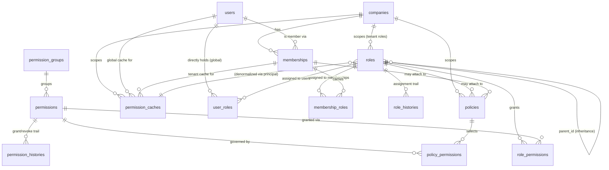

# 02 — RBAC & Membership (Domain D1)

The authorization core of HalaOps. This domain answers one question for every
request: **"can this user do this thing in this company?"** It defines *who a
user is inside a tenant* (`memberships`), *what bundles of capability exist*
(`roles`, with inheritance), *the atomic capabilities themselves* (`permissions`,
grouped by `permission_groups`), *how they are wired together* (`role_permissions`,
`membership_roles`, `user_roles`), a finer-grained conditional layer
(`policies` + `policy_permissions`), a read-optimized projection of the answer
(`permission_caches`), and an explicit grant/revoke audit trail
(`role_histories`, `permission_histories`).

The design follows HalaOps Business Rule **DB-1**: there is exactly one `users`
table and there are no `admin`/`hr`/`candidate`/`owner` tables — *capability is
data*, expressed entirely through this domain. A person becomes an "Owner" of
company A and a plain "Member" of company B purely by which roles hang off each
of their memberships; the same global user row is reused everywhere (DB-2).

This document is part of the **HalaOps Final Database Blueprint**. Tables shipped
in migrations 0001–0016 are marked **BUILT**; everything else is **BLUEPRINT**
(the target the implementation migrates toward, after approval). Where the
blueprint renames a built table, both names are stated explicitly.

### BUILT vs BLUEPRINT — RBAC summary

| Table | Status | Built migration / rename |
|-------|--------|--------------------------|
| `roles` | **BUILT** | 0004 (+ `uuid`/`deleted_at` from 0016) — blueprint adds a few columns |
| `permissions` | **BUILT** | 0005 — blueprint normalizes the `group` string into `permission_groups` |
| `permission_groups` | **BLUEPRINT** | new — replaces the `permissions.group` VARCHAR |
| `role_permissions` | **BUILT, RENAMED** | built as `permission_role` (0006) → blueprint standard `role_permissions` |
| `user_roles` | **BUILT, RENAMED** | built as `user_role` (0008) → blueprint standard `user_roles` |
| `memberships` | **BUILT** | 0003 (+ `uuid`/`deleted_at` from 0016) — blueprint moves `status` ENUM to FK |
| `membership_roles` | **BUILT, RENAMED** | built as `membership_role` (0007) → blueprint standard `membership_roles` |
| `policies` | **BLUEPRINT** | new — conditional/scoped policy layer |
| `policy_permissions` | **BLUEPRINT** | new — pivot: which permissions a policy governs |
| `permission_caches` | **BLUEPRINT** | new — materialized effective permissions per principal |
| `role_histories` | **BLUEPRINT** | new — explicit role assignment grant/revoke history |
| `permission_histories` | **BLUEPRINT** | new — explicit permission grant/revoke history |

> **Naming-rename note.** The built pivot tables use the Laravel-default singular
> `<a>_<b>` ordering (`permission_role`, `membership_role`, `user_role`). The
> blueprint standardizes on the descriptive-plural convention from the Database
> Bible (§Naming): `role_permissions`, `membership_roles`, `user_roles`. The
> rename is a post-approval migration task (a `RENAME TABLE`, no data change), not
> a new duplicate table. Throughout this document the blueprint names are used,
> with the built name noted in each table's header.

## Related Documents

- [00-Database-Bible](00-Database-Bible.md) — global standard (base columns, naming, config-driven, indexing, FK rules, §9 per-table format)
- [99-ERD-Blueprint](99-ERD-Blueprint.md) — the complete cross-domain ERD
- [98-Validation-Report](98-Validation-Report.md) — external-architect review and fixes
- [01-Lookups-Reference](01-Lookups-Reference.md) — D0: `lookup_categories`/`lookup_values` (membership status, history action types), `status_histories`, `activity_logs`, `translations`
- [03-Companies-Settings](03-Companies-Settings.md) — D2: `companies` (tenant anchor) and `company_invitations` (feeds `memberships`)
- [04-Authentication](04-Authentication.md) — D3: `users` sign-in; sessions resolve the active membership whose roles this domain evaluates
- Up-stream specs: [../07-RBAC](../07-RBAC.md), [../08-Multi-Tenant](../08-Multi-Tenant.md), [../47-Enterprise-Architecture-Standards](../47-Enterprise-Architecture-Standards.md)
- Source of truth for BUILT tables: `database/migrations/0003`–`0008`, `0016`, and `config/rbac.php`

## Domain model (how authorization is computed)

1. **Principals.** Authorization is granted to two kinds of principal:
   - a **user** directly, via `user_roles`, for *global* roles (`roles.company_id IS NULL`) such as platform `super-admin` — these bypass tenant scoping;
   - a **membership** (a user-in-a-company), via `membership_roles`, for *tenant* roles (`roles.company_id = <that company>`).
2. **Roles bundle permissions** through `role_permissions`, and roles form a
   single-parent tree via `roles.parent_id`. A role's **effective permissions** =
   its own `role_permissions` rows ∪ those of all ancestors (transitive closure
   up the `parent_id` chain).
3. **Permissions** are the atomic, app-enforced capability keys
   (e.g. `members.invite`, `roles.manage`). They are grouped — for the role-editor
   UI and reasoning — by `permission_groups`.
4. **Policies** (`policies` + `policy_permissions`) add a conditional / scoped
   layer on top of plain role→permission grants: an allow/deny rule, optionally
   carrying JSON conditions (ownership, ABAC-style attributes, field/scope limits)
   and optionally attached to a role, a membership, or a user. The flat
   role→permission grant answers "*has* permission X"; a policy answers "*may*
   exercise X *here*, given these conditions".
5. **`permission_caches`** is the **materialized effective permission set** per
   principal (per membership, or per user for global roles), so the hot
   authorization path is a single indexed lookup instead of recomputing the
   role-inheritance + policy resolution on every request.
6. **History.** `role_histories` and `permission_histories` are **explicit
   grant/revoke audit tables** for this domain — every time a role is assigned to
   or removed from a principal, or a permission is added to / removed from a role
   or policy, a row is appended (who, what, when, why). These complement, and do
   not replace, the polymorphic `status_histories`/`activity_logs` in D0: those
   capture generic field/status changes; the explicit tables here give a
   first-class, queryable security trail ("show every grant of `billing.manage`
   in this tenant, ever") that auditors and the access-review UI rely on.

### Effective-permission resolution (pseudo-order)

```
effective(principal) =
    Σ over roles assigned to principal (membership_roles ∪ user_roles)
        Σ over {role} ∪ ancestors(role.parent_id)
            role_permissions(role)            -- base grants
  then apply policies (policy_permissions) attached to the role / membership / user:
            DENY wins over ALLOW; conditions (JSON) evaluated at request time
  → result is materialized into permission_caches, invalidated on any write below.
```

## Domain ERD



---

## Table designs (§9 per-table format)

### `roles` — BUILT (migration 0004; `uuid`/`deleted_at` added in 0016)

- **Status / purpose:** BUILT. A named bundle of permissions. `company_id NULL`
  ⇒ **global** role (platform-level, e.g. `super-admin`, assigned to users via
  `user_roles`); `company_id` set ⇒ **tenant** role (assigned via
  `membership_roles`). Single-parent inheritance via `parent_id`.
- **Tenant-scoped?** Yes for tenant roles; nullable `company_id` deliberately
  allows global roles. **Soft-delete?** Yes (`deleted_at`, added in 0016).
- **Blueprint note:** built columns are kept verbatim; the blueprint *adds*
  `uuid` (already back-filled by 0016), `is_default`, `created_by`/`updated_by`,
  and timestamps' `deleted_at`. No built column is dropped or renamed.

| Column | Type | Null | Default | Notes |
|--------|------|------|---------|-------|
| `id` | BIGINT UNSIGNED AI | no | — | PK |
| `uuid` | CHAR(36) | no | — | public id; back-filled by 0016 (was added NULL then populated) |
| `company_id` | BIGINT UNSIGNED | yes | NULL | **NULL = global role**; else tenant owner → companies |
| `parent_id` | BIGINT UNSIGNED | yes | NULL | inheritance parent → roles (self-ref) |
| `name` | VARCHAR(120) | no | — | display name ("Owner", "Administrator") |
| `slug` | VARCHAR(120) | no | — | stable machine key ("owner", "super-admin"); unique per company |
| `description` | VARCHAR(255) | yes | NULL | role-editor help text |
| `is_system` | TINYINT(1) | no | 0 | seeded/protected role; cannot be deleted by tenants |
| `is_default` | TINYINT(1) | no | 0 | **BLUEPRINT** — auto-assigned to new members of the company |
| `priority` | INT | no | 0 | higher wins for UI ordering / tie-break (Owner=100, Admin=80, Member=10 per `config/rbac.php`) |
| `created_by` | BIGINT UNSIGNED | yes | NULL | **BLUEPRINT** — actor → users (SET NULL) |
| `updated_by` | BIGINT UNSIGNED | yes | NULL | **BLUEPRINT** — actor → users (SET NULL) |
| `created_at` | TIMESTAMP | yes | NULL | |
| `updated_at` | TIMESTAMP | yes | NULL | |
| `deleted_at` | TIMESTAMP | yes | NULL | soft delete (added 0016) |

- **Keys:** PK `id`; UNIQUE `uuid`; UNIQUE(`company_id`,`slug`).
- **Indexes:**
  - `roles_uuid_unique` → (`uuid`) — unique
  - `roles_company_slug_unique` → (`company_id`,`slug`) — unique (built) — one slug per tenant; NULL `company_id` group holds global roles
  - `roles_parent_id_index` → (`parent_id`) — index (FK, built)
  - `roles_deleted_at_index` → (`deleted_at`) — index (built, 0016)
  - `roles_company_id_index` → (`company_id`) — index **BLUEPRINT** (built table relies on the composite's leftmost prefix; explicit index added for clarity)
  - `roles_created_by_index` → (`created_by`) — index **BLUEPRINT** (FK)
- **Foreign keys:**
  - `company_id` → companies(`id`) **ON DELETE CASCADE** ON UPDATE CASCADE (built) — deleting a tenant drops its roles
  - `parent_id` → roles(`id`) **ON DELETE SET NULL** ON UPDATE CASCADE (built) — orphaned child becomes a root; no inheritance loop allowed (app-enforced)
  - `created_by` / `updated_by` → users(`id`) ON DELETE SET NULL (BLUEPRINT)
- **Relationships + cardinality:**
  - company 1—* roles (tenant roles); global roles have company 0
  - role 1—* roles (self, via `parent_id`) — inheritance tree
  - role *—* permissions (via `role_permissions`)
  - role *—* memberships (via `membership_roles`) and role *—* users (via `user_roles`)
- **Notes:** `slug` uniqueness is *per company* so two tenants can both have an
  `admin` role. Inheritance is acyclic by app invariant (a role cannot be its own
  ancestor). `is_system` rows come from `config/rbac.php` (`owner`, `admin`,
  `member`) seeded per new company; the global `super-admin` slug also lives there.

---

### `permission_groups` — BLUEPRINT (new; normalizes `permissions.group`)

- **Status / purpose:** BLUEPRINT. A normalized catalog of permission groups
  ("Dashboard", "Members", "Roles & Permissions", "Billing", "AI", "Settings")
  used to organize the permission catalog in the role-editor UI. Replaces the
  free-text `permissions.group` VARCHAR shipped in 0005.
- **Tenant-scoped?** No — global platform catalog (seeded, not company-scoped).
  **Soft-delete?** No (reference catalog; hard-managed via seed).
- **Migration note:** populate from the distinct `permissions.group` values, then
  swap `permissions.group` (string) for `permissions.permission_group_id` (FK).

| Column | Type | Null | Default | Notes |
|--------|------|------|---------|-------|
| `id` | BIGINT UNSIGNED AI | no | — | PK |
| `uuid` | CHAR(36) | no | — | public id |
| `key` | VARCHAR(80) | no | — | machine key ("members", "roles_permissions") |
| `name` | VARCHAR(120) | no | — | display label ("Members") |
| `description` | VARCHAR(255) | yes | NULL | |
| `sort_order` | INT | no | 0 | UI ordering |
| `is_system` | TINYINT(1) | no | 1 | seeded platform group |
| `created_at` | TIMESTAMP | yes | NULL | |
| `updated_at` | TIMESTAMP | yes | NULL | |

- **Keys:** PK `id`; UNIQUE `uuid`; UNIQUE(`key`).
- **Indexes:**
  - `permission_groups_uuid_unique` → (`uuid`) — unique
  - `permission_groups_key_unique` → (`key`) — unique
  - `permission_groups_sort_order_index` → (`sort_order`) — index
- **Foreign keys:** none (top-level catalog).
- **Relationships + cardinality:** permission_group 1—* permissions.
- **Notes:** Config-driven (Bible §2 generic-lookup spirit) but kept as a
  dedicated table — not `lookup_values` — because permissions FK to it directly
  and the role-editor groups are a fixed structural concept, not a tenant-editable
  list.

---

### `permissions` — BUILT (migration 0005)

- **Status / purpose:** BUILT. The global catalog of atomic, app-enforced
  capability keys (`dashboard.view`, `members.invite`, `roles.manage`, …). Defined
  once for the whole platform and referenced **by key** in code — never by a
  hard-coded user-type check (DB-1/DB-4). Source of truth: `config/rbac.php`
  `permissions`.
- **Tenant-scoped?** No — one global catalog shared by all tenants.
  **Soft-delete?** No (catalog; unused permissions are forbidden by policy and
  removed via re-seed).
- **Blueprint note:** the built table stores the group as a `group` VARCHAR(80)
  string. The blueprint replaces it with `permission_group_id` FK →
  `permission_groups`. `key`/`name`/`description` are unchanged.

| Column | Type | Null | Default | Notes |
|--------|------|------|---------|-------|
| `id` | BIGINT UNSIGNED AI | no | — | PK |
| `uuid` | CHAR(36) | no | — | public id **BLUEPRINT** (catalog rows are small; uuid added for API consistency) |
| `key` | VARCHAR(120) | no | — | unique capability key ("members.invite") |
| `name` | VARCHAR(150) | no | — | human label ("Invite members") |
| `group` | VARCHAR(80) | no | 'General' | **BUILT** — superseded by `permission_group_id` (drop after backfill) |
| `permission_group_id` | BIGINT UNSIGNED | yes | NULL | **BLUEPRINT** → permission_groups (NULL during transition, then NOT NULL) |
| `description` | VARCHAR(255) | yes | NULL | |
| `created_at` | TIMESTAMP | yes | NULL | |
| `updated_at` | TIMESTAMP | yes | NULL | |

- **Keys:** PK `id`; UNIQUE(`key`); UNIQUE `uuid` (blueprint).
- **Indexes:**
  - `permissions_key_unique` → (`key`) — unique (built)
  - `permissions_group_index` → (`group`) — index (built; dropped with the column post-migration)
  - `permissions_permission_group_id_index` → (`permission_group_id`) — index **BLUEPRINT** (FK)
  - `permissions_uuid_unique` → (`uuid`) — unique **BLUEPRINT**
- **Foreign keys:**
  - `permission_group_id` → permission_groups(`id`) **ON DELETE RESTRICT** ON UPDATE CASCADE (BLUEPRINT) — a group in use cannot vanish
- **Relationships + cardinality:**
  - permission_group 1—* permissions
  - permission *—* roles (via `role_permissions`)
  - permission *—* policies (via `policy_permissions`)
- **Notes:** Permissions are platform-global by design — tenants do not invent new
  permission *keys* (that would be unenforced); they compose existing permissions
  into custom *roles*. Adding a capability = edit `config/rbac.php` + re-seed.

---

### `role_permissions` — BUILT as `permission_role` (migration 0006), RENAMED in blueprint

- **Status / purpose:** BUILT (as `permission_role`). Pivot: which permissions a
  role grants. Combined with `roles.parent_id` inheritance, a role's effective set
  is its own rows here plus its ancestors'.
- **Tenant-scoped?** No own `company_id` — tenancy flows through `role_id`
  (the role carries the company). **Soft-delete?** No (pure pivot, hard-deleted).
- **Rename:** built `permission_role` → blueprint `role_permissions`.
- **Blueprint addition:** optional grant-audit columns (`created_at`,
  `created_by`) so a grant is timestamped; the built table is a bare composite-PK
  pivot.

| Column | Type | Null | Default | Notes |
|--------|------|------|---------|-------|
| `role_id` | BIGINT UNSIGNED | no | — | → roles (part of PK) |
| `permission_id` | BIGINT UNSIGNED | no | — | → permissions (part of PK) |
| `created_at` | TIMESTAMP | yes | NULL | **BLUEPRINT** — when granted |
| `created_by` | BIGINT UNSIGNED | yes | NULL | **BLUEPRINT** — actor → users (SET NULL) |

- **Keys:** composite PK (`role_id`,`permission_id`) — also the uniqueness
  guarantee (a role grants a permission at most once). No surrogate `id`/`uuid`
  (pure pivot — Bible allows omission on pivots).
- **Indexes:**
  - PRIMARY → (`role_id`,`permission_id`) — composite PK (built)
  - `permission_role_permission_id_index` → (`permission_id`) — index (built; reverse lookup "which roles grant permission X")
  - `role_permissions_created_by_index` → (`created_by`) — index **BLUEPRINT** (FK)
- **Foreign keys:**
  - `role_id` → roles(`id`) **ON DELETE CASCADE** ON UPDATE CASCADE (built)
  - `permission_id` → permissions(`id`) **ON DELETE CASCADE** ON UPDATE CASCADE (built)
  - `created_by` → users(`id`) ON DELETE SET NULL (BLUEPRINT)
- **Relationships + cardinality:** role *—* permission (M:N). Resolves
  `roles ↔ permissions`.
- **Notes:** Any insert/delete here invalidates `permission_caches` for every
  principal that (transitively, through inheritance) holds `role_id`, and appends
  a `permission_histories` row.

---

### `user_roles` — BUILT as `user_role` (migration 0008), RENAMED in blueprint

- **Status / purpose:** BUILT (as `user_role`). Pivot assigning **global**
  (platform) roles directly to users — most importantly `super-admin`. These roles
  are not tied to a company and grant platform-wide capability that bypasses
  tenant scoping.
- **Tenant-scoped?** No, by design (these are the *cross-tenant* grants).
  **Soft-delete?** No (pivot).
- **Rename:** built `user_role` → blueprint `user_roles`.
- **Blueprint addition:** grant-audit columns (`created_at`, `created_by`).

| Column | Type | Null | Default | Notes |
|--------|------|------|---------|-------|
| `user_id` | BIGINT UNSIGNED | no | — | → users (part of PK) |
| `role_id` | BIGINT UNSIGNED | no | — | → roles (part of PK); expected to be a global role (`company_id IS NULL`) |
| `created_at` | TIMESTAMP | yes | NULL | **BLUEPRINT** — when granted |
| `created_by` | BIGINT UNSIGNED | yes | NULL | **BLUEPRINT** — actor → users (SET NULL) |

- **Keys:** composite PK (`user_id`,`role_id`). No surrogate id/uuid (pivot).
- **Indexes:**
  - PRIMARY → (`user_id`,`role_id`) — composite PK (built)
  - `user_role_role_id_index` → (`role_id`) — index (built; "who holds role X")
  - `user_roles_created_by_index` → (`created_by`) — index **BLUEPRINT** (FK)
- **Foreign keys:**
  - `user_id` → users(`id`) **ON DELETE CASCADE** ON UPDATE CASCADE (built)
  - `role_id` → roles(`id`) **ON DELETE CASCADE** ON UPDATE CASCADE (built)
  - `created_by` → users(`id`) ON DELETE SET NULL (BLUEPRINT)
- **Relationships + cardinality:** user *—* role (M:N) for global roles.
- **Notes:** App invariant — only roles with `company_id IS NULL` should be
  attached here (tenant roles belong on `membership_roles`). Not enforceable by a
  plain FK; enforced at the service layer and checked by validation. Writes
  invalidate the user's global `permission_caches` row and append to
  `role_histories`.

---

### `memberships` — BUILT (migration 0003; `uuid`/`deleted_at` added in 0016)

- **Status / purpose:** BUILT. The user ↔ company link and the *anchor of tenant
  authorization*. A user may belong to many companies; inside each, their
  capability is defined by the roles attached to **this** membership
  (`membership_roles`). This is what lets one user be Owner in company A and
  Member in company B with no row duplication.
- **Tenant-scoped?** Yes (`company_id`). **Soft-delete?** Yes (`deleted_at`,
  added 0016).
- **Blueprint note:** the built table stores `status` as
  `ENUM('active','invited','suspended')`. Per Bible §2/DB-4 (no hard-coded
  ENUMs), the blueprint replaces it with `membership_status_id` FK → a
  config-driven status source. Two valid targets: (a) a dedicated
  `membership_statuses` table (per-entity status shape), or (b) `lookup_values`
  under a `membership_status` category in D0. **Decision:** use **`lookup_values`**
  — membership status has no workflow transitions/terminal semantics, so the
  generic lookup is the right fit (per-entity status tables are reserved for true
  workflows like jobs/applications/interviews). See *cross-domain assumptions*.

| Column | Type | Null | Default | Notes |
|--------|------|------|---------|-------|
| `id` | BIGINT UNSIGNED AI | no | — | PK |
| `uuid` | CHAR(36) | no | — | public id (back-filled 0016) |
| `company_id` | BIGINT UNSIGNED | no | — | → companies (tenant) |
| `user_id` | BIGINT UNSIGNED | no | — | → users |
| `status` | ENUM('active','invited','suspended') | no | 'active' | **BUILT** — superseded by `membership_status_id` (drop after backfill) |
| `membership_status_id` | BIGINT UNSIGNED | yes | NULL | **BLUEPRINT** → lookup_values(`membership_status`); NOT NULL after migration |
| `title` | VARCHAR(120) | yes | NULL | the person's title in this company ("Head of Talent") |
| `invited_by` | BIGINT UNSIGNED | yes | NULL | → users (who invited them) |
| `invited_at` | TIMESTAMP | yes | NULL | |
| `joined_at` | TIMESTAMP | yes | NULL | |
| `created_at` | TIMESTAMP | yes | NULL | |
| `updated_at` | TIMESTAMP | yes | NULL | |
| `deleted_at` | TIMESTAMP | yes | NULL | soft delete (added 0016) |

- **Keys:** PK `id`; UNIQUE `uuid`; UNIQUE(`company_id`,`user_id`) — a user has at
  most one membership per company.
- **Indexes:**
  - `memberships_uuid_unique` → (`uuid`) — unique (0016)
  - `memberships_company_user_unique` → (`company_id`,`user_id`) — unique (built)
  - `memberships_user_id_index` → (`user_id`) — index (built; "all companies for a user")
  - `memberships_status_index` → (`status`) — index (built; dropped with the ENUM column)
  - `memberships_deleted_at_index` → (`deleted_at`) — index (0016)
  - `memberships_membership_status_id_index` → (`membership_status_id`) — index **BLUEPRINT** (FK)
  - `memberships_invited_by_index` → (`invited_by`) — index **BLUEPRINT** (FK; built table omits it)
  - `memberships_company_status_index` → (`company_id`,`membership_status_id`) — composite **BLUEPRINT** (hot path: "active members of company X")
- **Foreign keys:**
  - `company_id` → companies(`id`) **ON DELETE CASCADE** ON UPDATE CASCADE (built)
  - `user_id` → users(`id`) **ON DELETE CASCADE** ON UPDATE CASCADE (built)
  - `invited_by` → users(`id`) **ON DELETE SET NULL** ON UPDATE CASCADE (built)
  - `membership_status_id` → lookup_values(`id`) **ON DELETE RESTRICT** ON UPDATE CASCADE (BLUEPRINT)
- **Relationships + cardinality:**
  - company 1—* memberships; user 1—* memberships
  - membership *—* roles (via `membership_roles`)
  - membership 1—* permission_caches (its materialized effective set)
- **Notes:** Deleting a company or user cascades the membership (and via
  `membership_roles` CASCADE, its role links). `company_invitations` (D2) is the
  pre-acceptance staging; on acceptance a `memberships` row is created with the
  invited status. Status-change transitions are recorded in the polymorphic D0
  `status_histories` (subject_type = 'membership').

---

### `membership_roles` — BUILT as `membership_role` (migration 0007), RENAMED in blueprint

- **Status / purpose:** BUILT (as `membership_role`). Pivot assigning **tenant**
  roles to a membership — the roles a specific user holds inside a specific
  company. This is the per-tenant authorization wiring.
- **Tenant-scoped?** Implicitly — both `membership_id` and `role_id` carry the
  same company; an app invariant requires `roles.company_id = membership.company_id`
  (or the role is global, though global roles normally go on `user_roles`).
  **Soft-delete?** No (pivot).
- **Rename:** built `membership_role` → blueprint `membership_roles`.
- **Blueprint addition:** grant-audit columns (`created_at`, `created_by`).

| Column | Type | Null | Default | Notes |
|--------|------|------|---------|-------|
| `membership_id` | BIGINT UNSIGNED | no | — | → memberships (part of PK) |
| `role_id` | BIGINT UNSIGNED | no | — | → roles (part of PK) |
| `created_at` | TIMESTAMP | yes | NULL | **BLUEPRINT** — when granted |
| `created_by` | BIGINT UNSIGNED | yes | NULL | **BLUEPRINT** — actor → users (SET NULL) |

- **Keys:** composite PK (`membership_id`,`role_id`). No surrogate id/uuid (pivot).
- **Indexes:**
  - PRIMARY → (`membership_id`,`role_id`) — composite PK (built)
  - `membership_role_role_id_index` → (`role_id`) — index (built; "who has role X in any company")
  - `membership_roles_created_by_index` → (`created_by`) — index **BLUEPRINT** (FK)
- **Foreign keys:**
  - `membership_id` → memberships(`id`) **ON DELETE CASCADE** ON UPDATE CASCADE (built)
  - `role_id` → roles(`id`) **ON DELETE CASCADE** ON UPDATE CASCADE (built)
  - `created_by` → users(`id`) ON DELETE SET NULL (BLUEPRINT)
- **Relationships + cardinality:** membership *—* role (M:N) for tenant roles.
- **Notes:** The cross-company-consistency invariant (role's company = membership's
  company) is enforced at the service layer (a composite FK cannot express it).
  Writes invalidate that membership's `permission_caches` row and append to
  `role_histories`.

---

### `policies` — BLUEPRINT (new)

- **Status / purpose:** BLUEPRINT. The conditional / scoped authorization layer.
  A policy is a named allow/deny rule that refines plain role→permission grants
  with conditions (ownership, attribute/ABAC checks, scope/field limits) and can be
  attached to a **role**, a **membership**, or a **user**. It answers "*may* this
  principal exercise these permissions *here, under these conditions*", layered
  over the flat "has permission" answer from `role_permissions`.
- **Tenant-scoped?** Yes (`company_id`), with `NULL` allowed for global/platform
  policies (mirrors `roles`). **Soft-delete?** Yes (`deleted_at`) — policies are
  important, audited security objects.

| Column | Type | Null | Default | Notes |
|--------|------|------|---------|-------|
| `id` | BIGINT UNSIGNED AI | no | — | PK |
| `uuid` | CHAR(36) | no | — | public id |
| `company_id` | BIGINT UNSIGNED | yes | NULL | NULL = global policy; else → companies |
| `name` | VARCHAR(150) | no | — | display name ("Only own candidates") |
| `slug` | VARCHAR(150) | no | — | machine key; unique per company |
| `description` | VARCHAR(255) | yes | NULL | |
| `effect` | VARCHAR(10) | no | 'allow' | 'allow' or 'deny' — **config-driven via `lookup_values`(`policy_effect`)** would be over-engineering; kept as a constrained 2-value string, **deny wins** in resolution |
| `subject_type` | VARCHAR(60) | yes | NULL | polymorphic attach target: 'role' / 'membership' / 'user' (NULL = company-wide) |
| `subject_id` | BIGINT UNSIGNED | yes | NULL | id within `subject_type` |
| `conditions` | JSON | yes | NULL | ABAC conditions (e.g. `{"owner":true,"field":"department_id"}`) evaluated at request time |
| `priority` | INT | no | 0 | resolution order among policies (higher first) |
| `is_system` | TINYINT(1) | no | 0 | seeded/protected |
| `is_active` | TINYINT(1) | no | 1 | toggle without deleting |
| `created_by` | BIGINT UNSIGNED | yes | NULL | actor → users (SET NULL) |
| `updated_by` | BIGINT UNSIGNED | yes | NULL | actor → users (SET NULL) |
| `created_at` | TIMESTAMP | yes | NULL | |
| `updated_at` | TIMESTAMP | yes | NULL | |
| `deleted_at` | TIMESTAMP | yes | NULL | soft delete |

- **Keys:** PK `id`; UNIQUE `uuid`; UNIQUE(`company_id`,`slug`).
- **Indexes:**
  - `policies_uuid_unique` → (`uuid`) — unique
  - `policies_company_slug_unique` → (`company_id`,`slug`) — unique
  - `policies_company_id_index` → (`company_id`) — index (FK)
  - `policies_subject_index` → (`subject_type`,`subject_id`) — composite/poly (resolve policies for a given role/membership/user)
  - `policies_company_active_index` → (`company_id`,`is_active`) — composite (active policies for a tenant)
  - `policies_created_by_index` → (`created_by`) — index (FK)
- **Foreign keys:**
  - `company_id` → companies(`id`) ON DELETE CASCADE ON UPDATE CASCADE
  - `created_by` / `updated_by` → users(`id`) ON DELETE SET NULL
  - **(no FK on `subject_type`/`subject_id`)** — polymorphic; integrity at app layer + the (type,id) index (Bible §6)
- **Relationships + cardinality:**
  - company 1—* policies (tenant); global policies have company 0
  - policy *—* permissions (via `policy_permissions`)
  - policy }o—|| {role|membership|user} (polymorphic attach via `subject_type`/`subject_id`)
- **Notes:** The polymorphic attach (instead of three nullable FK columns) follows
  the Bible's DRY polymorphic guidance. `effect`+`conditions`+`priority` give a
  small but complete ABAC overlay; `permission_caches` stores the *resolved*
  outcome so request-time evaluation is rare (only on cache miss/recompute).

---

### `policy_permissions` — BLUEPRINT (new)

- **Status / purpose:** BLUEPRINT. Pivot selecting which permissions a policy
  governs — i.e. the permission keys whose exercise the policy's effect/conditions
  apply to.
- **Tenant-scoped?** No own `company_id` (flows through `policy_id`).
  **Soft-delete?** No (pivot).

| Column | Type | Null | Default | Notes |
|--------|------|------|---------|-------|
| `policy_id` | BIGINT UNSIGNED | no | — | → policies (part of PK) |
| `permission_id` | BIGINT UNSIGNED | no | — | → permissions (part of PK) |
| `created_at` | TIMESTAMP | yes | NULL | when added |
| `created_by` | BIGINT UNSIGNED | yes | NULL | actor → users (SET NULL) |

- **Keys:** composite PK (`policy_id`,`permission_id`). No surrogate id/uuid (pivot).
- **Indexes:**
  - PRIMARY → (`policy_id`,`permission_id`) — composite PK
  - `policy_permissions_permission_id_index` → (`permission_id`) — index (reverse lookup "which policies touch permission X")
  - `policy_permissions_created_by_index` → (`created_by`) — index (FK)
- **Foreign keys:**
  - `policy_id` → policies(`id`) **ON DELETE CASCADE** ON UPDATE CASCADE
  - `permission_id` → permissions(`id`) **ON DELETE CASCADE** ON UPDATE CASCADE
  - `created_by` → users(`id`) ON DELETE SET NULL
- **Relationships + cardinality:** policy *—* permission (M:N).
- **Notes:** Writes invalidate `permission_caches` for principals affected by the
  policy and append to `permission_histories`.

---

### `permission_caches` — BLUEPRINT (new; materialized effective permissions)

- **Status / purpose:** BLUEPRINT. The **materialized effective permission set**
  for a principal, so the hot authorization check is a single indexed read instead
  of recomputing role-inheritance + policy resolution per request. One principal
  is *either* a membership (tenant scope) *or* a user (global scope), expressed
  polymorphically.
- **Tenant-scoped?** Yes for membership-scoped rows (`company_id` set); global
  (user-scoped) rows have `company_id NULL`. **Soft-delete?** No — it is a
  derived, regenerable cache; rows are hard-deleted/replaced on invalidation.
- **Shape choice:** one row per (principal, permission) for index-friendly
  membership checks, plus a `permissions` JSON snapshot column for bulk
  hydration of the whole set in one read. (The per-row form keeps the existence
  check a pure index probe; the JSON column avoids N rows on a full load.)

| Column | Type | Null | Default | Notes |
|--------|------|------|---------|-------|
| `id` | BIGINT UNSIGNED AI | no | — | PK |
| `company_id` | BIGINT UNSIGNED | yes | NULL | tenant scope; NULL = global (user) cache |
| `principal_type` | VARCHAR(40) | no | — | 'membership' or 'user' (polymorphic) |
| `principal_id` | BIGINT UNSIGNED | no | — | id within `principal_type` |
| `permission_id` | BIGINT UNSIGNED | yes | NULL | the granted permission → permissions; NULL when row is the JSON-snapshot row |
| `permission_key` | VARCHAR(120) | yes | NULL | denormalized key copy for FK-free fast checks (avoids a join) |
| `permissions` | JSON | yes | NULL | full effective key set snapshot (one snapshot row per principal) |
| `source` | VARCHAR(40) | yes | NULL | provenance: 'role' / 'inherited' / 'policy' (debug/explainability) |
| `computed_at` | TIMESTAMP | yes | NULL | when materialized |
| `expires_at` | TIMESTAMP | yes | NULL | optional TTL backstop for time-based invalidation |
| `created_at` | TIMESTAMP | yes | NULL | |
| `updated_at` | TIMESTAMP | yes | NULL | |

> No `uuid` — this is a high-churn derived cache (Bible §1 permits omitting
> `uuid` on high-volume/throughput tables); it has no public identity.

- **Keys:** PK `id`; UNIQUE(`principal_type`,`principal_id`,`permission_id`) — a
  permission appears at most once per principal (the snapshot row uses a sentinel /
  is excluded via the NULL `permission_id` allowance, with a separate unique
  partial concept handled at app layer).
- **Indexes:**
  - `permission_caches_principal_permission_unique` → (`principal_type`,`principal_id`,`permission_id`) — unique
  - `permission_caches_principal_index` → (`principal_type`,`principal_id`) — composite/poly (load all for a principal)
  - `permission_caches_lookup_index` → (`principal_type`,`principal_id`,`permission_key`) — composite (the hot "does principal have key K" probe)
  - `permission_caches_company_id_index` → (`company_id`) — index
  - `permission_caches_permission_id_index` → (`permission_id`) — index (FK)
  - `permission_caches_expires_at_index` → (`expires_at`) — index (TTL sweep)
- **Foreign keys:**
  - `company_id` → companies(`id`) **ON DELETE CASCADE** ON UPDATE CASCADE
  - `permission_id` → permissions(`id`) **ON DELETE CASCADE** ON UPDATE CASCADE
  - **(no FK on `principal_type`/`principal_id`)** — polymorphic; app-enforced.
- **Relationships + cardinality:**
  - membership 1—* permission_caches; user 1—* permission_caches (one set of rows each)
  - permission 1—* permission_caches (denormalized projection of `role_permissions`/`policy_permissions`)
- **Invalidation note (REQUIRED):** the cache is rebuilt or purged for the
  affected principals on **any** of: insert/delete in `role_permissions`,
  `membership_roles`, `user_roles`, `policy_permissions`; change to
  `roles.parent_id` (cascades to all descendant-holding principals); update to a
  `policies` row (`effect`/`conditions`/`is_active`); soft-delete of a role or
  membership. Invalidation strategy is **event-driven** (the write path enqueues a
  recompute) with `expires_at` as a TTL backstop and a nightly full rebuild for
  drift safety. Because it is fully derived from the tables above, it can be
  truncated and rebuilt at any time with no data loss. This table is *not* a
  source of truth — it is the read model.

---

### `role_histories` — BLUEPRINT (new; explicit grant/revoke history)

- **Status / purpose:** BLUEPRINT. An **explicit, append-only audit trail of role
  assignments** — every time a role is granted to or revoked from a principal
  (a membership via `membership_roles`, or a user via `user_roles`), one row is
  appended (who, what, when, why). This is a first-class security trail, distinct
  from the generic D0 `activity_logs`/`status_histories`: it makes access reviews
  and "who could do X, and since when" queries cheap and unambiguous.
- **Tenant-scoped?** Yes when the assignment is tenant-scoped (`company_id` set);
  global-role grants have `company_id NULL`. **Soft-delete?** No — append-only
  history (never edited/deleted; partition/archive by time at scale).

| Column | Type | Null | Default | Notes |
|--------|------|------|---------|-------|
| `id` | BIGINT UNSIGNED AI | no | — | PK |
| `uuid` | CHAR(36) | yes | NULL | public id (optional on append-only history per Bible §1) |
| `company_id` | BIGINT UNSIGNED | yes | NULL | tenant scope; NULL for global-role events |
| `role_id` | BIGINT UNSIGNED | yes | NULL | the role granted/revoked → roles (SET NULL if role later deleted) |
| `principal_type` | VARCHAR(40) | no | — | 'membership' or 'user' (whom it was assigned to) |
| `principal_id` | BIGINT UNSIGNED | no | — | id within `principal_type` |
| `action_id` | BIGINT UNSIGNED | yes | NULL | **config-driven** action → lookup_values(`role_history_action`): 'granted' / 'revoked' |
| `action` | VARCHAR(20) | yes | NULL | denormalized action key copy (fast filter without join) |
| `reason` | VARCHAR(255) | yes | NULL | optional justification |
| `performed_by` | BIGINT UNSIGNED | yes | NULL | actor → users (SET NULL) |
| `meta` | JSON | yes | NULL | extra context (request id, source) |
| `created_at` | TIMESTAMP | yes | NULL | event time (no `updated_at` — immutable) |

- **Keys:** PK `id`; UNIQUE `uuid` (when present).
- **Indexes:**
  - `role_histories_uuid_unique` → (`uuid`) — unique (sparse)
  - `role_histories_principal_index` → (`principal_type`,`principal_id`) — composite/poly (history for a principal)
  - `role_histories_role_id_index` → (`role_id`) — index (FK; history for a role)
  - `role_histories_company_created_index` → (`company_id`,`created_at`) — composite (tenant timeline)
  - `role_histories_performed_by_index` → (`performed_by`) — index (FK)
  - `role_histories_action_id_index` → (`action_id`) — index (FK)
- **Foreign keys:**
  - `company_id` → companies(`id`) **ON DELETE CASCADE** ON UPDATE CASCADE
  - `role_id` → roles(`id`) **ON DELETE SET NULL** ON UPDATE CASCADE (keep history even if the role is removed)
  - `action_id` → lookup_values(`id`) **ON DELETE RESTRICT** ON UPDATE CASCADE
  - `performed_by` → users(`id`) **ON DELETE SET NULL** ON UPDATE CASCADE
  - **(no FK on `principal_type`/`principal_id`)** — polymorphic; app-enforced.
- **Relationships + cardinality:**
  - role 1—* role_histories; principal (membership|user) 1—* role_histories
  - company 1—* role_histories
- **Notes:** Append-only; at scale partition by `RANGE(created_at)` (monthly) per
  Bible §7. Complements but does not replace D0 `activity_logs` (which also logs
  the change generically); this table is the *security-specific* projection the
  access-review tooling queries directly.

---

### `permission_histories` — BLUEPRINT (new; explicit grant/revoke history)

- **Status / purpose:** BLUEPRINT. The **append-only audit trail of permission
  grants/revokes on roles and policies** — every time a permission is added to or
  removed from a role (`role_permissions`) or a policy (`policy_permissions`), a
  row is appended. Mirror of `role_histories` but at the permission-grant grain;
  together they fully reconstruct how any principal's effective access changed
  over time.
- **Tenant-scoped?** Yes when the affected role/policy is tenant-scoped
  (`company_id` set); global roles/policies → `company_id NULL`.
  **Soft-delete?** No — append-only history.

| Column | Type | Null | Default | Notes |
|--------|------|------|---------|-------|
| `id` | BIGINT UNSIGNED AI | no | — | PK |
| `uuid` | CHAR(36) | yes | NULL | public id (optional on append-only history) |
| `company_id` | BIGINT UNSIGNED | yes | NULL | tenant scope; NULL for global grantor |
| `permission_id` | BIGINT UNSIGNED | yes | NULL | the permission → permissions (SET NULL if later deleted) |
| `permission_key` | VARCHAR(120) | yes | NULL | denormalized key copy (survives permission deletion) |
| `grantor_type` | VARCHAR(40) | no | — | what the permission was attached to: 'role' or 'policy' |
| `grantor_id` | BIGINT UNSIGNED | no | — | id within `grantor_type` (role id or policy id) |
| `action_id` | BIGINT UNSIGNED | yes | NULL | **config-driven** → lookup_values(`permission_history_action`): 'granted' / 'revoked' |
| `action` | VARCHAR(20) | yes | NULL | denormalized action key copy |
| `reason` | VARCHAR(255) | yes | NULL | optional justification |
| `performed_by` | BIGINT UNSIGNED | yes | NULL | actor → users (SET NULL) |
| `meta` | JSON | yes | NULL | extra context |
| `created_at` | TIMESTAMP | yes | NULL | event time (immutable; no `updated_at`) |

- **Keys:** PK `id`; UNIQUE `uuid` (when present).
- **Indexes:**
  - `permission_histories_uuid_unique` → (`uuid`) — unique (sparse)
  - `permission_histories_grantor_index` → (`grantor_type`,`grantor_id`) — composite/poly (history for a role or policy)
  - `permission_histories_permission_id_index` → (`permission_id`) — index (FK; history for a permission)
  - `permission_histories_company_created_index` → (`company_id`,`created_at`) — composite (tenant timeline)
  - `permission_histories_performed_by_index` → (`performed_by`) — index (FK)
  - `permission_histories_action_id_index` → (`action_id`) — index (FK)
- **Foreign keys:**
  - `company_id` → companies(`id`) **ON DELETE CASCADE** ON UPDATE CASCADE
  - `permission_id` → permissions(`id`) **ON DELETE SET NULL** ON UPDATE CASCADE
  - `action_id` → lookup_values(`id`) **ON DELETE RESTRICT** ON UPDATE CASCADE
  - `performed_by` → users(`id`) **ON DELETE SET NULL** ON UPDATE CASCADE
  - **(no FK on `grantor_type`/`grantor_id`)** — polymorphic; app-enforced.
- **Relationships + cardinality:**
  - permission 1—* permission_histories; grantor (role|policy) 1—* permission_histories
  - company 1—* permission_histories
- **Notes:** Append-only; partition by `RANGE(created_at)` at scale. The
  denormalized `permission_key` is retained deliberately so the trail stays
  meaningful even after a permission key is removed from the catalog.

---

## Normalization, config-driven & scale summary

- **Normalization (DB-7):** all M:N links are pivots (`role_permissions`,
  `membership_roles`, `user_roles`, `policy_permissions`) with no duplicated
  attribute data; the `permissions.group` string is normalized into
  `permission_groups`; the `memberships.status` ENUM is normalized into a
  config-driven status (`lookup_values`).
- **Config-driven (DB-4):** no hard-coded role/permission/status ENUMs in the
  blueprint target — membership status and history action types come from
  `lookup_values`; roles/permissions are seeded from `config/rbac.php`. The only
  intentionally-constrained string values are `policies.effect`
  ('allow'/'deny', deny-wins) — a binary security primitive, not a tenant list.
- **Soft delete (DB-6):** on important entities — `roles`, `memberships`,
  `policies`. Pivots and the two `*_histories`/`permission_caches` are
  hard-deleted/append-only/regenerable, never soft-deleted.
- **Scale (Bible §7):** `permission_caches` is the read model that keeps the
  request-time authorization check O(1)-indexed at 10M users; the two history
  tables are append-only and partitioned by `created_at`. RBAC catalogs
  (`permissions`, `permission_groups`) are tiny and global; per-tenant roles are
  bounded.
- **Audit duality:** the explicit `role_histories`/`permission_histories` are the
  security-specific trail; they coexist with the generic D0 polymorphic
  `activity_logs` (overall change log) and `status_histories` (membership status
  transitions). Both are written; the explicit tables exist so access-review
  queries don't have to scan the generic log.

## Cross-domain assumptions & open questions

- **`companies` (D2)** and **`users` (D3/global)** are the FK anchors for the whole
  domain; both are BUILT (0001/0002). Assumed stable.
- **`lookup_categories`/`lookup_values` (D0)** must define three categories:
  `membership_status` (active/invited/suspended — migrated from the built ENUM),
  `role_history_action`, and `permission_history_action` (granted/revoked).
  *Open question:* confirm D0 owns these and that membership status as a generic
  lookup (vs a dedicated `membership_statuses` per-entity status table) is
  accepted — chosen here because membership status has no workflow
  transitions/terminal flags. If D2/D0 prefers a per-entity status table, swap the
  `membership_status_id` target accordingly (the column name stays).
- **`status_histories` & `activity_logs` (D0)** are referenced (not redefined)
  for generic membership status transitions and overall change logging; the
  explicit `role_histories`/`permission_histories` here are deliberately
  *additional*, per the task spec. *Open question for sign-off:* confirm the team
  wants both the explicit security-history tables **and** the generic polymorphic
  logs (this design keeps both).
- **`company_invitations` (D2)** is assumed to be the pre-acceptance staging that
  produces a `memberships` row on acceptance; the `memberships.invited_by`/
  `invited_at` columns (BUILT) bridge to it.
- **Rename migrations** (`permission_role`→`role_permissions`,
  `membership_role`→`membership_roles`, `user_role`→`user_roles`) are post-approval
  `RENAME TABLE` tasks; application/model references must be updated in lock-step.
  Until then the codebase uses the built singular names.
- **Polymorphic integrity** for `policies.subject_*`,
  `permission_caches.principal_*`, `role_histories.principal_*`,
  `permission_histories.grantor_*` is enforced at the application layer with the
  documented (type,id) indexes (Bible §6) — no DB FK on the polymorphic columns.
- *Open question:* whether `policies` should also be expressible at the
  permission-group grain (policy → permission_group) in addition to individual
  permissions; deferred — current design attaches policies to individual
  permissions via `policy_permissions`, which is sufficient for the known cases.
