# 03 — Workspaces & Settings (Domain D2)

The tenant root of HalaOps. **`workspaces` is the tenant** — every tenant-scoped
row in the entire platform carries a `workspace_id` that resolves here (DB-2). This
domain owns the workspace record itself plus the dedicated tables that the early
`settings` JSON/columns are split into: key/value preferences, branding &
white-label, billing identity, per-tenant AI preferences, storage provider &
quota, marketplace integrations, custom domains/career sites, and pending
invitations. It also owns the three non-tenant configuration tables that live
beside workspaces: platform `global_settings`, per-user `user_settings`, and
`mail_settings` (platform-wide or per-tenant outbound mail).

This document is part of the HalaOps Final Database Blueprint and follows the
conventions in [00-Database-Bible](00-Database-Bible.md) and the design context
exactly: every table has `id` + `uuid`, tenant tables carry an indexed
`workspace_id` FK, nothing is a hard-coded ENUM (status/type/category are
config-driven via status tables or `lookup_values`), every relationship is a
foreign key, and important entities are soft-deleted and audited.

> **BUILT vs BLUEPRINT.** `workspaces` and `settings` exist today (migrations
> 0002, 0013, 0016). The blueprint **extends** `workspaces` (replacing its
> `status` ENUM with a config-driven `workspace_status_id` FK → `workspace_statuses`,
> and moving the inline `logo`/`settings` JSON into dedicated tables) and
> **generalizes** the built `settings` table into `workspace_settings`. Those are
> migration tasks *after* approval — not new duplicate tables. Everything else in
> this domain is BLUEPRINT.

## Related Documents

- [00-Database-Bible](00-Database-Bible.md) — the standard this domain obeys
- [99-ERD-Blueprint](99-ERD-Blueprint.md) — the complete cross-domain ERD
- [98-Validation-Report](98-Validation-Report.md) — external-architect review
- [01-Lookups-Reference](01-Lookups-Reference.md) (D0) — `lookup_categories`,
  `lookup_values`, `countries`, `currencies`, `languages`, `timezones`,
  `translations`, polymorphic `attachments`/`notes`/`status_histories` referenced
  here
- [02-RBAC-Membership](02-RBAC-Membership.md) (D1) — `roles` (invited role) and
  `memberships` (an accepted `workspace_invitations` row becomes a membership)
- [04-Authentication](04-Authentication.md) (D3) — `users` lifecycle; invitations
  feed account creation
- [05-Subscriptions-Billing](05-Subscriptions-Billing.md) (D4) — `plans`,
  `subscriptions`, `invoices`, `invoice_items`, `currencies`; `workspace_billing`
  supplies the legal identity printed on invoices (invoices themselves live in D4)
- [09-AI-Notifications](09-AI-Notifications.md) (D8) — `ai_providers`,
  `ai_models`, `tenant_ai_keys` (BUILT as `ai_credentials`); `workspace_ai_settings`
  references a default provider/model/key and never stores secret keys
- [11-Files-Queue-Analytics-Logs](11-Files-Queue-Analytics-Logs.md) (D10) —
  `files` (logo/asset blobs), `storage_providers` (referenced by
  `workspace_storage`), and `activity_logs` (the audit trail for this domain)

## Domain ERD

```mermaid
erDiagram
    users ||--o{ workspaces : "owns (owner_id)"
    workspace_statuses ||--o{ workspaces : "classifies"

    workspaces ||--o{ workspace_settings : "has key/value"
    workspaces ||--|| workspace_branding : "has 1"
    workspaces ||--|| workspace_billing : "has 1"
    workspaces ||--|| workspace_ai_settings : "has 1"
    workspaces ||--|| workspace_storage : "has 1"
    workspaces ||--o{ workspace_integrations : "installs"
    workspaces ||--o{ workspace_domains : "publishes"
    workspaces ||--o{ workspace_invitations : "sends"

    currencies ||--o{ workspace_billing : "billing currency"
    countries ||--o{ workspace_billing : "legal country"
    countries ||--o{ workspaces : "primary country"
    languages ||--o{ workspaces : "default language"
    timezones ||--o{ workspaces : "default timezone"

    integrations ||--o{ workspace_integrations : "catalog entry"
    storage_providers ||--o{ workspace_storage : "provider"
    files ||--o{ workspace_branding : "logo/favicon asset"

    ai_providers ||--o{ workspace_ai_settings : "default provider"
    ai_models ||--o{ workspace_ai_settings : "default model"
    tenant_ai_keys ||--o{ workspace_ai_settings : "default key"

    roles ||--o{ workspace_invitations : "invited role"
    users ||--o{ workspace_invitations : "invited by"
    workspace_invitations ||--o| memberships : "accepted becomes"

    users ||--o{ user_settings : "personal prefs"
    workspaces ||--o{ mail_settings : "tenant mail (workspace_id NULL = platform)"

    workspaces {
        bigint id PK
        char uuid UK
        bigint owner_id FK
        bigint workspace_status_id FK
        string name
        string slug UK
    }
    workspace_statuses {
        bigint id PK
        char uuid UK
        bigint workspace_id FK "NULL = system default"
        string key
    }
    workspace_settings {
        bigint id PK
        bigint workspace_id FK
        string key
        text value
    }
    workspace_branding {
        bigint id PK
        bigint workspace_id FK
        bigint logo_file_id FK
        string primary_color
    }
    workspace_billing {
        bigint id PK
        bigint workspace_id FK
        string legal_name
        string vat_number
        bigint currency_id FK
    }
    workspace_ai_settings {
        bigint id PK
        bigint workspace_id FK
        bigint default_provider_id FK
        bigint default_model_id FK
    }
    workspace_storage {
        bigint id PK
        bigint workspace_id FK
        bigint storage_provider_id FK
        bigint quota_bytes
    }
    workspace_integrations {
        bigint id PK
        bigint workspace_id FK
        bigint integration_id FK
        bigint integration_status_id FK
    }
    workspace_domains {
        bigint id PK
        bigint workspace_id FK
        string hostname UK
        bigint domain_status_id FK
    }
    workspace_invitations {
        bigint id PK
        bigint workspace_id FK
        string email
        bigint role_id FK
        string token UK
    }
    global_settings {
        bigint id PK
        string key UK
        text value
    }
    user_settings {
        bigint id PK
        bigint user_id FK
        bigint workspace_id FK "NULL = global pref"
        string key
    }
    mail_settings {
        bigint id PK
        bigint workspace_id FK "NULL = platform default"
        string mailer
    }
```

> Mermaid note: relationships to D0/D4/D8/D10/D1 tables (`countries`,
> `currencies`, `files`, `ai_providers`, `ai_models`, `tenant_ai_keys`,
> `storage_providers`, `roles`, `memberships`, `users`) are cross-domain
> anchors shown for context; those tables are defined in their owning domains.
> The catalog table `integrations` and the per-entity status tables
> (`workspace_statuses`, `integration_status`, `domain_status`,
> `invitation_status`) are config-driven (see §Configuration notes), not ENUMs.

---

## 9. Per-Table Specifications

### 9.1 `workspaces` — BUILT (extended by blueprint)

- **Purpose:** the tenant root; one row per customer organization. Every
  tenant-scoped row platform-wide carries a `workspace_id` resolving here.
- **Tenant-scoped?** It *is* the tenant (no `workspace_id` on itself; `owner_id`
  links the founding user). **Soft-delete?** Yes (`deleted_at`).

| Column | Type | Null | Default | Notes |
|---|---|---|---|---|
| `id` | BIGINT UNSIGNED | NO | AUTO_INCREMENT | PK |
| `uuid` | CHAR(36) | NO | — | public id (URLs/API); UNIQUE (added in 0016) |
| `owner_id` | BIGINT UNSIGNED | NO | — | founding/owning user → `users.id` (RESTRICT) |
| `workspace_status_id` | BIGINT UNSIGNED | NO | — | **BLUEPRINT** → `workspace_statuses.id` (RESTRICT); replaces the BUILT `status` ENUM('trial','active','suspended','canceled') |
| `name` | VARCHAR(150) | NO | — | display name |
| `slug` | VARCHAR(160) | NO | — | URL slug; globally UNIQUE |
| `country_id` | BIGINT UNSIGNED | YES | NULL | **BLUEPRINT** primary country → `countries.id` (D0, RESTRICT) |
| `language_id` | BIGINT UNSIGNED | YES | NULL | **BLUEPRINT** default UI language → `languages.id` (D0, RESTRICT); supersedes inline `locale` |
| `timezone_id` | BIGINT UNSIGNED | YES | NULL | **BLUEPRINT** default timezone → `timezones.id` (D0, RESTRICT); supersedes inline `timezone` |
| `locale` | VARCHAR(5) | NO | 'en' | BUILT; retained for back-compat, superseded by `language_id` |
| `timezone` | VARCHAR(64) | NO | 'Asia/Riyadh' | BUILT; retained for back-compat, superseded by `timezone_id` |
| `logo` | VARCHAR(255) | YES | NULL | BUILT inline path; superseded by `workspace_branding.logo_file_id` |
| `settings` | JSON | YES | NULL | BUILT inline blob; superseded by `workspace_settings` rows |
| `created_at` | TIMESTAMP | YES | NULL | |
| `updated_at` | TIMESTAMP | YES | NULL | |
| `deleted_at` | TIMESTAMP | YES | NULL | soft delete (added in 0016) |

- **Keys:** PK(`id`); UNIQUE(`uuid`); UNIQUE(`slug`).
- **Indexes:**
  - `workspaces_uuid_unique` → (`uuid`) — unique
  - `workspaces_slug_unique` → (`slug`) — unique
  - `workspaces_owner_id_index` → (`owner_id`) — FK index
  - `workspaces_workspace_status_id_index` → (`workspace_status_id`) — FK index (BLUEPRINT; replaces `workspaces_status_index`)
  - `workspaces_country_id_index` → (`country_id`) — FK index (BLUEPRINT)
  - `workspaces_language_id_index` → (`language_id`) — FK index (BLUEPRINT)
  - `workspaces_timezone_id_index` → (`timezone_id`) — FK index (BLUEPRINT)
  - `workspaces_deleted_at_index` → (`deleted_at`) — index (added in 0016)
  - `workspaces_name_fulltext` → (`name`) — FULLTEXT (BLUEPRINT; tenant search in admin/global search)
- **Foreign keys:**
  - `owner_id` → `users(id)` ON DELETE RESTRICT ON UPDATE CASCADE (a workspace must keep an owner; ownership transfer is an app operation)
  - `workspace_status_id` → `workspace_statuses(id)` ON DELETE RESTRICT ON UPDATE CASCADE *(BLUEPRINT)*
  - `country_id` → `countries(id)` ON DELETE RESTRICT ON UPDATE CASCADE *(BLUEPRINT)*
  - `language_id` → `languages(id)` ON DELETE RESTRICT ON UPDATE CASCADE *(BLUEPRINT)*
  - `timezone_id` → `timezones(id)` ON DELETE RESTRICT ON UPDATE CASCADE *(BLUEPRINT)*
- **Relationships + cardinality:**
  - `users` 1—* `workspaces` (a user owns many workspaces via `owner_id`; each workspace has exactly one owner)
  - `workspace_statuses` 1—* `workspaces`
  - `workspaces` 1—* `workspace_settings`
  - `workspaces` 1—1 `workspace_branding` / `workspace_billing` / `workspace_ai_settings` / `workspace_storage`
  - `workspaces` 1—* `workspace_integrations` / `workspace_domains` / `workspace_invitations`
  - `workspaces` 1—* (almost every tenant table platform-wide via `workspace_id`)
- **Notes:** Config-driven status is the headline blueprint change — the BUILT
  `status` ENUM is removed in favor of `workspace_status_id` → `workspace_statuses`
  (system defaults `trial`/`active`/`suspended`/`canceled` seeded with
  `workspace_id` NULL; tenants/super-admin may add custom states). The wide inline
  columns (`logo`, `settings` JSON, `locale`, `timezone`) are decomposed into the
  dedicated tables in this domain to satisfy 3NF and keep the hot tenant row
  narrow; back-compat columns stay until the data migration completes. The owner
  relationship is a single FK; *members* (many users per workspace with roles) live
  in D1 `memberships`, not here.

### 9.2 `workspace_statuses` — BLUEPRINT

- **Purpose:** config-driven lifecycle states for a workspace (the workflow that
  replaces the BUILT `workspaces.status` ENUM). System defaults plus tenant/admin
  custom states.
- **Tenant-scoped?** Optional — `workspace_id` NULL = system default, non-null =
  custom for that tenant. **Soft-delete?** No (config lookup; deactivate via
  `is_system`/removal guarded by RESTRICT references).

| Column | Type | Null | Default | Notes |
|---|---|---|---|---|
| `id` | BIGINT UNSIGNED | NO | AUTO_INCREMENT | PK |
| `uuid` | CHAR(36) | NO | — | UNIQUE |
| `workspace_id` | BIGINT UNSIGNED | YES | NULL | NULL = system default; else owning tenant → `workspaces.id` |
| `key` | VARCHAR(60) | NO | — | machine key (`trial`,`active`,`suspended`,`canceled`,…) |
| `label` | VARCHAR(120) | NO | — | human label |
| `color` | VARCHAR(20) | YES | NULL | UI badge color |
| `sort_order` | INT | NO | 0 | display order |
| `is_default` | TINYINT(1) | NO | 0 | default for new workspaces |
| `is_initial` | TINYINT(1) | NO | 0 | valid starting state |
| `is_terminal` | TINYINT(1) | NO | 0 | end state (e.g. `canceled`) |
| `is_system` | TINYINT(1) | NO | 0 | seeded, non-deletable |
| `created_at` | TIMESTAMP | YES | NULL | |
| `updated_at` | TIMESTAMP | YES | NULL | |

- **Keys:** PK(`id`); UNIQUE(`uuid`); UNIQUE(`workspace_id`,`key`).
- **Indexes:**
  - `workspace_statuses_uuid_unique` → (`uuid`) — unique
  - `workspace_statuses_workspace_key_unique` → (`workspace_id`,`key`) — unique composite
  - `workspace_statuses_workspace_id_index` → (`workspace_id`) — FK index
- **Foreign keys:** `workspace_id` → `workspaces(id)` ON DELETE CASCADE ON UPDATE CASCADE (custom statuses removed with the tenant; NULL system rows unaffected).
- **Relationships + cardinality:** `workspace_statuses` 1—* `workspaces`.
- **Notes:** Standard per-entity status shape from the Bible §2.1. Status
  *changes* on a workspace are recorded in the polymorphic D0 `status_histories`
  (`subject_type='workspace'`).

### 9.3 `workspace_settings` — BUILT as `settings` (generalized by blueprint)

- **Purpose:** per-tenant key/value preferences and feature toggles — the
  generalized form of the BUILT `settings` table (migration 0013).
- **Tenant-scoped?** Yes (`workspace_id`). **Soft-delete?** No (config rows;
  hard-deleted/overwritten).

| Column | Type | Null | Default | Notes |
|---|---|---|---|---|
| `id` | BIGINT UNSIGNED | NO | AUTO_INCREMENT | PK |
| `uuid` | CHAR(36) | NO | — | UNIQUE *(BLUEPRINT adds uuid to the BUILT table)* |
| `workspace_id` | BIGINT UNSIGNED | NO | — | → `workspaces.id` |
| `group` | VARCHAR(60) | YES | NULL | **BLUEPRINT** logical grouping (`general`,`hiring`,`security`,…) for UI |
| `key` | VARCHAR(120) | NO | — | setting key |
| `value` | TEXT | YES | NULL | scalar/JSON-encoded value (BUILT) |
| `type` | VARCHAR(20) | NO | 'string' | **BLUEPRINT** value cast hint (`string`,`int`,`bool`,`json`) — string, not an ENUM |
| `is_public` | TINYINT(1) | NO | 0 | **BLUEPRINT** exposable to client/career site |
| `created_at` | TIMESTAMP | YES | NULL | |
| `updated_at` | TIMESTAMP | YES | NULL | |

- **Keys:** PK(`id`); UNIQUE(`uuid`); UNIQUE(`workspace_id`,`key`) (the BUILT business key).
- **Indexes:**
  - `workspace_settings_uuid_unique` → (`uuid`) — unique
  - `workspace_settings_workspace_key_unique` → (`workspace_id`,`key`) — unique composite (BUILT `settings_workspace_key_unique`)
  - `workspace_settings_workspace_group_index` → (`workspace_id`,`group`) — composite (BLUEPRINT; load a group at once)
- **Foreign keys:** `workspace_id` → `workspaces(id)` ON DELETE CASCADE ON UPDATE CASCADE (BUILT `settings_workspace_id_foreign`).
- **Relationships + cardinality:** `workspaces` 1—* `workspace_settings`.
- **Notes:** Free-form key/value by design — anything *structured/relational*
  (branding, billing identity, AI defaults, storage, mail) is promoted to its own
  typed table in this domain rather than buried here; `workspace_settings` holds the
  long tail of simple toggles. `type` is a cast hint string (config-driven, not an
  ENUM per DB-4).

### 9.4 `workspace_branding` — BLUEPRINT

- **Purpose:** visual identity & white-label per tenant — logo, favicon, colors,
  custom CSS, and powered-by toggle for career sites and the app shell.
- **Tenant-scoped?** Yes (`workspace_id`, one row per workspace). **Soft-delete?** No.

| Column | Type | Null | Default | Notes |
|---|---|---|---|---|
| `id` | BIGINT UNSIGNED | NO | AUTO_INCREMENT | PK |
| `uuid` | CHAR(36) | NO | — | UNIQUE |
| `workspace_id` | BIGINT UNSIGNED | NO | — | → `workspaces.id`; UNIQUE (1:1) |
| `logo_file_id` | BIGINT UNSIGNED | YES | NULL | → `files.id` (D10, SET NULL) — replaces inline `workspaces.logo` |
| `logo_dark_file_id` | BIGINT UNSIGNED | YES | NULL | → `files.id` (D10, SET NULL) dark-mode logo |
| `favicon_file_id` | BIGINT UNSIGNED | YES | NULL | → `files.id` (D10, SET NULL) |
| `primary_color` | VARCHAR(20) | YES | NULL | hex/HSL |
| `secondary_color` | VARCHAR(20) | YES | NULL | hex/HSL |
| `accent_color` | VARCHAR(20) | YES | NULL | hex/HSL |
| `theme` | VARCHAR(40) | YES | NULL | named theme (config string, not ENUM) |
| `custom_css` | LONGTEXT | YES | NULL | white-label CSS override |
| `email_header_html` | LONGTEXT | YES | NULL | branded email header |
| `email_footer_html` | LONGTEXT | YES | NULL | branded email footer |
| `is_white_label` | TINYINT(1) | NO | 0 | hide HalaOps branding |
| `show_powered_by` | TINYINT(1) | NO | 1 | "Powered by HalaOps" toggle |
| `created_at` | TIMESTAMP | YES | NULL | |
| `updated_at` | TIMESTAMP | YES | NULL | |

- **Keys:** PK(`id`); UNIQUE(`uuid`); UNIQUE(`workspace_id`) (enforces 1:1).
- **Indexes:**
  - `workspace_branding_uuid_unique` → (`uuid`) — unique
  - `workspace_branding_workspace_id_unique` → (`workspace_id`) — unique (1:1)
  - `workspace_branding_logo_file_id_index` → (`logo_file_id`) — FK index
  - `workspace_branding_logo_dark_file_id_index` → (`logo_dark_file_id`) — FK index
  - `workspace_branding_favicon_file_id_index` → (`favicon_file_id`) — FK index
- **Foreign keys:**
  - `workspace_id` → `workspaces(id)` ON DELETE CASCADE ON UPDATE CASCADE
  - `logo_file_id` / `logo_dark_file_id` / `favicon_file_id` → `files(id)` ON DELETE SET NULL ON UPDATE CASCADE
- **Relationships + cardinality:** `workspaces` 1—1 `workspace_branding`; each branding row references up to three `files` (D10).
- **Notes:** Logo/asset *blobs* live in D10 `files` (so storage, versioning, and
  CDN delivery are uniform); this table holds only references + color/CSS config.
  White-label flags here drive career-site rendering together with
  `workspace_domains`.

### 9.5 `workspace_billing` — BLUEPRINT

- **Purpose:** the tenant's legal/billing identity — legal name, tax/VAT, billing
  address, billing contact, and billing currency. This is the information
  *printed on* invoices; the invoices/charges themselves live in D4.
- **Tenant-scoped?** Yes (`workspace_id`, one row per workspace). **Soft-delete?** No.

| Column | Type | Null | Default | Notes |
|---|---|---|---|---|
| `id` | BIGINT UNSIGNED | NO | AUTO_INCREMENT | PK |
| `uuid` | CHAR(36) | NO | — | UNIQUE |
| `workspace_id` | BIGINT UNSIGNED | NO | — | → `workspaces.id`; UNIQUE (1:1) |
| `legal_name` | VARCHAR(200) | YES | NULL | registered legal entity name |
| `tax_id` | VARCHAR(60) | YES | NULL | tax registration number |
| `vat_number` | VARCHAR(60) | YES | NULL | VAT number |
| `registration_number` | VARCHAR(60) | YES | NULL | workspace registration no. |
| `billing_email` | VARCHAR(190) | YES | NULL | where invoices are sent |
| `billing_phone` | VARCHAR(40) | YES | NULL | |
| `address_line1` | VARCHAR(200) | YES | NULL | |
| `address_line2` | VARCHAR(200) | YES | NULL | |
| `city` | VARCHAR(120) | YES | NULL | |
| `state` | VARCHAR(120) | YES | NULL | region/province |
| `postal_code` | VARCHAR(30) | YES | NULL | |
| `country_id` | BIGINT UNSIGNED | YES | NULL | → `countries.id` (D0, RESTRICT) |
| `currency_id` | BIGINT UNSIGNED | YES | NULL | billing currency → `currencies.id` (D0, RESTRICT) |
| `created_at` | TIMESTAMP | YES | NULL | |
| `updated_at` | TIMESTAMP | YES | NULL | |

- **Keys:** PK(`id`); UNIQUE(`uuid`); UNIQUE(`workspace_id`) (1:1).
- **Indexes:**
  - `workspace_billing_uuid_unique` → (`uuid`) — unique
  - `workspace_billing_workspace_id_unique` → (`workspace_id`) — unique (1:1)
  - `workspace_billing_country_id_index` → (`country_id`) — FK index
  - `workspace_billing_currency_id_index` → (`currency_id`) — FK index
- **Foreign keys:**
  - `workspace_id` → `workspaces(id)` ON DELETE CASCADE ON UPDATE CASCADE
  - `country_id` → `countries(id)` ON DELETE RESTRICT ON UPDATE CASCADE
  - `currency_id` → `currencies(id)` ON DELETE RESTRICT ON UPDATE CASCADE
- **Relationships + cardinality:** `workspaces` 1—1 `workspace_billing`; `currencies` 1—* `workspace_billing`; `countries` 1—* `workspace_billing`.
- **Notes:** Separated from `workspaces` to keep the legal/tax block (3NF) out of
  the hot tenant row and to isolate PII. Payment *methods/gateways*, `invoices`,
  `invoice_items`, and tax line computation are D4; this table only supplies the
  identity D4 reads when generating an invoice. `currency_id` is the tenant's
  default billing currency (multi-currency per the Bible §8).

### 9.6 `workspace_ai_settings` — BLUEPRINT

- **Purpose:** per-tenant AI *preferences* — default provider/model, default key
  to use, feature toggles (auto-screening, AI interviews), and budget caps.
  **Secret keys are NOT stored here** — they live in D8 `tenant_ai_keys` (BUILT
  as `ai_credentials`); this table references the chosen one.
- **Tenant-scoped?** Yes (`workspace_id`, one row per workspace). **Soft-delete?** No.

| Column | Type | Null | Default | Notes |
|---|---|---|---|---|
| `id` | BIGINT UNSIGNED | NO | AUTO_INCREMENT | PK |
| `uuid` | CHAR(36) | NO | — | UNIQUE |
| `workspace_id` | BIGINT UNSIGNED | NO | — | → `workspaces.id`; UNIQUE (1:1) |
| `default_provider_id` | BIGINT UNSIGNED | YES | NULL | → `ai_providers.id` (D8, RESTRICT) |
| `default_model_id` | BIGINT UNSIGNED | YES | NULL | → `ai_models.id` (D8, RESTRICT) |
| `default_key_id` | BIGINT UNSIGNED | YES | NULL | → `tenant_ai_keys.id` (D8, SET NULL) — reference only, never the secret |
| `is_ai_enabled` | TINYINT(1) | NO | 1 | master AI switch for the tenant |
| `auto_screen_enabled` | TINYINT(1) | NO | 0 | auto-screen applications |
| `auto_interview_enabled` | TINYINT(1) | NO | 0 | AI interviews |
| `temperature` | DECIMAL(3,2) | YES | NULL | default generation temperature |
| `monthly_token_cap` | BIGINT UNSIGNED | YES | NULL | soft monthly token budget |
| `monthly_cost_cap` | DECIMAL(12,2) | YES | NULL | soft monthly spend cap |
| `cost_currency_id` | BIGINT UNSIGNED | YES | NULL | → `currencies.id` (D0, RESTRICT) for the cap |
| `preferences` | JSON | YES | NULL | extra per-feature prefs |
| `created_at` | TIMESTAMP | YES | NULL | |
| `updated_at` | TIMESTAMP | YES | NULL | |

- **Keys:** PK(`id`); UNIQUE(`uuid`); UNIQUE(`workspace_id`) (1:1).
- **Indexes:**
  - `workspace_ai_settings_uuid_unique` → (`uuid`) — unique
  - `workspace_ai_settings_workspace_id_unique` → (`workspace_id`) — unique (1:1)
  - `workspace_ai_settings_default_provider_id_index` → (`default_provider_id`) — FK index
  - `workspace_ai_settings_default_model_id_index` → (`default_model_id`) — FK index
  - `workspace_ai_settings_default_key_id_index` → (`default_key_id`) — FK index
  - `workspace_ai_settings_cost_currency_id_index` → (`cost_currency_id`) — FK index
- **Foreign keys:**
  - `workspace_id` → `workspaces(id)` ON DELETE CASCADE ON UPDATE CASCADE
  - `default_provider_id` → `ai_providers(id)` ON DELETE RESTRICT ON UPDATE CASCADE
  - `default_model_id` → `ai_models(id)` ON DELETE RESTRICT ON UPDATE CASCADE
  - `default_key_id` → `tenant_ai_keys(id)` ON DELETE SET NULL ON UPDATE CASCADE
  - `cost_currency_id` → `currencies(id)` ON DELETE RESTRICT ON UPDATE CASCADE
- **Relationships + cardinality:** `workspaces` 1—1 `workspace_ai_settings`; references one provider/model/key (D8).
- **Notes:** Strict separation of *preferences* (here) from *secrets* (D8
  `tenant_ai_keys`) — the encrypted credential blob is never duplicated. Actual AI
  call/usage/cost rows (`ai_requests`, `ai_responses`, `ai_usage`, `ai_costs`) are
  D8 append tables; the caps here are read by D8 enforcement.

### 9.7 `workspace_storage` — BLUEPRINT

- **Purpose:** per-tenant storage configuration — which storage provider the
  workspace's files use, per-tenant credentials/bucket overrides, and the storage
  quota + running usage counter.
- **Tenant-scoped?** Yes (`workspace_id`, one row per workspace). **Soft-delete?** No.

| Column | Type | Null | Default | Notes |
|---|---|---|---|---|
| `id` | BIGINT UNSIGNED | NO | AUTO_INCREMENT | PK |
| `uuid` | CHAR(36) | NO | — | UNIQUE |
| `workspace_id` | BIGINT UNSIGNED | NO | — | → `workspaces.id`; UNIQUE (1:1) |
| `storage_provider_id` | BIGINT UNSIGNED | NO | — | → `storage_providers.id` (D10, RESTRICT) |
| `bucket` | VARCHAR(190) | YES | NULL | bucket/container override |
| `region` | VARCHAR(60) | YES | NULL | provider region |
| `path_prefix` | VARCHAR(190) | YES | NULL | key prefix for tenant isolation |
| `credentials` | TEXT | YES | NULL | encrypted (AES-256-GCM) provider creds when tenant brings own bucket |
| `quota_bytes` | BIGINT UNSIGNED | YES | NULL | storage quota (NULL = plan default) |
| `used_bytes` | BIGINT UNSIGNED | NO | 0 | running usage counter |
| `is_active` | TINYINT(1) | NO | 1 | |
| `created_at` | TIMESTAMP | YES | NULL | |
| `updated_at` | TIMESTAMP | YES | NULL | |

- **Keys:** PK(`id`); UNIQUE(`uuid`); UNIQUE(`workspace_id`) (1:1).
- **Indexes:**
  - `workspace_storage_uuid_unique` → (`uuid`) — unique
  - `workspace_storage_workspace_id_unique` → (`workspace_id`) — unique (1:1)
  - `workspace_storage_storage_provider_id_index` → (`storage_provider_id`) — FK index
- **Foreign keys:**
  - `workspace_id` → `workspaces(id)` ON DELETE CASCADE ON UPDATE CASCADE
  - `storage_provider_id` → `storage_providers(id)` ON DELETE RESTRICT ON UPDATE CASCADE
- **Relationships + cardinality:** `workspaces` 1—1 `workspace_storage`; `storage_providers` 1—* `workspace_storage`.
- **Notes:** The provider *catalog* (`storage_providers`: local/S3/GCS/Azure/…)
  is owned by D10; this table is the per-tenant binding + quota. `used_bytes` is a
  maintained counter (updated by D10 `files` writes) for fast quota checks;
  authoritative size is recomputable from `files`. Tenant-supplied credentials are
  encrypted exactly like `tenant_ai_keys`.

### 9.8 `workspace_integrations` — BLUEPRINT

- **Purpose:** marketplace/integration *installs* per tenant — which catalog
  integration is enabled for the workspace, its config, encrypted OAuth/API
  credentials, and connection status.
- **Tenant-scoped?** Yes (`workspace_id`). **Soft-delete?** Yes (`deleted_at` — an
  install is a business entity worth auditing).

| Column | Type | Null | Default | Notes |
|---|---|---|---|---|
| `id` | BIGINT UNSIGNED | NO | AUTO_INCREMENT | PK |
| `uuid` | CHAR(36) | NO | — | UNIQUE |
| `workspace_id` | BIGINT UNSIGNED | NO | — | → `workspaces.id` |
| `integration_id` | BIGINT UNSIGNED | NO | — | catalog entry → `integrations.id` (RESTRICT) |
| `integration_status_id` | BIGINT UNSIGNED | NO | — | connection state → `integration_status.id` (RESTRICT) |
| `config` | JSON | YES | NULL | non-secret settings |
| `credentials` | TEXT | YES | NULL | encrypted (AES-256-GCM) OAuth/API secrets |
| `external_account_id` | VARCHAR(190) | YES | NULL | remote account/workspace id |
| `installed_by` | BIGINT UNSIGNED | YES | NULL | → `users.id` (SET NULL) |
| `connected_at` | TIMESTAMP | YES | NULL | last successful connect |
| `last_synced_at` | TIMESTAMP | YES | NULL | last sync |
| `created_at` | TIMESTAMP | YES | NULL | |
| `updated_at` | TIMESTAMP | YES | NULL | |
| `deleted_at` | TIMESTAMP | YES | NULL | soft delete |

- **Keys:** PK(`id`); UNIQUE(`uuid`); UNIQUE(`workspace_id`,`integration_id`) (one install per integration per tenant).
- **Indexes:**
  - `workspace_integrations_uuid_unique` → (`uuid`) — unique
  - `workspace_integrations_workspace_integration_unique` → (`workspace_id`,`integration_id`) — unique composite
  - `workspace_integrations_integration_id_index` → (`integration_id`) — FK index
  - `workspace_integrations_integration_status_id_index` → (`integration_status_id`) — FK index
  - `workspace_integrations_installed_by_index` → (`installed_by`) — FK index
  - `workspace_integrations_workspace_status_index` → (`workspace_id`,`integration_status_id`) — composite (hot path: active installs)
  - `workspace_integrations_deleted_at_index` → (`deleted_at`) — index
- **Foreign keys:**
  - `workspace_id` → `workspaces(id)` ON DELETE CASCADE ON UPDATE CASCADE
  - `integration_id` → `integrations(id)` ON DELETE RESTRICT ON UPDATE CASCADE
  - `integration_status_id` → `integration_status(id)` ON DELETE RESTRICT ON UPDATE CASCADE
  - `installed_by` → `users(id)` ON DELETE SET NULL ON UPDATE CASCADE
- **Relationships + cardinality:** `workspaces` 1—* `workspace_integrations`; `integrations` 1—* `workspace_integrations`; `integration_status` 1—* `workspace_integrations`.
- **Notes:** **Catalog `integrations`** (marketplace listing: name, slug, vendor,
  icon, scopes) and **`integration_status`** (a per-entity status table:
  `connected`/`disconnected`/`error`/`pending`, config-driven per DB-4) are
  introduced with this domain since no other domain owns them and they are
  workspace-integration specific. If D0/D10 later claim a generic
  catalog/lookup home, these collapse into `lookup_values` + a status table —
  flagged as an open question. Secrets encrypted like other credential columns.

### 9.9 `workspace_domains` — BLUEPRINT

- **Purpose:** custom domains / career sites for white-label — a hostname a
  tenant points at HalaOps for its careers page or app, with verification, SSL,
  and primary/type flags.
- **Tenant-scoped?** Yes (`workspace_id`). **Soft-delete?** Yes (`deleted_at`).

| Column | Type | Null | Default | Notes |
|---|---|---|---|---|
| `id` | BIGINT UNSIGNED | NO | AUTO_INCREMENT | PK |
| `uuid` | CHAR(36) | NO | — | UNIQUE |
| `workspace_id` | BIGINT UNSIGNED | NO | — | → `workspaces.id` |
| `hostname` | VARCHAR(255) | NO | — | FQDN; globally UNIQUE |
| `domain_type_id` | BIGINT UNSIGNED | YES | NULL | `career_site`/`app`/`api` → `lookup_values.id` (D0, RESTRICT) |
| `domain_status_id` | BIGINT UNSIGNED | NO | — | verification/SSL state → `domain_status.id` (RESTRICT) |
| `verification_token` | VARCHAR(190) | YES | NULL | DNS TXT verification value |
| `verification_method` | VARCHAR(20) | YES | NULL | `dns`/`file` (config string) |
| `is_primary` | TINYINT(1) | NO | 0 | primary domain for the tenant |
| `ssl_enabled` | TINYINT(1) | NO | 0 | certificate provisioned |
| `ssl_expires_at` | TIMESTAMP | YES | NULL | cert expiry |
| `verified_at` | TIMESTAMP | YES | NULL | when ownership confirmed |
| `created_at` | TIMESTAMP | YES | NULL | |
| `updated_at` | TIMESTAMP | YES | NULL | |
| `deleted_at` | TIMESTAMP | YES | NULL | soft delete |

- **Keys:** PK(`id`); UNIQUE(`uuid`); UNIQUE(`hostname`).
- **Indexes:**
  - `workspace_domains_uuid_unique` → (`uuid`) — unique
  - `workspace_domains_hostname_unique` → (`hostname`) — unique (global; a host maps to one tenant)
  - `workspace_domains_workspace_id_index` → (`workspace_id`) — FK index
  - `workspace_domains_domain_type_id_index` → (`domain_type_id`) — FK index
  - `workspace_domains_domain_status_id_index` → (`domain_status_id`) — FK index
  - `workspace_domains_workspace_primary_index` → (`workspace_id`,`is_primary`) — composite (resolve a tenant's primary domain)
  - `workspace_domains_deleted_at_index` → (`deleted_at`) — index
- **Foreign keys:**
  - `workspace_id` → `workspaces(id)` ON DELETE CASCADE ON UPDATE CASCADE
  - `domain_type_id` → `lookup_values(id)` ON DELETE RESTRICT ON UPDATE CASCADE
  - `domain_status_id` → `domain_status(id)` ON DELETE RESTRICT ON UPDATE CASCADE
- **Relationships + cardinality:** `workspaces` 1—* `workspace_domains`; each hostname belongs to exactly one workspace.
- **Notes:** Pairs with `workspace_branding` to render white-label career sites.
  `domain_status` is a per-entity status table
  (`pending`/`verifying`/`active`/`failed`, config-driven). `domain_type_id` uses
  the generic D0 `lookup_values` (no workflow). One-primary-per-tenant is enforced
  in the app (partial-unique on MySQL is not portable); the composite index makes
  the lookup cheap.

### 9.10 `workspace_invitations` — BLUEPRINT

- **Purpose:** pending invitations to join a workspace — token, invited email, the
  role to grant on acceptance, who invited, and expiry. On acceptance an
  invitation becomes a D1 `membership` (+ `membership_roles`).
- **Tenant-scoped?** Yes (`workspace_id`). **Soft-delete?** Yes (`deleted_at` —
  revoked invites are kept for audit).

| Column | Type | Null | Default | Notes |
|---|---|---|---|---|
| `id` | BIGINT UNSIGNED | NO | AUTO_INCREMENT | PK |
| `uuid` | CHAR(36) | NO | — | UNIQUE |
| `workspace_id` | BIGINT UNSIGNED | NO | — | → `workspaces.id` |
| `email` | VARCHAR(190) | NO | — | invited address |
| `role_id` | BIGINT UNSIGNED | NO | — | role to grant → `roles.id` (D1, RESTRICT) |
| `invited_by` | BIGINT UNSIGNED | YES | NULL | → `users.id` (SET NULL) |
| `user_id` | BIGINT UNSIGNED | YES | NULL | resolved invitee once known → `users.id` (SET NULL) |
| `invitation_status_id` | BIGINT UNSIGNED | NO | — | `pending`/`accepted`/`expired`/`revoked` → `invitation_status.id` (RESTRICT) |
| `token` | VARCHAR(190) | NO | — | single-use secret; globally UNIQUE |
| `message` | VARCHAR(500) | YES | NULL | optional personal note |
| `expires_at` | TIMESTAMP | NO | — | expiry deadline |
| `accepted_at` | TIMESTAMP | YES | NULL | acceptance time |
| `membership_id` | BIGINT UNSIGNED | YES | NULL | created membership → `memberships.id` (D1, SET NULL) |
| `created_at` | TIMESTAMP | YES | NULL | |
| `updated_at` | TIMESTAMP | YES | NULL | |
| `deleted_at` | TIMESTAMP | YES | NULL | soft delete |

- **Keys:** PK(`id`); UNIQUE(`uuid`); UNIQUE(`token`); UNIQUE(`workspace_id`,`email`) (one open invite per email per tenant — re-invites reuse/replace the row).
- **Indexes:**
  - `workspace_invitations_uuid_unique` → (`uuid`) — unique
  - `workspace_invitations_token_unique` → (`token`) — unique
  - `workspace_invitations_workspace_email_unique` → (`workspace_id`,`email`) — unique composite
  - `workspace_invitations_role_id_index` → (`role_id`) — FK index
  - `workspace_invitations_invited_by_index` → (`invited_by`) — FK index
  - `workspace_invitations_user_id_index` → (`user_id`) — FK index
  - `workspace_invitations_invitation_status_id_index` → (`invitation_status_id`) — FK index
  - `workspace_invitations_membership_id_index` → (`membership_id`) — FK index
  - `workspace_invitations_workspace_status_index` → (`workspace_id`,`invitation_status_id`) — composite (list pending invites)
  - `workspace_invitations_expires_at_index` → (`expires_at`) — index (sweep expired)
  - `workspace_invitations_deleted_at_index` → (`deleted_at`) — index
- **Foreign keys:**
  - `workspace_id` → `workspaces(id)` ON DELETE CASCADE ON UPDATE CASCADE
  - `role_id` → `roles(id)` ON DELETE RESTRICT ON UPDATE CASCADE
  - `invited_by` → `users(id)` ON DELETE SET NULL ON UPDATE CASCADE
  - `user_id` → `users(id)` ON DELETE SET NULL ON UPDATE CASCADE
  - `invitation_status_id` → `invitation_status(id)` ON DELETE RESTRICT ON UPDATE CASCADE
  - `membership_id` → `memberships(id)` ON DELETE SET NULL ON UPDATE CASCADE
- **Relationships + cardinality:** `workspaces` 1—* `workspace_invitations`; `roles` 1—* `workspace_invitations`; an accepted invitation 1—0..1 `memberships` (D1).
- **Notes:** Feeds D1 — accepting creates the `memberships` row and assigns
  `role_id` via `membership_roles`; `membership_id` back-links the result.
  `invitation_status` is a per-entity status table (config-driven per DB-4). The
  unverified `email` (invitee may not yet be a `user`) is why `user_id` is
  nullable and resolved on signup/acceptance.

### 9.11 `global_settings` — BLUEPRINT

- **Purpose:** platform-wide configuration (not tenant-scoped) — feature flags,
  default plan, system limits, maintenance mode, etc.
- **Tenant-scoped?** No (platform-level). **Soft-delete?** No.

| Column | Type | Null | Default | Notes |
|---|---|---|---|---|
| `id` | BIGINT UNSIGNED | NO | AUTO_INCREMENT | PK |
| `uuid` | CHAR(36) | NO | — | UNIQUE |
| `group` | VARCHAR(60) | YES | NULL | logical grouping (`branding`,`limits`,`security`,…) |
| `key` | VARCHAR(120) | NO | — | setting key; globally UNIQUE |
| `value` | TEXT | YES | NULL | scalar/JSON-encoded value |
| `type` | VARCHAR(20) | NO | 'string' | cast hint (`string`,`int`,`bool`,`json`) — string, not ENUM |
| `is_public` | TINYINT(1) | NO | 0 | exposable to unauthenticated clients (e.g. marketing site) |
| `created_at` | TIMESTAMP | YES | NULL | |
| `updated_at` | TIMESTAMP | YES | NULL | |

- **Keys:** PK(`id`); UNIQUE(`uuid`); UNIQUE(`key`).
- **Indexes:**
  - `global_settings_uuid_unique` → (`uuid`) — unique
  - `global_settings_key_unique` → (`key`) — unique
  - `global_settings_group_index` → (`group`) — index
- **Foreign keys:** none (platform-scoped key/value).
- **Relationships + cardinality:** standalone; read by the whole platform.
- **Notes:** The platform-level twin of `workspace_settings`. No `workspace_id` by
  design (DB-2 applies to *tenant* rows; this is intentionally global). Structured
  platform config that warrants relations (plans, gateways, providers) lives in
  its own domain — `global_settings` holds simple platform toggles.

### 9.12 `user_settings` — BLUEPRINT

- **Purpose:** per-user personal preferences — UI density, notification opt-ins,
  locale/timezone overrides, dashboard layout — optionally scoped to a workspace
  context.
- **Tenant-scoped?** Optional — `workspace_id` NULL = a user-global preference,
  non-null = preference within that workspace context. Always user-scoped.
  **Soft-delete?** No.

| Column | Type | Null | Default | Notes |
|---|---|---|---|---|
| `id` | BIGINT UNSIGNED | NO | AUTO_INCREMENT | PK |
| `uuid` | CHAR(36) | NO | — | UNIQUE |
| `user_id` | BIGINT UNSIGNED | NO | — | → `users.id` |
| `workspace_id` | BIGINT UNSIGNED | YES | NULL | NULL = global pref; else → `workspaces.id` |
| `group` | VARCHAR(60) | YES | NULL | logical grouping (`ui`,`notifications`,`locale`,…) |
| `key` | VARCHAR(120) | NO | — | preference key |
| `value` | TEXT | YES | NULL | scalar/JSON-encoded value |
| `type` | VARCHAR(20) | NO | 'string' | cast hint — string, not ENUM |
| `created_at` | TIMESTAMP | YES | NULL | |
| `updated_at` | TIMESTAMP | YES | NULL | |

- **Keys:** PK(`id`); UNIQUE(`uuid`); UNIQUE(`user_id`,`workspace_id`,`key`) (one value per key per user per context).
- **Indexes:**
  - `user_settings_uuid_unique` → (`uuid`) — unique
  - `user_settings_user_workspace_key_unique` → (`user_id`,`workspace_id`,`key`) — unique composite
  - `user_settings_workspace_id_index` → (`workspace_id`) — FK index
  - `user_settings_user_group_index` → (`user_id`,`group`) — composite (load a group)
- **Foreign keys:**
  - `user_id` → `users(id)` ON DELETE CASCADE ON UPDATE CASCADE
  - `workspace_id` → `workspaces(id)` ON DELETE CASCADE ON UPDATE CASCADE
- **Relationships + cardinality:** `users` 1—* `user_settings`; optionally `workspaces` 1—* `user_settings`.
- **Notes:** The NULL-`workspace_id` convention mirrors `onboarding_progress` (a
  user is global, but the same user behaves differently per workspace). Notification
  *channel* opt-ins that need relations are D8 `notification_preferences`;
  simple personal toggles live here.

### 9.13 `mail_settings` — BLUEPRINT

- **Purpose:** outbound mail configuration — SMTP/API mailer, host/credentials,
  from-name/address, reply-to. Platform default when `workspace_id` is NULL; a
  tenant override (custom sending domain / white-label email) when set.
- **Tenant-scoped?** Optional — `workspace_id` NULL = platform default, non-null =
  tenant override. **Soft-delete?** No.

| Column | Type | Null | Default | Notes |
|---|---|---|---|---|
| `id` | BIGINT UNSIGNED | NO | AUTO_INCREMENT | PK |
| `uuid` | CHAR(36) | NO | — | UNIQUE |
| `workspace_id` | BIGINT UNSIGNED | YES | NULL | NULL = platform default; else → `workspaces.id` |
| `mailer` | VARCHAR(40) | NO | 'smtp' | driver key (`smtp`,`ses`,`mailgun`,`postmark`,…) — config string, not ENUM |
| `host` | VARCHAR(190) | YES | NULL | SMTP host |
| `port` | SMALLINT UNSIGNED | YES | NULL | SMTP port |
| `username` | VARCHAR(190) | YES | NULL | SMTP/API username |
| `password` | TEXT | YES | NULL | encrypted (AES-256-GCM) secret |
| `encryption` | VARCHAR(10) | YES | NULL | `tls`/`ssl`/none (config string) |
| `api_key` | TEXT | YES | NULL | encrypted API key for API mailers |
| `from_name` | VARCHAR(150) | YES | NULL | default From name |
| `from_email` | VARCHAR(190) | YES | NULL | default From address |
| `reply_to` | VARCHAR(190) | YES | NULL | default Reply-To |
| `is_active` | TINYINT(1) | NO | 1 | |
| `is_verified` | TINYINT(1) | NO | 0 | sending domain verified |
| `created_at` | TIMESTAMP | YES | NULL | |
| `updated_at` | TIMESTAMP | YES | NULL | |

- **Keys:** PK(`id`); UNIQUE(`uuid`); UNIQUE(`workspace_id`) (one mail config per tenant; one NULL-`workspace_id` platform row).
- **Indexes:**
  - `mail_settings_uuid_unique` → (`uuid`) — unique
  - `mail_settings_workspace_id_unique` → (`workspace_id`) — unique (tenant 1:1 / single platform row)
- **Foreign keys:** `workspace_id` → `workspaces(id)` ON DELETE CASCADE ON UPDATE CASCADE.
- **Relationships + cardinality:** `workspaces` 1—0..1 `mail_settings`; one global NULL-`workspace_id` row.
- **Notes:** All secrets (`password`, `api_key`) are encrypted at the app layer
  like `tenant_ai_keys`/`workspace_storage`. `is_verified` underpins white-label
  sending domains used by D8 notification delivery; the NULL-`workspace_id` row is
  the platform fallback. UNIQUE(`workspace_id`) makes both the platform default and
  each tenant override single-valued (MySQL treats one NULL as unique here at the
  app-enforced level; enforce single platform row in app config).

---

## Configuration notes (no ENUMs — DB-4 compliance)

Every classification in this domain is config-driven, never a hard-coded ENUM:

- **Workspace lifecycle** → `workspace_statuses` (per-entity status table; replaces
  the BUILT `workspaces.status` ENUM). System defaults seeded with `workspace_id`
  NULL; tenants/super-admin add custom states.
- **Integration connection state** → `integration_status`; **domain
  verification/SSL state** → `domain_status`; **invitation state** →
  `invitation_status` — all per-entity status tables (Bible §2.1 shape:
  `workspace_id` NULL for system rows, `key/label/color/sort_order/is_default/
  is_initial/is_terminal/is_system`).
- **Domain type** (`career_site`/`app`/`api`) and any simple list → D0
  `lookup_values` (`lookup_categories` parent), no workflow.
- **Cast-hint `type`** columns on the settings tables and **driver-key** columns
  (`mailer`, `mailer`/`encryption`, integration provider keys) are *config
  strings*, not ENUMs.

Status *changes* on workspaces/invitations/integrations/domains are recorded in
the D0 polymorphic `status_histories`; important create/update/delete events are
recorded in the D10 `activity_logs` audit trail. Logos/branding/favicon assets
are D10 `files`; per-tenant notes use the D0 polymorphic `notes`
(`notable_type='workspace'`).
