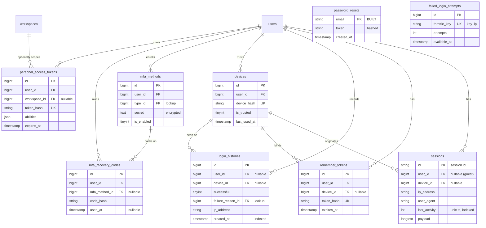

# 04 — Authentication (Domain D3)

Authentication, session, and credential-security tables for HalaOps. This domain
owns everything about **how a user proves who they are and keeps a trusted
session** — server-side sessions, persistent ("remember me") logins, password
resets, the full login-attempt history, known/trusted devices, brute-force
throttling, multi-factor authentication, and API tokens.

These tables reference the **global** `users` table (one identity for the whole
platform — see [00-Database-Bible](00-Database-Bible.md), business rule DB-1).
Authentication is a **user-level** concern, not a tenant concern: a single login
authenticates the person, who then selects an active workspace (tenant) for the
request. Therefore **most tables in this domain are NOT tenant-scoped** and carry
no `workspace_id`. The one exception is `personal_access_tokens`, which MAY be
scoped to a single workspace (a token minted for one tenant's API surface) via a
**nullable** `workspace_id`; a NULL `workspace_id` is a user-global token.

> Status: 1 table BUILT (`password_resets`, migration 0012), 8 tables BLUEPRINT.
> The BUILT `users` table already carries a single `remember_token VARCHAR(100)`
> column and `last_login_at` / `last_login_ip` columns (migration 0001); the
> blueprint **supersedes** the single remember-token column with a dedicated,
> multi-device `remember_tokens` table and records every login in
> `login_histories`. Migrating those columns is a post-approval task, not a new
> duplicate.

## Related Documents

- [00-Database-Bible](00-Database-Bible.md) — the design standard this domain follows
- [99-ERD-Blueprint](99-ERD-Blueprint.md) — the complete cross-domain ERD
- [98-Validation-Report](98-Validation-Report.md) — external-architect review and fixes
- [02-RBAC-Membership](02-RBAC-Membership.md) — D1: roles/permissions/memberships that authorize the authenticated user
- [03-Workspaces-Settings](03-Workspaces-Settings.md) — D2: workspaces (tenant), `workspace_invitations`, `user_settings`
- [01-Lookups-Reference](01-Lookups-Reference.md) — D0: `countries`, `lookup_values`, polymorphic `activity_logs`/`status_histories`
- [11-Files-Queue-Analytics-Logs](11-Files-Queue-Analytics-Logs.md) — D10: `security_logs`, `api_logs` (security/audit event streams that complement this domain)
- Up-stream specs: [../07-RBAC](../07-RBAC.md), [../08-Multi-Tenant](../08-Multi-Tenant.md), [../47-Enterprise-Architecture-Standards](../47-Enterprise-Architecture-Standards.md)

## Security Principles (apply to every table here)

These are domain-wide invariants; per-table notes call out specifics.

- **Never store a plaintext secret.** Every credential-bearing value — remember
  tokens, password-reset tokens, API tokens, MFA recovery codes — is stored as a
  one-way **hash** (SHA-256 of the random token, or a password hash where a slow
  hash is appropriate). The raw value is shown to the client exactly once at
  creation and is never recoverable from the database.
- **MFA shared secrets are reversible-encrypted, not hashed.** A TOTP secret must
  be read back to verify codes, so `mfa_methods.secret` is stored
  **application-encrypted** (e.g. AES-GCM via the app key), never in plaintext and
  never merely hashed.
- **Tokens are long, random, and unique.** Lookups are by the **hash** column,
  which is `UNIQUE` (or part of a unique pair) so a presented token resolves to at
  most one row.
- **Everything expires.** Sessions, remember tokens, reset tokens, and access
  tokens carry an expiry/last-activity column; expired rows are pruned (these are
  append/ephemeral tables — hard-deleted, **no `deleted_at`**).
- **Audit the security-relevant events.** Successes and failures land in
  `login_histories` (this domain) and in the polymorphic `activity_logs` /
  `security_logs` (D0/D10); raw IP and `user_agent` are captured for forensics.
- **Throttle before you authenticate.** `failed_login_attempts` enforces the
  lockout window (`config/auth.php`: `max_login_attempts`, `lockout_seconds`)
  **before** a password is ever checked.

## Configuration anchors (no hard-coded values — see Bible §2)

Already present in `config/auth.php` and honored by this design:

| Key | Value (default) | Used by |
|-----|-----------------|---------|
| `reset_token_ttl` | 60 (minutes) | `password_resets.expires_at` |
| `max_login_attempts` | 5 | `failed_login_attempts.attempts` threshold |
| `lockout_seconds` | 900 | `failed_login_attempts` window / lockout |
| `session_key` | `auth_user_id` | `sessions.payload` (authenticated user id) |
| `tenant_key` | `active_workspace_id` | `sessions.payload` (selected tenant) |

MFA method types (`totp`/`email`/`sms`), device types, and login-failure reasons
are **configurable lookups** (D0 `lookup_values`), referenced by FK — not ENUMs.

---

## Domain ERD

---

## Tables

### 1. `sessions` — BLUEPRINT

Server-side session store. Holds one row per active server session; supports the
product's **"active sessions"** screen (list/revoke current logins) directly via
`last_activity` — **no separate "active_sessions" table is needed**. Sessions are
keyed by the opaque session id the client holds in a cookie.

- **Tenant-scoped?** No (auth is user-level; the selected tenant lives inside
  `payload`). **Soft-delete?** No — sessions are ephemeral and garbage-collected
  by `last_activity`; expired/old rows are hard-deleted.

**Columns**

| column | type | null | default | notes |
|--------|------|------|---------|-------|
| `id` | VARCHAR(128) | no | — | PRIMARY KEY — the opaque session id (random, set in the client cookie). Not the BIGINT surrogate; sessions are looked up by this id. |
| `user_id` | BIGINT UNSIGNED | yes | NULL | FK → `users.id`. NULL while the session is for a pre-auth / guest visitor. |
| `device_id` | BIGINT UNSIGNED | yes | NULL | FK → `devices.id`. The known device this session runs on, if recognized. |
| `ip_address` | VARCHAR(45) | yes | NULL | IPv4/IPv6 of the client (45 chars covers IPv6 + mapped). |
| `user_agent` | VARCHAR(512) | yes | NULL | Raw UA string for the active-sessions display and forensics. |
| `device_label` | VARCHAR(190) | yes | NULL | Human-friendly device/browser summary for the UI (denormalized from UA at write time; the FK to `devices` is the source of truth). |
| `last_activity` | INT UNSIGNED | no | — | Unix timestamp of last request on this session. Drives idle-timeout and the "active now" list. **Indexed.** |
| `payload` | LONGTEXT | no | — | Serialized session bag (includes `auth_user_id`, `active_workspace_id`, CSRF token, flash). Large; excluded from list queries. |

**Keys** — PK: `id` (the session id string). No `uuid` (the session id is itself
the opaque public handle; this is an ephemeral append table, Bible §1 exemption).

**Indexes**

| name | columns | type |
|------|---------|------|
| PRIMARY | `id` | unique |
| `sessions_user_id_index` | `user_id` | index (FK) |
| `sessions_device_id_index` | `device_id` | index (FK) |
| `sessions_last_activity_index` | `last_activity` | index |
| `sessions_user_last_activity_index` | `user_id`, `last_activity` | composite — "list my active sessions, newest first" |

**Foreign keys**

| column | → ref | on delete | on update |
|--------|-------|-----------|-----------|
| `user_id` | `users(id)` | CASCADE | CASCADE |
| `device_id` | `devices(id)` | SET NULL | CASCADE |

**Relationships + cardinality**

- `users` 1—* `sessions` (a user may have many concurrent sessions).
- `devices` 1—* `sessions` (a device can originate many sessions over time).

**Notes** — Single source for "currently logged-in everywhere"; revoking a
session = deleting the row. The selected tenant is carried **inside** `payload`
(key `active_workspace_id`), so the same session can switch workspaces without a new
row — consistent with one global identity (DB-1). Hot reads are by PK (`id`); the
`(user_id, last_activity)` composite serves the per-user active-sessions list. As
session volume scales, prune by `last_activity`; the table is FK-light-friendly
but FKs are cheap here, so they are kept.

---

### 2. `remember_tokens` — BLUEPRINT

Persistent-login ("remember me") tokens. Each long-lived browser/device that
chose "remember me" gets its own row, so the user can stay signed in on, and
selectively revoke, **specific** devices. Supersedes the single
`users.remember_token` column shipped in migration 0001.

- **Tenant-scoped?** No. **Soft-delete?** No — tokens expire and are rotated;
  revoked/expired rows are hard-deleted.

**Columns**

| column | type | null | default | notes |
|--------|------|------|---------|-------|
| `id` | BIGINT UNSIGNED | no | AUTO_INCREMENT | PRIMARY KEY. |
| `uuid` | CHAR(36) | no | — | UNIQUE public id (for the "remembered devices" UI). |
| `user_id` | BIGINT UNSIGNED | no | — | FK → `users.id`. Owner of the token. |
| `device_id` | BIGINT UNSIGNED | yes | NULL | FK → `devices.id`. The device this persistent login is bound to. |
| `selector` | VARCHAR(64) | no | — | Public lookup half of the split-token scheme (sent in cookie alongside the secret). UNIQUE. Enables O(1) lookup without exposing the secret. |
| `token_hash` | VARCHAR(255) | no | — | **Hash** (SHA-256) of the secret validator half. Never plaintext; compared in constant time after `selector` lookup. |
| `ip_address` | VARCHAR(45) | yes | NULL | IP at issuance, for audit. |
| `user_agent` | VARCHAR(512) | yes | NULL | UA at issuance. |
| `last_used_at` | TIMESTAMP | yes | NULL | Updated on each successful silent re-auth (supports rotation). |
| `expires_at` | TIMESTAMP | no | — | Absolute expiry; expired rows rejected and pruned. |
| `created_at` | TIMESTAMP | yes | NULL | |
| `updated_at` | TIMESTAMP | yes | NULL | |

**Keys** — PK: `id`; UNIQUE: `uuid`, `selector`. (Split-token "selector +
hashed validator" pattern avoids a full-table hash scan and resists timing
attacks.)

**Indexes**

| name | columns | type |
|------|---------|------|
| PRIMARY | `id` | unique |
| `remember_tokens_uuid_unique` | `uuid` | unique |
| `remember_tokens_selector_unique` | `selector` | unique |
| `remember_tokens_user_id_index` | `user_id` | index (FK) |
| `remember_tokens_device_id_index` | `device_id` | index (FK) |
| `remember_tokens_expires_at_index` | `expires_at` | index (pruning) |

**Foreign keys**

| column | → ref | on delete | on update |
|--------|-------|-----------|-----------|
| `user_id` | `users(id)` | CASCADE | CASCADE |
| `device_id` | `devices(id)` | SET NULL | CASCADE |

**Relationships + cardinality**

- `users` 1—* `remember_tokens`.
- `devices` 1—* `remember_tokens` (typically 1 active per device, rotated).

**Notes** — Stores only the **hash** of the secret half (security principle:
never store plaintext). On each use the token is rotated (new secret, same/new
row), limiting replay of a stolen cookie. Revoking a remembered device deletes
the row.

---

### 3. `password_resets` — BUILT (migration 0012)

Password-reset tokens: a **hashed** reset token plus expiry, keyed by email. One
active reset per email address. Built exactly as below; the blueprint notes
optional extensions (kept backward-compatible).

- **Tenant-scoped?** No (reset is by email, before any tenant context).
  **Soft-delete?** No — single active row per email; consumed/expired rows are
  deleted.

**Columns (BUILT — current shape, migration 0012)**

| column | type | null | default | notes |
|--------|------|------|---------|-------|
| `email` | VARCHAR(190) | no | — | **PRIMARY KEY**. The account email requesting reset; enforces one active token per email. |
| `token` | VARCHAR(255) | no | — | **Hashed** reset token (never plaintext; raw token emailed once). Looked up by hash. |
| `created_at` | TIMESTAMP | no | CURRENT_TIMESTAMP | Issuance time; expiry derived as `created_at + reset_token_ttl` (60 min, `config/auth.php`). |

**Blueprint extensions (optional, post-approval — additive only)**

| column | type | null | default | notes |
|--------|------|------|---------|-------|
| `expires_at` | TIMESTAMP | yes | NULL | Materialize the expiry instead of deriving from `created_at + ttl` (clearer pruning, per-request TTL). |
| `ip_address` | VARCHAR(45) | yes | NULL | Requesting IP, for abuse detection. |

**Keys** — PK: `email`. No `uuid` and no surrogate `id` in the BUILT table
(reset rows are short-lived and looked up by email/token, never exposed publicly
— a deliberate exemption from Bible §1, acceptable for an ephemeral table).

**Indexes**

| name | columns | type |
|------|---------|------|
| PRIMARY | `email` | unique |
| `password_resets_token_index` | `token` | index — lookup by presented (hashed) token |

**Foreign keys** — **None** (intentional). The row is keyed by raw email, not
`user_id`, so a reset can be requested even when the email maps to no/locked
account without leaking existence, and so the row survives independent of the
user record. Integrity (email → user) is resolved at the app layer on
consumption.

**Relationships + cardinality**

- `users` 0..1 — 0..1 `password_resets` via `email` (logical, not an FK): at most
  one active reset per email; an email may exist with no active reset.

**Notes** — Token stored **hashed** (the migration's docblock states this
explicitly); TTL is **configuration-driven** via `reset_token_ttl`, satisfying
Bible §2 (no hard-coded values). On a successful reset the row is deleted and all
of the user's `sessions` + `remember_tokens` should be revoked (app-layer rule).

---

### 4. `login_histories` — BLUEPRINT

Append-only record of **every login attempt outcome** (success and failure) for
audit, anomaly detection, and the user's "recent activity" / "where you're
signed in from" view. Higher-volume than the rest of this domain.

- **Tenant-scoped?** No (login authenticates the person, pre-tenant).
  **Soft-delete?** No — immutable append log; archived/rolled up by age, never
  edited or soft-deleted.

**Columns**

| column | type | null | default | notes |
|--------|------|------|---------|-------|
| `id` | BIGINT UNSIGNED | no | AUTO_INCREMENT | PRIMARY KEY. |
| `user_id` | BIGINT UNSIGNED | yes | NULL | FK → `users.id`. NULL when the attempt used an unknown email (no user matched) — still recorded for abuse analysis. |
| `device_id` | BIGINT UNSIGNED | yes | NULL | FK → `devices.id`. The device, if recognized. |
| `email_attempted` | VARCHAR(190) | yes | NULL | The email entered, even if no user matched (forensics). |
| `successful` | TINYINT(1) | no | 0 | Outcome flag: 1 = success, 0 = failure. |
| `failure_reason_id` | BIGINT UNSIGNED | yes | NULL | FK → `lookup_values.id` (category `login_failure_reason`: bad_password, locked, mfa_failed, unknown_user…). NULL on success. Config-driven, not an ENUM. |
| `mfa_used` | TINYINT(1) | no | 0 | Whether an MFA challenge was satisfied in this login. |
| `ip_address` | VARCHAR(45) | no | — | Source IP (indexed for "attempts from this IP"). |
| `user_agent` | VARCHAR(512) | yes | NULL | Raw UA. |
| `country_id` | BIGINT UNSIGNED | yes | NULL | FK → `countries.id` (D0). Geo of the IP for the "unusual location" signal. |
| `location_label` | VARCHAR(190) | yes | NULL | Human-readable geo (city/region) resolved from IP at write time. |
| `created_at` | TIMESTAMP | no | CURRENT_TIMESTAMP | When the attempt occurred. **Indexed.** |

**Keys** — PK: `id`. No `uuid` — high-volume append table (Bible §1 exemption);
rows are never addressed individually by a public id.

**Indexes**

| name | columns | type |
|------|---------|------|
| PRIMARY | `id` | unique |
| `login_histories_user_created_index` | `user_id`, `created_at` | composite — primary hot path ("my recent logins"); per the brief, index by user+created_at |
| `login_histories_ip_created_index` | `ip_address`, `created_at` | composite — attempts from an IP over a window |
| `login_histories_successful_index` | `successful` | index — filter failures |
| `login_histories_device_id_index` | `device_id` | index (FK) |
| `login_histories_failure_reason_id_index` | `failure_reason_id` | index (FK) |
| `login_histories_country_id_index` | `country_id` | index (FK) |

**Foreign keys**

| column | → ref | on delete | on update |
|--------|-------|-----------|-----------|
| `user_id` | `users(id)` | SET NULL | CASCADE |
| `device_id` | `devices(id)` | SET NULL | CASCADE |
| `failure_reason_id` | `lookup_values(id)` | RESTRICT | CASCADE |
| `country_id` | `countries(id)` | SET NULL | CASCADE |

**Relationships + cardinality**

- `users` 1—* `login_histories` (a user accrues many login rows).
- `devices` 1—* `login_histories`.
- `lookup_values` 1—* `login_histories` (failure reason).
- `countries` 1—* `login_histories` (geo).

**Notes** — High-ish volume → **narrow rows, no `uuid`, indexed by
`(user_id, created_at)`** as required. FKs are kept here (volume is far below the
billions-scale append tables in Bible §4/§7), but the table is a candidate for
RANGE partitioning by `created_at` (monthly) and age-based archival if a tenant's
traffic makes it large. Distinct from D10 `security_logs`, which captures broader
security events; `login_histories` is the focused authentication-outcome stream.

---

### 5. `devices` — BLUEPRINT

Known / trusted devices per user. A device is fingerprinted on first sign-in;
once the user marks it trusted (or it passes MFA), it can skip step-up MFA and is
listed in "your devices". Referenced by `sessions`, `remember_tokens`, and
`login_histories`.

- **Tenant-scoped?** No. **Soft-delete?** No — a device is forgotten by hard
  delete (revoke); `last_used_at` ages out stale entries.

**Columns**

| column | type | null | default | notes |
|--------|------|------|---------|-------|
| `id` | BIGINT UNSIGNED | no | AUTO_INCREMENT | PRIMARY KEY. |
| `uuid` | CHAR(36) | no | — | UNIQUE public id (the "manage devices" UI). |
| `user_id` | BIGINT UNSIGNED | no | — | FK → `users.id`. Owner. |
| `device_hash` | VARCHAR(128) | no | — | Stable fingerprint (hash of UA + client signals + a device cookie). UNIQUE **per user** (`(user_id, device_hash)`), so the same physical machine maps to one row per user. |
| `name` | VARCHAR(190) | yes | NULL | User-editable label ("My MacBook"). |
| `type_id` | BIGINT UNSIGNED | yes | NULL | FK → `lookup_values.id` (category `device_type`: desktop/mobile/tablet…). Config-driven. |
| `platform` | VARCHAR(60) | yes | NULL | OS/browser family parsed from UA (display only). |
| `ip_address` | VARCHAR(45) | yes | NULL | Last-seen IP. |
| `is_trusted` | TINYINT(1) | no | 0 | 1 = trusted (may skip step-up MFA). |
| `trusted_at` | TIMESTAMP | yes | NULL | When trust was granted. |
| `last_used_at` | TIMESTAMP | yes | NULL | Last successful auth from this device. |
| `created_at` | TIMESTAMP | yes | NULL | First seen. |
| `updated_at` | TIMESTAMP | yes | NULL | |

**Keys** — PK: `id`; UNIQUE: `uuid`, and business-unique `(user_id,
device_hash)`.

**Indexes**

| name | columns | type |
|------|---------|------|
| PRIMARY | `id` | unique |
| `devices_uuid_unique` | `uuid` | unique |
| `devices_user_device_hash_unique` | `user_id`, `device_hash` | unique (composite) — one row per (user, fingerprint) |
| `devices_user_id_index` | `user_id` | index (FK) |
| `devices_type_id_index` | `type_id` | index (FK) |
| `devices_is_trusted_index` | `is_trusted` | index |

**Foreign keys**

| column | → ref | on delete | on update |
|--------|-------|-----------|-----------|
| `user_id` | `users(id)` | CASCADE | CASCADE |
| `type_id` | `lookup_values(id)` | RESTRICT | CASCADE |

**Relationships + cardinality**

- `users` 1—* `devices`.
- `devices` 1—* `sessions`, `devices` 1—* `remember_tokens`, `devices` 1—*
  `login_histories` (a device appears across all three).
- `lookup_values` 1—* `devices` (device type).

**Notes** — `device_hash` is a fingerprint, not a secret, so it is not required to
be hashed for confidentiality; it is stored as a digest for uniformity and index
size. Trust is revocable (set `is_trusted=0` or delete). Deleting a device
SET-NULLs its references in `sessions`/`remember_tokens`/`login_histories`,
preserving the audit trail.

---

### 6. `failed_login_attempts` — BLUEPRINT

Brute-force throttling / lockout counters. One row per **throttle key** (login
identifier + IP) tracking the count within the rolling window; gates
authentication **before** the password is checked. Backs `config/auth.php`
`max_login_attempts` (5) and `lockout_seconds` (900).

- **Tenant-scoped?** No. **Soft-delete?** No — counters are transient; rows are
  reset/deleted when the window passes or on a successful login.

**Columns**

| column | type | null | default | notes |
|--------|------|------|---------|-------|
| `id` | BIGINT UNSIGNED | no | AUTO_INCREMENT | PRIMARY KEY. |
| `throttle_key` | VARCHAR(190) | no | — | The throttle bucket — normalized `email|ip` (or `route|email|ip`). UNIQUE. This is the "key" the brief refers to. |
| `email` | VARCHAR(190) | yes | NULL | The login identifier component (denormalized for inspection/lockout-by-account). |
| `ip_address` | VARCHAR(45) | no | — | The IP component of the bucket. |
| `attempts` | INT UNSIGNED | no | 0 | Failure count in the current window; compared to `max_login_attempts`. |
| `last_attempt_at` | TIMESTAMP | yes | NULL | Timestamp of the most recent failure (window math). |
| `available_at` | TIMESTAMP | yes | NULL | When the key is unlocked again (`last_attempt_at + lockout_seconds` once the threshold trips). NULL while not locked. |
| `created_at` | TIMESTAMP | yes | NULL | When the window/bucket opened. |
| `updated_at` | TIMESTAMP | yes | NULL | |

**Keys** — PK: `id`; UNIQUE: `throttle_key` (the bucket). No `uuid` — internal
throttling table, never publicly addressed (Bible §1 exemption for an ephemeral
table).

**Indexes**

| name | columns | type |
|------|---------|------|
| PRIMARY | `id` | unique |
| `failed_login_attempts_throttle_key_unique` | `throttle_key` | unique — single counter per bucket |
| `failed_login_attempts_ip_address_index` | `ip_address` | index — block an IP across accounts |
| `failed_login_attempts_available_at_index` | `available_at` | index — find/prune expired lockouts |

**Foreign keys** — **None** (intentional). Keyed by `email`/`ip`, not `user_id`,
so attempts against non-existent or locked accounts are still throttled without
leaking account existence and without a dependency on a user row.

**Relationships + cardinality**

- Logical only: a throttle key relates to at most one account (`email`) and one
  IP; no hard relational link. Pairs with `login_histories` (which records each
  individual failure event; this table holds the **aggregate** counter).

**Notes** — Distinct responsibilities: `login_histories` = the immutable per-event
log; `failed_login_attempts` = the mutable rolling counter that enforces the
lockout. On a successful authentication the matching bucket is cleared. Window and
threshold are **config-driven** (Bible §2). Could be served from a cache/Redis in
production; modeled as a table here for the durable blueprint.

---

### 7. `mfa_methods` — BLUEPRINT (future MFA)

Enrolled multi-factor methods per user: TOTP authenticator, email OTP, or SMS
OTP. The shared secret for a method is stored **encrypted** (reversible — it must
be read to verify codes), never plaintext, never merely hashed.

- **Tenant-scoped?** No. **Soft-delete?** No — an unenrolled method is hard
  deleted; `is_enabled` toggles activation without deletion.

**Columns**

| column | type | null | default | notes |
|--------|------|------|---------|-------|
| `id` | BIGINT UNSIGNED | no | AUTO_INCREMENT | PRIMARY KEY. |
| `uuid` | CHAR(36) | no | — | UNIQUE public id. |
| `user_id` | BIGINT UNSIGNED | no | — | FK → `users.id`. Owner. |
| `type_id` | BIGINT UNSIGNED | no | — | FK → `lookup_values.id` (category `mfa_method_type`: totp/email/sms). Config-driven, not an ENUM. |
| `label` | VARCHAR(120) | yes | NULL | User label ("Authy", "work phone"). |
| `secret` | TEXT | yes | NULL | **Application-encrypted** TOTP shared secret (AES-GCM via app key). NULL for email/sms methods that derive OTPs per-challenge. Never plaintext, never hashed. |
| `destination` | VARCHAR(190) | yes | NULL | For email/sms: the (optionally encrypted) target address/number; for totp: NULL. |
| `is_enabled` | TINYINT(1) | no | 0 | 1 once enrollment is confirmed (a code was verified). |
| `is_primary` | TINYINT(1) | no | 0 | The default method to challenge first. |
| `confirmed_at` | TIMESTAMP | yes | NULL | When enrollment was verified. |
| `last_used_at` | TIMESTAMP | yes | NULL | Last successful challenge. |
| `created_at` | TIMESTAMP | yes | NULL | |
| `updated_at` | TIMESTAMP | yes | NULL | |

**Keys** — PK: `id`; UNIQUE: `uuid`. Business rule: at most one `is_primary=1`
per user (enforced app-side; optionally a partial/generated-column unique).

**Indexes**

| name | columns | type |
|------|---------|------|
| PRIMARY | `id` | unique |
| `mfa_methods_uuid_unique` | `uuid` | unique |
| `mfa_methods_user_id_index` | `user_id` | index (FK) |
| `mfa_methods_type_id_index` | `type_id` | index (FK) |
| `mfa_methods_user_enabled_index` | `user_id`, `is_enabled` | composite — "this user's active methods" |

**Foreign keys**

| column | → ref | on delete | on update |
|--------|-------|-----------|-----------|
| `user_id` | `users(id)` | CASCADE | CASCADE |
| `type_id` | `lookup_values(id)` | RESTRICT | CASCADE |

**Relationships + cardinality**

- `users` 1—* `mfa_methods` (a user can enroll several methods).
- `mfa_methods` 1—* `mfa_recovery_codes` (recovery codes generated for a method
  enrollment).
- `lookup_values` 1—* `mfa_methods` (method type).

**Notes** — Future feature, modeled now so the blueprint is MFA-ready (Bible §8,
multi-* future). Security: the **TOTP secret is encrypted, not hashed** (it must
be reversible to compute the current code) — this is the one place in the domain
where a credential is encrypted rather than hashed, and it is called out
deliberately. Method types are config-driven lookups so adding "webauthn/passkey"
later is data, not schema.

---

### 8. `mfa_recovery_codes` — BLUEPRINT (future MFA)

Single-use backup codes that let a user authenticate when their primary MFA
factor is unavailable. Each code is stored **hashed**; a code is invalidated by
stamping `used_at`.

- **Tenant-scoped?** No. **Soft-delete?** No — consumed codes are kept (with
  `used_at`) for audit until the set is regenerated, then the old set is deleted.

**Columns**

| column | type | null | default | notes |
|--------|------|------|---------|-------|
| `id` | BIGINT UNSIGNED | no | AUTO_INCREMENT | PRIMARY KEY. |
| `uuid` | CHAR(36) | no | — | UNIQUE public id. |
| `user_id` | BIGINT UNSIGNED | no | — | FK → `users.id`. Owner. |
| `mfa_method_id` | BIGINT UNSIGNED | yes | NULL | FK → `mfa_methods.id`. The enrollment this set backs up (NULL = account-level codes not tied to one method). |
| `code_hash` | VARCHAR(255) | no | — | **Hash** of the single-use code (never plaintext; the set is shown once at generation). |
| `used_at` | TIMESTAMP | yes | NULL | When consumed; NULL = still valid. Single-use: set on first successful use. |
| `created_at` | TIMESTAMP | yes | NULL | Generation time (a batch shares it). |
| `updated_at` | TIMESTAMP | yes | NULL | |

**Keys** — PK: `id`; UNIQUE: `uuid`, and `(user_id, code_hash)` (a given code
hash is unique within a user's set).

**Indexes**

| name | columns | type |
|------|---------|------|
| PRIMARY | `id` | unique |
| `mfa_recovery_codes_uuid_unique` | `uuid` | unique |
| `mfa_recovery_codes_user_code_unique` | `user_id`, `code_hash` | unique (composite) |
| `mfa_recovery_codes_user_id_index` | `user_id` | index (FK) |
| `mfa_recovery_codes_mfa_method_id_index` | `mfa_method_id` | index (FK) |

**Foreign keys**

| column | → ref | on delete | on update |
|--------|-------|-----------|-----------|
| `user_id` | `users(id)` | CASCADE | CASCADE |
| `mfa_method_id` | `mfa_methods(id)` | CASCADE | CASCADE |

**Relationships + cardinality**

- `users` 1—* `mfa_recovery_codes` (a user holds a set, typically 8–10).
- `mfa_methods` 1—* `mfa_recovery_codes` (codes generated alongside an
  enrollment).

**Notes** — Codes stored **hashed** (security principle). Single-use enforced by
`used_at`. Regenerating recovery codes deletes the prior set and inserts a new
one. CASCADE from both `users` and `mfa_methods` keeps codes from outliving the
factor/identity they protect.

---

### 9. `personal_access_tokens` — BLUEPRINT

Long-lived API tokens a user mints for programmatic access (CLI, integrations).
The only table in this domain that **MAY** be tenant-scoped: a token can be
bound to a single workspace via a **nullable** `workspace_id` (NULL = a user-global
token spanning the user's memberships). The token itself is stored **hashed**;
scopes are a JSON ability list.

- **Tenant-scoped?** Optional — nullable `workspace_id`. **Soft-delete?** No —
  tokens are revoked by hard delete; `expires_at` ages them out.

**Columns**

| column | type | null | default | notes |
|--------|------|------|---------|-------|
| `id` | BIGINT UNSIGNED | no | AUTO_INCREMENT | PRIMARY KEY. |
| `uuid` | CHAR(36) | no | — | UNIQUE public id (the "API tokens" UI). |
| `user_id` | BIGINT UNSIGNED | no | — | FK → `users.id`. The owner/principal the token acts as. |
| `workspace_id` | BIGINT UNSIGNED | yes | NULL | FK → `workspaces.id`. **NULL** = user-global token; non-NULL = token scoped to that single tenant's API surface. |
| `name` | VARCHAR(190) | no | — | User-given token name (display only). |
| `token_hash` | VARCHAR(64) | no | — | **UNIQUE** SHA-256 hash of the random token (raw value shown once at creation, never stored). Lookups resolve by this hash. |
| `abilities` | JSON | yes | NULL | Granted scopes/abilities (e.g. `["jobs:read","interviews:read"]`); `["*"]` = all. App-enforced against RBAC. |
| `last_used_at` | TIMESTAMP | yes | NULL | Updated on each authenticated request (rate-limited write). |
| `expires_at` | TIMESTAMP | yes | NULL | Absolute expiry; NULL = non-expiring (discouraged). Expired tokens rejected and pruned. |
| `revoked_at` | TIMESTAMP | yes | NULL | When manually revoked (kept briefly for audit before deletion). |
| `created_at` | TIMESTAMP | yes | NULL | |
| `updated_at` | TIMESTAMP | yes | NULL | |

**Keys** — PK: `id`; UNIQUE: `uuid`, `token_hash`.

**Indexes**

| name | columns | type |
|------|---------|------|
| PRIMARY | `id` | unique |
| `personal_access_tokens_uuid_unique` | `uuid` | unique |
| `personal_access_tokens_token_hash_unique` | `token_hash` | unique — primary auth lookup |
| `personal_access_tokens_user_id_index` | `user_id` | index (FK) |
| `personal_access_tokens_workspace_id_index` | `workspace_id` | index (FK) |
| `personal_access_tokens_user_workspace_index` | `user_id`, `workspace_id` | composite — "this user's tokens for a workspace" |
| `personal_access_tokens_expires_at_index` | `expires_at` | index (pruning) |

**Foreign keys**

| column | → ref | on delete | on update |
|--------|-------|-----------|-----------|
| `user_id` | `users(id)` | CASCADE | CASCADE |
| `workspace_id` | `workspaces(id)` | CASCADE | CASCADE |

**Relationships + cardinality**

- `users` 1—* `personal_access_tokens`.
- `workspaces` 1—* `personal_access_tokens` (optional scope; many tokens may target
  one workspace, or none when `workspace_id` is NULL).

**Notes** — Token stored **hashed**, `token_hash` is **UNIQUE** so a presented
token maps to at most one row (per the brief). `abilities` is JSON to keep scopes
flexible without schema changes; effective permission is the **intersection** of
`abilities` and the user's RBAC/membership rights in the target workspace (D1/D2).
Because `workspace_id` is the only tenant pointer in this domain, deleting a workspace
CASCADEs its scoped tokens; user-global tokens (`workspace_id` NULL) are unaffected.

---

## Domain notes & cross-cutting concerns

- **Why mostly non-tenant-scoped.** Authentication establishes *who the person
  is*; authorization within a tenant happens afterward via D1 (RBAC) and D2
  (memberships). Putting `workspace_id` on `sessions`/`devices`/etc. would
  contradict one-global-identity (DB-1) and the single-login-multi-tenant model.
  Only `personal_access_tokens` carries an (optional) `workspace_id`, because an API
  token can legitimately be issued for one tenant's surface.
- **No soft deletes here.** Per Bible §5, sessions/logs/append and ephemeral
  credential rows are hard-deleted/expired, not soft-deleted — so **none** of
  these tables has `deleted_at`. They are pruned by `last_activity`/`expires_at`/
  age.
- **Hashing vs encryption.** Tokens (remember, reset, API, recovery codes) are
  **hashed** (one-way). The TOTP secret in `mfa_methods.secret` is
  **encrypted** (reversible) because verification needs the cleartext secret —
  the single intentional exception, flagged for security sign-off.
- **Audit linkage.** Security events also flow to the polymorphic `activity_logs`
  (D0) and `security_logs` (D10); `login_histories` is the authentication-specific
  stream and the source for "recent sign-in activity".
- **Scale.** Only `login_histories` is "high-ish" volume; it is narrow, omits
  `uuid`, is indexed by `(user_id, created_at)`, and is a partitioning/archival
  candidate. `sessions` is read-hot by PK and prunes by `last_activity`. The rest
  are small per-user tables.

## Assumptions & open questions

- **A1.** `password_resets` is documented in its BUILT shape (PK `email`, hashed
  `token`, `created_at`); blueprint extensions (`expires_at`, `ip_address`) are
  marked **optional/additive** and not assumed present.
- **A2.** The BUILT `users.remember_token` / `last_login_at` / `last_login_ip`
  columns are treated as **superseded** by `remember_tokens` and
  `login_histories`; reconciling them (drop column vs keep as cache) is a
  post-approval migration decision, not settled here.
- **A3.** `sessions.id` is modeled as a VARCHAR session-id PK (framework session
  store), not a BIGINT surrogate, since sessions are looked up by the cookie id —
  flagged in case the blueprint prefers a uniform BIGINT+`uuid` shape.
- **OQ1.** Should `failed_login_attempts` (and possibly `sessions`) live in Redis
  in production rather than MySQL? Modeled as durable tables here; confirm the
  storage backend at implementation.
- **OQ2.** `login_failure_reason`, `device_type`, and `mfa_method_type` are
  assumed to be D0 `lookup_values` categories. Confirm category keys when D0 is
  finalized (or whether `mfa_method_type` warrants a dedicated tiny catalog).
- **OQ3.** WebAuthn/passkeys are accommodated by adding a `mfa_method_type`
  lookup value plus a credential column set; deferred — confirm whether passkeys
  get their own table in a later revision.
