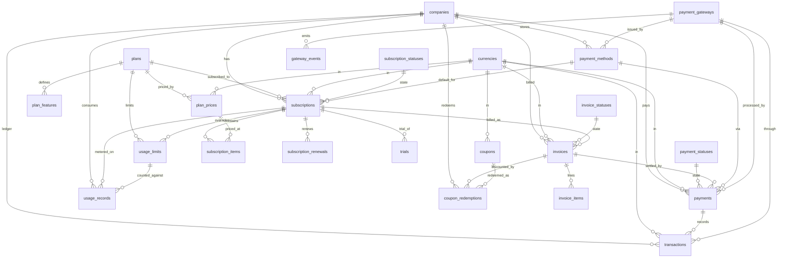

# 05 — Subscriptions & Billing (Domain D4)

This document is the FINAL BLUEPRINT for the HalaOps **Subscriptions & Billing**
domain (D4). It covers everything from the plan catalog through subscriptions,
trials, invoicing, payments, the immutable transaction ledger, multi-gateway
integration, coupons, and metered usage. It follows the §9 per-table format of
the [00-Database-Bible](00-Database-Bible.md) and the `DB_DESIGN_CONTEXT`
authoritative anchor conventions.

**DESIGN ONLY — no migrations, no code.** Tables already shipped in migrations
0001–0016 are marked **BUILT**; everything else is **BLUEPRINT** (the target the
implementation migrates toward).

Two tables in this domain are **BUILT** (`plans`, `subscriptions`, migrations
0009/0010, with `uuid`/`deleted_at` added by 0016). The blueprint **extends**
both: status ENUMs become config-driven status FK tables, `currency VARCHAR(3)`
becomes `currency_id` FK → `currencies`, money widens to `DECIMAL(12,2)`, and the
embedded `features`/`limits`/`price` JSON is normalized into the child tables
`plan_features`, `plan_prices`, and `usage_limits`. The remaining 18 tables are
**BLUEPRINT**.

## Related Documents

- [00-Database-Bible](00-Database-Bible.md) — the authoritative standard & inventory
- [99-ERD-Blueprint](99-ERD-Blueprint.md) — the complete cross-domain ERD
- [98-Validation-Report](98-Validation-Report.md) — external-architect review & fixes
- [01-Lookups-Reference](01-Lookups-Reference.md) — `currencies`, `lookup_values`, `attachments`, `notes`, `status_histories` (referenced here)
- [02-RBAC-Membership](02-RBAC-Membership.md) — `memberships`, actor `users`
- [03-Companies-Settings](03-Companies-Settings.md) — `companies` (tenant anchor), `company_billing`
- [04-Authentication](04-Authentication.md) — actors
- [11-Files-Queue-Analytics-Logs](11-Files-Queue-Analytics-Logs.md) — `billing_logs`, `usage_analytics`, `files` (PDF invoices via `attachments`)

## Domain Summary

The billing domain answers four questions: **what can be sold** (`plans` +
`plan_features` + `plan_prices`), **what a tenant bought** (`subscriptions` +
`subscription_items` + `trials` + `subscription_renewals`), **what they owe and
paid** (`invoices` + `invoice_items`, `payments`, `transactions`,
`payment_methods`), and **how money moves** (`payment_gateways`,
`gateway_events`, `coupons`/`coupon_redemptions`). Metered consumption is tracked
in `usage_records` against `usage_limits`.

Design pillars (all from the Bible):

- **Data-driven plans.** Adding a plan is an `INSERT`, never a code change. The
  product ships with **one public plan — 50 SAR / month** — but the schema
  supports an *unlimited* number of plans, features, and prices. Feature gating
  lives in `plan_features` (one row per feature flag/limit) rather than code.
- **Multi-currency / multi-interval.** Price is NOT a column on `plans`; it lives
  in `plan_prices` as `(amount DECIMAL(12,2), currency_id → currencies, interval,
  interval_count)` so the same plan can be sold at 50 SAR/month, 540 SAR/year,
  USD, etc. Default ship price = 50.00 SAR, monthly.
- **Config-driven statuses (NO enums).** `subscription_statuses`,
  `invoice_statuses`, and `payment_statuses` are status tables (Bible §2 shape)
  with `company_id` NULL = system default / non-null = tenant override. Entities
  reference `*_status_id` FK (RESTRICT). The BUILT ENUM columns are replaced.
- **Immutable ledger.** `transactions` is an append-only double-entry-style
  ledger: every money event (charge, capture, refund, chargeback, payout,
  adjustment) is one immutable row. Rows are never updated or deleted; a
  correction is a new compensating row. No `deleted_at`.
- **Multi-gateway.** `payment_gateways` is a catalog (Moyasar, Tap, HyperPay,
  Stripe, manual/offline). `gateway_events` stores raw inbound webhooks and is
  **idempotent** (unique on gateway + external event id) so retries are safe.
- **Money standard.** Every monetary amount is `DECIMAL(12,2)` paired with a
  `currency_id` FK → `currencies` (Bible §8). No floats, no bare currency codes.
- **VAT / KSA tax.** KSA standard VAT is **15%**. Tax is stored explicitly per
  invoice line (`tax_rate`, `tax_amount`) and rolled up on the invoice
  (`subtotal_amount`, `tax_amount`, `discount_amount`, `total_amount`). Rates are
  data (column + future `tax_rates` lookup), never hard-coded, so a rate change
  or zero-rated/exempt customer is a data change. Each invoice snapshots the
  seller VAT number and buyer VAT number to satisfy ZATCA e-invoicing.

### Conventions applied in this domain

- Base columns on every table: `id` BIGINT UNSIGNED PK AI, `uuid` CHAR(36) UNIQUE
  (public id), `created_at`, `updated_at`. `deleted_at` only on soft-deletable
  business entities (plans, subscriptions, invoices, payment_methods, coupons,
  trials). Ledger/event/pivot/usage rows are append-only (no soft delete).
- Tenant tables carry `company_id` BIGINT UNSIGNED NOT NULL, FK → companies,
  indexed. `plans`, `plan_features`, `plan_prices`, the three `*_statuses`
  defaults, `payment_gateways`, and `coupons` (global) are **not** tenant-scoped
  (catalog / system rows); `coupons` is global with optional tenant scope.
- `created_by` / `updated_by` BIGINT UNSIGNED NULL FK → users (SET NULL) on
  human-authored entities (coupons, manual invoices/payments, plan edits).
- Every FK column is indexed; hot paths get composites
  (`company_id,*_status_id`, `company_id,created_at`).
- ON DELETE: CASCADE for owned children inside a tenant; RESTRICT for catalog
  refs (plans, currencies, statuses, gateways); SET NULL for optional actors.
  ON UPDATE CASCADE everywhere.

---

## Domain ERD

---

## §9 Table Specifications

### 1. `plans` — BUILT (migration 0009, extended by 0016)

Global catalog of subscription plans. Data-driven: a new plan is an `INSERT`.
**Tenant-scoped?** No (global catalog). **Soft delete?** Yes (`deleted_at`).

> **BUILT vs BLUEPRINT.** Shipped columns: `id, name, slug, description, price,
> currency, interval, trial_days, features, limits, is_active, is_public,
> sort_order, created_at, updated_at`; `uuid` + `deleted_at` added by 0016. The
> blueprint **deprecates** the embedded `price`/`currency`/`interval` (→
> `plan_prices`), `features`/`limits` JSON (→ `plan_features` + `usage_limits`),
> and `trial_days` (→ moved to `plan_prices`/`trials`). They remain for backward
> compatibility until cutover; new columns below are additive.

| column | type | null | default | notes |
|---|---|---|---|---|
| id | BIGINT UNSIGNED | no | AI | PK |
| uuid | CHAR(36) | no | — | public id (added 0016) |
| name | VARCHAR(120) | no | — | display name |
| slug | VARCHAR(120) | no | — | URL key, UNIQUE |
| description | VARCHAR(500) | yes | NULL | marketing blurb |
| price | DECIMAL(10,2) | no | 0.00 | **BUILT, deprecated** → `plan_prices` |
| currency | VARCHAR(3) | no | 'SAR' | **BUILT, deprecated** → `plan_prices.currency_id` |
| interval | ENUM('monthly','yearly') | no | 'monthly' | **BUILT, deprecated** → `plan_prices.interval` |
| trial_days | INT | no | 0 | **BUILT, deprecated** → `plan_prices.trial_days` |
| features | JSON | yes | NULL | **BUILT, deprecated** → `plan_features` |
| limits | JSON | yes | NULL | **BUILT, deprecated** → `usage_limits` |
| code | VARCHAR(60) | yes | NULL | **(blueprint)** stable machine key (e.g. `standard`) |
| tier | INT | no | 0 | **(blueprint)** ordering/upgrade rank |
| is_active | TINYINT(1) | no | 1 | sellable |
| is_public | TINYINT(1) | no | 1 | shown on pricing page |
| is_default | TINYINT(1) | no | 0 | **(blueprint)** the plan a new tenant lands on |
| sort_order | INT | no | 0 | display order |
| metadata | JSON | yes | NULL | **(blueprint)** free-form |
| created_at | TIMESTAMP | yes | NULL | |
| updated_at | TIMESTAMP | yes | NULL | |
| deleted_at | TIMESTAMP | yes | NULL | soft delete (added 0016) |

- **Keys:** PK `id`; UNIQUE `uuid`; UNIQUE `slug`; UNIQUE `code` (blueprint).
- **Indexes:** `plans_slug_unique` (unique), `plans_uuid_unique` (unique),
  `plans_is_active_index` (index), `plans_deleted_at_index` (index),
  `plans_is_public_sort_order_index` (composite).
- **Foreign keys:** none (global catalog).
- **Relationships:** plan 1—* plan_features; plan 1—* plan_prices; plan 1—*
  subscriptions; plan 1—* usage_limits.
- **Notes:** Ships with exactly one row (Standard, 50 SAR/month via
  `plan_prices`); unlimited additional plans supported with zero code change.

### 2. `plan_features` — BLUEPRINT

Normalized feature flags / numeric entitlements per plan (replaces `plans.features`
JSON). One row per feature key per plan. **Tenant-scoped?** No. **Soft delete?** No.

| column | type | null | default | notes |
|---|---|---|---|---|
| id | BIGINT UNSIGNED | no | AI | PK |
| uuid | CHAR(36) | no | — | public id |
| plan_id | BIGINT UNSIGNED | no | — | FK → plans |
| feature_key | VARCHAR(80) | no | — | e.g. `ai_interviews`, `team_seats`, `branding` |
| label | VARCHAR(150) | yes | NULL | human label |
| value_type | VARCHAR(20) | no | 'boolean' | `boolean`\|`int`\|`string` (lookup-backed) |
| value | VARCHAR(255) | yes | NULL | flag/limit value (`1`, `50`, `unlimited`) |
| is_highlighted | TINYINT(1) | no | 0 | feature emphasized on pricing page |
| sort_order | INT | no | 0 | display order |
| created_at | TIMESTAMP | yes | NULL | |
| updated_at | TIMESTAMP | yes | NULL | |

- **Keys:** PK `id`; UNIQUE `uuid`; UNIQUE (`plan_id`,`feature_key`).
- **Indexes:** `plan_features_uuid_unique` (unique),
  `plan_features_plan_feature_unique` (unique composite),
  `plan_features_plan_id_index` (index FK).
- **Foreign keys:** `plan_id` → `plans(id)` ON DELETE CASCADE ON UPDATE CASCADE.
- **Relationships:** plan 1—* plan_features.
- **Notes:** Numeric *enforced* limits with per-company overrides live in
  `usage_limits`; `plan_features` is the marketing/feature-flag surface. Keep
  both in sync at the app layer.

### 3. `plan_prices` — BLUEPRINT

Multi-currency / multi-interval price book for plans (replaces `plans.price`,
`plans.currency`, `plans.interval`). **Tenant-scoped?** No. **Soft delete?** No
(deactivate via `is_active`).

| column | type | null | default | notes |
|---|---|---|---|---|
| id | BIGINT UNSIGNED | no | AI | PK |
| uuid | CHAR(36) | no | — | public id |
| plan_id | BIGINT UNSIGNED | no | — | FK → plans |
| currency_id | BIGINT UNSIGNED | no | — | FK → currencies |
| amount | DECIMAL(12,2) | no | 0.00 | price (tax-exclusive) — ship row = 50.00 |
| interval | VARCHAR(20) | no | 'month' | `day`\|`week`\|`month`\|`year` (config) |
| interval_count | SMALLINT UNSIGNED | no | 1 | e.g. 1 month, 3 months |
| trial_days | INT | no | 0 | trial granted for this price |
| gateway_price_ref | VARCHAR(191) | yes | NULL | external price/plan id at the gateway |
| is_active | TINYINT(1) | no | 1 | purchasable |
| is_default | TINYINT(1) | no | 0 | default price for the plan |
| created_at | TIMESTAMP | yes | NULL | |
| updated_at | TIMESTAMP | yes | NULL | |

- **Keys:** PK `id`; UNIQUE `uuid`; UNIQUE
  (`plan_id`,`currency_id`,`interval`,`interval_count`).
- **Indexes:** `plan_prices_uuid_unique` (unique),
  `plan_prices_plan_currency_interval_unique` (unique composite),
  `plan_prices_plan_id_index`, `plan_prices_currency_id_index` (FK indexes),
  `plan_prices_is_active_index`.
- **Foreign keys:** `plan_id` → `plans(id)` CASCADE; `currency_id` →
  `currencies(id)` RESTRICT. ON UPDATE CASCADE.
- **Relationships:** plan 1—* plan_prices; currency 1—* plan_prices; plan_price
  1—* subscription_items.
- **Notes:** Ship seed = (Standard, SAR, 50.00, month, 1). Amounts are
  tax-exclusive; VAT is computed on the invoice. Adding USD/yearly = `INSERT`s.

### 4. `subscriptions` — BUILT (migration 0010, extended by 0016)

A company's subscription to a plan; tracks lifecycle and the billing window.
**Tenant-scoped?** Yes. **Soft delete?** Yes (`deleted_at`, added 0016).

> **BUILT vs BLUEPRINT.** Shipped: `id, company_id, plan_id, status ENUM, amount
> DECIMAL(10,2), currency VARCHAR(3), trial_ends_at, starts_at, ends_at,
> canceled_at, created_at, updated_at`; `uuid`+`deleted_at` added by 0016. The
> blueprint replaces `status` ENUM → `subscription_status_id` FK, `currency`
> VARCHAR(3) → `currency_id` FK, widens `amount` to DECIMAL(12,2), and adds the
> billing-cycle and gateway columns below.

| column | type | null | default | notes |
|---|---|---|---|---|
| id | BIGINT UNSIGNED | no | AI | PK |
| uuid | CHAR(36) | no | — | public id (added 0016) |
| company_id | BIGINT UNSIGNED | no | — | FK → companies (tenant) |
| plan_id | BIGINT UNSIGNED | no | — | FK → plans |
| plan_price_id | BIGINT UNSIGNED | yes | NULL | **(blueprint)** FK → plan_prices (chosen price) |
| status | ENUM(...) | no | 'trialing' | **BUILT, deprecated** → `subscription_status_id` |
| subscription_status_id | BIGINT UNSIGNED | yes | NULL | **(blueprint)** FK → subscription_statuses |
| amount | DECIMAL(10,2)→(12,2) | no | 0.00 | snapshot price at subscribe time |
| currency | VARCHAR(3) | no | 'SAR' | **BUILT, deprecated** → `currency_id` |
| currency_id | BIGINT UNSIGNED | yes | NULL | **(blueprint)** FK → currencies |
| payment_method_id | BIGINT UNSIGNED | yes | NULL | **(blueprint)** FK → payment_methods (default) |
| coupon_id | BIGINT UNSIGNED | yes | NULL | **(blueprint)** FK → coupons (applied) |
| quantity | INT UNSIGNED | no | 1 | seats/units (sums `subscription_items`) |
| gateway_subscription_ref | VARCHAR(191) | yes | NULL | external subscription id |
| trial_ends_at | TIMESTAMP | yes | NULL | trial boundary |
| current_period_start | TIMESTAMP | yes | NULL | **(blueprint)** active cycle start |
| current_period_end | TIMESTAMP | yes | NULL | **(blueprint)** active cycle / next renewal |
| starts_at | TIMESTAMP | yes | NULL | subscription start |
| ends_at | TIMESTAMP | yes | NULL | end (cancellation effective) |
| canceled_at | TIMESTAMP | yes | NULL | when canceled |
| cancel_at_period_end | TIMESTAMP/TINYINT | yes | 0 | **(blueprint)** cancel scheduled |
| created_at | TIMESTAMP | yes | NULL | |
| updated_at | TIMESTAMP | yes | NULL | |
| deleted_at | TIMESTAMP | yes | NULL | soft delete (added 0016) |

- **Keys:** PK `id`; UNIQUE `uuid`. (A tenant may hold historical subscriptions;
  the *one active* rule is enforced at the app layer, optionally a partial/unique
  index on (`company_id`) WHERE active.)
- **Indexes:** `subscriptions_uuid_unique` (unique),
  `subscriptions_company_id_index`, `subscriptions_plan_id_index`,
  `subscriptions_plan_price_id_index`, `subscriptions_status_id_index`,
  `subscriptions_currency_id_index`, `subscriptions_payment_method_id_index`,
  `subscriptions_coupon_id_index` (FK indexes), `subscriptions_status_index`
  (BUILT, ENUM — dropped at cutover), `subscriptions_deleted_at_index`,
  `subscriptions_company_status_index` (composite `company_id,subscription_status_id`),
  `subscriptions_current_period_end_index` (renewal sweep).
- **Foreign keys:** `company_id` → `companies(id)` **CASCADE** (BUILT); `plan_id`
  → `plans(id)` **RESTRICT** (BUILT); `plan_price_id` → `plan_prices(id)`
  RESTRICT; `subscription_status_id` → `subscription_statuses(id)` RESTRICT;
  `currency_id` → `currencies(id)` RESTRICT; `payment_method_id` →
  `payment_methods(id)` SET NULL; `coupon_id` → `coupons(id)` SET NULL.
  ON UPDATE CASCADE.
- **Relationships:** company 1—* subscriptions; plan 1—* subscriptions;
  subscription 1—* subscription_items; subscription 1—* invoices; subscription
  1—* subscription_renewals; subscription 1—1/—* trials; subscription 1—*
  usage_records; subscription 1—* usage_limits (overrides).
- **Notes:** Amount/currency are **snapshotted** from the plan price at subscribe
  time so later price changes never retroactively alter an active subscription.
  Status changes are also written to polymorphic `status_histories`
  (subject_type='subscription').

### 5. `subscription_items` — BLUEPRINT

Line items of a subscription (one per priced component — base seat, add-ons,
metered features). Supports multi-line/quantity billing. **Tenant-scoped?** Yes.
**Soft delete?** No (lifecycle follows parent).

| column | type | null | default | notes |
|---|---|---|---|---|
| id | BIGINT UNSIGNED | no | AI | PK |
| uuid | CHAR(36) | no | — | public id |
| company_id | BIGINT UNSIGNED | no | — | FK → companies (denormalized tenant) |
| subscription_id | BIGINT UNSIGNED | no | — | FK → subscriptions |
| plan_price_id | BIGINT UNSIGNED | yes | NULL | FK → plan_prices |
| feature_key | VARCHAR(80) | yes | NULL | matches plan_features (add-on/metered) |
| description | VARCHAR(255) | yes | NULL | line label |
| quantity | INT UNSIGNED | no | 1 | units/seats |
| unit_amount | DECIMAL(12,2) | no | 0.00 | snapshot per-unit price |
| currency_id | BIGINT UNSIGNED | no | — | FK → currencies |
| is_metered | TINYINT(1) | no | 0 | billed by usage_records |
| created_at | TIMESTAMP | yes | NULL | |
| updated_at | TIMESTAMP | yes | NULL | |

- **Keys:** PK `id`; UNIQUE `uuid`.
- **Indexes:** `subscription_items_uuid_unique` (unique),
  `subscription_items_company_id_index`, `subscription_items_subscription_id_index`,
  `subscription_items_plan_price_id_index`, `subscription_items_currency_id_index`.
- **Foreign keys:** `company_id` → `companies(id)` CASCADE; `subscription_id` →
  `subscriptions(id)` CASCADE; `plan_price_id` → `plan_prices(id)` RESTRICT;
  `currency_id` → `currencies(id)` RESTRICT. ON UPDATE CASCADE.
- **Relationships:** subscription 1—* subscription_items; plan_price 1—*
  subscription_items.
- **Notes:** Enables seat-based / add-on billing without schema change. Metered
  items reconcile against `usage_records` at period close.

### 6. `subscription_statuses` — BLUEPRINT (config-driven status table)

Lifecycle states for subscriptions (replaces the BUILT ENUM). Bible §2 shape.
**Tenant-scoped?** Optional (`company_id` NULL = system default; non-null =
tenant custom). **Soft delete?** No.

| column | type | null | default | notes |
|---|---|---|---|---|
| id | BIGINT UNSIGNED | no | AI | PK |
| uuid | CHAR(36) | no | — | public id |
| company_id | BIGINT UNSIGNED | yes | NULL | NULL = system default, else tenant custom |
| key | VARCHAR(60) | no | — | `trialing`,`active`,`past_due`,`canceled`,`expired`,`paused` |
| label | VARCHAR(120) | no | — | display |
| color | VARCHAR(20) | yes | NULL | UI badge |
| sort_order | INT | no | 0 | ordering |
| is_default | TINYINT(1) | no | 0 | default selection |
| is_initial | TINYINT(1) | no | 0 | entry state |
| is_terminal | TINYINT(1) | no | 0 | end state (canceled/expired) |
| is_system | TINYINT(1) | no | 0 | seeded, non-deletable |
| created_at | TIMESTAMP | yes | NULL | |
| updated_at | TIMESTAMP | yes | NULL | |

- **Keys:** PK `id`; UNIQUE `uuid`; UNIQUE (`company_id`,`key`).
- **Indexes:** `subscription_statuses_uuid_unique` (unique),
  `subscription_statuses_company_key_unique` (unique composite),
  `subscription_statuses_company_id_index`.
- **Foreign keys:** `company_id` → `companies(id)` CASCADE ON UPDATE CASCADE.
- **Relationships:** subscription_status 1—* subscriptions.
- **Notes:** Seeded system rows mirror the BUILT ENUM values plus `paused`; no
  ENUM anywhere. `subscriptions.subscription_status_id` RESTRICTs against this.

### 7. `subscription_renewals` — BLUEPRINT

History of each billing-cycle renewal/charge attempt for a subscription.
**Tenant-scoped?** Yes. **Soft delete?** No (append-only history).

| column | type | null | default | notes |
|---|---|---|---|---|
| id | BIGINT UNSIGNED | no | AI | PK |
| uuid | CHAR(36) | no | — | public id |
| company_id | BIGINT UNSIGNED | no | — | FK → companies |
| subscription_id | BIGINT UNSIGNED | no | — | FK → subscriptions |
| invoice_id | BIGINT UNSIGNED | yes | NULL | FK → invoices (generated) |
| period_start | TIMESTAMP | no | — | renewed cycle start |
| period_end | TIMESTAMP | no | — | renewed cycle end |
| amount | DECIMAL(12,2) | no | 0.00 | charged amount |
| currency_id | BIGINT UNSIGNED | no | — | FK → currencies |
| outcome | VARCHAR(20) | no | 'pending' | `pending`\|`succeeded`\|`failed` (config/lookup) |
| attempt | SMALLINT UNSIGNED | no | 1 | dunning attempt number |
| failure_reason | VARCHAR(255) | yes | NULL | gateway decline reason |
| renewed_at | TIMESTAMP | yes | NULL | when processed |
| created_at | TIMESTAMP | yes | NULL | |
| updated_at | TIMESTAMP | yes | NULL | |

- **Keys:** PK `id`; UNIQUE `uuid`.
- **Indexes:** `subscription_renewals_uuid_unique` (unique),
  `subscription_renewals_company_id_index`,
  `subscription_renewals_subscription_id_index`,
  `subscription_renewals_invoice_id_index`,
  `subscription_renewals_currency_id_index`,
  `subscription_renewals_company_created_index` (composite `company_id,created_at`).
- **Foreign keys:** `company_id` → `companies(id)` CASCADE; `subscription_id` →
  `subscriptions(id)` CASCADE; `invoice_id` → `invoices(id)` SET NULL;
  `currency_id` → `currencies(id)` RESTRICT. ON UPDATE CASCADE.
- **Relationships:** subscription 1—* subscription_renewals; invoice 1—1/0
  subscription_renewal.
- **Notes:** Drives dunning/retry; `attempt` + `outcome` let the app schedule
  retries. The renewal sweep selects subscriptions on `current_period_end`.

### 8. `trials` — BLUEPRINT

Trial periods granted to a company/subscription (explicit so trials are
reportable and abuse-detectable beyond `subscriptions.trial_ends_at`).
**Tenant-scoped?** Yes. **Soft delete?** Yes (`deleted_at`).

| column | type | null | default | notes |
|---|---|---|---|---|
| id | BIGINT UNSIGNED | no | AI | PK |
| uuid | CHAR(36) | no | — | public id |
| company_id | BIGINT UNSIGNED | no | — | FK → companies |
| subscription_id | BIGINT UNSIGNED | yes | NULL | FK → subscriptions (null = pre-subscribe trial) |
| plan_id | BIGINT UNSIGNED | yes | NULL | FK → plans (trialed plan) |
| starts_at | TIMESTAMP | no | — | trial start |
| ends_at | TIMESTAMP | no | — | trial end |
| converted_at | TIMESTAMP | yes | NULL | when trial → paid |
| converted_subscription_id | BIGINT UNSIGNED | yes | NULL | FK → subscriptions (resulting) |
| source | VARCHAR(60) | yes | NULL | acquisition source (lookup) |
| is_extended | TINYINT(1) | no | 0 | trial was extended |
| created_at | TIMESTAMP | yes | NULL | |
| updated_at | TIMESTAMP | yes | NULL | |
| deleted_at | TIMESTAMP | yes | NULL | soft delete |

- **Keys:** PK `id`; UNIQUE `uuid`.
- **Indexes:** `trials_uuid_unique` (unique), `trials_company_id_index`,
  `trials_subscription_id_index`, `trials_plan_id_index`,
  `trials_ends_at_index` (expiry sweep), `trials_deleted_at_index`.
- **Foreign keys:** `company_id` → `companies(id)` CASCADE; `subscription_id` →
  `subscriptions(id)` SET NULL; `plan_id` → `plans(id)` RESTRICT;
  `converted_subscription_id` → `subscriptions(id)` SET NULL. ON UPDATE CASCADE.
- **Relationships:** company 1—* trials; subscription 1—* trials.
- **Notes:** One trial-per-company-per-plan policy enforced at app layer; this
  table is the audit trail of trial grants/conversions.

### 9. `invoices` — BLUEPRINT

A billing document issued to a company (subscription charge, one-off, or manual).
ZATCA/VAT-aware. **Tenant-scoped?** Yes. **Soft delete?** Yes (`deleted_at`;
issued invoices are voided not deleted).

| column | type | null | default | notes |
|---|---|---|---|---|
| id | BIGINT UNSIGNED | no | AI | PK |
| uuid | CHAR(36) | no | — | public id |
| company_id | BIGINT UNSIGNED | no | — | FK → companies |
| subscription_id | BIGINT UNSIGNED | yes | NULL | FK → subscriptions (null = one-off) |
| invoice_status_id | BIGINT UNSIGNED | no | — | FK → invoice_statuses |
| currency_id | BIGINT UNSIGNED | no | — | FK → currencies |
| coupon_id | BIGINT UNSIGNED | yes | NULL | FK → coupons (applied) |
| number | VARCHAR(40) | no | — | human invoice no., UNIQUE per company |
| subtotal_amount | DECIMAL(12,2) | no | 0.00 | sum of line nets (tax-exclusive) |
| discount_amount | DECIMAL(12,2) | no | 0.00 | total discounts |
| tax_amount | DECIMAL(12,2) | no | 0.00 | total VAT (KSA 15% default) |
| total_amount | DECIMAL(12,2) | no | 0.00 | grand total = subtotal − discount + tax |
| amount_paid | DECIMAL(12,2) | no | 0.00 | settled so far |
| amount_due | DECIMAL(12,2) | no | 0.00 | total − paid |
| tax_rate | DECIMAL(5,2) | yes | NULL | applied VAT % snapshot (e.g. 15.00) |
| seller_vat_number | VARCHAR(50) | yes | NULL | snapshot for ZATCA |
| buyer_vat_number | VARCHAR(50) | yes | NULL | tenant VAT no. snapshot |
| billing_name | VARCHAR(150) | yes | NULL | snapshot bill-to |
| billing_address | JSON | yes | NULL | snapshot address |
| issued_at | TIMESTAMP | yes | NULL | issue date |
| due_at | TIMESTAMP | yes | NULL | payment due |
| paid_at | TIMESTAMP | yes | NULL | fully paid |
| voided_at | TIMESTAMP | yes | NULL | voided |
| notes | VARCHAR(500) | yes | NULL | memo |
| created_at | TIMESTAMP | yes | NULL | |
| updated_at | TIMESTAMP | yes | NULL | |
| deleted_at | TIMESTAMP | yes | NULL | soft delete |

- **Keys:** PK `id`; UNIQUE `uuid`; UNIQUE (`company_id`,`number`).
- **Indexes:** `invoices_uuid_unique` (unique),
  `invoices_company_number_unique` (unique composite),
  `invoices_company_id_index`, `invoices_subscription_id_index`,
  `invoices_status_id_index`, `invoices_currency_id_index`,
  `invoices_coupon_id_index`, `invoices_deleted_at_index`,
  `invoices_company_status_index` (composite `company_id,invoice_status_id`),
  `invoices_company_issued_index` (composite `company_id,issued_at`),
  `invoices_due_at_index` (overdue sweep).
- **Foreign keys:** `company_id` → `companies(id)` CASCADE; `subscription_id` →
  `subscriptions(id)` SET NULL; `invoice_status_id` → `invoice_statuses(id)`
  RESTRICT; `currency_id` → `currencies(id)` RESTRICT; `coupon_id` →
  `coupons(id)` SET NULL. ON UPDATE CASCADE.
- **Relationships:** company 1—* invoices; subscription 1—* invoices; invoice
  1—* invoice_items; invoice 1—* payments; invoice 1—* coupon_redemptions.
- **Notes:** Totals are *derived/cached* from `invoice_items` and recomputed on
  line change. PDF stored via polymorphic `attachments`
  (attachable_type='invoice') → `files`. VAT rate is a data column (future
  `tax_rates` lookup), never hard-coded.

### 10. `invoice_items` — BLUEPRINT

Line items of an invoice with explicit per-line VAT. **Tenant-scoped?** Yes.
**Soft delete?** No (follows parent).

| column | type | null | default | notes |
|---|---|---|---|---|
| id | BIGINT UNSIGNED | no | AI | PK |
| uuid | CHAR(36) | no | — | public id |
| company_id | BIGINT UNSIGNED | no | — | FK → companies (denormalized) |
| invoice_id | BIGINT UNSIGNED | no | — | FK → invoices |
| subscription_item_id | BIGINT UNSIGNED | yes | NULL | FK → subscription_items (origin) |
| plan_price_id | BIGINT UNSIGNED | yes | NULL | FK → plan_prices (origin) |
| description | VARCHAR(255) | no | — | line text |
| quantity | INT UNSIGNED | no | 1 | units |
| unit_amount | DECIMAL(12,2) | no | 0.00 | per-unit net |
| line_subtotal | DECIMAL(12,2) | no | 0.00 | quantity × unit_amount |
| discount_amount | DECIMAL(12,2) | no | 0.00 | line discount |
| tax_rate | DECIMAL(5,2) | no | 0.00 | VAT % for the line (15.00 default) |
| tax_amount | DECIMAL(12,2) | no | 0.00 | computed VAT |
| line_total | DECIMAL(12,2) | no | 0.00 | net − discount + tax |
| currency_id | BIGINT UNSIGNED | no | — | FK → currencies |
| period_start | TIMESTAMP | yes | NULL | proration window start |
| period_end | TIMESTAMP | yes | NULL | proration window end |
| created_at | TIMESTAMP | yes | NULL | |
| updated_at | TIMESTAMP | yes | NULL | |

- **Keys:** PK `id`; UNIQUE `uuid`.
- **Indexes:** `invoice_items_uuid_unique` (unique),
  `invoice_items_company_id_index`, `invoice_items_invoice_id_index`,
  `invoice_items_subscription_item_id_index`, `invoice_items_plan_price_id_index`,
  `invoice_items_currency_id_index`.
- **Foreign keys:** `company_id` → `companies(id)` CASCADE; `invoice_id` →
  `invoices(id)` CASCADE; `subscription_item_id` → `subscription_items(id)`
  SET NULL; `plan_price_id` → `plan_prices(id)` SET NULL; `currency_id` →
  `currencies(id)` RESTRICT. ON UPDATE CASCADE.
- **Relationships:** invoice 1—* invoice_items.
- **Notes:** Per-line `tax_rate`/`tax_amount` supports mixed-rate and
  zero-rated/exempt lines; the invoice rolls these up. Proration windows support
  mid-cycle plan changes.

### 11. `invoice_statuses` — BLUEPRINT (config-driven status table)

Lifecycle states for invoices. Bible §2 shape. **Tenant-scoped?** Optional
(`company_id` NULL = system default). **Soft delete?** No.

| column | type | null | default | notes |
|---|---|---|---|---|
| id | BIGINT UNSIGNED | no | AI | PK |
| uuid | CHAR(36) | no | — | public id |
| company_id | BIGINT UNSIGNED | yes | NULL | NULL = system default, else tenant |
| key | VARCHAR(60) | no | — | `draft`,`open`,`paid`,`partial`,`uncollectible`,`void`,`refunded` |
| label | VARCHAR(120) | no | — | display |
| color | VARCHAR(20) | yes | NULL | UI badge |
| sort_order | INT | no | 0 | ordering |
| is_default | TINYINT(1) | no | 0 | default |
| is_initial | TINYINT(1) | no | 0 | entry (`draft`) |
| is_terminal | TINYINT(1) | no | 0 | end (`paid`/`void`) |
| is_system | TINYINT(1) | no | 0 | seeded |
| created_at | TIMESTAMP | yes | NULL | |
| updated_at | TIMESTAMP | yes | NULL | |

- **Keys:** PK `id`; UNIQUE `uuid`; UNIQUE (`company_id`,`key`).
- **Indexes:** `invoice_statuses_uuid_unique` (unique),
  `invoice_statuses_company_key_unique` (unique composite),
  `invoice_statuses_company_id_index`.
- **Foreign keys:** `company_id` → `companies(id)` CASCADE ON UPDATE CASCADE.
- **Relationships:** invoice_status 1—* invoices.
- **Notes:** `invoices.invoice_status_id` RESTRICTs against this; no ENUM.

### 12. `payments` — BLUEPRINT

A payment attempt/settlement against an invoice via a gateway. **Tenant-scoped?**
Yes. **Soft delete?** Yes (`deleted_at`; reconciliation rows are not hard-deleted).

| column | type | null | default | notes |
|---|---|---|---|---|
| id | BIGINT UNSIGNED | no | AI | PK |
| uuid | CHAR(36) | no | — | public id |
| company_id | BIGINT UNSIGNED | no | — | FK → companies |
| invoice_id | BIGINT UNSIGNED | yes | NULL | FK → invoices (null = unapplied/credit) |
| subscription_id | BIGINT UNSIGNED | yes | NULL | FK → subscriptions |
| payment_status_id | BIGINT UNSIGNED | no | — | FK → payment_statuses |
| payment_gateway_id | BIGINT UNSIGNED | no | — | FK → payment_gateways |
| payment_method_id | BIGINT UNSIGNED | yes | NULL | FK → payment_methods |
| currency_id | BIGINT UNSIGNED | no | — | FK → currencies |
| amount | DECIMAL(12,2) | no | 0.00 | charged amount |
| amount_refunded | DECIMAL(12,2) | no | 0.00 | refunded total |
| gateway_payment_ref | VARCHAR(191) | yes | NULL | external charge id (UNIQUE per gateway) |
| gateway_reference | VARCHAR(191) | yes | NULL | secondary ref (auth/intent) |
| failure_code | VARCHAR(60) | yes | NULL | decline code |
| failure_message | VARCHAR(255) | yes | NULL | decline detail |
| paid_at | TIMESTAMP | yes | NULL | captured/settled |
| refunded_at | TIMESTAMP | yes | NULL | last refund |
| metadata | JSON | yes | NULL | gateway extras |
| created_by | BIGINT UNSIGNED | yes | NULL | FK → users (manual payments) |
| created_at | TIMESTAMP | yes | NULL | |
| updated_at | TIMESTAMP | yes | NULL | |
| deleted_at | TIMESTAMP | yes | NULL | soft delete |

- **Keys:** PK `id`; UNIQUE `uuid`; UNIQUE
  (`payment_gateway_id`,`gateway_payment_ref`) (idempotent capture).
- **Indexes:** `payments_uuid_unique` (unique),
  `payments_gateway_ref_unique` (unique composite),
  `payments_company_id_index`, `payments_invoice_id_index`,
  `payments_subscription_id_index`, `payments_status_id_index`,
  `payments_gateway_id_index`, `payments_method_id_index`,
  `payments_currency_id_index`, `payments_created_by_index`,
  `payments_deleted_at_index`,
  `payments_company_status_index` (composite `company_id,payment_status_id`),
  `payments_company_created_index` (composite `company_id,created_at`).
- **Foreign keys:** `company_id` → `companies(id)` CASCADE; `invoice_id` →
  `invoices(id)` SET NULL; `subscription_id` → `subscriptions(id)` SET NULL;
  `payment_status_id` → `payment_statuses(id)` RESTRICT; `payment_gateway_id` →
  `payment_gateways(id)` RESTRICT; `payment_method_id` → `payment_methods(id)`
  SET NULL; `currency_id` → `currencies(id)` RESTRICT; `created_by` → `users(id)`
  SET NULL. ON UPDATE CASCADE.
- **Relationships:** invoice 1—* payments; payment 1—* transactions; gateway 1—*
  payments.
- **Notes:** `payments` is the *operational* record (mutable status); every money
  movement it causes is also written immutably to `transactions`. The
  gateway-ref UNIQUE prevents duplicate captures on webhook retry.

### 13. `payment_statuses` — BLUEPRINT (config-driven status table)

Lifecycle states for payments. Bible §2 shape. **Tenant-scoped?** Optional
(`company_id` NULL = system default). **Soft delete?** No.

| column | type | null | default | notes |
|---|---|---|---|---|
| id | BIGINT UNSIGNED | no | AI | PK |
| uuid | CHAR(36) | no | — | public id |
| company_id | BIGINT UNSIGNED | yes | NULL | NULL = system default, else tenant |
| key | VARCHAR(60) | no | — | `pending`,`authorized`,`paid`,`failed`,`refunded`,`partially_refunded`,`disputed` |
| label | VARCHAR(120) | no | — | display |
| color | VARCHAR(20) | yes | NULL | UI badge |
| sort_order | INT | no | 0 | ordering |
| is_default | TINYINT(1) | no | 0 | default |
| is_initial | TINYINT(1) | no | 0 | entry (`pending`) |
| is_terminal | TINYINT(1) | no | 0 | end (`paid`/`failed`/`refunded`) |
| is_system | TINYINT(1) | no | 0 | seeded |
| created_at | TIMESTAMP | yes | NULL | |
| updated_at | TIMESTAMP | yes | NULL | |

- **Keys:** PK `id`; UNIQUE `uuid`; UNIQUE (`company_id`,`key`).
- **Indexes:** `payment_statuses_uuid_unique` (unique),
  `payment_statuses_company_key_unique` (unique composite),
  `payment_statuses_company_id_index`.
- **Foreign keys:** `company_id` → `companies(id)` CASCADE ON UPDATE CASCADE.
- **Relationships:** payment_status 1—* payments.
- **Notes:** `payments.payment_status_id` RESTRICTs against this; no ENUM.

### 14. `transactions` — BLUEPRINT (immutable ledger)

Append-only financial ledger: one immutable row per money event (charge, capture,
refund, chargeback, payout, fee, adjustment, credit). **Tenant-scoped?** Yes.
**Soft delete?** **No — never updated or deleted.** Corrections are new
compensating rows.

| column | type | null | default | notes |
|---|---|---|---|---|
| id | BIGINT UNSIGNED | no | AI | PK |
| uuid | CHAR(36) | no | — | public id |
| company_id | BIGINT UNSIGNED | no | — | FK → companies |
| payment_id | BIGINT UNSIGNED | yes | NULL | FK → payments (originating) |
| invoice_id | BIGINT UNSIGNED | yes | NULL | FK → invoices |
| subscription_id | BIGINT UNSIGNED | yes | NULL | FK → subscriptions |
| payment_gateway_id | BIGINT UNSIGNED | yes | NULL | FK → payment_gateways |
| currency_id | BIGINT UNSIGNED | no | — | FK → currencies |
| type | VARCHAR(40) | no | — | `charge`,`refund`,`chargeback`,`fee`,`payout`,`adjustment`,`credit` (lookup) |
| direction | VARCHAR(10) | no | — | `debit`\|`credit` |
| amount | DECIMAL(12,2) | no | 0.00 | always positive; sign via `direction` |
| balance_after | DECIMAL(12,2) | yes | NULL | running tenant balance (optional) |
| gateway_txn_ref | VARCHAR(191) | yes | NULL | external txn id |
| parent_transaction_id | BIGINT UNSIGNED | yes | NULL | FK → transactions (refund→charge) |
| description | VARCHAR(255) | yes | NULL | memo |
| metadata | JSON | yes | NULL | gateway/fee breakdown |
| occurred_at | TIMESTAMP | no | — | value date of the event |
| created_at | TIMESTAMP | yes | NULL | row insert time |

- **Keys:** PK `id`; UNIQUE `uuid`; UNIQUE
  (`payment_gateway_id`,`gateway_txn_ref`) where ref present (idempotent ledger).
- **Indexes:** `transactions_uuid_unique` (unique),
  `transactions_gateway_txn_unique` (unique composite),
  `transactions_company_id_index`, `transactions_payment_id_index`,
  `transactions_invoice_id_index`, `transactions_subscription_id_index`,
  `transactions_gateway_id_index`, `transactions_currency_id_index`,
  `transactions_parent_id_index`,
  `transactions_company_occurred_index` (composite `company_id,occurred_at`),
  `transactions_company_type_index` (composite `company_id,type`).
- **Foreign keys:** `company_id` → `companies(id)` **RESTRICT** (ledger must not
  vanish with tenant — anonymize instead); `payment_id` → `payments(id)`
  SET NULL; `invoice_id` → `invoices(id)` SET NULL; `subscription_id` →
  `subscriptions(id)` SET NULL; `payment_gateway_id` → `payment_gateways(id)`
  RESTRICT; `currency_id` → `currencies(id)` RESTRICT; `parent_transaction_id` →
  `transactions(id)` RESTRICT. ON UPDATE CASCADE.
- **Relationships:** payment 1—* transactions; transaction 1—* transactions
  (self, refund chains).
- **Notes:** **No `updated_at`/`deleted_at`** by design — immutability is the
  contract. The sum of a company's transactions is its ledger balance and the
  source of truth for finance/reconciliation; `payments`/`invoices` are
  derived/operational. High-volume → candidate for RANGE(`occurred_at`)
  partitioning (Bible §7) but keeps hard FKs (financial integrity).

### 15. `payment_methods` — BLUEPRINT

Stored payment instruments (tokenized cards, mada, Apple Pay, bank) per company.
**Tenant-scoped?** Yes. **Soft delete?** Yes (`deleted_at`; detached methods kept
for audit).

| column | type | null | default | notes |
|---|---|---|---|---|
| id | BIGINT UNSIGNED | no | AI | PK |
| uuid | CHAR(36) | no | — | public id |
| company_id | BIGINT UNSIGNED | no | — | FK → companies |
| payment_gateway_id | BIGINT UNSIGNED | no | — | FK → payment_gateways (issuer) |
| type | VARCHAR(30) | no | 'card' | `card`,`mada`,`apple_pay`,`stc_pay`,`bank` (lookup) |
| gateway_token | VARCHAR(191) | yes | NULL | tokenized ref (NEVER raw PAN) |
| brand | VARCHAR(40) | yes | NULL | visa/mastercard/mada |
| last_four | CHAR(4) | yes | NULL | display only |
| expiry_month | TINYINT UNSIGNED | yes | NULL | card expiry |
| expiry_year | SMALLINT UNSIGNED | yes | NULL | card expiry |
| holder_name | VARCHAR(150) | yes | NULL | display |
| is_default | TINYINT(1) | no | 0 | default for the tenant |
| billing_details | JSON | yes | NULL | snapshot |
| created_by | BIGINT UNSIGNED | yes | NULL | FK → users |
| created_at | TIMESTAMP | yes | NULL | |
| updated_at | TIMESTAMP | yes | NULL | |
| deleted_at | TIMESTAMP | yes | NULL | soft delete (detach) |

- **Keys:** PK `id`; UNIQUE `uuid`; UNIQUE
  (`payment_gateway_id`,`gateway_token`) where token present.
- **Indexes:** `payment_methods_uuid_unique` (unique),
  `payment_methods_gateway_token_unique` (unique composite),
  `payment_methods_company_id_index`, `payment_methods_gateway_id_index`,
  `payment_methods_created_by_index`, `payment_methods_deleted_at_index`,
  `payment_methods_company_default_index` (composite `company_id,is_default`).
- **Foreign keys:** `company_id` → `companies(id)` CASCADE; `payment_gateway_id`
  → `payment_gateways(id)` RESTRICT; `created_by` → `users(id)` SET NULL.
  ON UPDATE CASCADE.
- **Relationships:** company 1—* payment_methods; payment_method 1—* payments;
  payment_method 1—* subscriptions (default).
- **Notes:** **PCI:** only gateway tokens + display metadata are stored, never
  full card numbers. One default per company enforced at app layer.

### 16. `payment_gateways` — BLUEPRINT (multi-gateway catalog)

Catalog of payment providers (Moyasar, Tap, HyperPay, Stripe, manual/offline).
**Tenant-scoped?** No (global catalog; per-tenant credentials/toggles live in
`company_billing`/`company_integrations`). **Soft delete?** No (deactivate via
`is_active`).

| column | type | null | default | notes |
|---|---|---|---|---|
| id | BIGINT UNSIGNED | no | AI | PK |
| uuid | CHAR(36) | no | — | public id |
| key | VARCHAR(40) | no | — | `moyasar`,`tap`,`hyperpay`,`stripe`,`manual` — UNIQUE |
| name | VARCHAR(120) | no | — | display |
| driver | VARCHAR(60) | no | — | app integration class/driver name |
| supports_recurring | TINYINT(1) | no | 1 | gateway can do subscriptions |
| supports_refund | TINYINT(1) | no | 1 | gateway can refund |
| supported_currencies | JSON | yes | NULL | currency codes the gateway accepts |
| config_schema | JSON | yes | NULL | required credential keys (for UI) |
| logo | VARCHAR(255) | yes | NULL | brand asset |
| is_active | TINYINT(1) | no | 1 | available platform-wide |
| sort_order | INT | no | 0 | display order |
| created_at | TIMESTAMP | yes | NULL | |
| updated_at | TIMESTAMP | yes | NULL | |

- **Keys:** PK `id`; UNIQUE `uuid`; UNIQUE `key`.
- **Indexes:** `payment_gateways_uuid_unique` (unique),
  `payment_gateways_key_unique` (unique), `payment_gateways_is_active_index`.
- **Foreign keys:** none (global catalog).
- **Relationships:** gateway 1—* payment_methods; gateway 1—* payments; gateway
  1—* transactions; gateway 1—* gateway_events.
- **Notes:** Adding a provider = `INSERT` + a driver implementation. Live API
  keys/secrets are NOT here (they live encrypted in `company_billing` /
  `company_integrations` per tenant) — this is the public catalog/capabilities.

### 17. `gateway_events` — BLUEPRINT (idempotent webhooks)

Raw inbound webhook/event log from gateways; the source for reconciling async
results. **Tenant-scoped?** Optional (resolved from payload). **Soft delete?** No
(append-only; high volume).

| column | type | null | default | notes |
|---|---|---|---|---|
| id | BIGINT UNSIGNED | no | AI | PK |
| uuid | CHAR(36) | yes | NULL | optional (high-volume append; see Bible §1) |
| payment_gateway_id | BIGINT UNSIGNED | no | — | FK → payment_gateways |
| company_id | BIGINT UNSIGNED | yes | NULL | FK → companies (resolved, nullable) |
| payment_id | BIGINT UNSIGNED | yes | NULL | FK → payments (matched) |
| external_event_id | VARCHAR(191) | no | — | provider event id (idempotency key) |
| event_type | VARCHAR(80) | no | — | `payment.succeeded`,`charge.refunded`, … |
| payload | JSON | no | — | full raw event body |
| signature | VARCHAR(255) | yes | NULL | webhook signature header |
| is_verified | TINYINT(1) | no | 0 | signature verified |
| processed_at | TIMESTAMP | yes | NULL | when handled (NULL = pending) |
| processing_error | VARCHAR(500) | yes | NULL | last handler error |
| received_at | TIMESTAMP | no | — | inbound timestamp |
| created_at | TIMESTAMP | yes | NULL | |

- **Keys:** PK `id`; UNIQUE (`payment_gateway_id`,`external_event_id`) —
  **idempotency**: a re-delivered webhook is ignored.
- **Indexes:** `gateway_events_external_unique` (unique composite),
  `gateway_events_gateway_id_index`, `gateway_events_company_id_index`,
  `gateway_events_payment_id_index`, `gateway_events_event_type_index`,
  `gateway_events_processed_at_index` (pending-queue sweep),
  `gateway_events_received_at_index`.
- **Foreign keys:** `payment_gateway_id` → `payment_gateways(id)` RESTRICT;
  `company_id` → `companies(id)` SET NULL; `payment_id` → `payments(id)`
  SET NULL. ON UPDATE CASCADE. *(High-volume; FKs retained but this is a
  candidate for FK-light + RANGE(`received_at`) partitioning per Bible §4/§7.)*
- **Relationships:** gateway 1—* gateway_events; payment 1—* gateway_events.
- **Notes:** The unique `(gateway, external_event_id)` makes processing
  **idempotent** under retries. `uuid` MAY be omitted for write throughput
  (Bible §1). Heavy `payload` JSON fetched only on detail.

### 18. `coupons` — BLUEPRINT

Discount/promo codes (percent or fixed amount), optionally tenant-scoped.
**Tenant-scoped?** Optional (`company_id` NULL = global promo; non-null = tenant
private). **Soft delete?** Yes (`deleted_at`).

| column | type | null | default | notes |
|---|---|---|---|---|
| id | BIGINT UNSIGNED | no | AI | PK |
| uuid | CHAR(36) | no | — | public id |
| company_id | BIGINT UNSIGNED | yes | NULL | NULL = global, else tenant-scoped |
| code | VARCHAR(60) | no | — | redemption code |
| name | VARCHAR(150) | yes | NULL | internal label |
| discount_type | VARCHAR(20) | no | 'percent' | `percent`\|`fixed` (lookup) |
| percent_off | DECIMAL(5,2) | yes | NULL | when percent (e.g. 20.00) |
| amount_off | DECIMAL(12,2) | yes | NULL | when fixed |
| currency_id | BIGINT UNSIGNED | yes | NULL | FK → currencies (fixed only) |
| duration | VARCHAR(20) | no | 'once' | `once`\|`repeating`\|`forever` |
| duration_in_months | SMALLINT UNSIGNED | yes | NULL | when repeating |
| max_redemptions | INT UNSIGNED | yes | NULL | global cap |
| max_redemptions_per_company | INT UNSIGNED | yes | 1 | per-tenant cap |
| redeemed_count | INT UNSIGNED | no | 0 | usage counter (cached) |
| applies_to_plan_id | BIGINT UNSIGNED | yes | NULL | FK → plans (restrict to plan) |
| min_amount | DECIMAL(12,2) | yes | NULL | minimum invoice to qualify |
| starts_at | TIMESTAMP | yes | NULL | valid from |
| expires_at | TIMESTAMP | yes | NULL | valid until |
| is_active | TINYINT(1) | no | 1 | enabled |
| created_by | BIGINT UNSIGNED | yes | NULL | FK → users |
| created_at | TIMESTAMP | yes | NULL | |
| updated_at | TIMESTAMP | yes | NULL | |
| deleted_at | TIMESTAMP | yes | NULL | soft delete |

- **Keys:** PK `id`; UNIQUE `uuid`; UNIQUE (`company_id`,`code`) (global vs
  tenant codes coexist; NULL company_id = the global namespace).
- **Indexes:** `coupons_uuid_unique` (unique),
  `coupons_company_code_unique` (unique composite),
  `coupons_company_id_index`, `coupons_currency_id_index`,
  `coupons_applies_to_plan_id_index`, `coupons_created_by_index`,
  `coupons_is_active_index`, `coupons_expires_at_index`,
  `coupons_deleted_at_index`.
- **Foreign keys:** `company_id` → `companies(id)` CASCADE; `currency_id` →
  `currencies(id)` RESTRICT; `applies_to_plan_id` → `plans(id)` SET NULL;
  `created_by` → `users(id)` SET NULL. ON UPDATE CASCADE.
- **Relationships:** coupon 1—* coupon_redemptions; coupon *—1 plan (optional).
- **Notes:** `redeemed_count` is a cache of `coupon_redemptions`; caps enforced
  transactionally at redemption. Exactly one of `percent_off`/`amount_off` set
  per `discount_type` (app-enforced).

### 19. `coupon_redemptions` — BLUEPRINT

Records each application of a coupon by a company to a subscription/invoice.
**Tenant-scoped?** Yes. **Soft delete?** No (append-only ledger of redemptions).

| column | type | null | default | notes |
|---|---|---|---|---|
| id | BIGINT UNSIGNED | no | AI | PK |
| uuid | CHAR(36) | no | — | public id |
| company_id | BIGINT UNSIGNED | no | — | FK → companies |
| coupon_id | BIGINT UNSIGNED | no | — | FK → coupons |
| subscription_id | BIGINT UNSIGNED | yes | NULL | FK → subscriptions |
| invoice_id | BIGINT UNSIGNED | yes | NULL | FK → invoices |
| discount_amount | DECIMAL(12,2) | no | 0.00 | actual discount applied |
| currency_id | BIGINT UNSIGNED | no | — | FK → currencies |
| redeemed_by | BIGINT UNSIGNED | yes | NULL | FK → users |
| redeemed_at | TIMESTAMP | no | — | when applied |
| created_at | TIMESTAMP | yes | NULL | |
| updated_at | TIMESTAMP | yes | NULL | |

- **Keys:** PK `id`; UNIQUE `uuid`. (Per-company cap enforced via
  count(`coupon_id`,`company_id`) at app layer; optional UNIQUE
  (`coupon_id`,`invoice_id`) to prevent double-applying to one invoice.)
- **Indexes:** `coupon_redemptions_uuid_unique` (unique),
  `coupon_redemptions_company_id_index`, `coupon_redemptions_coupon_id_index`,
  `coupon_redemptions_subscription_id_index`,
  `coupon_redemptions_invoice_id_index`, `coupon_redemptions_currency_id_index`,
  `coupon_redemptions_redeemed_by_index`,
  `coupon_redemptions_coupon_company_index` (composite `coupon_id,company_id`).
- **Foreign keys:** `company_id` → `companies(id)` CASCADE; `coupon_id` →
  `coupons(id)` RESTRICT; `subscription_id` → `subscriptions(id)` SET NULL;
  `invoice_id` → `invoices(id)` SET NULL; `currency_id` → `currencies(id)`
  RESTRICT; `redeemed_by` → `users(id)` SET NULL. ON UPDATE CASCADE.
- **Relationships:** coupon 1—* coupon_redemptions; company 1—*
  coupon_redemptions.
- **Notes:** `coupon_id` is RESTRICT so a redeemed coupon cannot be hard-deleted
  (soft-delete the coupon instead). Drives `coupons.redeemed_count`.

### 20. `usage_records` — BLUEPRINT (metered)

Append-only metered consumption events per company/subscription (e.g. AI
interviews run, API calls) used for usage-based billing and limit enforcement.
**Tenant-scoped?** Yes. **Soft delete?** No (append-only; high volume).

| column | type | null | default | notes |
|---|---|---|---|---|
| id | BIGINT UNSIGNED | no | AI | PK |
| uuid | CHAR(36) | yes | NULL | optional (high-volume append; Bible §1) |
| company_id | BIGINT UNSIGNED | no | — | FK → companies |
| subscription_id | BIGINT UNSIGNED | yes | NULL | FK → subscriptions |
| usage_limit_id | BIGINT UNSIGNED | yes | NULL | FK → usage_limits (the metric) |
| metric_key | VARCHAR(80) | no | — | `ai_interviews`,`api_calls`,`storage_mb`, … |
| quantity | INT UNSIGNED | no | 1 | units consumed |
| unit_amount | DECIMAL(12,4) | yes | NULL | overage price/unit (snapshot, nullable) |
| currency_id | BIGINT UNSIGNED | yes | NULL | FK → currencies (when priced) |
| reference_type | VARCHAR(60) | yes | NULL | polymorphic source (e.g. `interview`) |
| reference_id | BIGINT UNSIGNED | yes | NULL | polymorphic source id |
| period_key | CHAR(7) | yes | NULL | `YYYY-MM` rollup bucket |
| recorded_at | TIMESTAMP | no | — | event time |
| invoiced_at | TIMESTAMP | yes | NULL | when billed (NULL = unbilled) |
| created_at | TIMESTAMP | yes | NULL | |

- **Keys:** PK `id`; UNIQUE `uuid` where present.
- **Indexes:** `usage_records_company_id_index`,
  `usage_records_subscription_id_index`, `usage_records_usage_limit_id_index`,
  `usage_records_currency_id_index`,
  `usage_records_company_metric_period_index` (composite
  `company_id,metric_key,period_key` — aggregation hot path),
  `usage_records_recorded_at_index`,
  `usage_records_reference_index` (polymorphic composite
  `reference_type,reference_id`),
  `usage_records_invoiced_at_index` (unbilled sweep).
- **Foreign keys:** `company_id` → `companies(id)` CASCADE; `subscription_id` →
  `subscriptions(id)` SET NULL; `usage_limit_id` → `usage_limits(id)` SET NULL;
  `currency_id` → `currencies(id)` RESTRICT. ON UPDATE CASCADE.
  *(High-volume; FK-light + RANGE(`recorded_at`) partitioning is a valid Bible
  §4/§7 option; `reference_type/id` is polymorphic — integrity at app layer.)*
- **Relationships:** subscription 1—* usage_records; usage_limit 1—*
  usage_records.
- **Notes:** Aggregated by (`company_id`,`metric_key`,`period_key`) for billing
  and against `usage_limits` for enforcement. `uuid` MAY be omitted for
  throughput (Bible §1). Rollups feed `usage_analytics` (D10).

### 21. `usage_limits` — BLUEPRINT

Effective consumption limits per metric: the **plan limit** and optional
**per-company override**. **Tenant-scoped?** Optional (`company_id` NULL = the
plan-level default; non-null = a company override). **Soft delete?** No.

| column | type | null | default | notes |
|---|---|---|---|---|
| id | BIGINT UNSIGNED | no | AI | PK |
| uuid | CHAR(36) | no | — | public id |
| plan_id | BIGINT UNSIGNED | yes | NULL | FK → plans (NULL only for pure company override) |
| company_id | BIGINT UNSIGNED | yes | NULL | NULL = plan default, else company override |
| subscription_id | BIGINT UNSIGNED | yes | NULL | FK → subscriptions (scope override) |
| metric_key | VARCHAR(80) | no | — | matches usage_records.metric_key |
| limit_value | BIGINT | yes | NULL | max units per period; NULL = unlimited |
| period | VARCHAR(20) | no | 'month' | `day`\|`month`\|`year`\|`total` (config) |
| overage_allowed | TINYINT(1) | no | 0 | allow billed overage beyond limit |
| overage_unit_amount | DECIMAL(12,4) | yes | NULL | overage price/unit |
| currency_id | BIGINT UNSIGNED | yes | NULL | FK → currencies (overage) |
| is_active | TINYINT(1) | no | 1 | enabled |
| created_at | TIMESTAMP | yes | NULL | |
| updated_at | TIMESTAMP | yes | NULL | |

- **Keys:** PK `id`; UNIQUE `uuid`; UNIQUE
  (`plan_id`,`company_id`,`metric_key`,`period`) — one rule per scope+metric.
- **Indexes:** `usage_limits_uuid_unique` (unique),
  `usage_limits_scope_metric_unique` (unique composite),
  `usage_limits_plan_id_index`, `usage_limits_company_id_index`,
  `usage_limits_subscription_id_index`, `usage_limits_currency_id_index`,
  `usage_limits_company_metric_index` (composite `company_id,metric_key`).
- **Foreign keys:** `plan_id` → `plans(id)` CASCADE; `company_id` →
  `companies(id)` CASCADE; `subscription_id` → `subscriptions(id)` CASCADE;
  `currency_id` → `currencies(id)` RESTRICT. ON UPDATE CASCADE.
- **Relationships:** plan 1—* usage_limits; company 1—* usage_limits (overrides);
  usage_limit 1—* usage_records.
- **Notes:** **Resolution order** at runtime: company/subscription override →
  plan default. `limit_value` NULL = **unlimited** (matches the data-driven plan
  ethos). The plan ships effectively unlimited (no restrictive seed rows). Mirror
  of marketing flags in `plan_features`; this is the *enforced* limit.

---

## Domain Notes & Cross-Cutting Concerns

- **Money standard (Bible §8):** every amount is `DECIMAL(12,2)` (rates use
  `DECIMAL(5,2)`; per-unit overage `DECIMAL(12,4)`) paired with `currency_id` FK
  → `currencies`. The BUILT `DECIMAL(10,2)` + `currency VARCHAR(3)` on
  `plans`/`subscriptions` are widened/replaced at cutover.
- **VAT / ZATCA (KSA 15%):** tax is explicit per `invoice_items.tax_rate`/
  `tax_amount` and summarized on `invoices`; the applied `tax_rate` and both VAT
  numbers are snapshotted on the invoice. The rate is data (default 15.00; future
  `tax_rates` lookup in D0) — never a hard-coded constant — so changes,
  zero-rated, and exempt cases are configuration.
- **Status tables (Bible §2/§4, DB-4):** `subscription_statuses`,
  `invoice_statuses`, `payment_statuses` replace all ENUMs; entities reference
  `*_status_id` FK (RESTRICT). Status transitions also recorded in polymorphic
  `status_histories` (D0).
- **Immutable ledger:** `transactions` is the financial source of truth — never
  mutated/soft-deleted; `payments`/`invoices` are operational/derived.
- **Idempotency:** `gateway_events` (gateway+external_event_id), `payments`
  (gateway+payment_ref), and `transactions` (gateway+txn_ref) all carry unique
  keys so webhook/charge retries are safe.
- **Snapshotting:** subscription amount/currency and invoice/line prices are
  snapshots; later catalog changes never rewrite history.
- **Polymorphic reuse (Bible §6):** invoice PDFs → `attachments`
  (attachable_type='invoice' → `files`); billing notes → `notes`; audit →
  `activity_logs`; billing events also rolled into `billing_logs` (D10).
- **Scale (Bible §7):** `gateway_events` and `usage_records` are append-mostly,
  may omit `uuid`, and are candidates for RANGE(`received_at`/`recorded_at`)
  partitioning; `transactions` can partition by `occurred_at` while keeping hard
  FKs. All tenant rows carry `company_id` (shard-ready).
- **Tenant isolation (DB-2):** every operational table carries `company_id`;
  catalogs (`plans`, `plan_features`, `plan_prices`, `payment_gateways`) and
  system-default status rows are global by design.

## Assumptions & Open Questions

- **A1.** Per-tenant gateway credentials/secrets live in `company_billing` /
  `company_integrations` (D2), not in `payment_gateways` (public catalog). The
  D2 doc owns those columns.
- **A2.** A `tax_rates` lookup (or `lookup_values` category) is assumed in D0 for
  configurable VAT; until then `invoices.tax_rate`/`invoice_items.tax_rate`
  columns hold the applied rate (default 15.00).
- **A3.** "One active subscription per company" is enforced at the app layer
  (history rows allowed); a partial unique index is optional if MySQL/MariaDB
  version supports functional/partial indexes.
- **A4.** `billing_logs` (operational billing audit) is owned by D10; this domain
  references it rather than defining it.
- **A5.** `usage_records.reference_type/reference_id` is polymorphic (links to
  `interviews`, etc.) — integrity at app layer per Bible §6.
- **OQ1.** Credit notes / refunds as documents: modeled here via negative
  `transactions` + `payments.amount_refunded`. Confirm whether a dedicated
  `credit_notes` table is required for ZATCA e-invoicing compliance (could be a
  D4 addition).
- **OQ2.** Dunning policy (retry schedule/grace) — encoded via
  `subscription_renewals.attempt`/`outcome`; confirm whether retry cadence is a
  config table (`dunning_rules`) or app config.
- **OQ3.** Whether `subscription_items`/multi-line billing ships in v1 or is
  reserved (schema supports it now; the single 50 SAR plan needs only one line).
- **OQ4.** Multi-currency at sale: ship is SAR-only; `plan_prices`/`currency_id`
  make USD etc. data-only — confirm FX/rounding ownership (likely D0
  `currencies` + app).
