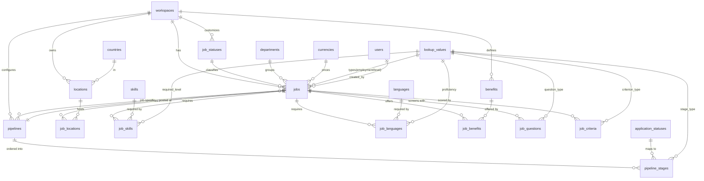

# 06 — Jobs (D5) — Database Blueprint

The **D5 — Jobs** domain of the HalaOps FINAL DATABASE BLUEPRINT. It models a
**job** as the anchor of the entire recruitment domain (every application,
interview, evaluation and decision exists *because of* a job) together with its
configuration: status workflow, locations, required skills/languages, benefits,
screening questions, AI scoring criteria, and the per-workspace/per-job hiring
**pipeline** of stages.

All twelve tables below are **BLUEPRINT** — none are built yet (they are not in
migrations 0001–0016). This document is the target the implementation migrates
toward; **no migration or code is written until the blueprint and ERD are
approved** (see [00-Database-Bible](00-Database-Bible.md)).

Engine/charset for every table: **MySQL/MariaDB InnoDB, `utf8mb4` /
`utf8mb4_unicode_ci`**. Every table follows the global conventions in
[00-Database-Bible](00-Database-Bible.md) §Architecture: `id` BIGINT UNSIGNED PK
AI, `uuid` CHAR(36) UNIQUE public id, `created_at`/`updated_at`, `deleted_at` on
soft-deletable entities, and an indexed `workspace_id` FK on every tenant row
(DB-2).

> **Supersession note.** The legacy spec [../24-Job-Lifecycle](../24-Job-Lifecycle.md)
> §6 sketches `jobs` with ENUM `status` / `employment_type` and scalar
> `department`/`location`/`currency` columns. That predates the blueprint
> standard. Per **DB-4 (no hard-coded values)** this domain replaces those ENUMs
> with the config-driven `job_statuses` table + `lookup_values` refs, and
> normalizes `location`→`locations`/`job_locations`, `currency`→`currencies`,
> `department`→D9 `departments`. The state machine, transitions, side effects and
> business rules from doc 24 remain authoritative; only the storage is upgraded.

## Related Documents

- [00-Database-Bible](00-Database-Bible.md) — the blueprint standard (conventions, config-driven rules, polymorphic tables, scale).
- [01-Lookups-Reference](01-Lookups-Reference.md) — **D0**: `lookup_categories`, `lookup_values`, `countries`, `currencies`, `languages`, and the shared polymorphic tables (`attachments`, `notes`, `tags`/`taggables`, `status_histories`, `activity_logs`, `translations`) this domain references.
- [07-Candidates](07-Candidates.md) — **D6**: owner of the `skills` catalog (`job_skills` pivots to it) and of `candidate_*` data.
- [08-Applications-Interviews](08-Applications-Interviews.md) — **D7**: `applications` reference `jobs` and flow through `pipeline_stages`; `application_statuses` are referenced by stages.
- [10-HR-Talent](10-HR-Talent.md) — **D9**: `departments` (referenced by `jobs.department_id`), evaluations/offers built on the job.
- [05-Subscriptions-Billing](05-Subscriptions-Billing.md) — **D4**: `currencies` live in D0 but money semantics (DECIMAL(12,2)+currency_id) match billing.
- Up-stream specs: [../24-Job-Lifecycle](../24-Job-Lifecycle.md) (state machine), [../25-Application-Lifecycle](../25-Application-Lifecycle.md), [../06-ERD](../06-ERD.md), [../28-Search-System](../28-Search-System.md) (FULLTEXT), [../08-Multi-Tenant](../08-Multi-Tenant.md), [../11-Permissions-Matrix](../11-Permissions-Matrix.md).

## Domain ERD

---

## §9.1 `jobs`

- **BLUEPRINT** · Purpose: a job posting / requisition — the anchor of the recruitment domain. · Tenant-scoped: **yes** (`workspace_id`). · Soft-delete: **yes** (`deleted_at`; archive is a status, hard-delete is super-admin-only and cascades).

### Columns

| Column | Type | Null | Default | Notes |
|---|---|---|---|---|
| `id` | BIGINT UNSIGNED | NO | AUTO_INCREMENT | PK |
| `uuid` | CHAR(36) | NO | — | Public id (URLs/API); UNIQUE |
| `workspace_id` | BIGINT UNSIGNED | NO | — | Tenant; FK → `workspaces(id)` |
| `job_status_id` | BIGINT UNSIGNED | NO | — | FK → `job_statuses(id)`; replaces the legacy `status` ENUM |
| `pipeline_id` | BIGINT UNSIGNED | YES | NULL | FK → `pipelines(id)`; the hiring pipeline this job uses (NULL until seeded) |
| `department_id` | BIGINT UNSIGNED | YES | NULL | FK → D9 `departments(id)` |
| `employment_type_id` | BIGINT UNSIGNED | YES | NULL | FK → `lookup_values(id)` (category `job_employment_type`: full_time/part_time/contract/intern/temporary) |
| `experience_level_id` | BIGINT UNSIGNED | YES | NULL | FK → `lookup_values(id)` (category `job_experience_level`: junior/mid/senior/lead…) |
| `title` | VARCHAR(160) | NO | — | Job title; FULLTEXT |
| `slug` | VARCHAR(180) | NO | — | URL slug; unique per workspace |
| `description` | LONGTEXT | YES | NULL | Full job description (markdown/HTML); FULLTEXT |
| `summary` | VARCHAR(500) | YES | NULL | Short teaser for cards/careers list |
| `openings` | INT UNSIGNED | NO | 1 | Headcount; `>= 1` (app-validated) |
| `is_remote` | TINYINT(1) | NO | 0 | Remote-eligible flag (locations still allowed for hybrid) |
| `salary_min` | DECIMAL(12,2) | YES | NULL | Lower salary band |
| `salary_max` | DECIMAL(12,2) | YES | NULL | Upper band; app-validates `>= salary_min` |
| `currency_id` | BIGINT UNSIGNED | YES | NULL | FK → `currencies(id)` (D0); required when salary set |
| `salary_period_id` | BIGINT UNSIGNED | YES | NULL | FK → `lookup_values(id)` (category `salary_period`: year/month/hour); avoids a period ENUM |
| `is_salary_public` | TINYINT(1) | NO | 0 | Whether the band is shown on the careers page |
| `meta` | JSON | YES | NULL | Extensible attributes (perks blurb, apply-redirect, etc.) without schema churn |
| `created_by` | BIGINT UNSIGNED | YES | NULL | Author; FK → `users(id)` ON DELETE SET NULL |
| `updated_by` | BIGINT UNSIGNED | YES | NULL | Last editor; FK → `users(id)` ON DELETE SET NULL |
| `published_at` | TIMESTAMP | YES | NULL | First-publish timestamp (set on `draft/closed → open`) |
| `closed_at` | TIMESTAMP | YES | NULL | Close timestamp (cleared on reopen) |
| `created_at` | TIMESTAMP | YES | NULL | |
| `updated_at` | TIMESTAMP | YES | NULL | |
| `deleted_at` | TIMESTAMP | YES | NULL | Soft delete |

### Keys
- **PK**: `id`. **UUID**: UNIQUE(`uuid`). **Business-unique**: UNIQUE(`workspace_id`,`slug`).

### Indexes
| Name | Columns | Type |
|---|---|---|
| `jobs_uuid_unique` | (`uuid`) | unique |
| `jobs_workspace_slug_unique` | (`workspace_id`,`slug`) | unique |
| `jobs_workspace_status_index` | (`workspace_id`,`job_status_id`) | composite — dashboard list + careers query |
| `jobs_workspace_created_index` | (`workspace_id`,`created_at`) | composite — recent jobs |
| `jobs_workspace_dept_index` | (`workspace_id`,`department_id`) | composite |
| `jobs_pipeline_id_index` | (`pipeline_id`) | index (FK) |
| `jobs_department_id_index` | (`department_id`) | index (FK) |
| `jobs_employment_type_id_index` | (`employment_type_id`) | index (FK) |
| `jobs_experience_level_id_index` | (`experience_level_id`) | index (FK) |
| `jobs_currency_id_index` | (`currency_id`) | index (FK) |
| `jobs_salary_period_id_index` | (`salary_period_id`) | index (FK) |
| `jobs_created_by_index` | (`created_by`) | index (FK) |
| `jobs_updated_by_index` | (`updated_by`) | index (FK) |
| `jobs_published_at_index` | (`published_at`) | index — careers ordering |
| `jobs_deleted_at_index` | (`deleted_at`) | index — soft-delete filter |
| `jobs_title_description_fulltext` | (`title`,`description`) | **fulltext** — tenant-filtered search (doc 28) |

### Foreign keys
| Column | References | On delete | On update |
|---|---|---|---|
| `workspace_id` | `workspaces(id)` | CASCADE | CASCADE |
| `job_status_id` | `job_statuses(id)` | RESTRICT | CASCADE |
| `pipeline_id` | `pipelines(id)` | SET NULL | CASCADE |
| `department_id` | `departments(id)` (D9) | SET NULL | CASCADE |
| `employment_type_id` | `lookup_values(id)` | RESTRICT | CASCADE |
| `experience_level_id` | `lookup_values(id)` | RESTRICT | CASCADE |
| `currency_id` | `currencies(id)` | RESTRICT | CASCADE |
| `salary_period_id` | `lookup_values(id)` | RESTRICT | CASCADE |
| `created_by` | `users(id)` | SET NULL | CASCADE |
| `updated_by` | `users(id)` | SET NULL | CASCADE |

### Relationships + cardinality
- `workspaces` 1—* `jobs` · `job_statuses` 1—* `jobs` · `pipelines` 1—* `jobs` · `departments` 1—* `jobs`.
- `jobs` *—* `locations` (via `job_locations`), `jobs` *—* `skills` (via `job_skills`), `jobs` *—* `languages` (via `job_languages`), `jobs` *—* `benefits` (via `job_benefits`).
- `jobs` 1—* `job_questions`, `jobs` 1—* `job_criteria`.
- `jobs` 1—* `applications` (D7, `applications.job_id`, ON DELETE CASCADE) and transitively interviews/evaluations.

### Notes
- **Config-driven**: status, employment type, experience level and salary period are all FK refs (no ENUMs) → DB-4. Statuses carry workflow flags (see `job_statuses`).
- **Polymorphic add-ons** (do NOT redefine here): job attachments → `attachments` (`attachable_type='job'`); free-text notes → `notes` (`notable_type='job'`); labels → `tags`+`taggables` (`taggable_type='job'`); status transitions → `status_histories` (`subject_type='job'`); audit/timeline → `activity_logs` (`subject_type='job'`); localized title/description → `translations` (`translatable_type='job'`). See [01-Lookups-Reference](01-Lookups-Reference.md).
- **Normalization**: department/location/currency are 3NF refs, not scalar strings; many-to-many sets live in pivots; `meta` JSON holds genuinely sparse/extensible attributes only.
- **Scale**: hot paths covered by `(workspace_id,job_status_id)` and `(workspace_id,created_at)`; careers page caches the open-jobs list per workspace (doc 24 §11) keyed off `published_at`. FULLTEXT queries are always tenant-filtered.

---

## §9.2 `job_statuses`

- **BLUEPRINT** · Purpose: config-driven status catalog + workflow flags for the job lifecycle (`draft/open/paused/closed/archived` shipped as DEFAULT rows, **not** an enum). · Tenant-scoped: **optional** (`workspace_id` NULL = system default; non-null = tenant custom/override). · Soft-delete: **yes** (custom statuses may be retired).

### Columns

| Column | Type | Null | Default | Notes |
|---|---|---|---|---|
| `id` | BIGINT UNSIGNED | NO | AUTO_INCREMENT | PK |
| `uuid` | CHAR(36) | NO | — | UNIQUE |
| `workspace_id` | BIGINT UNSIGNED | YES | NULL | NULL = system default; set = tenant custom; FK → `workspaces(id)` |
| `key` | VARCHAR(60) | NO | — | Machine key (`draft`,`open`,`paused`,`closed`,`archived`,…) |
| `label` | VARCHAR(120) | NO | — | Human label (translatable via `translations`) |
| `color` | VARCHAR(20) | YES | NULL | UI badge color (hex/token) |
| `sort_order` | INT | NO | 0 | Display order |
| `is_default` | TINYINT(1) | NO | 0 | Default status for new jobs (`draft`) |
| `is_initial` | TINYINT(1) | NO | 0 | Allowed entry state(s) |
| `is_terminal` | TINYINT(1) | NO | 0 | Terminal/closed-out state (`closed`,`archived`) |
| `is_published_state` | TINYINT(1) | NO | 0 | True for `open` — the only state visible on careers + accepting applications |
| `is_system` | TINYINT(1) | NO | 0 | Seeded/protected row (cannot be deleted by tenants) |
| `created_at` | TIMESTAMP | YES | NULL | |
| `updated_at` | TIMESTAMP | YES | NULL | |
| `deleted_at` | TIMESTAMP | YES | NULL | Soft delete |

### Keys
- **PK**: `id`. **UUID**: UNIQUE(`uuid`). **Business-unique**: UNIQUE(`workspace_id`,`key`) (a NULL `workspace_id` is the global default keyspace; tenant rows reuse keys to override).

### Indexes
| Name | Columns | Type |
|---|---|---|
| `job_statuses_uuid_unique` | (`uuid`) | unique |
| `job_statuses_workspace_key_unique` | (`workspace_id`,`key`) | unique |
| `job_statuses_workspace_sort_index` | (`workspace_id`,`sort_order`) | composite |
| `job_statuses_is_default_index` | (`is_default`) | index |
| `job_statuses_deleted_at_index` | (`deleted_at`) | index |

### Foreign keys
| Column | References | On delete | On update |
|---|---|---|---|
| `workspace_id` | `workspaces(id)` | CASCADE | CASCADE |

### Relationships + cardinality
- `job_statuses` 1—* `jobs` (via `jobs.job_status_id`, RESTRICT — a status in use cannot be deleted).
- `workspaces` 1—* `job_statuses` (custom statuses); system defaults have `workspace_id` NULL.

### Notes
- **DEFAULT rows (system, `workspace_id` NULL, `is_system=1`)** seed the canonical lifecycle: `draft` (`is_default`,`is_initial`), `open` (`is_initial`,`is_published_state`), `paused`, `closed` (`is_terminal`), `archived` (`is_terminal`). Legal transitions (per doc 24 §4.1) are enforced in `JobService`; the flags (`is_initial`/`is_terminal`/`is_published_state`) let the app validate them data-drivenly.
- This is the per-entity status-table pattern from [00-Database-Bible](00-Database-Bible.md) §Configuration-Driven; parallels `application_statuses`, `interview_statuses`, etc.

---

## §9.3 `locations`

- **BLUEPRINT** · Purpose: reusable workspace offices / job locations (a job may be posted at several; many jobs share one office). · Tenant-scoped: **yes**. · Soft-delete: **yes**.

### Columns

| Column | Type | Null | Default | Notes |
|---|---|---|---|---|
| `id` | BIGINT UNSIGNED | NO | AUTO_INCREMENT | PK |
| `uuid` | CHAR(36) | NO | — | UNIQUE |
| `workspace_id` | BIGINT UNSIGNED | NO | — | Tenant; FK → `workspaces(id)` |
| `name` | VARCHAR(150) | YES | NULL | Office/site label (e.g. "Riyadh HQ") |
| `country_id` | BIGINT UNSIGNED | NO | — | FK → `countries(id)` (D0 reference data) |
| `city` | VARCHAR(120) | YES | NULL | City |
| `state` | VARCHAR(120) | YES | NULL | State/province/region |
| `address_line` | VARCHAR(255) | YES | NULL | Street address |
| `postal_code` | VARCHAR(20) | YES | NULL | |
| `timezone_id` | BIGINT UNSIGNED | YES | NULL | FK → `timezones(id)` (D0) |
| `latitude` | DECIMAL(10,7) | YES | NULL | Geo lat |
| `longitude` | DECIMAL(10,7) | YES | NULL | Geo lng |
| `is_remote` | TINYINT(1) | NO | 0 | A "remote / anywhere" pseudo-location |
| `is_active` | TINYINT(1) | NO | 1 | Selectable when posting |
| `created_at` | TIMESTAMP | YES | NULL | |
| `updated_at` | TIMESTAMP | YES | NULL | |
| `deleted_at` | TIMESTAMP | YES | NULL | Soft delete |

### Keys
- **PK**: `id`. **UUID**: UNIQUE(`uuid`). (No natural business-unique key — addresses repeat; uniqueness is via `uuid`.)

### Indexes
| Name | Columns | Type |
|---|---|---|
| `locations_uuid_unique` | (`uuid`) | unique |
| `locations_workspace_id_index` | (`workspace_id`) | index (FK) |
| `locations_workspace_country_index` | (`workspace_id`,`country_id`) | composite |
| `locations_country_id_index` | (`country_id`) | index (FK) |
| `locations_timezone_id_index` | (`timezone_id`) | index (FK) |
| `locations_lat_lng_index` | (`latitude`,`longitude`) | composite — proximity |
| `locations_deleted_at_index` | (`deleted_at`) | index |

### Foreign keys
| Column | References | On delete | On update |
|---|---|---|---|
| `workspace_id` | `workspaces(id)` | CASCADE | CASCADE |
| `country_id` | `countries(id)` | RESTRICT | CASCADE |
| `timezone_id` | `timezones(id)` | RESTRICT | CASCADE |

### Relationships + cardinality
- `workspaces` 1—* `locations` · `countries` 1—* `locations`.
- `locations` *—* `jobs` (via `job_locations`).

### Notes
- `country_id`/`timezone_id` reference D0 global seeded reference data (RESTRICT — must not vanish). City/state kept as text (free-form, not a worldwide catalog) — a deliberate normalization stop at country level.

---

## §9.4 `job_locations`

- **BLUEPRINT** · Purpose: pivot — which locations a job is posted at. · Tenant-scoped: **yes** (carries `workspace_id` for shard-locality/tenant filters). · Soft-delete: **no** (pure pivot, hard-deleted).

### Columns

| Column | Type | Null | Default | Notes |
|---|---|---|---|---|
| `id` | BIGINT UNSIGNED | NO | AUTO_INCREMENT | PK |
| `workspace_id` | BIGINT UNSIGNED | NO | — | Tenant; FK → `workspaces(id)` |
| `job_id` | BIGINT UNSIGNED | NO | — | FK → `jobs(id)` |
| `location_id` | BIGINT UNSIGNED | NO | — | FK → `locations(id)` |
| `is_primary` | TINYINT(1) | NO | 0 | Marks the primary posting location |
| `created_at` | TIMESTAMP | YES | NULL | |
| `updated_at` | TIMESTAMP | YES | NULL | |

### Keys
- **PK**: `id`. **Business-unique**: UNIQUE(`job_id`,`location_id`). (No `uuid` — internal pivot.)

### Indexes
| Name | Columns | Type |
|---|---|---|
| `job_locations_job_location_unique` | (`job_id`,`location_id`) | unique |
| `job_locations_location_id_index` | (`location_id`) | index (FK) |
| `job_locations_workspace_id_index` | (`workspace_id`) | index (FK) |

### Foreign keys
| Column | References | On delete | On update |
|---|---|---|---|
| `workspace_id` | `workspaces(id)` | CASCADE | CASCADE |
| `job_id` | `jobs(id)` | CASCADE | CASCADE |
| `location_id` | `locations(id)` | CASCADE | CASCADE |

### Relationships + cardinality
- `jobs` *—* `locations` resolved here: `jobs` 1—* `job_locations` *—1 `locations`.

### Notes
- Pure pivot: hard-deleted with its job (CASCADE). `uuid` omitted (never addressed externally). `is_primary` is the only payload.

---

## §9.5 `job_skills`

- **BLUEPRINT** · Purpose: pivot — skills a job requires, with required level + weight (the **`skills` catalog is owned by D6 Candidates**; this only references it). · Tenant-scoped: **yes**. · Soft-delete: **no** (pivot).

### Columns

| Column | Type | Null | Default | Notes |
|---|---|---|---|---|
| `id` | BIGINT UNSIGNED | NO | AUTO_INCREMENT | PK |
| `workspace_id` | BIGINT UNSIGNED | NO | — | Tenant; FK → `workspaces(id)` |
| `job_id` | BIGINT UNSIGNED | NO | — | FK → `jobs(id)` |
| `skill_id` | BIGINT UNSIGNED | NO | — | FK → `skills(id)` (**D6** catalog) |
| `required_level_id` | BIGINT UNSIGNED | YES | NULL | FK → `lookup_values(id)` (category `skill_level`: beginner/intermediate/advanced/expert) |
| `is_required` | TINYINT(1) | NO | 1 | Required (vs nice-to-have) |
| `weight` | DECIMAL(5,2) | NO | 1.00 | Relative importance for AI/score matching |
| `created_at` | TIMESTAMP | YES | NULL | |
| `updated_at` | TIMESTAMP | YES | NULL | |

### Keys
- **PK**: `id`. **Business-unique**: UNIQUE(`job_id`,`skill_id`).

### Indexes
| Name | Columns | Type |
|---|---|---|
| `job_skills_job_skill_unique` | (`job_id`,`skill_id`) | unique |
| `job_skills_skill_id_index` | (`skill_id`) | index (FK) |
| `job_skills_required_level_id_index` | (`required_level_id`) | index (FK) |
| `job_skills_workspace_id_index` | (`workspace_id`) | index (FK) |

### Foreign keys
| Column | References | On delete | On update |
|---|---|---|---|
| `workspace_id` | `workspaces(id)` | CASCADE | CASCADE |
| `job_id` | `jobs(id)` | CASCADE | CASCADE |
| `skill_id` | `skills(id)` (D6) | RESTRICT | CASCADE |
| `required_level_id` | `lookup_values(id)` | RESTRICT | CASCADE |

### Relationships + cardinality
- `jobs` *—* `skills` resolved here: `jobs` 1—* `job_skills` *—1 `skills`.
- `weight`/`required_level_id` feed `job_criteria` and D7 `application_ai_results` matching.

### Notes
- `skill_id` RESTRICT — a catalog skill referenced by jobs cannot be deleted (catalog integrity, §FK). The catalog lives in **D6 `skills`**; this domain never defines skills, only links them.

---

## §9.6 `job_languages`

- **BLUEPRINT** · Purpose: pivot — languages a job requires, with proficiency (`languages` catalog is D0 reference data). · Tenant-scoped: **yes**. · Soft-delete: **no** (pivot).

### Columns

| Column | Type | Null | Default | Notes |
|---|---|---|---|---|
| `id` | BIGINT UNSIGNED | NO | AUTO_INCREMENT | PK |
| `workspace_id` | BIGINT UNSIGNED | NO | — | Tenant; FK → `workspaces(id)` |
| `job_id` | BIGINT UNSIGNED | NO | — | FK → `jobs(id)` |
| `language_id` | BIGINT UNSIGNED | NO | — | FK → `languages(id)` (**D0** reference data) |
| `proficiency_id` | BIGINT UNSIGNED | YES | NULL | FK → `lookup_values(id)` (category `language_proficiency`: basic/conversational/fluent/native) |
| `is_required` | TINYINT(1) | NO | 1 | Required vs preferred |
| `created_at` | TIMESTAMP | YES | NULL | |
| `updated_at` | TIMESTAMP | YES | NULL | |

### Keys
- **PK**: `id`. **Business-unique**: UNIQUE(`job_id`,`language_id`).

### Indexes
| Name | Columns | Type |
|---|---|---|
| `job_languages_job_language_unique` | (`job_id`,`language_id`) | unique |
| `job_languages_language_id_index` | (`language_id`) | index (FK) |
| `job_languages_proficiency_id_index` | (`proficiency_id`) | index (FK) |
| `job_languages_workspace_id_index` | (`workspace_id`) | index (FK) |

### Foreign keys
| Column | References | On delete | On update |
|---|---|---|---|
| `workspace_id` | `workspaces(id)` | CASCADE | CASCADE |
| `job_id` | `jobs(id)` | CASCADE | CASCADE |
| `language_id` | `languages(id)` (D0) | RESTRICT | CASCADE |
| `proficiency_id` | `lookup_values(id)` | RESTRICT | CASCADE |

### Relationships + cardinality
- `jobs` *—* `languages` resolved here: `jobs` 1—* `job_languages` *—1 `languages`.

### Notes
- `languages` is global seeded reference data (D0) → RESTRICT. Proficiency is a generic lookup, not an enum.

---

## §9.7 `benefits`

- **BLUEPRINT** · Purpose: workspace-scoped catalog of benefits/perks (lookup-like, but tenant-owned and richer than a generic lookup row). · Tenant-scoped: **yes**. · Soft-delete: **yes**.

### Columns

| Column | Type | Null | Default | Notes |
|---|---|---|---|---|
| `id` | BIGINT UNSIGNED | NO | AUTO_INCREMENT | PK |
| `uuid` | CHAR(36) | NO | — | UNIQUE |
| `workspace_id` | BIGINT UNSIGNED | NO | — | Tenant; FK → `workspaces(id)` |
| `key` | VARCHAR(60) | NO | — | Machine key (e.g. `health_insurance`) |
| `label` | VARCHAR(150) | NO | — | Display name (translatable) |
| `description` | VARCHAR(500) | YES | NULL | Detail |
| `category_id` | BIGINT UNSIGNED | YES | NULL | FK → `lookup_values(id)` (category `benefit_category`: health/financial/time_off/perks) |
| `icon` | VARCHAR(60) | YES | NULL | UI icon token |
| `sort_order` | INT | NO | 0 | Display order |
| `is_active` | TINYINT(1) | NO | 1 | Selectable |
| `created_at` | TIMESTAMP | YES | NULL | |
| `updated_at` | TIMESTAMP | YES | NULL | |
| `deleted_at` | TIMESTAMP | YES | NULL | Soft delete |

### Keys
- **PK**: `id`. **UUID**: UNIQUE(`uuid`). **Business-unique**: UNIQUE(`workspace_id`,`key`).

### Indexes
| Name | Columns | Type |
|---|---|---|
| `benefits_uuid_unique` | (`uuid`) | unique |
| `benefits_workspace_key_unique` | (`workspace_id`,`key`) | unique |
| `benefits_category_id_index` | (`category_id`) | index (FK) |
| `benefits_workspace_active_index` | (`workspace_id`,`is_active`) | composite |
| `benefits_deleted_at_index` | (`deleted_at`) | index |

### Foreign keys
| Column | References | On delete | On update |
|---|---|---|---|
| `workspace_id` | `workspaces(id)` | CASCADE | CASCADE |
| `category_id` | `lookup_values(id)` | RESTRICT | CASCADE |

### Relationships + cardinality
- `workspaces` 1—* `benefits` · `benefits` *—* `jobs` (via `job_benefits`).

### Notes
- Modeled as a first-class tenant table (not a `lookup_values` row) because benefits carry their own attributes (description, icon, category) and are tenant-curated catalogs reused across jobs — config-driven without being a generic lookup. `category_id` itself is a generic lookup.

---

## §9.8 `job_benefits`

- **BLUEPRINT** · Purpose: pivot — benefits attached to a job. · Tenant-scoped: **yes**. · Soft-delete: **no** (pivot).

### Columns

| Column | Type | Null | Default | Notes |
|---|---|---|---|---|
| `id` | BIGINT UNSIGNED | NO | AUTO_INCREMENT | PK |
| `workspace_id` | BIGINT UNSIGNED | NO | — | Tenant; FK → `workspaces(id)` |
| `job_id` | BIGINT UNSIGNED | NO | — | FK → `jobs(id)` |
| `benefit_id` | BIGINT UNSIGNED | NO | — | FK → `benefits(id)` |
| `value` | VARCHAR(255) | YES | NULL | Optional per-job detail (e.g. "30 days") overriding the catalog default |
| `sort_order` | INT | NO | 0 | Display order on the posting |
| `created_at` | TIMESTAMP | YES | NULL | |
| `updated_at` | TIMESTAMP | YES | NULL | |

### Keys
- **PK**: `id`. **Business-unique**: UNIQUE(`job_id`,`benefit_id`).

### Indexes
| Name | Columns | Type |
|---|---|---|
| `job_benefits_job_benefit_unique` | (`job_id`,`benefit_id`) | unique |
| `job_benefits_benefit_id_index` | (`benefit_id`) | index (FK) |
| `job_benefits_workspace_id_index` | (`workspace_id`) | index (FK) |

### Foreign keys
| Column | References | On delete | On update |
|---|---|---|---|
| `workspace_id` | `workspaces(id)` | CASCADE | CASCADE |
| `job_id` | `jobs(id)` | CASCADE | CASCADE |
| `benefit_id` | `benefits(id)` | RESTRICT | CASCADE |

### Relationships + cardinality
- `jobs` *—* `benefits` resolved here: `jobs` 1—* `job_benefits` *—1 `benefits`.

### Notes
- `benefit_id` RESTRICT so a benefit referenced by live jobs is not silently removed (soft-delete the catalog row instead). `value` lets a job customize a shared benefit without duplicating the catalog.

---

## §9.9 `job_questions`

- **BLUEPRINT** · Purpose: screening / application-form questions per job (type via lookup, options JSON, required flag). · Tenant-scoped: **yes**. · Soft-delete: **yes**.

### Columns

| Column | Type | Null | Default | Notes |
|---|---|---|---|---|
| `id` | BIGINT UNSIGNED | NO | AUTO_INCREMENT | PK |
| `uuid` | CHAR(36) | NO | — | UNIQUE |
| `workspace_id` | BIGINT UNSIGNED | NO | — | Tenant; FK → `workspaces(id)` |
| `job_id` | BIGINT UNSIGNED | NO | — | FK → `jobs(id)` |
| `question_type_id` | BIGINT UNSIGNED | NO | — | FK → `lookup_values(id)` (category `question_type`: text/textarea/single_choice/multi_choice/boolean/number/file/date) |
| `question` | VARCHAR(500) | NO | — | Prompt shown to the applicant (translatable) |
| `help_text` | VARCHAR(255) | YES | NULL | Hint |
| `options` | JSON | YES | NULL | Choice options for choice-type questions (`[{key,label}]`) |
| `is_required` | TINYINT(1) | NO | 0 | Must be answered to apply |
| `is_knockout` | TINYINT(1) | NO | 0 | A "wrong" answer auto-rejects/flags (screening) |
| `knockout_answer` | JSON | YES | NULL | Expected/disqualifying value(s) for knockout logic |
| `sort_order` | INT | NO | 0 | Order in the form |
| `created_at` | TIMESTAMP | YES | NULL | |
| `updated_at` | TIMESTAMP | YES | NULL | |
| `deleted_at` | TIMESTAMP | YES | NULL | Soft delete |

### Keys
- **PK**: `id`. **UUID**: UNIQUE(`uuid`). **Business-unique**: UNIQUE(`job_id`,`uuid`) is redundant with UNIQUE(`uuid`); ordering uniqueness is app-managed via `sort_order` (no hard unique on it to allow reordering).

### Indexes
| Name | Columns | Type |
|---|---|---|
| `job_questions_uuid_unique` | (`uuid`) | unique |
| `job_questions_job_sort_index` | (`job_id`,`sort_order`) | composite — render order |
| `job_questions_question_type_id_index` | (`question_type_id`) | index (FK) |
| `job_questions_workspace_id_index` | (`workspace_id`) | index (FK) |
| `job_questions_deleted_at_index` | (`deleted_at`) | index |

### Foreign keys
| Column | References | On delete | On update |
|---|---|---|---|
| `workspace_id` | `workspaces(id)` | CASCADE | CASCADE |
| `job_id` | `jobs(id)` | CASCADE | CASCADE |
| `question_type_id` | `lookup_values(id)` | RESTRICT | CASCADE |

### Relationships + cardinality
- `jobs` 1—* `job_questions`. Applicant answers are stored in **D7** (application form responses), not here — this table is the question definition only.

### Notes
- `question_type_id` is a generic lookup (no input-type ENUM). `options`/`knockout_answer` are JSON because their shape varies by type — a justified denormalization for form schemas. Knockout questions feed screening/AI pre-filtering.

---

## §9.10 `job_criteria`

- **BLUEPRINT** · Purpose: weighted scoring criteria for a job, consumed by AI matching and human evaluations. · Tenant-scoped: **yes**. · Soft-delete: **yes**.

### Columns

| Column | Type | Null | Default | Notes |
|---|---|---|---|---|
| `id` | BIGINT UNSIGNED | NO | AUTO_INCREMENT | PK |
| `uuid` | CHAR(36) | NO | — | UNIQUE |
| `workspace_id` | BIGINT UNSIGNED | NO | — | Tenant; FK → `workspaces(id)` |
| `job_id` | BIGINT UNSIGNED | NO | — | FK → `jobs(id)` |
| `criterion_type_id` | BIGINT UNSIGNED | YES | NULL | FK → `lookup_values(id)` (category `criterion_type`: skill/experience/education/culture_fit/language/custom) |
| `name` | VARCHAR(150) | NO | — | Criterion label (e.g. "Backend depth") |
| `description` | VARCHAR(500) | YES | NULL | Rubric/guidance for AI + evaluators |
| `weight` | DECIMAL(5,2) | NO | 1.00 | Relative weight in the composite score |
| `max_score` | DECIMAL(5,2) | NO | 10.00 | Scale ceiling for this criterion |
| `is_ai_scored` | TINYINT(1) | NO | 1 | Whether AI scores this automatically |
| `sort_order` | INT | NO | 0 | Display order |
| `created_at` | TIMESTAMP | YES | NULL | |
| `updated_at` | TIMESTAMP | YES | NULL | |
| `deleted_at` | TIMESTAMP | YES | NULL | Soft delete |

### Keys
- **PK**: `id`. **UUID**: UNIQUE(`uuid`). (Ordering managed via `sort_order`; no hard unique to allow reorder.)

### Indexes
| Name | Columns | Type |
|---|---|---|
| `job_criteria_uuid_unique` | (`uuid`) | unique |
| `job_criteria_job_sort_index` | (`job_id`,`sort_order`) | composite |
| `job_criteria_criterion_type_id_index` | (`criterion_type_id`) | index (FK) |
| `job_criteria_workspace_id_index` | (`workspace_id`) | index (FK) |
| `job_criteria_deleted_at_index` | (`deleted_at`) | index |

### Foreign keys
| Column | References | On delete | On update |
|---|---|---|---|
| `workspace_id` | `workspaces(id)` | CASCADE | CASCADE |
| `job_id` | `jobs(id)` | CASCADE | CASCADE |
| `criterion_type_id` | `lookup_values(id)` | RESTRICT | CASCADE |

### Relationships + cardinality
- `jobs` 1—* `job_criteria`. Referenced by **D7** `application_ai_results` / `interview_scores` and **D9** `evaluations`/`evaluation_scores` (a score row points at a `job_criteria.id`).

### Notes
- `weight`/`max_score` define the rubric the AI engine (D8) and human evaluators (D9) both score against — a single source of truth for "what this job is graded on". `criterion_type_id` is a generic lookup, not an enum.

---

## §9.11 `pipelines`

- **BLUEPRINT** · Purpose: a configurable hiring workflow (set of stages) at workspace level (template) or job level. · Tenant-scoped: **yes**. · Soft-delete: **yes**.

### Columns

| Column | Type | Null | Default | Notes |
|---|---|---|---|---|
| `id` | BIGINT UNSIGNED | NO | AUTO_INCREMENT | PK |
| `uuid` | CHAR(36) | NO | — | UNIQUE |
| `workspace_id` | BIGINT UNSIGNED | NO | — | Tenant; FK → `workspaces(id)` |
| `job_id` | BIGINT UNSIGNED | YES | NULL | FK → `jobs(id)`; NULL = workspace-level **template**, set = job-specific instance |
| `name` | VARCHAR(150) | NO | — | Pipeline name (e.g. "Standard hiring") |
| `description` | VARCHAR(500) | YES | NULL | |
| `is_default` | TINYINT(1) | NO | 0 | Default template cloned into new jobs (only one default per workspace) |
| `is_template` | TINYINT(1) | NO | 0 | Reusable template vs concrete job pipeline |
| `is_active` | TINYINT(1) | NO | 1 | Selectable |
| `created_by` | BIGINT UNSIGNED | YES | NULL | FK → `users(id)` ON DELETE SET NULL |
| `created_at` | TIMESTAMP | YES | NULL | |
| `updated_at` | TIMESTAMP | YES | NULL | |
| `deleted_at` | TIMESTAMP | YES | NULL | Soft delete |

### Keys
- **PK**: `id`. **UUID**: UNIQUE(`uuid`). **Business-unique**: UNIQUE(`workspace_id`,`job_id`) when `job_id` is set (one pipeline instance per job; MySQL treats multiple NULLs as distinct, so workspace templates are not constrained by this).

### Indexes
| Name | Columns | Type |
|---|---|---|
| `pipelines_uuid_unique` | (`uuid`) | unique |
| `pipelines_workspace_job_unique` | (`workspace_id`,`job_id`) | unique (NULL `job_id` repeatable) |
| `pipelines_workspace_default_index` | (`workspace_id`,`is_default`) | composite |
| `pipelines_job_id_index` | (`job_id`) | index (FK) |
| `pipelines_created_by_index` | (`created_by`) | index (FK) |
| `pipelines_deleted_at_index` | (`deleted_at`) | index |

### Foreign keys
| Column | References | On delete | On update |
|---|---|---|---|
| `workspace_id` | `workspaces(id)` | CASCADE | CASCADE |
| `job_id` | `jobs(id)` | CASCADE | CASCADE |
| `created_by` | `users(id)` | SET NULL | CASCADE |

### Relationships + cardinality
- `workspaces` 1—* `pipelines` · `pipelines` 1—* `pipeline_stages`.
- `jobs` 1—1 `pipelines` (job-specific instance; `jobs.pipeline_id` also points back for the active pipeline) and `jobs` *—1 a workspace **template** pipeline at creation time.

### Notes
- Replaces doc 24's "`pipeline_stages.job_id = NULL` template" sketch with an explicit `pipelines` parent so a workspace can keep **several named templates**; `JobService::seedPipeline` clones the default template into a per-job pipeline (doc 24 §4.2/§4.4). `jobs.pipeline_id` ↔ `pipelines.job_id` form the active-pipeline link; the cyclic pair is resolved at app layer (create pipeline, then set `jobs.pipeline_id`).

---

## §9.12 `pipeline_stages`

- **BLUEPRINT** · Purpose: ordered stages of a pipeline; each stage maps to an application status the candidate is in while at that stage. · Tenant-scoped: **yes**. · Soft-delete: **yes**.

### Columns

| Column | Type | Null | Default | Notes |
|---|---|---|---|---|
| `id` | BIGINT UNSIGNED | NO | AUTO_INCREMENT | PK |
| `uuid` | CHAR(36) | NO | — | UNIQUE |
| `workspace_id` | BIGINT UNSIGNED | NO | — | Tenant; FK → `workspaces(id)` |
| `pipeline_id` | BIGINT UNSIGNED | NO | — | FK → `pipelines(id)` |
| `application_status_id` | BIGINT UNSIGNED | YES | NULL | FK → `application_statuses(id)` (**D7**) — the status applications get while in this stage |
| `stage_type_id` | BIGINT UNSIGNED | NO | — | FK → `lookup_values(id)` (category `pipeline_stage_type`: applied/screening/interview/assessment/offer/hired/rejected) |
| `name` | VARCHAR(150) | NO | — | Stage name (translatable) |
| `description` | VARCHAR(500) | YES | NULL | |
| `color` | VARCHAR(20) | YES | NULL | Kanban column color |
| `sort_order` | INT | NO | 0 | Order within the pipeline |
| `is_initial` | TINYINT(1) | NO | 0 | Entry stage (`applied`) |
| `is_terminal` | TINYINT(1) | NO | 0 | Exit stage (`hired`/`rejected`) |
| `is_passed` | TINYINT(1) | NO | 0 | Terminal-positive (`hired`) vs terminal-negative (`rejected`) |
| `auto_advance` | TINYINT(1) | NO | 0 | Whether the app may auto-progress out of this stage |
| `created_at` | TIMESTAMP | YES | NULL | |
| `updated_at` | TIMESTAMP | YES | NULL | |
| `deleted_at` | TIMESTAMP | YES | NULL | Soft delete |

### Keys
- **PK**: `id`. **UUID**: UNIQUE(`uuid`). **Business-unique**: UNIQUE(`pipeline_id`,`sort_order`) keeps stage order stable per pipeline (reorder updates the set in one transaction).

### Indexes
| Name | Columns | Type |
|---|---|---|
| `pipeline_stages_uuid_unique` | (`uuid`) | unique |
| `pipeline_stages_pipeline_sort_unique` | (`pipeline_id`,`sort_order`) | unique — ordering |
| `pipeline_stages_application_status_id_index` | (`application_status_id`) | index (FK) |
| `pipeline_stages_stage_type_id_index` | (`stage_type_id`) | index (FK) |
| `pipeline_stages_workspace_id_index` | (`workspace_id`) | index (FK) |
| `pipeline_stages_deleted_at_index` | (`deleted_at`) | index |

### Foreign keys
| Column | References | On delete | On update |
|---|---|---|---|
| `workspace_id` | `workspaces(id)` | CASCADE | CASCADE |
| `pipeline_id` | `pipelines(id)` | CASCADE | CASCADE |
| `application_status_id` | `application_statuses(id)` (D7) | RESTRICT | CASCADE |
| `stage_type_id` | `lookup_values(id)` | RESTRICT | CASCADE |

### Relationships + cardinality
- `pipelines` 1—* `pipeline_stages` · `application_statuses` 1—* `pipeline_stages`.
- **D7** `applications.current_stage_id` → `pipeline_stages(id)` (an application sits in exactly one stage); deleting a stage with applications is blocked at the app layer (doc 24 §9) and the FK from applications is RESTRICT (defined in D7).

### Notes
- A publishable job needs at least one `is_initial`/`applied` stage and one `is_terminal` stage (doc 24 §5 rule 11), enforced in `JobService::publish` using these flags — data-driven, no enum.
- `stage_type_id` is a generic lookup; `application_status_id` ties the visual pipeline to the canonical application workflow so moving a card and changing status stay consistent (single source of truth, no duplicated status logic).

---

## Cross-cutting (referenced, NOT redefined here)

Per [00-Database-Bible](00-Database-Bible.md) §Cross-cutting polymorphic tables,
this domain reuses the shared D0 tables instead of per-entity copies:

| Concern | Shared table | Polymorphic key for jobs |
|---|---|---|
| File attachments (JDs, brand assets) | `attachments` | (`attachable_type='job'`, `attachable_id=jobs.id`) |
| Free-text notes / comments | `notes` | (`notable_type='job'`, `notable_id=jobs.id`) |
| Labels / categorization | `tags` + `taggables` | (`taggable_type='job'`, `taggable_id=jobs.id`) |
| Status-change history | `status_histories` | (`subject_type='job'`, `subject_id=jobs.id`) |
| Audit trail / activity timeline | `activity_logs` | (`subject_type='job'`, `subject_id=jobs.id`) |
| Localized title/description | `translations` | (`translatable_type='job'`, `translatable_id=jobs.id`) |

Integrity for these is enforced at the application layer; the (type,id)
composite indexes live on the shared tables (D0). Genuine relational links
(`workspace_id`, `job_id`, `created_by`, catalog FKs) are hard foreign keys as
specified above.

## Open Questions / Assumptions

1. **Active-pipeline link direction.** Both `jobs.pipeline_id → pipelines` and `pipelines.job_id → jobs` exist (template-vs-instance + fast "active pipeline" lookup). This is an intentional, app-resolved soft cycle; if the validation pass prefers a single direction, drop `jobs.pipeline_id` and derive the instance via `pipelines.job_id`.
2. **`benefits` as a table vs `lookup_values`.** Modeled as a first-class tenant catalog because perks carry description/icon/category and are tenant-curated. If the validation pass wants stricter lookup uniformity, it could collapse into `lookup_values` (category `benefit`) + `job_benefits` — but that loses the typed columns.
3. **City/state as text.** Locations normalize to `country_id` (+ optional `timezone_id`) but keep city/state free-text rather than a global city catalog. Assumed acceptable; a `cities` reference table can be added later without touching `jobs`/`job_locations`.
4. **Applicant answers.** `job_questions` stores question *definitions* only; per-application *answers* belong to **D7** (application form responses). Confirm D7 owns that table to avoid a duplicate.
5. **`salary_period_id` / `is_salary_public`.** Added beyond the prompt's column list to keep salary fully config-driven and careers-page-safe; flag if out of scope.
6. **Legacy doc 24 ENUMs superseded.** This domain replaces the ENUM `status`/`employment_type` and scalar `department`/`location`/`currency` from [../24-Job-Lifecycle](../24-Job-Lifecycle.md) §6 with status-table + lookup + reference-data FKs per DB-4. Doc 24's lifecycle/transitions/rules remain authoritative.
