# 07 — Candidates (D6) — Final Database Blueprint

The candidate domain of the HalaOps **FINAL DATABASE BLUEPRINT**. It models a
person's **reusable CV** — profile, skills, languages, work experience, education,
certificates, social links and uploaded documents — as data that is **global to
the user**, not duplicated per workspace. Every table here is **BLUEPRINT** (none is
in migrations 0001–0016 yet); this document is the target the implementation
migrates toward. **DESIGN ONLY — no migrations, no code.**

> **DB-1 invariant (the single most important rule of this domain): a candidate
> IS a user.** There is **no** `candidates` table and **no** `candidate_users`
> table. A person is one row in the global `users` table (owned by D2); being a
> "candidate" is a *role* (RBAC + the public portal), never a separate identity.
> `candidate_profiles` is a **1:1 extension of `users`** holding the structured CV
> data; all child tables hang off that one user identity.

## Related Documents

- [00 — Database Bible](00-Database-Bible.md) — the standard every table here obeys (base columns, config-driven, indexes, FKs, soft delete, polymorphic).
- [01 — Lookups, Reference & Polymorphic (D0)](01-Lookups-Reference.md) — owns `lookup_categories`/`lookup_values` (skill categories, levels, social platforms, document types), `languages`, `currencies`, and the shared polymorphic `notes`, `tags`/`taggables`, `attachments`, `status_histories`, `activity_logs` that this domain **references rather than redefines**.
- [05 — Subscriptions & Billing (D4)](05-Subscriptions-Billing.md) — `currencies` reference for `expected_salary_currency_id` (money = amount + `currency_id`).
- [06 — Jobs (D5)](06-Jobs.md) — **shares the `skills` catalog defined here**; jobs link to it via `job_skills` and to `languages` via `job_languages`. Skill matching between a job and a candidate joins `job_skills` ↔ `candidate_skills` on `skill_id`.
- [08 — Applications & Interviews (D7)](08-Applications-Interviews.md) — `applications` link a `users` row (the candidate) to a `jobs` row; an application may snapshot/point at this profile and at `candidate_documents` (e.g. the CV used to apply).
- [10 — HR & Talent Pool (D9)](10-HR-Talent.md) — **per-workspace grouping of candidates lives here** (`pools`, `pool_groups`, `pool_candidates`). This domain deliberately holds **no** per-workspace candidate data; the Talent Pool is the tenant-scoped layer over the global profile.
- [11 — Files / Queue / Analytics / Logs (D10)](11-Files-Queue-Analytics-Logs.md) — owns `files`; `candidate_documents.file_id` → `files`.
- [99 — ERD Blueprint](99-ERD-Blueprint.md) — the consolidated cross-domain ERD this domain feeds into.
- Up-stream spec: [../19-Candidate-Journey.md](../19-Candidate-Journey.md) — the product journey ("Candidate profile as a reusable CV", §Future Expansion) this schema realises.

---

## Purpose (الهدف)

To define, before any migration, the normalized schema for a candidate's
**portable professional profile**: a single structured CV owned by the `users`
row that pre-fills applications, powers AI/skill matching against jobs, and can be
surfaced (with consent) in a workspace's Talent Pool — without ever splitting a
person into multiple identity rows or copying their CV per tenant.

## Why It Exists (سبب وجوده)

The candidate is the only actor who is *outside* a tenant's staff yet owns rich,
reusable data. Two facts drive this design:

1. **The CV is global, the relationship is tenant-scoped.** One human applies to
   many unrelated workspaces. Their skills, experience and education do not change
   per workspace, so they are stored **once**, keyed by `user_id`. What *is*
   per-workspace — which pool they sit in, the application, the interview scores —
   lives in D7/D9, never here. This keeps 3NF (no duplicated CV rows) and keeps
   cross-tenant privacy a property of *where data lives*, not of careful querying.
2. **Structured, not blob.** Storing experience/education/skills as normalized
   tables (not a JSON blob on `users`) makes them searchable (FULLTEXT on the
   profile, indexed pivots for skill/language matching), rankable for AI, and
   editable field-by-field — the foundation for "one-click apply" and talent
   search.

## Scope — tables owned by this domain (exactly nine)

`candidate_profiles`, `skills`, `candidate_skills`, `candidate_languages`,
`experiences`, `educations`, `certificates`, `social_links`, `candidate_documents`.

> **Ownership boundaries (no table defined twice):** `users`, `workspaces` → D2;
> `languages`, `currencies`, `lookup_values`, and all polymorphic tables
> (`notes`, `tags`, `taggables`, `attachments`, `status_histories`,
> `activity_logs`) → D0; `files` → D10; `job_skills`/`job_languages` → D5;
> `applications` → D7; `pools`/`pool_candidates` → D9. This domain **references**
> them by FK and never redefines them.

## Architecture (design rules applied here)

- **`users` is the spine.** `candidate_profiles.user_id` is a **UNIQUE** FK →
  `users(id)` (1:1). Every other table in this domain references **`user_id` →
  `users(id)`** (not `candidate_profile_id`), so the data attaches to the person
  even before a profile row is fully filled, and an application can join straight
  from `users` to experiences/skills. (Rationale: `users` is the durable identity;
  `candidate_profiles` is an optional, lazily-created extension.)
- **Profile data is GLOBAL** — these tables carry **no `workspace_id`** (the only
  D6 tables that are *not* tenant-scoped, by design). Per-workspace grouping is the
  D9 Talent Pool. `skills` is the one exception: it is a **catalog** that is
  *workspace-scoped + system* (a tenant may add private skills; `workspace_id` NULL =
  shared system skill).
- **Config-driven, no ENUMs.** Skill category, skill proficiency level, language
  proficiency, social platform, and document type are all **`lookup_values`** (D0)
  referenced by `<x>_id`. Nothing is a hard-coded ENUM (DB-4).
- **Money** = (`amount` DECIMAL(12,2), `currency_id` FK → `currencies`) for
  `expected_salary` (DB §8 multi-currency).
- **Soft delete & audit (DB-6).** The profile and the CV-section tables
  (`experiences`, `educations`, `certificates`, `candidate_documents`,
  `social_links`) and the `skills` catalog are **soft-deletable** (`deleted_at`).
  Pure pivots (`candidate_skills`, `candidate_languages`) are **hard-deleted**
  (re-created on edit). Profile changes are audited via the polymorphic
  `activity_logs` (D0).
- **DRY polymorphic reuse (DB §6).** Free-text notes, tags and extra file
  attachments on a candidate use the shared `notes` / `tags`+`taggables` /
  `attachments` tables with `*_type = 'user'` (the candidate IS a user) — this
  domain defines **no** `candidate_notes`/`candidate_tags`/`candidate_attachments`.
- **Search.** **FULLTEXT** on `candidate_profiles(headline, summary)` for talent
  search; skill/language matching uses indexed pivots, not free text.

## Database Relations

```mermaid
erDiagram
    users ||--o| candidate_profiles : "has CV (user_id UNIQUE, CASCADE)"
    currencies ||--o{ candidate_profiles : "expected_salary_currency (RESTRICT)"

    users ||--o{ candidate_skills : "claims (CASCADE)"
    skills ||--o{ candidate_skills : "rated (RESTRICT)"
    workspaces ||--o{ skills : "owns custom (CASCADE, NULL=system)"
    lookup_values ||--o{ skills : "category (RESTRICT)"
    lookup_values ||--o{ candidate_skills : "level (RESTRICT)"

    users ||--o{ candidate_languages : "speaks (CASCADE)"
    languages ||--o{ candidate_languages : "of language (RESTRICT)"
    lookup_values ||--o{ candidate_languages : "proficiency (RESTRICT)"

    users ||--o{ experiences : "worked (CASCADE)"
    users ||--o{ educations : "studied (CASCADE)"
    users ||--o{ certificates : "earned (CASCADE)"
    users ||--o{ social_links : "links (CASCADE)"
    lookup_values ||--o{ social_links : "platform (RESTRICT)"

    users ||--o{ candidate_documents : "uploads (CASCADE)"
    files ||--o| candidate_documents : "stored file (RESTRICT)"
    lookup_values ||--o{ candidate_documents : "type (RESTRICT)"

    skills ||--o{ job_skills : "required by jobs (D5)"
    users ||--o{ applications : "applies (D7)"
    users ||--o{ pool_candidates : "pooled per workspace (D9)"

    candidate_profiles {
        bigint id PK
        char uuid UK
        bigint user_id FK "UNIQUE -> users, 1:1"
        varchar headline "FULLTEXT"
        text summary "FULLTEXT"
        varchar current_title
        decimal total_experience_years
        bigint availability_id FK "lookup"
        decimal expected_salary
        bigint expected_salary_currency_id FK
        timestamp deleted_at
    }
    skills {
        bigint id PK
        char uuid UK
        bigint workspace_id FK "NULL=system, else tenant custom"
        bigint category_id FK "lookup"
        varchar name
        varchar slug
        tinyint is_system
        timestamp deleted_at
    }
    candidate_skills {
        bigint user_id PK_FK
        bigint skill_id PK_FK
        bigint level_id FK "lookup"
        decimal years
    }
    candidate_languages {
        bigint user_id PK_FK
        bigint language_id PK_FK
        bigint proficiency_id FK "lookup"
    }
    experiences {
        bigint id PK
        char uuid UK
        bigint user_id FK
        varchar company_name
        varchar title
        date start_date
        date end_date "NULL=current"
        tinyint is_current
        text description
        timestamp deleted_at
    }
    educations {
        bigint id PK
        char uuid UK
        bigint user_id FK
        varchar institution
        varchar degree
        varchar field_of_study
        date start_date
        date end_date
        timestamp deleted_at
    }
    certificates {
        bigint id PK
        char uuid UK
        bigint user_id FK
        varchar name
        varchar issuer
        date issue_date
        date expiry_date
        varchar credential_id
        varchar credential_url
        timestamp deleted_at
    }
    social_links {
        bigint id PK
        char uuid UK
        bigint user_id FK
        bigint platform_id FK "lookup"
        varchar url
        timestamp deleted_at
    }
    candidate_documents {
        bigint id PK
        char uuid UK
        bigint user_id FK
        bigint file_id FK "-> files (D10)"
        bigint type_id FK "lookup: cv/portfolio/cover_letter"
        tinyint is_primary
        timestamp deleted_at
    }
```

### Cardinality summary

- `users` **1—1** `candidate_profiles` (a user has at most one CV profile).
- `users` **1—*** each of `experiences`, `educations`, `certificates`,
  `social_links`, `candidate_documents`, `candidate_skills`, `candidate_languages`.
- `users` **\*—\*** `skills` **via** `candidate_skills`; `users` **\*—\***
  `languages` **via** `candidate_languages`.
- `skills` **\*—\*** `jobs` **via** `job_skills` (D5) — the shared catalog enables
  job↔candidate skill matching on `skill_id`.
- `workspaces` **1—*** `skills` (custom, `workspace_id` non-NULL); system skills have
  `workspace_id` NULL.
- `currencies` **1—*** `candidate_profiles` (expected-salary currency).
- `files` **1—1** `candidate_documents` (each document row points at one file).
- `lookup_values` **1—*** `skills` (category), `candidate_skills` (level),
  `candidate_languages` (proficiency), `social_links` (platform),
  `candidate_documents` (type), `candidate_profiles` (availability).

---

## Per-table specification (§9 format)

### 1. `candidate_profiles` — **BLUEPRINT** · GLOBAL (not tenant-scoped) · soft-delete: **yes**

1:1 extension of `users` holding the person's global, reusable CV header. Created
lazily the first time a user builds a profile; absence of a row simply means "no
structured CV yet". **No `workspace_id`** — this is global candidate data.

| Column | Type | Null | Default | Notes |
|--------|------|------|---------|-------|
| id | BIGINT UNSIGNED AI | no | — | **PK** |
| uuid | CHAR(36) | no | — | **UNIQUE**, public id |
| user_id | BIGINT UNSIGNED | no | — | **FK → users(id)**, **UNIQUE** (1:1) |
| headline | VARCHAR(180) | yes | NULL | short professional tagline; **FULLTEXT** |
| summary | TEXT | yes | NULL | "about me" / professional summary; **FULLTEXT** |
| current_title | VARCHAR(150) | yes | NULL | current job title |
| total_experience_years | DECIMAL(4,1) | yes | NULL | derived/declared years of experience (e.g. 7.5) |
| availability_id | BIGINT UNSIGNED | yes | NULL | **FK → lookup_values(id)** (category `candidate_availability`: immediate / 1_month / notice_period / not_looking) |
| notice_period_days | INT | yes | NULL | notice period in days when applicable |
| expected_salary | DECIMAL(12,2) | yes | NULL | desired pay (amount; pair with currency) |
| expected_salary_currency_id | BIGINT UNSIGNED | yes | NULL | **FK → currencies(id)** (RESTRICT); required when `expected_salary` set (app rule) |
| expected_salary_period_id | BIGINT UNSIGNED | yes | NULL | **FK → lookup_values(id)** (category `salary_period`: monthly / yearly / hourly) |
| nationality_country_id | BIGINT UNSIGNED | yes | NULL | **FK → countries(id)** (D0) |
| residence_country_id | BIGINT UNSIGNED | yes | NULL | **FK → countries(id)** (D0) |
| city | VARCHAR(120) | yes | NULL | residence city (free text; country normalized) |
| date_of_birth | DATE | yes | NULL | optional PII |
| gender_id | BIGINT UNSIGNED | yes | NULL | **FK → lookup_values(id)** (category `gender`) |
| is_open_to_work | TINYINT(1) | no | 1 | candidate-controlled "open to opportunities" flag |
| is_searchable | TINYINT(1) | no | 0 | consent to appear in tenant talent searches (privacy default off) |
| profile_completeness | TINYINT UNSIGNED | yes | NULL | 0–100, app-computed completeness score |
| created_at | TIMESTAMP | yes | NULL | |
| updated_at | TIMESTAMP | yes | NULL | |
| deleted_at | TIMESTAMP | yes | NULL | soft delete |

- **Keys:** PK(id); UNIQUE(uuid); **UNIQUE(user_id)** (enforces 1:1).
- **Indexes:**
  - `pk` → (id) — primary
  - `uq_candidate_profiles_uuid` → (uuid) — unique
  - `uq_candidate_profiles_user` → (user_id) — unique (1:1)
  - `ix_candidate_profiles_availability` → (availability_id) — index (FK)
  - `ix_candidate_profiles_currency` → (expected_salary_currency_id) — index (FK)
  - `ix_candidate_profiles_salary_period` → (expected_salary_period_id) — index (FK)
  - `ix_candidate_profiles_gender` → (gender_id) — index (FK)
  - `ix_candidate_profiles_nationality` → (nationality_country_id) — index (FK)
  - `ix_candidate_profiles_residence` → (residence_country_id) — index (FK)
  - `ix_candidate_profiles_searchable` → (is_searchable, is_open_to_work) — composite (talent-search filter)
  - `ft_candidate_profiles_text` → (headline, summary) — **FULLTEXT**
- **Foreign keys:**
  - user_id → users(id) — **ON DELETE CASCADE**, ON UPDATE CASCADE (profile dies with the person)
  - expected_salary_currency_id → currencies(id) — ON DELETE RESTRICT, ON UPDATE CASCADE
  - availability_id / expected_salary_period_id / gender_id → lookup_values(id) — ON DELETE RESTRICT, ON UPDATE CASCADE
  - nationality_country_id / residence_country_id → countries(id) — ON DELETE RESTRICT, ON UPDATE CASCADE
- **Relationships + cardinality:** users **1—1** candidate_profiles; currencies
  **1—\*** candidate_profiles; countries **1—\*** candidate_profiles (×2);
  lookup_values **1—\*** candidate_profiles (availability / period / gender).
- **Notes:** GLOBAL by design (no `workspace_id`) — the CV is the person's, not a
  tenant's; per-workspace context is D9. Money modelled as amount+`currency_id`
  (DB §8). FULLTEXT supports the "searchable talent pool" journey; `is_searchable`
  gates it for privacy (DB §Edge: consent). Identity/contact basics
  (name/email/phone/avatar/locale/timezone) stay on `users` (D2) — **not**
  duplicated here (3NF). High row count is bounded by users (≤10M).

### 2. `skills` — **BLUEPRINT** · catalog (system + tenant-scoped) · soft-delete: **yes**

The shared **skills catalog**, owned by D6 but used by both candidates
(`candidate_skills`) and jobs (`job_skills`, D5). `workspace_id` NULL = a system
skill available to everyone; non-NULL = a tenant's private/custom skill.

| Column | Type | Null | Default | Notes |
|--------|------|------|---------|-------|
| id | BIGINT UNSIGNED AI | no | — | **PK** |
| uuid | CHAR(36) | no | — | **UNIQUE**, public id |
| workspace_id | BIGINT UNSIGNED | yes | NULL | **FK → workspaces(id)**; NULL = system/global skill, non-NULL = tenant custom |
| category_id | BIGINT UNSIGNED | yes | NULL | **FK → lookup_values(id)** (category `skill_category`: technical / soft / language_tool / domain …) |
| name | VARCHAR(120) | no | — | display name (e.g. "PHP", "Project Management") |
| slug | VARCHAR(140) | no | — | normalized key for matching/dedup (lower, hyphenated) |
| description | VARCHAR(255) | yes | NULL | optional definition |
| is_system | TINYINT(1) | no | 0 | 1 = seeded, protected from tenant deletion (mirrors `workspace_id` NULL) |
| is_active | TINYINT(1) | no | 1 | hidden from pickers when 0 |
| usage_count | INT UNSIGNED | no | 0 | denormalized popularity counter (app-maintained) for ranking suggestions |
| created_by | BIGINT UNSIGNED | yes | NULL | **FK → users(id)** (who added a custom skill) |
| created_at | TIMESTAMP | yes | NULL | |
| updated_at | TIMESTAMP | yes | NULL | |
| deleted_at | TIMESTAMP | yes | NULL | soft delete |

- **Keys:** PK(id); UNIQUE(uuid); **UNIQUE(workspace_id, slug)** (one skill name per
  scope; NULL `workspace_id` is the single system namespace).
- **Indexes:**
  - `pk` → (id) — primary
  - `uq_skills_uuid` → (uuid) — unique
  - `uq_skills_workspace_slug` → (workspace_id, slug) — unique (per-scope dedup)
  - `ix_skills_category` → (category_id) — index (FK)
  - `ix_skills_workspace_active` → (workspace_id, is_active) — composite (picker lists)
  - `ix_skills_created_by` → (created_by) — index (FK)
  - `ix_skills_name` → (name) — index (prefix/typeahead lookups)
- **Foreign keys:**
  - workspace_id → workspaces(id) — **ON DELETE CASCADE**, ON UPDATE CASCADE (custom skills die with the tenant; system skills have NULL and are unaffected)
  - category_id → lookup_values(id) — ON DELETE RESTRICT, ON UPDATE CASCADE
  - created_by → users(id) — ON DELETE SET NULL, ON UPDATE CASCADE
- **Relationships + cardinality:** workspaces **1—\*** skills (custom);
  lookup_values **1—\*** skills (category); skills **\*—\*** users (via
  `candidate_skills`); skills **\*—\*** jobs (via `job_skills`, D5).
- **Notes:** Single catalog shared across D5/D6 avoids duplicating a skills list
  per domain (3NF, DB §1). The system/tenant split (NULL `workspace_id` + `is_system`)
  is the same pattern as config-driven status/lookup tables (DB §2). `slug` is the
  match key so "PHP" entered by two tenants and the system can be reconciled; a
  tenant-custom skill can later be promoted to system. Soft-delete preserves
  history on pivots that referenced it.

### 3. `candidate_skills` — **BLUEPRINT** · GLOBAL pivot (user ↔ skill) · soft-delete: **no** (hard-deleted)

Pivot claiming a skill for a candidate, with self-rated proficiency and years.

| Column | Type | Null | Default | Notes |
|--------|------|------|---------|-------|
| user_id | BIGINT UNSIGNED | no | — | **PK part**, **FK → users(id)** (the candidate) |
| skill_id | BIGINT UNSIGNED | no | — | **PK part**, **FK → skills(id)** |
| level_id | BIGINT UNSIGNED | yes | NULL | **FK → lookup_values(id)** (category `skill_level`: beginner / intermediate / advanced / expert) |
| years | DECIMAL(4,1) | yes | NULL | years of experience with this skill (e.g. 3.5) |
| is_primary | TINYINT(1) | no | 0 | flags top/headline skills for the candidate |
| created_at | TIMESTAMP | yes | NULL | |
| updated_at | TIMESTAMP | yes | NULL | |

- **Keys:** **PK(user_id, skill_id)** (a candidate claims a skill once). No `uuid`
  (pure pivot; exposed only through its parents).
- **Indexes:**
  - `pk` → (user_id, skill_id) — primary / composite-unique
  - `ix_candidate_skills_skill` → (skill_id) — index (FK; reverse lookup + matching against `job_skills`)
  - `ix_candidate_skills_level` → (level_id) — index (FK)
- **Foreign keys:**
  - user_id → users(id) — **ON DELETE CASCADE**, ON UPDATE CASCADE
  - skill_id → skills(id) — ON DELETE RESTRICT, ON UPDATE CASCADE (catalog must not vanish under a claim; remove the skill from candidates first)
  - level_id → lookup_values(id) — ON DELETE RESTRICT, ON UPDATE CASCADE
- **Relationships + cardinality:** users **\*—\*** skills (this is the junction);
  the `skill_id` index is what job↔candidate skill matching joins on against D5's
  `job_skills(skill_id)`.
- **Notes:** Pure pivot → **hard delete** (re-created when a candidate edits their
  skills); no `deleted_at`. RESTRICT on `skill_id` protects catalog integrity.
  `is_primary`/`level_id`/`years` make this a richer "associative entity" but it
  remains keyed solely by (user, skill).

### 4. `candidate_languages` — **BLUEPRINT** · GLOBAL pivot (user ↔ language) · soft-delete: **no** (hard-deleted)

Pivot of languages a candidate speaks, with proficiency.

| Column | Type | Null | Default | Notes |
|--------|------|------|---------|-------|
| user_id | BIGINT UNSIGNED | no | — | **PK part**, **FK → users(id)** |
| language_id | BIGINT UNSIGNED | no | — | **PK part**, **FK → languages(id)** (D0 reference data) |
| proficiency_id | BIGINT UNSIGNED | yes | NULL | **FK → lookup_values(id)** (category `language_proficiency`: basic / conversational / professional / native — CEFR-mappable via `meta`) |
| created_at | TIMESTAMP | yes | NULL | |
| updated_at | TIMESTAMP | yes | NULL | |

- **Keys:** **PK(user_id, language_id)** (one row per candidate+language). No `uuid`.
- **Indexes:**
  - `pk` → (user_id, language_id) — primary / composite-unique
  - `ix_candidate_languages_language` → (language_id) — index (FK; "candidates who speak X")
  - `ix_candidate_languages_proficiency` → (proficiency_id) — index (FK)
- **Foreign keys:**
  - user_id → users(id) — **ON DELETE CASCADE**, ON UPDATE CASCADE
  - language_id → languages(id) — ON DELETE RESTRICT, ON UPDATE CASCADE (reference data)
  - proficiency_id → lookup_values(id) — ON DELETE RESTRICT, ON UPDATE CASCADE
- **Relationships + cardinality:** users **\*—\*** languages (junction); pairs with
  D5 `job_languages` for language matching on `language_id`.
- **Notes:** Pure pivot → hard delete. `languages` is global seeded reference data
  (DB §2); proficiency is config-driven via `lookup_values`, CEFR levels storable
  in the lookup's `meta` JSON without a new column.

### 5. `experiences` — **BLUEPRINT** · GLOBAL · soft-delete: **yes**

A candidate's work-history entries (their CV's experience section).

| Column | Type | Null | Default | Notes |
|--------|------|------|---------|-------|
| id | BIGINT UNSIGNED AI | no | — | **PK** |
| uuid | CHAR(36) | no | — | **UNIQUE**, public id |
| user_id | BIGINT UNSIGNED | no | — | **FK → users(id)** |
| company_name | VARCHAR(180) | no | — | employer name (free text — external employers, not tenant `workspaces`) |
| title | VARCHAR(150) | no | — | role/job title held |
| employment_type_id | BIGINT UNSIGNED | yes | NULL | **FK → lookup_values(id)** (category `employment_type`, shared with D5 jobs: full_time / part_time / contract / intern …) |
| location | VARCHAR(180) | yes | NULL | city/country or "Remote" |
| is_current | TINYINT(1) | no | 0 | 1 = present role (then `end_date` NULL) |
| start_date | DATE | no | — | start of tenure |
| end_date | DATE | yes | NULL | end of tenure; NULL when `is_current = 1` |
| description | TEXT | yes | NULL | responsibilities / achievements |
| sort_order | INT | no | 0 | manual ordering on the CV |
| created_at | TIMESTAMP | yes | NULL | |
| updated_at | TIMESTAMP | yes | NULL | |
| deleted_at | TIMESTAMP | yes | NULL | soft delete |

- **Keys:** PK(id); UNIQUE(uuid).
- **Indexes:**
  - `pk` → (id) — primary
  - `uq_experiences_uuid` → (uuid) — unique
  - `ix_experiences_user` → (user_id, start_date) — composite (a user's timeline, newest-first)
  - `ix_experiences_employment_type` → (employment_type_id) — index (FK)
- **Foreign keys:**
  - user_id → users(id) — **ON DELETE CASCADE**, ON UPDATE CASCADE
  - employment_type_id → lookup_values(id) — ON DELETE RESTRICT, ON UPDATE CASCADE
- **Relationships + cardinality:** users **1—\*** experiences.
- **Notes:** `company_name` is free text (the candidate's external employers are
  not HalaOps tenants — do **not** FK to `workspaces`). `is_current` + nullable
  `end_date` model the open-ended "present" role; app validates
  `end_date >= start_date` and that `is_current` ⟺ `end_date IS NULL`.

### 6. `educations` — **BLUEPRINT** · GLOBAL · soft-delete: **yes**

A candidate's academic history (CV education section).

| Column | Type | Null | Default | Notes |
|--------|------|------|---------|-------|
| id | BIGINT UNSIGNED AI | no | — | **PK** |
| uuid | CHAR(36) | no | — | **UNIQUE**, public id |
| user_id | BIGINT UNSIGNED | no | — | **FK → users(id)** |
| institution | VARCHAR(200) | no | — | school / university name |
| degree | VARCHAR(150) | yes | NULL | e.g. "BSc", "MBA" |
| field_of_study | VARCHAR(180) | yes | NULL | major / specialization |
| degree_level_id | BIGINT UNSIGNED | yes | NULL | **FK → lookup_values(id)** (category `education_level`: high_school / diploma / bachelor / master / phd …) |
| grade | VARCHAR(60) | yes | NULL | GPA / classification (free text; scales vary) |
| start_date | DATE | yes | NULL | start (may be unknown) |
| end_date | DATE | yes | NULL | graduation date; NULL = ongoing |
| is_current | TINYINT(1) | no | 0 | 1 = currently studying |
| description | TEXT | yes | NULL | activities, thesis, honours |
| sort_order | INT | no | 0 | manual ordering |
| created_at | TIMESTAMP | yes | NULL | |
| updated_at | TIMESTAMP | yes | NULL | |
| deleted_at | TIMESTAMP | yes | NULL | soft delete |

- **Keys:** PK(id); UNIQUE(uuid).
- **Indexes:**
  - `pk` → (id) — primary
  - `uq_educations_uuid` → (uuid) — unique
  - `ix_educations_user` → (user_id, end_date) — composite (a user's education, newest-first)
  - `ix_educations_degree_level` → (degree_level_id) — index (FK)
- **Foreign keys:**
  - user_id → users(id) — **ON DELETE CASCADE**, ON UPDATE CASCADE
  - degree_level_id → lookup_values(id) — ON DELETE RESTRICT, ON UPDATE CASCADE
- **Relationships + cardinality:** users **1—\*** educations.
- **Notes:** `degree`/`field_of_study` kept as free text (huge, locale-specific
  space) while `degree_level_id` is the normalized, filterable dimension. Dates are
  nullable because candidates often omit them.

### 7. `certificates` — **BLUEPRINT** · GLOBAL · soft-delete: **yes**

Professional certifications / licenses on the CV.

| Column | Type | Null | Default | Notes |
|--------|------|------|---------|-------|
| id | BIGINT UNSIGNED AI | no | — | **PK** |
| uuid | CHAR(36) | no | — | **UNIQUE**, public id |
| user_id | BIGINT UNSIGNED | no | — | **FK → users(id)** |
| name | VARCHAR(200) | no | — | certificate title (e.g. "AWS Solutions Architect") |
| issuer | VARCHAR(200) | yes | NULL | issuing organization |
| credential_id | VARCHAR(180) | yes | NULL | the credential / license number |
| credential_url | VARCHAR(500) | yes | NULL | verification URL |
| issue_date | DATE | yes | NULL | when issued |
| expiry_date | DATE | yes | NULL | when it expires; NULL = no expiry |
| does_not_expire | TINYINT(1) | no | 0 | 1 = lifetime credential (then `expiry_date` NULL) |
| file_id | BIGINT UNSIGNED | yes | NULL | **FK → files(id)** (D10) — optional scan of the certificate |
| sort_order | INT | no | 0 | manual ordering |
| created_at | TIMESTAMP | yes | NULL | |
| updated_at | TIMESTAMP | yes | NULL | |
| deleted_at | TIMESTAMP | yes | NULL | soft delete |

- **Keys:** PK(id); UNIQUE(uuid).
- **Indexes:**
  - `pk` → (id) — primary
  - `uq_certificates_uuid` → (uuid) — unique
  - `ix_certificates_user` → (user_id, issue_date) — composite (a user's certs, newest-first)
  - `ix_certificates_expiry` → (expiry_date) — index (expiry reminders / filtering valid certs)
  - `ix_certificates_file` → (file_id) — index (FK)
- **Foreign keys:**
  - user_id → users(id) — **ON DELETE CASCADE**, ON UPDATE CASCADE
  - file_id → files(id) — ON DELETE SET NULL, ON UPDATE CASCADE (deleting the scan leaves the cert metadata)
- **Relationships + cardinality:** users **1—\*** certificates; files **1—1**
  certificates (optional scan).
- **Notes:** `expiry_date` indexed to power "expiring soon" notifications. The
  optional `file_id` reuses the D10 `files` table rather than storing blobs.

### 8. `social_links` — **BLUEPRINT** · GLOBAL · soft-delete: **yes**

External profile / portfolio links (LinkedIn, GitHub, personal site, …).

| Column | Type | Null | Default | Notes |
|--------|------|------|---------|-------|
| id | BIGINT UNSIGNED AI | no | — | **PK** |
| uuid | CHAR(36) | no | — | **UNIQUE**, public id |
| user_id | BIGINT UNSIGNED | no | — | **FK → users(id)** |
| platform_id | BIGINT UNSIGNED | no | — | **FK → lookup_values(id)** (category `social_platform`: linkedin / github / website / twitter / behance / dribbble …) |
| url | VARCHAR(500) | no | — | the profile/portfolio URL |
| label | VARCHAR(120) | yes | NULL | optional display label (esp. for `website`/`other`) |
| sort_order | INT | no | 0 | manual ordering |
| created_at | TIMESTAMP | yes | NULL | |
| updated_at | TIMESTAMP | yes | NULL | |
| deleted_at | TIMESTAMP | yes | NULL | soft delete |

- **Keys:** PK(id); UNIQUE(uuid); **UNIQUE(user_id, platform_id)** (one link per
  platform per candidate — allow "other"/"website" to repeat by modelling them as
  distinct lookup keys, or relax this constraint per product choice; default is one
  per platform).
- **Indexes:**
  - `pk` → (id) — primary
  - `uq_social_links_uuid` → (uuid) — unique
  - `uq_social_links_user_platform` → (user_id, platform_id) — unique (dedup per platform)
  - `ix_social_links_platform` → (platform_id) — index (FK)
- **Foreign keys:**
  - user_id → users(id) — **ON DELETE CASCADE**, ON UPDATE CASCADE
  - platform_id → lookup_values(id) — ON DELETE RESTRICT, ON UPDATE CASCADE
- **Relationships + cardinality:** users **1—\*** social_links; lookup_values
  **1—\*** social_links (platform).
- **Notes:** Platform is config-driven (no ENUM) so new networks are added as
  lookup rows. `url` validated/normalized at the app layer; the icon/base-URL can
  live in the lookup's `meta` JSON.

### 9. `candidate_documents` — **BLUEPRINT** · GLOBAL · soft-delete: **yes**

A candidate's reusable uploaded documents (CVs, portfolios, cover-letter
templates) kept on file to attach to applications.

| Column | Type | Null | Default | Notes |
|--------|------|------|---------|-------|
| id | BIGINT UNSIGNED AI | no | — | **PK** |
| uuid | CHAR(36) | no | — | **UNIQUE**, public id |
| user_id | BIGINT UNSIGNED | no | — | **FK → users(id)** (owner) |
| file_id | BIGINT UNSIGNED | no | — | **FK → files(id)** (D10) — the actual stored object (path/mime/size/checksum/visibility live there) |
| type_id | BIGINT UNSIGNED | no | — | **FK → lookup_values(id)** (category `candidate_document_type`: **cv** / **portfolio** / **cover_letter** / other) |
| title | VARCHAR(180) | yes | NULL | candidate-facing label (e.g. "Resume — English 2026") |
| language_id | BIGINT UNSIGNED | yes | NULL | **FK → languages(id)** — language of the document (e.g. an Arabic vs English CV) |
| is_primary | TINYINT(1) | no | 0 | 1 = the default document of its type (e.g. the default CV for one-click apply) |
| created_at | TIMESTAMP | yes | NULL | |
| updated_at | TIMESTAMP | yes | NULL | |
| deleted_at | TIMESTAMP | yes | NULL | soft delete |

- **Keys:** PK(id); UNIQUE(uuid).
- **Indexes:**
  - `pk` → (id) — primary
  - `uq_candidate_documents_uuid` → (uuid) — unique
  - `ix_candidate_documents_user_type` → (user_id, type_id) — composite ("my CVs", "my portfolios")
  - `ix_candidate_documents_file` → (file_id) — index (FK)
  - `ix_candidate_documents_type` → (type_id) — index (FK)
  - `ix_candidate_documents_language` → (language_id) — index (FK)
  - `uq_candidate_documents_primary_per_type` → (user_id, type_id, is_primary) — **partial-unique intent**: at most one primary per (user, type). MySQL has no partial index; enforced at the app layer (and optionally a generated-column trick), documented here as the intended invariant.
- **Foreign keys:**
  - user_id → users(id) — **ON DELETE CASCADE**, ON UPDATE CASCADE
  - file_id → files(id) — **ON DELETE RESTRICT**, ON UPDATE CASCADE (a referenced document file must not be orphaned silently; delete the `candidate_documents` row, which the app pairs with file cleanup)
  - type_id → lookup_values(id) — ON DELETE RESTRICT, ON UPDATE CASCADE
  - language_id → languages(id) — ON DELETE RESTRICT, ON UPDATE CASCADE
- **Relationships + cardinality:** users **1—\*** candidate_documents; files
  **1—1** candidate_documents; lookup_values **1—\*** candidate_documents (type);
  D7 `applications` reference a chosen document/file when applying.
- **Notes:** This is the **document registry**; bytes/metadata live in D10 `files`
  (no duplication — DB §1). Document type is config-driven (cv/portfolio/
  cover_letter via `lookup_values`). `is_primary` seeds the "default resume for
  one-click apply" journey (§Future Expansion in [19](../19-Candidate-Journey.md)).
  Extra/ad-hoc file attachments on a candidate that are *not* CV documents use the
  shared polymorphic `attachments` (D0) with `attachable_type = 'user'` — not a new
  table.

---

## Shared / cross-cutting concerns (referenced, NOT redefined here)

Per DB §6 (DRY polymorphic tables), this domain creates **no** per-entity copies.
Because **a candidate IS a user**, candidate-level cross-cutting data attaches to
the user identity:

| Concern | Shared table (owner D0) | How D6 uses it |
|--------|--------------------------|----------------|
| Notes (recruiter notes on a candidate) | `notes` (`notable_type`,`notable_id`, `type_id`→lookup) | `notable_type = 'user'`, `notable_id = users.id`. (Tenant scoping/visibility of a note is the note's own `workspace_id`, in D0 — so Workspace A's notes on a shared candidate stay private to A.) |
| Tags / labels | `tags` + `taggables` (`taggable_type`,`taggable_id`) | `taggable_type = 'user'`; workspace-scoped tags group candidates without touching the global profile. |
| Extra file attachments (non-CV) | `attachments` (`attachable_type`,`attachable_id`, `file_id`) | `attachable_type = 'user'`; CV-class documents instead use the first-class `candidate_documents` registry above. |
| Status history | `status_histories` (`subject_type`,`subject_id`, …) | candidate profiles have no workflow status of their own; *pool membership* status (D9) and *application* status (D7) carry the workflow and their own histories. |
| Audit trail / timeline | `activity_logs` (`subject_type`,`subject_id`, `old_values`,`new_values`,…) | profile/CV edits logged with `subject_type = 'candidate_profile'` (or `'experience'`, etc.) — satisfies DB-6. |
| Translations | `translations` (`translatable_type`,`translatable_id`, locale, field) | optional multilingual `headline`/`summary`; the canonical text stays on the row, alternates in `translations`. |

**Per-workspace grouping is NOT here.** A tenant's view of candidates (segments,
shortlists, talent pools) is **D9**: `pools` / `pool_groups` / `pool_candidates`
(`pool_candidates(workspace_id, pool_id, user_id, …)`). That is the only place a
`workspace_id` attaches to a candidate; the D6 profile remains global.

## Business Rules (schema-level invariants)

- **C-1 (DB-1).** A candidate is a `users` row. No `candidates`/`candidate_users`
  table exists; capability comes from RBAC + the portal (see [19](../19-Candidate-Journey.md)).
- **C-2.** `candidate_profiles` is strictly **1:1** with `users`
  (`UNIQUE(user_id)`); a user has zero or one CV profile.
- **C-3.** All D6 CV data is **global** (no `workspace_id`) except the `skills`
  catalog, which is system + tenant-scoped. Per-workspace candidate grouping is D9.
- **C-4 (DB-4).** No hard-coded ENUMs: skill category/level, language proficiency,
  social platform, document type, availability, salary period, employment type,
  education level, gender are all `lookup_values`.
- **C-5 (DB-7).** Identity/contact fields (name, email, phone, avatar, locale,
  timezone, status) live only on `users`; this domain never duplicates them.
- **C-6.** Money is (`amount`,`currency_id`); `expected_salary` requires a
  currency when set (app-validated; column nullable).
- **C-7 (DB-5).** Every relationship is a real FK. Catalog/reference/lookup refs
  use **RESTRICT**; the owning person uses **CASCADE**; optional file/actor refs
  use **SET NULL** (except `candidate_documents.file_id` = RESTRICT, since the row
  is meaningless without its file).
- **C-8.** Privacy: `is_searchable` (default 0) gates a candidate's appearance in
  tenant talent searches; profile visibility is consent-driven, consistent with
  the Candidate Journey's cross-tenant isolation.

## Edge Cases

- **No profile yet.** A user can apply (D7) before a `candidate_profiles` row
  exists; child CV rows reference `user_id` directly, so the profile header is
  optional and lazily created.
- **Current role/study.** `is_current = 1` ⟺ `end_date IS NULL` on
  `experiences`/`educations` (app-enforced; both columns kept for query clarity).
- **Lifetime certificate.** `does_not_expire = 1` ⟺ `expiry_date IS NULL`.
- **Duplicate skills across scopes.** The system "PHP" and a tenant's "PHP" can
  both exist (different `workspace_id` namespaces); matching reconciles via `slug`,
  and a tenant skill may be promoted to system later.
- **One primary per document type.** Enforced at the app layer (MySQL lacks
  partial unique indexes); flipping a new CV to primary clears the previous one.
- **Shared candidate, private notes.** Two workspaces can each note/tag the same
  global user; isolation is the note/tag's own `workspace_id` (D0), never a fork of
  the profile.
- **Deleting a tenant.** Custom `skills` (`workspace_id` set) cascade away; system
  skills (NULL) and the global candidate profile/CV survive untouched.
- **GDPR / data-subject erasure.** Soft delete on profile + CV tables enables an
  anonymization path; aligned with the audit system (open question in
  [19](../19-Candidate-Journey.md) §Open Questions).

## Performance & Scale

- Row counts here are bounded by **users (≤10M)** and their CV children (tens of
  rows each) — modest vs. interview/AI tables; **no partitioning needed**.
- Every FK is indexed (InnoDB requirement, DB §3). Hot paths: a user's CV sections
  use `(user_id, <date>)` composites for newest-first rendering; talent search
  uses the `candidate_profiles` FULLTEXT + `(is_searchable, is_open_to_work)`.
- **Skill/language matching** (job ↔ candidate) is an indexed join
  `job_skills(skill_id)` ↔ `candidate_skills(skill_id)` (and the language
  equivalents) — the reverse-direction `skill_id`/`language_id` indexes on the
  pivots exist for exactly this.
- Heavy/free-text fields (`summary`, experience `description`) are isolated to
  TEXT columns excluded from list queries; the catalog's `usage_count` is a
  denormalized counter to rank suggestions without aggregation at read time.

## Validation

- DB-level: `UNIQUE(user_id)` on profiles; `UNIQUE(workspace_id, slug)` on skills;
  `PK(user_id, skill_id)` / `PK(user_id, language_id)` on pivots;
  `UNIQUE(user_id, platform_id)` on social links; FK existence on every reference;
  FULLTEXT on profile text.
- App-level (`Validator`): `expected_salary` ⇒ `currency_id` present; date
  coherence (`end_date >= start_date`, `is_current` ⟺ null end); `url` format on
  social links/credential URLs; at most one `is_primary` per
  (`user_id`,`type_id`) document; `is_searchable` consent recorded before
  exposure. JSON `meta` on lookups (CEFR mapping, platform base-URL) validated in
  PHP.

## Future Expansion

- **Talent pool search** over `candidate_profiles` (FULLTEXT) + skills/languages,
  gated by `is_searchable` — feeds D9 pools.
- **Skill taxonomy / synonyms** (alias table or `skills.parent_id`) to merge
  "JS"/"JavaScript"; current `slug` dedup is the first step.
- **AI-extracted CV** — parse an uploaded `candidate_documents` CV (D8 AI) to
  pre-fill `experiences`/`educations`/`candidate_skills`.
- **Endorsements / verification** of skills and certificates (verified flags,
  endorser links) layered onto the pivots without schema rework.
- **Multi-resume / portfolio** already supported via `candidate_documents` +
  `is_primary`; richer media via the polymorphic `attachments`.

## Open Questions

1. **`candidate_skills.years` vs `experiences`.** Years-per-skill is currently
   self-declared on the pivot; should it be *derived* from experience date ranges
   instead (drop the column) or kept as an override? Left as an override for now.
2. **Social-link uniqueness.** `UNIQUE(user_id, platform_id)` forbids two links of
   the same platform; if "website"/"other" must repeat, either model each as its
   own lookup key or relax the constraint to non-unique. Defaulted to unique.
3. **Primary-per-type enforcement.** No native partial unique index in MySQL;
   confirm whether to rely on the app layer (current choice) or add a
   generated-column uniqueness trick.
4. **`degree`/`field_of_study` normalization.** Kept free text for now; a
   `degrees`/`fields` catalog could be introduced later if reporting demands it.
5. **Profile completeness & total_experience.** Stored as computed columns
   (app-maintained) vs. always-on-read derivation — chosen stored for cheap
   reads; revisit if write amplification matters.
6. **PII residency.** `date_of_birth`/`gender`/nationality are optional PII on a
   global row; confirm retention/erasure handling with the audit system (§38).
