# 08 — Applications & Interviews (D7)

Domain **D7** of the HalaOps FINAL DATABASE BLUEPRINT. This is the hiring core:
the **application** that links a candidate to a job, its status/decision/AI-result
satellites, and the full **interview** subsystem — scheduling, participants,
per-run sessions, the high-volume conversational message stream, captured
media/questions/answers, per-criterion scoring, AI analyses, secure candidate
access tokens, and the high-volume audit log.

All tables below are **BLUEPRINT** (none ship in migrations 0001–0016). The
design obeys the [00 — Database Bible](00-Database-Bible.md): every table carries
`id` + `uuid` (except documented FK-light very-high-volume append tables which
omit `uuid`), tenant rows carry an indexed `company_id`, statuses/types are
configuration-driven (per-entity status tables + `lookup_values`, never ENUMs),
every relationship is a foreign key (except the two documented billions-scale
append tables), important entities are soft-deleted and audited, and the schema
is normalized to 3NF.

Scale anchors for this domain: **100,000,000 interviews** and **billions** of
`interview_messages` / `interview_logs` rows. Those two tables are partitioned by
time, kept narrow, and are FK-light per the scale rule (§4/§7 of the Bible).

Cross-cutting concerns are **not** re-implemented here: application/interview
attachments use the polymorphic `attachments`; free-text notes use `notes`;
status transitions are mirrored into `status_histories`; the human-readable
timeline / audit trail is `activity_logs`. See [01 — Lookups, Reference &
Polymorphic](01-Lookups-Reference.md).

## Related Documents

- [00 — Database Bible](00-Database-Bible.md) — the standard this domain conforms to.
- [01 — Lookups, Reference & Polymorphic](01-Lookups-Reference.md) — `lookup_categories`/`lookup_values`, and the shared `attachments`, `notes`, `tags`/`taggables`, `status_histories`.
- [06 — Jobs (D5)](06-Jobs.md) — `jobs`, `pipelines`, `pipeline_stages`, `job_criteria` referenced as parents.
- [07 — Candidates (D6)](07-Candidates.md) — the candidate is a `users` row; profile/skills live here.
- [09 — AI & Notifications (D8)](09-AI-Notifications.md) — `ai_providers`/`ai_models` referenced by `interview_ai_analyses`; notifications fire on schedule/decision events.
- [10 — HR & Talent (D9)](10-HR-Talent.md) — `evaluations`, `offers`/`offer_statuses`, `interview_panels` build on top of applications/interviews.
- [11 — Files, Queue, Analytics & Logs (D10)](11-Files-Queue-Analytics-Logs.md) — `files` referenced for résumés/media; `activity_logs` is the audit trail; `interview_analytics` rolls up this domain.
- Up-stream specs: [../25-Application-Lifecycle](../25-Application-Lifecycle.md), [../23-Interview-Workflow](../23-Interview-Workflow.md), [../18-AI-Interview-Engine](../18-AI-Interview-Engine.md), [../06-ERD](../06-ERD.md).

---

## Domain ERD

```mermaid
erDiagram
    companies   ||--o{ applications : "tenant (CASCADE)"
    jobs        ||--o{ applications : "job (CASCADE)"
    users       ||--o{ applications : "candidate (CASCADE)"
    pipeline_stages ||--o{ applications : "current_stage (SET NULL)"
    application_statuses ||--o{ applications : "status (RESTRICT)"
    lookup_values ||--o{ applications : "source (RESTRICT)"
    files       ||--o{ applications : "resume (SET NULL)"

    applications ||--o{ application_decisions : "decisions (CASCADE)"
    applications ||--o| application_ai_results : "ai result (CASCADE)"
    lookup_values ||--o{ application_decisions : "decision value (RESTRICT)"
    users        ||--o{ application_decisions : "decided_by (SET NULL)"

    applications ||--o{ interviews : "interviews (CASCADE)"
    jobs         ||--o{ interviews : "job (CASCADE)"
    interview_statuses ||--o{ interviews : "status (RESTRICT)"
    lookup_values ||--o{ interviews : "type/mode (RESTRICT)"
    users        ||--o{ interviews : "created_by (SET NULL)"

    interviews ||--o{ interview_participants : "participants (CASCADE)"
    users      ||--o{ interview_participants : "participant (CASCADE)"
    lookup_values ||--o{ interview_participants : "role/response (RESTRICT)"

    interviews ||--o{ interview_sessions : "runs (CASCADE)"
    interview_sessions ||--o{ interview_messages : "messages (CASCADE, FK-light)"
    interviews ||--o{ interview_media : "media (CASCADE)"
    files      ||--o{ interview_media : "file (SET NULL)"
    lookup_values ||--o{ interview_media : "media type (RESTRICT)"

    interviews ||--o{ interview_questions : "questions (CASCADE, NULL=template)"
    interview_questions ||--o{ interview_answers : "answers (CASCADE)"
    interview_sessions  ||--o{ interview_answers : "in session (CASCADE)"
    users               ||--o{ interview_answers : "answered_by (CASCADE)"
    files               ||--o{ interview_answers : "answer file (SET NULL)"

    interviews   ||--o{ interview_scores : "scores (CASCADE)"
    job_criteria ||--o{ interview_scores : "criterion (RESTRICT)"
    interview_sessions ||--o{ interview_scores : "from session (SET NULL)"

    interviews ||--o{ interview_ai_analyses : "ai analyses (CASCADE)"
    interview_sessions ||--o{ interview_ai_analyses : "from session (SET NULL)"
    ai_providers ||--o{ interview_ai_analyses : "provider (RESTRICT)"
    ai_models    ||--o{ interview_ai_analyses : "model (RESTRICT)"

    interviews ||--o{ interview_tokens : "access tokens (CASCADE)"
    users      ||--o{ interview_tokens : "for candidate (CASCADE)"

    interviews ||--o{ interview_logs : "logs (CASCADE, FK-light)"
```

---

## Tables

### 1. `applications` — BLUEPRINT

One candidate's application to one job within a company — the central object
recruiters work on. **Tenant-scoped. Soft-deletable.**

**Columns**

| Column | Type | Null | Default | Notes |
|---|---|---|---|---|
| `id` | BIGINT UNSIGNED | NO | auto | PK, AUTO_INCREMENT |
| `uuid` | CHAR(36) | NO | — | public identifier (URLs/APIs); UNIQUE |
| `company_id` | BIGINT UNSIGNED | NO | — | tenant; FK → `companies` |
| `job_id` | BIGINT UNSIGNED | NO | — | FK → `jobs` |
| `user_id` | BIGINT UNSIGNED | NO | — | the candidate; FK → `users` |
| `current_stage_id` | BIGINT UNSIGNED | YES | NULL | fine-grained pipeline position; FK → `pipeline_stages` |
| `application_status_id` | BIGINT UNSIGNED | NO | — | coarse business state; FK → `application_statuses` |
| `source_id` | BIGINT UNSIGNED | YES | NULL | acquisition source (careers_page/referral/import…); FK → `lookup_values` |
| `resume_file_id` | BIGINT UNSIGNED | YES | NULL | snapshot résumé for this application; FK → `files` |
| `cover_letter` | TEXT | YES | NULL | candidate's cover letter |
| `score` | DECIMAL(5,2) | YES | NULL | advisory 0–100, blends AI + human inputs (never auto-decides) |
| `applied_at` | TIMESTAMP | YES | NULL | when the candidate submitted |
| `decided_at` | TIMESTAMP | YES | NULL | stamped on entry to a terminal status (hired/rejected/withdrawn) |
| `created_at` | TIMESTAMP | YES | NULL | |
| `updated_at` | TIMESTAMP | YES | NULL | |
| `deleted_at` | TIMESTAMP | YES | NULL | soft delete |

**Keys**: PK(`id`); UNIQUE(`uuid`); **UNIQUE(`company_id`,`job_id`,`user_id`)** (one application per candidate per job — de-dup).

**Indexes**
- `uq_applications_uuid` → (`uuid`) — unique
- `uq_applications_company_job_user` → (`company_id`,`job_id`,`user_id`) — unique (de-dup)
- `ix_applications_company_status_stage` → (`company_id`,`application_status_id`,`current_stage_id`) — composite (Kanban board + stage counts)
- `ix_applications_job` → (`job_id`) — FK
- `ix_applications_user` → (`user_id`) — FK (a candidate's applications)
- `ix_applications_current_stage` → (`current_stage_id`) — FK
- `ix_applications_status` → (`application_status_id`) — FK
- `ix_applications_source` → (`source_id`) — FK
- `ix_applications_resume_file` → (`resume_file_id`) — FK
- `ix_applications_company_applied_at` → (`company_id`,`applied_at`) — composite (time-ordered lists/reporting)

**Foreign keys**
- `company_id` → `companies(id)` — ON DELETE CASCADE, ON UPDATE CASCADE
- `job_id` → `jobs(id)` — ON DELETE CASCADE, ON UPDATE CASCADE
- `user_id` → `users(id)` — ON DELETE CASCADE, ON UPDATE CASCADE
- `current_stage_id` → `pipeline_stages(id)` — ON DELETE SET NULL, ON UPDATE CASCADE
- `application_status_id` → `application_statuses(id)` — ON DELETE RESTRICT, ON UPDATE CASCADE
- `source_id` → `lookup_values(id)` — ON DELETE RESTRICT, ON UPDATE CASCADE
- `resume_file_id` → `files(id)` — ON DELETE SET NULL, ON UPDATE CASCADE

**Relationships + cardinality**
- company 1—* applications; job 1—* applications; user (candidate) 1—* applications.
- application *—1 pipeline_stage (current); application *—1 application_status.
- application 1—* interviews; 1—* application_decisions; 1—0..1 application_ai_results.
- Attachments/notes/timeline via polymorphic `attachments`/`notes`/`activity_logs` (`*_type='application'`).

**Notes**
- **Two axes**: `application_status_id` is the coarse, reportable state; `current_stage_id` is the exact position in *this job's* pipeline. Derived together by the service, never set independently (see [../25-Application-Lifecycle](../25-Application-Lifecycle.md) §4.2).
- Candidate is a row in the single `users` table — there is no candidate entity (DB-1).
- `score` is advisory; final decisions are recorded in `application_decisions`.
- `source` is a configurable lookup, not an ENUM (config-driven).

---

### 2. `application_statuses` — BLUEPRINT

Configuration-driven status catalog for the application workflow (e.g. `applied`,
`in_review`, `interviewing`, `offer`, `hired`, `rejected`, `withdrawn`). System
defaults plus per-tenant custom statuses. **Tenant-scoped (nullable). Not
soft-deletable** (lifecycle managed by `is_system`/`sort_order`).

**Columns**

| Column | Type | Null | Default | Notes |
|---|---|---|---|---|
| `id` | BIGINT UNSIGNED | NO | auto | PK |
| `uuid` | CHAR(36) | NO | — | UNIQUE |
| `company_id` | BIGINT UNSIGNED | YES | NULL | NULL = system default; non-null = tenant custom/override; FK → `companies` |
| `key` | VARCHAR(60) | NO | — | stable machine key (e.g. `interviewing`) |
| `label` | VARCHAR(120) | NO | — | display label |
| `color` | VARCHAR(20) | YES | NULL | UI hex/token |
| `sort_order` | INT | NO | 0 | board/list ordering |
| `is_default` | TINYINT(1) | NO | 0 | default for new applications |
| `is_initial` | TINYINT(1) | NO | 0 | a valid entry state |
| `is_terminal` | TINYINT(1) | NO | 0 | hired/rejected/withdrawn → stamps `decided_at` |
| `is_system` | TINYINT(1) | NO | 0 | seeded; cannot be deleted by tenants |
| `created_at` | TIMESTAMP | YES | NULL | |
| `updated_at` | TIMESTAMP | YES | NULL | |

**Keys**: PK(`id`); UNIQUE(`uuid`); **UNIQUE(`company_id`,`key`)**.

**Indexes**
- `uq_application_statuses_uuid` → (`uuid`) — unique
- `uq_application_statuses_company_key` → (`company_id`,`key`) — unique
- `ix_application_statuses_company_sort` → (`company_id`,`sort_order`) — composite (ordered fetch)

**Foreign keys**
- `company_id` → `companies(id)` — ON DELETE CASCADE, ON UPDATE CASCADE (tenant rows; NULL system rows unaffected)

**Relationships + cardinality**
- application_status 1—* applications. company 1—* application_statuses (custom only).

**Notes**
- Standard per-entity status shape from Bible §2(1). `applications.application_status_id` → here with ON DELETE RESTRICT (a status in use cannot vanish).
- A tenant overrides a system status by inserting a row with the same `key` and its own `company_id`; resolution prefers the tenant row.

---

### 3. `application_decisions` — BLUEPRINT

Append-style record of explicit hiring decisions taken on an application
(advance, reject, hire, withdraw, reopen), capturing the actor and reason for a
defensible audit. **Tenant-scoped. Not soft-deletable** (decisions are factual
history; corrections are new rows).

**Columns**

| Column | Type | Null | Default | Notes |
|---|---|---|---|---|
| `id` | BIGINT UNSIGNED | NO | auto | PK |
| `uuid` | CHAR(36) | NO | — | UNIQUE |
| `company_id` | BIGINT UNSIGNED | NO | — | tenant; FK → `companies` |
| `application_id` | BIGINT UNSIGNED | NO | — | FK → `applications` |
| `decision_id` | BIGINT UNSIGNED | NO | — | the decision value (advance/reject/hire/withdraw/reopen…); FK → `lookup_values` |
| `from_status_id` | BIGINT UNSIGNED | YES | NULL | status before; FK → `application_statuses` |
| `to_status_id` | BIGINT UNSIGNED | YES | NULL | status after; FK → `application_statuses` |
| `decided_by` | BIGINT UNSIGNED | YES | NULL | actor; FK → `users` |
| `reason` | TEXT | YES | NULL | mandatory for reject (enforced in app); free text |
| `meta` | JSON | YES | NULL | extra context (e.g. consent version, bulk-action id) |
| `decided_at` | TIMESTAMP | YES | NULL | when the decision was taken |
| `created_at` | TIMESTAMP | YES | NULL | |
| `updated_at` | TIMESTAMP | YES | NULL | |

**Keys**: PK(`id`); UNIQUE(`uuid`).

**Indexes**
- `uq_application_decisions_uuid` → (`uuid`) — unique
- `ix_application_decisions_application` → (`application_id`) — FK (decision history, newest-first)
- `ix_application_decisions_company` → (`company_id`) — FK
- `ix_application_decisions_decision` → (`decision_id`) — FK
- `ix_application_decisions_decided_by` → (`decided_by`) — FK
- `ix_application_decisions_from_status` → (`from_status_id`) — FK
- `ix_application_decisions_to_status` → (`to_status_id`) — FK

**Foreign keys**
- `company_id` → `companies(id)` — ON DELETE CASCADE, ON UPDATE CASCADE
- `application_id` → `applications(id)` — ON DELETE CASCADE, ON UPDATE CASCADE
- `decision_id` → `lookup_values(id)` — ON DELETE RESTRICT, ON UPDATE CASCADE
- `from_status_id` → `application_statuses(id)` — ON DELETE RESTRICT, ON UPDATE CASCADE
- `to_status_id` → `application_statuses(id)` — ON DELETE RESTRICT, ON UPDATE CASCADE
- `decided_by` → `users(id)` — ON DELETE SET NULL, ON UPDATE CASCADE

**Relationships + cardinality**
- application 1—* application_decisions. user 1—* application_decisions (as actor).

**Notes**
- `decision` is config-driven via `lookup_values` (category e.g. `application_decision`), not an ENUM.
- This is the domain-specific decision ledger; coarse status transitions are *also* mirrored to the polymorphic `status_histories` (`subject_type='application'`) for cross-domain timeline consistency.

---

### 4. `application_ai_results` — BLUEPRINT

AI-produced screening result for an application (CV/match scoring + structured
analysis), kept separate from human decisions and from per-interview AI output.
One current result per application (reruns overwrite or are versioned via
`meta`). **Tenant-scoped. Not soft-deletable** (regenerated, not edited).

**Columns**

| Column | Type | Null | Default | Notes |
|---|---|---|---|---|
| `id` | BIGINT UNSIGNED | NO | auto | PK |
| `uuid` | CHAR(36) | NO | — | UNIQUE |
| `company_id` | BIGINT UNSIGNED | NO | — | tenant; FK → `companies` |
| `application_id` | BIGINT UNSIGNED | NO | — | FK → `applications` |
| `overall_score` | DECIMAL(5,2) | YES | NULL | AI match/fit score 0–100 (advisory) |
| `scores` | JSON | YES | NULL | per-dimension scores (skills/experience/education match…) |
| `analysis` | JSON | YES | NULL | structured strengths/risks/summary from the model |
| `provider_id` | BIGINT UNSIGNED | YES | NULL | AI provider used; FK → `ai_providers` |
| `model_id` | BIGINT UNSIGNED | YES | NULL | AI model used; FK → `ai_models` |
| `tokens_used` | INT UNSIGNED | YES | NULL | cost/usage tracking |
| `generated_at` | TIMESTAMP | YES | NULL | when the result was produced |
| `created_at` | TIMESTAMP | YES | NULL | |
| `updated_at` | TIMESTAMP | YES | NULL | |

**Keys**: PK(`id`); UNIQUE(`uuid`); **UNIQUE(`application_id`)** (one current AI result per application).

**Indexes**
- `uq_application_ai_results_uuid` → (`uuid`) — unique
- `uq_application_ai_results_application` → (`application_id`) — unique
- `ix_application_ai_results_company` → (`company_id`) — FK
- `ix_application_ai_results_provider` → (`provider_id`) — FK
- `ix_application_ai_results_model` → (`model_id`) — FK
- `ix_application_ai_results_company_score` → (`company_id`,`overall_score`) — composite (rank candidates by AI score)

**Foreign keys**
- `company_id` → `companies(id)` — ON DELETE CASCADE, ON UPDATE CASCADE
- `application_id` → `applications(id)` — ON DELETE CASCADE, ON UPDATE CASCADE
- `provider_id` → `ai_providers(id)` — ON DELETE SET NULL, ON UPDATE CASCADE
- `model_id` → `ai_models(id)` — ON DELETE SET NULL, ON UPDATE CASCADE

**Relationships + cardinality**
- application 1—0..1 application_ai_results.

**Notes**
- Big payloads (`scores`/`analysis`) are JSON and excluded from list queries; only fetched on the application detail view.
- AI output is **advisory** (DB-rule / canonical §9); it feeds `applications.score` blending but never auto-decides.
- Distinct from `interview_ai_analyses` (per-interview transcript analysis) — this is application-level screening.

---

### 5. `interviews` — BLUEPRINT

A scheduled assessment of a candidate for one application (human / panel / AI).
Carries type, mode, status, schedule, and location/link. **Tenant-scoped.
Soft-deletable.**

**Columns**

| Column | Type | Null | Default | Notes |
|---|---|---|---|---|
| `id` | BIGINT UNSIGNED | NO | auto | PK |
| `uuid` | CHAR(36) | NO | — | UNIQUE (also used in candidate links via `interview_tokens`) |
| `company_id` | BIGINT UNSIGNED | NO | — | tenant; FK → `companies` |
| `application_id` | BIGINT UNSIGNED | NO | — | FK → `applications` |
| `job_id` | BIGINT UNSIGNED | NO | — | denormalized parent for job-scoped queries; FK → `jobs` |
| `type_id` | BIGINT UNSIGNED | NO | — | ai / human / panel; FK → `lookup_values` |
| `mode_id` | BIGINT UNSIGNED | NO | — | video / phone / onsite / ai_async; FK → `lookup_values` |
| `interview_status_id` | BIGINT UNSIGNED | NO | — | scheduled/in_progress/completed/canceled/no_show; FK → `interview_statuses` |
| `title` | VARCHAR(180) | YES | NULL | e.g. "Phone Screen", "Onsite Panel" |
| `scheduled_at` | TIMESTAMP | YES | NULL | UTC; nullable for ai_async (starts when link opened) |
| `duration_minutes` | SMALLINT UNSIGNED | YES | NULL | planned duration |
| `location` | VARCHAR(255) | YES | NULL | physical location for onsite |
| `meeting_link` | VARCHAR(512) | YES | NULL | video/conference URL |
| `timezone_id` | BIGINT UNSIGNED | YES | NULL | display tz; FK → `timezones` |
| `created_by` | BIGINT UNSIGNED | YES | NULL | scheduler; FK → `users` |
| `started_at` | TIMESTAMP | YES | NULL | actual start |
| `ended_at` | TIMESTAMP | YES | NULL | actual end |
| `created_at` | TIMESTAMP | YES | NULL | |
| `updated_at` | TIMESTAMP | YES | NULL | |
| `deleted_at` | TIMESTAMP | YES | NULL | soft delete |

**Keys**: PK(`id`); UNIQUE(`uuid`).

**Indexes**
- `uq_interviews_uuid` → (`uuid`) — unique
- `ix_interviews_company_application_status` → (`company_id`,`application_id`,`interview_status_id`) — composite ("interviews for this candidate", "today's interviews")
- `ix_interviews_application` → (`application_id`) — FK
- `ix_interviews_job` → (`job_id`) — FK
- `ix_interviews_status` → (`interview_status_id`) — FK
- `ix_interviews_type` → (`type_id`) — FK
- `ix_interviews_mode` → (`mode_id`) — FK
- `ix_interviews_timezone` → (`timezone_id`) — FK
- `ix_interviews_created_by` → (`created_by`) — FK
- `ix_interviews_company_scheduled_at` → (`company_id`,`scheduled_at`) — composite (calendar/upcoming)

**Foreign keys**
- `company_id` → `companies(id)` — ON DELETE CASCADE, ON UPDATE CASCADE
- `application_id` → `applications(id)` — ON DELETE CASCADE, ON UPDATE CASCADE
- `job_id` → `jobs(id)` — ON DELETE CASCADE, ON UPDATE CASCADE
- `type_id` → `lookup_values(id)` — ON DELETE RESTRICT, ON UPDATE CASCADE
- `mode_id` → `lookup_values(id)` — ON DELETE RESTRICT, ON UPDATE CASCADE
- `interview_status_id` → `interview_statuses(id)` — ON DELETE RESTRICT, ON UPDATE CASCADE
- `timezone_id` → `timezones(id)` — ON DELETE SET NULL, ON UPDATE CASCADE
- `created_by` → `users(id)` — ON DELETE SET NULL, ON UPDATE CASCADE

**Relationships + cardinality**
- application 1—* interviews; job 1—* interviews.
- interview 1—* interview_participants / interview_sessions / interview_media / interview_questions / interview_scores / interview_ai_analyses / interview_tokens / interview_logs.
- interview *—1 interview_status; *—1 type (lookup); *—1 mode (lookup).

**Notes**
- `type` and `mode` are configurable lookups (ai/human/panel; video/phone/onsite/ai_async) — never ENUMs.
- `job_id` is intentionally carried on the interview (in addition to via `application_id`) for direct job-scoped reporting without a join; it must equal `applications.job_id` (enforced in app).
- Candidate is reached through `interview_participants` (role=candidate) and `interview_tokens`, not a direct FK column here.

---

### 6. `interview_statuses` — BLUEPRINT

Configuration-driven status catalog for the interview workflow (`scheduled`,
`in_progress`, `completed`, `canceled`, `no_show`). System defaults plus
per-tenant custom. **Tenant-scoped (nullable). Not soft-deletable.**

**Columns**

| Column | Type | Null | Default | Notes |
|---|---|---|---|---|
| `id` | BIGINT UNSIGNED | NO | auto | PK |
| `uuid` | CHAR(36) | NO | — | UNIQUE |
| `company_id` | BIGINT UNSIGNED | YES | NULL | NULL = system default; non-null = tenant custom; FK → `companies` |
| `key` | VARCHAR(60) | NO | — | machine key |
| `label` | VARCHAR(120) | NO | — | display label |
| `color` | VARCHAR(20) | YES | NULL | UI token |
| `sort_order` | INT | NO | 0 | ordering |
| `is_default` | TINYINT(1) | NO | 0 | default for new interviews |
| `is_initial` | TINYINT(1) | NO | 0 | valid entry state (e.g. scheduled) |
| `is_terminal` | TINYINT(1) | NO | 0 | completed/canceled/no_show |
| `is_system` | TINYINT(1) | NO | 0 | seeded |
| `created_at` | TIMESTAMP | YES | NULL | |
| `updated_at` | TIMESTAMP | YES | NULL | |

**Keys**: PK(`id`); UNIQUE(`uuid`); **UNIQUE(`company_id`,`key`)**.

**Indexes**
- `uq_interview_statuses_uuid` → (`uuid`) — unique
- `uq_interview_statuses_company_key` → (`company_id`,`key`) — unique
- `ix_interview_statuses_company_sort` → (`company_id`,`sort_order`) — composite

**Foreign keys**
- `company_id` → `companies(id)` — ON DELETE CASCADE, ON UPDATE CASCADE

**Relationships + cardinality**
- interview_status 1—* interviews. company 1—* interview_statuses (custom only).

**Notes**
- Same per-entity status shape as `application_statuses` (Bible §2(1)); `interviews.interview_status_id` → here with ON DELETE RESTRICT.
- A sibling `offer_statuses` table exists but is owned by **D9** ([10 — HR & Talent](10-HR-Talent.md)) alongside `offers`; it is intentionally **not** defined in this domain.

---

### 7. `interview_sessions` — BLUEPRINT

A single **run** of an interview — a concrete sitting/attempt (a live session, or
an AI execution pass). One interview may have several sessions (reschedules,
AI re-scores, panel re-runs); history is preserved. **Tenant-scoped. Not
soft-deletable** (a run is a fact; superseded runs stay for comparison).

**Columns**

| Column | Type | Null | Default | Notes |
|---|---|---|---|---|
| `id` | BIGINT UNSIGNED | NO | auto | PK |
| `uuid` | CHAR(36) | NO | — | UNIQUE |
| `company_id` | BIGINT UNSIGNED | NO | — | tenant; FK → `companies` |
| `interview_id` | BIGINT UNSIGNED | NO | — | FK → `interviews` |
| `session_status_id` | BIGINT UNSIGNED | YES | NULL | pending/running/completed/failed (run-level); FK → `lookup_values` |
| `attempt` | SMALLINT UNSIGNED | NO | 1 | 1-based run number for this interview |
| `started_by` | BIGINT UNSIGNED | YES | NULL | who/what started it (NULL for system/queue); FK → `users` |
| `is_ai` | TINYINT(1) | NO | 0 | this run was AI-executed |
| `transcript` | LONGTEXT | YES | NULL | full session transcript (detail-only; excluded from lists) |
| `meta` | JSON | YES | NULL | provider/run metadata, completeness flags |
| `started_at` | TIMESTAMP | YES | NULL | |
| `ended_at` | TIMESTAMP | YES | NULL | |
| `created_at` | TIMESTAMP | YES | NULL | |
| `updated_at` | TIMESTAMP | YES | NULL | |

**Keys**: PK(`id`); UNIQUE(`uuid`); **UNIQUE(`interview_id`,`attempt`)**.

**Indexes**
- `uq_interview_sessions_uuid` → (`uuid`) — unique
- `uq_interview_sessions_interview_attempt` → (`interview_id`,`attempt`) — unique
- `ix_interview_sessions_company` → (`company_id`) — FK
- `ix_interview_sessions_status` → (`session_status_id`) — FK
- `ix_interview_sessions_started_by` → (`started_by`) — FK
- `ix_interview_sessions_company_started_at` → (`company_id`,`started_at`) — composite

**Foreign keys**
- `company_id` → `companies(id)` — ON DELETE CASCADE, ON UPDATE CASCADE
- `interview_id` → `interviews(id)` — ON DELETE CASCADE, ON UPDATE CASCADE
- `session_status_id` → `lookup_values(id)` — ON DELETE RESTRICT, ON UPDATE CASCADE
- `started_by` → `users(id)` — ON DELETE SET NULL, ON UPDATE CASCADE

**Relationships + cardinality**
- interview 1—* interview_sessions.
- session 1—* interview_messages; 1—* interview_answers (optional link); 0..* interview_scores / interview_ai_analyses produced from it.

**Notes**
- Run-level status is a `lookup_values` set (`interview_session_status`), distinct from the interview-level `interview_statuses` workflow.
- `transcript` is LONGTEXT and isolated from list queries (Bible Performance rule). Per-turn detail lives in `interview_messages`.
- The latest **completed** session is the one `ScoringService` consumes ([../23-Interview-Workflow](../23-Interview-Workflow.md) §4.3).

---

### 8. `interview_messages` — BLUEPRINT · HIGH VOLUME (partitioned, FK-light)

The conversational turn-by-turn stream of an interview session (AI prompts,
candidate answers as chat, system events). At 100M+ interviews this is a
**billions-row** append-only table; it is partitioned by time and kept narrow.
**Tenant-scoped by column. Hard-deleted/expired (no soft delete).**

**Columns**

| Column | Type | Null | Default | Notes |
|---|---|---|---|---|
| `id` | BIGINT UNSIGNED | NO | auto | PK (composite with `created_at` for partitioning — see Notes) |
| `company_id` | BIGINT UNSIGNED | NO | — | tenant filter (indexed, **no hard FK** — scale rule) |
| `interview_id` | BIGINT UNSIGNED | NO | — | owning interview (indexed, **no hard FK**) |
| `session_id` | BIGINT UNSIGNED | NO | — | owning run (indexed, **no hard FK**) |
| `sender_type` | TINYINT UNSIGNED | NO | — | small code: 1=ai, 2=candidate, 3=interviewer, 4=system (no lookup join on the hot path) |
| `sender_user_id` | BIGINT UNSIGNED | YES | NULL | actor when human (no hard FK) |
| `seq` | INT UNSIGNED | NO | — | ordering within the session |
| `body` | TEXT | YES | NULL | message text |
| `meta` | JSON | YES | NULL | tokens, timing, attachments-by-ref (rarely selected) |
| `created_at` | TIMESTAMP | NO | — | **partition key**; also the time-order column |

**Keys**: PRIMARY(`id`,`created_at`) — composite PK so the partition key is part of the PK (MySQL/InnoDB RANGE partitioning requirement). **`uuid` omitted** (write-throughput exception, Bible §1).

**Indexes**
- `ix_interview_messages_session_seq` → (`session_id`,`seq`) — composite (render a session in order)
- `ix_interview_messages_interview` → (`interview_id`) — index
- `ix_interview_messages_company_created` → (`company_id`,`created_at`) — composite (tenant + time scans)

**Foreign keys**
- **None** (FK-light by design — Bible §4 scale exception). Referential integrity (`company_id`, `interview_id`, `session_id`, `sender_user_id`) is enforced at the application layer.

**Relationships + cardinality**
- interview_session 1—* interview_messages (logically); not enforced by DB FK.

**Notes — partitioning / scale**
- **PARTITION BY RANGE on `created_at`** (monthly partitions, e.g. `pYYYYMM`), with a forward `MAXVALUE` catch-all. Old partitions are archived/dropped on the retention schedule; recent partitions stay hot. The composite PK `(id, created_at)` is required because every UNIQUE/PRIMARY key must include the partitioning column.
- **Narrow rows**: only `body`/`meta` are large; `meta` JSON holds anything heavy and is excluded from list reads.
- **FK-light**: no InnoDB foreign keys (avoids cross-partition FK cost at billions of rows); integrity is an app-layer invariant.
- Shard-ready: every row carries `company_id`; the table can additionally be sharded by tenant if needed (Bible §7).
- This is the per-turn store; the whole-session text also exists as `interview_sessions.transcript` for convenience/export.

---

### 9. `interview_media` — BLUEPRINT

Unified media captured for an interview (audio and video answers/recordings),
one row per media artifact, referencing a stored `files` row. **Replaces
separate audio/video tables** (single polymorphic-by-type table — DRY).
**Tenant-scoped. Soft-deletable.**

**Columns**

| Column | Type | Null | Default | Notes |
|---|---|---|---|---|
| `id` | BIGINT UNSIGNED | NO | auto | PK |
| `uuid` | CHAR(36) | NO | — | UNIQUE |
| `company_id` | BIGINT UNSIGNED | NO | — | tenant; FK → `companies` |
| `interview_id` | BIGINT UNSIGNED | NO | — | FK → `interviews` |
| `session_id` | BIGINT UNSIGNED | YES | NULL | the run it belongs to; FK → `interview_sessions` |
| `question_id` | BIGINT UNSIGNED | YES | NULL | the question this media answers; FK → `interview_questions` |
| `type_id` | BIGINT UNSIGNED | NO | — | audio / video (config-driven); FK → `lookup_values` |
| `file_id` | BIGINT UNSIGNED | YES | NULL | the stored media; FK → `files` |
| `duration_seconds` | INT UNSIGNED | YES | NULL | media length |
| `meta` | JSON | YES | NULL | codec/resolution/transcription-ref |
| `created_at` | TIMESTAMP | YES | NULL | |
| `updated_at` | TIMESTAMP | YES | NULL | |
| `deleted_at` | TIMESTAMP | YES | NULL | soft delete |

**Keys**: PK(`id`); UNIQUE(`uuid`).

**Indexes**
- `uq_interview_media_uuid` → (`uuid`) — unique
- `ix_interview_media_interview` → (`interview_id`) — FK
- `ix_interview_media_session` → (`session_id`) — FK
- `ix_interview_media_question` → (`question_id`) — FK
- `ix_interview_media_company` → (`company_id`) — FK
- `ix_interview_media_type` → (`type_id`) — FK
- `ix_interview_media_file` → (`file_id`) — FK

**Foreign keys**
- `company_id` → `companies(id)` — ON DELETE CASCADE, ON UPDATE CASCADE
- `interview_id` → `interviews(id)` — ON DELETE CASCADE, ON UPDATE CASCADE
- `session_id` → `interview_sessions(id)` — ON DELETE SET NULL, ON UPDATE CASCADE
- `question_id` → `interview_questions(id)` — ON DELETE SET NULL, ON UPDATE CASCADE
- `type_id` → `lookup_values(id)` — ON DELETE RESTRICT, ON UPDATE CASCADE
- `file_id` → `files(id)` — ON DELETE SET NULL, ON UPDATE CASCADE

**Relationships + cardinality**
- interview 1—* interview_media; session 1—* interview_media; question 0..1—* interview_media.

**Notes**
- **Unified** audio + video via `type_id` (lookup) — avoids parallel `interview_audio`/`interview_video` tables (normalization decision).
- Binary bytes live in `files` (D10) / object storage; this table is metadata + reference only. Files are private and served via signed routes ([../27-Storage-System](../27-Storage-System.md)).

---

### 10. `interview_questions` — BLUEPRINT

Questions asked in an interview, or reusable **templates** when `interview_id IS
NULL` (company/job question banks, AI-generated sets). **Tenant-scoped.
Soft-deletable.**

**Columns**

| Column | Type | Null | Default | Notes |
|---|---|---|---|---|
| `id` | BIGINT UNSIGNED | NO | auto | PK |
| `uuid` | CHAR(36) | NO | — | UNIQUE |
| `company_id` | BIGINT UNSIGNED | NO | — | tenant; FK → `companies` |
| `interview_id` | BIGINT UNSIGNED | YES | NULL | owning interview; **NULL = template** (reusable); FK → `interviews` |
| `job_id` | BIGINT UNSIGNED | YES | NULL | template scoping to a job (when `interview_id` NULL); FK → `jobs` |
| `type_id` | BIGINT UNSIGNED | NO | — | text / video / mcq / coding (config-driven); FK → `lookup_values` |
| `criterion_id` | BIGINT UNSIGNED | YES | NULL | the criterion this question probes; FK → `job_criteria` |
| `text` | TEXT | NO | — | the question prompt |
| `options` | JSON | YES | NULL | choices for mcq |
| `expected` | JSON | YES | NULL | expected answer / rubric hints (AI scoring) |
| `is_ai_generated` | TINYINT(1) | NO | 0 | produced by AI |
| `sort_order` | INT | NO | 0 | order within the set |
| `created_at` | TIMESTAMP | YES | NULL | |
| `updated_at` | TIMESTAMP | YES | NULL | |
| `deleted_at` | TIMESTAMP | YES | NULL | soft delete |

**Keys**: PK(`id`); UNIQUE(`uuid`).

**Indexes**
- `uq_interview_questions_uuid` → (`uuid`) — unique
- `ix_interview_questions_interview_sort` → (`interview_id`,`sort_order`) — composite (ordered question set)
- `ix_interview_questions_company` → (`company_id`) — FK
- `ix_interview_questions_job` → (`job_id`) — FK
- `ix_interview_questions_type` → (`type_id`) — FK
- `ix_interview_questions_criterion` → (`criterion_id`) — FK

**Foreign keys**
- `company_id` → `companies(id)` — ON DELETE CASCADE, ON UPDATE CASCADE
- `interview_id` → `interviews(id)` — ON DELETE CASCADE, ON UPDATE CASCADE
- `job_id` → `jobs(id)` — ON DELETE CASCADE, ON UPDATE CASCADE
- `type_id` → `lookup_values(id)` — ON DELETE RESTRICT, ON UPDATE CASCADE
- `criterion_id` → `job_criteria(id)` — ON DELETE SET NULL, ON UPDATE CASCADE

**Relationships + cardinality**
- interview 1—* interview_questions (NULL = template reused across interviews).
- question 1—* interview_answers; question 0..1—* interview_media.

**Notes**
- `type` is a lookup (text/video/mcq/coding), not an ENUM.
- Template pattern (`interview_id IS NULL`) mirrors `pipeline_stages.job_id IS NULL` (Bible/ERD §template rule); templates seed an interview's concrete questions at scheduling time.
- Optional `criterion_id` ties a question to a `job_criteria` rubric line so scores roll up consistently.

---

### 11. `interview_answers` — BLUEPRINT

A candidate's answer to an `interview_questions` row (text and/or media
reference), plus optional per-answer AI feedback. **Tenant-scoped.
Soft-deletable.**

**Columns**

| Column | Type | Null | Default | Notes |
|---|---|---|---|---|
| `id` | BIGINT UNSIGNED | NO | auto | PK |
| `uuid` | CHAR(36) | NO | — | UNIQUE |
| `company_id` | BIGINT UNSIGNED | NO | — | tenant; FK → `companies` |
| `interview_id` | BIGINT UNSIGNED | NO | — | denormalized owning interview; FK → `interviews` |
| `session_id` | BIGINT UNSIGNED | YES | NULL | the run; FK → `interview_sessions` |
| `question_id` | BIGINT UNSIGNED | NO | — | FK → `interview_questions` |
| `user_id` | BIGINT UNSIGNED | NO | — | the answering candidate; FK → `users` |
| `answer_text` | TEXT | YES | NULL | text answer (or transcript of media) |
| `selected_options` | JSON | YES | NULL | chosen option(s) for mcq |
| `media_id` | BIGINT UNSIGNED | YES | NULL | linked recorded answer; FK → `interview_media` |
| `answer_file_id` | BIGINT UNSIGNED | YES | NULL | uploaded artifact (e.g. coding submission); FK → `files` |
| `ai_score` | DECIMAL(5,2) | YES | NULL | per-answer AI score (advisory) |
| `ai_feedback` | JSON | YES | NULL | per-answer AI commentary |
| `answered_at` | TIMESTAMP | YES | NULL | submission time |
| `created_at` | TIMESTAMP | YES | NULL | |
| `updated_at` | TIMESTAMP | YES | NULL | |
| `deleted_at` | TIMESTAMP | YES | NULL | soft delete |

**Keys**: PK(`id`); UNIQUE(`uuid`); **UNIQUE(`session_id`,`question_id`)** (one answer per question per run).

**Indexes**
- `uq_interview_answers_uuid` → (`uuid`) — unique
- `uq_interview_answers_session_question` → (`session_id`,`question_id`) — unique
- `ix_interview_answers_interview` → (`interview_id`) — FK
- `ix_interview_answers_question` → (`question_id`) — FK
- `ix_interview_answers_user` → (`user_id`) — FK
- `ix_interview_answers_company` → (`company_id`) — FK
- `ix_interview_answers_media` → (`media_id`) — FK
- `ix_interview_answers_answer_file` → (`answer_file_id`) — FK

**Foreign keys**
- `company_id` → `companies(id)` — ON DELETE CASCADE, ON UPDATE CASCADE
- `interview_id` → `interviews(id)` — ON DELETE CASCADE, ON UPDATE CASCADE
- `session_id` → `interview_sessions(id)` — ON DELETE SET NULL, ON UPDATE CASCADE
- `question_id` → `interview_questions(id)` — ON DELETE CASCADE, ON UPDATE CASCADE
- `user_id` → `users(id)` — ON DELETE CASCADE, ON UPDATE CASCADE
- `media_id` → `interview_media(id)` — ON DELETE SET NULL, ON UPDATE CASCADE
- `answer_file_id` → `files(id)` — ON DELETE SET NULL, ON UPDATE CASCADE

**Relationships + cardinality**
- question 1—* interview_answers; session 1—* interview_answers; user (candidate) 1—* interview_answers.

**Notes**
- `ai_score`/`ai_feedback` are advisory machine output, kept separate from human `interview_scores` and from `evaluations` (D9).
- The `UNIQUE(session_id, question_id)` rule allows the same question to be re-answered across reruns (different `session_id`) while preventing duplicates within one run.

---

### 12. `interview_scores` — BLUEPRINT

Per-criterion scores for an interview, each row tying a score to a `job_criteria`
rubric line (human- or AI-sourced). **Tenant-scoped. Not soft-deletable**
(superseded by new rows / new sessions).

**Columns**

| Column | Type | Null | Default | Notes |
|---|---|---|---|---|
| `id` | BIGINT UNSIGNED | NO | auto | PK |
| `uuid` | CHAR(36) | NO | — | UNIQUE |
| `company_id` | BIGINT UNSIGNED | NO | — | tenant; FK → `companies` |
| `interview_id` | BIGINT UNSIGNED | NO | — | FK → `interviews` |
| `session_id` | BIGINT UNSIGNED | YES | NULL | the run that produced it; FK → `interview_sessions` |
| `criterion_id` | BIGINT UNSIGNED | NO | — | rubric line scored; FK → `job_criteria` |
| `scored_by` | BIGINT UNSIGNED | YES | NULL | human scorer (NULL when AI); FK → `users` |
| `is_ai` | TINYINT(1) | NO | 0 | AI-produced score |
| `score` | DECIMAL(5,2) | NO | — | value on the criterion's scale |
| `max_score` | DECIMAL(5,2) | YES | NULL | scale ceiling (normalization aid) |
| `weight` | DECIMAL(5,2) | YES | NULL | snapshot of criterion weight at scoring time |
| `comment` | TEXT | YES | NULL | rationale |
| `scored_at` | TIMESTAMP | YES | NULL | |
| `created_at` | TIMESTAMP | YES | NULL | |
| `updated_at` | TIMESTAMP | YES | NULL | |

**Keys**: PK(`id`); UNIQUE(`uuid`); **UNIQUE(`interview_id`,`criterion_id`,`scored_by`,`session_id`)** (one score per criterion per scorer per run; AI rows use `scored_by` NULL).

**Indexes**
- `uq_interview_scores_uuid` → (`uuid`) — unique
- `uq_interview_scores_unique_line` → (`interview_id`,`criterion_id`,`scored_by`,`session_id`) — unique
- `ix_interview_scores_interview` → (`interview_id`) — FK
- `ix_interview_scores_session` → (`session_id`) — FK
- `ix_interview_scores_criterion` → (`criterion_id`) — FK
- `ix_interview_scores_scored_by` → (`scored_by`) — FK
- `ix_interview_scores_company` → (`company_id`) — FK

**Foreign keys**
- `company_id` → `companies(id)` — ON DELETE CASCADE, ON UPDATE CASCADE
- `interview_id` → `interviews(id)` — ON DELETE CASCADE, ON UPDATE CASCADE
- `session_id` → `interview_sessions(id)` — ON DELETE SET NULL, ON UPDATE CASCADE
- `criterion_id` → `job_criteria(id)` — ON DELETE RESTRICT, ON UPDATE CASCADE
- `scored_by` → `users(id)` — ON DELETE SET NULL, ON UPDATE CASCADE

**Relationships + cardinality**
- interview 1—* interview_scores; job_criteria 1—* interview_scores; user 1—* interview_scores (as scorer).

**Notes**
- Scores reference the canonical `job_criteria` (D5) so a role's rubric is consistent across candidates (reduces bias; Bible normalization).
- This is the granular per-criterion store; whole-scorecard human judgement (`rating`/`recommendation`) lives in `evaluations` (D9), and the blended advisory total lands in `applications.score`.

---

### 13. `interview_ai_analyses` — BLUEPRINT

AI-produced analysis of an interview/session (overall transcript analysis,
sentiment, structured insights), with provider/model provenance. **Tenant-scoped.
Not soft-deletable** (regenerated; reruns add rows).

**Columns**

| Column | Type | Null | Default | Notes |
|---|---|---|---|---|
| `id` | BIGINT UNSIGNED | NO | auto | PK |
| `uuid` | CHAR(36) | NO | — | UNIQUE |
| `company_id` | BIGINT UNSIGNED | NO | — | tenant; FK → `companies` |
| `interview_id` | BIGINT UNSIGNED | NO | — | FK → `interviews` |
| `session_id` | BIGINT UNSIGNED | YES | NULL | the analyzed run; FK → `interview_sessions` |
| `provider_id` | BIGINT UNSIGNED | YES | NULL | AI provider; FK → `ai_providers` |
| `model_id` | BIGINT UNSIGNED | YES | NULL | AI model; FK → `ai_models` |
| `overall_score` | DECIMAL(5,2) | YES | NULL | session-level AI score (advisory) |
| `analysis` | JSON | YES | NULL | structured analysis (strengths/risks/competency map/sentiment) |
| `summary` | TEXT | YES | NULL | human-readable summary |
| `tokens_used` | INT UNSIGNED | YES | NULL | cost/usage tracking |
| `error` | TEXT | YES | NULL | failure detail when generation failed |
| `generated_at` | TIMESTAMP | YES | NULL | |
| `created_at` | TIMESTAMP | YES | NULL | |
| `updated_at` | TIMESTAMP | YES | NULL | |

**Keys**: PK(`id`); UNIQUE(`uuid`).

**Indexes**
- `uq_interview_ai_analyses_uuid` → (`uuid`) — unique
- `ix_interview_ai_analyses_interview` → (`interview_id`) — FK
- `ix_interview_ai_analyses_session` → (`session_id`) — FK
- `ix_interview_ai_analyses_provider` → (`provider_id`) — FK
- `ix_interview_ai_analyses_model` → (`model_id`) — FK
- `ix_interview_ai_analyses_company` → (`company_id`) — FK

**Foreign keys**
- `company_id` → `companies(id)` — ON DELETE CASCADE, ON UPDATE CASCADE
- `interview_id` → `interviews(id)` — ON DELETE CASCADE, ON UPDATE CASCADE
- `session_id` → `interview_sessions(id)` — ON DELETE SET NULL, ON UPDATE CASCADE
- `provider_id` → `ai_providers(id)` — ON DELETE SET NULL, ON UPDATE CASCADE
- `model_id` → `ai_models(id)` — ON DELETE SET NULL, ON UPDATE CASCADE

**Relationships + cardinality**
- interview 1—* interview_ai_analyses; session 1—* interview_ai_analyses.

**Notes**
- `analysis` JSON is detail-only (excluded from lists). AI output is advisory (canonical §9).
- `provider`/`model` are normalized FKs into D8 `ai_providers`/`ai_models` (multi-AI ready) rather than free-text strings — keeping cost/usage attributable.
- Distinct from `application_ai_results` (application-level CV screening) and from `interview_answers.ai_feedback` (per-answer); this is session-level analysis.

---

### 14. `interview_tokens` — BLUEPRINT

Secure, expiring access tokens that let a candidate open their (typically async)
interview via a signed link without a recruiter login. **Tenant-scoped.
Hard-deleted/expired (no soft delete).**

**Columns**

| Column | Type | Null | Default | Notes |
|---|---|---|---|---|
| `id` | BIGINT UNSIGNED | NO | auto | PK |
| `uuid` | CHAR(36) | NO | — | UNIQUE |
| `company_id` | BIGINT UNSIGNED | NO | — | tenant; FK → `companies` |
| `interview_id` | BIGINT UNSIGNED | NO | — | FK → `interviews` |
| `user_id` | BIGINT UNSIGNED | NO | — | the candidate the link is for; FK → `users` |
| `token_hash` | CHAR(64) | NO | — | SHA-256 of the secret (raw token never stored); UNIQUE |
| `expires_at` | TIMESTAMP | NO | — | hard expiry |
| `used_at` | TIMESTAMP | YES | NULL | first successful use |
| `revoked_at` | TIMESTAMP | YES | NULL | manual revocation |
| `last_used_ip` | VARBINARY(16) | YES | NULL | packed IPv4/IPv6 of last use |
| `created_at` | TIMESTAMP | YES | NULL | |
| `updated_at` | TIMESTAMP | YES | NULL | |

**Keys**: PK(`id`); UNIQUE(`uuid`); **UNIQUE(`token_hash`)**.

**Indexes**
- `uq_interview_tokens_uuid` → (`uuid`) — unique
- `uq_interview_tokens_token_hash` → (`token_hash`) — unique (lookup on presentation)
- `ix_interview_tokens_interview` → (`interview_id`) — FK
- `ix_interview_tokens_user` → (`user_id`) — FK
- `ix_interview_tokens_company` → (`company_id`) — FK
- `ix_interview_tokens_expires_at` → (`expires_at`) — index (expiry sweeps)

**Foreign keys**
- `company_id` → `companies(id)` — ON DELETE CASCADE, ON UPDATE CASCADE
- `interview_id` → `interviews(id)` — ON DELETE CASCADE, ON UPDATE CASCADE
- `user_id` → `users(id)` — ON DELETE CASCADE, ON UPDATE CASCADE

**Relationships + cardinality**
- interview 1—* interview_tokens; user 1—* interview_tokens.

**Notes**
- Only the **hash** is stored; the raw token lives only in the emailed link. Tokens are single-purpose, time-boxed, and revocable — opening one grants no recruiter permissions ([../23-Interview-Workflow](../23-Interview-Workflow.md) §10).
- A scheduled job purges rows past `expires_at`; this table is append/expire, not soft-deleted.

---

### 15. `interview_logs` — BLUEPRINT · HIGH VOLUME (partitioned, FK-light)

Operational event log for interviews (link opened, answer submitted, AI job
started/finished/failed, retries, reminders, status transitions). At 100M+
interviews this is a **billions-row** append-only diagnostic stream; partitioned
by time, narrow, FK-light. **Tenant-scoped by column. Hard-deleted/expired.**

**Columns**

| Column | Type | Null | Default | Notes |
|---|---|---|---|---|
| `id` | BIGINT UNSIGNED | NO | auto | PK (composite with `created_at` — see Notes) |
| `company_id` | BIGINT UNSIGNED | NO | — | tenant filter (indexed, **no hard FK**) |
| `interview_id` | BIGINT UNSIGNED | NO | — | owning interview (indexed, **no hard FK**) |
| `session_id` | BIGINT UNSIGNED | YES | NULL | run, when applicable (no hard FK) |
| `event_code` | SMALLINT UNSIGNED | NO | — | compact event code (no lookup join on the hot path) |
| `actor_user_id` | BIGINT UNSIGNED | YES | NULL | actor when human/system-on-behalf (no hard FK) |
| `level` | TINYINT UNSIGNED | NO | 0 | 0=info,1=warn,2=error severity |
| `message` | VARCHAR(512) | YES | NULL | short human-readable line |
| `context` | JSON | YES | NULL | structured payload (rarely selected) |
| `ip` | VARBINARY(16) | YES | NULL | packed IP |
| `created_at` | TIMESTAMP | NO | — | **partition key** / time order |

**Keys**: PRIMARY(`id`,`created_at`) — composite PK including the partition column. **`uuid` omitted** (write-throughput exception, Bible §1).

**Indexes**
- `ix_interview_logs_interview_created` → (`interview_id`,`created_at`) — composite (an interview's timeline)
- `ix_interview_logs_company_created` → (`company_id`,`created_at`) — composite (tenant + time)
- `ix_interview_logs_event` → (`event_code`) — index (filter by event/error class)

**Foreign keys**
- **None** (FK-light by design — Bible §4 scale exception). Integrity enforced at the application layer.

**Relationships + cardinality**
- interview 1—* interview_logs (logically); not enforced by DB FK.

**Notes — partitioning / scale**
- **PARTITION BY RANGE on `created_at`** (monthly), with a `MAXVALUE` tail; old partitions archived/dropped on the retention policy. Composite PK `(id, created_at)` satisfies the partition-key-in-PK requirement.
- **FK-light + narrow**: `context` JSON carries heavy payloads and is excluded from list reads; no InnoDB FKs to avoid cross-partition cost at billions of rows.
- Shard-ready by `company_id` (Bible §7). For business-meaningful, cross-domain audit (who decided/exported) the polymorphic `activity_logs` (D10) is used instead — `interview_logs` is the high-volume operational/diagnostic stream.

---

### 16. `interview_participants` — BLUEPRINT

Who is involved in an interview and how they responded — interviewers, observers,
and the candidate. **Tenant-scoped. Not soft-deletable** (a pivot; rows are
hard-removed when a participant is dropped).

**Columns**

| Column | Type | Null | Default | Notes |
|---|---|---|---|---|
| `id` | BIGINT UNSIGNED | NO | auto | PK |
| `uuid` | CHAR(36) | NO | — | UNIQUE |
| `company_id` | BIGINT UNSIGNED | NO | — | tenant; FK → `companies` |
| `interview_id` | BIGINT UNSIGNED | NO | — | FK → `interviews` |
| `user_id` | BIGINT UNSIGNED | NO | — | the participant; FK → `users` |
| `role_id` | BIGINT UNSIGNED | NO | — | interviewer / observer / candidate (config-driven); FK → `lookup_values` |
| `response_id` | BIGINT UNSIGNED | YES | NULL | accepted / declined / tentative (config-driven); FK → `lookup_values` |
| `is_organizer` | TINYINT(1) | NO | 0 | owns/leads the session |
| `responded_at` | TIMESTAMP | YES | NULL | when they RSVP'd |
| `created_at` | TIMESTAMP | YES | NULL | |
| `updated_at` | TIMESTAMP | YES | NULL | |

**Keys**: PK(`id`); UNIQUE(`uuid`); **UNIQUE(`interview_id`,`user_id`)** (no duplicate participants).

**Indexes**
- `uq_interview_participants_uuid` → (`uuid`) — unique
- `uq_interview_participants_interview_user` → (`interview_id`,`user_id`) — unique
- `ix_interview_participants_user` → (`user_id`) — FK (a user's interviews)
- `ix_interview_participants_company` → (`company_id`) — FK
- `ix_interview_participants_role` → (`role_id`) — FK
- `ix_interview_participants_response` → (`response_id`) — FK

**Foreign keys**
- `company_id` → `companies(id)` — ON DELETE CASCADE, ON UPDATE CASCADE
- `interview_id` → `interviews(id)` — ON DELETE CASCADE, ON UPDATE CASCADE
- `user_id` → `users(id)` — ON DELETE CASCADE, ON UPDATE CASCADE
- `role_id` → `lookup_values(id)` — ON DELETE RESTRICT, ON UPDATE CASCADE
- `response_id` → `lookup_values(id)` — ON DELETE RESTRICT, ON UPDATE CASCADE

**Relationships + cardinality**
- interview *—* users via interview_participants (one row per (interview, user)).

**Notes**
- `role` and `response` are configurable lookups, not ENUMs. `panel`-type interviews require ≥ 2 `interviewer` rows (enforced in app); the candidate is always present as `role=candidate`.
- A policy gate restricts `interviews.conduct` / `evaluations.create` to users listed here ([../23-Interview-Workflow](../23-Interview-Workflow.md) §7) — an interviewer cannot score an interview they were not on.

---

## Cross-cutting (referenced, not redefined)

Per Bible §6, this domain does **not** define per-entity attachment/note/history/
timeline tables. Instead it references the shared polymorphic tables in D0:

- **`attachments`** — application/interview file links (`attachable_type` ∈ {`application`,`interview`}, `attachable_id`, `file_id`).
- **`notes`** — recruiter/internal notes on applications/interviews (`notable_type`, `notable_id`, `user_id`, `body`, `type_id` → lookup).
- **`status_histories`** — every application/interview status transition (`subject_type`, `subject_id`, `from_status_id`, `to_status_id`, `changed_by`, `note`) — complementary to the domain's `application_decisions`.
- **`activity_logs`** (D10) — the human-readable audit timeline / "who did what" for the application and interview lifecycle (schedule, cancel, decision, export).
- **`tags`/`taggables`** — labeling candidates/applications for filtering.

Genuine relational links (`company_id`, `user_id`, `job_id`, `pipeline_stages`,
`job_criteria`, `files`, `ai_providers`/`ai_models`) remain hard FKs as specified
above.

---

## Domain notes (normalization · config-driven · scale)

- **No ENUMs.** Every status/type/role/source is a `*_statuses` table or a `lookup_values` row (application status, interview status, interview type/mode, participant role/response, media type, question type, decision, source). Tenant custom values coexist with system defaults via nullable `company_id` (Bible §2, DB-4).
- **One person = one user.** The candidate is a `users` row throughout (`applications.user_id`, `interview_participants` role=candidate, `interview_tokens.user_id`); there is no candidate table (DB-1).
- **Two-axis application state.** Coarse `application_status_id` + fine `current_stage_id` (→ `pipeline_stages`) are derived together, never independently (matches [../25-Application-Lifecycle](../25-Application-Lifecycle.md)).
- **AI is advisory and separated.** Machine output (`application_ai_results`, `interview_answers.ai_score`/`ai_feedback`, `interview_ai_analyses`, AI rows in `interview_scores`) is structurally distinct from human judgement (`interview_scores` human rows, `evaluations` in D9) and never auto-decides (canonical §9). Provider/model are FKs into D8 (multi-AI ready).
- **Scale.** `interview_messages` and `interview_logs` are the two billions-row tables: RANGE-partitioned by `created_at` (monthly), narrow rows, heavy payloads in JSON, **FK-light** (app-layer integrity), `uuid` omitted, composite PK `(id, created_at)`, shard-ready by `company_id` (Bible §4/§7). `interview_sessions.transcript` (LONGTEXT) and all `analysis`/`scores`/`context` JSON columns are detail-only and excluded from list queries.
- **Soft delete.** Applied to true business entities (`applications`, `interviews`, `interview_media`, `interview_questions`, `interview_answers`). Status catalogs, decision/score/AI ledgers, sessions, participants (pivot), tokens, and the two high-volume logs are not soft-deleted (factual history / pivots / append-expire).
- **Owned cascades.** Deleting an application cascades to its interviews and their children; deleting a job cascades to its applications (matches [../25-Application-Lifecycle](../25-Application-Lifecycle.md) §6). Catalog/status/criterion/lookup refs are RESTRICT; optional actor refs (`created_by`, `decided_by`, `scored_by`, `started_by`) are SET NULL.
