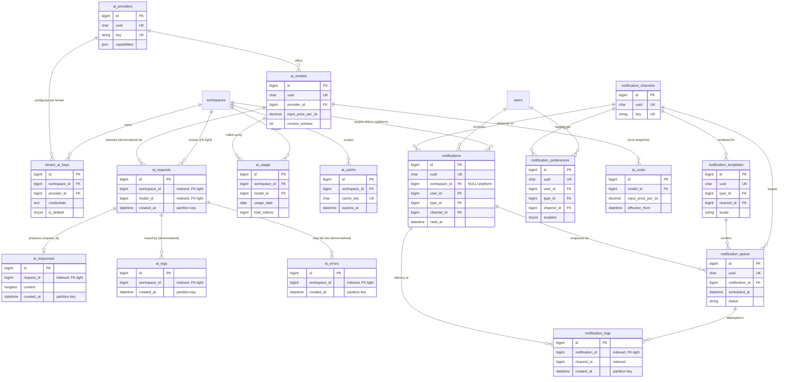

# 09 — AI & Notifications (D8)

Domain **D8** of the HalaOps Final Database Blueprint. It owns two tightly
related concerns: the **multi-engine AI layer** (a global provider/model catalog,
per-tenant bring-your-own-key credentials, and the billions-scale request/
response/usage/cost/log/error/cache tables every AI call flows through) and the
**notification system** (the in-app/email/SMS/WhatsApp/push delivery backbone
with multi-language templates, per-user preferences, a send queue, and delivery
logs).

The defining rule of the AI half is that **HalaOps stores NO AI keys of its
own** — every workspace supplies and pays for its own provider credentials
(`tenant_ai_keys`, BUILT as `ai_credentials`); there is no platform fallback
key. The defining rule of the AI append tables (`ai_requests`, `ai_responses`,
`ai_logs`, `ai_errors`) is **scale**: they reach billions of rows, so they are
partitioned by `created_at`, kept FK-light (indexed `workspace_id` + `created_at`
instead of hard foreign keys), narrow on the hot path with large payloads pushed
to `LONGTEXT`/`JSON` fetched only on detail, and they omit `uuid`.

Scale target for this domain: **billions of AI rows** and **high-volume
notifications** across 100k tenants. See the partitioning and FK-light notes per
table below and §7 of the [00-Database-Bible](00-Database-Bible.md).

## Related Documents

- [00-Database-Bible](00-Database-Bible.md) — the standard this domain follows (conventions, config-driven rule, scale/partitioning §7, FK policy §4).
- [01-Lookups-Reference](01-Lookups-Reference.md) — `lookup_categories`/`lookup_values` (notification **type** lookup, AI request **type**), `languages`/`locale`, `translations`, `currencies`.
- [02-RBAC-Membership](02-RBAC-Membership.md) — `users` (recipient/actor), the `ai.view`/`ai.manage` and `notifications.view` permissions.
- [03-Workspaces-Settings](03-Workspaces-Settings.md) — `workspaces` (the tenant FK), `workspace_ai_settings` (non-secret AI knobs), `mail_settings` (email channel transport).
- [05-Subscriptions-Billing](05-Subscriptions-Billing.md) — `usage_records`/`usage_limits` consume `ai_usage` for plan metering; `currencies` for cost money columns.
- [08-Applications-Interviews](08-Applications-Interviews.md) — the AI interview engine, primary consumer of the AI layer; emits interview notification events.
- [10-HR-Talent](10-HR-Talent.md) — offers/approvals emit notification events.
- [11-Files-Queue-Analytics-Logs](11-Files-Queue-Analytics-Logs.md) — `queued_jobs`/`failed_jobs` (notification delivery workers), `ai_analytics` (BI rollups distinct from operational `ai_usage`), `files` (attachments referenced in notification `data`).
- [99-ERD-Blueprint](99-ERD-Blueprint.md) — the complete cross-domain ERD.
- Up-stream specs: [../16-AI-Architecture](../16-AI-Architecture.md), [../17-AI-Providers](../17-AI-Providers.md), [../26-Notification-System](../26-Notification-System.md).

## Domain Summary

| # | Table | Built? | Scope | Soft-delete | Purpose (one line) |
|---|-------|--------|-------|-------------|--------------------|
| 1 | `ai_providers` | BLUEPRINT | Global | Yes | Global catalog of AI vendors (openai/anthropic/gemini/deepseek/azure/heygen). |
| 2 | `ai_models` | BLUEPRINT | Global | Yes | Per-provider models with pricing per 1k tokens + context window (multi-engine). |
| 3 | `tenant_ai_keys` | **BUILT** (`ai_credentials`) | Tenant | No | Per-tenant encrypted provider credentials — platform holds none. |
| 4 | `ai_requests` | BLUEPRINT | Tenant | No | Every AI call's request (billions; partitioned; FK-light; no uuid). |
| 5 | `ai_responses` | BLUEPRINT | Tenant | No | Provider responses paired to requests (billions; partitioned; FK-light). |
| 6 | `ai_usage` | BLUEPRINT | Tenant | No | Daily rollup per workspace/model (tokens, cost) for metering. |
| 7 | `ai_costs` | BLUEPRINT | Global | No | Historical cost snapshots per model (audit trail of price changes). |
| 8 | `ai_logs` | BLUEPRINT | Tenant | No | Operational trace of AI activity (billions; partitioned; FK-light). |
| 9 | `ai_errors` | BLUEPRINT | Tenant | No | Normalized AI failures (billions; partitioned; FK-light). |
| 10 | `ai_cache` | BLUEPRINT | Tenant | No | Prompt→response cache keyed by hash with TTL. |
| 11 | `notifications` | BLUEPRINT | Tenant (NULL ok) | No | Per-user in-app/delivery notification records (high volume; partitioned). |
| 12 | `notification_templates` | BLUEPRINT | Tenant (NULL ok) | Yes | Per type+locale+channel subject/body with variables (multi-language). |
| 13 | `notification_channels` | BLUEPRINT | Global | Yes | Config catalog of delivery channels (in_app/email/sms/whatsapp/push/slack/teams). |
| 14 | `notification_preferences` | BLUEPRINT | Tenant (NULL ok) | No | Per user×type×channel enabled toggle. |
| 15 | `notification_queue` | BLUEPRINT | Tenant (NULL ok) | No | Pending/scheduled sends awaiting a worker (high volume). |
| 16 | `notification_logs` | BLUEPRINT | Tenant (NULL ok) | No | Per-attempt delivery outcome + provider response (high volume; partitioned). |

**Config-driven note.** Per the Bible §2, nothing in this domain is a hard-coded
ENUM: provider/model/channel are catalog tables; notification **type** is a
`lookup_values` row (category `notification_type`); AI request **type** /
**capability** are `lookup_values` (categories `ai_request_type`,
`ai_capability`); statuses on `ai_requests`/`notification_queue` are short
config-keyed VARCHARs documented per table (deliberately denormalized scalars on
billions-scale append tables, not FKs — see each table's Notes).

---

## 1. `ai_providers`

- **BLUEPRINT** · Global catalog of AI vendors HalaOps can integrate with. · **Not** tenant-scoped (global, seeded). · Soft-delete: **yes** (`deleted_at`) — a retired vendor is hidden but its FK references survive.

Seeded vendors: `openai`, `anthropic`, `gemini`, `deepseek`, `azure_openai`,
`heygen`. This is the multi-AI catalog the Bible §8 names; `tenant_ai_keys.provider_id`
and `ai_models.provider_id` reference it.

### Columns

| Column | Type | Null | Default | Notes |
|--------|------|------|---------|-------|
| `id` | BIGINT UNSIGNED | NO | AUTO_INC | PK. |
| `uuid` | CHAR(36) | NO | — | Public id; UNIQUE. |
| `key` | VARCHAR(40) | NO | — | Stable registry key (`openai`, `anthropic`, …); matches `AiProviderRegistry`. |
| `name` | VARCHAR(120) | NO | — | Display name ("OpenAI", "Anthropic Claude"). |
| `slug` | VARCHAR(60) | NO | — | URL-safe identifier. |
| `capabilities` | JSON | NO | — | Capability flags `{chat,completion,embeddings,transcription,video}` and feature metadata. |
| `auth_type` | VARCHAR(30) | NO | `'api_key'` | Credential model (`api_key`, `api_key_endpoint` for Azure/self-hosted). |
| `required_fields` | JSON | YES | NULL | Credential fields the tenant must supply (`api_key`, `base_url`, `deployment`, `api_version`). |
| `base_url` | VARCHAR(255) | YES | NULL | Default API base (vendor default; tenant may override in `tenant_ai_keys.meta`). |
| `logo_url` | VARCHAR(255) | YES | NULL | Provider logo for Settings cards. |
| `website_url` | VARCHAR(255) | YES | NULL | Vendor site / docs link. |
| `is_active` | TINYINT(1) | NO | 1 | Whether the provider is selectable. |
| `sort_order` | INT | NO | 0 | Ordering in Settings UI. |
| `created_at` | TIMESTAMP | YES | NULL | |
| `updated_at` | TIMESTAMP | YES | NULL | |
| `deleted_at` | TIMESTAMP | YES | NULL | Soft delete. |

### Keys
- **PK**: `id`. **UUID**: `uuid` UNIQUE. **Unique**: `key`, `slug`.

### Indexes
| Name | Columns | Type |
|------|---------|------|
| `ai_providers_uuid_unique` | `uuid` | unique |
| `ai_providers_key_unique` | `key` | unique |
| `ai_providers_slug_unique` | `slug` | unique |
| `ai_providers_active_sort_index` | `is_active`, `sort_order` | composite |

### Foreign keys
None (root catalog).

### Relationships + cardinality
- `ai_providers` 1—* `ai_models`.
- `ai_providers` 1—* `tenant_ai_keys` (one configuration per tenant per provider).

### Notes
Global reference data, not workspace-scoped (Bible §2 "reference data"). The
`capabilities` JSON keeps the catalog open-ended (new capabilities need no
schema change). The platform stores no keys here — only metadata about which
vendors exist.

---

## 2. `ai_models`

- **BLUEPRINT** · Per-provider model catalog with pricing and context window. · **Not** tenant-scoped (global, seeded; tenants pick a default model in `workspace_ai_settings`/`tenant_ai_keys.meta`). · Soft-delete: **yes** (retired models hidden, references survive).

Multi-engine future: each provider exposes many models (e.g. `gpt-4o`,
`claude-3-7-sonnet`, `gemini-1.5-pro`, `deepseek-chat`). Pricing is **per 1k
tokens** with a **context window**; current price lives here, historical price
snapshots live in `ai_costs`.

### Columns

| Column | Type | Null | Default | Notes |
|--------|------|------|---------|-------|
| `id` | BIGINT UNSIGNED | NO | AUTO_INC | PK. |
| `uuid` | CHAR(36) | NO | — | Public id; UNIQUE. |
| `provider_id` | BIGINT UNSIGNED | NO | — | FK → `ai_providers(id)`. |
| `key` | VARCHAR(80) | NO | — | Vendor model id (`gpt-4o`, `claude-3-7-sonnet`). |
| `name` | VARCHAR(120) | NO | — | Display name. |
| `capability` | VARCHAR(30) | NO | `'chat'` | Primary capability (`chat`/`completion`/`embeddings`/`transcription`/`video`); config-keyed. |
| `context_window` | INT UNSIGNED | YES | NULL | Max context tokens. |
| `max_output_tokens` | INT UNSIGNED | YES | NULL | Max generated tokens. |
| `input_price_per_1k` | DECIMAL(12,6) | YES | NULL | Cost per 1k **input** tokens. |
| `output_price_per_1k` | DECIMAL(12,6) | YES | NULL | Cost per 1k **output** tokens. |
| `currency_id` | BIGINT UNSIGNED | YES | NULL | FK → `currencies(id)`; pricing currency (typically USD). |
| `supports_streaming` | TINYINT(1) | NO | 0 | Token-by-token streaming support. |
| `supports_vision` | TINYINT(1) | NO | 0 | Image input support. |
| `meta` | JSON | YES | NULL | Extra capabilities/limits (modalities, rate hints). |
| `is_active` | TINYINT(1) | NO | 1 | Selectable. |
| `is_default` | TINYINT(1) | NO | 0 | Default model for its provider+capability. |
| `sort_order` | INT | NO | 0 | UI ordering. |
| `created_at` | TIMESTAMP | YES | NULL | |
| `updated_at` | TIMESTAMP | YES | NULL | |
| `deleted_at` | TIMESTAMP | YES | NULL | Soft delete. |

### Keys
- **PK**: `id`. **UUID**: `uuid` UNIQUE. **Unique**: `(provider_id, key)`.

### Indexes
| Name | Columns | Type |
|------|---------|------|
| `ai_models_uuid_unique` | `uuid` | unique |
| `ai_models_provider_key_unique` | `provider_id`, `key` | unique (composite) |
| `ai_models_provider_id_index` | `provider_id` | index (FK) |
| `ai_models_currency_id_index` | `currency_id` | index (FK) |
| `ai_models_provider_capability_index` | `provider_id`, `capability`, `is_active` | composite |

### Foreign keys
| Column | Ref | On delete | On update |
|--------|-----|-----------|-----------|
| `provider_id` | `ai_providers(id)` | RESTRICT | CASCADE |
| `currency_id` | `currencies(id)` | RESTRICT | CASCADE |

### Relationships + cardinality
- `ai_providers` 1—* `ai_models`.
- `ai_models` 1—* `ai_costs` (historical price snapshots).
- `ai_models` 1—* `ai_usage` (daily rollups reference the model).
- `ai_models` is referenced by `ai_requests.model_id` (denormalized id, FK-light — see §4).

### Notes
Pricing folds naturally into this catalog (current price columns here); the
design **keeps `ai_costs` separately** for an append-only history of price
changes so historical `ai_usage` cost can be recomputed/audited against the
price that was in force (Bible §3NF — no recomputation loss). Multi-currency via
`currency_id` (Bible §8).

---

## 3. `tenant_ai_keys`  *(BUILT as `ai_credentials`)*

- **BUILT** (migration `0011_create_ai_credentials_table.php`, current table name `ai_credentials`; the blueprint target name is `tenant_ai_keys`). · Per-tenant AI provider credentials. · **Tenant-scoped** (`workspace_id`). · Soft-delete: **no** (deactivate via `is_active`).

**The platform stores NO keys of its own.** Every workspace brings its own
provider key (OpenAI/Anthropic/Gemini/DeepSeek/Azure/HeyGen); the `credentials`
column is an **AES-256-GCM encrypted** JSON blob, never plaintext. There is no
system fallback key and no env var holding a provider key (see
[../16-AI-Architecture](../16-AI-Architecture.md) §1, §10).

### Columns

| Column | Type | Null | Default | Notes |
|--------|------|------|---------|-------|
| `id` | BIGINT UNSIGNED | NO | AUTO_INC | PK. |
| `workspace_id` | BIGINT UNSIGNED | NO | — | FK → `workspaces(id)`; the tenant binding. |
| `provider_id` | BIGINT UNSIGNED | NO | — | **Blueprint:** FK → `ai_providers(id)`. *(Built table currently stores a `provider` VARCHAR(40) registry key; the blueprint normalizes it to `provider_id` — a migration task, see Notes.)* |
| `label` | VARCHAR(120) | YES | NULL | Tenant-friendly name. |
| `credentials` | TEXT | NO | — | AES-256-GCM ciphertext of `{api_key, base_url?, deployment?, …}`. |
| `meta` | JSON | YES | NULL | Non-secret config (default model, region, deployment, soft-cap). |
| `is_active` | TINYINT(1) | NO | 1 | Resolution skips `0`. |
| `is_default` | TINYINT(1) | NO | 0 | Preferred provider for its capability family. |
| `last_used_at` | TIMESTAMP | YES | NULL | Stamped by the guard decorator for default/round-robin resolution. |
| `created_at` | TIMESTAMP | YES | NULL | |
| `updated_at` | TIMESTAMP | YES | NULL | |

### Keys
- **PK**: `id`. **Unique**: `(workspace_id, provider_id)` *(built: `(workspace_id, provider)`)*.
- **UUID**: none in the built table; the blueprint **may add `uuid`** for API consistency (low-volume table, optional — flagged Open Question).

### Indexes
| Name | Columns | Type |
|------|---------|------|
| `ai_credentials_workspace_provider_unique` | `workspace_id`, `provider_id` | unique (composite) |
| `tenant_ai_keys_workspace_id_index` | `workspace_id` | index (FK) |
| `tenant_ai_keys_provider_id_index` | `provider_id` | index (FK; blueprint) |
| `tenant_ai_keys_active_default_index` | `workspace_id`, `is_active`, `is_default` | composite (resolution path) |

### Foreign keys
| Column | Ref | On delete | On update |
|--------|-----|-----------|-----------|
| `workspace_id` | `workspaces(id)` | CASCADE | CASCADE |
| `provider_id` | `ai_providers(id)` | RESTRICT | CASCADE *(blueprint; built table has no provider FK because it stores a string key)* |

### Relationships + cardinality
- `workspaces` 1—* `tenant_ai_keys`.
- `ai_providers` 1—* `tenant_ai_keys`.
- One row per `(workspace_id, provider_id)` — enforced by the unique key; exactly one `is_default` per capability family per tenant (app-enforced in a transaction).

### Notes
- **Migration delta (built → blueprint):** the shipped table keys provider by
  `provider` VARCHAR(40) and has no `uuid`/`deleted_at`. Blueprint target:
  rename to `tenant_ai_keys`, normalize `provider` → `provider_id` FK →
  `ai_providers`, optionally add `uuid`. This is a post-approval migration, not a
  new table (Bible inventory note).
- **Security:** encryption at rest (AES-256-GCM), decrypted in-memory only for
  the duration of a call, never returned to the client (only masked). No
  plaintext key is ever persisted or logged. Tenant isolation via `workspace_id`;
  fail-closed if no active tenant.
- Future expansion ([../16] §13): relax the unique key to
  `(workspace_id, provider_id, label)` to allow multiple keys per provider
  (dev/prod) with weighted routing.

---

## 4. `ai_requests`

- **BLUEPRINT** · One row per AI call made through the provider layer (the request side). · **Tenant-scoped** via indexed `workspace_id` (FK-light). · Soft-delete: **no** (append-only; archived/dropped by partition). · **No `uuid`** (write-throughput).

**Scale: billions of rows.** This is the canonical example of the Bible §4/§7
extreme-volume append table. Design choices:
- **Partition by `RANGE(created_at)` (monthly)**; old partitions archived/dropped.
- **FK-light:** no hard FKs. `workspace_id`, `model_id`, `provider_id`,
  `tenant_ai_key_id`, and the optional subject (`subject_type`,`subject_id`,
  e.g. an interview session) are stored as **indexed plain BIGINTs**; integrity
  is enforced at the application layer (Bible §4 exception).
- **Narrow hot row:** scalar metadata only here; the **big payload (the full
  prompt/messages) lives in `request_payload` LONGTEXT/JSON fetched on detail
  only**, excluded from list queries.

### Columns

| Column | Type | Null | Default | Notes |
|--------|------|------|---------|-------|
| `id` | BIGINT UNSIGNED | NO | AUTO_INC | PK (part of partitioned key with `created_at`). |
| `workspace_id` | BIGINT UNSIGNED | NO | — | Tenant scope (indexed, **no FK**). |
| `tenant_ai_key_id` | BIGINT UNSIGNED | YES | NULL | Which credential resolved (indexed, no FK). |
| `provider_id` | BIGINT UNSIGNED | YES | NULL | Resolved provider (denormalized, indexed). |
| `model_id` | BIGINT UNSIGNED | YES | NULL | Selected model (denormalized, indexed). |
| `model_key` | VARCHAR(80) | YES | NULL | Vendor model id as sent (denormalized for history if model row changes). |
| `request_type_id` | BIGINT UNSIGNED | YES | NULL | `lookup_values` (`ai_request_type`); denormalized id, no FK. |
| `capability` | VARCHAR(30) | NO | `'chat'` | `chat`/`embeddings`/`transcription`/… (config-keyed scalar). |
| `subject_type` | VARCHAR(60) | YES | NULL | Polymorphic origin type (e.g. `interview_session`). |
| `subject_id` | BIGINT UNSIGNED | YES | NULL | Polymorphic origin id. |
| `user_id` | BIGINT UNSIGNED | YES | NULL | Actor who triggered it (indexed, no FK). |
| `status` | VARCHAR(20) | NO | `'pending'` | `pending`/`succeeded`/`failed`/`timeout` (config-keyed scalar; not an ENUM). |
| `prompt_tokens` | INT UNSIGNED | YES | NULL | Input token count (when known up front). |
| `max_tokens` | INT UNSIGNED | YES | NULL | Requested output cap. |
| `request_hash` | CHAR(64) | YES | NULL | SHA-256 of normalized prompt (links to `ai_cache`). |
| `request_payload` | LONGTEXT | YES | NULL | **Big** payload (messages/prompt JSON) — detail-only, never in list queries. |
| `idempotency_key` | CHAR(36) | YES | NULL | Optional client de-dup key. |
| `created_at` | DATETIME | NO | — | **Partition key**; not nullable on purpose. |

### Keys
- **PK**: `(id, created_at)` (partitioning requires the partition column in the PK). **No UUID** (documented omission, Bible §1).

### Indexes
| Name | Columns | Type |
|------|---------|------|
| `ai_requests_workspace_created_index` | `workspace_id`, `created_at` | composite (primary access path) |
| `ai_requests_model_created_index` | `model_id`, `created_at` | composite |
| `ai_requests_status_created_index` | `status`, `created_at` | composite |
| `ai_requests_subject_index` | `subject_type`, `subject_id` | composite (polymorphic) |
| `ai_requests_request_hash_index` | `request_hash` | index (cache correlation) |
| `ai_requests_idempotency_index` | `workspace_id`, `idempotency_key` | composite |

### Foreign keys
**None — FK-light by design.** `workspace_id`/`model_id`/`provider_id`/
`tenant_ai_key_id`/`user_id` are indexed BIGINTs validated at the app layer
(Bible §4 extreme-volume exception). This is required to sustain billions of
inserts without InnoDB FK-check overhead.

### Relationships + cardinality
- `workspaces` 1—* `ai_requests` (logical; indexed, not FK-enforced).
- `ai_models` 1—* `ai_requests` (logical, denormalized id).
- `ai_requests` 1—0..1 `ai_responses` (a request may have one response; failures may have none + an `ai_errors` row).
- `ai_requests` 1—* `ai_logs` / `ai_errors` (logical via `request_id`).

### Notes
Explicit scale strategy: monthly `RANGE(created_at)` partitions, narrow hot
columns + isolated `LONGTEXT` payload, FK-light, no `uuid`. Rolled up daily into
`ai_usage`. Detail/forensic reads hit a single partition by `(workspace_id,
created_at)`.

---

## 5. `ai_responses`

- **BLUEPRINT** · The provider's response paired to an `ai_requests` row. · **Tenant-scoped** via indexed `workspace_id` (FK-light). · Soft-delete: **no** (append-only, partitioned). · **No `uuid`**.

**Scale: billions of rows** — same regime as `ai_requests`: partition by
`created_at`, FK-light, narrow row + **big response body in `content`
LONGTEXT/JSON fetched on detail only**.

### Columns

| Column | Type | Null | Default | Notes |
|--------|------|------|---------|-------|
| `id` | BIGINT UNSIGNED | NO | AUTO_INC | PK (with `created_at`). |
| `request_id` | BIGINT UNSIGNED | NO | — | The originating `ai_requests.id` (indexed, **no FK**). |
| `workspace_id` | BIGINT UNSIGNED | NO | — | Tenant scope (denormalized for partition-local joins; indexed, no FK). |
| `model_id` | BIGINT UNSIGNED | YES | NULL | Echoed model (denormalized). |
| `finish_reason` | VARCHAR(40) | YES | NULL | Vendor stop reason (`stop`/`length`/`content_filter`). |
| `prompt_tokens` | INT UNSIGNED | YES | NULL | Tokens charged for input. |
| `completion_tokens` | INT UNSIGNED | YES | NULL | Tokens generated. |
| `total_tokens` | INT UNSIGNED | YES | NULL | Sum (vendor-reported). |
| `cost_amount` | DECIMAL(14,6) | YES | NULL | Computed cost (from the in-force model/`ai_costs` price). |
| `currency_id` | BIGINT UNSIGNED | YES | NULL | Cost currency (denormalized, no FK). |
| `latency_ms` | INT UNSIGNED | YES | NULL | Round-trip latency. |
| `content` | LONGTEXT | YES | NULL | **Big** response body (text/JSON) — detail-only. |
| `usage_raw` | JSON | YES | NULL | Raw vendor usage block (detail-only). |
| `created_at` | DATETIME | NO | — | **Partition key**. |

### Keys
- **PK**: `(id, created_at)`. **No UUID** (documented omission).

### Indexes
| Name | Columns | Type |
|------|---------|------|
| `ai_responses_request_id_index` | `request_id` | index (pairing) |
| `ai_responses_workspace_created_index` | `workspace_id`, `created_at` | composite (access path) |
| `ai_responses_model_created_index` | `model_id`, `created_at` | composite |

### Foreign keys
**None — FK-light by design** (Bible §4). `request_id`/`workspace_id`/`model_id`
are indexed BIGINTs; pairing integrity is app-enforced.

### Relationships + cardinality
- `ai_requests` 1—0..1 `ai_responses` (logical via `request_id`).
- `ai_responses` token/cost columns feed the daily `ai_usage` rollup.

### Notes
Token/cost columns are the source of `ai_usage` aggregation. Big `content`/
`usage_raw` excluded from list queries. Same monthly partitioning and archival
as `ai_requests`.

---

## 6. `ai_usage`

- **BLUEPRINT** · Pre-aggregated **daily rollup** of AI consumption per workspace and model. · **Tenant-scoped** (`workspace_id`). · Soft-delete: **no** (derived aggregate; recomputable).

A compact, queryable rollup so billing/metering and the tenant's AI usage panel
never scan billions of `ai_requests`/`ai_responses` rows. One row per
`(workspace_id, model_id, usage_date)`; consumed by `usage_records`/`usage_limits`
in [05-Subscriptions-Billing](05-Subscriptions-Billing.md).

### Columns

| Column | Type | Null | Default | Notes |
|--------|------|------|---------|-------|
| `id` | BIGINT UNSIGNED | NO | AUTO_INC | PK. |
| `uuid` | CHAR(36) | NO | — | Public id; UNIQUE (low-volume aggregate keeps `uuid`). |
| `workspace_id` | BIGINT UNSIGNED | NO | — | FK → `workspaces(id)`. |
| `provider_id` | BIGINT UNSIGNED | YES | NULL | FK → `ai_providers(id)` (denormalized for grouping). |
| `model_id` | BIGINT UNSIGNED | YES | NULL | FK → `ai_models(id)`. |
| `usage_date` | DATE | NO | — | The rolled-up day. |
| `capability` | VARCHAR(30) | YES | NULL | Optional split by capability. |
| `request_count` | BIGINT UNSIGNED | NO | 0 | Number of calls. |
| `success_count` | BIGINT UNSIGNED | NO | 0 | Successful calls. |
| `error_count` | BIGINT UNSIGNED | NO | 0 | Failed calls. |
| `prompt_tokens` | BIGINT UNSIGNED | NO | 0 | Summed input tokens. |
| `completion_tokens` | BIGINT UNSIGNED | NO | 0 | Summed output tokens. |
| `total_tokens` | BIGINT UNSIGNED | NO | 0 | Summed tokens. |
| `cost_amount` | DECIMAL(16,6) | NO | 0 | Summed cost. |
| `currency_id` | BIGINT UNSIGNED | YES | NULL | FK → `currencies(id)`. |
| `created_at` | TIMESTAMP | YES | NULL | |
| `updated_at` | TIMESTAMP | YES | NULL | |

### Keys
- **PK**: `id`. **UUID**: `uuid` UNIQUE. **Unique**: `(workspace_id, model_id, usage_date, capability)`.

### Indexes
| Name | Columns | Type |
|------|---------|------|
| `ai_usage_uuid_unique` | `uuid` | unique |
| `ai_usage_workspace_model_date_unique` | `workspace_id`, `model_id`, `usage_date`, `capability` | unique (composite) |
| `ai_usage_workspace_date_index` | `workspace_id`, `usage_date` | composite (panel/metering) |
| `ai_usage_provider_id_index` | `provider_id` | index (FK) |
| `ai_usage_model_id_index` | `model_id` | index (FK) |
| `ai_usage_currency_id_index` | `currency_id` | index (FK) |

### Foreign keys
| Column | Ref | On delete | On update |
|--------|-----|-----------|-----------|
| `workspace_id` | `workspaces(id)` | CASCADE | CASCADE |
| `provider_id` | `ai_providers(id)` | RESTRICT | CASCADE |
| `model_id` | `ai_models(id)` | RESTRICT | CASCADE |
| `currency_id` | `currencies(id)` | RESTRICT | CASCADE |

### Relationships + cardinality
- `workspaces` 1—* `ai_usage`.
- `ai_models` 1—* `ai_usage`.
- Drives `usage_records`/`usage_limits` (D4) for plan AI metering.

### Notes
A rollup table is the §7 prescription for keeping billions-scale data queryable.
Unlike the FK-light append tables, this is low-volume (one row per
workspace×model×day) so it **keeps `uuid` and hard FKs**. Distinct from the BI
`ai_analytics` in D10 (analytics/reporting); `ai_usage` is the operational
metering source of truth.

---

## 7. `ai_costs`

- **BLUEPRINT** · **Historical cost snapshots** per model (an append-only price history). · Global (catalog-adjacent). · Soft-delete: **no** (immutable history; supersede with a new row).

Pricing can fold into `ai_models` (current price), **but `ai_costs` is kept** so
the price in force at any past date is preserved — letting historical `ai_usage`
cost be audited/recomputed against the correct price after a vendor changes
rates (Bible §3NF: avoid losing historical truth).

### Columns

| Column | Type | Null | Default | Notes |
|--------|------|------|---------|-------|
| `id` | BIGINT UNSIGNED | NO | AUTO_INC | PK. |
| `uuid` | CHAR(36) | NO | — | Public id; UNIQUE. |
| `model_id` | BIGINT UNSIGNED | NO | — | FK → `ai_models(id)`. |
| `input_price_per_1k` | DECIMAL(12,6) | NO | — | Input price per 1k tokens at snapshot. |
| `output_price_per_1k` | DECIMAL(12,6) | NO | — | Output price per 1k tokens at snapshot. |
| `currency_id` | BIGINT UNSIGNED | NO | — | FK → `currencies(id)`. |
| `unit` | VARCHAR(20) | NO | `'1k_tokens'` | Pricing unit (`1k_tokens`, `minute`, `image`, `credit`). |
| `effective_from` | DATETIME | NO | — | When this price took effect. |
| `effective_to` | DATETIME | YES | NULL | When superseded (NULL = current). |
| `source` | VARCHAR(40) | YES | NULL | Where the price came from (`vendor`, `manual`). |
| `created_at` | TIMESTAMP | YES | NULL | |
| `updated_at` | TIMESTAMP | YES | NULL | |

### Keys
- **PK**: `id`. **UUID**: `uuid` UNIQUE. **Unique**: `(model_id, effective_from)`.

### Indexes
| Name | Columns | Type |
|------|---------|------|
| `ai_costs_uuid_unique` | `uuid` | unique |
| `ai_costs_model_effective_unique` | `model_id`, `effective_from` | unique (composite) |
| `ai_costs_model_id_index` | `model_id` | index (FK) |
| `ai_costs_currency_id_index` | `currency_id` | index (FK) |
| `ai_costs_effective_index` | `effective_from`, `effective_to` | composite (point-in-time lookup) |

### Foreign keys
| Column | Ref | On delete | On update |
|--------|-----|-----------|-----------|
| `model_id` | `ai_models(id)` | CASCADE | CASCADE |
| `currency_id` | `currencies(id)` | RESTRICT | CASCADE |

### Relationships + cardinality
- `ai_models` 1—* `ai_costs` (one current + N historical price rows per model).

### Notes
Rationale for keeping it separate from `ai_models`: the model row carries the
*current* price for convenience; `ai_costs` is the *temporal* record (effective
ranges) so costing is reproducible. Low volume; hard FKs and `uuid` retained.

---

## 8. `ai_logs`

- **BLUEPRINT** · Operational trace of AI-layer activity (resolution, guard, rate-limit, retries — not just errors). · **Tenant-scoped** via indexed `workspace_id` (FK-light). · Soft-delete: **no** (append-only, partitioned). · **No `uuid`**.

**Scale: billions of rows** — Bible §4/§7 append table: partition by
`created_at`, FK-light, narrow row + big context in JSON detail-only.

### Columns

| Column | Type | Null | Default | Notes |
|--------|------|------|---------|-------|
| `id` | BIGINT UNSIGNED | NO | AUTO_INC | PK (with `created_at`). |
| `workspace_id` | BIGINT UNSIGNED | NO | — | Tenant scope (indexed, **no FK**). |
| `request_id` | BIGINT UNSIGNED | YES | NULL | Correlated `ai_requests.id` (indexed, no FK). |
| `level` | VARCHAR(20) | NO | `'info'` | `debug`/`info`/`warning`/`error` (config-keyed scalar). |
| `event` | VARCHAR(60) | NO | — | What happened (`resolve`, `rate_limited`, `retry`, `call_start`, `call_end`). |
| `provider_id` | BIGINT UNSIGNED | YES | NULL | Denormalized (indexed). |
| `model_id` | BIGINT UNSIGNED | YES | NULL | Denormalized (indexed). |
| `message` | VARCHAR(255) | YES | NULL | Short human-readable summary. |
| `context` | JSON | YES | NULL | Structured context (detail-only; masked — never secrets/keys). |
| `created_at` | DATETIME | NO | — | **Partition key**. |

### Keys
- **PK**: `(id, created_at)`. **No UUID** (documented omission).

### Indexes
| Name | Columns | Type |
|------|---------|------|
| `ai_logs_workspace_created_index` | `workspace_id`, `created_at` | composite (access path) |
| `ai_logs_request_id_index` | `request_id` | index |
| `ai_logs_level_created_index` | `level`, `created_at` | composite |
| `ai_logs_event_created_index` | `event`, `created_at` | composite |

### Foreign keys
**None — FK-light by design** (Bible §4). `workspace_id`/`request_id`/`provider_id`/
`model_id` indexed; integrity app-enforced.

### Relationships + cardinality
- `workspaces` 1—* `ai_logs` (logical).
- `ai_requests` 1—* `ai_logs` (logical via `request_id`).

### Notes
Security: `context` carries only masked metadata — provider keys are **never**
logged (Bible/AI security rule). Monthly partitions; older partitions pruned.

---

## 9. `ai_errors`

- **BLUEPRINT** · Normalized AI failures (typed: auth/rate-limit/timeout/transport/unsupported). · **Tenant-scoped** via indexed `workspace_id` (FK-light). · Soft-delete: **no** (append-only, partitioned). · **No `uuid`**.

**Scale: billions (potentially) of rows** — Bible §4/§7 append table; same
regime as `ai_logs`. Separated from `ai_logs` so error dashboards/alerting query
a small, error-only table.

### Columns

| Column | Type | Null | Default | Notes |
|--------|------|------|---------|-------|
| `id` | BIGINT UNSIGNED | NO | AUTO_INC | PK (with `created_at`). |
| `workspace_id` | BIGINT UNSIGNED | NO | — | Tenant scope (indexed, **no FK**). |
| `request_id` | BIGINT UNSIGNED | YES | NULL | The failed `ai_requests.id` (indexed, no FK). |
| `provider_id` | BIGINT UNSIGNED | YES | NULL | Denormalized (indexed). |
| `model_id` | BIGINT UNSIGNED | YES | NULL | Denormalized (indexed). |
| `error_type` | VARCHAR(40) | NO | — | Normalized category (`auth`/`rate_limit`/`timeout`/`transport`/`unsupported`/`no_provider`/`decrypt`). |
| `http_status` | SMALLINT UNSIGNED | YES | NULL | Vendor HTTP status (401/429/5xx). |
| `vendor_code` | VARCHAR(80) | YES | NULL | Vendor-specific error code. |
| `message` | VARCHAR(255) | YES | NULL | Normalized message (no secrets). |
| `detail` | JSON | YES | NULL | Full normalized error/stack context (detail-only, masked). |
| `is_retryable` | TINYINT(1) | NO | 0 | Whether the call may be retried. |
| `created_at` | DATETIME | NO | — | **Partition key**. |

### Keys
- **PK**: `(id, created_at)`. **No UUID** (documented omission).

### Indexes
| Name | Columns | Type |
|------|---------|------|
| `ai_errors_workspace_created_index` | `workspace_id`, `created_at` | composite (access path) |
| `ai_errors_request_id_index` | `request_id` | index |
| `ai_errors_type_created_index` | `error_type`, `created_at` | composite (alerting) |
| `ai_errors_provider_created_index` | `provider_id`, `created_at` | composite |

### Foreign keys
**None — FK-light by design** (Bible §4). Indexed `workspace_id`/`request_id`/
`provider_id`/`model_id`; integrity app-enforced.

### Relationships + cardinality
- `workspaces` 1—* `ai_errors` (logical).
- `ai_requests` 1—* `ai_errors` (logical via `request_id`).
- Feeds `error_count` in `ai_usage` and may trigger notifications (invalid key → notify `ai.manage` users).

### Notes
Error-only narrow table for cheap alerting/dashboards; partitioned monthly. No
keys/secrets in `message`/`detail`.

---

## 10. `ai_cache`

- **BLUEPRINT** · Prompt→response cache keyed by a content hash with TTL, to avoid re-billing identical AI calls. · **Tenant-scoped** (`workspace_id`) — cache never crosses tenants. · Soft-delete: **no** (expired/evicted by `expires_at`).

### Columns

| Column | Type | Null | Default | Notes |
|--------|------|------|---------|-------|
| `id` | BIGINT UNSIGNED | NO | AUTO_INC | PK. |
| `workspace_id` | BIGINT UNSIGNED | NO | — | FK → `workspaces(id)`; cache is tenant-isolated. |
| `cache_key` | CHAR(64) | NO | — | SHA-256 hash of `(model, normalized prompt, params)`. |
| `model_id` | BIGINT UNSIGNED | YES | NULL | FK → `ai_models(id)` (which model produced it). |
| `capability` | VARCHAR(30) | YES | NULL | `chat`/`embeddings`/… |
| `response` | LONGTEXT | YES | NULL | Cached response body (detail payload). |
| `tokens` | INT UNSIGNED | YES | NULL | Tokens the cached call cost (for savings reporting). |
| `hit_count` | INT UNSIGNED | NO | 0 | Times served from cache. |
| `last_hit_at` | TIMESTAMP | YES | NULL | Last cache hit. |
| `expires_at` | DATETIME | NO | — | TTL — expired rows are evicted. |
| `created_at` | TIMESTAMP | YES | NULL | |
| `updated_at` | TIMESTAMP | YES | NULL | |

### Keys
- **PK**: `id`. **Unique**: `(workspace_id, cache_key)` — one cached entry per tenant per hash. (No `uuid`: internal cache, not a public resource — documented omission.)

### Indexes
| Name | Columns | Type |
|------|---------|------|
| `ai_cache_workspace_key_unique` | `workspace_id`, `cache_key` | unique (composite) |
| `ai_cache_workspace_id_index` | `workspace_id` | index (FK) |
| `ai_cache_model_id_index` | `model_id` | index (FK) |
| `ai_cache_expires_at_index` | `expires_at` | index (eviction sweep) |

### Foreign keys
| Column | Ref | On delete | On update |
|--------|-----|-----------|-----------|
| `workspace_id` | `workspaces(id)` | CASCADE | CASCADE |
| `model_id` | `ai_models(id)` | SET NULL | CASCADE |

### Relationships + cardinality
- `workspaces` 1—* `ai_cache`.
- `ai_models` 1—* `ai_cache` (optional model ref).
- Correlates to `ai_requests.request_hash` (same hashing scheme).

### Notes
Tenant-scoped to honour data governance (a cached candidate-data response must
never leak across tenants). A scheduled job sweeps `expires_at`. Moderate volume
(bounded by distinct prompts within TTL), so it keeps hard FKs.

---

## 11. `notifications`

- **BLUEPRINT** · Per-user notification record (in-app inbox row and/or delivery record). · **Tenant-scoped with `workspace_id` NULL allowed** (NULL = platform-wide broadcast). · Soft-delete: **no** (high volume; pruned by retention job / partition).

**High volume → partition by `created_at`** (Bible §7). Keyed primarily by
`user_id` (a person may receive across the workspaces they belong to, plus
platform broadcasts). `type_id` → `lookup_values` (config-driven, not an ENUM);
`channel_id` → `notification_channels`.

### Columns

| Column | Type | Null | Default | Notes |
|--------|------|------|---------|-------|
| `id` | BIGINT UNSIGNED | NO | AUTO_INC | PK (with `created_at`). |
| `uuid` | CHAR(36) | NO | — | Public id; UNIQUE (user-facing resource → keeps `uuid`). |
| `workspace_id` | BIGINT UNSIGNED | YES | NULL | FK → `workspaces(id)`; **NULL = platform-wide**. |
| `user_id` | BIGINT UNSIGNED | NO | — | FK → `users(id)`; the recipient. |
| `type_id` | BIGINT UNSIGNED | NO | — | FK → `lookup_values(id)` (category `notification_type`), the event key. |
| `channel_id` | BIGINT UNSIGNED | NO | — | FK → `notification_channels(id)` the row was delivered/destined on. |
| `title` | VARCHAR(255) | NO | — | Rendered, localized title. |
| `body` | TEXT | YES | NULL | Rendered, localized body. |
| `data` | JSON | YES | NULL | Structured payload (ids, links, names) for rendering/deep-links; references `files` for attachments. |
| `locale` | VARCHAR(10) | YES | NULL | Locale it was rendered in (AR/EN). |
| `actor_id` | BIGINT UNSIGNED | YES | NULL | FK → `users(id)`; who caused the event (SET NULL). |
| `subject_type` | VARCHAR(60) | YES | NULL | Polymorphic subject type (e.g. `application`, `interview`). |
| `subject_id` | BIGINT UNSIGNED | YES | NULL | Polymorphic subject id. |
| `read_at` | TIMESTAMP | YES | NULL | NULL = unread (in-app unread state). |
| `created_at` | DATETIME | NO | — | **Partition key**. |
| `updated_at` | TIMESTAMP | YES | NULL | |

### Keys
- **PK**: `(id, created_at)` (partitioned). **UUID**: `uuid` UNIQUE.

### Indexes
| Name | Columns | Type |
|------|---------|------|
| `notifications_uuid_unique` | `uuid` | unique |
| `notifications_user_read_index` | `user_id`, `read_at` | composite (**inbox + unread count**) |
| `notifications_user_created_index` | `user_id`, `created_at` | composite (inbox newest-first) |
| `notifications_workspace_created_index` | `workspace_id`, `created_at` | composite |
| `notifications_type_id_index` | `type_id` | index (FK) |
| `notifications_channel_id_index` | `channel_id` | index (FK) |
| `notifications_subject_index` | `subject_type`, `subject_id` | composite (polymorphic) |

### Foreign keys
| Column | Ref | On delete | On update |
|--------|-----|-----------|-----------|
| `workspace_id` | `workspaces(id)` | CASCADE | CASCADE |
| `user_id` | `users(id)` | CASCADE | CASCADE |
| `type_id` | `lookup_values(id)` | RESTRICT | CASCADE |
| `channel_id` | `notification_channels(id)` | RESTRICT | CASCADE |
| `actor_id` | `users(id)` | SET NULL | CASCADE |

> On a time-partitioned table the engine cannot enforce incoming FKs against the
> partition column; the logical FKs above are documented and enforced at the app
> layer, consistent with the Bible §4/§7 treatment of high-volume tables. If a
> non-partitioned variant is chosen at implementation, the FKs apply directly.

### Relationships + cardinality
- `users` 1—* `notifications` (recipient).
- `workspaces` 1—* `notifications` (or NULL for platform-wide).
- `notification_channels` 1—* `notifications`.
- `lookup_values` (notification_type) 1—* `notifications`.
- A `notifications` row is enqueued as `notification_queue` and recorded in `notification_logs`.

### Notes
Access is always filtered by `user_id = auth()->id()` (the isolation a candidate
needs across workspaces). `data` is treated as untrusted on render (escape — XSS).
High volume → monthly partitions + retention pruning of old read rows.

---

## 12. `notification_templates`

- **BLUEPRINT** · Renderable template per **type + locale + channel** (subject/body with variables). · **Tenant-scoped with `workspace_id` NULL allowed** (NULL = system default; non-null = tenant override). · Soft-delete: **yes** (versioned content entity).

**Multi-language** (Bible §8): one row per `(type, locale, channel)` so AR/EN
(and future locales) each have their own subject/body; templates interpolate
named variables from `notifications.data`.

### Columns

| Column | Type | Null | Default | Notes |
|--------|------|------|---------|-------|
| `id` | BIGINT UNSIGNED | NO | AUTO_INC | PK. |
| `uuid` | CHAR(36) | NO | — | Public id; UNIQUE. |
| `workspace_id` | BIGINT UNSIGNED | YES | NULL | FK → `workspaces(id)`; **NULL = system default**, else tenant override. |
| `type_id` | BIGINT UNSIGNED | NO | — | FK → `lookup_values(id)` (notification_type). |
| `channel_id` | BIGINT UNSIGNED | NO | — | FK → `notification_channels(id)`. |
| `locale` | VARCHAR(10) | NO | — | Language/locale (`ar`, `en`). |
| `subject` | VARCHAR(255) | YES | NULL | Subject/title template (email/push). |
| `body` | TEXT | NO | — | Body template with `{{variables}}`. |
| `variables` | JSON | YES | NULL | Declared variable names + sample/required flags. |
| `is_active` | TINYINT(1) | NO | 1 | Whether usable. |
| `is_system` | TINYINT(1) | NO | 0 | Seeded default (not tenant-editable). |
| `created_at` | TIMESTAMP | YES | NULL | |
| `updated_at` | TIMESTAMP | YES | NULL | |
| `deleted_at` | TIMESTAMP | YES | NULL | Soft delete. |

### Keys
- **PK**: `id`. **UUID**: `uuid` UNIQUE. **Unique**: `(workspace_id, type_id, channel_id, locale)`.

### Indexes
| Name | Columns | Type |
|------|---------|------|
| `notification_templates_uuid_unique` | `uuid` | unique |
| `notification_templates_combo_unique` | `workspace_id`, `type_id`, `channel_id`, `locale` | unique (composite) |
| `notification_templates_type_id_index` | `type_id` | index (FK) |
| `notification_templates_channel_id_index` | `channel_id` | index (FK) |
| `notification_templates_workspace_id_index` | `workspace_id` | index (FK) |

### Foreign keys
| Column | Ref | On delete | On update |
|--------|-----|-----------|-----------|
| `workspace_id` | `workspaces(id)` | CASCADE | CASCADE |
| `type_id` | `lookup_values(id)` | RESTRICT | CASCADE |
| `channel_id` | `notification_channels(id)` | RESTRICT | CASCADE |

### Relationships + cardinality
- `lookup_values` (notification_type) 1—* `notification_templates`.
- `notification_channels` 1—* `notification_templates`.
- `workspaces` 1—* `notification_templates` (overrides); NULL rows are shared defaults.
- Consumed by `notification_queue` rendering.

### Notes
The `workspace_id` NULL-vs-set pattern mirrors the config-driven status/lookup
convention (Bible §2): tenants override system templates without losing the
defaults. Resolution prefers the tenant row, falls back to the system default,
then English (Bible §8 / [../26] §9 locale fallback).

---

## 13. `notification_channels`

- **BLUEPRINT** · Global config catalog of delivery channels. · **Not** tenant-scoped (global, seeded; extensible). · Soft-delete: **yes** (retire a channel without dropping references).

Seeded/extensible channels: `in_app`, `email`, `sms`, `whatsapp`, `push`,
`slack`, `teams`. Adding a channel is a data row + an adapter class — no schema
or caller change (Bible §2 config-driven; [../26] §12 pluggable channels).

### Columns

| Column | Type | Null | Default | Notes |
|--------|------|------|---------|-------|
| `id` | BIGINT UNSIGNED | NO | AUTO_INC | PK. |
| `uuid` | CHAR(36) | NO | — | Public id; UNIQUE. |
| `key` | VARCHAR(40) | NO | — | Stable key (`in_app`, `email`, `whatsapp`, …); UNIQUE. |
| `name` | VARCHAR(120) | NO | — | Display name. |
| `driver` | VARCHAR(60) | YES | NULL | Adapter/driver identifier (registry). |
| `is_active` | TINYINT(1) | NO | 1 | Whether available platform-wide. |
| `is_default` | TINYINT(1) | NO | 0 | Default-on for new event types. |
| `requires_address` | TINYINT(1) | NO | 0 | Needs a destination (email/phone/device token). |
| `config` | JSON | YES | NULL | Channel-level config (rate caps, provider hints). |
| `sort_order` | INT | NO | 0 | UI ordering. |
| `created_at` | TIMESTAMP | YES | NULL | |
| `updated_at` | TIMESTAMP | YES | NULL | |
| `deleted_at` | TIMESTAMP | YES | NULL | Soft delete. |

### Keys
- **PK**: `id`. **UUID**: `uuid` UNIQUE. **Unique**: `key`.

### Indexes
| Name | Columns | Type |
|------|---------|------|
| `notification_channels_uuid_unique` | `uuid` | unique |
| `notification_channels_key_unique` | `key` | unique |
| `notification_channels_active_sort_index` | `is_active`, `sort_order` | composite |

### Foreign keys
None (root catalog).

### Relationships + cardinality
- `notification_channels` 1—* `notifications`, `notification_templates`, `notification_preferences`, `notification_queue`, `notification_logs`.

### Notes
Global catalog (like `ai_providers`). Channel transport config that is
tenant-specific (e.g. a tenant's WhatsApp/SMS provider key) lives in
`workspace_integrations`/`mail_settings` (D2), not here — this table is the channel
*definition*, not tenant secrets.

---

## 14. `notification_preferences`

- **BLUEPRINT** · Per-user toggle of which notification **type** reaches them on which **channel**. · **Tenant-scoped with `workspace_id` NULL allowed** (NULL = the user's global default; set = per-tenant override). · Soft-delete: **no** (pure preference toggle).

One explicit row per `(user, workspace, type, channel)`; absence of a row means
"use the event's default" ([../26] §5).

### Columns

| Column | Type | Null | Default | Notes |
|--------|------|------|---------|-------|
| `id` | BIGINT UNSIGNED | NO | AUTO_INC | PK. |
| `uuid` | CHAR(36) | NO | — | Public id; UNIQUE. |
| `user_id` | BIGINT UNSIGNED | NO | — | FK → `users(id)`. |
| `workspace_id` | BIGINT UNSIGNED | YES | NULL | FK → `workspaces(id)`; **NULL = global default for the user**. |
| `type_id` | BIGINT UNSIGNED | NO | — | FK → `lookup_values(id)` (notification_type). |
| `channel_id` | BIGINT UNSIGNED | NO | — | FK → `notification_channels(id)`. |
| `enabled` | TINYINT(1) | NO | 1 | Whether to deliver this type on this channel. |
| `digest` | TINYINT(1) | NO | 0 | Batch into a digest instead of immediate (where the type permits). |
| `created_at` | TIMESTAMP | YES | NULL | |
| `updated_at` | TIMESTAMP | YES | NULL | |

### Keys
- **PK**: `id`. **UUID**: `uuid` UNIQUE. **Unique**: `(user_id, workspace_id, type_id, channel_id)`.

### Indexes
| Name | Columns | Type |
|------|---------|------|
| `notification_preferences_uuid_unique` | `uuid` | unique |
| `notification_preferences_combo_unique` | `user_id`, `workspace_id`, `type_id`, `channel_id` | unique (composite) |
| `notification_preferences_user_id_index` | `user_id` | index (FK; resolver) |
| `notification_preferences_type_id_index` | `type_id` | index (FK) |
| `notification_preferences_channel_id_index` | `channel_id` | index (FK) |

### Foreign keys
| Column | Ref | On delete | On update |
|--------|-----|-----------|-----------|
| `user_id` | `users(id)` | CASCADE | CASCADE |
| `workspace_id` | `workspaces(id)` | CASCADE | CASCADE |
| `type_id` | `lookup_values(id)` | RESTRICT | CASCADE |
| `channel_id` | `notification_channels(id)` | RESTRICT | CASCADE |

### Relationships + cardinality
- `users` 1—* `notification_preferences`.
- `notification_channels` 1—* `notification_preferences`.
- `lookup_values` (notification_type) 1—* `notification_preferences`.

### Notes
The NULL-`workspace_id` global default + per-tenant override mirrors the
config-driven convention. A user may only edit their own rows (ownership gate,
[../26] §7).

---

## 15. `notification_queue`

- **BLUEPRINT** · Pending/scheduled sends awaiting a delivery worker. · **Tenant-scoped with `workspace_id` NULL allowed** (mirrors `notifications`). · Soft-delete: **no** (transient work item; deleted/archived after terminal state). · High volume.

Per-channel delivery jobs the dispatcher enqueues; the worker reserves and
processes them (immediate or scheduled/digest), writing the outcome to
`notification_logs`.

### Columns

| Column | Type | Null | Default | Notes |
|--------|------|------|---------|-------|
| `id` | BIGINT UNSIGNED | NO | AUTO_INC | PK. |
| `uuid` | CHAR(36) | NO | — | Public id; UNIQUE. |
| `notification_id` | BIGINT UNSIGNED | YES | NULL | FK → `notifications(id)` (the in-app record this delivers; NULL for email-only/digest aggregates). |
| `workspace_id` | BIGINT UNSIGNED | YES | NULL | FK → `workspaces(id)`; NULL = platform-wide. |
| `user_id` | BIGINT UNSIGNED | NO | — | FK → `users(id)`; recipient. |
| `channel_id` | BIGINT UNSIGNED | NO | — | FK → `notification_channels(id)`; target channel. |
| `template_id` | BIGINT UNSIGNED | YES | NULL | FK → `notification_templates(id)`; template to render. |
| `type_id` | BIGINT UNSIGNED | YES | NULL | FK → `lookup_values(id)` (notification_type). |
| `payload` | JSON | YES | NULL | Render context / pre-rendered message + destination address. |
| `status` | VARCHAR(20) | NO | `'pending'` | `pending`/`scheduled`/`processing`/`sent`/`failed`/`cancelled` (config-keyed scalar). |
| `priority` | TINYINT UNSIGNED | NO | 5 | Lower = more urgent (urgent events bypass digest). |
| `attempts` | TINYINT UNSIGNED | NO | 0 | Delivery attempts so far. |
| `max_attempts` | TINYINT UNSIGNED | NO | 3 | Retry ceiling. |
| `available_at` | DATETIME | YES | NULL | Earliest time a worker may reserve it. |
| `scheduled_at` | DATETIME | YES | NULL | Scheduled/digest send time. |
| `reserved_at` | TIMESTAMP | YES | NULL | When a worker reserved it. |
| `sent_at` | TIMESTAMP | YES | NULL | When delivery succeeded. |
| `failed_at` | TIMESTAMP | YES | NULL | When it terminally failed. |
| `idempotency_key` | CHAR(36) | YES | NULL | De-dup key (debounce double events). |
| `created_at` | TIMESTAMP | YES | NULL | |
| `updated_at` | TIMESTAMP | YES | NULL | |

### Keys
- **PK**: `id`. **UUID**: `uuid` UNIQUE. **Unique**: `(idempotency_key)` (where set, for debounce).

### Indexes
| Name | Columns | Type |
|------|---------|------|
| `notification_queue_uuid_unique` | `uuid` | unique |
| `notification_queue_idempotency_unique` | `idempotency_key` | unique |
| `notification_queue_status_available_index` | `status`, `available_at`, `priority` | composite (**worker reservation**) |
| `notification_queue_scheduled_index` | `scheduled_at` | index (scheduled/digest sweep) |
| `notification_queue_notification_id_index` | `notification_id` | index (FK) |
| `notification_queue_user_id_index` | `user_id` | index (FK) |
| `notification_queue_channel_id_index` | `channel_id` | index (FK) |
| `notification_queue_template_id_index` | `template_id` | index (FK) |

### Foreign keys
| Column | Ref | On delete | On update |
|--------|-----|-----------|-----------|
| `notification_id` | `notifications(id)` | CASCADE | CASCADE |
| `workspace_id` | `workspaces(id)` | CASCADE | CASCADE |
| `user_id` | `users(id)` | CASCADE | CASCADE |
| `channel_id` | `notification_channels(id)` | RESTRICT | CASCADE |
| `template_id` | `notification_templates(id)` | SET NULL | CASCADE |
| `type_id` | `lookup_values(id)` | RESTRICT | CASCADE |

> The FK to `notifications` is logical if `notifications` is implemented as a
> time-partitioned table (the partition column prevents an enforced incoming FK);
> documented per Bible §4/§7. The queue is a hot, churny table — rows are deleted
> after reaching a terminal state, so it stays small despite high throughput.

### Relationships + cardinality
- `notifications` 1—* `notification_queue` (one delivery job per channel).
- `notification_channels` / `notification_templates` 1—* `notification_queue`.
- `notification_queue` 1—* `notification_logs` (each attempt logged).

### Notes
Distinct from the generic `queued_jobs` (D10): `notification_queue` is the
domain-specific send buffer with notification semantics (per-channel, scheduling,
digest, priority); the generic worker infrastructure still lives in
`queued_jobs`/`failed_jobs`. `status` is a config-keyed scalar, not an ENUM.

---

## 16. `notification_logs`

- **BLUEPRINT** · Per-attempt delivery outcome and provider response. · **Tenant-scoped with `workspace_id` NULL allowed** (mirrors `notifications`). · Soft-delete: **no** (append-only, partitioned). · **No `uuid`** (high-volume append). · High volume.

**High volume → partition by `created_at`** and **FK-light** (Bible §4/§7): one
row per delivery attempt across all channels and tenants.

### Columns

| Column | Type | Null | Default | Notes |
|--------|------|------|---------|-------|
| `id` | BIGINT UNSIGNED | NO | AUTO_INC | PK (with `created_at`). |
| `notification_id` | BIGINT UNSIGNED | YES | NULL | The `notifications.id` delivered (indexed, **no FK**). |
| `queue_id` | BIGINT UNSIGNED | YES | NULL | The `notification_queue.id` attempt (indexed, no FK). |
| `workspace_id` | BIGINT UNSIGNED | YES | NULL | Tenant scope (indexed, no FK); NULL = platform-wide. |
| `user_id` | BIGINT UNSIGNED | YES | NULL | Recipient (indexed, no FK). |
| `channel_id` | BIGINT UNSIGNED | NO | — | Channel attempted (indexed). |
| `status` | VARCHAR(20) | NO | — | `sent`/`failed`/`bounced`/`delivered`/`skipped` (config-keyed scalar). |
| `attempt` | TINYINT UNSIGNED | NO | 1 | Which attempt this record is. |
| `provider` | VARCHAR(60) | YES | NULL | Delivery provider used (SMTP host, WhatsApp/SMS vendor). |
| `provider_message_id` | VARCHAR(120) | YES | NULL | Vendor message id (for tracking/webhooks). |
| `error_code` | VARCHAR(80) | YES | NULL | Failure code if failed. |
| `response` | JSON | YES | NULL | Provider response/diagnostics (detail-only). |
| `latency_ms` | INT UNSIGNED | YES | NULL | Send latency. |
| `created_at` | DATETIME | NO | — | **Partition key**. |

### Keys
- **PK**: `(id, created_at)` (partitioned). **No UUID** (documented omission).

### Indexes
| Name | Columns | Type |
|------|---------|------|
| `notification_logs_notification_id_index` | `notification_id` | index |
| `notification_logs_queue_id_index` | `queue_id` | index |
| `notification_logs_workspace_created_index` | `workspace_id`, `created_at` | composite (access path) |
| `notification_logs_channel_status_index` | `channel_id`, `status`, `created_at` | composite (delivery dashboards) |
| `notification_logs_provider_message_index` | `provider_message_id` | index (webhook correlation) |

### Foreign keys
**None — FK-light by design** (Bible §4/§7). `notification_id`/`queue_id`/
`workspace_id`/`user_id`/`channel_id` are indexed BIGINTs; integrity app-enforced.

### Relationships + cardinality
- `notifications` 1—* `notification_logs` (logical, one per attempt).
- `notification_queue` 1—* `notification_logs` (logical via `queue_id`).
- `notification_channels` 1—* `notification_logs` (logical).

### Notes
Append-only delivery audit; monthly partitions + retention. `provider_message_id`
indexed so inbound delivery/bounce webhooks can correlate. Big `response` JSON is
detail-only. Distinct from `failed_jobs` (D10), which captures worker-level
crashes, not per-channel delivery outcomes.

---

## Design Decisions & Open Questions

- **FK-light + partitioned + no-uuid** is applied to the five extreme-volume
  append tables (`ai_requests`, `ai_responses`, `ai_logs`, `ai_errors`,
  `notification_logs`) and the partition-only `notifications`, per Bible §4/§7.
  All other D8 tables (catalogs, rollups, preferences, templates, cache, queue)
  keep `uuid` and hard FKs.
- **`ai_costs` kept separate from `ai_models`** deliberately: `ai_models` holds
  the *current* price for convenience; `ai_costs` is the *temporal* price history
  so historical `ai_usage` cost is reproducible/auditable.
- **`ai_usage` (operational metering) vs `ai_analytics` (D10, BI)** are kept
  distinct: the former feeds billing/limits, the latter feeds dashboards.
- **`notification_queue` vs `queued_jobs` (D10)**: the former is the
  notification-aware send buffer; the latter is the generic worker runtime.
- **Open — `tenant_ai_keys` migration delta:** the BUILT `ai_credentials` stores
  `provider` as a VARCHAR key and has no `uuid`/`provider_id` FK. The blueprint
  normalizes to `provider_id` → `ai_providers` and renames the table; whether to
  add `uuid` to this low-volume table is flagged for sign-off (the rest of the
  blueprint gives every table a `uuid`).
- **Open — multi-key per provider:** the unique key `(workspace_id, provider_id)`
  permits one credential per provider per tenant; [../16] §13 anticipates
  relaxing it to include `label` for dev/prod keys. Deferred.
- **Open — partition granularity:** monthly `RANGE(created_at)` assumed for the
  append tables; revisit (weekly) for the very largest tenants at the billions
  ceiling.
- **Open — status scalars vs lookups on append tables:** `status`/`level`/
  `error_type` are kept as short config-keyed VARCHARs on the billions-scale
  tables (not FKs to lookups) to preserve write throughput; flagged in case the
  validation pass prefers a different trade-off.
