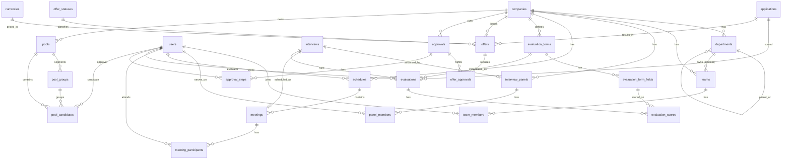

# 10 — D9 · HR & Talent Pool (Final Blueprint)

Domain **D9** of the HalaOps database blueprint: the organizational structure
(departments, teams), interview logistics (panels, schedules, meetings),
configurable scorecards and evaluations, the offer lifecycle, a **generic
configurable approval workflow** reused across the platform, and the **talent
pool** for sourcing. **DESIGN ONLY — no migrations, no code.** Every table here
is **BLUEPRINT** (none ship in migrations 0001–0016) and every tenant table
carries an indexed `company_id` FK → `companies`.

This document follows [00-Database-Bible](00-Database-Bible.md) and the
authoritative `DB_DESIGN_CONTEXT` exactly: base columns on every table
(`id`, `uuid`, `created_at`, `updated_at`, `deleted_at` where soft-deletable),
configuration-driven (no ENUMs — per-entity status tables + `lookup_values`),
an FK on every relationship, an index on every FK, and the cross-cutting
polymorphic tables (`notes`, `attachments`, `status_histories`, `activity_logs`)
are **referenced, never re-created** here.

## Summary

| # | Table | Purpose | Tenant | Soft-delete |
|---|-------|---------|--------|-------------|
| 1 | `departments` | Org units (self-referencing hierarchy); referenced by D5 `jobs` | yes | yes |
| 2 | `teams` | Named groups of users within a company | yes | yes |
| 3 | `team_members` | User ↔ team membership (role via lookup) | yes | no (pivot) |
| 4 | `interview_panels` | A panel of interviewers for an interview (→ D7) | yes | yes |
| 5 | `panel_members` | Interviewer ↔ panel membership (role via lookup) | yes | no (pivot) |
| 6 | `schedules` | Calendar container (owner, timezone) for meetings | yes | yes |
| 7 | `meetings` | A scheduled meeting/event (links, time, location) | yes | yes |
| 8 | `meeting_participants` | User ↔ meeting attendance (response via lookup) | yes | no (pivot) |
| 9 | `evaluation_forms` | Configurable scorecard templates | yes | yes |
| 10 | `evaluation_form_fields` | Fields/criteria of a scorecard (type via lookup, weight) | yes | yes |
| 11 | `evaluations` | A submitted scorecard for an application/interview | yes | yes |
| 12 | `evaluation_scores` | Per-field score within an evaluation | yes | no (child) |
| 13 | `offers` | Job offer to a candidate (salary, dates, status) | yes | yes |
| 14 | `offer_statuses` | Config status table for the offer workflow | yes (NULL=system) | no (config) |
| 15 | `offer_approvals` | Link of an offer to an approval workflow instance | yes | no (link) |
| 16 | `approvals` | Generic polymorphic approval-workflow instance | yes | yes |
| 17 | `approval_steps` | Ordered steps of an approval (approver, status) | yes | no (child) |
| 18 | `pools` | Talent pool (company-scoped grouping for sourcing) | yes | yes |
| 19 | `pool_groups` | Sub-groups/segments inside a pool | yes | yes |
| 20 | `pool_candidates` | Pool ↔ user (candidate) membership | yes | yes |

> The brief enumerates 19 named tables; this design adds **two explicit
> association tables** that the brief describes inline — `meeting_participants`
> (the "participants → users" for meetings) and keeps `meetings`/`schedules`
> split as instructed. `meeting_participants` is the normalized realization of
> "participants → users"; it is **not** a new domain concept. Total: 20 tables.
> (See *Assumptions* at the end.)

---

## Cross-domain FK anchors used here

| Anchor | Domain | Used by |
|--------|--------|---------|
| `companies.id` | tenant root | every table (`company_id`) |
| `users.id` | actor/candidate/interviewer | most tables (members, evaluators, approvers, candidates, `created_by`) |
| `jobs.id` | D5 | `departments` is referenced **by** `jobs.department_id`; `offers` reference the application's job indirectly |
| `applications.id` | D7 | `evaluations.application_id`, `offers.application_id` |
| `interviews.id` | D7 | `interview_panels.interview_id`, `evaluations.interview_id`, `meetings.interview_id` |
| `currencies.id` | D0 (reference) | `offers.currency_id` |
| `lookup_values.id` | D0 | role/type/recommendation/response/field-type/step-status config columns |
| `offer_statuses.id` | D9 (this doc) | `offers.offer_status_id` |
| polymorphic `notes`, `attachments`, `status_histories`, `activity_logs` | D0 | referenced (see §Polymorphic usage), not re-created |

### Polymorphic usage (DRY — defined in D0, referenced here)

- **Notes** on any D9 entity → `notes` (`notable_type`, `notable_id`,
  `user_id`, `body`, `type_id` → `lookup_values`). e.g. an offer note is
  `notes` with `notable_type='offer'`; a pool-candidate note is
  `notable_type='pool_candidate'`. **`pool_candidates` notes use this shared
  polymorphic `notes` table** (per brief), not a private column.
- **Attachments** (offer letter PDF, signed docs) → `attachments`
  (`attachable_type`, `attachable_id`, `file_id`). e.g.
  `attachable_type='offer'`.
- **Status changes** (offer status, approval step status) → `status_histories`
  (`subject_type`, `subject_id`, `from_status_id`, `to_status_id`,
  `changed_by`, `note`).
- **Audit / timeline** of every important mutation → `activity_logs`.

---

## ER Diagram (D9)

---

## 1. `departments`

- **Status:** BLUEPRINT · **Purpose:** organizational units within a company,
  self-referencing for an arbitrary-depth hierarchy; referenced by D5 `jobs`
  (`jobs.department_id`). · **Tenant-scoped:** yes (`company_id`). ·
  **Soft-delete:** yes.

### Columns

| Column | Type | Null | Default | Notes |
|--------|------|------|---------|-------|
| `id` | BIGINT UNSIGNED | NO | auto | PK |
| `uuid` | CHAR(36) | NO | — | public id, UNIQUE |
| `company_id` | BIGINT UNSIGNED | NO | — | FK → companies |
| `parent_id` | BIGINT UNSIGNED | YES | NULL | self-FK → departments (hierarchy root = NULL) |
| `head_user_id` | BIGINT UNSIGNED | YES | NULL | FK → users (department head/manager) |
| `name` | VARCHAR(150) | NO | — | display name |
| `slug` | VARCHAR(160) | NO | — | URL-safe, unique per company |
| `code` | VARCHAR(40) | YES | NULL | optional short code (e.g. `ENG`) |
| `description` | TEXT | YES | NULL | free text |
| `path` | VARCHAR(255) | YES | NULL | materialized ancestor path (e.g. `/1/4/`) for subtree queries |
| `depth` | SMALLINT UNSIGNED | NO | 0 | cached tree depth |
| `sort_order` | INT | NO | 0 | sibling ordering |
| `is_active` | TINYINT(1) | NO | 1 | active flag |
| `created_by` | BIGINT UNSIGNED | YES | NULL | FK → users (SET NULL) |
| `created_at` | TIMESTAMP | YES | NULL | |
| `updated_at` | TIMESTAMP | YES | NULL | |
| `deleted_at` | TIMESTAMP | YES | NULL | soft delete |

### Keys
- **PK:** `id` · **UUID:** UNIQUE(`uuid`) · **Unique:** UNIQUE(`company_id`,`slug`).

### Indexes
| Name | Columns | Type |
|------|---------|------|
| `pk_departments` | `id` | primary |
| `uq_departments_uuid` | `uuid` | unique |
| `uq_departments_company_slug` | `company_id`,`slug` | unique |
| `ix_departments_company` | `company_id` | index (FK) |
| `ix_departments_parent` | `parent_id` | index (FK) |
| `ix_departments_head_user` | `head_user_id` | index (FK) |
| `ix_departments_created_by` | `created_by` | index (FK) |
| `ix_departments_company_parent` | `company_id`,`parent_id` | composite (tree fetch) |
| `ix_departments_company_active` | `company_id`,`is_active` | composite |
| `ix_departments_path` | `path` | index (subtree prefix) |

### Foreign keys
| Column | References | On delete | On update |
|--------|-----------|-----------|-----------|
| `company_id` | companies(id) | CASCADE | CASCADE |
| `parent_id` | departments(id) | SET NULL | CASCADE |
| `head_user_id` | users(id) | SET NULL | CASCADE |
| `created_by` | users(id) | SET NULL | CASCADE |

### Relationships + cardinality
- company **1—\*** departments.
- department **1—\*** departments (self, parent→children).
- department **1—\*** jobs (D5; `jobs.department_id` → here, **referenced by D5**).
- department **0..1—\*** teams (a team may belong to a department).

### Notes
- Self-FK gives an unbounded hierarchy; `parent_id` is **SET NULL** so deleting a
  parent re-roots children rather than cascading away an org subtree (history
  preserved). `path`/`depth` are denormalized caches for fast subtree reads
  (3NF-acceptable derived columns, recomputed on move).
- Config-driven: no department "type" ENUM; if a type is ever needed it is a
  `lookup_values` reference, added without schema change.

---

## 2. `teams`

- **Status:** BLUEPRINT · **Purpose:** a named group of users (e.g. a hiring
  squad) within a company, optionally tied to a department. · **Tenant-scoped:**
  yes. · **Soft-delete:** yes.

### Columns

| Column | Type | Null | Default | Notes |
|--------|------|------|---------|-------|
| `id` | BIGINT UNSIGNED | NO | auto | PK |
| `uuid` | CHAR(36) | NO | — | UNIQUE |
| `company_id` | BIGINT UNSIGNED | NO | — | FK → companies |
| `department_id` | BIGINT UNSIGNED | YES | NULL | FK → departments (optional owner) |
| `lead_user_id` | BIGINT UNSIGNED | YES | NULL | FK → users (team lead) |
| `name` | VARCHAR(150) | NO | — | display name |
| `slug` | VARCHAR(160) | NO | — | unique per company |
| `description` | TEXT | YES | NULL | |
| `is_active` | TINYINT(1) | NO | 1 | |
| `created_by` | BIGINT UNSIGNED | YES | NULL | FK → users (SET NULL) |
| `created_at` | TIMESTAMP | YES | NULL | |
| `updated_at` | TIMESTAMP | YES | NULL | |
| `deleted_at` | TIMESTAMP | YES | NULL | |

### Keys
- **PK:** `id` · **UUID:** UNIQUE(`uuid`) · **Unique:** UNIQUE(`company_id`,`slug`).

### Indexes
| Name | Columns | Type |
|------|---------|------|
| `pk_teams` | `id` | primary |
| `uq_teams_uuid` | `uuid` | unique |
| `uq_teams_company_slug` | `company_id`,`slug` | unique |
| `ix_teams_company` | `company_id` | index (FK) |
| `ix_teams_department` | `department_id` | index (FK) |
| `ix_teams_lead_user` | `lead_user_id` | index (FK) |
| `ix_teams_created_by` | `created_by` | index (FK) |
| `ix_teams_company_active` | `company_id`,`is_active` | composite |

### Foreign keys
| Column | References | On delete | On update |
|--------|-----------|-----------|-----------|
| `company_id` | companies(id) | CASCADE | CASCADE |
| `department_id` | departments(id) | SET NULL | CASCADE |
| `lead_user_id` | users(id) | SET NULL | CASCADE |
| `created_by` | users(id) | SET NULL | CASCADE |

### Relationships + cardinality
- company **1—\*** teams.
- department **0..1—\*** teams.
- team **\*—\*** users (via `team_members`).

### Notes
- Department link is optional (`SET NULL`) so a cross-department squad is valid.
  Soft-deletable to retain team history referenced by activity logs.

---

## 3. `team_members`

- **Status:** BLUEPRINT · **Purpose:** pivot linking users to teams with a
  configurable role. · **Tenant-scoped:** yes (denormalized `company_id` for
  tenant-isolated queries). · **Soft-delete:** no (pure pivot — hard-deleted).

### Columns

| Column | Type | Null | Default | Notes |
|--------|------|------|---------|-------|
| `id` | BIGINT UNSIGNED | NO | auto | PK |
| `uuid` | CHAR(36) | NO | — | UNIQUE |
| `company_id` | BIGINT UNSIGNED | NO | — | FK → companies (tenant scope) |
| `team_id` | BIGINT UNSIGNED | NO | — | FK → teams |
| `user_id` | BIGINT UNSIGNED | NO | — | FK → users |
| `role_id` | BIGINT UNSIGNED | YES | NULL | FK → lookup_values (team role: lead/member/observer…) |
| `joined_at` | TIMESTAMP | YES | NULL | when added |
| `is_active` | TINYINT(1) | NO | 1 | |
| `created_at` | TIMESTAMP | YES | NULL | |
| `updated_at` | TIMESTAMP | YES | NULL | |

### Keys
- **PK:** `id` · **UUID:** UNIQUE(`uuid`) · **Unique:** UNIQUE(`team_id`,`user_id`)
  (a user appears once per team).

### Indexes
| Name | Columns | Type |
|------|---------|------|
| `pk_team_members` | `id` | primary |
| `uq_team_members_uuid` | `uuid` | unique |
| `uq_team_members_team_user` | `team_id`,`user_id` | unique |
| `ix_team_members_company` | `company_id` | index (FK) |
| `ix_team_members_team` | `team_id` | index (FK) |
| `ix_team_members_user` | `user_id` | index (FK) |
| `ix_team_members_role` | `role_id` | index (FK) |
| `ix_team_members_user_active` | `user_id`,`is_active` | composite (my teams) |

### Foreign keys
| Column | References | On delete | On update |
|--------|-----------|-----------|-----------|
| `company_id` | companies(id) | CASCADE | CASCADE |
| `team_id` | teams(id) | CASCADE | CASCADE |
| `user_id` | users(id) | CASCADE | CASCADE |
| `role_id` | lookup_values(id) | RESTRICT | CASCADE |

### Relationships + cardinality
- team **1—\*** team_members; user **1—\*** team_members.
- Resolves team **\*—\*** users.

### Notes
- `role_id` is **config-driven** via `lookup_values` (category e.g.
  `team_member_role`) — no role ENUM. RESTRICT on the lookup so a referenced
  role value cannot vanish. Pivot carries `uuid` (Bible base rule) but no
  `deleted_at`.

---

## 4. `interview_panels`

- **Status:** BLUEPRINT · **Purpose:** a panel of interviewers assembled for a
  D7 `interviews` row (panel/human interview type). · **Tenant-scoped:** yes. ·
  **Soft-delete:** yes.

### Columns

| Column | Type | Null | Default | Notes |
|--------|------|------|---------|-------|
| `id` | BIGINT UNSIGNED | NO | auto | PK |
| `uuid` | CHAR(36) | NO | — | UNIQUE |
| `company_id` | BIGINT UNSIGNED | NO | — | FK → companies |
| `interview_id` | BIGINT UNSIGNED | YES | NULL | FK → interviews (D7); NULL = reusable template panel |
| `name` | VARCHAR(150) | NO | — | panel label |
| `chair_user_id` | BIGINT UNSIGNED | YES | NULL | FK → users (panel chair) |
| `notes` | TEXT | YES | NULL | brief internal note (long notes via polymorphic `notes`) |
| `is_template` | TINYINT(1) | NO | 0 | reusable panel template flag |
| `created_by` | BIGINT UNSIGNED | YES | NULL | FK → users (SET NULL) |
| `created_at` | TIMESTAMP | YES | NULL | |
| `updated_at` | TIMESTAMP | YES | NULL | |
| `deleted_at` | TIMESTAMP | YES | NULL | |

### Keys
- **PK:** `id` · **UUID:** UNIQUE(`uuid`).
- **Unique:** UNIQUE(`interview_id`) — at most one active panel per interview
  (partial-semantics enforced at app layer since `interview_id` is nullable for
  templates).

### Indexes
| Name | Columns | Type |
|------|---------|------|
| `pk_interview_panels` | `id` | primary |
| `uq_interview_panels_uuid` | `uuid` | unique |
| `ix_interview_panels_company` | `company_id` | index (FK) |
| `ix_interview_panels_interview` | `interview_id` | index (FK) |
| `ix_interview_panels_chair` | `chair_user_id` | index (FK) |
| `ix_interview_panels_created_by` | `created_by` | index (FK) |
| `ix_interview_panels_company_template` | `company_id`,`is_template` | composite |

### Foreign keys
| Column | References | On delete | On update |
|--------|-----------|-----------|-----------|
| `company_id` | companies(id) | CASCADE | CASCADE |
| `interview_id` | interviews(id) | CASCADE | CASCADE |
| `chair_user_id` | users(id) | SET NULL | CASCADE |
| `created_by` | users(id) | SET NULL | CASCADE |

### Relationships + cardinality
- interview (D7) **1—0..1** interview_panels (a given interview has one panel).
- interview_panel **1—\*** panel_members.
- company **1—\*** interview_panels.

### Notes
- `interview_id` CASCADE: deleting the interview removes its panel. Template
  panels (`is_template=1`, `interview_id` NULL) are reused — copied into a new
  panel when assigned, keeping the unique-per-interview invariant clean.

---

## 5. `panel_members`

- **Status:** BLUEPRINT · **Purpose:** pivot linking interviewer users to an
  `interview_panels` row with a configurable role. · **Tenant-scoped:** yes. ·
  **Soft-delete:** no (pivot).

### Columns

| Column | Type | Null | Default | Notes |
|--------|------|------|---------|-------|
| `id` | BIGINT UNSIGNED | NO | auto | PK |
| `uuid` | CHAR(36) | NO | — | UNIQUE |
| `company_id` | BIGINT UNSIGNED | NO | — | FK → companies |
| `panel_id` | BIGINT UNSIGNED | NO | — | FK → interview_panels |
| `user_id` | BIGINT UNSIGNED | NO | — | FK → users (interviewer) |
| `role_id` | BIGINT UNSIGNED | YES | NULL | FK → lookup_values (panel role: chair/interviewer/shadow…) |
| `is_required` | TINYINT(1) | NO | 1 | required attendee |
| `invited_at` | TIMESTAMP | YES | NULL | |
| `created_at` | TIMESTAMP | YES | NULL | |
| `updated_at` | TIMESTAMP | YES | NULL | |

### Keys
- **PK:** `id` · **UUID:** UNIQUE(`uuid`) · **Unique:** UNIQUE(`panel_id`,`user_id`).

### Indexes
| Name | Columns | Type |
|------|---------|------|
| `pk_panel_members` | `id` | primary |
| `uq_panel_members_uuid` | `uuid` | unique |
| `uq_panel_members_panel_user` | `panel_id`,`user_id` | unique |
| `ix_panel_members_company` | `company_id` | index (FK) |
| `ix_panel_members_panel` | `panel_id` | index (FK) |
| `ix_panel_members_user` | `user_id` | index (FK) |
| `ix_panel_members_role` | `role_id` | index (FK) |

### Foreign keys
| Column | References | On delete | On update |
|--------|-----------|-----------|-----------|
| `company_id` | companies(id) | CASCADE | CASCADE |
| `panel_id` | interview_panels(id) | CASCADE | CASCADE |
| `user_id` | users(id) | CASCADE | CASCADE |
| `role_id` | lookup_values(id) | RESTRICT | CASCADE |

### Relationships + cardinality
- interview_panel **1—\*** panel_members; user **1—\*** panel_members.
- Resolves panel **\*—\*** users (interviewers).

### Notes
- `role_id` config-driven (category `panel_role`). A panel member's submitted
  scorecard is an `evaluations` row (`interview_id` = panel's interview,
  `evaluator_id` = this user); no rating columns live here.

---

## 6. `schedules`

- **Status:** BLUEPRINT · **Purpose:** a calendar container owned by a user (or
  team) holding `meetings`; centralizes timezone/visibility. · **Tenant-scoped:**
  yes. · **Soft-delete:** yes.

### Columns

| Column | Type | Null | Default | Notes |
|--------|------|------|---------|-------|
| `id` | BIGINT UNSIGNED | NO | auto | PK |
| `uuid` | CHAR(36) | NO | — | UNIQUE |
| `company_id` | BIGINT UNSIGNED | NO | — | FK → companies |
| `owner_user_id` | BIGINT UNSIGNED | YES | NULL | FK → users (calendar owner) |
| `team_id` | BIGINT UNSIGNED | YES | NULL | FK → teams (shared team calendar) |
| `name` | VARCHAR(150) | NO | — | calendar name |
| `timezone_id` | BIGINT UNSIGNED | YES | NULL | FK → timezones (D0 reference) |
| `color` | VARCHAR(20) | YES | NULL | UI color |
| `visibility_id` | BIGINT UNSIGNED | YES | NULL | FK → lookup_values (private/team/company) |
| `is_default` | TINYINT(1) | NO | 0 | owner's primary calendar |
| `created_by` | BIGINT UNSIGNED | YES | NULL | FK → users (SET NULL) |
| `created_at` | TIMESTAMP | YES | NULL | |
| `updated_at` | TIMESTAMP | YES | NULL | |
| `deleted_at` | TIMESTAMP | YES | NULL | |

### Keys
- **PK:** `id` · **UUID:** UNIQUE(`uuid`).

### Indexes
| Name | Columns | Type |
|------|---------|------|
| `pk_schedules` | `id` | primary |
| `uq_schedules_uuid` | `uuid` | unique |
| `ix_schedules_company` | `company_id` | index (FK) |
| `ix_schedules_owner_user` | `owner_user_id` | index (FK) |
| `ix_schedules_team` | `team_id` | index (FK) |
| `ix_schedules_timezone` | `timezone_id` | index (FK) |
| `ix_schedules_visibility` | `visibility_id` | index (FK) |
| `ix_schedules_created_by` | `created_by` | index (FK) |
| `ix_schedules_company_owner` | `company_id`,`owner_user_id` | composite |

### Foreign keys
| Column | References | On delete | On update |
|--------|-----------|-----------|-----------|
| `company_id` | companies(id) | CASCADE | CASCADE |
| `owner_user_id` | users(id) | SET NULL | CASCADE |
| `team_id` | teams(id) | SET NULL | CASCADE |
| `timezone_id` | timezones(id) | RESTRICT | CASCADE |
| `visibility_id` | lookup_values(id) | RESTRICT | CASCADE |
| `created_by` | users(id) | SET NULL | CASCADE |

### Relationships + cardinality
- company **1—\*** schedules; user **1—\*** schedules (owner).
- schedule **1—\*** meetings.

### Notes
- `timezone_id` references the global `timezones` reference table (multi-timezone,
  Bible §8). `visibility_id` config-driven. Owner/team are both optional so a
  company-wide schedule is possible.

---

## 7. `meetings`

- **Status:** BLUEPRINT · **Purpose:** a scheduled meeting/event (interview
  session, sync, screening call) with time, location and a video link;
  optionally tied to a D7 `interviews` row. · **Tenant-scoped:** yes. ·
  **Soft-delete:** yes.

### Columns

| Column | Type | Null | Default | Notes |
|--------|------|------|---------|-------|
| `id` | BIGINT UNSIGNED | NO | auto | PK |
| `uuid` | CHAR(36) | NO | — | UNIQUE |
| `company_id` | BIGINT UNSIGNED | NO | — | FK → companies |
| `schedule_id` | BIGINT UNSIGNED | YES | NULL | FK → schedules (calendar) |
| `interview_id` | BIGINT UNSIGNED | YES | NULL | FK → interviews (D7); meeting backing an interview |
| `organizer_user_id` | BIGINT UNSIGNED | YES | NULL | FK → users (host) |
| `title` | VARCHAR(200) | NO | — | meeting title |
| `description` | TEXT | YES | NULL | agenda |
| `type_id` | BIGINT UNSIGNED | YES | NULL | FK → lookup_values (interview/screening/sync…) |
| `status_id` | BIGINT UNSIGNED | YES | NULL | FK → lookup_values (scheduled/held/canceled/no_show…) |
| `location_type_id` | BIGINT UNSIGNED | YES | NULL | FK → lookup_values (onsite/online/phone) |
| `location` | VARCHAR(255) | YES | NULL | physical location text |
| `meeting_url` | VARCHAR(512) | YES | NULL | video/conference link |
| `meeting_provider_id` | BIGINT UNSIGNED | YES | NULL | FK → lookup_values (zoom/meet/teams…) |
| `starts_at` | DATETIME | NO | — | start (UTC) |
| `ends_at` | DATETIME | YES | NULL | end (UTC) |
| `timezone_id` | BIGINT UNSIGNED | YES | NULL | FK → timezones (display tz) |
| `all_day` | TINYINT(1) | NO | 0 | all-day flag |
| `created_by` | BIGINT UNSIGNED | YES | NULL | FK → users (SET NULL) |
| `created_at` | TIMESTAMP | YES | NULL | |
| `updated_at` | TIMESTAMP | YES | NULL | |
| `deleted_at` | TIMESTAMP | YES | NULL | |

### Keys
- **PK:** `id` · **UUID:** UNIQUE(`uuid`).

### Indexes
| Name | Columns | Type |
|------|---------|------|
| `pk_meetings` | `id` | primary |
| `uq_meetings_uuid` | `uuid` | unique |
| `ix_meetings_company` | `company_id` | index (FK) |
| `ix_meetings_schedule` | `schedule_id` | index (FK) |
| `ix_meetings_interview` | `interview_id` | index (FK) |
| `ix_meetings_organizer` | `organizer_user_id` | index (FK) |
| `ix_meetings_type` | `type_id` | index (FK) |
| `ix_meetings_status` | `status_id` | index (FK) |
| `ix_meetings_location_type` | `location_type_id` | index (FK) |
| `ix_meetings_provider` | `meeting_provider_id` | index (FK) |
| `ix_meetings_timezone` | `timezone_id` | index (FK) |
| `ix_meetings_created_by` | `created_by` | index (FK) |
| `ix_meetings_company_starts` | `company_id`,`starts_at` | composite (calendar range) |
| `ix_meetings_company_status` | `company_id`,`status_id` | composite |

### Foreign keys
| Column | References | On delete | On update |
|--------|-----------|-----------|-----------|
| `company_id` | companies(id) | CASCADE | CASCADE |
| `schedule_id` | schedules(id) | SET NULL | CASCADE |
| `interview_id` | interviews(id) | CASCADE | CASCADE |
| `organizer_user_id` | users(id) | SET NULL | CASCADE |
| `type_id` | lookup_values(id) | RESTRICT | CASCADE |
| `status_id` | lookup_values(id) | RESTRICT | CASCADE |
| `location_type_id` | lookup_values(id) | RESTRICT | CASCADE |
| `meeting_provider_id` | lookup_values(id) | RESTRICT | CASCADE |
| `timezone_id` | timezones(id) | RESTRICT | CASCADE |
| `created_by` | users(id) | SET NULL | CASCADE |

### Relationships + cardinality
- schedule **1—\*** meetings; company **1—\*** meetings.
- interview (D7) **1—0..1** meetings (a meeting can back one interview).
- meeting **1—\*** meeting_participants.

### Notes
- All type/status/location/provider columns are **config-driven** via
  `lookup_values` (no ENUMs) per Bible §Config. `meeting_url` is plain text
  (link). `starts_at`/`ends_at` stored UTC; `timezone_id` for display
  (multi-timezone). `interview_id` CASCADE so deleting an interview removes its
  meeting; `schedule_id` SET NULL so a meeting survives calendar deletion.
- Attachments (e.g. ICS, deck) and long notes attach via polymorphic
  `attachments`/`notes` (`*_type='meeting'`).

---

## 8. `meeting_participants`

- **Status:** BLUEPRINT · **Purpose:** pivot linking users to a meeting as
  participants, with an RSVP/response state. Normalizes the brief's
  "participants → users". · **Tenant-scoped:** yes. · **Soft-delete:** no (pivot).

### Columns

| Column | Type | Null | Default | Notes |
|--------|------|------|---------|-------|
| `id` | BIGINT UNSIGNED | NO | auto | PK |
| `uuid` | CHAR(36) | NO | — | UNIQUE |
| `company_id` | BIGINT UNSIGNED | NO | — | FK → companies |
| `meeting_id` | BIGINT UNSIGNED | NO | — | FK → meetings |
| `user_id` | BIGINT UNSIGNED | NO | — | FK → users (participant) |
| `role_id` | BIGINT UNSIGNED | YES | NULL | FK → lookup_values (organizer/required/optional/candidate) |
| `response_id` | BIGINT UNSIGNED | YES | NULL | FK → lookup_values (pending/accepted/declined/tentative) |
| `responded_at` | TIMESTAMP | YES | NULL | |
| `attended` | TINYINT(1) | YES | NULL | actual attendance (NULL = unknown) |
| `created_at` | TIMESTAMP | YES | NULL | |
| `updated_at` | TIMESTAMP | YES | NULL | |

### Keys
- **PK:** `id` · **UUID:** UNIQUE(`uuid`) · **Unique:** UNIQUE(`meeting_id`,`user_id`).

### Indexes
| Name | Columns | Type |
|------|---------|------|
| `pk_meeting_participants` | `id` | primary |
| `uq_meeting_participants_uuid` | `uuid` | unique |
| `uq_meeting_participants_meeting_user` | `meeting_id`,`user_id` | unique |
| `ix_meeting_participants_company` | `company_id` | index (FK) |
| `ix_meeting_participants_meeting` | `meeting_id` | index (FK) |
| `ix_meeting_participants_user` | `user_id` | index (FK) |
| `ix_meeting_participants_role` | `role_id` | index (FK) |
| `ix_meeting_participants_response` | `response_id` | index (FK) |
| `ix_meeting_participants_user_meeting` | `user_id`,`meeting_id` | composite (my agenda) |

### Foreign keys
| Column | References | On delete | On update |
|--------|-----------|-----------|-----------|
| `company_id` | companies(id) | CASCADE | CASCADE |
| `meeting_id` | meetings(id) | CASCADE | CASCADE |
| `user_id` | users(id) | CASCADE | CASCADE |
| `role_id` | lookup_values(id) | RESTRICT | CASCADE |
| `response_id` | lookup_values(id) | RESTRICT | CASCADE |

### Relationships + cardinality
- meeting **1—\*** meeting_participants; user **1—\*** meeting_participants.
- Resolves meeting **\*—\*** users.

### Notes
- `role_id`/`response_id` config-driven (categories `meeting_role`,
  `meeting_response`). Candidate participants are simply users with the
  `candidate` role value — consistent with DB-1 (one `users` table, no candidate
  table).

---

## 9. `evaluation_forms`

- **Status:** BLUEPRINT · **Purpose:** a configurable scorecard **template**
  (set of criteria) used to assess applications/interviews. · **Tenant-scoped:**
  yes. · **Soft-delete:** yes.

### Columns

| Column | Type | Null | Default | Notes |
|--------|------|------|---------|-------|
| `id` | BIGINT UNSIGNED | NO | auto | PK |
| `uuid` | CHAR(36) | NO | — | UNIQUE |
| `company_id` | BIGINT UNSIGNED | NO | — | FK → companies |
| `name` | VARCHAR(150) | NO | — | scorecard name |
| `slug` | VARCHAR(160) | NO | — | unique per company |
| `description` | TEXT | YES | NULL | |
| `scope_id` | BIGINT UNSIGNED | YES | NULL | FK → lookup_values (application/interview/general) |
| `scoring_type_id` | BIGINT UNSIGNED | YES | NULL | FK → lookup_values (numeric/stars/weighted) |
| `max_score` | DECIMAL(6,2) | YES | NULL | overall scale ceiling (e.g. 100.00) |
| `pass_threshold` | DECIMAL(6,2) | YES | NULL | advisory pass mark |
| `version` | INT UNSIGNED | NO | 1 | template version |
| `is_active` | TINYINT(1) | NO | 1 | |
| `is_default` | TINYINT(1) | NO | 0 | default scorecard for the company |
| `created_by` | BIGINT UNSIGNED | YES | NULL | FK → users (SET NULL) |
| `created_at` | TIMESTAMP | YES | NULL | |
| `updated_at` | TIMESTAMP | YES | NULL | |
| `deleted_at` | TIMESTAMP | YES | NULL | |

### Keys
- **PK:** `id` · **UUID:** UNIQUE(`uuid`) · **Unique:** UNIQUE(`company_id`,`slug`).

### Indexes
| Name | Columns | Type |
|------|---------|------|
| `pk_evaluation_forms` | `id` | primary |
| `uq_evaluation_forms_uuid` | `uuid` | unique |
| `uq_evaluation_forms_company_slug` | `company_id`,`slug` | unique |
| `ix_evaluation_forms_company` | `company_id` | index (FK) |
| `ix_evaluation_forms_scope` | `scope_id` | index (FK) |
| `ix_evaluation_forms_scoring_type` | `scoring_type_id` | index (FK) |
| `ix_evaluation_forms_created_by` | `created_by` | index (FK) |
| `ix_evaluation_forms_company_active` | `company_id`,`is_active` | composite |

### Foreign keys
| Column | References | On delete | On update |
|--------|-----------|-----------|-----------|
| `company_id` | companies(id) | CASCADE | CASCADE |
| `scope_id` | lookup_values(id) | RESTRICT | CASCADE |
| `scoring_type_id` | lookup_values(id) | RESTRICT | CASCADE |
| `created_by` | users(id) | SET NULL | CASCADE |

### Relationships + cardinality
- company **1—\*** evaluation_forms.
- evaluation_form **1—\*** evaluation_form_fields.
- evaluation_form **1—\*** evaluations (instantiations).

### Notes
- The scorecard is **fully configurable data** (Bible §Config): fields live in
  `evaluation_form_fields`, scoring style via `lookup_values`. `version` supports
  immutable history — submitted `evaluations` reference the form they were filled
  against, so editing a template creates a new version rather than rewriting past
  scores.

---

## 10. `evaluation_form_fields`

- **Status:** BLUEPRINT · **Purpose:** the individual criteria/fields of an
  `evaluation_forms` scorecard — field type via lookup, weight, ordering. ·
  **Tenant-scoped:** yes. · **Soft-delete:** yes.

### Columns

| Column | Type | Null | Default | Notes |
|--------|------|------|---------|-------|
| `id` | BIGINT UNSIGNED | NO | auto | PK |
| `uuid` | CHAR(36) | NO | — | UNIQUE |
| `company_id` | BIGINT UNSIGNED | NO | — | FK → companies |
| `form_id` | BIGINT UNSIGNED | NO | — | FK → evaluation_forms |
| `label` | VARCHAR(200) | NO | — | criterion text (e.g. "Communication") |
| `key` | VARCHAR(60) | NO | — | stable key, unique per form |
| `description` | TEXT | YES | NULL | guidance for evaluators |
| `field_type_id` | BIGINT UNSIGNED | NO | — | FK → lookup_values (rating/numeric/boolean/select/text) |
| `category_id` | BIGINT UNSIGNED | YES | NULL | FK → lookup_values (competency group) |
| `weight` | DECIMAL(6,3) | NO | 1.000 | relative weight for weighted scoring |
| `max_value` | DECIMAL(6,2) | YES | NULL | per-field max (e.g. 5 for a 5-star field) |
| `min_value` | DECIMAL(6,2) | YES | NULL | per-field min |
| `options` | JSON | YES | NULL | choices for select/rating-label fields |
| `is_required` | TINYINT(1) | NO | 1 | must be scored |
| `sort_order` | INT | NO | 0 | display order |
| `created_at` | TIMESTAMP | YES | NULL | |
| `updated_at` | TIMESTAMP | YES | NULL | |
| `deleted_at` | TIMESTAMP | YES | NULL | |

### Keys
- **PK:** `id` · **UUID:** UNIQUE(`uuid`) · **Unique:** UNIQUE(`form_id`,`key`).

### Indexes
| Name | Columns | Type |
|------|---------|------|
| `pk_evaluation_form_fields` | `id` | primary |
| `uq_evaluation_form_fields_uuid` | `uuid` | unique |
| `uq_evaluation_form_fields_form_key` | `form_id`,`key` | unique |
| `ix_evaluation_form_fields_company` | `company_id` | index (FK) |
| `ix_evaluation_form_fields_form` | `form_id` | index (FK) |
| `ix_evaluation_form_fields_field_type` | `field_type_id` | index (FK) |
| `ix_evaluation_form_fields_category` | `category_id` | index (FK) |
| `ix_evaluation_form_fields_form_sort` | `form_id`,`sort_order` | composite |

### Foreign keys
| Column | References | On delete | On update |
|--------|-----------|-----------|-----------|
| `company_id` | companies(id) | CASCADE | CASCADE |
| `form_id` | evaluation_forms(id) | CASCADE | CASCADE |
| `field_type_id` | lookup_values(id) | RESTRICT | CASCADE |
| `category_id` | lookup_values(id) | RESTRICT | CASCADE |

### Relationships + cardinality
- evaluation_form **1—\*** evaluation_form_fields.
- evaluation_form_field **1—\*** evaluation_scores.

### Notes
- `field_type_id`/`category_id` config-driven (no ENUM). `weight` enables
  weighted scoring (`scoring_type_id='weighted'` on the form). `options` JSON
  holds select/label choices (validated in PHP). Deleting a form cascades its
  fields; `deleted_at` lets a field be retired without losing historical
  `evaluation_scores` that reference it.

---

## 11. `evaluations`

- **Status:** BLUEPRINT · **Purpose:** a submitted scorecard instance — one
  evaluator's assessment of an application (and optionally a specific interview)
  against a form. · **Tenant-scoped:** yes. · **Soft-delete:** yes.

### Columns

| Column | Type | Null | Default | Notes |
|--------|------|------|---------|-------|
| `id` | BIGINT UNSIGNED | NO | auto | PK |
| `uuid` | CHAR(36) | NO | — | UNIQUE |
| `company_id` | BIGINT UNSIGNED | NO | — | FK → companies |
| `application_id` | BIGINT UNSIGNED | NO | — | FK → applications (D7) |
| `interview_id` | BIGINT UNSIGNED | YES | NULL | FK → interviews (D7); NULL = general/application-level |
| `form_id` | BIGINT UNSIGNED | YES | NULL | FK → evaluation_forms (template used) |
| `evaluator_id` | BIGINT UNSIGNED | YES | NULL | FK → users (who scored) |
| `recommendation_id` | BIGINT UNSIGNED | YES | NULL | FK → lookup_values (strong_yes/yes/neutral/no/strong_no) |
| `overall_score` | DECIMAL(6,2) | YES | NULL | computed/entered total |
| `normalized_score` | DECIMAL(5,2) | YES | NULL | 0–100 normalized (advisory, feeds applications.score) |
| `summary` | TEXT | YES | NULL | written feedback |
| `submitted_at` | TIMESTAMP | YES | NULL | NULL = draft |
| `is_draft` | TINYINT(1) | NO | 1 | draft vs final |
| `created_by` | BIGINT UNSIGNED | YES | NULL | FK → users (SET NULL) |
| `created_at` | TIMESTAMP | YES | NULL | |
| `updated_at` | TIMESTAMP | YES | NULL | |
| `deleted_at` | TIMESTAMP | YES | NULL | |

### Keys
- **PK:** `id` · **UUID:** UNIQUE(`uuid`).
- **Unique:** UNIQUE(`application_id`,`interview_id`,`evaluator_id`,`form_id`) —
  one evaluator submits one scorecard of a given form per application/interview
  (interview_id NULL groups application-level evaluations).

### Indexes
| Name | Columns | Type |
|------|---------|------|
| `pk_evaluations` | `id` | primary |
| `uq_evaluations_uuid` | `uuid` | unique |
| `uq_evaluations_app_int_eval_form` | `application_id`,`interview_id`,`evaluator_id`,`form_id` | unique |
| `ix_evaluations_company` | `company_id` | index (FK) |
| `ix_evaluations_application` | `application_id` | index (FK) |
| `ix_evaluations_interview` | `interview_id` | index (FK) |
| `ix_evaluations_form` | `form_id` | index (FK) |
| `ix_evaluations_evaluator` | `evaluator_id` | index (FK) |
| `ix_evaluations_recommendation` | `recommendation_id` | index (FK) |
| `ix_evaluations_created_by` | `created_by` | index (FK) |
| `ix_evaluations_company_application` | `company_id`,`application_id` | composite (scorecards per candidate) |

### Foreign keys
| Column | References | On delete | On update |
|--------|-----------|-----------|-----------|
| `company_id` | companies(id) | CASCADE | CASCADE |
| `application_id` | applications(id) | CASCADE | CASCADE |
| `interview_id` | interviews(id) | SET NULL | CASCADE |
| `form_id` | evaluation_forms(id) | RESTRICT | CASCADE |
| `evaluator_id` | users(id) | SET NULL | CASCADE |
| `recommendation_id` | lookup_values(id) | RESTRICT | CASCADE |
| `created_by` | users(id) | SET NULL | CASCADE |

### Relationships + cardinality
- application (D7) **1—\*** evaluations (CASCADE — matches upstream ERD).
- interview (D7) **1—\*** evaluations (SET NULL — matches upstream ERD).
- user **1—\*** evaluations (evaluator, SET NULL).
- evaluation_form **1—\*** evaluations (RESTRICT — preserve which template).
- evaluation **1—\*** evaluation_scores.

### Notes
- FK delete policies deliberately mirror the upstream `06-ERD.md` (`application_id`
  CASCADE, `interview_id` SET NULL, `evaluator_id` SET NULL) so D9 is consistent
  with the canonical recruitment ERD. `evaluator_id` SET NULL preserves the
  scorecard when a member is removed (HR-Journey open question — keep records).
- `recommendation_id` config-driven (category `evaluation_recommendation`).
  Scores are **advisory** (human-in-the-loop, canonical §9); `normalized_score`
  feeds `applications.score` but never auto-decides. Per-field detail in
  `evaluation_scores`. `form_id` RESTRICT keeps the template referenced.

---

## 12. `evaluation_scores`

- **Status:** BLUEPRINT · **Purpose:** the per-field value within one
  `evaluations` (a score for a single `evaluation_form_fields` criterion). ·
  **Tenant-scoped:** yes. · **Soft-delete:** no (child of evaluation; hard-deleted
  with parent).

### Columns

| Column | Type | Null | Default | Notes |
|--------|------|------|---------|-------|
| `id` | BIGINT UNSIGNED | NO | auto | PK |
| `uuid` | CHAR(36) | NO | — | UNIQUE |
| `company_id` | BIGINT UNSIGNED | NO | — | FK → companies |
| `evaluation_id` | BIGINT UNSIGNED | NO | — | FK → evaluations |
| `field_id` | BIGINT UNSIGNED | NO | — | FK → evaluation_form_fields |
| `value_numeric` | DECIMAL(8,3) | YES | NULL | numeric/rating value |
| `value_bool` | TINYINT(1) | YES | NULL | boolean fields |
| `value_text` | TEXT | YES | NULL | text/select-label answer |
| `value_option_id` | BIGINT UNSIGNED | YES | NULL | FK → lookup_values (selected option, when option-backed) |
| `weighted_score` | DECIMAL(8,3) | YES | NULL | value × field weight (cached) |
| `comment` | TEXT | YES | NULL | per-criterion note |
| `created_at` | TIMESTAMP | YES | NULL | |
| `updated_at` | TIMESTAMP | YES | NULL | |

### Keys
- **PK:** `id` · **UUID:** UNIQUE(`uuid`) · **Unique:** UNIQUE(`evaluation_id`,`field_id`)
  (one score per field per evaluation).

### Indexes
| Name | Columns | Type |
|------|---------|------|
| `pk_evaluation_scores` | `id` | primary |
| `uq_evaluation_scores_uuid` | `uuid` | unique |
| `uq_evaluation_scores_eval_field` | `evaluation_id`,`field_id` | unique |
| `ix_evaluation_scores_company` | `company_id` | index (FK) |
| `ix_evaluation_scores_evaluation` | `evaluation_id` | index (FK) |
| `ix_evaluation_scores_field` | `field_id` | index (FK) |
| `ix_evaluation_scores_option` | `value_option_id` | index (FK) |

### Foreign keys
| Column | References | On delete | On update |
|--------|-----------|-----------|-----------|
| `company_id` | companies(id) | CASCADE | CASCADE |
| `evaluation_id` | evaluations(id) | CASCADE | CASCADE |
| `field_id` | evaluation_form_fields(id) | RESTRICT | CASCADE |
| `value_option_id` | lookup_values(id) | RESTRICT | CASCADE |

### Relationships + cardinality
- evaluation **1—\*** evaluation_scores.
- evaluation_form_field **1—\*** evaluation_scores.

### Notes
- Typed value columns (`value_numeric`/`value_bool`/`value_text`/`value_option_id`)
  keep the table 1NF while supporting any `field_type_id`; exactly one is
  populated per row per the field's type (app-enforced). `field_id` RESTRICT
  prevents deleting a field that has recorded scores (use the field's
  `deleted_at` instead). `weighted_score` is a derived cache for fast roll-ups.

---

## 13. `offers`

- **Status:** BLUEPRINT · **Purpose:** a formal job offer extended to a candidate
  for an application — compensation, dates, and lifecycle status. ·
  **Tenant-scoped:** yes. · **Soft-delete:** yes.

### Columns

| Column | Type | Null | Default | Notes |
|--------|------|------|---------|-------|
| `id` | BIGINT UNSIGNED | NO | auto | PK |
| `uuid` | CHAR(36) | NO | — | UNIQUE |
| `company_id` | BIGINT UNSIGNED | NO | — | FK → companies |
| `application_id` | BIGINT UNSIGNED | NO | — | FK → applications (D7) |
| `offer_status_id` | BIGINT UNSIGNED | NO | — | FK → offer_statuses |
| `candidate_user_id` | BIGINT UNSIGNED | YES | NULL | FK → users (denormalized recipient for fast lookup) |
| `job_title` | VARCHAR(200) | YES | NULL | offered title (snapshot) |
| `employment_type_id` | BIGINT UNSIGNED | YES | NULL | FK → lookup_values (full-time/contract…) |
| `salary_amount` | DECIMAL(12,2) | YES | NULL | base compensation |
| `currency_id` | BIGINT UNSIGNED | YES | NULL | FK → currencies (D0 reference) |
| `salary_period_id` | BIGINT UNSIGNED | YES | NULL | FK → lookup_values (annual/monthly/hourly) |
| `bonus_amount` | DECIMAL(12,2) | YES | NULL | optional bonus |
| `equity` | VARCHAR(120) | YES | NULL | equity description |
| `start_date` | DATE | YES | NULL | proposed start |
| `expires_at` | DATETIME | YES | NULL | offer expiry |
| `sent_at` | TIMESTAMP | YES | NULL | when delivered to candidate |
| `responded_at` | TIMESTAMP | YES | NULL | accept/decline time |
| `notes` | TEXT | YES | NULL | internal note (long notes via polymorphic `notes`) |
| `created_by` | BIGINT UNSIGNED | YES | NULL | FK → users (SET NULL) |
| `created_at` | TIMESTAMP | YES | NULL | |
| `updated_at` | TIMESTAMP | YES | NULL | |
| `deleted_at` | TIMESTAMP | YES | NULL | |

### Keys
- **PK:** `id` · **UUID:** UNIQUE(`uuid`).
- **Unique:** UNIQUE(`application_id`,`uuid`) is redundant; instead a partial rule
  (one **active** offer per application) is enforced at the app layer — multiple
  historical offers (revised/rescinded then re-issued) are allowed.

### Indexes
| Name | Columns | Type |
|------|---------|------|
| `pk_offers` | `id` | primary |
| `uq_offers_uuid` | `uuid` | unique |
| `ix_offers_company` | `company_id` | index (FK) |
| `ix_offers_application` | `application_id` | index (FK) |
| `ix_offers_status` | `offer_status_id` | index (FK) |
| `ix_offers_candidate_user` | `candidate_user_id` | index (FK) |
| `ix_offers_employment_type` | `employment_type_id` | index (FK) |
| `ix_offers_currency` | `currency_id` | index (FK) |
| `ix_offers_salary_period` | `salary_period_id` | index (FK) |
| `ix_offers_created_by` | `created_by` | index (FK) |
| `ix_offers_company_status` | `company_id`,`offer_status_id` | composite (pipeline) |
| `ix_offers_company_expires` | `company_id`,`expires_at` | composite (expiry sweep) |

### Foreign keys
| Column | References | On delete | On update |
|--------|-----------|-----------|-----------|
| `company_id` | companies(id) | CASCADE | CASCADE |
| `application_id` | applications(id) | CASCADE | CASCADE |
| `offer_status_id` | offer_statuses(id) | RESTRICT | CASCADE |
| `candidate_user_id` | users(id) | SET NULL | CASCADE |
| `employment_type_id` | lookup_values(id) | RESTRICT | CASCADE |
| `currency_id` | currencies(id) | RESTRICT | CASCADE |
| `salary_period_id` | lookup_values(id) | RESTRICT | CASCADE |
| `created_by` | users(id) | SET NULL | CASCADE |

### Relationships + cardinality
- application (D7) **1—\*** offers (typically one active; history allowed).
- offer_status **1—\*** offers.
- currency **1—\*** offers (money = amount + currency, Bible §8).
- offer **1—\*** offer_approvals (one per approval workflow attached).

### Notes
- Money modeled as (`salary_amount` DECIMAL(12,2), `currency_id`) per Bible §8
  multi-currency; `salary_period_id` config-driven. `offer_status_id` →
  per-entity status table (workflow). Status transitions logged to polymorphic
  `status_histories` (`subject_type='offer'`); the offer letter PDF attaches via
  `attachments`. Offer approval routing is via `offer_approvals` → `approvals`.

---

## 14. `offer_statuses`

- **Status:** BLUEPRINT · **Purpose:** the configurable status catalog for the
  offer workflow (per Bible §Config per-entity status tables). ·
  **Tenant-scoped:** yes (`company_id` NULL = system default, non-null = tenant
  override/custom). · **Soft-delete:** no (config table).

### Columns

| Column | Type | Null | Default | Notes |
|--------|------|------|---------|-------|
| `id` | BIGINT UNSIGNED | NO | auto | PK |
| `uuid` | CHAR(36) | NO | — | UNIQUE |
| `company_id` | BIGINT UNSIGNED | YES | NULL | FK → companies; NULL = system default |
| `key` | VARCHAR(60) | NO | — | stable key (`draft`,`pending_approval`,`approved`,`sent`,`accepted`,`declined`,`rescinded`,`expired`) |
| `label` | VARCHAR(120) | NO | — | display label |
| `color` | VARCHAR(20) | YES | NULL | UI color |
| `sort_order` | INT | NO | 0 | ordering |
| `is_default` | TINYINT(1) | NO | 0 | default status |
| `is_initial` | TINYINT(1) | NO | 0 | entry state |
| `is_terminal` | TINYINT(1) | NO | 0 | end state |
| `is_system` | TINYINT(1) | NO | 0 | seeded/system-protected |
| `created_at` | TIMESTAMP | YES | NULL | |
| `updated_at` | TIMESTAMP | YES | NULL | |

### Keys
- **PK:** `id` · **UUID:** UNIQUE(`uuid`) · **Unique:** UNIQUE(`company_id`,`key`)
  (a key is unique within a tenant; NULL company = system row).

### Indexes
| Name | Columns | Type |
|------|---------|------|
| `pk_offer_statuses` | `id` | primary |
| `uq_offer_statuses_uuid` | `uuid` | unique |
| `uq_offer_statuses_company_key` | `company_id`,`key` | unique |
| `ix_offer_statuses_company` | `company_id` | index (FK) |
| `ix_offer_statuses_company_sort` | `company_id`,`sort_order` | composite |

### Foreign keys
| Column | References | On delete | On update |
|--------|-----------|-----------|-----------|
| `company_id` | companies(id) | CASCADE | CASCADE |

### Relationships + cardinality
- offer_status **1—\*** offers.
- company **1—\*** offer_statuses (custom statuses); system rows have NULL company.

### Notes
- Standard per-entity status shape exactly as Bible §Config/§2. System defaults
  (NULL `company_id`, `is_system=1`) are shared; a tenant may add custom statuses
  or override ordering/labels. Referenced by `offers.offer_status_id` with
  RESTRICT so a status in use cannot be deleted.

---

## 15. `offer_approvals`

- **Status:** BLUEPRINT · **Purpose:** links an `offers` row to a generic
  `approvals` workflow instance (the join that ties offer approval routing into
  the reusable approval engine). · **Tenant-scoped:** yes. · **Soft-delete:** no
  (link row).

### Columns

| Column | Type | Null | Default | Notes |
|--------|------|------|---------|-------|
| `id` | BIGINT UNSIGNED | NO | auto | PK |
| `uuid` | CHAR(36) | NO | — | UNIQUE |
| `company_id` | BIGINT UNSIGNED | NO | — | FK → companies |
| `offer_id` | BIGINT UNSIGNED | NO | — | FK → offers |
| `approval_id` | BIGINT UNSIGNED | NO | — | FK → approvals (the workflow instance) |
| `is_current` | TINYINT(1) | NO | 1 | the active approval round for this offer |
| `created_at` | TIMESTAMP | YES | NULL | |
| `updated_at` | TIMESTAMP | YES | NULL | |

### Keys
- **PK:** `id` · **UUID:** UNIQUE(`uuid`) · **Unique:** UNIQUE(`offer_id`,`approval_id`).

### Indexes
| Name | Columns | Type |
|------|---------|------|
| `pk_offer_approvals` | `id` | primary |
| `uq_offer_approvals_uuid` | `uuid` | unique |
| `uq_offer_approvals_offer_approval` | `offer_id`,`approval_id` | unique |
| `ix_offer_approvals_company` | `company_id` | index (FK) |
| `ix_offer_approvals_offer` | `offer_id` | index (FK) |
| `ix_offer_approvals_approval` | `approval_id` | index (FK) |
| `ix_offer_approvals_offer_current` | `offer_id`,`is_current` | composite |

### Foreign keys
| Column | References | On delete | On update |
|--------|-----------|-----------|-----------|
| `company_id` | companies(id) | CASCADE | CASCADE |
| `offer_id` | offers(id) | CASCADE | CASCADE |
| `approval_id` | approvals(id) | CASCADE | CASCADE |

### Relationships + cardinality
- offer **1—\*** offer_approvals (rounds over time).
- approval **1—1** offer_approvals (each approval instance backs one offer link).

### Notes
- This explicit join keeps `approvals` **generic/polymorphic** while giving offers
  a hard relational handle and a tidy place for `is_current`. Re-opening an offer
  approval spawns a new `approvals` instance and a new link with
  `is_current=1` (prior set to 0). An alternative — using only `approvals`
  polymorphic columns (`approvable_type='offer'`) — is also valid; this table is
  the brief's explicit `offer_approvals` and documents the canonical pattern.

---

## 16. `approvals`

- **Status:** BLUEPRINT · **Purpose:** a **generic, configurable approval-workflow
  instance** attached polymorphically to any approvable entity (offers,
  requisitions/jobs, etc.) — reused platform-wide. · **Tenant-scoped:** yes. ·
  **Soft-delete:** yes.

### Columns

| Column | Type | Null | Default | Notes |
|--------|------|------|---------|-------|
| `id` | BIGINT UNSIGNED | NO | auto | PK |
| `uuid` | CHAR(36) | NO | — | UNIQUE |
| `company_id` | BIGINT UNSIGNED | NO | — | FK → companies |
| `approvable_type` | VARCHAR(60) | NO | — | polymorphic target type (`offer`,`job`,…) |
| `approvable_id` | BIGINT UNSIGNED | NO | — | polymorphic target id |
| `title` | VARCHAR(200) | YES | NULL | human label of the request |
| `status_id` | BIGINT UNSIGNED | YES | NULL | FK → lookup_values (pending/approved/rejected/canceled) |
| `mode_id` | BIGINT UNSIGNED | YES | NULL | FK → lookup_values (sequential/parallel/any-one) |
| `current_step` | INT UNSIGNED | NO | 1 | pointer into ordered steps (sequential mode) |
| `requested_by` | BIGINT UNSIGNED | YES | NULL | FK → users (initiator) |
| `decided_at` | TIMESTAMP | YES | NULL | overall completion time |
| `due_at` | DATETIME | YES | NULL | SLA deadline |
| `created_at` | TIMESTAMP | YES | NULL | |
| `updated_at` | TIMESTAMP | YES | NULL | |
| `deleted_at` | TIMESTAMP | YES | NULL | |

### Keys
- **PK:** `id` · **UUID:** UNIQUE(`uuid`).

### Indexes
| Name | Columns | Type |
|------|---------|------|
| `pk_approvals` | `id` | primary |
| `uq_approvals_uuid` | `uuid` | unique |
| `ix_approvals_company` | `company_id` | index (FK) |
| `ix_approvals_status` | `status_id` | index (FK) |
| `ix_approvals_mode` | `mode_id` | index (FK) |
| `ix_approvals_requested_by` | `requested_by` | index (FK) |
| `ix_approvals_approvable` | `approvable_type`,`approvable_id` | composite (polymorphic) |
| `ix_approvals_company_status` | `company_id`,`status_id` | composite |

### Foreign keys
| Column | References | On delete | On update |
|--------|-----------|-----------|-----------|
| `company_id` | companies(id) | CASCADE | CASCADE |
| `status_id` | lookup_values(id) | RESTRICT | CASCADE |
| `mode_id` | lookup_values(id) | RESTRICT | CASCADE |
| `requested_by` | users(id) | SET NULL | CASCADE |

### Relationships + cardinality
- approval **1—\*** approval_steps.
- approval **\*—1** *(polymorphic)* any approvable entity via
  (`approvable_type`,`approvable_id`) — e.g. an `offer` (also surfaced via
  `offer_approvals`).
- company **1—\*** approvals.

### Notes
- **Polymorphic by design** (Bible §6 / DB-4): one approval engine, not
  per-entity copies. `(approvable_type, approvable_id)` is indexed; integrity at
  this edge is app-enforced (no DB FK on the polymorphic pair), consistent with
  the Bible's polymorphic policy. `status_id`/`mode_id` config-driven via
  `lookup_values`. The future "Approval workflows" item in HR-Journey §Future is
  realized here. Status changes recorded in `status_histories`.

---

## 17. `approval_steps`

- **Status:** BLUEPRINT · **Purpose:** the ordered steps of an `approvals`
  instance — each an approver, order, and configurable decision status. ·
  **Tenant-scoped:** yes. · **Soft-delete:** no (child of approval).

### Columns

| Column | Type | Null | Default | Notes |
|--------|------|------|---------|-------|
| `id` | BIGINT UNSIGNED | NO | auto | PK |
| `uuid` | CHAR(36) | NO | — | UNIQUE |
| `company_id` | BIGINT UNSIGNED | NO | — | FK → companies |
| `approval_id` | BIGINT UNSIGNED | NO | — | FK → approvals |
| `step_order` | INT UNSIGNED | NO | 1 | sequence position |
| `approver_id` | BIGINT UNSIGNED | YES | NULL | FK → users (assigned approver) |
| `approver_role_id` | BIGINT UNSIGNED | YES | NULL | FK → lookup_values (role-based approver, when not a specific user) |
| `status_id` | BIGINT UNSIGNED | YES | NULL | FK → lookup_values (pending/approved/rejected/skipped) |
| `comment` | TEXT | YES | NULL | approver note |
| `acted_at` | TIMESTAMP | YES | NULL | decision time |
| `is_required` | TINYINT(1) | NO | 1 | required vs optional step |
| `created_at` | TIMESTAMP | YES | NULL | |
| `updated_at` | TIMESTAMP | YES | NULL | |

### Keys
- **PK:** `id` · **UUID:** UNIQUE(`uuid`) · **Unique:** UNIQUE(`approval_id`,`step_order`).

### Indexes
| Name | Columns | Type |
|------|---------|------|
| `pk_approval_steps` | `id` | primary |
| `uq_approval_steps_uuid` | `uuid` | unique |
| `uq_approval_steps_approval_order` | `approval_id`,`step_order` | unique |
| `ix_approval_steps_company` | `company_id` | index (FK) |
| `ix_approval_steps_approval` | `approval_id` | index (FK) |
| `ix_approval_steps_approver` | `approver_id` | index (FK) |
| `ix_approval_steps_approver_role` | `approver_role_id` | index (FK) |
| `ix_approval_steps_status` | `status_id` | index (FK) |
| `ix_approval_steps_approver_status` | `approver_id`,`status_id` | composite (my pending approvals) |

### Foreign keys
| Column | References | On delete | On update |
|--------|-----------|-----------|-----------|
| `company_id` | companies(id) | CASCADE | CASCADE |
| `approval_id` | approvals(id) | CASCADE | CASCADE |
| `approver_id` | users(id) | SET NULL | CASCADE |
| `approver_role_id` | lookup_values(id) | RESTRICT | CASCADE |
| `status_id` | lookup_values(id) | RESTRICT | CASCADE |

### Relationships + cardinality
- approval **1—\*** approval_steps.
- user **1—\*** approval_steps (approver, SET NULL).

### Notes
- `step_order` + UNIQUE(`approval_id`,`step_order`) gives deterministic ordering;
  `approvals.current_step` points to the active one in sequential mode. Approver
  is either a specific `approver_id` or a `approver_role_id` (config-driven, role
  resolved at runtime). `status_id` config-driven (category
  `approval_step_status`). `approver_id` SET NULL retains the step's history if
  the user is removed.

---

## 18. `pools`

- **Status:** BLUEPRINT · **Purpose:** a **talent pool** — a company-scoped
  collection of candidates/users for sourcing and future outreach. ·
  **Tenant-scoped:** yes. · **Soft-delete:** yes.

### Columns

| Column | Type | Null | Default | Notes |
|--------|------|------|---------|-------|
| `id` | BIGINT UNSIGNED | NO | auto | PK |
| `uuid` | CHAR(36) | NO | — | UNIQUE |
| `company_id` | BIGINT UNSIGNED | NO | — | FK → companies |
| `name` | VARCHAR(150) | NO | — | pool name (e.g. "Senior Backend — EMEA") |
| `slug` | VARCHAR(160) | NO | — | unique per company |
| `description` | TEXT | YES | NULL | |
| `type_id` | BIGINT UNSIGNED | YES | NULL | FK → lookup_values (silver-medalist/sourced/talent-community…) |
| `owner_user_id` | BIGINT UNSIGNED | YES | NULL | FK → users (pool owner) |
| `department_id` | BIGINT UNSIGNED | YES | NULL | FK → departments (optional focus) |
| `is_shared` | TINYINT(1) | NO | 0 | shared across the company vs owner-private |
| `candidate_count` | INT UNSIGNED | NO | 0 | cached membership count |
| `created_by` | BIGINT UNSIGNED | YES | NULL | FK → users (SET NULL) |
| `created_at` | TIMESTAMP | YES | NULL | |
| `updated_at` | TIMESTAMP | YES | NULL | |
| `deleted_at` | TIMESTAMP | YES | NULL | |

### Keys
- **PK:** `id` · **UUID:** UNIQUE(`uuid`) · **Unique:** UNIQUE(`company_id`,`slug`).

### Indexes
| Name | Columns | Type |
|------|---------|------|
| `pk_pools` | `id` | primary |
| `uq_pools_uuid` | `uuid` | unique |
| `uq_pools_company_slug` | `company_id`,`slug` | unique |
| `ix_pools_company` | `company_id` | index (FK) |
| `ix_pools_type` | `type_id` | index (FK) |
| `ix_pools_owner_user` | `owner_user_id` | index (FK) |
| `ix_pools_department` | `department_id` | index (FK) |
| `ix_pools_created_by` | `created_by` | index (FK) |
| `ix_pools_company_type` | `company_id`,`type_id` | composite |

### Foreign keys
| Column | References | On delete | On update |
|--------|-----------|-----------|-----------|
| `company_id` | companies(id) | CASCADE | CASCADE |
| `type_id` | lookup_values(id) | RESTRICT | CASCADE |
| `owner_user_id` | users(id) | SET NULL | CASCADE |
| `department_id` | departments(id) | SET NULL | CASCADE |
| `created_by` | users(id) | SET NULL | CASCADE |

### Relationships + cardinality
- company **1—\*** pools.
- pool **1—\*** pool_groups.
- pool **\*—\*** users (candidates) via `pool_candidates`.

### Notes
- `type_id` config-driven (category `pool_type`). `candidate_count` is a cached
  aggregate maintained on membership change (fast list rendering). Tagging a pool
  uses the shared polymorphic `tags`/`taggables`; notes via polymorphic `notes`.

---

## 19. `pool_groups`

- **Status:** BLUEPRINT · **Purpose:** sub-groups/segments inside a `pools`
  (e.g. by seniority or region) for finer organization. · **Tenant-scoped:** yes.
  · **Soft-delete:** yes.

### Columns

| Column | Type | Null | Default | Notes |
|--------|------|------|---------|-------|
| `id` | BIGINT UNSIGNED | NO | auto | PK |
| `uuid` | CHAR(36) | NO | — | UNIQUE |
| `company_id` | BIGINT UNSIGNED | NO | — | FK → companies |
| `pool_id` | BIGINT UNSIGNED | NO | — | FK → pools |
| `name` | VARCHAR(150) | NO | — | group/segment name |
| `slug` | VARCHAR(160) | NO | — | unique per pool |
| `description` | TEXT | YES | NULL | |
| `color` | VARCHAR(20) | YES | NULL | UI color |
| `sort_order` | INT | NO | 0 | ordering |
| `created_by` | BIGINT UNSIGNED | YES | NULL | FK → users (SET NULL) |
| `created_at` | TIMESTAMP | YES | NULL | |
| `updated_at` | TIMESTAMP | YES | NULL | |
| `deleted_at` | TIMESTAMP | YES | NULL | |

### Keys
- **PK:** `id` · **UUID:** UNIQUE(`uuid`) · **Unique:** UNIQUE(`pool_id`,`slug`).

### Indexes
| Name | Columns | Type |
|------|---------|------|
| `pk_pool_groups` | `id` | primary |
| `uq_pool_groups_uuid` | `uuid` | unique |
| `uq_pool_groups_pool_slug` | `pool_id`,`slug` | unique |
| `ix_pool_groups_company` | `company_id` | index (FK) |
| `ix_pool_groups_pool` | `pool_id` | index (FK) |
| `ix_pool_groups_created_by` | `created_by` | index (FK) |
| `ix_pool_groups_pool_sort` | `pool_id`,`sort_order` | composite |

### Foreign keys
| Column | References | On delete | On update |
|--------|-----------|-----------|-----------|
| `company_id` | companies(id) | CASCADE | CASCADE |
| `pool_id` | pools(id) | CASCADE | CASCADE |
| `created_by` | users(id) | SET NULL | CASCADE |

### Relationships + cardinality
- pool **1—\*** pool_groups.
- pool_group **1—\*** pool_candidates (a candidate may be filed under a group).

### Notes
- Groups are an organizational layer within a pool; membership of a candidate in
  a group is expressed by `pool_candidates.pool_group_id` (nullable — a candidate
  can sit in a pool ungrouped). Deleting a pool cascades its groups.

---

## 20. `pool_candidates`

- **Status:** BLUEPRINT · **Purpose:** membership link of a candidate (`users`)
  to a `pools` (optionally a `pool_groups`), with sourcing metadata. ·
  **Tenant-scoped:** yes. · **Soft-delete:** yes (retain sourcing history).

### Columns

| Column | Type | Null | Default | Notes |
|--------|------|------|---------|-------|
| `id` | BIGINT UNSIGNED | NO | auto | PK |
| `uuid` | CHAR(36) | NO | — | UNIQUE |
| `company_id` | BIGINT UNSIGNED | NO | — | FK → companies |
| `pool_id` | BIGINT UNSIGNED | NO | — | FK → pools |
| `pool_group_id` | BIGINT UNSIGNED | YES | NULL | FK → pool_groups (optional segment) |
| `user_id` | BIGINT UNSIGNED | NO | — | FK → users (the candidate) |
| `source_id` | BIGINT UNSIGNED | YES | NULL | FK → lookup_values (referral/linkedin/event/past-applicant) |
| `stage_id` | BIGINT UNSIGNED | YES | NULL | FK → lookup_values (new/contacted/engaged/nurturing) |
| `added_by` | BIGINT UNSIGNED | YES | NULL | FK → users (who sourced) |
| `added_at` | TIMESTAMP | YES | NULL | when added |
| `last_contacted_at` | TIMESTAMP | YES | NULL | outreach tracking |
| `created_at` | TIMESTAMP | YES | NULL | |
| `updated_at` | TIMESTAMP | YES | NULL | |
| `deleted_at` | TIMESTAMP | YES | NULL | |

### Keys
- **PK:** `id` · **UUID:** UNIQUE(`uuid`) · **Unique:** UNIQUE(`pool_id`,`user_id`)
  (a candidate appears once per pool).

### Indexes
| Name | Columns | Type |
|------|---------|------|
| `pk_pool_candidates` | `id` | primary |
| `uq_pool_candidates_uuid` | `uuid` | unique |
| `uq_pool_candidates_pool_user` | `pool_id`,`user_id` | unique |
| `ix_pool_candidates_company` | `company_id` | index (FK) |
| `ix_pool_candidates_pool` | `pool_id` | index (FK) |
| `ix_pool_candidates_pool_group` | `pool_group_id` | index (FK) |
| `ix_pool_candidates_user` | `user_id` | index (FK) |
| `ix_pool_candidates_source` | `source_id` | index (FK) |
| `ix_pool_candidates_stage` | `stage_id` | index (FK) |
| `ix_pool_candidates_added_by` | `added_by` | index (FK) |
| `ix_pool_candidates_company_pool` | `company_id`,`pool_id` | composite (pool roster) |

### Foreign keys
| Column | References | On delete | On update |
|--------|-----------|-----------|-----------|
| `company_id` | companies(id) | CASCADE | CASCADE |
| `pool_id` | pools(id) | CASCADE | CASCADE |
| `pool_group_id` | pool_groups(id) | SET NULL | CASCADE |
| `user_id` | users(id) | CASCADE | CASCADE |
| `source_id` | lookup_values(id) | RESTRICT | CASCADE |
| `stage_id` | lookup_values(id) | RESTRICT | CASCADE |
| `added_by` | users(id) | SET NULL | CASCADE |

### Relationships + cardinality
- pool **1—\*** pool_candidates; user **1—\*** pool_candidates.
- Resolves pool **\*—\*** users (candidates).
- pool_group **0..1—\*** pool_candidates.

### Notes
- Per the brief, **notes on a pool candidate use the shared polymorphic `notes`
  table** (`notable_type='pool_candidate'`, `notable_id`=this id) — no private
  notes column here. `source_id`/`stage_id` config-driven (categories
  `pool_source`, `pool_stage`). `pool_group_id` SET NULL so removing a group
  leaves the candidate in the pool ungrouped. Soft-deletable to keep sourcing
  history/audit even after a candidate is dropped from a pool. A "candidate" is a
  `users` row (DB-1) — no separate candidate table; profile data lives in D6
  `candidate_profiles`.

---

## Domain-wide notes (normalization · config · scale)

- **Normalization (1NF/2NF/3NF):** every M:N is a pivot (`team_members`,
  `panel_members`, `meeting_participants`, `pool_candidates`); scorecard
  structure (`evaluation_forms` → `evaluation_form_fields` → per-instance
  `evaluations` → `evaluation_scores`) removes repeating groups; typed value
  columns in `evaluation_scores` keep one fact per row. Derived caches
  (`departments.path/depth`, `pools.candidate_count`,
  `evaluation_scores.weighted_score`) are explicitly noted denormalizations for
  read performance, recomputed on write.
- **Configuration-driven (DB-4):** the only workflow status table here is
  `offer_statuses` (per-entity, Bible §2). Every other "type/role/status/
  recommendation/response/source/stage/mode" is a `lookup_values` FK — **zero
  ENUMs**. Approvals/approval-steps use lookup-backed status so each tenant can
  shape its own approval vocabulary.
- **Foreign keys (DB-5):** an index backs every FK; owned children CASCADE
  (steps, scores, fields, pivots within tenant); optional actors/parents SET NULL
  (`created_by`, `evaluator_id`, `approver_id`, `parent_id`, `pool_group_id`);
  catalogs/statuses RESTRICT (`currencies`, `timezones`, `offer_statuses`,
  `lookup_values`). The only FK-less edges are the **polymorphic** pairs
  (`approvals.approvable_*`, and the referenced D0 `notes`/`attachments`/
  `status_histories`), per Bible §6 — app-enforced, indexed (type,id).
- **Soft delete & audit (DB-6):** business entities carry `deleted_at`
  (departments, teams, panels, schedules, meetings, evaluation_forms/fields,
  evaluations, offers, approvals, pools, pool_groups, pool_candidates); pure
  pivots and step/score children are hard-deleted with their parent. All
  important mutations are written to the polymorphic `activity_logs`; status
  changes to `status_histories` (offers, approvals).
- **Scale / tenancy (DB-2):** every row carries an indexed `company_id` (shard-
  ready). Hot read paths have composites (`company_id,status_id`,
  `company_id,starts_at`, `company_id,application_id`,
  `approver_id,status_id`, `user_id,is_active`). None of these are billions-scale
  append tables, so all keep hard FKs and `uuid` public ids (no FK-light
  exceptions needed in D9).

## Related Documents

- [00-Database-Bible](00-Database-Bible.md) — the blueprint standard this doc follows.
- [99-ERD-Blueprint](99-ERD-Blueprint.md) — the complete cross-domain ERD (D9 tables included).
- [98-Validation-Report](98-Validation-Report.md) — external-architect review.
- Adjacent domains:
  [D0 Lookups & Polymorphic](01-Lookups-Reference.md) — `lookup_values`, `currencies`, `timezones`, `notes`, `attachments`, `status_histories`, `activity_logs`, `tags`/`taggables` (referenced here);
  [D1 RBAC](02-RBAC-Membership.md) — roles/permissions gating HR actions;
  [D5 Jobs](06-Jobs.md) — `jobs.department_id` → D9 `departments`;
  [D6 Candidates](07-Candidates.md) — `candidate_profiles` for pooled users;
  [D7 Applications & Interviews](08-Applications-Interviews.md) — `applications`, `interviews` referenced by `evaluations`, `offers`, `interview_panels`, `meetings`;
  [D8 AI & Notifications](09-AI-Notifications.md) — notifications for invites/offers/approvals;
  [D10 Files/Queue/Analytics/Logs](11-Files-Queue-Analytics-Logs.md) — `files` (offer letters), `hiring_analytics`.
- Up-stream specs:
  [../21-HR-Journey](../21-HR-Journey.md) (departments/teams, approval workflows, evaluations oversight),
  [../25-Application-Lifecycle](../25-Application-Lifecycle.md) (offer state, evaluations/scoring),
  [../23-Interview-Workflow](../23-Interview-Workflow.md) (panels, scheduling),
  [../06-ERD](../06-ERD.md) (evaluations cardinality anchor),
  [../08-Multi-Tenant](../08-Multi-Tenant.md) (tenant scoping).

## Assumptions & Open Questions

1. **`meeting_participants` added** as the normalized realization of the brief's
   "participants → users" for `meetings` (the brief lists `schedules` + `meetings`
   and describes participants inline). It is a pure pivot, not a new domain
   concept. If the blueprint owner prefers participants modeled only via the
   polymorphic pattern, this table can be dropped — but a dedicated pivot is the
   normalized choice and is recommended.
2. **`offer_approvals` vs polymorphic `approvals`:** both are provided as the
   brief lists `offer_approvals` explicitly while also mandating a generic
   polymorphic `approvals`. `offer_approvals` is the thin join (with `is_current`)
   that ties offers to the generic engine; offers do **not** carry an
   `approval_id` column directly. Open question: keep the explicit join, or rely
   solely on `approvals.approvable_type='offer'`? Documented both; defaulting to
   the explicit join per the table inventory.
3. **Evaluations FK delete policy** mirrors upstream `../06-ERD.md`
   (`application_id` CASCADE, `interview_id` SET NULL, `evaluator_id` SET NULL)
   for cross-domain consistency; flagged for sign-off against the final D7 doc.
4. **`departments.path/depth`** denormalized for subtree queries (alternative:
   closure table). Chose materialized-path for simplicity at this scale; revisit
   if very deep org trees with frequent moves emerge.
5. **Approver resolution** supports either a concrete `approver_id` or a
   `approver_role_id` (role-based, resolved at runtime via D1 RBAC). Confirm
   whether role-based approvers reference `lookup_values` (as modeled) or directly
   the D1 `roles` table; modeled as lookup to stay decoupled from RBAC internals.
6. **`pools.is_shared` vs visibility lookup:** modeled as a boolean for the common
   shared/private case; if richer visibility (team-scoped) is needed it should
   become a `visibility_id` lookup like `schedules` — flagged.
7. Lookup categories introduced by D9 (to be seeded in D0): `team_member_role`,
   `panel_role`, `meeting_role`, `meeting_response`, `meeting_type`,
   `meeting_status`, `meeting_location_type`, `meeting_provider`,
   `schedule_visibility`, `evaluation_form_scope`, `evaluation_scoring_type`,
   `evaluation_field_type`, `evaluation_field_category`,
   `evaluation_recommendation`, `offer_employment_type`, `salary_period`,
   `approval_status`, `approval_mode`, `approval_step_status`,
   `approver_role`, `pool_type`, `pool_source`, `pool_stage`. These are data, not
   schema — listed so D0 can seed them.
