# 11 — D10: Files, Queue, Analytics & Logs (الملفات والطوابير والتحليلات والسجلات)

The infrastructure domain of the HalaOps blueprint. It owns four concerns that
underpin every other domain: the **File Manager** (`files`, `folders`,
`storage_providers`, `file_versions`), the **no-CLI queue & scheduler**
(`queued_jobs`, `failed_jobs`, `scheduled_tasks`), the **pre-aggregated analytics
rollups** (`daily_analytics`, `monthly_analytics`, `usage_analytics`,
`hiring_analytics`, `ai_analytics`, `interview_analytics`,
`performance_analytics`), and the **high-volume log/audit sinks**
(`activity_logs` — BUILT as `activity_log` — plus `system_logs`, `security_logs`,
`api_logs`, `billing_logs`).

These tables share three characteristics that shape their design and separate
them from the transactional domains (D1–D9):

1. **They are append-mostly and high-volume.** Logs and analytics are the
   fastest-growing tables in the platform (billions of rows at the §scale
   targets), so they are kept **narrow**, push large payloads into JSON/LONGTEXT,
   are **partitioned by time**, and are **FK-light** (integrity enforced at the
   application layer) exactly as permitted by the Bible §4/§7.
2. **They are mostly derived or operational, not source-of-truth business
   data.** Analytics are **rollups** computed from the transactional tables;
   logs are an operational/audit record. Both can be archived or rebuilt.
3. **They are referenced by every other domain.** The File Manager is linked to
   business entities through the shared polymorphic **`attachments`** table
   (owned by D0); the queue runs jobs for AI, notifications, billing and storage
   cleanup; the audit trail records actions across all domains.

> Conventions are inherited verbatim from
> [00-Database-Bible](00-Database-Bible.md): `id` BIGINT UNSIGNED PK AI, `uuid`
> CHAR(36) UNIQUE public id (omitted on extreme-volume append tables for write
> throughput — noted per table), `created_at`/`updated_at`, `deleted_at` only on
> soft-deletable entities, indexed `workspace_id` FK on tenant tables, InnoDB /
> utf8mb4_unicode_ci. **BUILT** = present in migrations 0001–0016; everything
> else is **BLUEPRINT** (the target the implementation migrates toward).

## Related Documents

- [00-Database-Bible](00-Database-Bible.md) — the standard this domain implements.
- [01-Lookups-Reference](01-Lookups-Reference.md) — **D0** owns the shared
  polymorphic tables this domain references: **`attachments`** (links a
  `file_id` to any entity), `lookup_values` (file `visibility`, log levels,
  metric keys), `tags`/`taggables`, `translations`. The `activity_logs` audit
  trail conceptually belongs to the cross-cutting set but is **owned and defined
  here** (D10) because it is the highest-volume of them and shares the
  partitioning/FK-light profile of the other log tables.
- [03-Workspaces-Settings](03-Workspaces-Settings.md) — `workspace_storage` /
  `workspace_settings` hold the per-tenant storage selection and quota that point
  at this domain's `storage_providers`; `workspaces.id` is the tenant anchor.
- [04-Authentication](04-Authentication.md) — `devices`, `sessions`,
  `failed_login_attempts` feed `security_logs`; `personal_access_tokens` are the
  principals recorded in `api_logs`.
- [05-Subscriptions-Billing](05-Subscriptions-Billing.md) — `invoices`,
  `payments`, `gateway_events` are the subjects recorded in `billing_logs`.
- [08-Applications-Interviews](08-Applications-Interviews.md),
  [10-HR-Talent](10-HR-Talent.md) — sources for `hiring_analytics` /
  `interview_analytics` / `performance_analytics`; interview media are `files`.
- [09-AI-Notifications](09-AI-Notifications.md) — source for `ai_analytics`;
  `notification_queue` is a domain-specific outbox that complements the generic
  `queued_jobs` defined here.
- Up-stream specs: [../27-Storage-System](../27-Storage-System.md) (the File
  Manager — disks, checksums, visibility, quotas),
  [../37-Logging](../37-Logging.md) (operational logging vs the DB audit trail),
  [../38-Audit-System](../38-Audit-System.md) (the `activity_log`/`activity_logs`
  audit trail and its write API), [../05-Database-Architecture](../05-Database-Architecture.md),
  [../36-Scalability](../36-Scalability.md), [../35-Performance](../35-Performance.md).

---

## Domain ERD

```mermaid
erDiagram
    workspaces ||--o{ files : "owns (tenant)"
    workspaces ||--o{ folders : "owns (tenant)"
    workspaces ||--o{ storage_providers : "configures (NULL=system)"
    workspaces ||--o{ file_versions : "owns (tenant)"
    workspaces ||--o{ daily_analytics : "rollup per tenant"
    workspaces ||--o{ monthly_analytics : "rollup per tenant"
    workspaces ||--o{ usage_analytics : "rollup per tenant"
    workspaces ||--o{ hiring_analytics : "rollup per tenant"
    workspaces ||--o{ ai_analytics : "rollup per tenant"
    workspaces ||--o{ interview_analytics : "rollup per tenant"
    workspaces ||--o{ performance_analytics : "rollup per tenant"
    workspaces ||--o{ activity_logs : "audit (NULL=platform)"
    workspaces ||--o{ system_logs : "scoped (NULL=platform)"
    workspaces ||--o{ security_logs : "scoped (NULL=platform)"
    workspaces ||--o{ api_logs : "scoped (NULL=platform)"
    workspaces ||--o{ billing_logs : "scoped"

    users ||--o{ files : "uploads (SET NULL)"
    users ||--o{ file_versions : "creates (SET NULL)"
    users ||--o{ activity_logs : "actor (SET NULL)"

    folders ||--o{ folders : "parent_id self-hierarchy"
    folders ||--o{ files : "contains"
    storage_providers ||--o{ files : "backs (RESTRICT)"
    files ||--o{ file_versions : "has versions"
    lookup_values ||--o{ files : "visibility_id (RESTRICT)"

    files ||--o{ attachments : "linked to entities (D0, polymorphic)"

    files {
        bigint id PK
        char uuid UK
        bigint workspace_id FK
        bigint user_id FK
        bigint folder_id FK
        bigint storage_provider_id FK
        bigint visibility_id FK
        varchar disk
        varchar path
        varchar original_name
        varchar mime
        bigint size
        varchar checksum
        timestamp deleted_at
    }
    folders {
        bigint id PK
        char uuid UK
        bigint workspace_id FK
        bigint parent_id FK
        varchar name
        varchar path
        timestamp deleted_at
    }
    storage_providers {
        bigint id PK
        char uuid UK
        bigint workspace_id FK
        varchar driver
        json config
        tinyint is_default
        timestamp deleted_at
    }
    file_versions {
        bigint id PK
        char uuid UK
        bigint file_id FK
        bigint workspace_id FK
        int version
        varchar path
        bigint size
        bigint created_by FK
    }

    queued_jobs {
        bigint id PK
        char uuid UK
        varchar queue
        longtext payload
        tinyint attempts
        int available_at
        int reserved_at
        int created_at
    }
    failed_jobs {
        bigint id PK
        char uuid UK
        varchar queue
        longtext payload
        longtext exception
        timestamp failed_at
    }
    scheduled_tasks {
        bigint id PK
        char uuid UK
        varchar name
        varchar cron
        tinyint is_active
        timestamp last_run_at
        timestamp next_run_at
    }

    daily_analytics {
        bigint id PK
        bigint workspace_id
        date date
        bigint metric_id
        decimal value
    }
    monthly_analytics {
        bigint id PK
        bigint workspace_id
        smallint year
        tinyint month
        bigint metric_id
        decimal value
    }
    hiring_analytics {
        bigint id PK
        bigint workspace_id
        date period_date
        bigint job_id
        int applications_count
        int hires_count
    }
    ai_analytics {
        bigint id PK
        bigint workspace_id
        date period_date
        bigint requests_count
        decimal total_cost
    }
    interview_analytics {
        bigint id PK
        bigint workspace_id
        date period_date
        int interviews_count
        decimal avg_score
    }
    performance_analytics {
        bigint id PK
        bigint workspace_id
        date period_date
        bigint subject_id
        decimal score_value
    }
    usage_analytics {
        bigint id PK
        bigint workspace_id
        date period_date
        bigint metric_id
        decimal value
    }

    activity_logs {
        bigint id PK
        bigint workspace_id
        bigint user_id
        varchar action
        varchar subject_type
        bigint subject_id
        json old_values
        json new_values
        varchar ip
        timestamp created_at
    }
    system_logs {
        bigint id PK
        bigint workspace_id
        varchar level
        varchar channel
        json context
        timestamp created_at
    }
    security_logs {
        bigint id PK
        bigint workspace_id
        bigint user_id
        varchar event
        varchar ip
        timestamp created_at
    }
    api_logs {
        bigint id PK
        bigint workspace_id
        varchar method
        varchar path
        smallint status
        int duration_ms
        timestamp created_at
    }
    billing_logs {
        bigint id PK
        bigint workspace_id
        varchar event
        varchar subject_type
        bigint subject_id
        json context
        timestamp created_at
    }
```

---

## Part A — File Manager

The File Manager is the database side of the Storage System
([../27-Storage-System](../27-Storage-System.md)). `files` is the metadata
source-of-truth ("what is stored and who owns it"); raw bytes live on a **disk**
resolved from `storage_providers`. Files are organised into a `folders`
hierarchy, version history is kept in `file_versions`, and files are linked to
business entities (a job, an application, an interview, a message) through the
shared polymorphic **`attachments`** table owned by D0 — this domain does **not**
define `job_attachments` / `interview_attachments` / … (Bible §6).

## A.1 `files`

- **Status**: BLUEPRINT. **Purpose**: metadata record for every stored
  file/blob — the File Manager's source of truth. **Tenant-scoped**: yes
  (`workspace_id`). **Soft-delete**: yes (`deleted_at`) — deletion is reversible
  and audited; the blob is reclaimed by the cleanup job.

### Columns

| Column | Type | Null | Default | Notes |
|---|---|---|---|---|
| id | BIGINT UNSIGNED AI | no | — | PK |
| uuid | CHAR(36) | no | — | public id (used in `/files/{uuid}` routes/API) |
| workspace_id | BIGINT UNSIGNED | no | — | owning tenant; FK → workspaces |
| user_id | BIGINT UNSIGNED | yes | NULL | uploader; FK → users (SET NULL — file survives user deletion) |
| folder_id | BIGINT UNSIGNED | yes | NULL | containing folder; FK → folders (NULL = tenant root) |
| storage_provider_id | BIGINT UNSIGNED | no | — | backend that holds the bytes; FK → storage_providers |
| disk | VARCHAR(40) | no | 'local' | resolved driver name snapshot (`local`/`s3`/`gcs`/`azure`); denormalized from the provider for fast serving |
| path | VARCHAR(512) | no | — | tenant-scoped relative path (`tenants/{workspace_id}/{yyyy}/{mm}/{ulid}.{ext}`); built by StorageManager, never user input |
| original_name | VARCHAR(255) | no | — | display name only (escaped); on-disk name is a generated ULID |
| mime | VARCHAR(150) | no | — | content-derived MIME (`finfo`), never the client header |
| size | BIGINT UNSIGNED | no | 0 | bytes — drives per-tenant quota sums |
| checksum | CHAR(64) | yes | NULL | SHA-256 of content — integrity + de-dup hint |
| visibility_id | BIGINT UNSIGNED | no | — | access level; FK → lookup_values (category `file_visibility`: private/workspace/public) — config-driven per Bible §2 (replaces an ENUM) |
| meta | JSON | yes | NULL | optional extras (width/height, duration, derived-thumbnail ref) |
| created_at | TIMESTAMP | yes | NULL | |
| updated_at | TIMESTAMP | yes | NULL | |
| deleted_at | TIMESTAMP | yes | NULL | soft delete |

### Keys
- **PK**: `id`. **UUID**: UNIQUE(`uuid`).
- **Unique**: UNIQUE(`workspace_id`,`disk`,`path`) — a stored path is unique per
  tenant+disk (prevents accidental double-registration of the same blob).

### Indexes
| Name | Columns | Type |
|---|---|---|
| files_uuid_unique | uuid | unique |
| files_workspace_path_unique | workspace_id, disk, path | unique |
| files_workspace_folder_index | workspace_id, folder_id | composite (folder listings) |
| files_workspace_user_index | workspace_id, user_id | composite ("my files" + quota sums) |
| files_workspace_created_index | workspace_id, created_at | composite (recent-files lists) |
| files_storage_provider_index | storage_provider_id | index (FK) |
| files_visibility_index | visibility_id | index (FK) |
| files_checksum_index | checksum | index (de-dup lookups) |
| files_deleted_at_index | deleted_at | index (soft-delete filtering) |

### Foreign keys
| Column | References | On delete | On update |
|---|---|---|---|
| workspace_id | workspaces(id) | CASCADE | CASCADE |
| user_id | users(id) | SET NULL | CASCADE |
| folder_id | folders(id) | SET NULL | CASCADE |
| storage_provider_id | storage_providers(id) | RESTRICT | CASCADE |
| visibility_id | lookup_values(id) | RESTRICT | CASCADE |

### Relationships + cardinality
- workspace **1—\*** files; user **1—\*** files (uploader, optional).
- folder **1—\*** files; storage_provider **1—\*** files.
- files **1—\*** file_versions (version history).
- files **1—\*** attachments (**D0**, polymorphic) — a file is linked to any
  number of business entities via `attachments(file_id, attachable_type,
  attachable_id)`; this is how résumés (`applications`), avatars (`users`),
  logos (`workspaces`) and interview media attach. No per-entity attachment
  tables exist (Bible §6).

### Notes
- **Config-driven visibility**: the upstream Storage doc models visibility as a
  3-value ENUM; the blueprint promotes it to `visibility_id` → `lookup_values`
  to satisfy Bible §2 (no hard-coded ENUMs) while keeping the same three values.
- **Quota** is `SUM(size)` per `workspace_id` (cached), checked against the plan
  limit (D4); the `(workspace_id,user_id)` index serves it without a scan.
- **Source-of-truth, not bytes**: callers reference `files.uuid`/`id`; the
  `disk`+`path` are an implementation detail owned by `StorageManager`. `disk`
  is denormalized from the provider so serving never needs a provider join.

## A.2 `folders`

- **Status**: BLUEPRINT. **Purpose**: hierarchical organisation of files within
  a tenant (a tree). **Tenant-scoped**: yes. **Soft-delete**: yes.

### Columns

| Column | Type | Null | Default | Notes |
|---|---|---|---|---|
| id | BIGINT UNSIGNED AI | no | — | PK |
| uuid | CHAR(36) | no | — | public id |
| workspace_id | BIGINT UNSIGNED | no | — | owning tenant; FK → workspaces |
| parent_id | BIGINT UNSIGNED | yes | NULL | parent folder; self-FK (NULL = tenant root) |
| name | VARCHAR(255) | no | — | display name within its parent |
| path | VARCHAR(1024) | yes | NULL | materialized path (`/root/sub/…`) cache for breadcrumbs/subtree queries |
| created_by | BIGINT UNSIGNED | yes | NULL | FK → users (SET NULL) |
| created_at | TIMESTAMP | yes | NULL | |
| updated_at | TIMESTAMP | yes | NULL | |
| deleted_at | TIMESTAMP | yes | NULL | soft delete |

### Keys
- **PK**: `id`. **UUID**: UNIQUE(`uuid`).
- **Unique**: UNIQUE(`workspace_id`,`parent_id`,`name`) — sibling folder names are
  unique within a parent per tenant.

### Indexes
| Name | Columns | Type |
|---|---|---|
| folders_uuid_unique | uuid | unique |
| folders_workspace_parent_name_unique | workspace_id, parent_id, name | unique |
| folders_workspace_parent_index | workspace_id, parent_id | composite (children listing) |
| folders_created_by_index | created_by | index (FK) |
| folders_deleted_at_index | deleted_at | index |

### Foreign keys
| Column | References | On delete | On update |
|---|---|---|---|
| workspace_id | workspaces(id) | CASCADE | CASCADE |
| parent_id | folders(id) | CASCADE | CASCADE |
| created_by | users(id) | SET NULL | CASCADE |

### Relationships + cardinality
- workspace **1—\*** folders.
- folder **1—\*** folders (self-referential parent/child tree).
- folder **1—\*** files.

### Notes
- `parent_id` CASCADE deletes a subtree with its parent (within the tenant);
  files in a deleted folder keep working via `files.folder_id` SET NULL (they
  fall back to the tenant root). The materialized `path` is a denormalized cache
  (not authoritative) to avoid recursive CTEs on every breadcrumb render.

## A.3 `storage_providers`

- **Status**: BLUEPRINT. **Purpose**: the **multi-provider storage
  configuration catalog** — one row per configured backend
  (local/s3/gcs/azure) with its credentials/options. **Tenant-scoped**:
  optionally (`workspace_id` NULL = system/platform-default provider; non-null =
  a tenant's own bucket/account). **Soft-delete**: yes.

### Columns

| Column | Type | Null | Default | Notes |
|---|---|---|---|---|
| id | BIGINT UNSIGNED AI | no | — | PK |
| uuid | CHAR(36) | no | — | public id |
| workspace_id | BIGINT UNSIGNED | yes | NULL | owning tenant; **NULL = system/platform provider** shared by tenants without their own; FK → workspaces |
| name | VARCHAR(120) | no | — | human label ("Default local", "Acme S3") |
| driver | VARCHAR(40) | no | — | `local` / `s3` / `gcs` / `azure` (string, not ENUM — new drivers are data) |
| config | JSON | yes | NULL | driver-specific settings (bucket, region, endpoint, root path, public base URL); **secret keys are encrypted at the app layer**, never plaintext |
| is_default | TINYINT(1) | no | 0 | the provider new uploads use for this scope |
| is_active | TINYINT(1) | no | 1 | available for new uploads |
| created_at | TIMESTAMP | yes | NULL | |
| updated_at | TIMESTAMP | yes | NULL | |
| deleted_at | TIMESTAMP | yes | NULL | soft delete |

### Keys
- **PK**: `id`. **UUID**: UNIQUE(`uuid`).
- **Unique**: UNIQUE(`workspace_id`,`name`) — provider names unique per scope.

### Indexes
| Name | Columns | Type |
|---|---|---|
| storage_providers_uuid_unique | uuid | unique |
| storage_providers_company_name_unique | workspace_id, name | unique |
| storage_providers_workspace_default_index | workspace_id, is_default | composite (resolve active provider) |
| storage_providers_driver_index | driver | index |

### Foreign keys
| Column | References | On delete | On update |
|---|---|---|---|
| workspace_id | workspaces(id) | CASCADE | CASCADE |

### Relationships + cardinality
- workspace **1—\*** storage_providers (a tenant may have several configured
  backends); system providers have `workspace_id` NULL.
- storage_provider **1—\*** files (RESTRICT — a provider with files cannot be
  hard-deleted; soft-delete + migrate first).

### Notes
- This is the data behind the Storage System's pluggable `StorageDiskInterface`:
  adding a backend is a new row + a registered driver class, **not** a schema
  change. Exactly one `is_default=1` per scope is enforced at the app layer
  (partial unique indexes are not portable on MySQL). The system-default
  (`workspace_id` NULL, `local`) is what shared-hosting buyers run with no
  object-store account, matching the no-CLI/local-first constraint.
- The per-tenant **selection** of which provider/quota applies lives in
  `workspace_storage` (D2); this table is the **catalog of providers** themselves.

## A.4 `file_versions`

- **Status**: BLUEPRINT. **Purpose**: immutable version history for a `files`
  row — each replace/upload keeps the prior blob so changes are recoverable.
  **Tenant-scoped**: yes (carries `workspace_id` for shard locality, denormalized
  from the parent file). **Soft-delete**: no — versions are append-only and
  pruned by retention, not user-deleted.

### Columns

| Column | Type | Null | Default | Notes |
|---|---|---|---|---|
| id | BIGINT UNSIGNED AI | no | — | PK |
| uuid | CHAR(36) | no | — | public id |
| file_id | BIGINT UNSIGNED | no | — | parent file; FK → files |
| workspace_id | BIGINT UNSIGNED | no | — | denormalized tenant (shard locality); FK → workspaces |
| version | INT UNSIGNED | no | 1 | sequential version number within the file (1,2,3…) |
| disk | VARCHAR(40) | no | 'local' | backend holding this version's blob |
| path | VARCHAR(512) | no | — | this version's stored path (distinct blob) |
| size | BIGINT UNSIGNED | no | 0 | bytes of this version |
| checksum | CHAR(64) | yes | NULL | SHA-256 of this version |
| created_by | BIGINT UNSIGNED | yes | NULL | who produced this version; FK → users (SET NULL) |
| created_at | TIMESTAMP | yes | NULL | when this version was created (immutable) |

### Keys
- **PK**: `id`. **UUID**: UNIQUE(`uuid`).
- **Unique**: UNIQUE(`file_id`,`version`) — one row per version number per file.

### Indexes
| Name | Columns | Type |
|---|---|---|
| file_versions_uuid_unique | uuid | unique |
| file_versions_file_version_unique | file_id, version | unique |
| file_versions_workspace_index | workspace_id | index (FK / shard) |
| file_versions_created_by_index | created_by | index (FK) |

### Foreign keys
| Column | References | On delete | On update |
|---|---|---|---|
| file_id | files(id) | CASCADE | CASCADE |
| workspace_id | workspaces(id) | CASCADE | CASCADE |
| created_by | users(id) | SET NULL | CASCADE |

### Relationships + cardinality
- files **1—\*** file_versions (the current `files` row points at the latest
  blob; history rows hold superseded blobs).

### Notes
- Each version is a **distinct blob** (`disk`+`path`), so rolling back is a
  pointer swap on `files`. The current version may be tracked either as the
  MAX(`version`) or via a `files.current_version` pointer (resolved at the app
  layer). Versions count toward the tenant's storage quota; retention can prune
  old versions while keeping the current one.

---

## Part B — Queue & Scheduler (no-CLI)

HalaOps targets shared hosting **with no CLI and no daemon**. The queue is
therefore **database-backed**: producers `INSERT` jobs into `queued_jobs`, and a
worker — invoked over a **protected cron URL** (a web endpoint hit by the host's
cron/uptime pinger) — atomically reserves and drains them. Failures land in
`failed_jobs` (dead-letter) for inspection/retry, and recurring work is declared
as data in `scheduled_tasks` and dispatched by the same web tick. (The
domain-specific `notification_queue` in D8 is a typed outbox for notifications;
`queued_jobs` is the generic work queue.)

## B.1 `queued_jobs`

- **Status**: BLUEPRINT. **Purpose**: DB-backed FIFO/priority work queue for
  async jobs (AI scoring, email/notification dispatch, storage cleanup, exports).
  **Tenant-scoped**: no — a **global/system** table (jobs carry their tenant
  inside the payload); `workspace_id` optional for fair-share/observability.
  **Soft-delete**: no — rows are hard-deleted on success.

### Columns

| Column | Type | Null | Default | Notes |
|---|---|---|---|---|
| id | BIGINT UNSIGNED AI | no | — | PK |
| uuid | CHAR(36) | no | — | public job id (for status lookups / idempotency) |
| workspace_id | BIGINT UNSIGNED | yes | NULL | optional owning tenant (fair-share, metrics); FK-light |
| queue | VARCHAR(120) | no | 'default' | logical queue/lane name (`default`, `ai`, `mail`, `exports`) |
| payload | LONGTEXT | no | — | serialized job class + args (JSON/PHP-serialized) |
| attempts | TINYINT UNSIGNED | no | 0 | retry counter; max attempts enforced at app layer |
| reserved_at | INT UNSIGNED | yes | NULL | unix ts when a worker locked the job (NULL = available) |
| available_at | INT UNSIGNED | no | — | unix ts the job becomes eligible (supports delays/back-off) |
| created_at | INT UNSIGNED | no | — | unix ts enqueued |

### Keys
- **PK**: `id`. **UUID**: UNIQUE(`uuid`).

### Indexes
| Name | Columns | Type |
|---|---|---|
| queued_jobs_uuid_unique | uuid | unique |
| queued_jobs_reserve_index | queue, reserved_at, available_at | composite — the reservation query (`WHERE queue=? AND reserved_at IS NULL AND available_at<=?`) |
| queued_jobs_workspace_index | workspace_id | index (fair-share / metrics) |

### Foreign keys
- **None (FK-light).** This is a high-churn operational table; `workspace_id` is
  an indexed soft reference only. Integrity is irrelevant once a job completes
  (the row is deleted).

### Relationships + cardinality
- Logically owned by the platform; a job *references* a tenant via its payload
  (and optional `workspace_id`) but holds no hard FK.

### Notes
- Unix-integer timestamps (`reserved_at`/`available_at`/`created_at`) mirror the
  Laravel-style DB queue contract noted in
  [../05-Database-Architecture](../05-Database-Architecture.md) and keep the
  reservation `UPDATE … WHERE reserved_at IS NULL` cheap and index-friendly.
  Reservation is atomic (`UPDATE … LIMIT 1` / `SELECT … FOR UPDATE SKIP LOCKED`)
  so concurrent web-tick workers never double-process. Swappable for Redis/SQS
  behind the same job API (Future Expansion) without schema change.

## B.2 `failed_jobs`

- **Status**: BLUEPRINT (named in
  [../05-Database-Architecture](../05-Database-Architecture.md) as a GLOBAL
  system table, **UQ `uuid`**). **Purpose**: dead-letter store for jobs that
  exhausted retries — keeps the payload + exception for diagnosis and manual
  re-queue. **Tenant-scoped**: no. **Soft-delete**: no.

### Columns

| Column | Type | Null | Default | Notes |
|---|---|---|---|---|
| id | BIGINT UNSIGNED AI | no | — | PK |
| uuid | CHAR(36) | no | — | the original job uuid (correlate to `queued_jobs`); UNIQUE |
| workspace_id | BIGINT UNSIGNED | yes | NULL | optional owning tenant (from the job); FK-light |
| queue | VARCHAR(120) | no | 'default' | originating queue |
| payload | LONGTEXT | no | — | the failed job's serialized payload (for re-dispatch) |
| exception | LONGTEXT | no | — | exception class + message + stack trace (no secrets/PII) |
| failed_at | TIMESTAMP | no | — | when it was moved to the dead-letter |

### Keys
- **PK**: `id`. **Unique**: UNIQUE(`uuid`).

### Indexes
| Name | Columns | Type |
|---|---|---|
| failed_jobs_uuid_unique | uuid | unique |
| failed_jobs_failed_at_index | failed_at | index (recent failures / pruning) |
| failed_jobs_workspace_index | workspace_id | index (per-tenant failures) |

### Foreign keys
- **None (FK-light)** — operational/diagnostic store; `workspace_id` is a soft ref.

### Relationships + cardinality
- One row per terminally-failed job; correlated to `queued_jobs` by `uuid`
  (logical, not an FK — the source row is gone by the time it fails).

### Notes
- The Logging doc ([../37-Logging](../37-Logging.md)) notes failures are *also*
  written to the file log; this table is the **durable, re-queueable** record.
  `exception` follows the same redaction rule as logs/audit — references by id,
  never secrets or PII.

## B.3 `scheduled_tasks`

- **Status**: BLUEPRINT. **Purpose**: declarative cron registry — recurring
  jobs (retention pruning, analytics rollup, quota recompute, token cleanup)
  declared as **data** and dispatched by the web-cron tick. **Tenant-scoped**:
  no — platform schedule (a task may fan out per tenant when it runs).
  **Soft-delete**: no — disable via `is_active` instead.

### Columns

| Column | Type | Null | Default | Notes |
|---|---|---|---|---|
| id | BIGINT UNSIGNED AI | no | — | PK |
| uuid | CHAR(36) | no | — | public id |
| name | VARCHAR(150) | no | — | unique task name (`analytics.rollup.daily`) |
| description | VARCHAR(255) | yes | NULL | human summary |
| command | VARCHAR(255) | yes | NULL | job/handler class the tick dispatches |
| cron | VARCHAR(120) | no | — | cron expression (`0 2 * * *`) — schedule as data, not code |
| timezone | VARCHAR(64) | yes | NULL | evaluation tz (defaults to app tz) |
| is_active | TINYINT(1) | no | 1 | task enabled |
| last_run_at | TIMESTAMP | yes | NULL | last dispatch time |
| next_run_at | TIMESTAMP | yes | NULL | computed next eligible time (the tick's cheap "due?" check) |
| last_status | VARCHAR(20) | yes | NULL | outcome of last run (`ok`/`failed`) |
| created_at | TIMESTAMP | yes | NULL | |
| updated_at | TIMESTAMP | yes | NULL | |

### Keys
- **PK**: `id`. **UUID**: UNIQUE(`uuid`). **Unique**: UNIQUE(`name`).

### Indexes
| Name | Columns | Type |
|---|---|---|
| scheduled_tasks_uuid_unique | uuid | unique |
| scheduled_tasks_name_unique | name | unique |
| scheduled_tasks_due_index | is_active, next_run_at | composite — the "what is due now?" scan |

### Foreign keys
- **None** — a small platform-config table.

### Relationships + cardinality
- Independent registry; each due task enqueues one or more `queued_jobs`
  (logical, not FK).

### Notes
- The web-cron tick selects `WHERE is_active=1 AND next_run_at<=NOW()`, dispatches
  each due task (usually by enqueueing a `queued_jobs` row), then advances
  `last_run_at`/`next_run_at` from `cron`. This is how the no-CLI host runs
  periodic work via a single protected URL pinged by the host's cron.

---

## Part C — Analytics (pre-aggregated rollups)

All analytics tables are **derived, append/upsert rollups** computed from the
transactional domains by the scheduled rollup jobs (Part B) — never written on
the request hot path. They share one design profile, stated once and referenced
per table:

- **Pre-aggregated, not raw events.** Each row is a metric for a (tenant,
  period[, dimension]) bucket. Live dashboards read these instead of scanning
  millions of source rows.
- **Partitioned by period.** Tables are RANGE-partitioned by their period column
  (`date`/`period_date`, or `(year,month)` for monthly) so old periods are
  pruned/archived by dropping partitions — cheap retention at the §scale targets.
- **FK-light (Bible §4/§7).** Only `workspace_id` (and occasionally a dimension id
  like `job_id`) is kept as an **indexed soft reference**; no hard FKs, so a
  rebuild/backfill never fights constraints and writes stay fast. Integrity is
  guaranteed by the rollup job (it reads valid source rows).
- **No `uuid`, no `deleted_at`.** These are internal aggregates addressed by
  their natural key (tenant+period+dimension), not exposed by public id, and
  rebuilt rather than soft-deleted (Bible §1 high-volume exception).
- **Two metric shapes.** `daily_/monthly_/usage_analytics` use the **generic
  `metric_id` + `value`** long form (a configurable metric catalog via
  `lookup_values`, so new KPIs need no schema change). The subject-specific
  `hiring_/ai_/interview_/performance_analytics` use **named measure columns**
  for the few well-known metrics of their area (faster typed dashboards).

> **Upsert key**: every analytics table has a UNIQUE business key over
> (`workspace_id`, period, [dimension, metric_id]) so the rollup job can
> `INSERT … ON DUPLICATE KEY UPDATE` idempotently (re-running a day is safe).

## C.1 `daily_analytics`

- **Status**: BLUEPRINT. **Purpose**: per-tenant daily KPI rollup (long form:
  one row per metric per day). **Tenant-scoped**: yes (soft `workspace_id`).
  **Soft-delete**: no. **Partition**: RANGE(`date`), monthly.

### Columns

| Column | Type | Null | Default | Notes |
|---|---|---|---|---|
| id | BIGINT UNSIGNED AI | no | — | PK |
| workspace_id | BIGINT UNSIGNED | no | — | tenant (indexed soft ref, no FK) |
| date | DATE | no | — | the day bucket (partition key) |
| metric_id | BIGINT UNSIGNED | no | — | metric from the metric catalog (`lookup_values`, soft ref) |
| value | DECIMAL(20,4) | no | 0 | aggregated measure |
| count | BIGINT UNSIGNED | yes | NULL | optional sample/event count behind the value |
| created_at | TIMESTAMP | yes | NULL | first computed |
| updated_at | TIMESTAMP | yes | NULL | last recomputed |

### Keys / Indexes
- **PK**: `id`. **Unique (upsert)**: UNIQUE(`workspace_id`,`date`,`metric_id`).
- Index `daily_workspace_date_index` (`workspace_id`,`date`) — dashboard range scans.
- Index `daily_metric_index` (`metric_id`) — cross-tenant metric reports.

### Foreign keys
- **None (FK-light).** `workspace_id`/`metric_id` are indexed soft references.

### Relationships + cardinality
- workspace **1—\*** daily_analytics; one row per (workspace, day, metric).

### Notes
- Long form keeps the table narrow and lets new KPIs be added as catalog rows
  (no `ALTER`). Partitioning by `date` makes "drop data older than N months" a
  partition drop.

## C.2 `monthly_analytics`

- **Status**: BLUEPRINT. **Purpose**: per-tenant monthly KPI rollup (long form)
  — coarser retention/trends than daily. **Tenant-scoped**: yes (soft).
  **Soft-delete**: no. **Partition**: RANGE on `year` (or a `period_start`
  DATE), yearly.

### Columns

| Column | Type | Null | Default | Notes |
|---|---|---|---|---|
| id | BIGINT UNSIGNED AI | no | — | PK |
| workspace_id | BIGINT UNSIGNED | no | — | tenant (soft ref) |
| year | SMALLINT UNSIGNED | no | — | bucket year (partition key) |
| month | TINYINT UNSIGNED | no | — | bucket month 1–12 |
| metric_id | BIGINT UNSIGNED | no | — | metric catalog ref (soft) |
| value | DECIMAL(20,4) | no | 0 | aggregated measure for the month |
| count | BIGINT UNSIGNED | yes | NULL | optional sample count |
| created_at | TIMESTAMP | yes | NULL | |
| updated_at | TIMESTAMP | yes | NULL | |

### Keys / Indexes
- **PK**: `id`. **Unique (upsert)**: UNIQUE(`workspace_id`,`year`,`month`,`metric_id`).
- Index `monthly_workspace_period_index` (`workspace_id`,`year`,`month`).
- Index `monthly_metric_index` (`metric_id`).

### Foreign keys
- **None (FK-light).**

### Relationships + cardinality
- workspace **1—\*** monthly_analytics; one row per (workspace, year, month, metric).

### Notes
- Typically rolled up *from* `daily_analytics` (a roll-of-a-roll) for long-range
  charts and year-over-year comparisons while daily partitions are pruned.

## C.3 `usage_analytics`

- **Status**: BLUEPRINT. **Purpose**: per-tenant **product/plan usage** rollup
  (storage MB, seats active, API calls, AI tokens, jobs posted) — the measured
  side of plan limits/quotas. **Tenant-scoped**: yes (soft). **Soft-delete**:
  no. **Partition**: RANGE(`period_date`), monthly.

### Columns

| Column | Type | Null | Default | Notes |
|---|---|---|---|---|
| id | BIGINT UNSIGNED AI | no | — | PK |
| workspace_id | BIGINT UNSIGNED | no | — | tenant (soft ref) |
| period_date | DATE | no | — | period bucket (partition key) |
| period_type | VARCHAR(10) | no | 'day' | granularity (`day`/`month`) |
| metric_id | BIGINT UNSIGNED | no | — | usage metric catalog ref (soft) |
| value | DECIMAL(20,4) | no | 0 | measured usage |
| limit_value | DECIMAL(20,4) | yes | NULL | snapshot of the plan limit for context |
| created_at | TIMESTAMP | yes | NULL | |
| updated_at | TIMESTAMP | yes | NULL | |

### Keys / Indexes
- **PK**: `id`. **Unique (upsert)**:
  UNIQUE(`workspace_id`,`period_date`,`period_type`,`metric_id`).
- Index `usage_workspace_period_index` (`workspace_id`,`period_date`).
- Index `usage_metric_index` (`metric_id`).

### Foreign keys
- **None (FK-light).** Relates to D4 `usage_records`/`usage_limits` and `plans`
  by soft reference; this is the **aggregated** view for dashboards/quota UIs,
  whereas D4 `usage_records` is the metered detail for billing.

### Relationships + cardinality
- workspace **1—\*** usage_analytics; one row per (workspace, period, metric).

### Notes
- Snapshotting `limit_value` lets the usage dashboard render "X of Y used"
  without a live plan join and preserves historical limits across plan changes.

## C.4 `hiring_analytics`

- **Status**: BLUEPRINT. **Purpose**: recruitment-funnel rollup per tenant (and
  optionally per job): applications, screens, interviews, offers, hires,
  time-to-hire. **Tenant-scoped**: yes (soft). **Soft-delete**: no.
  **Partition**: RANGE(`period_date`), monthly.

### Columns

| Column | Type | Null | Default | Notes |
|---|---|---|---|---|
| id | BIGINT UNSIGNED AI | no | — | PK |
| workspace_id | BIGINT UNSIGNED | no | — | tenant (soft ref) |
| period_date | DATE | no | — | period bucket (partition key) |
| job_id | BIGINT UNSIGNED | yes | NULL | optional dimension — per-job funnel; NULL = all jobs (soft ref to D5 jobs) |
| applications_count | INT UNSIGNED | no | 0 | applications received |
| screened_count | INT UNSIGNED | no | 0 | passed screening |
| interviews_count | INT UNSIGNED | no | 0 | interviews conducted |
| offers_count | INT UNSIGNED | no | 0 | offers extended |
| hires_count | INT UNSIGNED | no | 0 | hires made |
| rejections_count | INT UNSIGNED | no | 0 | rejected |
| avg_time_to_hire_days | DECIMAL(8,2) | yes | NULL | mean days application→hire |
| created_at | TIMESTAMP | yes | NULL | |
| updated_at | TIMESTAMP | yes | NULL | |

### Keys / Indexes
- **PK**: `id`. **Unique (upsert)**: UNIQUE(`workspace_id`,`period_date`,`job_id`).
- Index `hiring_workspace_period_index` (`workspace_id`,`period_date`).
- Index `hiring_job_index` (`job_id`).

### Foreign keys
- **None (FK-light).** `workspace_id`/`job_id` are indexed soft references to keep
  rebuilds fast and survive job deletion.

### Relationships + cardinality
- workspace **1—\*** hiring_analytics; optionally job **1—\*** hiring_analytics
  (per-job + an aggregate `job_id` NULL row per period).

### Notes
- Named measure columns (vs `metric_id`) because the hiring funnel is a small,
  stable set queried together for funnel charts — typed columns avoid a pivot.

## C.5 `ai_analytics`

- **Status**: BLUEPRINT. **Purpose**: AI usage/cost/quality rollup per tenant
  (requests, tokens, cost, latency, error rate) — the aggregated view over D8's
  billions-scale `ai_requests`/`ai_responses`/`ai_costs`. **Tenant-scoped**: yes
  (soft). **Soft-delete**: no. **Partition**: RANGE(`period_date`), monthly.

### Columns

| Column | Type | Null | Default | Notes |
|---|---|---|---|---|
| id | BIGINT UNSIGNED AI | no | — | PK |
| workspace_id | BIGINT UNSIGNED | no | — | tenant (soft ref) |
| period_date | DATE | no | — | period bucket (partition key) |
| provider_id | BIGINT UNSIGNED | yes | NULL | optional dimension — per provider (soft ref to D8 ai_providers); NULL = all |
| model_id | BIGINT UNSIGNED | yes | NULL | optional dimension — per model (soft ref to D8 ai_models) |
| requests_count | BIGINT UNSIGNED | no | 0 | AI calls |
| tokens_input | BIGINT UNSIGNED | no | 0 | prompt tokens |
| tokens_output | BIGINT UNSIGNED | no | 0 | completion tokens |
| total_cost | DECIMAL(16,6) | no | 0 | summed cost (currency tracked at source) |
| errors_count | BIGINT UNSIGNED | no | 0 | failed calls |
| avg_latency_ms | DECIMAL(10,2) | yes | NULL | mean latency |
| created_at | TIMESTAMP | yes | NULL | |
| updated_at | TIMESTAMP | yes | NULL | |

### Keys / Indexes
- **PK**: `id`. **Unique (upsert)**:
  UNIQUE(`workspace_id`,`period_date`,`provider_id`,`model_id`).
- Index `ai_workspace_period_index` (`workspace_id`,`period_date`).
- Index `ai_provider_model_index` (`provider_id`,`model_id`).

### Foreign keys
- **None (FK-light)** — by Bible §7 the AI lineage is explicitly billions-scale
  and FK-light; this aggregate inherits that.

### Relationships + cardinality
- workspace **1—\*** ai_analytics; optional provider/model dimensions per period.

### Notes
- This is what tenant/admin AI dashboards and cost alerts read; the raw
  per-request rows live in D8, partitioned, and may be archived once rolled up.

## C.6 `interview_analytics`

- **Status**: BLUEPRINT. **Purpose**: interview-activity/quality rollup per
  tenant (and optionally per job): counts, completion/no-show rates, average
  scores, average duration. **Tenant-scoped**: yes (soft). **Soft-delete**: no.
  **Partition**: RANGE(`period_date`), monthly.

### Columns

| Column | Type | Null | Default | Notes |
|---|---|---|---|---|
| id | BIGINT UNSIGNED AI | no | — | PK |
| workspace_id | BIGINT UNSIGNED | no | — | tenant (soft ref) |
| period_date | DATE | no | — | period bucket (partition key) |
| job_id | BIGINT UNSIGNED | yes | NULL | optional dimension (soft ref to D5 jobs); NULL = all |
| interviews_count | INT UNSIGNED | no | 0 | interviews held |
| completed_count | INT UNSIGNED | no | 0 | completed |
| no_show_count | INT UNSIGNED | no | 0 | no-shows |
| avg_score | DECIMAL(6,2) | yes | NULL | mean interview score |
| avg_duration_min | DECIMAL(8,2) | yes | NULL | mean duration (minutes) |
| created_at | TIMESTAMP | yes | NULL | |
| updated_at | TIMESTAMP | yes | NULL | |

### Keys / Indexes
- **PK**: `id`. **Unique (upsert)**: UNIQUE(`workspace_id`,`period_date`,`job_id`).
- Index `interview_workspace_period_index` (`workspace_id`,`period_date`).
- Index `interview_job_index` (`job_id`).

### Foreign keys
- **None (FK-light).**

### Relationships + cardinality
- workspace **1—\*** interview_analytics; optional per-job rows + aggregate.

### Notes
- Aggregated from D7 (`interviews`, `interview_scores`); the high-volume
  `interview_messages`/`interview_logs` source rows are themselves partitioned
  (Bible §7) and are not read by dashboards directly.

## C.7 `performance_analytics`

- **Status**: BLUEPRINT. **Purpose**: generic **per-subject performance**
  rollup — scores/ratings aggregated over a period for a subject (recruiter,
  team, department, evaluation form, or platform-level system performance).
  **Tenant-scoped**: yes (soft). **Soft-delete**: no. **Partition**:
  RANGE(`period_date`), monthly.

### Columns

| Column | Type | Null | Default | Notes |
|---|---|---|---|---|
| id | BIGINT UNSIGNED AI | no | — | PK |
| workspace_id | BIGINT UNSIGNED | no | — | tenant (soft ref) |
| period_date | DATE | no | — | period bucket (partition key) |
| subject_type | VARCHAR(60) | no | — | polymorphic dimension type (`user`/`team`/`department`/`system`) |
| subject_id | BIGINT UNSIGNED | yes | NULL | subject id (NULL for `system`-wide) |
| metric_id | BIGINT UNSIGNED | yes | NULL | optional metric catalog ref for multi-metric subjects (soft) |
| score_value | DECIMAL(12,4) | no | 0 | aggregated score/measure |
| count | BIGINT UNSIGNED | yes | NULL | sample size behind the score |
| created_at | TIMESTAMP | yes | NULL | |
| updated_at | TIMESTAMP | yes | NULL | |

### Keys / Indexes
- **PK**: `id`. **Unique (upsert)**:
  UNIQUE(`workspace_id`,`period_date`,`subject_type`,`subject_id`,`metric_id`).
- Index `perf_workspace_period_index` (`workspace_id`,`period_date`).
- Index `perf_subject_index` (`subject_type`,`subject_id`) — polymorphic lookup.

### Foreign keys
- **None (FK-light)** — `subject_type`/`subject_id` is a polymorphic dimension
  (no DB FK, integrity at app layer per Bible §6), and `workspace_id`/`metric_id`
  are soft refs.

### Relationships + cardinality
- workspace **1—\*** performance_analytics; one row per (workspace, period, subject,
  metric).

### Notes
- Polymorphic subject keeps one table for recruiter/team/department/system KPIs
  rather than four near-identical tables — the same DRY rationale as the D0
  cross-cutting tables, applied to an analytics rollup.

---

## Part D — Logs (high-volume append sinks)

The DB log/audit sinks. They are the **accountability and operational record**
in the database (distinct from `App\Core\Logger`'s transient *file* logs under
`storage/logs` — see [../37-Logging](../37-Logging.md)). All four operational
logs plus the audit trail share one design profile (stated once, referenced per
table):

- **Append-only, immutable, very high volume.** Rows are inserted, never updated;
  there is no `updated_at` and no `deleted_at` (retention prunes whole
  partitions). The fastest-growing tables in the system.
- **`uuid` omitted** (Bible §1 exception) — addressed by `id`/time, not a public
  id, to maximise insert throughput. (`activity_logs` is BUILT without a uuid,
  consistent with this.)
- **Partitioned by `created_at`** (RANGE, monthly) and shard-ready by
  `workspace_id` — old months are dropped/archived cheaply (Bible §7).
- **FK-light** — `workspace_id` (and `user_id` on the audit trail) are kept as
  indexed references; subjects are recorded **polymorphically**
  (`subject_type`/`subject_id`) with **no hard FK** so an entry survives the
  subject's (and even the actor's) deletion. The only retained relational FKs
  are on `activity_logs` (see its note), preserved from the BUILT table.
- **Narrow rows + JSON context.** Big/variable detail goes in a `context`/
  `*_values` JSON column fetched only on drill-down; secrets and full PII are
  **never** stored (same redaction rule as the file logger).

## D.1 `activity_logs` (BUILT as `activity_log`)

- **Status**: **BUILT** as `activity_log` (migration 0015; extended in 0016 with
  `old_values`, `new_values`, `device`). The blueprint target name is the plural
  **`activity_logs`** (a rename task after approval, per the Bible inventory).
  **Purpose**: the **polymorphic business/security audit trail** — who did what,
  to which subject, when, from where, with before/after state. Written through
  one API (`App\Models\ActivityLog::record()`). **Tenant-scoped**: yes, but
  `workspace_id` is **NULLABLE** (NULL = platform-level event). **Soft-delete**:
  no — entries are immutable/append-only.

### Columns

| Column | Type | Null | Default | Notes |
|---|---|---|---|---|
| id | BIGINT UNSIGNED AI | no | — | PK |
| workspace_id | BIGINT UNSIGNED | yes | NULL | tenant scope; **NULL = platform event** |
| user_id | BIGINT UNSIGNED | yes | NULL | actor; NULL for system/anonymous (e.g. failed login on unknown email) |
| action | VARCHAR(120) | no | — | dotted event key (`auth.login`, `roles.assign`, `applications.reject`) |
| subject_type | VARCHAR(120) | yes | NULL | polymorphic — class of the affected entity |
| subject_id | BIGINT UNSIGNED | yes | NULL | polymorphic — id of the affected entity |
| description | VARCHAR(255) | yes | NULL | human-readable summary |
| old_values | JSON | yes | NULL | before-state (added in 0016); non-sensitive deltas only |
| new_values | JSON | yes | NULL | after-state (added in 0016) |
| properties | JSON | yes | NULL | extra non-sensitive context (e.g. from/to stage) |
| ip | VARCHAR(45) | yes | NULL | request IP (IPv4/IPv6) |
| user_agent | VARCHAR(255) | yes | NULL | truncated UA |
| device | VARCHAR(255) | yes | NULL | client device (added in 0016) |
| created_at | TIMESTAMP | yes | NULL | event time; **immutable** (no `updated_at`) |

### Keys
- **PK**: `id`. **No `uuid`** (high-volume append; matches BUILT table).

### Indexes
| Name | Columns | Type | Status |
|---|---|---|---|
| activity_log_workspace_id_index | workspace_id | index | BUILT |
| activity_log_user_id_index | user_id | index | BUILT |
| activity_log_action_index | action | index | BUILT |
| activity_logs_workspace_user_action_index | workspace_id, user_id, action | composite | BLUEPRINT (the audit-viewer filter, per [../38-Audit-System](../38-Audit-System.md)) |
| activity_logs_subject_index | subject_type, subject_id | composite (poly) | BLUEPRINT (subject timelines) |
| activity_logs_workspace_created_index | workspace_id, created_at | composite | BLUEPRINT (tenant feed + partition pruning) |

### Foreign keys
| Column | References | On delete | On update | Status |
|---|---|---|---|---|
| workspace_id | workspaces(id) | CASCADE | CASCADE | BUILT |
| user_id | users(id) | SET NULL | CASCADE | BUILT |

- Subjects are **polymorphic** (`subject_type`/`subject_id`) — **no FK** — so an
  entry survives the subject's deletion (Bible §6). The two relational FKs are
  retained from the BUILT table: tenant audit is removed with the tenant
  (CASCADE); the actor is nulled (SET NULL) so deleting a user never erases the
  record of their actions.

### Relationships + cardinality
- workspace **1—\*** activity_logs (NULL = platform); user **1—\*** activity_logs
  (actor). Subject is any entity via the polymorphic pair.

### Notes
- This is the cross-cutting audit table referenced by every domain; it is owned
  **here** (not D0) because it shares the high-volume/partitioned/FK-light
  profile of the other logs. It is the **only** log table with hard FKs, kept
  for the audit viewer's tenant/actor scoping. Append-only + no `updated_at`
  gives baseline tamper-evidence; an optional hash-chain is a documented future
  enhancement ([../38-Audit-System](../38-Audit-System.md)). Partition by
  `created_at` for retention (the Database-Architecture doc lists `activity_log`
  among the range-partition candidates).

## D.2 `system_logs`

- **Status**: BLUEPRINT. **Purpose**: durable, queryable **operational** event
  sink for super-admin diagnostics (worker/migration/scheduler outcomes, boot
  warnings, integration errors) — the DB-backed complement to the transient file
  log. **Tenant-scoped**: optional (`workspace_id` NULL = platform event).
  **Soft-delete**: no — append-only, pruned by retention.

### Columns

| Column | Type | Null | Default | Notes |
|---|---|---|---|---|
| id | BIGINT UNSIGNED AI | no | — | PK |
| workspace_id | BIGINT UNSIGNED | yes | NULL | tenant scope; NULL = platform |
| level | VARCHAR(20) | no | — | severity (`emergency`/`error`/`warning`/`info`/`debug`) — string, not ENUM |
| channel | VARCHAR(60) | yes | NULL | source subsystem (`queue`,`scheduler`,`storage`,`migration`) |
| message | VARCHAR(255) | no | — | short summary (no PII/secrets) |
| context | JSON | yes | NULL | structured detail (request_id, exception_class) — redacted |
| correlation_id | CHAR(36) | yes | NULL | ties lines of one request/job together |
| created_at | TIMESTAMP | no | — | event time (partition key) |

### Keys
- **PK**: `id`. **No `uuid`** (high-volume append).

### Indexes
| Name | Columns | Type |
|---|---|---|
| system_logs_created_index | created_at | index (recent + partition pruning) |
| system_logs_level_created_index | level, created_at | composite (error feeds) |
| system_logs_workspace_created_index | workspace_id, created_at | composite (per-tenant ops) |
| system_logs_correlation_index | correlation_id | index (trace a request/job) |

### Foreign keys
- **None (FK-light)** — `workspace_id` is an indexed soft reference (Bible §4/§7).

### Relationships + cardinality
- Logically: workspace **1—\*** system_logs (or platform when NULL).

### Notes
- Mirrors the file logger's levels/redaction so the same discipline applies; this
  table exists for **searchable/retained** ops history beyond the rotating files.
  Narrow row + JSON `context` fetched only on drill-down.

## D.3 `security_logs`

- **Status**: BLUEPRINT. **Purpose**: dedicated **security-event** stream for
  fast forensics and alerting (logins, failed logins, MFA, password resets,
  permission grants, suspicious access, rate-limit trips) — separable from
  general audit for retention/alerting and SIEM export. **Tenant-scoped**:
  optional (NULL = platform). **Soft-delete**: no — append-only.

### Columns

| Column | Type | Null | Default | Notes |
|---|---|---|---|---|
| id | BIGINT UNSIGNED AI | no | — | PK |
| workspace_id | BIGINT UNSIGNED | yes | NULL | tenant scope; NULL = platform |
| user_id | BIGINT UNSIGNED | yes | NULL | subject/actor (NULL on unknown-account attempts — anti-enumeration) |
| event | VARCHAR(80) | no | — | security event key (`auth.login_failed`, `mfa.enabled`, `access.denied`) |
| severity | VARCHAR(20) | yes | NULL | `info`/`warning`/`critical` |
| ip | VARCHAR(45) | yes | NULL | source IP |
| user_agent | VARCHAR(255) | yes | NULL | truncated UA |
| context | JSON | yes | NULL | non-identifying detail (reason, route, attempt count) |
| created_at | TIMESTAMP | no | — | event time (partition key) |

### Keys
- **PK**: `id`. **No `uuid`** (high-volume append).

### Indexes
| Name | Columns | Type |
|---|---|---|
| security_logs_created_index | created_at | index |
| security_logs_event_created_index | event, created_at | composite (event feeds/alerts) |
| security_logs_workspace_created_index | workspace_id, created_at | composite (tenant security view) |
| security_logs_ip_index | ip | index (IP-based investigation / brute-force) |

### Foreign keys
- **None (FK-light)** — `workspace_id`/`user_id` indexed soft references; an
  unknown-email failed login records `user_id` NULL without revealing existence.

### Relationships + cardinality
- Logically: workspace **1—\*** security_logs (or platform); user **1—\***
  security_logs.

### Notes
- Fed by D3 (`failed_login_attempts`, `mfa_methods`, `devices`) and authz checks.
  Security events are *also* recorded in `activity_logs` for the unified trail;
  this table is the **filtered, longer-retained, alert-ready** security stream
  (OWASP A09). No secrets/PII (e.g. never the attempted password).

## D.4 `api_logs`

- **Status**: BLUEPRINT. **Purpose**: per-request **REST API access log** for
  observability, rate-limit/abuse analysis and per-token usage — billions-scale
  append (Bible §4/§7 names `api_logs` explicitly as FK-light/partitioned).
  **Tenant-scoped**: optional (NULL = unauthenticated/platform). **Soft-delete**:
  no — append-only.

### Columns

| Column | Type | Null | Default | Notes |
|---|---|---|---|---|
| id | BIGINT UNSIGNED AI | no | — | PK |
| workspace_id | BIGINT UNSIGNED | yes | NULL | tenant of the calling token; NULL if none |
| token_id | BIGINT UNSIGNED | yes | NULL | calling API token (soft ref to D3 personal_access_tokens) |
| user_id | BIGINT UNSIGNED | yes | NULL | acting user, if any (soft ref) |
| method | VARCHAR(10) | no | — | HTTP verb |
| path | VARCHAR(255) | no | — | request path (no query secrets) |
| status | SMALLINT UNSIGNED | no | — | HTTP response status |
| duration_ms | INT UNSIGNED | yes | NULL | server processing time |
| ip | VARCHAR(45) | yes | NULL | client IP |
| request_id | CHAR(36) | yes | NULL | correlation id (joins to system_logs) |
| meta | JSON | yes | NULL | optional (bytes, rate-limit bucket, error code) — redacted |
| created_at | TIMESTAMP | no | — | request time (partition key) |

### Keys
- **PK**: `id`. **No `uuid`** (extreme-volume append).

### Indexes
| Name | Columns | Type |
|---|---|---|
| api_logs_created_index | created_at | index |
| api_logs_workspace_created_index | workspace_id, created_at | composite (per-tenant API usage) |
| api_logs_token_created_index | token_id, created_at | composite (per-token rate/usage) |
| api_logs_status_created_index | status, created_at | composite (error-rate dashboards) |

### Foreign keys
- **None (FK-light)** — all of `workspace_id`/`token_id`/`user_id` are indexed
  soft references; integrity enforced at the app layer (Bible §4/§7).

### Relationships + cardinality
- Logically: workspace/token **1—\*** api_logs.

### Notes
- Rows are deliberately narrow; bodies are never stored (PII/secrets). Rolled up
  into `usage_analytics`/`api_logs`-derived metrics; old partitions dropped on a
  short retention window because volume is the highest of any table here.

## D.5 `billing_logs`

- **Status**: BLUEPRINT. **Purpose**: a focused **billing/financial event**
  trail (subscription changes, invoice issued/paid/voided, payment
  succeeded/failed/refunded, coupon redeemed, gateway webhook processed) for
  finance review, dispute resolution and reconciliation — retained longer than
  routine logs. **Tenant-scoped**: yes (`workspace_id`). **Soft-delete**: no —
  append-only/immutable.

### Columns

| Column | Type | Null | Default | Notes |
|---|---|---|---|---|
| id | BIGINT UNSIGNED AI | no | — | PK |
| workspace_id | BIGINT UNSIGNED | no | — | tenant (soft ref) |
| user_id | BIGINT UNSIGNED | yes | NULL | actor (admin/system); soft ref |
| event | VARCHAR(80) | no | — | billing event key (`invoice.paid`, `payment.failed`, `subscription.cancel`) |
| subject_type | VARCHAR(120) | yes | NULL | polymorphic subject class (`invoice`/`payment`/`subscription`) |
| subject_id | BIGINT UNSIGNED | yes | NULL | polymorphic subject id (soft ref to D4) |
| amount | DECIMAL(16,4) | yes | NULL | event amount where applicable |
| currency_id | BIGINT UNSIGNED | yes | NULL | currency (soft ref to D0 currencies) |
| gateway | VARCHAR(60) | yes | NULL | payment gateway involved |
| context | JSON | yes | NULL | non-sensitive detail (gateway ref, reason); **no PAN/card/secret data** |
| created_at | TIMESTAMP | no | — | event time (partition key) |

### Keys
- **PK**: `id`. **No `uuid`** (high-volume append; addressed by id/time).

### Indexes
| Name | Columns | Type |
|---|---|---|
| billing_logs_workspace_created_index | workspace_id, created_at | composite (tenant billing history) |
| billing_logs_event_created_index | event, created_at | composite (event feeds) |
| billing_logs_subject_index | subject_type, subject_id | composite (poly — invoice/payment timeline) |
| billing_logs_created_index | created_at | index (pruning/partition) |

### Foreign keys
- **None (FK-light)** — `workspace_id`/`user_id`/`currency_id` and the polymorphic
  subject are indexed soft references so a financial entry survives deletion of
  the underlying invoice/payment (the trail must outlive its subject).

### Relationships + cardinality
- workspace **1—\*** billing_logs; subject (invoice/payment/subscription) **1—\***
  billing_logs via the polymorphic pair.

### Notes
- Complements D4's transactional `gateway_events` (raw webhook payloads for
  idempotency) and `transactions`: those are the operational/source records;
  `billing_logs` is the **human-readable, long-retained financial audit feed**.
  Never stores card/PAN/secret data (PCI/redaction).

---

## Cross-domain notes & invariants

- **Ownership**: D10 owns exactly the 19 tables in this doc. The polymorphic
  **`attachments`/`notes`/`tags`/`taggables`/`status_histories`/`translations`**
  tables are **D0's** (referenced, not redefined). `notification_queue` is
  **D8's** outbox (distinct from `queued_jobs`). `usage_records`/`usage_limits`
  (metered detail for billing) are **D4's**; `usage_analytics` here is the
  aggregated dashboard view.
- **FK-light is deliberate and documented** (Bible §4/§7): every analytics table
  and every log except `activity_logs` keeps only indexed soft references
  (`workspace_id`, dimensions) and enforces integrity in the rollup/writer code.
  `activity_logs` keeps its two BUILT relational FKs (workspace CASCADE, user SET
  NULL) for the audit viewer.
- **Partitioning**: analytics by their period column, logs by `created_at`
  (monthly RANGE) — retention is a partition drop, not a `DELETE`.
- **No secrets/PII** in any JSON `context`/`*_values`/`exception`/payload — the
  single redaction rule from [../37-Logging](../37-Logging.md) /
  [../38-Audit-System](../38-Audit-System.md) applies to every table here.
- **No-CLI runtime**: the queue/scheduler are pure DB tables drained by a
  protected cron URL; nothing here assumes a daemon or shell.
