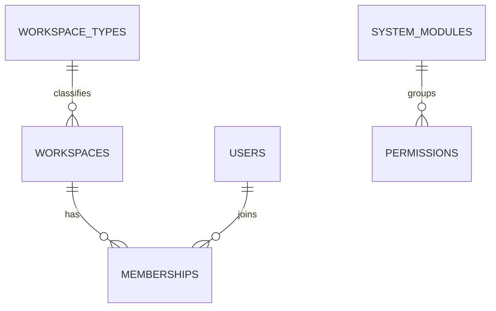

# 12 — Workspace Types, System Modules & Registries (Blueprint Revision R1)

The authoritative revision that (a) makes **Workspace** the tenant concept with a
pluggable **type**, (b) introduces the **system_modules** registry so permissions
bind to a module id (not a fixed name), and (c) closes the validation's critical
gaps: the lookup-category registry, the polymorphic-type registry, and the
adoption of the built `onboarding_progress` table.

## Related Documents

- [00-Database-Bible](00-Database-Bible.md) · [99-ERD-Blueprint](99-ERD-Blueprint.md) · [98-Validation-Report](98-Validation-Report.md)
- [01-Lookups-Reference](01-Lookups-Reference.md) · [02-RBAC-Membership](02-RBAC-Membership.md) · [03-Workspaces-Settings](03-Workspaces-Settings.md) · [04-Authentication](04-Authentication.md)
- [../48-Multi-Tenant-RBAC-Bible](../48-Multi-Tenant-RBAC-Bible.md) · [../11-Permissions-Matrix](../11-Permissions-Matrix.md)

## Purpose (الهدف)

To fold two enterprise refinements and the critical validation fixes into the
blueprint before any migration: the tenant becomes a typed **Workspace**;
permissions reference a **module** registry; and the cross-cutting registries the
schema depends on (lookup categories, polymorphic types) are made canonical.

## Why It Exists (سبب وجوده)

- **Workspace, not Company:** naming the tenant `workspaces` (with a type) lets the
  identical architecture serve a company, organization, university, government
  body, hospital, school, agency, or NGO — without schema changes.
- **Module registry:** binding permissions to `module_id` (not a hard-coded group
  string) makes the permission catalogue itself configuration-driven and lets new
  modules register their permissions as data.
- **Registries:** the validation ([98](98-Validation-Report.md)) found that ~40
  lookup categories and the polymorphic `*_type` values were coined ad hoc with no
  canonical home; `RESTRICT` FKs and polymorphic joins are only safe with one
  authoritative registry. This doc provides it.

## Architecture

### 1) Workspace as the tenant (rename + type)

The tenant table is **`workspaces`** (was `companies`). Every tenant FK is
**`workspace_id`** (was `company_id`). Tenant-owned `company_*` tables become
`workspace_*`. A workspace has a **type** via `workspace_type_id`.

This is a rename/cutover of the built schema (migrations 0001–0016 used
`companies`/`company_id`), executed AFTER ERD approval — see "Cutover" below.

### 2) Module registry

`system_modules` lists every functional module. `permissions.module_id` →
`system_modules` replaces the free-text `permissions.group` and the standalone
`permission_groups` table from [02-RBAC-Membership](02-RBAC-Membership.md): **the
module IS the permission group.** A permission's canonical key is
`<module.key>.<action>` (e.g. `jobs.create`), but storage references the module by
id, so renaming a module never breaks grants.

## Workflow

- A workspace is created with a `workspace_type_id` (default `company`).
- Seeding registers the `system_modules`, then seeds `permissions` as
  `(module_id, action)` rows; roles map to permissions as before.
- Domain lookups are seeded from the **Lookup Category Registry** (below); every
  `*_id → lookup_values` FK points at a registered category.
- Polymorphic columns use only values from the **Polymorphic Type Registry**.

## Business Rules

- **R1-01** The tenant entity is `workspaces`; the tenant FK is `workspace_id`
  everywhere (supersedes `companies`/`company_id` in all domain docs).
- **R1-02** Every workspace has exactly one `workspace_type_id` (RESTRICT).
- **R1-03** Every permission references a `module_id` (RESTRICT); there is no
  free-text permission group and no separate `permission_groups` table.
- **R1-04** Every `*_id → lookup_values` FK targets a category registered in the
  Lookup Category Registry; categories are seeded before dependent rows.
- **R1-05** Every polymorphic `*_type` value is from the Polymorphic Type
  Registry; the candidate subject is always `user` (never `candidate_profile`).
- **R1-06** `onboarding_progress` (BUILT) is part of the schema, owned by D3, and
  adopts `workspace_id`.

## Database Relations

### Table: `workspace_types` — BLUEPRINT · global catalog · not tenant-scoped · no soft-delete

| Column | Type | Null | Default | Notes |
|--------|------|------|---------|-------|
| id | BIGINT UNSIGNED | no | AI | PK |
| uuid | CHAR(36) | no | — | public id |
| key | VARCHAR(40) | no | — | company, organization, university, government, hospital, school, agency, nonprofit |
| label | VARCHAR(120) | no | — | display name |
| description | VARCHAR(255) | yes | NULL | |
| icon | VARCHAR(60) | yes | NULL | |
| is_system | TINYINT(1) | no | 1 | seeded platform types |
| is_active | TINYINT(1) | no | 1 | |
| sort_order | INT | no | 0 | |
| created_at / updated_at | TIMESTAMP | yes | NULL | |

Keys/Indexes: PRIMARY(id); UNIQUE `workspace_types_uuid_unique`(uuid); UNIQUE
`workspace_types_key_unique`(key); INDEX(is_active, sort_order).
FKs: none. Relationships: `workspace_types` 1—N `workspaces`. Seed: the 8 keys above.

### Change to `workspaces` (was `companies`)
Add `workspace_type_id` BIGINT UNSIGNED NOT NULL → `workspace_types(id)` RESTRICT,
INDEX `workspaces_workspace_type_id_index`. Default seed maps existing rows to the
`company` type. (All other `companies` columns carry over unchanged under the
`workspaces` name.)

### Table: `system_modules` — BLUEPRINT · global registry · not tenant-scoped · no soft-delete

| Column | Type | Null | Default | Notes |
|--------|------|------|---------|-------|
| id | BIGINT UNSIGNED | no | AI | PK |
| uuid | CHAR(36) | no | — | public id |
| key | VARCHAR(60) | no | — | dashboard, users, workspaces, jobs, candidates, applications, interviews, offers, reports, analytics, ai, billing, subscriptions, settings, roles, permissions, notifications, files, integrations, talent_pool |
| label | VARCHAR(120) | no | — | |
| description | VARCHAR(255) | yes | NULL | |
| icon | VARCHAR(60) | yes | NULL | |
| group | VARCHAR(60) | yes | NULL | functional grouping for the UI (e.g. "Hiring", "Platform") |
| is_active | TINYINT(1) | no | 1 | feature-flag-able per workspace via settings |
| sort_order | INT | no | 0 | |
| created_at / updated_at | TIMESTAMP | yes | NULL | |

Keys/Indexes: PRIMARY(id); UNIQUE `system_modules_uuid_unique`(uuid); UNIQUE
`system_modules_key_unique`(key); INDEX(is_active, sort_order).
Relationships: `system_modules` 1—N `permissions`.

### Change to `permissions` (D1)
Add `module_id` BIGINT UNSIGNED NOT NULL → `system_modules(id)` RESTRICT, INDEX
`permissions_module_id_index`; UNIQUE `permissions_module_action_unique`(module_id,
action). Remove the free-text `group` column and the `permission_groups` table
(superseded by `system_modules`). `action` ∈ the permission types in
[../11-Permissions-Matrix](../11-Permissions-Matrix.md) (view, create, edit,
delete, restore, export, import, approve, reject, assign, manage).

### Table: `onboarding_progress` — BUILT (migration 0014) · D3 · tenant-aware (nullable) · no soft-delete

| Column | Type | Null | Default | Notes |
|--------|------|------|---------|-------|
| id | BIGINT UNSIGNED | no | AI | PK (BUILT) |
| uuid | CHAR(36) | yes→no | — | add to match standard (0016 added uuid to core; this table to be aligned) |
| user_id | BIGINT UNSIGNED | no | — | → users(id) CASCADE (BUILT) |
| workspace_id | BIGINT UNSIGNED | yes | NULL | was `company_id` → workspaces(id) CASCADE (BUILT; rename) |
| flow | VARCHAR(60) | no | — | onboarding flow key (lookup `onboarding_flow`) |
| current_step | INT | no | 0 | |
| completed_steps | JSON | yes | NULL | |
| is_completed | TINYINT(1) | no | 0 | |
| completed_at | TIMESTAMP | yes | NULL | |
| created_at / updated_at | TIMESTAMP | yes | NULL | BUILT |

Keys/Indexes: PRIMARY(id); UNIQUE `onboarding_user_workspace_flow_unique`(user_id,
workspace_id, flow) (BUILT). FKs: user_id→users CASCADE; workspace_id→workspaces
CASCADE (BUILT). This formally adopts the orphan flagged as validation **F2**.

## Permissions

This doc defines `system_modules` (which permissions reference) and does not grant
anything itself. Editing modules/permissions is gated by `permissions.manage` /
`roles.manage` per [../11-Permissions-Matrix](../11-Permissions-Matrix.md).

## Validation

Resolves validation findings: **F2** (onboarding_progress adopted), **F3** (lookup
category registry, below), **F4** (polymorphic type registry, below). Remaining
report items are tracked in [98-Validation-Report](98-Validation-Report.md).

### Lookup Category Registry (F3 — canonical `lookup_values` categories)

Every `<x>_id → lookup_values` FK in the blueprint targets one of these
registered categories (seeded system-wide; tenants may add values, not
categories). Grouped by domain:

- **Workspace/Settings:** `workspace_type` (→ now its own table), `integration_type`, `domain_type`, `setting_type`.
- **RBAC:** `membership_status`, `role_history_action`, `permission_history_action`, `policy_effect`.
- **Auth:** `login_failure_reason`, `device_type`, `mfa_method_type`.
- **Billing:** `coupon_type`, `transaction_type`, `usage_metric`, `tax_type`.
- **Jobs:** `employment_type`, `experience_level`, `salary_period`, `job_question_type`, `job_criterion_type`, `pipeline_stage_type`.
- **Candidates:** `skill_level`, `language_proficiency`, `social_platform`, `document_type`, `availability`, `education_level`, `gender`, `seniority`.
- **Applications/Interviews:** `application_source`, `application_decision`, `interview_type`, `interview_mode`, `participant_role`, `participant_response`, `media_type`, `answer_type`.
- **AI/Notifications:** `ai_capability`, `notification_type`, `notification_channel` (→ also a catalog table), `template_locale`.
- **HR/Talent:** `team_role`, `evaluation_field_type`, `recommendation`, `approval_step_status`, `pool_visibility`, `meeting_mode`.
- **Files/Analytics:** `file_visibility`, `analytics_metric`, `performance_subject`.

**Shared categories (single definition, used by multiple domains — fixes the
duplicate `salary_period`/`skill_level`/`language_proficiency` flagged in 99):**
`salary_period` (jobs + candidates + offers), `skill_level` (jobs + candidates),
`language_proficiency` (jobs + candidates). These are defined ONCE here.

### Polymorphic Type Registry (F4 — canonical `*_type` values)

Polymorphic columns (`attachable_type`, `notable_type`, `taggable_type`,
`subject_type`, `approvable_type`, `translatable_type`, `principal_type`,
`source_type`, `performance subject`) use ONLY these stable logical keys:
`user`, `workspace`, `role`, `permission`, `membership`, `job`, `application`,
`interview`, `interview_session`, `offer`, `evaluation`, `candidate_document`,
`file`, `pool`, `team`, `department`, `subscription`, `invoice`, `payment`,
`notification`, `ai_request`.

**Rule:** the candidate is always addressed as `user` (never `candidate_profile`)
— resolves the divergence flagged as **F4/F12**.

## Edge Cases

- A workspace type cannot be deleted while workspaces reference it (RESTRICT).
- A module cannot be deleted while permissions reference it (RESTRICT); disable
  via `is_active` instead.
- Tenants may add lookup *values* to a category but cannot invent categories
  (categories are platform-controlled to keep FKs valid).

## Security

Module activation/feature-flags per workspace are governed by settings + RBAC;
disabling a module hides its permissions from role editors but never silently
grants access. No change to tenant isolation.

## Performance

`system_modules` and `workspace_types` are tiny, cached catalogs. Resolving a
permission's module is a cached lookup. No hot-path impact.

## Testing

- Seeders create all `workspace_types`, `system_modules`, lookup categories, and
  default lookup values; tests assert every `*_id → lookup_values` FK resolves to
  a registered category, and every polymorphic `*_type` is in the registry.
- `onboarding_progress` covered by the onboarding feature tests.

## Future Expansion

- Tenant-defined workspace sub-types; per-type default role sets and onboarding
  flows; per-module marketplace listings (`integrations` ↔ `system_modules`).

## Cutover (post-approval migration plan — NOT executed yet)

Applied only after the ERD is approved, alongside the other built→blueprint
renames (`activity_log`→`activity_logs`, `permission_role`→`role_permissions`,
`ai_credentials`→`tenant_ai_keys`, status ENUMs → status tables):

1. `RENAME TABLE companies TO workspaces;` and every `company_*` tenant table →
   `workspace_*`.
2. `ALTER TABLE ... CHANGE company_id workspace_id ...` across all tenant tables
   (FK names updated).
3. Create `workspace_types`, `system_modules`; add `workspaces.workspace_type_id`,
   `permissions.module_id`; backfill (`company` type; module rows; permission
   module_ids); drop `permissions.group` + `permission_groups`.
4. Rename code symbols `Company*` → `Workspace*` (`WorkspaceService`,
   `WorkspaceController`, `WorkspacePolicy`, `WorkspaceRepository`, model
   `Workspace`, `tenant()->workspace()`), routes `companies/*` → `workspaces/*`.

## Open Questions

- Whether `is_active` on `system_modules` is the per-platform default while a
  per-workspace `settings` toggle overrides it (recommended) — confirm.
- Whether to keep `company` as the default workspace type label or rename the seed
  to `business` — cosmetic, confirm at sign-off.
