# 99 — ERD Blueprint (Consolidated Final Database Blueprint)

The authoritative, consolidated Entity-Relationship blueprint for HalaOps — every
table across all domains (D0–D10), the cross-domain relationships, cardinalities,
foreign keys, indexes, and the scale/partitioning plan — assembled from the
approved domain designs and the [00-Database-Bible](00-Database-Bible.md)
standard. **DESIGN ONLY — no migrations, no code.** This document must be approved
before any migration is authored.

## Related Documents

- [00-Database-Bible](00-Database-Bible.md) — the authoritative standard (base columns, naming, config-driven rule, indexing, FK policy, soft-delete, polymorphic, scale) and the table inventory.
- [98-Validation-Report](98-Validation-Report.md) — external-architect review and fixes applied against this blueprint.
- Domain designs (each owns a disjoint set of tables — no table defined twice):
  [D0 Lookups/Reference/Polymorphic](01-Lookups-Reference.md) ·
  [D1 RBAC & Membership](02-RBAC-Membership.md) ·
  [D2 Workspaces & Settings](03-Workspaces-Settings.md) ·
  [D3 Authentication](04-Authentication.md) ·
  [D4 Subscriptions & Billing](05-Subscriptions-Billing.md) ·
  [D5 Jobs](06-Jobs.md) ·
  [D6 Candidates](07-Candidates.md) ·
  [D7 Applications & Interviews](08-Applications-Interviews.md) ·
  [D8 AI & Notifications](09-AI-Notifications.md) ·
  [D9 HR & Talent Pool](10-HR-Talent.md) ·
  [D10 Files/Queue/Analytics/Logs](11-Files-Queue-Analytics-Logs.md)
- Up-stream specs: [../05-Database-Architecture](../05-Database-Architecture.md), [../06-ERD](../06-ERD.md) (the canonical recruitment ERD this blueprint extends), [../08-Multi-Tenant](../08-Multi-Tenant.md), [../47-Enterprise-Architecture-Standards](../47-Enterprise-Architecture-Standards.md)

## How to read this document

- **Per-domain ERDs are NOT repeated here** — each domain doc carries the full
  Mermaid `erDiagram` for its own tables. This blueprint shows the **master
  cross-domain ERD** of the ~35 core/hub entities plus the full table inventory,
  the cross-domain FK matrix, the cardinality catalogue, and the global
  index/partitioning/reference-data summaries.
- **Tenancy.** Every tenant row carries an indexed `workspace_id` FK → `workspaces`
  (DB-2). "Tenant?" = *yes* (NOT NULL `workspace_id`), *NULL-able* (`workspace_id`
  nullable — NULL = system/platform/global default, non-null = tenant override),
  or *no* (global/reference/catalog, no `workspace_id`).
- **Public uuid.** Every table has `uuid CHAR(36) UNIQUE` (DB-3) **except** the
  documented exceptions: pure high-churn pivots, ephemeral auth rows, and
  extreme-volume FK-light append tables omit it for write throughput (Bible §1).
- **BUILT vs BLUEPRINT.** BUILT = present in migrations 0001–0016 (some renamed/
  extended by the blueprint); everything else is BLUEPRINT (the migration target).

---

## 1. Complete Table Inventory

Grouped by owning domain. **Total: 163 tables** across D0–D10.
("FK targets" lists the *primary* foreign keys; `workspace_id → workspaces` is shown
as `workspaces` and is implicit on every tenant/NULL-able row. Polymorphic
`(type,id)` pairs carry **no DB FK** — app-enforced — and are noted as *(poly)*.)

### D0 — Lookups, Reference & Polymorphic (12 tables) — [01](01-Lookups-Reference.md)

| Table | Domain | Tenant? | Soft-del? | uuid? | Primary FKs (→ targets) |
|---|---|---|---|---|---|
| `lookup_categories` | D0 | NULL-able | yes | yes | workspaces |
| `lookup_values` | D0 | NULL-able | yes | yes | lookup_categories, workspaces, lookup_values (parent) |
| `countries` | D0 | no | no | yes | currencies (default_currency) |
| `currencies` | D0 | no | no | yes | — |
| `languages` | D0 | no | no | yes | — |
| `timezones` | D0 | no | no | yes | countries |
| `translations` | D0 | NULL-able | no | yes | workspaces; *(poly)* translatable_type/id |
| `attachments` | D0 | yes | yes | yes | workspaces, files, users (uploaded_by); *(poly)* attachable_type/id |
| `notes` | D0 | yes | yes | yes | workspaces, lookup_values (type), users; *(poly)* notable_type/id |
| `tags` | D0 | yes | yes | yes | workspaces, users (created_by) |
| `taggables` | D0 | yes | no | **no (pivot)** | workspaces, tags; *(poly)* taggable_type/id |
| `status_histories` | D0 | yes | no (append) | yes | workspaces, users (changed_by); *(poly)* subject_type/id + from/to_status_id |

### D1 — RBAC & Membership (12 tables) — [02](02-RBAC-Membership.md)

| Table | Domain | Tenant? | Soft-del? | uuid? | Primary FKs (→ targets) |
|---|---|---|---|---|---|
| `roles` *(BUILT)* | D1 | NULL-able | yes | yes | workspaces, roles (parent), users (created_by/updated_by) |
| `permission_groups` | D1 | no | no | yes | — |
| `permissions` *(BUILT)* | D1 | no | no | yes | permission_groups |
| `role_permissions` *(BUILT `permission_role`)* | D1 | no (via role) | no | **no (pivot)** | roles, permissions, users (created_by) |
| `user_roles` *(BUILT `user_role`)* | D1 | no | no | **no (pivot)** | users, roles, users (created_by) |
| `memberships` *(BUILT)* | D1 | yes | yes | yes | workspaces, users, users (invited_by), lookup_values (membership_status) |
| `membership_roles` *(BUILT `membership_role`)* | D1 | no (via membership) | no | **no (pivot)** | memberships, roles, users (created_by) |
| `policies` | D1 | NULL-able | yes | yes | workspaces, users (created_by/updated_by); *(poly)* subject_type/id |
| `policy_permissions` | D1 | no (via policy) | no | **no (pivot)** | policies, permissions, users (created_by) |
| `permission_caches` | D1 | NULL-able | no (derived) | **no (cache)** | workspaces, permissions; *(poly)* principal_type/id |
| `role_histories` | D1 | NULL-able | no (append) | sparse | workspaces, roles, lookup_values (action), users (performed_by); *(poly)* principal_type/id |
| `permission_histories` | D1 | NULL-able | no (append) | sparse | workspaces, permissions, lookup_values (action), users (performed_by); *(poly)* grantor_type/id |

### D2 — Workspaces & Settings (17 tables) — [03](03-Workspaces-Settings.md)

| Table | Domain | Tenant? | Soft-del? | uuid? | Primary FKs (→ targets) |
|---|---|---|---|---|---|
| `workspaces` *(BUILT, extended)* | D2 | **is tenant** | yes | yes | users (owner), workspace_statuses, countries, languages, timezones |
| `workspace_statuses` | D2 | NULL-able | no | yes | workspaces |
| `workspace_settings` *(BUILT `settings`)* | D2 | yes | no | yes | workspaces |
| `workspace_branding` | D2 | yes (1:1) | no | yes | workspaces, files (logo/logo_dark/favicon) |
| `workspace_billing` | D2 | yes (1:1) | no | yes | workspaces, countries, currencies |
| `workspace_ai_settings` | D2 | yes (1:1) | no | yes | workspaces, ai_providers, ai_models, tenant_ai_keys, currencies |
| `workspace_storage` | D2 | yes (1:1) | no | yes | workspaces, storage_providers |
| `workspace_integrations` | D2 | yes | yes | yes | workspaces, integrations, integration_status, users (installed_by) |
| `workspace_domains` | D2 | yes | yes | yes | workspaces, lookup_values (domain_type), domain_status |
| `workspace_invitations` | D2 | yes | yes | yes | workspaces, roles, users (invited_by/user_id), invitation_status, memberships |
| `global_settings` | D2 | no | no | yes | — |
| `user_settings` | D2 | NULL-able | no | yes | users, workspaces |
| `mail_settings` | D2 | NULL-able | no | yes | workspaces |
| `integrations` | D2 | no (catalog) | no | yes | — |
| `integration_status` | D2 | NULL-able | no | yes | workspaces |
| `domain_status` | D2 | NULL-able | no | yes | workspaces |
| `invitation_status` | D2 | NULL-able | no | yes | workspaces |

> D2 adds four config-driven status/catalog tables beyond the original inventory:
> `integrations` (marketplace catalog) plus the per-entity status tables
> `integration_status`, `domain_status`, `invitation_status` (Bible §2 shape;
> flagged in D2 as collapsible into `lookup_values` if D0 later claims them).

### D3 — Authentication (9 tables) — [04](04-Authentication.md)

| Table | Domain | Tenant? | Soft-del? | uuid? | Primary FKs (→ targets) |
|---|---|---|---|---|---|
| `sessions` | D3 | no | no | **no (id is PK)** | users, devices |
| `remember_tokens` | D3 | no | no | yes | users, devices |
| `password_resets` *(BUILT)* | D3 | no | no | **no (PK email)** | — (none; keyed by email) |
| `login_histories` | D3 | no | no (append) | **no (volume)** | users, devices, lookup_values (failure_reason), countries |
| `devices` | D3 | no | no | yes | users, lookup_values (type) |
| `failed_login_attempts` | D3 | no | no | **no (ephemeral)** | — (none; keyed by throttle_key) |
| `mfa_methods` | D3 | no | no | yes | users, lookup_values (type) |
| `mfa_recovery_codes` | D3 | no | no | yes | users, mfa_methods |
| `personal_access_tokens` | D3 | NULL-able | no | yes | users, workspaces |

### D4 — Subscriptions & Billing (21 tables) — [05](05-Subscriptions-Billing.md)

| Table | Domain | Tenant? | Soft-del? | uuid? | Primary FKs (→ targets) |
|---|---|---|---|---|---|
| `plans` *(BUILT, extended)* | D4 | no (catalog) | yes | yes | — |
| `plan_features` | D4 | no | no | yes | plans |
| `plan_prices` | D4 | no | no | yes | plans, currencies |
| `subscriptions` *(BUILT, extended)* | D4 | yes | yes | yes | workspaces, plans, plan_prices, subscription_statuses, currencies, payment_methods, coupons |
| `subscription_items` | D4 | yes | no | yes | workspaces, subscriptions, plan_prices, currencies |
| `subscription_statuses` | D4 | NULL-able | no | yes | workspaces |
| `subscription_renewals` | D4 | yes | no (append) | yes | workspaces, subscriptions, invoices, currencies |
| `trials` | D4 | yes | yes | yes | workspaces, subscriptions (×2), plans |
| `invoices` | D4 | yes | yes | yes | workspaces, subscriptions, invoice_statuses, currencies, coupons |
| `invoice_items` | D4 | yes | no | yes | workspaces, invoices, subscription_items, plan_prices, currencies |
| `invoice_statuses` | D4 | NULL-able | no | yes | workspaces |
| `payments` | D4 | yes | yes | yes | workspaces, invoices, subscriptions, payment_statuses, payment_gateways, payment_methods, currencies, users (created_by) |
| `payment_statuses` | D4 | NULL-able | no | yes | workspaces |
| `transactions` | D4 | yes | **no (immutable ledger)** | yes | workspaces (RESTRICT), payments, invoices, subscriptions, payment_gateways, currencies, transactions (parent) |
| `payment_methods` | D4 | yes | yes | yes | workspaces, payment_gateways, users (created_by) |
| `payment_gateways` | D4 | no (catalog) | no | yes | — |
| `gateway_events` | D4 | NULL-able | no (append) | optional | payment_gateways, workspaces, payments |
| `coupons` | D4 | NULL-able | yes | yes | workspaces, currencies, plans (applies_to), users (created_by) |
| `coupon_redemptions` | D4 | yes | no (append) | yes | workspaces, coupons, subscriptions, invoices, currencies, users (redeemed_by) |
| `usage_records` | D4 | yes | no (append) | optional | workspaces, subscriptions, usage_limits, currencies; *(poly)* reference_type/id |
| `usage_limits` | D4 | NULL-able | no | yes | plans, workspaces, subscriptions, currencies |

### D5 — Jobs (12 tables) — [06](06-Jobs.md)

| Table | Domain | Tenant? | Soft-del? | uuid? | Primary FKs (→ targets) |
|---|---|---|---|---|---|
| `jobs` | D5 | yes | yes | yes | workspaces, job_statuses, pipelines, departments, lookup_values (employment_type/experience_level/salary_period), currencies, users (created_by/updated_by) |
| `job_statuses` | D5 | NULL-able | yes | yes | workspaces |
| `locations` | D5 | yes | yes | yes | workspaces, countries, timezones |
| `job_locations` | D5 | yes | no | **no (pivot)** | workspaces, jobs, locations |
| `job_skills` | D5 | yes | no | **no (pivot)** | workspaces, jobs, skills (D6), lookup_values (required_level) |
| `job_languages` | D5 | yes | no | **no (pivot)** | workspaces, jobs, languages, lookup_values (proficiency) |
| `benefits` | D5 | yes | yes | yes | workspaces, lookup_values (category) |
| `job_benefits` | D5 | yes | no | **no (pivot)** | workspaces, jobs, benefits |
| `job_questions` | D5 | yes | yes | yes | workspaces, jobs, lookup_values (question_type) |
| `job_criteria` | D5 | yes | yes | yes | workspaces, jobs, lookup_values (criterion_type) |
| `pipelines` | D5 | yes | yes | yes | workspaces, jobs, users (created_by) |
| `pipeline_stages` | D5 | yes | yes | yes | workspaces, pipelines, application_statuses (D7), lookup_values (stage_type) |

### D6 — Candidates (9 tables) — [07](07-Candidates.md)

| Table | Domain | Tenant? | Soft-del? | uuid? | Primary FKs (→ targets) |
|---|---|---|---|---|---|
| `candidate_profiles` | D6 | **no (global, 1:1 user)** | yes | yes | users (UNIQUE), currencies, countries (×2), lookup_values (availability/salary_period/gender) |
| `skills` | D6 | NULL-able (system+tenant) | yes | yes | workspaces, lookup_values (category), users (created_by) |
| `candidate_skills` | D6 | no (global pivot) | no | **no (pivot)** | users, skills, lookup_values (level) |
| `candidate_languages` | D6 | no (global pivot) | no | **no (pivot)** | users, languages, lookup_values (proficiency) |
| `experiences` | D6 | no (global) | yes | yes | users, lookup_values (employment_type) |
| `educations` | D6 | no (global) | yes | yes | users, lookup_values (degree_level) |
| `certificates` | D6 | no (global) | yes | yes | users, files |
| `social_links` | D6 | no (global) | yes | yes | users, lookup_values (platform) |
| `candidate_documents` | D6 | no (global) | yes | yes | users, files (RESTRICT), lookup_values (type), languages |

### D7 — Applications & Interviews (16 tables) — [08](08-Applications-Interviews.md)

| Table | Domain | Tenant? | Soft-del? | uuid? | Primary FKs (→ targets) |
|---|---|---|---|---|---|
| `applications` | D7 | yes | yes | yes | workspaces, jobs, users (candidate), pipeline_stages, application_statuses, lookup_values (source), files (resume) |
| `application_statuses` | D7 | NULL-able | no | yes | workspaces |
| `application_decisions` | D7 | yes | no (append) | yes | workspaces, applications, lookup_values (decision), application_statuses (from/to), users (decided_by) |
| `application_ai_results` | D7 | yes | no | yes | workspaces, applications (UNIQUE), ai_providers, ai_models |
| `interviews` | D7 | yes | yes | yes | workspaces, applications, jobs, lookup_values (type/mode), interview_statuses, timezones, users (created_by) |
| `interview_statuses` | D7 | NULL-able | no | yes | workspaces |
| `interview_sessions` | D7 | yes | no | yes | workspaces, interviews, lookup_values (session_status), users (started_by) |
| `interview_messages` | D7 | yes | no (append) | **no (billions, FK-light)** | *(FK-light)* workspace_id, interview_id, session_id, sender_user_id |
| `interview_media` | D7 | yes | yes | yes | workspaces, interviews, interview_sessions, interview_questions, lookup_values (type), files |
| `interview_questions` | D7 | yes | yes | yes | workspaces, interviews, jobs, lookup_values (type), job_criteria |
| `interview_answers` | D7 | yes | yes | yes | workspaces, interviews, interview_sessions, interview_questions, users, interview_media, files |
| `interview_scores` | D7 | yes | no | yes | workspaces, interviews, interview_sessions, job_criteria, users (scored_by) |
| `interview_ai_analyses` | D7 | yes | no | yes | workspaces, interviews, interview_sessions, ai_providers, ai_models |
| `interview_tokens` | D7 | yes | no (expire) | yes | workspaces, interviews, users |
| `interview_logs` | D7 | yes | no (append) | **no (billions, FK-light)** | *(FK-light)* workspace_id, interview_id, session_id, actor_user_id |
| `interview_participants` | D7 | yes | no (pivot) | yes | workspaces, interviews, users, lookup_values (role/response) |

### D8 — AI & Notifications (16 tables) — [09](09-AI-Notifications.md)

| Table | Domain | Tenant? | Soft-del? | uuid? | Primary FKs (→ targets) |
|---|---|---|---|---|---|
| `ai_providers` | D8 | no (catalog) | yes | yes | — |
| `ai_models` | D8 | no (catalog) | yes | yes | ai_providers, currencies |
| `tenant_ai_keys` *(BUILT `ai_credentials`)* | D8 | yes | no | optional | workspaces, ai_providers |
| `ai_requests` | D8 | yes | no (append) | **no (billions, FK-light)** | *(FK-light)* workspace_id, tenant_ai_key_id, provider_id, model_id, user_id; *(poly)* subject_type/id |
| `ai_responses` | D8 | yes | no (append) | **no (billions, FK-light)** | *(FK-light)* request_id, workspace_id, model_id, currency_id |
| `ai_usage` | D8 | yes | no (rollup) | yes | workspaces, ai_providers, ai_models, currencies |
| `ai_costs` | D8 | no (catalog) | no (append) | yes | ai_models, currencies |
| `ai_logs` | D8 | yes | no (append) | **no (billions, FK-light)** | *(FK-light)* workspace_id, request_id, provider_id, model_id |
| `ai_errors` | D8 | yes | no (append) | **no (billions, FK-light)** | *(FK-light)* workspace_id, request_id, provider_id, model_id |
| `ai_cache` | D8 | yes | no (expire) | **no (cache)** | workspaces, ai_models |
| `notifications` | D8 | NULL-able | no (partitioned) | yes | workspaces, users, lookup_values (type), notification_channels, users (actor); *(poly)* subject_type/id |
| `notification_templates` | D8 | NULL-able | yes | yes | workspaces, lookup_values (type), notification_channels |
| `notification_channels` | D8 | no (catalog) | yes | yes | — |
| `notification_preferences` | D8 | NULL-able | no | yes | users, workspaces, lookup_values (type), notification_channels |
| `notification_queue` | D8 | NULL-able | no | yes | notifications, workspaces, users, notification_channels, notification_templates, lookup_values (type) |
| `notification_logs` | D8 | NULL-able | no (append) | **no (volume, FK-light)** | *(FK-light)* notification_id, queue_id, workspace_id, user_id, channel_id |

### D9 — HR & Talent Pool (20 tables) — [10](10-HR-Talent.md)

| Table | Domain | Tenant? | Soft-del? | uuid? | Primary FKs (→ targets) |
|---|---|---|---|---|---|
| `departments` | D9 | yes | yes | yes | workspaces, departments (parent), users (head/created_by) |
| `teams` | D9 | yes | yes | yes | workspaces, departments, users (lead/created_by) |
| `team_members` | D9 | yes | no (pivot) | yes | workspaces, teams, users, lookup_values (role) |
| `interview_panels` | D9 | yes | yes | yes | workspaces, interviews (D7), users (chair/created_by) |
| `panel_members` | D9 | yes | no (pivot) | yes | workspaces, interview_panels, users, lookup_values (role) |
| `schedules` | D9 | yes | yes | yes | workspaces, users (owner), teams, timezones, lookup_values (visibility), users (created_by) |
| `meetings` | D9 | yes | yes | yes | workspaces, schedules, interviews (D7), users (organizer), lookup_values (type/status/location_type/provider), timezones, users (created_by) |
| `meeting_participants` | D9 | yes | no (pivot) | yes | workspaces, meetings, users, lookup_values (role/response) |
| `evaluation_forms` | D9 | yes | yes | yes | workspaces, lookup_values (scope/scoring_type), users (created_by) |
| `evaluation_form_fields` | D9 | yes | yes | yes | workspaces, evaluation_forms, lookup_values (field_type/category) |
| `evaluations` | D9 | yes | yes | yes | workspaces, applications (D7), interviews (D7), evaluation_forms, users (evaluator), lookup_values (recommendation) |
| `evaluation_scores` | D9 | yes | no (child) | yes | workspaces, evaluations, evaluation_form_fields, lookup_values (option) |
| `offers` | D9 | yes | yes | yes | workspaces, applications (D7), offer_statuses, users (candidate), lookup_values (employment_type/salary_period), currencies, users (created_by) |
| `offer_statuses` | D9 | NULL-able | no | yes | workspaces |
| `offer_approvals` | D9 | yes | no (link) | yes | workspaces, offers, approvals |
| `approvals` | D9 | yes | yes | yes | workspaces, lookup_values (status/mode), users (requested_by); *(poly)* approvable_type/id |
| `approval_steps` | D9 | yes | no (child) | yes | workspaces, approvals, users (approver), lookup_values (approver_role/status) |
| `pools` | D9 | yes | yes | yes | workspaces, lookup_values (type), users (owner), departments, users (created_by) |
| `pool_groups` | D9 | yes | yes | yes | workspaces, pools, users (created_by) |
| `pool_candidates` | D9 | yes | yes | yes | workspaces, pools, pool_groups, users, lookup_values (source/stage), users (added_by) |

### D10 — Files, Queue, Analytics & Logs (19 tables) — [11](11-Files-Queue-Analytics-Logs.md)

| Table | Domain | Tenant? | Soft-del? | uuid? | Primary FKs (→ targets) |
|---|---|---|---|---|---|
| `files` | D10 | yes | yes | yes | workspaces, users, folders, storage_providers, lookup_values (visibility) |
| `folders` | D10 | yes | yes | yes | workspaces, folders (parent), users (created_by) |
| `storage_providers` | D10 | NULL-able | yes | yes | workspaces |
| `file_versions` | D10 | yes | no (append) | yes | files, workspaces, users (created_by) |
| `queued_jobs` | D10 | NULL-able | no | yes | *(FK-light)* workspace_id |
| `failed_jobs` | D10 | NULL-able | no | yes | *(FK-light)* workspace_id |
| `scheduled_tasks` | D10 | no | no | yes | — |
| `daily_analytics` | D10 | yes | no (rollup) | **no (rollup)** | *(FK-light)* workspace_id, metric_id |
| `monthly_analytics` | D10 | yes | no (rollup) | **no (rollup)** | *(FK-light)* workspace_id, metric_id |
| `usage_analytics` | D10 | yes | no (rollup) | **no (rollup)** | *(FK-light)* workspace_id, metric_id |
| `hiring_analytics` | D10 | yes | no (rollup) | **no (rollup)** | *(FK-light)* workspace_id, job_id |
| `ai_analytics` | D10 | yes | no (rollup) | **no (rollup)** | *(FK-light)* workspace_id, provider_id, model_id |
| `interview_analytics` | D10 | yes | no (rollup) | **no (rollup)** | *(FK-light)* workspace_id, job_id |
| `performance_analytics` | D10 | yes | no (rollup) | **no (rollup)** | *(FK-light)* workspace_id, metric_id; *(poly)* subject_type/id |
| `activity_logs` *(BUILT `activity_log`)* | D10 | NULL-able | no (append) | **no (volume)** | workspaces, users (actor); *(poly)* subject_type/id |
| `system_logs` | D10 | NULL-able | no (append) | **no (volume)** | *(FK-light)* workspace_id |
| `security_logs` | D10 | NULL-able | no (append) | **no (volume)** | *(FK-light)* workspace_id, user_id |
| `api_logs` | D10 | NULL-able | no (append) | **no (volume)** | *(FK-light)* workspace_id, token_id, user_id |
| `billing_logs` | D10 | yes | no (append) | **no (volume)** | *(FK-light)* workspace_id, user_id, currency_id; *(poly)* subject_type/id |

**Inventory totals** — D0: 12 · D1: 12 · D2: 17 · D3: 9 · D4: 21 · D5: 12 ·
D6: 9 · D7: 16 · D8: 16 · D9: 20 · D10: 19 = **163 tables**.

---

## 2. Master Cross-Domain ERD (core / hub entities)

The ~35 hub entities and their **cross-domain** edges. Full per-domain detail
(all 163 tables) lives in the domain docs. Crow's-foot cardinality:
`||--o{` = one-to-many, `||--||`/`||--o|` = one-to-(zero-or-)one,
`}o--||` = many-to-one. The five most-referenced anchors are `workspaces`
(tenant), `users` (actor/candidate), `lookup_values` (config), `files`, and the
per-entity `*_statuses`.

```mermaid
erDiagram
    %% ---- Tenancy & identity core ----
    users         ||--o{ workspaces            : "owns (owner_id)"
    workspace_statuses ||--o{ workspaces         : "classifies"
    workspaces     ||--o{ memberships          : "has"
    users         ||--o{ memberships          : "is member via"
    memberships   ||--o{ membership_roles     : "carries"
    roles         ||--o{ membership_roles     : "assigned to"
    roles         ||--o{ role_permissions     : "grants"
    permissions   ||--o{ role_permissions     : "granted via"
    permission_groups ||--o{ permissions      : "groups"
    roles         ||--o{ user_roles           : "global to user"
    users         ||--o{ user_roles           : "holds"
    roles         ||--o{ roles                : "parent (inheritance)"
    workspaces     ||--o{ workspace_invitations  : "sends"
    roles         ||--o{ workspace_invitations  : "invited role"
    workspace_invitations ||--o| memberships     : "accepted becomes"

    %% ---- Config / reference (D0) hubs ----
    lookup_categories ||--o{ lookup_values    : "groups"
    countries     ||--o{ currencies           : "(currency↔country)"
    workspaces     ||--o{ lookup_values        : "tenant override"

    %% ---- Billing (D4) ----
    plans         ||--o{ plan_prices          : "priced by"
    currencies    ||--o{ plan_prices          : "in"
    workspaces     ||--o{ subscriptions        : "has"
    plans         ||--o{ subscriptions        : "of plan"
    subscription_statuses ||--o{ subscriptions : "state"
    subscriptions ||--o{ invoices             : "billed as"
    invoice_statuses ||--o{ invoices          : "state"
    workspaces     ||--o{ invoices             : "billed"
    invoices      ||--o{ payments             : "settled by"
    payment_statuses ||--o{ payments          : "state"
    payment_gateways ||--o{ payments          : "processed by"
    payments      ||--o{ transactions         : "records (ledger)"

    %% ---- Jobs (D5) ----
    workspaces     ||--o{ jobs                 : "posts"
    job_statuses  ||--o{ jobs                 : "classifies"
    departments   ||--o{ jobs                 : "groups"
    pipelines     ||--o{ jobs                 : "drives"
    pipelines     ||--o{ pipeline_stages      : "ordered into"
    jobs          ||--o{ job_skills           : "requires"
    skills        ||--o{ job_skills           : "required by"
    jobs          ||--o{ job_criteria         : "scored by"

    %% ---- Candidates (D6) ----
    users         ||--o| candidate_profiles   : "has CV (1:1)"
    users         ||--o{ candidate_skills     : "claims"
    skills        ||--o{ candidate_skills     : "rated"

    %% ---- Applications & Interviews (D7) ----
    jobs          ||--o{ applications         : "receives"
    users         ||--o{ applications         : "candidate applies"
    application_statuses ||--o{ applications  : "state"
    pipeline_stages ||--o{ applications       : "current stage"
    applications  ||--o| application_ai_results : "AI screens"
    applications  ||--o{ interviews          : "assessed by"
    interview_statuses ||--o{ interviews      : "state"
    interviews    ||--o{ interview_sessions   : "runs"
    interviews    ||--o{ interview_participants : "involves"
    users         ||--o{ interview_participants : "participates"
    job_criteria  ||--o{ interview_scores     : "criterion of"
    interviews    ||--o{ interview_scores     : "scored"

    %% ---- HR & Talent (D9) ----
    workspaces     ||--o{ departments          : "has"
    departments   ||--o{ departments          : "parent of"
    interviews    ||--o| interview_panels     : "assessed by"
    applications  ||--o{ evaluations          : "scored"
    interviews    ||--o{ evaluations          : "from"
    evaluation_forms ||--o{ evaluations       : "templated by"
    applications  ||--o{ offers               : "results in"
    offer_statuses ||--o{ offers              : "classifies"
    currencies    ||--o{ offers               : "priced in"
    offers        ||--o{ offer_approvals      : "requires"
    approvals     ||--o{ offer_approvals      : "fulfills"
    workspaces     ||--o{ pools                : "owns"
    pools         ||--o{ pool_candidates      : "contains"
    users         ||--o{ pool_candidates      : "pooled candidate"

    %% ---- AI & Notifications (D8) ----
    ai_providers  ||--o{ ai_models            : "offers"
    workspaces     ||--o{ tenant_ai_keys       : "owns key"
    ai_providers  ||--o{ tenant_ai_keys       : "for provider"
    ai_models     ||--o{ application_ai_results : "scored by"
    ai_models     ||--o{ interview_ai_analyses : "analyzed by"
    workspaces     ||--o{ notifications        : "scopes (NULL=platform)"
    users         ||--o{ notifications        : "receives"
    notification_channels ||--o{ notifications : "delivered on"

    %% ---- Files (D10) & cross-cutting ----
    workspaces     ||--o{ files                : "owns"
    storage_providers ||--o{ files            : "backs"
    files         ||--o{ attachments          : "linked to any entity (poly)"
    files         ||--o{ candidate_documents  : "CV/portfolio"
    files         ||--o{ workspace_branding     : "logo/favicon"
    workspaces     ||--o{ activity_logs        : "audit (NULL=platform)"
    users         ||--o{ activity_logs        : "actor"

    workspaces {
        bigint id PK
        char uuid UK
        bigint owner_id FK
        bigint workspace_status_id FK
    }
    users {
        bigint id PK
        char uuid UK
    }
    memberships {
        bigint id PK
        bigint workspace_id FK
        bigint user_id FK
        bigint membership_status_id FK
    }
    roles {
        bigint id PK
        bigint workspace_id FK "NULL=global"
        bigint parent_id FK
    }
    permissions {
        bigint id PK
        bigint permission_group_id FK
    }
    lookup_values {
        bigint id PK
        bigint category_id FK
        bigint workspace_id FK "NULL=system"
    }
    plans {
        bigint id PK
        char uuid UK
    }
    subscriptions {
        bigint id PK
        bigint workspace_id FK
        bigint plan_id FK
        bigint subscription_status_id FK
    }
    invoices {
        bigint id PK
        bigint workspace_id FK
        bigint invoice_status_id FK
    }
    payments {
        bigint id PK
        bigint invoice_id FK
        bigint payment_status_id FK
    }
    jobs {
        bigint id PK
        bigint workspace_id FK
        bigint job_status_id FK
        bigint pipeline_id FK
        bigint department_id FK
    }
    skills {
        bigint id PK
        bigint workspace_id FK "NULL=system"
    }
    candidate_profiles {
        bigint id PK
        bigint user_id FK "UNIQUE 1:1"
    }
    applications {
        bigint id PK
        bigint job_id FK
        bigint user_id FK
        bigint application_status_id FK
        bigint current_stage_id FK
    }
    interviews {
        bigint id PK
        bigint application_id FK
        bigint interview_status_id FK
    }
    interview_sessions {
        bigint id PK
        bigint interview_id FK
    }
    job_criteria {
        bigint id PK
        bigint job_id FK
    }
    offers {
        bigint id PK
        bigint application_id FK
        bigint offer_status_id FK
        bigint currency_id FK
    }
    approvals {
        bigint id PK
        string approvable_type
        bigint approvable_id
    }
    pools {
        bigint id PK
        bigint workspace_id FK
    }
    ai_providers {
        bigint id PK
        char uuid UK
    }
    ai_models {
        bigint id PK
        bigint provider_id FK
    }
    tenant_ai_keys {
        bigint id PK
        bigint workspace_id FK
        bigint provider_id FK
    }
    notifications {
        bigint id PK
        bigint user_id FK
        bigint channel_id FK
    }
    files {
        bigint id PK
        bigint workspace_id FK
        bigint storage_provider_id FK
    }
    attachments {
        bigint id PK
        bigint file_id FK
        string attachable_type
        bigint attachable_id
    }
    activity_logs {
        bigint id PK
        bigint workspace_id FK
        bigint user_id FK
    }
```

---

## 3. Cross-Domain Foreign-Key Matrix

Every FK whose **target lives in a different domain** than the source table.
On-update is **CASCADE** for all rows below (per the Bible) and is omitted for
brevity. Same-domain FKs (e.g. `invoice_items → invoices`, `pipeline_stages →
pipelines`) are documented in their domain docs and not repeated here.

### From D0 — Lookups/Reference/Polymorphic

| From (table.column) | → To | Card. | On delete |
|---|---|---|---|
| `lookup_categories.workspace_id` | workspaces (D2) | N:1 | CASCADE |
| `lookup_values.workspace_id` | workspaces (D2) | N:1 | CASCADE |
| `translations.workspace_id` | workspaces (D2) | N:1 | CASCADE |
| `attachments.workspace_id` | workspaces (D2) | N:1 | CASCADE |
| `attachments.file_id` | files (D10) | N:1 | CASCADE |
| `attachments.uploaded_by` | users (D3) | N:1 | SET NULL |
| `notes.workspace_id` | workspaces (D2) | N:1 | CASCADE |
| `notes.user_id` | users (D3) | N:1 | SET NULL |
| `tags.workspace_id` | workspaces (D2) | N:1 | CASCADE |
| `tags.created_by` | users (D3) | N:1 | SET NULL |
| `taggables.workspace_id` | workspaces (D2) | N:1 | CASCADE |
| `taggables.tagged_by` | users (D3) | N:1 | SET NULL |
| `status_histories.workspace_id` | workspaces (D2) | N:1 | CASCADE |
| `status_histories.changed_by` | users (D3) | N:1 | SET NULL |

### From D1 — RBAC & Membership

| From (table.column) | → To | Card. | On delete |
|---|---|---|---|
| `roles.workspace_id` | workspaces (D2) | N:1 | CASCADE |
| `roles.created_by` / `roles.updated_by` | users (D3) | N:1 | SET NULL |
| `memberships.workspace_id` | workspaces (D2) | N:1 | CASCADE |
| `memberships.user_id` | users (D3) | N:1 | CASCADE |
| `memberships.invited_by` | users (D3) | N:1 | SET NULL |
| `memberships.membership_status_id` | lookup_values (D0) | N:1 | RESTRICT |
| `user_roles.user_id` | users (D3) | N:1 | CASCADE |
| `policies.workspace_id` | workspaces (D2) | N:1 | CASCADE |
| `permission_caches.workspace_id` | workspaces (D2) | N:1 | CASCADE |
| `role_histories.workspace_id` | workspaces (D2) | N:1 | CASCADE |
| `role_histories.action_id` | lookup_values (D0) | N:1 | RESTRICT |
| `permission_histories.workspace_id` | workspaces (D2) | N:1 | CASCADE |
| `permission_histories.action_id` | lookup_values (D0) | N:1 | RESTRICT |
| *(role_permissions/membership_roles/user_roles/policy_permissions)* `.created_by` | users (D3) | N:1 | SET NULL |

### From D2 — Workspaces & Settings

| From (table.column) | → To | Card. | On delete |
|---|---|---|---|
| `workspaces.owner_id` | users (D3) | N:1 | RESTRICT |
| `workspaces.country_id` | countries (D0) | N:1 | RESTRICT |
| `workspaces.language_id` | languages (D0) | N:1 | RESTRICT |
| `workspaces.timezone_id` | timezones (D0) | N:1 | RESTRICT |
| `workspace_branding.{logo,logo_dark,favicon}_file_id` | files (D10) | N:1 | SET NULL |
| `workspace_billing.country_id` | countries (D0) | N:1 | RESTRICT |
| `workspace_billing.currency_id` | currencies (D0) | N:1 | RESTRICT |
| `workspace_ai_settings.default_provider_id` | ai_providers (D8) | N:1 | RESTRICT |
| `workspace_ai_settings.default_model_id` | ai_models (D8) | N:1 | RESTRICT |
| `workspace_ai_settings.default_key_id` | tenant_ai_keys (D8) | N:1 | SET NULL |
| `workspace_ai_settings.cost_currency_id` | currencies (D0) | N:1 | RESTRICT |
| `workspace_storage.storage_provider_id` | storage_providers (D10) | N:1 | RESTRICT |
| `workspace_domains.domain_type_id` | lookup_values (D0) | N:1 | RESTRICT |
| `workspace_invitations.role_id` | roles (D1) | N:1 | RESTRICT |
| `workspace_invitations.{invited_by,user_id}` | users (D3) | N:1 | SET NULL |
| `workspace_invitations.membership_id` | memberships (D1) | N:1 | SET NULL |
| `user_settings.user_id` | users (D3) | N:1 | CASCADE |
| `workspace_integrations.installed_by` | users (D3) | N:1 | SET NULL |

### From D3 — Authentication

| From (table.column) | → To | Card. | On delete |
|---|---|---|---|
| `sessions.user_id` | users (D3, same-domain anchor) | N:1 | CASCADE |
| `login_histories.failure_reason_id` | lookup_values (D0) | N:1 | RESTRICT |
| `login_histories.country_id` | countries (D0) | N:1 | SET NULL |
| `devices.type_id` | lookup_values (D0) | N:1 | RESTRICT |
| `mfa_methods.type_id` | lookup_values (D0) | N:1 | RESTRICT |
| `personal_access_tokens.workspace_id` | workspaces (D2) | N:1 | CASCADE |

> Note: `users` is the global identity table (BUILT, migration 0002). It is the
> anchor `users.id` referenced by nearly every domain; it carries no `workspace_id`.

### From D4 — Subscriptions & Billing

| From (table.column) | → To | Card. | On delete |
|---|---|---|---|
| `plan_prices.currency_id` | currencies (D0) | N:1 | RESTRICT |
| `subscriptions.workspace_id` | workspaces (D2) | N:1 | CASCADE |
| `subscriptions.currency_id` | currencies (D0) | N:1 | RESTRICT |
| `subscription_items.currency_id` | currencies (D0) | N:1 | RESTRICT |
| `subscription_renewals.currency_id` | currencies (D0) | N:1 | RESTRICT |
| `invoices.currency_id` | currencies (D0) | N:1 | RESTRICT |
| `invoice_items.currency_id` | currencies (D0) | N:1 | RESTRICT |
| `payments.currency_id` | currencies (D0) | N:1 | RESTRICT |
| `payments.created_by` | users (D3) | N:1 | SET NULL |
| `transactions.workspace_id` | workspaces (D2) | N:1 | RESTRICT |
| `transactions.currency_id` | currencies (D0) | N:1 | RESTRICT |
| `payment_methods.created_by` | users (D3) | N:1 | SET NULL |
| `coupons.currency_id` | currencies (D0) | N:1 | RESTRICT |
| `coupons.created_by` | users (D3) | N:1 | SET NULL |
| `coupon_redemptions.currency_id` | currencies (D0) | N:1 | RESTRICT |
| `coupon_redemptions.redeemed_by` | users (D3) | N:1 | SET NULL |
| `usage_records.currency_id` | currencies (D0) | N:1 | RESTRICT |
| `usage_limits.currency_id` | currencies (D0) | N:1 | RESTRICT |
| *(all tenant tables)* `.workspace_id` | workspaces (D2) | N:1 | CASCADE (RESTRICT on `transactions`) |

### From D5 — Jobs

| From (table.column) | → To | Card. | On delete |
|---|---|---|---|
| `jobs.workspace_id` | workspaces (D2) | N:1 | CASCADE |
| `jobs.department_id` | departments (D9) | N:1 | SET NULL |
| `jobs.currency_id` | currencies (D0) | N:1 | RESTRICT |
| `jobs.{employment_type_id,experience_level_id,salary_period_id}` | lookup_values (D0) | N:1 | RESTRICT |
| `jobs.{created_by,updated_by}` | users (D3) | N:1 | SET NULL |
| `locations.country_id` | countries (D0) | N:1 | RESTRICT |
| `locations.timezone_id` | timezones (D0) | N:1 | RESTRICT |
| `job_skills.skill_id` | skills (D6) | N:1 | RESTRICT |
| `job_skills.required_level_id` | lookup_values (D0) | N:1 | RESTRICT |
| `job_languages.language_id` | languages (D0) | N:1 | RESTRICT |
| `job_languages.proficiency_id` | lookup_values (D0) | N:1 | RESTRICT |
| `benefits.category_id` | lookup_values (D0) | N:1 | RESTRICT |
| `job_questions.question_type_id` | lookup_values (D0) | N:1 | RESTRICT |
| `job_criteria.criterion_type_id` | lookup_values (D0) | N:1 | RESTRICT |
| `pipelines.created_by` | users (D3) | N:1 | SET NULL |
| `pipeline_stages.application_status_id` | application_statuses (D7) | N:1 | RESTRICT |
| `pipeline_stages.stage_type_id` | lookup_values (D0) | N:1 | RESTRICT |

### From D6 — Candidates

| From (table.column) | → To | Card. | On delete |
|---|---|---|---|
| `candidate_profiles.user_id` | users (D3) **UNIQUE 1:1** | 1:1 | CASCADE |
| `candidate_profiles.expected_salary_currency_id` | currencies (D0) | N:1 | RESTRICT |
| `candidate_profiles.{nationality,residence}_country_id` | countries (D0) | N:1 | RESTRICT |
| `candidate_profiles.{availability_id,salary_period_id,gender_id}` | lookup_values (D0) | N:1 | RESTRICT |
| `skills.workspace_id` | workspaces (D2, NULL=system) | N:1 | CASCADE |
| `skills.category_id` | lookup_values (D0) | N:1 | RESTRICT |
| `skills.created_by` | users (D3) | N:1 | SET NULL |
| `candidate_skills.user_id` | users (D3) | N:1 | CASCADE |
| `candidate_skills.level_id` | lookup_values (D0) | N:1 | RESTRICT |
| `candidate_languages.{user_id,language_id}` | users (D3) / languages (D0) | N:1 | CASCADE / RESTRICT |
| `experiences.user_id` / `experiences.employment_type_id` | users (D3) / lookup_values (D0) | N:1 | CASCADE / RESTRICT |
| `educations.user_id` / `educations.degree_level_id` | users (D3) / lookup_values (D0) | N:1 | CASCADE / RESTRICT |
| `certificates.user_id` / `certificates.file_id` | users (D3) / files (D10) | N:1 | CASCADE / SET NULL |
| `social_links.user_id` / `social_links.platform_id` | users (D3) / lookup_values (D0) | N:1 | CASCADE / RESTRICT |
| `candidate_documents.user_id` | users (D3) | N:1 | CASCADE |
| `candidate_documents.file_id` | files (D10) | N:1 | **RESTRICT** |
| `candidate_documents.type_id` | lookup_values (D0) | N:1 | RESTRICT |
| `candidate_documents.language_id` | languages (D0) | N:1 | RESTRICT |

### From D7 — Applications & Interviews

| From (table.column) | → To | Card. | On delete |
|---|---|---|---|
| `applications.workspace_id` | workspaces (D2) | N:1 | CASCADE |
| `applications.job_id` | jobs (D5) | N:1 | CASCADE |
| `applications.user_id` | users (D3, candidate) | N:1 | CASCADE |
| `applications.current_stage_id` | pipeline_stages (D5) | N:1 | SET NULL |
| `applications.source_id` | lookup_values (D0) | N:1 | RESTRICT |
| `applications.resume_file_id` | files (D10) | N:1 | SET NULL |
| `application_decisions.{decision_id}` | lookup_values (D0) | N:1 | RESTRICT |
| `application_decisions.decided_by` | users (D3) | N:1 | SET NULL |
| `application_ai_results.provider_id` | ai_providers (D8) | N:1 | SET NULL |
| `application_ai_results.model_id` | ai_models (D8) | N:1 | SET NULL |
| `interviews.job_id` | jobs (D5) | N:1 | CASCADE |
| `interviews.{type_id,mode_id}` | lookup_values (D0) | N:1 | RESTRICT |
| `interviews.timezone_id` | timezones (D0) | N:1 | SET NULL |
| `interviews.created_by` | users (D3) | N:1 | SET NULL |
| `interview_sessions.session_status_id` | lookup_values (D0) | N:1 | RESTRICT |
| `interview_sessions.started_by` | users (D3) | N:1 | SET NULL |
| `interview_media.{type_id}` / `interview_media.file_id` | lookup_values (D0) / files (D10) | N:1 | RESTRICT / SET NULL |
| `interview_questions.job_id` / `.criterion_id` | jobs (D5) / job_criteria (D5) | N:1 | CASCADE / SET NULL |
| `interview_questions.type_id` | lookup_values (D0) | N:1 | RESTRICT |
| `interview_answers.user_id` / `.answer_file_id` | users (D3) / files (D10) | N:1 | CASCADE / SET NULL |
| `interview_scores.criterion_id` | job_criteria (D5) | N:1 | RESTRICT |
| `interview_scores.scored_by` | users (D3) | N:1 | SET NULL |
| `interview_ai_analyses.provider_id` / `.model_id` | ai_providers / ai_models (D8) | N:1 | SET NULL |
| `interview_tokens.user_id` | users (D3) | N:1 | CASCADE |
| `interview_participants.user_id` | users (D3) | N:1 | CASCADE |
| `interview_participants.{role_id,response_id}` | lookup_values (D0) | N:1 | RESTRICT |
| `interview_messages.*` / `interview_logs.*` | *(FK-light — workspaces/interviews/users, app-enforced)* | N:1 | — |

### From D8 — AI & Notifications

| From (table.column) | → To | Card. | On delete |
|---|---|---|---|
| `ai_models.currency_id` | currencies (D0) | N:1 | RESTRICT |
| `tenant_ai_keys.workspace_id` | workspaces (D2) | N:1 | CASCADE |
| `ai_usage.workspace_id` | workspaces (D2) | N:1 | CASCADE |
| `ai_usage.currency_id` | currencies (D0) | N:1 | RESTRICT |
| `ai_costs.currency_id` | currencies (D0) | N:1 | RESTRICT |
| `ai_cache.workspace_id` | workspaces (D2) | N:1 | CASCADE |
| `notifications.workspace_id` | workspaces (D2, NULL=platform) | N:1 | CASCADE |
| `notifications.{user_id,actor_id}` | users (D3) | N:1 | CASCADE / SET NULL |
| `notifications.type_id` | lookup_values (D0) | N:1 | RESTRICT |
| `notification_templates.{workspace_id, type_id}` | workspaces (D2) / lookup_values (D0) | N:1 | CASCADE / RESTRICT |
| `notification_preferences.{user_id, type_id}` | users (D3) / lookup_values (D0) | N:1 | CASCADE / RESTRICT |
| `notification_queue.{user_id, type_id}` | users (D3) / lookup_values (D0) | N:1 | CASCADE / RESTRICT |
| `ai_requests / ai_responses / ai_logs / ai_errors / notification_logs.*` | *(FK-light — workspaces/models/users, app-enforced)* | N:1 | — |

> `tenant_ai_keys.provider_id → ai_providers` and the notification channel/template
> FKs are **within D8**; cross-domain D8 FKs are to `workspaces`, `users`,
> `lookup_values`, and `currencies` as above.

### From D9 — HR & Talent

| From (table.column) | → To | Card. | On delete |
|---|---|---|---|
| `departments.{head_user_id,created_by}` | users (D3) | N:1 | SET NULL |
| `teams.{lead_user_id,created_by}` | users (D3) | N:1 | SET NULL |
| `team_members.user_id` / `.role_id` | users (D3) / lookup_values (D0) | N:1 | CASCADE / RESTRICT |
| `interview_panels.interview_id` | interviews (D7) | N:1 | CASCADE |
| `interview_panels.{chair_user_id,created_by}` | users (D3) | N:1 | SET NULL |
| `panel_members.user_id` / `.role_id` | users (D3) / lookup_values (D0) | N:1 | CASCADE / RESTRICT |
| `schedules.{owner_user_id,created_by}` | users (D3) | N:1 | SET NULL |
| `schedules.timezone_id` / `.visibility_id` | timezones (D0) / lookup_values (D0) | N:1 | RESTRICT |
| `meetings.interview_id` | interviews (D7) | N:1 | CASCADE |
| `meetings.timezone_id` / `.{type,status,location_type,provider}_id` | timezones (D0) / lookup_values (D0) | N:1 | RESTRICT |
| `meetings.{organizer_user_id,created_by}` | users (D3) | N:1 | SET NULL |
| `meeting_participants.user_id` / `.{role,response}_id` | users (D3) / lookup_values (D0) | N:1 | CASCADE / RESTRICT |
| `evaluation_forms.{scope_id,scoring_type_id}` | lookup_values (D0) | N:1 | RESTRICT |
| `evaluation_form_fields.{field_type_id,category_id}` | lookup_values (D0) | N:1 | RESTRICT |
| `evaluations.application_id` | applications (D7) | N:1 | CASCADE |
| `evaluations.interview_id` | interviews (D7) | N:1 | SET NULL |
| `evaluations.evaluator_id` / `.recommendation_id` | users (D3) / lookup_values (D0) | N:1 | SET NULL / RESTRICT |
| `evaluation_scores.value_option_id` | lookup_values (D0) | N:1 | RESTRICT |
| `offers.application_id` | applications (D7) | N:1 | CASCADE |
| `offers.candidate_user_id` / `.created_by` | users (D3) | N:1 | SET NULL |
| `offers.currency_id` | currencies (D0) | N:1 | RESTRICT |
| `offers.{employment_type_id,salary_period_id}` | lookup_values (D0) | N:1 | RESTRICT |
| `approvals.{status_id,mode_id}` | lookup_values (D0) | N:1 | RESTRICT |
| `approvals.requested_by` | users (D3) | N:1 | SET NULL |
| `approval_steps.approver_id` / `.{approver_role,status}_id` | users (D3) / lookup_values (D0) | N:1 | SET NULL / RESTRICT |
| `pools.{owner_user_id,created_by}` / `.type_id` / `.department_id` | users (D3) / lookup_values (D0) / departments (D9) | N:1 | SET NULL / RESTRICT / SET NULL |
| `pool_candidates.user_id` / `.{source,stage}_id` / `.added_by` | users (D3) / lookup_values (D0) / users (D3) | N:1 | CASCADE / RESTRICT / SET NULL |
| *(all D9 tenant tables)* `.workspace_id` | workspaces (D2) | N:1 | CASCADE |

### From D10 — Files/Queue/Analytics/Logs

| From (table.column) | → To | Card. | On delete |
|---|---|---|---|
| `files.workspace_id` | workspaces (D2) | N:1 | CASCADE |
| `files.user_id` | users (D3) | N:1 | SET NULL |
| `files.storage_provider_id` | storage_providers (D10) | N:1 | RESTRICT |
| `files.visibility_id` | lookup_values (D0) | N:1 | RESTRICT |
| `folders.{workspace_id, created_by}` | workspaces (D2) / users (D3) | N:1 | CASCADE / SET NULL |
| `storage_providers.workspace_id` | workspaces (D2, NULL=system) | N:1 | CASCADE |
| `file_versions.{workspace_id, created_by}` | workspaces (D2) / users (D3) | N:1 | CASCADE / SET NULL |
| `activity_logs.workspace_id` | workspaces (D2, NULL=platform) | N:1 | CASCADE |
| `activity_logs.user_id` | users (D3) | N:1 | SET NULL |
| *(queued_jobs, failed_jobs, all `*_analytics`, system_logs, security_logs, api_logs, billing_logs)* | *(FK-light — workspaces/users/metrics/subjects as indexed soft refs, app-enforced)* | N:1 | — |

> `activity_logs` is the **only** log/analytics table in D10 that keeps hard FKs
> (the two BUILT relational FKs to workspaces + users), for the audit viewer's
> tenant/actor scoping. Everything else in D10 Parts B–D is FK-light by design.

---

## 4. Cardinality Catalogue (key relationships)

### 1:1 (one-to-one, enforced by a UNIQUE FK)

| Relationship | Mechanism |
|---|---|
| `users` 1—1 `candidate_profiles` | UNIQUE(`candidate_profiles.user_id`) |
| `workspaces` 1—1 `workspace_branding` | UNIQUE(`workspace_branding.workspace_id`) |
| `workspaces` 1—1 `workspace_billing` | UNIQUE(`workspace_billing.workspace_id`) |
| `workspaces` 1—1 `workspace_ai_settings` | UNIQUE(`workspace_ai_settings.workspace_id`) |
| `workspaces` 1—1 `workspace_storage` | UNIQUE(`workspace_storage.workspace_id`) |
| `workspaces` 1—0..1 `mail_settings` | UNIQUE(`mail_settings.workspace_id`) (+ one NULL platform row) |
| `applications` 1—0..1 `application_ai_results` | UNIQUE(`application_ai_results.application_id`) |
| `interviews` 1—0..1 `interview_panels` | UNIQUE(`interview_panels.interview_id`) |
| `interviews` 1—0..1 `meetings` | `meetings.interview_id` (app-guarded single active) |
| `workspace_invitations` 1—0..1 `memberships` | `workspace_invitations.membership_id` (accepted → membership) |
| `ai_requests` 1—0..1 `ai_responses` | one response per request (logical, FK-light) |

### 1:N (one-to-many) — the spine of the schema

- `workspaces` 1—N **almost every tenant table** (via `workspace_id`) — the tenant root.
- `users` 1—N `memberships`, `applications` (as candidate), `notifications`,
  `sessions`, `devices`, `experiences`/`educations`/`certificates`/`social_links`/
  `candidate_documents`, and is the SET-NULL actor on dozens of `created_by`/
  `*_by` columns platform-wide.
- `lookup_values` 1—N **all config columns** across every domain (employment type,
  proficiency, statuses without workflow, note/social/document types, roles,
  responses, sources, stages, channels-of-type, etc.).
- `roles` 1—N `roles` (self, inheritance); `permission_groups` 1—N `permissions`.
- `plans` 1—N `plan_prices`, `plan_features`, `subscriptions`, `usage_limits`.
- `subscriptions` 1—N `invoices`, `subscription_items`, `subscription_renewals`, `usage_records`.
- `invoices` 1—N `invoice_items`, `payments`, `coupon_redemptions`; `payments` 1—N `transactions`.
- `jobs` 1—N `applications`, `job_questions`, `job_criteria`, `pipelines` (and pivots).
- `pipelines` 1—N `pipeline_stages`; `pipeline_stages` 1—N `applications` (current stage).
- `applications` 1—N `interviews`, `application_decisions`, `evaluations`, `offers`.
- `interviews` 1—N `interview_sessions`, `interview_media`, `interview_questions`,
  `interview_answers`, `interview_scores`, `interview_ai_analyses`,
  `interview_tokens`, `interview_participants`, `interview_messages`, `interview_logs`.
- `job_criteria` 1—N `interview_scores` (rubric line scored across candidates).
- `evaluation_forms` 1—N `evaluation_form_fields`, `evaluations`; `evaluations` 1—N `evaluation_scores`.
- `departments` 1—N `departments` (self), `teams`, `jobs`, `pools`.
- `ai_providers` 1—N `ai_models`, `tenant_ai_keys`; `ai_models` 1—N `ai_costs`, `ai_usage`.
- `pools` 1—N `pool_groups`, `pool_candidates`.
- `files` 1—N `file_versions`, `attachments`, `candidate_documents`.
- `storage_providers` 1—N `files`; `folders` 1—N `folders` (self) + `files`.

### M:N (many-to-many) — resolved through pivots

| Relationship | Pivot | Notes |
|---|---|---|
| `roles` ↔ `permissions` | `role_permissions` | base grants |
| `policies` ↔ `permissions` | `policy_permissions` | conditional layer |
| `memberships` ↔ `roles` | `membership_roles` | tenant role assignment |
| `users` ↔ `roles` | `user_roles` | global role assignment |
| `jobs` ↔ `locations` | `job_locations` | tenant-scoped |
| `jobs` ↔ `skills` (D6) | `job_skills` | required level + weight |
| `jobs` ↔ `languages` (D0) | `job_languages` | proficiency |
| `jobs` ↔ `benefits` | `job_benefits` | per-job value override |
| `users` ↔ `skills` (D6) | `candidate_skills` | self-rated level/years |
| `users` ↔ `languages` (D0) | `candidate_languages` | proficiency |
| `interviews` ↔ `users` | `interview_participants` | role/response |
| `interview_panels` ↔ `users` | `panel_members` | panel role |
| `teams` ↔ `users` | `team_members` | team role |
| `meetings` ↔ `users` | `meeting_participants` | RSVP/response |
| `pools` ↔ `users` (candidates) | `pool_candidates` | source/stage (soft-deletable) |
| any entity ↔ `tags` | `taggables` | polymorphic M:N |
| any entity ↔ `files` | `attachments` | polymorphic file links |

### Self-referencing (hierarchies / chains)

`roles.parent_id` (role inheritance) · `lookup_values.parent_id` (lookup
hierarchy) · `departments.parent_id` (org tree) · `folders.parent_id` (file
tree) · `transactions.parent_transaction_id` (refund→charge chains).

### Polymorphic (no DB FK on the `(type,id)` pair — app-enforced, Bible §6)

`translations.translatable_*` · `attachments.attachable_*` · `notes.notable_*` ·
`taggables.taggable_*` · `status_histories.subject_*` · `policies.subject_*` ·
`permission_caches.principal_*` · `role_histories.principal_*` ·
`permission_histories.grantor_*` · `ai_requests.subject_*` ·
`usage_records.reference_*` · `notifications.subject_*` · `approvals.approvable_*` ·
`performance_analytics.subject_*` · `activity_logs.subject_*` ·
`billing_logs.subject_*`. Each carries a mandatory composite `(type, id)` index
(type-first); tenant-scoped variants lead with `workspace_id`.

---

## 5. Global Index & Partitioning Summary

### FULLTEXT indexes (free-text search, always tenant-filtered)

| Table | Columns | Purpose |
|---|---|---|
| `jobs` | `title`, `description` | careers + recruiter job search (doc 28) |
| `candidate_profiles` | `headline`, `summary` | talent-pool search (gated by `is_searchable`) |
| `notes` | `body` | note search across entities |
| `workspaces` | `name` | admin / global tenant search |

### Time-partitioned tables — `PARTITION BY RANGE(created_at)` monthly (unless noted)

These carry a **composite PK `(id, created_at)`** (the partition column must be in
every unique/primary key). Retention is a partition **drop**, not a `DELETE`.

| Table | Domain | Partition column | Notes |
|---|---|---|---|
| `interview_messages` | D7 | `created_at` | billions-scale conversational stream |
| `interview_logs` | D7 | `created_at` | billions-scale operational log |
| `ai_requests` | D8 | `created_at` | billions-scale AI request side |
| `ai_responses` | D8 | `created_at` | billions-scale AI response side |
| `ai_logs` | D8 | `created_at` | AI operational trace |
| `ai_errors` | D8 | `created_at` | AI failures (error-only) |
| `notifications` | D8 | `created_at` | high-volume per-user records |
| `notification_logs` | D8 | `created_at` | per-attempt delivery audit |
| `activity_logs` | D10 | `created_at` | audit trail (keeps 2 FKs) |
| `system_logs` | D10 | `created_at` | operational sink |
| `security_logs` | D10 | `created_at` | security event stream |
| `api_logs` | D10 | `created_at` | per-request access log (highest volume) |
| `billing_logs` | D10 | `created_at` | financial event feed |
| `daily_analytics`, `usage_analytics`, `hiring_analytics`, `ai_analytics`, `interview_analytics`, `performance_analytics` | D10 | `date` / `period_date` | RANGE by period, monthly |
| `monthly_analytics` | D10 | `year` (or `period_start`) | RANGE yearly |

Also flagged as partition/archival **candidates** (kept with hard FKs unless
volume forces it): `status_histories`, `role_histories`, `permission_histories`
(by `created_at`), `transactions` (by `occurred_at`), `gateway_events` (by
`received_at`), `usage_records` (by `recorded_at`), `login_histories` (by
`created_at`).

### FK-light, billions/extreme-scale append tables (no hard FKs — app-enforced)

Integrity (workspace/parent/actor references) is enforced at the application layer
to sustain the insert rate; all keep an indexed `workspace_id` (+ `created_at`).

- **D7:** `interview_messages`, `interview_logs`.
- **D8:** `ai_requests`, `ai_responses`, `ai_logs`, `ai_errors`, `notification_logs`
  (and `notifications` keeps logical FKs documented but partition-limited).
- **D10:** `queued_jobs`, `failed_jobs`, and **all** analytics rollups
  (`daily_/monthly_/usage_/hiring_/ai_/interview_/performance_analytics`),
  `system_logs`, `security_logs`, `api_logs`, `billing_logs`.
- **uuid omitted** on these for write throughput (Bible §1), plus on pure pivots
  (`taggables`, `role_permissions`, `user_roles`, `membership_roles`,
  `policy_permissions`, `job_locations`, `job_skills`, `job_languages`,
  `job_benefits`, `candidate_skills`, `candidate_languages`) and ephemeral auth
  rows (`sessions`, `password_resets`, `failed_login_attempts`) and the
  `permission_caches`/`ai_cache` caches.

### Standard index conventions (every table — Bible §3)

PRIMARY(`id`); UNIQUE(`uuid`) where present; an index on **every** FK column;
business-unique composites (`UNIQUE(workspace_id, slug)`, `UNIQUE(workspace_id, key)`,
`UNIQUE(workspace_id, user_id)` on memberships, pivot pair uniques); hot-path
composites `(workspace_id, *_status_id)`, `(workspace_id, created_at)`,
`(workspace_id, <parent>_id)`; and the polymorphic `(type, id)` composites listed
in §4.

---

## 6. Reference-Data & Lookup Categories

### Seeded global reference tables (D0 — not tenant-scoped, RESTRICT-referenced)

| Table | Seed | Referenced by (examples) |
|---|---|---|
| `countries` | ISO 3166 | `workspaces`, `workspace_billing`, `locations`, `candidate_profiles` (×2), `timezones`, `login_histories` |
| `currencies` | ISO 4217 | `plan_prices`, `subscriptions`, `invoices`, `invoice_items`, `payments`, `transactions`, `coupons`, `usage_*`, `ai_models`, `ai_usage`, `ai_costs`, `workspace_billing`, `workspace_ai_settings`, `offers`, `candidate_profiles`, `billing_logs` |
| `languages` | BCP-47 locales | `workspaces`, `job_languages`, `candidate_languages`, `candidate_documents`; `translations.locale` (by string) |
| `timezones` | IANA | `workspaces`, `locations`, `interviews`, `schedules`, `meetings` |

Additional seeded **catalogs** (global, not `lookup_values`): `permission_groups`,
`permissions` (D1, from `config/rbac.php`), `plans`/`plan_features`/`plan_prices`
(D4, ship = 1 plan @ 50 SAR/month), `payment_gateways` (D4), `ai_providers`/
`ai_models`/`ai_costs` (D8), `notification_channels` (D8), `storage_providers`
(D10, system row `local`), `integrations` (D2).

### `lookup_values` categories referenced across domains

(Each is `lookup_categories.key`; values resolve tenant-first then system via the
nullable `workspace_id`.)

- **D1 RBAC:** `membership_status`, `role_history_action`, `permission_history_action`.
- **D2 Workspaces:** `domain_type` (career_site/app/api) and the settings cast-hint
  strings. *(Workflow states use the per-entity status tables `workspace_statuses`,
  `integration_status`, `domain_status`, `invitation_status`, not lookups.)*
- **D3 Auth:** `login_failure_reason`, `device_type`, `mfa_method_type`.
- **D4 Billing:** `transaction_type`, `coupon_discount_type`, `payment_method_type`,
  `renewal_outcome`, `usage_metric` *(scalars on the catalog/status tables remain
  config strings; a future `tax_rates` lookup is anticipated)*.
- **D5 Jobs:** `job_employment_type`, `job_experience_level`, `salary_period`,
  `skill_level`, `language_proficiency`, `benefit_category`, `question_type`,
  `criterion_type`, `pipeline_stage_type`.
- **D6 Candidates:** `skill_category`, `skill_level`, `language_proficiency`,
  `social_platform`, `candidate_document_type`, `candidate_availability`,
  `salary_period`, `employment_type`, `education_level`, `gender`.
- **D7 Applications/Interviews:** `application_source`, `application_decision`,
  `interview_type`, `interview_mode`, `interview_session_status`,
  `interview_media_type`, `interview_question_type`, `interview_participant_role`,
  `interview_participant_response`.
- **D8 AI/Notifications:** `notification_type`, `ai_request_type`, `ai_capability`
  *(status/level/error_type on the billions-scale append tables are config-keyed
  scalars, deliberately not FK lookups, for write throughput)*.
- **D9 HR/Talent:** `team_member_role`, `panel_role`, `meeting_role`,
  `meeting_response`, `meeting_type`, `meeting_status`, `meeting_location_type`,
  `meeting_provider`, `schedule_visibility`, `evaluation_form_scope`,
  `evaluation_scoring_type`, `evaluation_field_type`, `evaluation_field_category`,
  `evaluation_recommendation`, `offer_employment_type`, `salary_period`,
  `approval_status`, `approval_mode`, `approval_step_status`, `approver_role`,
  `pool_type`, `pool_source`, `pool_stage`.
- **D10 Files/Analytics:** `file_visibility` (private/workspace/public), plus the
  **metric catalog** (`metric_id`) backing `daily_/monthly_/usage_/performance_analytics`.

### Per-entity STATUS tables (config-driven workflows — NOT `lookup_values`)

`workspace_statuses`, `integration_status`, `domain_status`, `invitation_status`
(D2) · `subscription_statuses`, `invoice_statuses`, `payment_statuses` (D4) ·
`job_statuses` (D5) · `application_statuses`, `interview_statuses` (D7) ·
`offer_statuses` (D9). Each follows the Bible §2 shape (`workspace_id` NULL =
system default; `key/label/color/sort_order/is_default/is_initial/is_terminal/
is_system`) and is referenced by `<entity>_status_id` with **ON DELETE RESTRICT**.

---

## Consolidation notes (cross-domain observations for the validation pass)

These were observed while assembling the blueprint; they are recorded for
[98-Validation-Report](98-Validation-Report.md) to formalize, not resolved here.

1. **`salary_period` lookup category** is declared independently by D5, D6 and D9
   — confirm a single shared `salary_period` category in D0 (year/month/hour vs
   annual/monthly/hourly value keys should be reconciled).
2. **`skill_level` vs `language_proficiency`** keys appear in both D5 (`job_skills`,
   `job_languages`) and D6 (`candidate_skills`, `candidate_languages`) — they must
   resolve to the **same** lookup categories so job↔candidate matching compares
   like values.
3. **Two parallel status mechanisms for the same concept.** Membership status uses
   `lookup_values` (D1) while workspace/invitation/integration/domain use per-entity
   status tables (D2) — both are Bible-compliant but the choice is split; flagged
   for a consistency ruling.
4. **D2 introduced four tables beyond the original inventory** (`integrations`,
   `integration_status`, `domain_status`, `invitation_status`); D9 introduced
   `meeting_participants`. All are justified in their docs; the total is now 163
   (the Bible's "~130" estimate predates these additions and the full status-table
   expansion).
5. **`tenant_ai_keys` uuid** — the BUILT `ai_credentials` has no `uuid`; the
   blueprint flags whether to add one (every other table has it). Listed as
   "optional" in the inventory.
6. **Cyclic FK pair** `jobs.pipeline_id ↔ pipelines.job_id` (active-pipeline link)
   and the analogous `trials.subscription_id`/`converted_subscription_id` are
   intentional app-resolved soft cycles — confirm the validation pass accepts them.
7. **`offer_approvals` vs polymorphic `approvals`** — D9 provides both the explicit
   join and the generic `approvable_type='offer'` path; confirm the canonical one.
8. **FK-light surface is large** (19+ append/rollup tables). Every such table is
   documented per the Bible §4/§7 exception; the validation pass should confirm the
   app-layer integrity contract for each polymorphic/soft reference.

---

## Revision R1 (post-consolidation)

This blueprint is revised by [12-Workspace-Types-Modules-Registries](12-Workspace-Types-Modules-Registries.md):

- **Workspace rename:** the tenant entity `companies` → **`workspaces`**, tenant FK
  `company_id` → **`workspace_id`**, and all `company_*` tenant tables →
  `workspace_*`. Every relationship/cardinality/FK above reads with that naming.
- **+3 tables → 166 total:** `workspace_types` (global catalog; `workspaces`
  gains `workspace_type_id`), `system_modules` (global; `permissions` gains
  `module_id`, superseding `permission_groups`), and `onboarding_progress` (BUILT,
  adopted into D3).
- **Registries:** the duplicate `salary_period` / `skill_level` /
  `language_proficiency` lookup categories noted above are unified to single
  shared categories in doc 12's Lookup-Category Registry; polymorphic `*_type`
  values are fixed to the Polymorphic-Type Registry (candidate = `user`).
